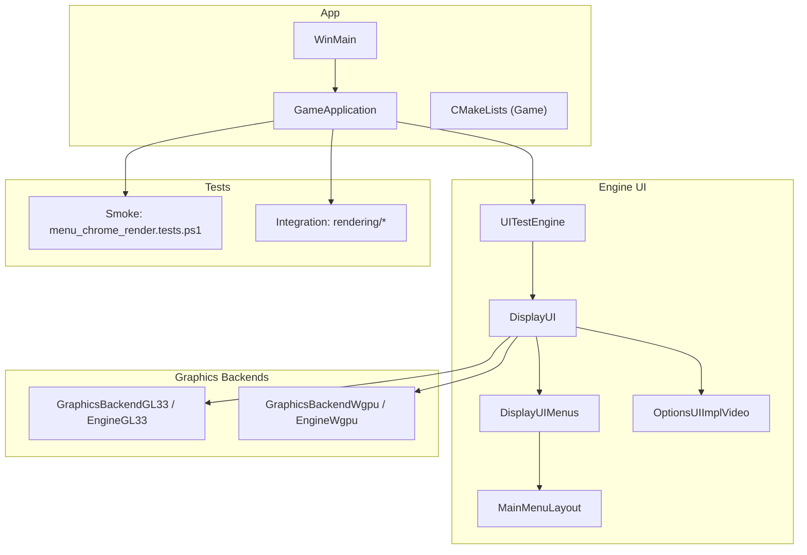
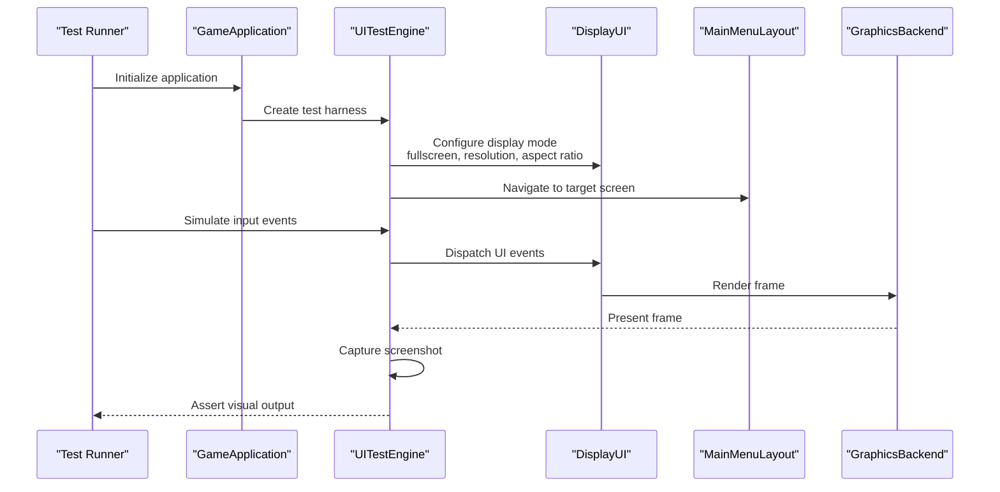
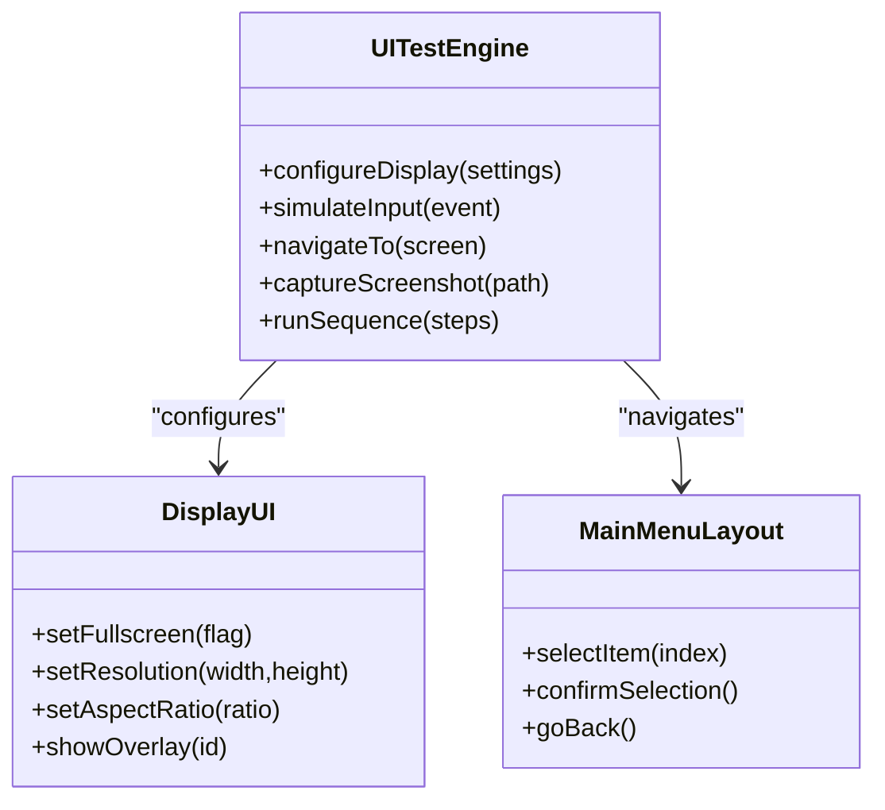
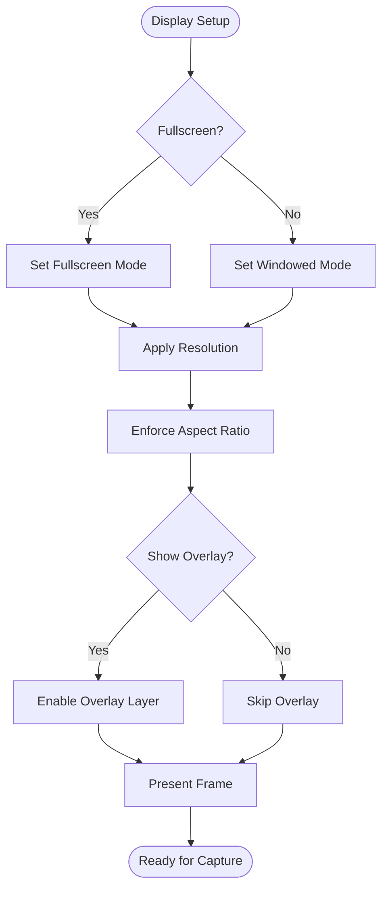
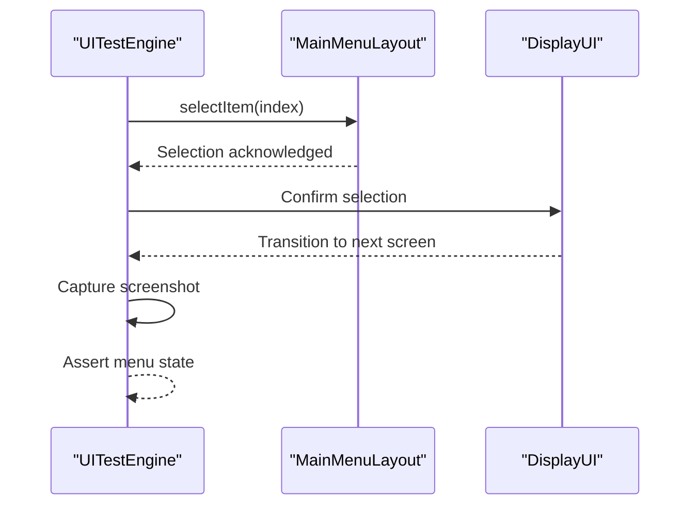
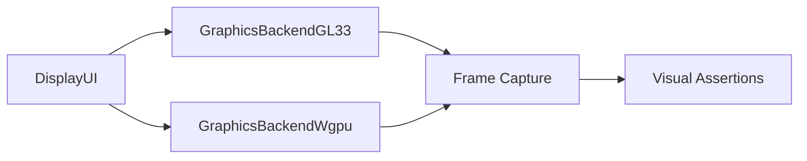
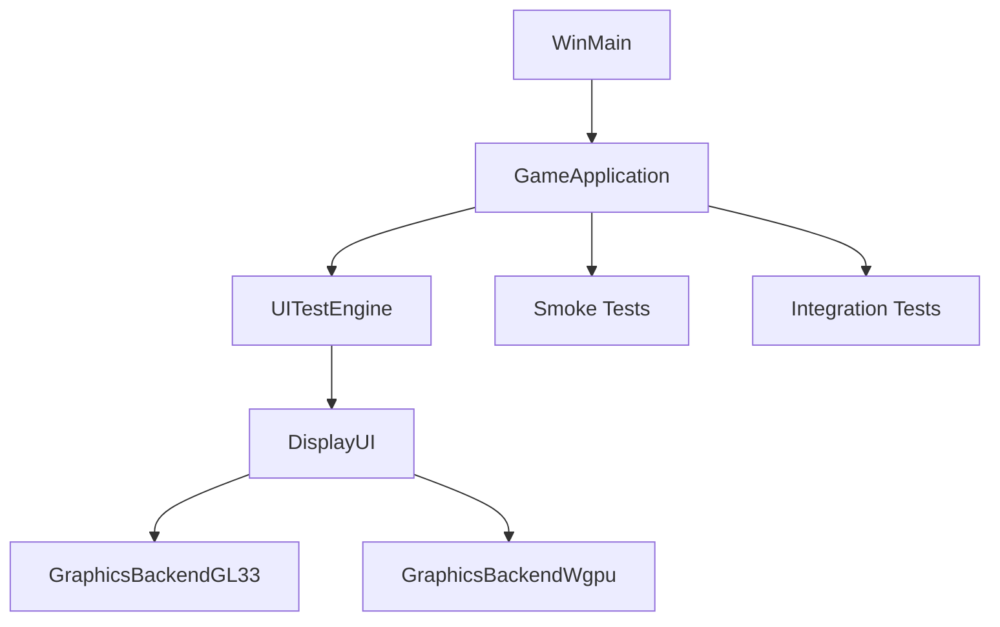

# UI and Rendering Tests

<cite>
**Referenced Files in This Document**
- [UITestEngine.cpp](file://engine/Poseidon/UI/UITestEngine.cpp)
- [UITestEngine.hpp](file://engine/Poseidon/UI/UITestEngine.hpp)
- [DisplayUI.cpp](file://engine/Poseidon/UI/DisplayUI.cpp)
- [DisplayUI.hpp](file://engine/Poseidon/UI/DisplayUI.hpp)
- [DisplayUIMenus.cpp](file://engine/Poseidon/UI/DisplayUIMenus.cpp)
- [MainMenuLayout.cpp](file://engine/Poseidon/UI/MainMenuLayout.cpp)
- [MainMenuLayout.hpp](file://engine/Poseidon/UI/MainMenuLayout.hpp)
- [OptionsUIImplVideo.cpp](file://engine/Poseidon/UI/OptionsUIImplVideo.cpp)
- [GraphicsBackendGL33.cpp](file://engine/PoseidonGL33/GraphicsBackendGL33.cpp)
- [EngineGL33.cpp](file://engine/PoseidonGL33/EngineGL33.cpp)
- [EngineWgpu.cpp](file://engine/WgpuRenderer/EngineWgpu.cpp)
- [GraphicsBackendWgpu.cpp](file://engine/WgpuRenderer/GraphicsBackendWgpu.cpp)
- [CMakeLists.txt](file://apps/cwr/Game/CMakeLists.txt)
- [GameApplication.cpp](file://apps/cwr/Game/GameApplication.cpp)
- [GameApplication.hpp](file://apps/cwr/Game/GameApplication.hpp)
- [WinMain.cpp](file://apps/cwr/Game/WinMain.cpp)
- [smoke/menu_chrome_render.tests.ps1](file://tests/smoke/menu_chrome_render.tests.ps1)
- [integration/rendering](file://tests/integration/rendering)
</cite>

## Table of Contents
1. Introduction
2. Project Structure
3. Core Components
4. Architecture Overview
5. Detailed Component Analysis
6. Dependency Analysis
7. Performance Considerations
8. Troubleshooting Guide
9. Conclusion

## Introduction
This document explains how to automate UI interaction testing, validate rendering output, and verify display settings across configurations in CWR-CE. It covers fullscreen mode testing, aspect ratio handling, overlay rendering, and main menu navigation automation. It also provides guidance on screenshot-based validation, pixel-perfect comparison techniques, GPU driver compatibility testing, performance profiling of rendering pipelines, memory usage monitoring during UI operations, and cross-platform graphics API testing. The content is grounded in the engine’s UI test harness, display subsystem, and graphics backends (OpenGL 3.3 and WGPU).

## Project Structure
The relevant parts for UI and rendering tests are spread across:
- Engine UI layer with a dedicated test harness
- Display and menu systems that drive UI state and layout
- Graphics backends for OpenGL 3.3 and WGPU
- Application entry points and build configuration for running tests
- Smoke and integration tests for visual regression and rendering checks

**Diagram sources**
- [WinMain.cpp](file://apps/cwr/Game/WinMain.cpp)
- [GameApplication.cpp](file://apps/cwr/Game/GameApplication.cpp)
- [CMakeLists.txt](file://apps/cwr/Game/CMakeLists.txt)
- [UITestEngine.cpp](file://engine/Poseidon/UI/UITestEngine.cpp)
- [DisplayUI.cpp](file://engine/Poseidon/UI/DisplayUI.cpp)
- [DisplayUIMenus.cpp](file://engine/Poseidon/UI/DisplayUIMenus.cpp)
- [MainMenuLayout.cpp](file://engine/Poseidon/UI/MainMenuLayout.cpp)
- [OptionsUIImplVideo.cpp](file://engine/Poseidon/UI/OptionsUIImplVideo.cpp)
- [GraphicsBackendGL33.cpp](file://engine/PoseidonGL33/GraphicsBackendGL33.cpp)
- [EngineGL33.cpp](file://engine/PoseidonGL33/EngineGL33.cpp)
- [GraphicsBackendWgpu.cpp](file://engine/WgpuRenderer/GraphicsBackendWgpu.cpp)
- [EngineWgpu.cpp](file://engine/WgpuRenderer/EngineWgpu.cpp)
- [smoke/menu_chrome_render.tests.ps1](file://tests/smoke/menu_chrome_render.tests.ps1)
- [integration/rendering](file://tests/integration/rendering)

**Section sources**
- [WinMain.cpp](file://apps/cwr/Game/WinMain.cpp)
- [GameApplication.cpp](file://apps/cwr/Game/GameApplication.cpp)
- [CMakeLists.txt](file://apps/cwr/Game/CMakeLists.txt)
- [UITestEngine.cpp](file://engine/Poseidon/UI/UITestEngine.cpp)
- [DisplayUI.cpp](file://engine/Poseidon/UI/DisplayUI.cpp)
- [DisplayUIMenus.cpp](file://engine/Poseidon/UI/DisplayUIMenus.cpp)
- [MainMenuLayout.cpp](file://engine/Poseidon/UI/MainMenuLayout.cpp)
- [OptionsUIImplVideo.cpp](file://engine/Poseidon/UI/OptionsUIImplVideo.cpp)
- [GraphicsBackendGL33.cpp](file://engine/PoseidonGL33/GraphicsBackendGL33.cpp)
- [EngineGL33.cpp](file://engine/PoseidonGL33/EngineGL33.cpp)
- [GraphicsBackendWgpu.cpp](file://engine/WgpuRenderer/GraphicsBackendWgpu.cpp)
- [EngineWgpu.cpp](file://engine/WgpuRenderer/EngineWgpu.cpp)
- [smoke/menu_chrome_render.tests.ps1](file://tests/smoke/menu_chrome_render.tests.ps1)
- [integration/rendering](file://tests/integration/rendering)

## Core Components
- UITestEngine: Provides an automated UI test harness to drive input events, navigate menus, and capture frames for assertions.
- DisplayUI: Manages display modes, resolution, fullscreen toggling, and overlays; centralizes UI lifecycle and event routing.
- DisplayUIMenus and MainMenuLayout: Implement menu screens and layout logic used by automated navigation flows.
- OptionsUIImplVideo: Exposes video/display options programmatically for setting up test configurations.
- GraphicsBackends (GL33 and WGPU): Provide the rendering pipeline abstraction used by tests to capture frames and assert rendering behavior.

Key responsibilities:
- Input simulation and event dispatch for UI automation
- Display mode switching and aspect ratio enforcement
- Frame capture and snapshot generation for visual regression
- Configuration-driven rendering setup for cross-API testing

**Section sources**
- [UITestEngine.cpp](file://engine/Poseidon/UI/UITestEngine.cpp)
- [UITestEngine.hpp](file://engine/Poseidon/UI/UITestEngine.hpp)
- [DisplayUI.cpp](file://engine/Poseidon/UI/DisplayUI.cpp)
- [DisplayUI.hpp](file://engine/Poseidon/UI/DisplayUI.hpp)
- [DisplayUIMenus.cpp](file://engine/Poseidon/UI/DisplayUIMenus.cpp)
- [MainMenuLayout.cpp](file://engine/Poseidon/UI/MainMenuLayout.cpp)
- [MainMenuLayout.hpp](file://engine/Poseidon/UI/MainMenuLayout.hpp)
- [OptionsUIImplVideo.cpp](file://engine/Poseidon/UI/OptionsUIImplVideo.cpp)
- [GraphicsBackendGL33.cpp](file://engine/PoseidonGL33/GraphicsBackendGL33.cpp)
- [EngineGL33.cpp](file://engine/PoseidonGL33/EngineGL33.cpp)
- [GraphicsBackendWgpu.cpp](file://engine/WgpuRenderer/GraphicsBackendWgpu.cpp)
- [EngineWgpu.cpp](file://engine/WgpuRenderer/EngineWgpu.cpp)

## Architecture Overview
The UI and rendering test architecture integrates the application entry point, the game application, the UI test harness, the display subsystem, and the graphics backends. Tests drive UI interactions through the test harness, which manipulates display settings and navigates menus. Rendering is performed via the selected backend, enabling cross-API validation.

**Diagram sources**
- [GameApplication.cpp](file://apps/cwr/Game/GameApplication.cpp)
- [UITestEngine.cpp](file://engine/Poseidon/UI/UITestEngine.cpp)
- [DisplayUI.cpp](file://engine/Poseidon/UI/DisplayUI.cpp)
- [MainMenuLayout.cpp](file://engine/Poseidon/UI/MainMenuLayout.cpp)
- [GraphicsBackendGL33.cpp](file://engine/PoseidonGL33/GraphicsBackendGL33.cpp)
- [GraphicsBackendWgpu.cpp](file://engine/WgpuRenderer/GraphicsBackendWgpu.cpp)

## Detailed Component Analysis

### UITestEngine: Automated UI Interaction and Screenshot Capture
- Purpose: Drive UI automation, simulate inputs, and capture frames for assertions.
- Capabilities:
  - Input simulation for keyboard/mouse/controller actions
  - Navigation across menus and screens
  - Frame capture and snapshot storage
  - Integration with display subsystem for mode changes
- Typical flow:
  - Initialize harness with desired display settings
  - Trigger menu navigation sequences
  - Capture screenshots at key states
  - Compare against baselines or perform structural checks

**Diagram sources**
- [UITestEngine.cpp](file://engine/Poseidon/UI/UITestEngine.cpp)
- [UITestEngine.hpp](file://engine/Poseidon/UI/UITestEngine.hpp)
- [DisplayUI.cpp](file://engine/Poseidon/UI/DisplayUI.cpp)
- [MainMenuLayout.cpp](file://engine/Poseidon/UI/MainMenuLayout.cpp)

**Section sources**
- [UITestEngine.cpp](file://engine/Poseidon/UI/UITestEngine.cpp)
- [UITestEngine.hpp](file://engine/Poseidon/UI/UITestEngine.hpp)

### DisplayUI: Display Modes, Aspect Ratio, and Overlays
- Responsibilities:
  - Manage fullscreen/windowed modes
  - Apply resolution and aspect ratio constraints
  - Control overlays and HUD layers
  - Coordinate with graphics backend for present cycle
- Testing implications:
  - Validate correct behavior when toggling fullscreen
  - Ensure aspect ratio enforcement across resolutions
  - Verify overlay visibility and z-ordering

**Diagram sources**
- [DisplayUI.cpp](file://engine/Poseidon/UI/DisplayUI.cpp)
- [DisplayUI.hpp](file://engine/Poseidon/UI/DisplayUI.hpp)

**Section sources**
- [DisplayUI.cpp](file://engine/Poseidon/UI/DisplayUI.cpp)
- [DisplayUI.hpp](file://engine/Poseidon/UI/DisplayUI.hpp)

### Main Menu Navigation Automation
- Focus: Automate selection, confirmation, and back navigation within the main menu.
- Key elements:
  - MainMenuLayout item selection and confirmation
  - Event dispatch through DisplayUI
  - State transitions between menu screens
- Automation pattern:
  - Use UITestEngine to simulate input events targeting specific menu items
  - Wait for UI state stabilization
  - Capture screenshots to validate menu appearance and selection indicators

**Diagram sources**
- [MainMenuLayout.cpp](file://engine/Poseidon/UI/MainMenuLayout.cpp)
- [MainMenuLayout.hpp](file://engine/Poseidon/UI/MainMenuLayout.hpp)
- [DisplayUI.cpp](file://engine/Poseidon/UI/DisplayUI.cpp)
- [UITestEngine.cpp](file://engine/Poseidon/UI/UITestEngine.cpp)

**Section sources**
- [MainMenuLayout.cpp](file://engine/Poseidon/UI/MainMenuLayout.cpp)
- [MainMenuLayout.hpp](file://engine/Poseidon/UI/MainMenuLayout.hpp)
- [DisplayUIMenus.cpp](file://engine/Poseidon/UI/DisplayUIMenus.cpp)

### Video Options and Display Settings Validation
- Purpose: Programmatically set and verify video/display options for consistent test environments.
- Coverage:
  - Resolution, refresh rate, fullscreen toggle
  - Aspect ratio presets and custom ratios
  - Overlay toggles and HUD visibility
- Approach:
  - Use OptionsUIImplVideo to apply settings before test runs
  - Re-read settings to confirm persistence and correctness
  - Validate rendering output under each configuration

**Section sources**
- [OptionsUIImplVideo.cpp](file://engine/Poseidon/UI/OptionsUIImplVideo.cpp)

### Graphics Backends: Cross-API Rendering and Frame Capture
- OpenGL 3.3 Backend:
  - Provides rendering pipeline and present mechanism
  - Enables frame capture for screenshot-based validation
- WGPU Backend:
  - Alternative rendering path for cross-platform and modern APIs
  - Supports similar capture and assertion workflows
- Testing strategy:
  - Run identical UI scenarios under both backends
  - Compare outputs to ensure consistency
  - Detect driver-specific issues via targeted comparisons

**Diagram sources**
- [GraphicsBackendGL33.cpp](file://engine/PoseidonGL33/GraphicsBackendGL33.cpp)
- [EngineGL33.cpp](file://engine/PoseidonGL33/EngineGL33.cpp)
- [GraphicsBackendWgpu.cpp](file://engine/WgpuRenderer/GraphicsBackendWgpu.cpp)
- [EngineWgpu.cpp](file://engine/WgpuRenderer/EngineWgpu.cpp)

**Section sources**
- [GraphicsBackendGL33.cpp](file://engine/PoseidonGL33/GraphicsBackendGL33.cpp)
- [EngineGL33.cpp](file://engine/PoseidonGL33/EngineGL33.cpp)
- [GraphicsBackendWgpu.cpp](file://engine/WgpuRenderer/GraphicsBackendWgpu.cpp)
- [EngineWgpu.cpp](file://engine/WgpuRenderer/EngineWgpu.cpp)

## Dependency Analysis
- Application Entry Points:
  - WinMain initializes the runtime and hands control to GameApplication
  - GameApplication constructs the UI test harness and display subsystem
- UI Layer Dependencies:
  - UITestEngine depends on DisplayUI for mode changes and on menu layouts for navigation
  - DisplayUI coordinates with graphics backends for rendering and presentation
- Test Execution:
  - Smoke tests invoke the application to validate menu chrome rendering
  - Integration tests exercise rendering paths and UI flows under varied configurations

**Diagram sources**
- [WinMain.cpp](file://apps/cwr/Game/WinMain.cpp)
- [GameApplication.cpp](file://apps/cwr/Game/GameApplication.cpp)
- [UITestEngine.cpp](file://engine/Poseidon/UI/UITestEngine.cpp)
- [DisplayUI.cpp](file://engine/Poseidon/UI/DisplayUI.cpp)
- [GraphicsBackendGL33.cpp](file://engine/PoseidonGL33/GraphicsBackendGL33.cpp)
- [GraphicsBackendWgpu.cpp](file://engine/WgpuRenderer/GraphicsBackendWgpu.cpp)
- [smoke/menu_chrome_render.tests.ps1](file://tests/smoke/menu_chrome_render.tests.ps1)
- [integration/rendering](file://tests/integration/rendering)

**Section sources**
- [WinMain.cpp](file://apps/cwr/Game/WinMain.cpp)
- [GameApplication.cpp](file://apps/cwr/Game/GameApplication.cpp)
- [CMakeLists.txt](file://apps/cwr/Game/CMakeLists.txt)
- [smoke/menu_chrome_render.tests.ps1](file://tests/smoke/menu_chrome_render.tests.ps1)
- [integration/rendering](file://tests/integration/rendering)

## Performance Considerations
- Rendering Pipeline Profiling:
  - Use backend-specific tools (e.g., RenderDoc for OpenGL, wgpu-profiler for WGPU) to capture frame timelines
  - Identify bottlenecks in draw calls, texture uploads, and shader compilation
- Memory Usage Monitoring:
  - Track allocations during UI operations and frame captures
  - Monitor GPU memory usage for textures and buffers created by overlays and HUDs
- Test Execution Optimization:
  - Parallelize independent UI scenarios where possible
  - Cache baseline screenshots per backend and configuration to reduce I/O overhead
  - Use deterministic input sequences to minimize flakiness

[No sources needed since this section provides general guidance]

## Troubleshooting Guide
- Screenshot Mismatches:
  - Normalize images for DPI and color space differences
  - Use tolerance-based pixel comparison for minor variations
  - Isolate backend-specific artifacts by comparing GL33 vs WGPU outputs
- Fullscreen and Aspect Ratio Issues:
  - Verify OS-level scaling settings do not interfere
  - Confirm aspect ratio enforcement after resolution changes
  - Check overlay z-ordering and clipping regions
- Driver Compatibility:
  - Reproduce failures on multiple GPU vendors and drivers
  - Log driver versions and feature levels for correlation
- Debugging UI Flows:
  - Step through input simulation and event dispatch
  - Inspect menu state transitions and selection indices
  - Validate that overlays are enabled/disabled as expected

**Section sources**
- [smoke/menu_chrome_render.tests.ps1](file://tests/smoke/menu_chrome_render.tests.ps1)
- [integration/rendering](file://tests/integration/rendering)

## Conclusion
CWR-CE provides a robust foundation for UI and rendering integration testing through its test harness, display subsystem, and pluggable graphics backends. By automating UI interactions, capturing frames, and validating display settings across configurations, teams can ensure visual consistency and reliability. Employing screenshot-based validation, pixel-perfect comparisons, and cross-API testing enables detection of regressions and driver-specific issues. With careful profiling and optimization, tests can be executed efficiently while maintaining high fidelity in visual regression detection.

[No sources needed since this section summarizes without analyzing specific files]