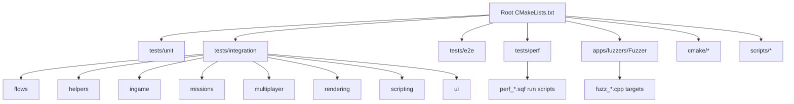
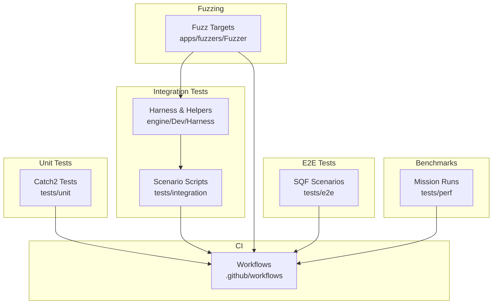
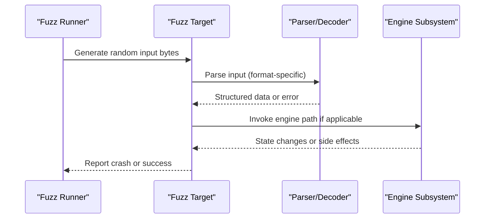
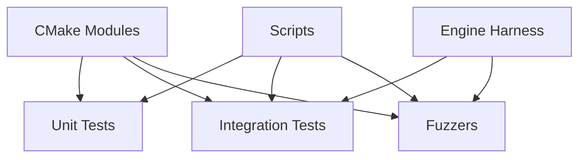

# Testing Framework

<cite>
**Referenced Files in This Document**
- [CMakeLists.txt](file://CMakeLists.txt)
- [CMakePresets.json](file://CMakePresets.json)
- [cmake/CatchAddWindowsSafeTests.cmake](file://cmake/CatchAddWindowsSafeTests.cmake)
- [cmake/CatchWindowsSafe.cmake](file://cmake/CatchWindowsSafe.cmake)
- [cmake/RunTridentCTest.cmake](file://cmake/RunTridentCTest.cmake)
- [cmake/TridentCTest.cmake](file://cmake/TridentCTest.cmake)
- [cmake/toolchains/linux-x64-clang-fuzz.cmake](file://cmake/toolchains/linux-x64-clang-fuzz.cmake)
- [cmake/toolchains/win-x64-clang-fuzz.cmake](file://cmake/toolchains/win-x64-clang-fuzz.cmake)
- [apps/fuzzers/Fuzzer/CMakeLists.txt](file://apps/fuzzers/Fuzzer/CMakeLists.txt)
- [apps/fuzzers/Fuzzer/fuzz_decode_msg.cpp](file://apps/fuzzers/Fuzzer/fuzz_decode_msg.cpp)
- [apps/fuzzers/Fuzzer/fuzz_init.hpp](file://apps/fuzzers/Fuzzer/fuzz_init.hpp)
- [apps/fuzzers/Fuzzer/fuzz_lip.cpp](file://apps/fuzzers/Fuzzer/fuzz_lip.cpp)
- [apps/fuzzers/Fuzzer/fuzz_p3d.cpp](file://apps/fuzzers/Fuzzer/fuzz_p3d.cpp)
- [apps/fuzzers/Fuzzer/fuzz_paa.cpp](file://apps/fuzzers/Fuzzer/fuzz_paa.cpp)
- [apps/fuzzers/Fuzzer/fuzz_paramfile.cpp](file://apps/fuzzers/Fuzzer/fuzz_paramfile.cpp)
- [apps/fuzzers/Fuzzer/fuzz_pbo.cpp](file://apps/fuzzers/Fuzzer/fuzz_pbo.cpp)
- [apps/fuzzers/Fuzzer/fuzz_rtm.cpp](file://apps/fuzzers/Fuzzer/fuzz_rtm.cpp)
- [apps/fuzzers/Fuzzer/fuzz_savegame.cpp](file://apps/fuzzers/Fuzzer/fuzz_savegame.cpp)
- [apps/fuzzers/Fuzzer/fuzz_shape.cpp](file://apps/fuzzers/Fuzzer/fuzz_shape.cpp)
- [apps/fuzzers/Fuzzer/fuzz_sqf.cpp](file://apps/fuzzers/Fuzzer/fuzz_sqf.cpp)
- [apps/fuzzers/Fuzzer/fuzz_sqf_exec.cpp](file://apps/fuzzers/Fuzzer/fuzz_sqf_exec.cpp)
- [apps/fuzzers/Fuzzer/fuzz_sqs.cpp](file://apps/fuzzers/Fuzzer/fuzz_sqs.cpp)
- [apps/fuzzers/Fuzzer/fuzz_stringtable.cpp](file://apps/fuzzers/Fuzzer/fuzz_stringtable.cpp)
- [apps/fuzzers/Fuzzer/fuzz_structure.hpp](file://apps/fuzzers/Fuzzer/fuzz_structure.hpp)
- [apps/fuzzers/Fuzzer/fuzz_wav.cpp](file://apps/fuzzers/Fuzzer/fuzz_wav.cpp)
- [apps/fuzzers/Fuzzer/fuzz_wrp.cpp](file://apps/fuzzers/Fuzzer/fuzz_wrp.cpp)
- [apps/fuzzers/Fuzzer/fuzz_wss.cpp](file://apps/fuzzers/Fuzzer/fuzz_wss.cpp)
- [tests/unit/engine/...](file://tests/unit/engine)
- [tests/integration/flows/...](file://tests/integration/flows)
- [tests/integration/helpers/...](file://tests/integration/helpers)
- [tests/integration/ingame/...](file://tests/integration/ingame)
- [tests/integration/missions/...](file://tests/integration/missions)
- [tests/integration/multiplayer/...](file://tests/integration/multiplayer)
- [tests/integration/rendering/...](file://tests/integration/rendering)
- [tests/integration/scripting/...](file://tests/integration/scripting)
- [tests/integration/ui/...](file://tests/integration/ui)
- [tests/e2e/master_server_browser_visibility.test.sqf](file://tests/e2e/master_server_browser_visibility.test.sqf)
- [tests/fixtures/ASSET_SOURCES.md](file://tests/fixtures/ASSET_SOURCES.md)
- [tests/perf/missions/perf_abel.abel/run.sqf](file://tests/perf/missions/perf_abel.abel/run.sqf)
- [tests/perf/missions/perf_combat.eden/run.sqf](file://tests/perf/missions/perf_combat.eden/run.sqf)
- [tests/perf/missions/perf_field.eden/run.sqf](file://tests/perf/missions/perf_field.eden/run.sqf)
- [tests/perf/missions/perf_town.noe/run.sqf](file://tests/perf/missions/perf_town.noe/run.sqf)
- [tests/perf/missions/perf_water.eden/run.sqf](file://tests/perf/missions/perf_water.eden/run.sqf)
- [scripts/Build.ps1](file://scripts/Build.ps1)
- [scripts/CwaCommon.ps1](file://scripts/CwaCommon.ps1)
- [scripts/Install.ps1](file://scripts/Install.ps1)
- [scripts/Start.ps1](file://scripts/Start.ps1)
- [.github/workflows/...](file://.github/workflows)
</cite>

## Table of Contents
1. [Introduction](#introduction)
2. [Project Structure](#project-structure)
3. [Core Components](#core-components)
4. [Architecture Overview](#architecture-overview)
5. [Detailed Component Analysis](#detailed-component-analysis)
6. [Dependency Analysis](#dependency-analysis)
7. [Performance Considerations](#performance-considerations)
8. [Troubleshooting Guide](#troubleshooting-guide)
9. [Conclusion](#conclusion)
10. [Appendices](#appendices)

## Introduction
This document explains the multi-layered testing approach used in CWR-CE, covering unit tests with Catch2, integration testing via automated scenarios, fuzzing for security and stability, end-to-end testing, performance benchmarks, and continuous integration setup. It also documents the test harness architecture, mock implementations, assertion libraries, test data management, result reporting, CI/CD automation, debugging techniques, cross-platform considerations, and performance regression detection.

## Project Structure
The repository organizes tests across multiple layers:
- Unit tests under tests/unit (engine and apps subfolders)
- Integration tests under tests/integration (flows, helpers, ingame, missions, multiplayer, rendering, scripting, ui)
- End-to-end tests under tests/e2e (SQF-based scenarios)
- Performance benchmarks under tests/perf (missions with run scripts)
- Fuzzers under apps/fuzzers/Fuzzer (one fuzzer per input format)
- Test harness and utilities under engine/Dev/Harness and cmake/*
- Fixtures and assets under tests/fixtures

**Diagram sources**
- [CMakeLists.txt](file://CMakeLists.txt)
- [cmake/CatchAddWindowsSafeTests.cmake](file://cmake/CatchAddWindowsSafeTests.cmake)
- [cmake/CatchWindowsSafe.cmake](file://cmake/CatchWindowsSafe.cmake)
- [cmake/RunTridentCTest.cmake](file://cmake/RunTridentCTest.cmake)
- [cmake/TridentCTest.cmake](file://cmake/TridentCTest.cmake)
- [apps/fuzzers/Fuzzer/CMakeLists.txt](file://apps/fuzzers/Fuzzer/CMakeLists.txt)

**Section sources**
- [CMakeLists.txt](file://CMakeLists.txt)
- [CMakePresets.json](file://CMakePresets.json)
- [cmake/CatchAddWindowsSafeTests.cmake](file://cmake/CatchAddWindowsSafeTests.cmake)
- [cmake/CatchWindowsSafe.cmake](file://cmake/CatchWindowsSafe.cmake)
- [cmake/RunTridentCTest.cmake](file://cmake/RunTridentCTest.cmake)
- [cmake/TridentCTest.cmake](file://cmake/TridentCTest.cmake)
- [apps/fuzzers/Fuzzer/CMakeLists.txt](file://apps/fuzzers/Fuzzer/CMakeLists.txt)

## Core Components
- Unit testing framework: Catch2 is integrated via CMake helper modules to discover and run tests on Windows safely. The project uses standard Catch2 assertions and test organization patterns.
- Integration testing: Automated scenarios are implemented as SQF scripts executed by a harness that boots the game engine, loads missions, and validates outcomes. Helpers provide common utilities for scenario control.
- Fuzzing: Dedicated fuzz targets cover parsing and execution paths for various file formats and scripts. Each fuzzer focuses on a specific decoder or evaluator path.
- End-to-end testing: SQF-based e2e tests exercise higher-level workflows such as master server browser visibility.
- Performance benchmarks: Mission-based benchmarks measure frame times and resource usage across representative scenarios.
- Test harness: Engine-side harness components initialize subsystems, manage lifecycle, and expose hooks for tests. Mock objects enable isolation of external dependencies.

Key implementation references:
- Catch2 integration and Windows-safe test discovery: [cmake/CatchAddWindowsSafeTests.cmake](file://cmake/CatchAddWindowsSafeTests.cmake), [cmake/CatchWindowsSafe.cmake](file://cmake/CatchWindowsSafe.cmake)
- Trident test runner integration: [cmake/RunTridentCTest.cmake](file://cmake/RunTridentCTest.cmake), [cmake/TridentCTest.cmake](file://cmake/TridentCTest.cmake)
- Fuzzer targets and entry points: [apps/fuzzers/Fuzzer/CMakeLists.txt](file://apps/fuzzers/Fuzzer/CMakeLists.txt), [apps/fuzzers/Fuzzer/fuzz_init.hpp](file://apps/fuzzers/Fuzzer/fuzz_init.hpp), [apps/fuzzers/Fuzzer/fuzz_structure.hpp](file://apps/fuzzers/Fuzzer/fuzz_structure.hpp)
- Engine harness and mocks: [engine/Dev/Harness](file://engine/Dev/Harness), [engine/Evaluator/MockObjects.cpp](file://engine/Evaluator/MockObjects.cpp), [engine/Evaluator/MockObjects.hpp](file://engine/Evaluator/MockObjects.hpp)

**Section sources**
- [cmake/CatchAddWindowsSafeTests.cmake](file://cmake/CatchAddWindowsSafeTests.cmake)
- [cmake/CatchWindowsSafe.cmake](file://cmake/CatchWindowsSafe.cmake)
- [cmake/RunTridentCTest.cmake](file://cmake/RunTridentCTest.cmake)
- [cmake/TridentCTest.cmake](file://cmake/TridentCTest.cmake)
- [apps/fuzzers/Fuzzer/CMakeLists.txt](file://apps/fuzzers/Fuzzer/CMakeLists.txt)
- [apps/fuzzers/Fuzzer/fuzz_init.hpp](file://apps/fuzzers/Fuzzer/fuzz_init.hpp)
- [apps/fuzzers/Fuzzer/fuzz_structure.hpp](file://apps/fuzzers/Fuzzer/fuzz_structure.hpp)
- [engine/Evaluator/MockObjects.cpp](file://engine/Evaluator/MockObjects.cpp)
- [engine/Evaluator/MockObjects.hpp](file://engine/Evaluator/MockObjects.hpp)

## Architecture Overview
The testing architecture spans multiple layers and tools:
- Unit tests use Catch2 directly against engine code paths.
- Integration tests use a harness to boot the engine, load missions, and assert behavior through scripted interactions.
- Fuzzers target parsers and evaluators with synthetic inputs to uncover crashes and undefined behavior.
- E2E tests validate end-to-end user flows using SQF scripts.
- Benchmarks measure performance across representative missions.
- CI orchestrates builds, runs tests, and reports results.

**Diagram sources**
- [cmake/RunTridentCTest.cmake](file://cmake/RunTridentCTest.cmake)
- [cmake/TridentCTest.cmake](file://cmake/TridentCTest.cmake)
- [apps/fuzzers/Fuzzer/CMakeLists.txt](file://apps/fuzzers/Fuzzer/CMakeLists.txt)
- [tests/e2e/master_server_browser_visibility.test.sqf](file://tests/e2e/master_server_browser_visibility.test.sqf)
- [tests/perf/missions/perf_abel.abel/run.sqf](file://tests/perf/missions/perf_abel.abel/run.sqf)

## Detailed Component Analysis

### Unit Testing with Catch2
- Organization: Unit tests live under tests/unit, grouped by engine subsystems and applications.
- Assertions: Standard Catch2 macros are used for assertions and test case definitions.
- Discovery: CMake helper modules integrate Catch2 test discovery and ensure Windows compatibility.
- Execution: Tests are built as separate executables and run via CTest or custom runners.

Practical example pattern:
- Define a test suite with a descriptive name.
- Write individual test cases using Catch2 macros.
- Use fixtures to set up shared state.
- Assert expected behavior with Catch2 matchers.

**Section sources**
- [cmake/CatchAddWindowsSafeTests.cmake](file://cmake/CatchAddWindowsSafeTests.cmake)
- [cmake/CatchWindowsSafe.cmake](file://cmake/CatchWindowsSafe.cmake)
- [tests/unit/engine](file://tests/unit/engine)

### Integration Testing with Automated Scenarios
- Scenario structure: SQF scripts define mission setups, actions, and assertions.
- Harness: Engine harness initializes subsystems and provides hooks for test control.
- Helpers: Common utilities abstract repeated setup and teardown logic.
- Execution: Scenarios are launched by a runner that monitors progress and captures logs.

Implementation details:
- Place scenarios under tests/integration with clear naming conventions.
- Use helpers for common operations like spawning entities or sending messages.
- Capture outputs and logs for analysis.
- Validate mission state transitions and UI behaviors.

**Section sources**
- [tests/integration/flows](file://tests/integration/flows)
- [tests/integration/helpers](file://tests/integration/helpers)
- [tests/integration/ingame](file://tests/integration/ingame)
- [tests/integration/missions](file://tests/integration/missions)
- [tests/integration/multiplayer](file://tests/integration/multiplayer)
- [tests/integration/rendering](file://tests/integration/rendering)
- [tests/integration/scripting](file://tests/integration/scripting)
- [tests/integration/ui](file://tests/integration/ui)

### Fuzzing for Security and Stability
- Fuzz targets: One per input format or parser path (e.g., decode message, P3D, PAA, paramfile, PBO, RTM, savegame, shape, SQF, SQS, stringtable, WAV, WRP, WSS).
- Entry points: Each fuzzer exposes an entry function that processes arbitrary input bytes.
- Initialization: Shared initialization sets up minimal engine state required for parsing.
- Data structures: Common structures define how inputs are interpreted and fed into decoders.

**Diagram sources**
- [apps/fuzzers/Fuzzer/fuzz_decode_msg.cpp](file://apps/fuzzers/Fuzzer/fuzz_decode_msg.cpp)
- [apps/fuzzers/Fuzzer/fuzz_p3d.cpp](file://apps/fuzzers/Fuzzer/fuzz_p3d.cpp)
- [apps/fuzzers/Fuzzer/fuzz_paa.cpp](file://apps/fuzzers/Fuzzer/fuzz_paa.cpp)
- [apps/fuzzers/Fuzzer/fuzz_paramfile.cpp](file://apps/fuzzers/Fuzzer/fuzz_paramfile.cpp)
- [apps/fuzzers/Fuzzer/fuzz_pbo.cpp](file://apps/fuzzers/Fuzzer/fuzz_pbo.cpp)
- [apps/fuzzers/Fuzzer/fuzz_rtm.cpp](file://apps/fuzzers/Fuzzer/fuzz_rtm.cpp)
- [apps/fuzzers/Fuzzer/fuzz_savegame.cpp](file://apps/fuzzers/Fuzzer/fuzz_savegame.cpp)
- [apps/fuzzers/Fuzzer/fuzz_shape.cpp](file://apps/fuzzers/Fuzzer/fuzz_shape.cpp)
- [apps/fuzzers/Fuzzer/fuzz_sqf.cpp](file://apps/fuzzers/Fuzzer/fuzz_sqf.cpp)
- [apps/fuzzers/Fuzzer/fuzz_sqf_exec.cpp](file://apps/fuzzers/Fuzzer/fuzz_sqf_exec.cpp)
- [apps/fuzzers/Fuzzer/fuzz_sqs.cpp](file://apps/fuzzers/Fuzzer/fuzz_sqs.cpp)
- [apps/fuzzers/Fuzzer/fuzz_stringtable.cpp](file://apps/fuzzers/Fuzzer/fuzz_stringtable.cpp)
- [apps/fuzzers/Fuzzer/fuzz_wav.cpp](file://apps/fuzzers/Fuzzer/fuzz_wav.cpp)
- [apps/fuzzers/Fuzzer/fuzz_wrp.cpp](file://apps/fuzzers/Fuzzer/fuzz_wrp.cpp)
- [apps/fuzzers/Fuzzer/fuzz_wss.cpp](file://apps/fuzzers/Fuzzer/fuzz_wss.cpp)
- [apps/fuzzers/Fuzzer/fuzz_init.hpp](file://apps/fuzzers/Fuzzer/fuzz_init.hpp)
- [apps/fuzzers/Fuzzer/fuzz_structure.hpp](file://apps/fuzzers/Fuzzer/fuzz_structure.hpp)

**Section sources**
- [apps/fuzzers/Fuzzer/CMakeLists.txt](file://apps/fuzzers/Fuzzer/CMakeLists.txt)
- [apps/fuzzers/Fuzzer/fuzz_init.hpp](file://apps/fuzzers/Fuzzer/fuzz_init.hpp)
- [apps/fuzzers/Fuzzer/fuzz_structure.hpp](file://apps/fuzzers/Fuzzer/fuzz_structure.hpp)

### End-to-End Testing
- Purpose: Validate complete user workflows across subsystems.
- Example: Master server browser visibility test ensures network discovery works end-to-end.
- Execution: SQF scripts drive the client and server states, asserting observable outcomes.

**Section sources**
- [tests/e2e/master_server_browser_visibility.test.sqf](file://tests/e2e/master_server_browser_visibility.test.sqf)

### Performance Benchmarks
- Structure: Benchmark missions include run scripts to execute and collect metrics.
- Coverage: Representative scenarios (e.g., Abel, Combat, Field, Town, Water) stress different engine features.
- Metrics: Frame times, memory usage, and resource loading durations are captured.

**Section sources**
- [tests/perf/missions/perf_abel.abel/run.sqf](file://tests/perf/missions/perf_abel.abel/run.sqf)
- [tests/perf/missions/perf_combat.eden/run.sqf](file://tests/perf/missions/perf_combat.eden/run.sqf)
- [tests/perf/missions/perf_field.eden/run.sqf](file://tests/perf/missions/perf_field.eden/run.sqf)
- [tests/perf/missions/perf_town.noe/run.sqf](file://tests/perf/missions/perf_town.noe/run.sqf)
- [tests/perf/missions/perf_water.eden/run.sqf](file://tests/perf/missions/perf_water.eden/run.sqf)

### Test Harness Architecture and Mock Implementations
- Harness: Initializes engine subsystems, manages lifecycle, and exposes hooks for tests.
- Mocks: Provide stub implementations for external dependencies (e.g., audio, graphics, networking).
- Usage: Tests inject mocks to isolate behavior and verify interactions.

**Section sources**
- [engine/Dev/Harness](file://engine/Dev/Harness)
- [engine/Evaluator/MockObjects.cpp](file://engine/Evaluator/MockObjects.cpp)
- [engine/Evaluator/MockObjects.hpp](file://engine/Evaluator/MockObjects.hpp)

## Dependency Analysis
Testing components depend on:
- CMake modules for test discovery and runner integration.
- Engine harness for bootstrapping and lifecycle management.
- Fuzzer toolchains for sanitizers and coverage.
- Scripts for build and install automation.

**Diagram sources**
- [cmake/CatchAddWindowsSafeTests.cmake](file://cmake/CatchAddWindowsSafeTests.cmake)
- [cmake/CatchWindowsSafe.cmake](file://cmake/CatchWindowsSafe.cmake)
- [cmake/RunTridentCTest.cmake](file://cmake/RunTridentCTest.cmake)
- [cmake/TridentCTest.cmake](file://cmake/TridentCTest.cmake)
- [scripts/Build.ps1](file://scripts/Build.ps1)
- [scripts/CwaCommon.ps1](file://scripts/CwaCommon.ps1)
- [scripts/Install.ps1](file://scripts/Install.ps1)
- [scripts/Start.ps1](file://scripts/Start.ps1)

**Section sources**
- [cmake/CatchAddWindowsSafeTests.cmake](file://cmake/CatchAddWindowsSafeTests.cmake)
- [cmake/CatchWindowsSafe.cmake](file://cmake/CatchWindowsSafe.cmake)
- [cmake/RunTridentCTest.cmake](file://cmake/RunTridentCTest.cmake)
- [cmake/TridentCTest.cmake](file://cmake/TridentCTest.cmake)
- [scripts/Build.ps1](file://scripts/Build.ps1)
- [scripts/CwaCommon.ps1](file://scripts/CwaCommon.ps1)
- [scripts/Install.ps1](file://scripts/Install.ps1)
- [scripts/Start.ps1](file://scripts/Start.ps1)

## Performance Considerations
- Benchmark selection: Choose representative missions that stress CPU, GPU, and I/O paths.
- Metric collection: Ensure consistent logging and profiling hooks are enabled during runs.
- Regression detection: Compare benchmark results across commits to detect performance regressions.
- Isolation: Run benchmarks in controlled environments to minimize noise.

[No sources needed since this section provides general guidance]

## Troubleshooting Guide
- Unit test failures: Inspect Catch2 output for assertion details and stack traces.
- Integration test issues: Review harness logs and scenario outputs; validate mission state transitions.
- Fuzzer crashes: Use sanitizer-enabled builds to capture detailed diagnostics; reduce inputs to minimal reproductions.
- E2E test flakiness: Check network conditions and timing assumptions; add retries where appropriate.
- Performance anomalies: Verify hardware configuration and driver versions; compare baseline metrics.

**Section sources**
- [cmake/CatchAddWindowsSafeTests.cmake](file://cmake/CatchAddWindowsSafeTests.cmake)
- [cmake/CatchWindowsSafe.cmake](file://cmake/CatchWindowsSafe.cmake)
- [cmake/RunTridentCTest.cmake](file://cmake/RunTridentCTest.cmake)
- [cmake/TridentCTest.cmake](file://cmake/TridentCTest.cmake)

## Conclusion
CWR-CE employs a comprehensive testing strategy combining unit tests with Catch2, integration scenarios driven by a harness, fuzzers for robustness, end-to-end validations, and performance benchmarks. The modular architecture enables clear separation of concerns, while CI automation ensures consistent quality across platforms. By following the documented patterns and practices, contributors can write reliable tests, maintain stability, and detect regressions early.

[No sources needed since this section summarizes without analyzing specific files]

## Appendices

### Test Data Management
- Fixtures: Centralized assets under tests/fixtures provide consistent inputs for tests.
- Asset sources: Documentation describes origins and licensing of test assets.
- Versioning: Keep fixtures aligned with engine expectations to avoid breakage.

**Section sources**
- [tests/fixtures/ASSET_SOURCES.md](file://tests/fixtures/ASSET_SOURCES.md)

### Continuous Integration Setup
- Workflows: GitHub Actions orchestrate builds, tests, and reports.
- Presets: CMake presets configure builds for different platforms and sanitizers.
- Toolchains: Specialized toolchains enable fuzzing and sanitizer runs.

**Section sources**
- [CMakePresets.json](file://CMakePresets.json)
- [cmake/toolchains/linux-x64-clang-fuzz.cmake](file://cmake/toolchains/linux-x64-clang-fuzz.cmake)
- [cmake/toolchains/win-x64-clang-fuzz.cmake](file://cmake/toolchains/win-x64-clang-fuzz.cmake)
- [.github/workflows](file://.github/workflows)

### Cross-Platform Testing Considerations
- Platform differences: Account for OS-specific behaviors in tests and harness.
- Sanitizers: Use platform-appropriate sanitizer configurations.
- File paths: Normalize paths and handle case sensitivity differences.

**Section sources**
- [cmake/toolchains/linux-x64-clang-fuzz.cmake](file://cmake/toolchains/linux-x64-clang-fuzz.cmake)
- [cmake/toolchains/win-x64-clang-fuzz.cmake](file://cmake/toolchains/win-x64-clang-fuzz.cmake)

### Debugging Techniques for Failing Tests
- Verbose logging: Enable detailed logs in harness and scenarios.
- Minimal reproduction: Reduce test inputs to isolate failures.
- Interactive runs: Execute tests locally with debugger attached.

**Section sources**
- [cmake/RunTridentCTest.cmake](file://cmake/RunTridentCTest.cmake)
- [cmake/TridentCTest.cmake](file://cmake/TridentCTest.cmake)