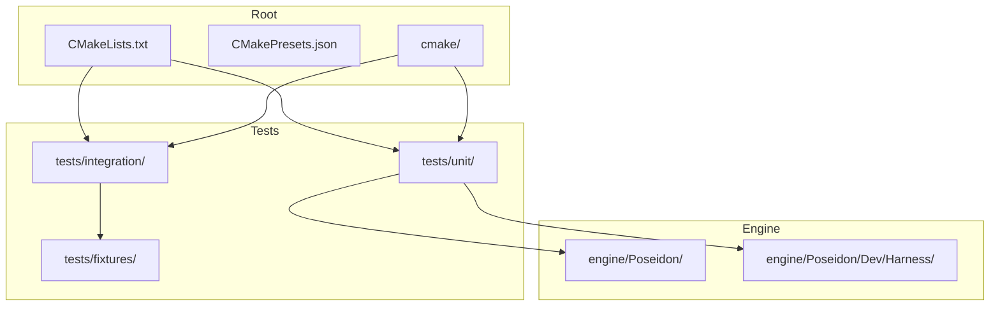
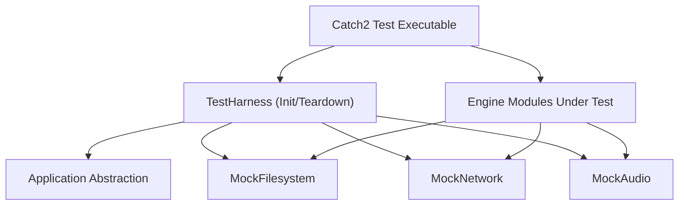
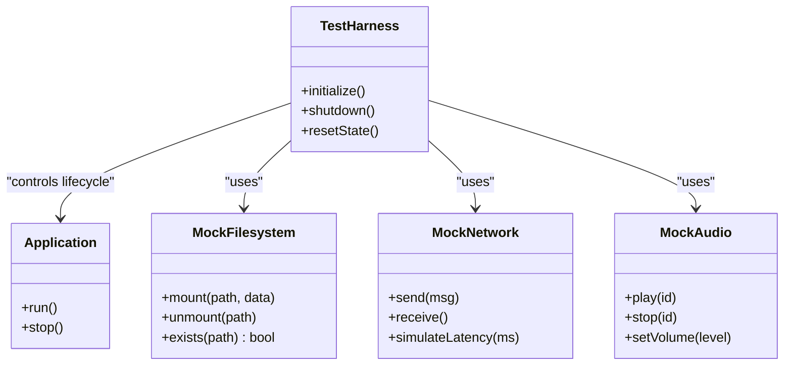
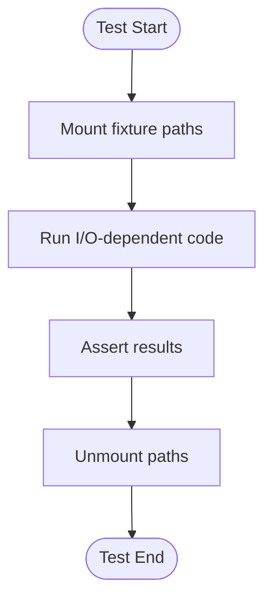
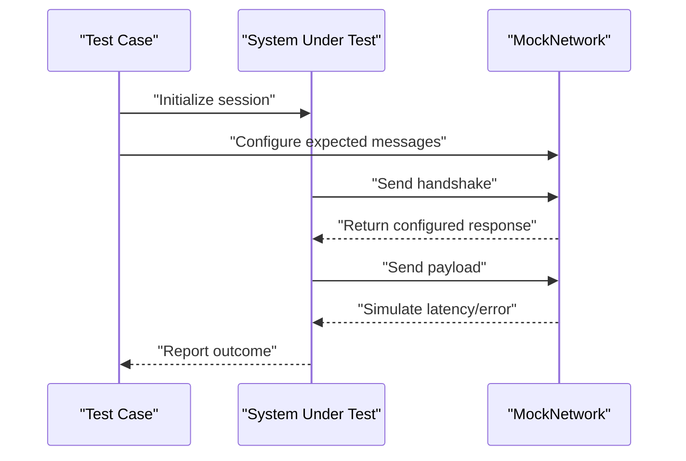
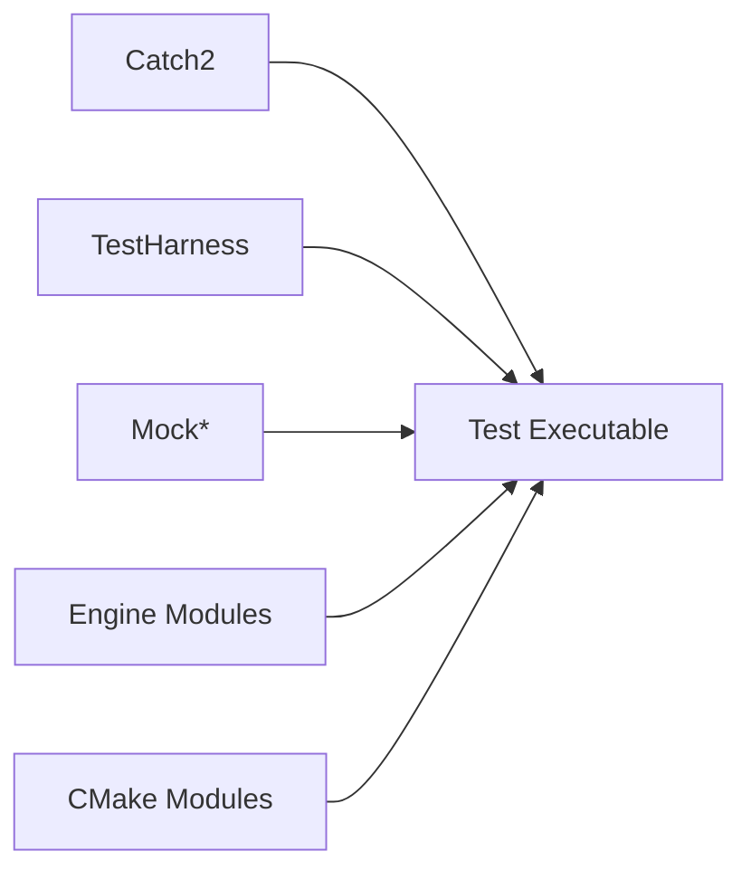

# Unit Testing

<cite>
**Referenced Files in This Document**
- [CMakeLists.txt](file://CMakeLists.txt)
- [CMakePresets.json](file://CMakePresets.json)
- [cmake/CatchAddWindowsSafeTests.cmake](file://cmake/CatchAddWindowsSafeTests.cmake)
- [cmake/CatchWindowsSafe.cmake](file://cmake/CatchWindowsSafe.cmake)
- [cmake/TridentCTest.cmake](file://cmake/TridentCTest.cmake)
- [tests/unit/engine/Foundation/Common/tests.cpp](file://tests/unit/engine/Foundation/Common/tests.cpp)
- [tests/unit/engine/Foundation/Containers/tests.cpp](file://tests/unit/engine/Foundation/Containers/tests.cpp)
- [tests/unit/engine/Foundation/Math/tests.cpp](file://tests/unit/engine/Foundation/Math/tests.cpp)
- [tests/unit/engine/IO/Filesystem/tests.cpp](file://tests/unit/engine/IO/Filesystem/tests.cpp)
- [tests/unit/engine/Network/tests.cpp](file://tests/unit/engine/Network/tests.cpp)
- [tests/unit/apps/GameDemo/GameDemoApplication_test.cpp](file://tests/unit/apps/GameDemo/GameDemoApplication_test.cpp)
- [tests/integration/flows/test_runner.cpp](file://tests/integration/flows/test_runner.cpp)
- [tests/fixtures/ASSET_SOURCES.md](file://tests/fixtures/ASSET_SOURCES.md)
- [engine/Poseidon/Core/Application.hpp](file://engine/Poseidon/Core/Application.hpp)
- [engine/Poseidon/Core/Global.hpp](file://engine/Poseidon/Core/Global.hpp)
- [engine/Poseidon/Dev/Harness/TestHarness.hpp](file://engine/Poseidon/Dev/Harness/TestHarness.hpp)
- [engine/Poseidon/Dev/Harness/TestHarness.cpp](file://engine/Poseidon/Dev/Harness/TestHarness.cpp)
- [engine/Poseidon/Dev/Harness/MockFilesystem.hpp](file://engine/Poseidon/Dev/Harness/MockFilesystem.hpp)
- [engine/Poseidon/Dev/Harness/MockFilesystem.cpp](file://engine/Poseidon/Dev/Harness/MockFilesystem.cpp)
- [engine/Poseidon/Dev/Harness/MockNetwork.hpp](file://engine/Poseidon/Dev/Harness/MockNetwork.hpp)
- [engine/Poseidon/Dev/Harness/MockNetwork.cpp](file://engine/Poseidon/Dev/Harness/MockNetwork.cpp)
- [engine/Poseidon/Dev/Harness/MockAudio.hpp](file://engine/Poseidon/Dev/Harness/MockAudio.hpp)
- [engine/Poseidon/Dev/Harness/MockAudio.cpp](file://engine/Poseidon/Dev/Harness/MockAudio.cpp)
</cite>

## Table of Contents
1. [Introduction](#introduction)
2. [Project Structure](#project-structure)
3. [Core Components](#core-components)
4. [Architecture Overview](#architecture-overview)
5. [Detailed Component Analysis](#detailed-component-analysis)
6. [Dependency Analysis](#dependency-analysis)
7. [Performance Considerations](#performance-considerations)
8. [Troubleshooting Guide](#troubleshooting-guide)
9. [Conclusion](#conclusion)
10. [Appendices](#appendices)

## Introduction
This document explains the Catch2-based unit testing framework used across CWR-CE. It covers test organization, assertion patterns, mock implementations, and best practices for writing maintainable tests for engine components, game logic, and utilities. It also includes guidance for testing asynchronous operations, file I/O, and network code with proper mocking strategies, as well as fixture patterns, setup/teardown procedures, parameterized testing approaches, cross-platform considerations, and platform-specific cases.

## Project Structure
The repository organizes tests under a dedicated directory tree:
- Unit tests live under tests/unit, mirroring engine modules to keep tests close to their targets.
- Integration tests are under tests/integration, including flows and scenarios that exercise larger subsystems.
- Fixtures and shared assets are under tests/fixtures, providing deterministic inputs for tests.
- CMake integration for Catch2 is provided via custom scripts and presets.

**Diagram sources**
- [CMakeLists.txt](file://CMakeLists.txt)
- [CMakePresets.json](file://CMakePresets.json)
- [cmake/CatchAddWindowsSafeTests.cmake](file://cmake/CatchAddWindowsSafeTests.cmake)
- [cmake/CatchWindowsSafe.cmake](file://cmake/CatchWindowsSafe.cmake)
- [cmake/TridentCTest.cmake](file://cmake/TridentCTest.cmake)
- [tests/unit/engine/Foundation/Common/tests.cpp](file://tests/unit/engine/Foundation/Common/tests.cpp)
- [tests/unit/engine/Foundation/Containers/tests.cpp](file://tests/unit/engine/Foundation/Containers/tests.cpp)
- [tests/unit/engine/Foundation/Math/tests.cpp](file://tests/unit/engine/Foundation/Math/tests.cpp)
- [tests/unit/engine/IO/Filesystem/tests.cpp](file://tests/unit/engine/IO/Filesystem/tests.cpp)
- [tests/unit/engine/Network/tests.cpp](file://tests/unit/engine/Network/tests.cpp)
- [tests/unit/apps/GameDemo/GameDemoApplication_test.cpp](file://tests/unit/apps/GameDemo/GameDemoApplication_test.cpp)
- [tests/integration/flows/test_runner.cpp](file://tests/integration/flows/test_runner.cpp)
- [tests/fixtures/ASSET_SOURCES.md](file://tests/fixtures/ASSET_SOURCES.md)
- [engine/Poseidon/Dev/Harness/TestHarness.hpp](file://engine/Poseidon/Dev/Harness/TestHarness.hpp)
- [engine/Poseidon/Dev/Harness/TestHarness.cpp](file://engine/Poseidon/Dev/Harness/TestHarness.cpp)
- [engine/Poseidon/Dev/Harness/MockFilesystem.hpp](file://engine/Poseidon/Dev/Harness/MockFilesystem.hpp)
- [engine/Poseidon/Dev/Harness/MockFilesystem.cpp](file://engine/Poseidon/Dev/Harness/MockFilesystem.cpp)
- [engine/Poseidon/Dev/Harness/MockNetwork.hpp](file://engine/Poseidon/Dev/Harness/MockNetwork.hpp)
- [engine/Poseidon/Dev/Harness/MockNetwork.cpp](file://engine/Poseidon/Dev/Harness/MockNetwork.cpp)
- [engine/Poseidon/Dev/Harness/MockAudio.hpp](file://engine/Poseidon/Dev/Harness/MockAudio.hpp)
- [engine/Poseidon/Dev/Harness/MockAudio.cpp](file://engine/Poseidon/Dev/Harness/MockAudio.cpp)

**Section sources**
- [CMakeLists.txt](file://CMakeLists.txt)
- [CMakePresets.json](file://CMakePresets.json)
- [cmake/CatchAddWindowsSafeTests.cmake](file://cmake/CatchAddWindowsSafeTests.cmake)
- [cmake/CatchWindowsSafe.cmake](file://cmake/CatchWindowsSafe.cmake)
- [cmake/TridentCTest.cmake](file://cmake/TridentCTest.cmake)
- [tests/unit/engine/Foundation/Common/tests.cpp](file://tests/unit/engine/Foundation/Common/tests.cpp)
- [tests/unit/engine/Foundation/Containers/tests.cpp](file://tests/unit/engine/Foundation/Containers/tests.cpp)
- [tests/unit/engine/Foundation/Math/tests.cpp](file://tests/unit/engine/Foundation/Math/tests.cpp)
- [tests/unit/engine/IO/Filesystem/tests.cpp](file://tests/unit/engine/IO/Filesystem/tests.cpp)
- [tests/unit/engine/Network/tests.cpp](file://tests/unit/engine/Network/tests.cpp)
- [tests/unit/apps/GameDemo/GameDemoApplication_test.cpp](file://tests/unit/apps/GameDemo/GameDemoApplication_test.cpp)
- [tests/integration/flows/test_runner.cpp](file://tests/integration/flows/test_runner.cpp)
- [tests/fixtures/ASSET_SOURCES.md](file://tests/fixtures/ASSET_SOURCES.md)

## Core Components
- Test harness and fixtures: The Poseidon Dev Harness provides base classes and helpers to initialize engine subsystems deterministically in tests.
- Mock subsystems: Dedicated mocks for filesystem, network, and audio allow isolation of unit tests from external dependencies.
- Application entrypoints: Engine application abstractions are used to bootstrap minimal environments suitable for testing.
- CMake integration: Custom CMake modules configure Catch2 discovery and Windows-safe test execution.

Key responsibilities:
- Provide controlled initialization and teardown for engine components.
- Expose interfaces for mocking I/O, networking, and audio.
- Offer utilities to assert behavior and state changes.
- Integrate with CTest and CI pipelines.

**Section sources**
- [engine/Poseidon/Dev/Harness/TestHarness.hpp](file://engine/Poseidon/Dev/Harness/TestHarness.hpp)
- [engine/Poseidon/Dev/Harness/TestHarness.cpp](file://engine/Poseidon/Dev/Harness/TestHarness.cpp)
- [engine/Poseidon/Dev/Harness/MockFilesystem.hpp](file://engine/Poseidon/Dev/Harness/MockFilesystem.hpp)
- [engine/Poseidon/Dev/Harness/MockFilesystem.cpp](file://engine/Poseidon/Dev/Harness/MockFilesystem.cpp)
- [engine/Poseidon/Dev/Harness/MockNetwork.hpp](file://engine/Poseidon/Dev/Harness/MockNetwork.hpp)
- [engine/Poseidon/Dev/Harness/MockNetwork.cpp](file://engine/Poseidon/Dev/Harness/MockNetwork.cpp)
- [engine/Poseidon/Dev/Harness/MockAudio.hpp](file://engine/Poseidon/Dev/Harness/MockAudio.hpp)
- [engine/Poseidon/Dev/Harness/MockAudio.cpp](file://engine/Poseidon/Dev/Harness/MockAudio.cpp)
- [engine/Poseidon/Core/Application.hpp](file://engine/Poseidon/Core/Application.hpp)
- [engine/Poseidon/Core/Global.hpp](file://engine/Poseidon/Core/Global.hpp)
- [cmake/CatchAddWindowsSafeTests.cmake](file://cmake/CatchAddWindowsSafeTests.cmake)
- [cmake/CatchWindowsSafe.cmake](file://cmake/CatchWindowsSafe.cmake)
- [cmake/TridentCTest.cmake](file://cmake/TridentCTest.cmake)

## Architecture Overview
The testing architecture centers around a small test executable built against Catch2 and the engine’s test harness. Tests include only what they need, use mocks to isolate subsystems, and rely on CMake to discover and run them.

**Diagram sources**
- [engine/Poseidon/Dev/Harness/TestHarness.hpp](file://engine/Poseidon/Dev/Harness/TestHarness.hpp)
- [engine/Poseidon/Dev/Harness/TestHarness.cpp](file://engine/Poseidon/Dev/Harness/TestHarness.cpp)
- [engine/Poseidon/Dev/Harness/MockFilesystem.hpp](file://engine/Poseidon/Dev/Harness/MockFilesystem.hpp)
- [engine/Poseidon/Dev/Harness/MockNetwork.hpp](file://engine/Poseidon/Dev/Harness/MockNetwork.hpp)
- [engine/Poseidon/Dev/Harness/MockAudio.hpp](file://engine/Poseidon/Dev/Harness/MockAudio.hpp)
- [engine/Poseidon/Core/Application.hpp](file://engine/Poseidon/Core/Application.hpp)

## Detailed Component Analysis

### Test Harness and Fixture Patterns
- Purpose: Provide deterministic initialization and teardown for engine components, ensuring tests start from a known state and clean up resources reliably.
- Typical usage: Derive from the harness base class or use helper functions to set up a minimal application context before each test case.
- Best practices:
  - Keep fixtures lightweight; avoid heavy resource allocation in global scope.
  - Use per-test setup/teardown to isolate side effects.
  - Prefer explicit configuration over implicit defaults.

**Diagram sources**
- [engine/Poseidon/Dev/Harness/TestHarness.hpp](file://engine/Poseidon/Dev/Harness/TestHarness.hpp)
- [engine/Poseidon/Dev/Harness/TestHarness.cpp](file://engine/Poseidon/Dev/Harness/TestHarness.cpp)
- [engine/Poseidon/Dev/Harness/MockFilesystem.hpp](file://engine/Poseidon/Dev/Harness/MockFilesystem.hpp)
- [engine/Poseidon/Dev/Harness/MockNetwork.hpp](file://engine/Poseidon/Dev/Harness/MockNetwork.hpp)
- [engine/Poseidon/Dev/Harness/MockAudio.hpp](file://engine/Poseidon/Dev/Harness/MockAudio.hpp)

**Section sources**
- [engine/Poseidon/Dev/Harness/TestHarness.hpp](file://engine/Poseidon/Dev/Harness/TestHarness.hpp)
- [engine/Poseidon/Dev/Harness/TestHarness.cpp](file://engine/Poseidon/Dev/Harness/TestHarness.cpp)

### Assertions and Test Organization
- Assertion patterns: Use descriptive assertions that fail fast and provide clear context. Group related assertions into logical blocks.
- Test organization:
  - Mirror engine module structure under tests/unit to keep tests discoverable.
  - Name files descriptively (e.g., tests/unit/engine/Foundation/Common/tests.cpp).
  - Separate unit tests from integration tests by directory.

Examples of where to look:
- Foundation common utilities tests
- Container behavior tests
- Math precision and edge-case tests

**Section sources**
- [tests/unit/engine/Foundation/Common/tests.cpp](file://tests/unit/engine/Foundation/Common/tests.cpp)
- [tests/unit/engine/Foundation/Containers/tests.cpp](file://tests/unit/engine/Foundation/Containers/tests.cpp)
- [tests/unit/engine/Foundation/Math/tests.cpp](file://tests/unit/engine/Foundation/Math/tests.cpp)

### File I/O Testing with MockFilesystem
- Strategy: Mount an in-memory filesystem backed by test fixtures to simulate disk operations without touching the real filesystem.
- Benefits: Deterministic results, no cleanup overhead, safe parallel execution.
- Typical flow:
  - Prepare fixture data.
  - Mount paths in MockFilesystem.
  - Exercise code paths that read/write files.
  - Assert outcomes and unmount after test.

**Diagram sources**
- [engine/Poseidon/Dev/Harness/MockFilesystem.hpp](file://engine/Poseidon/Dev/Harness/MockFilesystem.hpp)
- [engine/Poseidon/Dev/Harness/MockFilesystem.cpp](file://engine/Poseidon/Dev/Harness/MockFilesystem.cpp)
- [tests/fixtures/ASSET_SOURCES.md](file://tests/fixtures/ASSET_SOURCES.md)

**Section sources**
- [engine/Poseidon/Dev/Harness/MockFilesystem.hpp](file://engine/Poseidon/Dev/Harness/MockFilesystem.hpp)
- [engine/Poseidon/Dev/Harness/MockFilesystem.cpp](file://engine/Poseidon/Dev/Harness/MockFilesystem.cpp)
- [tests/unit/engine/IO/Filesystem/tests.cpp](file://tests/unit/engine/IO/Filesystem/tests.cpp)
- [tests/fixtures/ASSET_SOURCES.md](file://tests/fixtures/ASSET_SOURCES.md)

### Network Testing with MockNetwork
- Strategy: Replace real sockets with MockNetwork to control send/receive behavior, latency, and errors deterministically.
- Techniques:
  - Predefine message sequences.
  - Simulate timeouts and disconnects.
  - Validate protocol handling and error recovery.

**Diagram sources**
- [engine/Poseidon/Dev/Harness/MockNetwork.hpp](file://engine/Poseidon/Dev/Harness/MockNetwork.hpp)
- [engine/Poseidon/Dev/Harness/MockNetwork.cpp](file://engine/Poseidon/Dev/Harness/MockNetwork.cpp)

**Section sources**
- [engine/Poseidon/Dev/Harness/MockNetwork.hpp](file://engine/Poseidon/Dev/Harness/MockNetwork.hpp)
- [engine/Poseidon/Dev/Harness/MockNetwork.cpp](file://engine/Poseidon/Dev/Harness/MockNetwork.cpp)
- [tests/unit/engine/Network/tests.cpp](file://tests/unit/engine/Network/tests.cpp)

### Audio Testing with MockAudio
- Strategy: Use MockAudio to verify playback controls, volume settings, and lifecycle events without hardware dependencies.
- Typical checks:
  - Ensure correct play/stop calls.
  - Validate volume updates.
  - Confirm resource acquisition/release order.

**Section sources**
- [engine/Poseidon/Dev/Harness/MockAudio.hpp](file://engine/Poseidon/Dev/Harness/MockAudio.hpp)
- [engine/Poseidon/Dev/Harness/MockAudio.cpp](file://engine/Poseidon/Dev/Harness/MockAudio.cpp)

### Game Logic and Application Testing
- Approach: Instantiate minimal application contexts using the Application abstraction and drive game logic through controlled inputs or state changes.
- Example focus areas:
  - High-level application lifecycle.
  - Input processing and command dispatch.
  - State transitions in game modes.

**Section sources**
- [engine/Poseidon/Core/Application.hpp](file://engine/Poseidon/Core/Application.hpp)
- [tests/unit/apps/GameDemo/GameDemoApplication_test.cpp](file://tests/unit/apps/GameDemo/GameDemoApplication_test.cpp)

### Asynchronous Operations Testing
- Strategy:
  - Use timers or event loops driven by the test harness.
  - Inject callbacks and assert completion conditions.
  - For long-running tasks, advance time or signal completion deterministically.
- Tips:
  - Avoid sleeps; use synchronization primitives exposed by the harness.
  - Verify ordering and race conditions explicitly.

[No sources needed since this section provides general guidance]

### Parameterized Testing Approaches
- Use Catch2’s parameterization features to run the same test logic across multiple inputs.
- Organize parameters near the test definition for readability.
- Combine with fixtures for complex setups.

[No sources needed since this section provides general guidance]

### Cross-Platform and Platform-Specific Tests
- Use preprocessor guards to conditionally compile platform-specific test cases.
- Keep platform-neutral tests in shared directories.
- Leverage CMake presets to build and run tests on different platforms.

**Section sources**
- [CMakePresets.json](file://CMakePresets.json)
- [cmake/CatchWindowsSafe.cmake](file://cmake/CatchWindowsSafe.cmake)

## Dependency Analysis
The test suite depends on:
- Catch2 for test discovery and assertions.
- Poseidon Dev Harness for initialization and mocks.
- Engine modules under test.
- CMake modules for Windows-safe test execution and CTest integration.

**Diagram sources**
- [cmake/CatchAddWindowsSafeTests.cmake](file://cmake/CatchAddWindowsSafeTests.cmake)
- [cmake/CatchWindowsSafe.cmake](file://cmake/CatchWindowsSafe.cmake)
- [cmake/TridentCTest.cmake](file://cmake/TridentCTest.cmake)
- [engine/Poseidon/Dev/Harness/TestHarness.hpp](file://engine/Poseidon/Dev/Harness/TestHarness.hpp)
- [engine/Poseidon/Dev/Harness/MockFilesystem.hpp](file://engine/Poseidon/Dev/Harness/MockFilesystem.hpp)
- [engine/Poseidon/Dev/Harness/MockNetwork.hpp](file://engine/Poseidon/Dev/Harness/MockNetwork.hpp)
- [engine/Poseidon/Dev/Harness/MockAudio.hpp](file://engine/Poseidon/Dev/Harness/MockAudio.hpp)

**Section sources**
- [cmake/CatchAddWindowsSafeTests.cmake](file://cmake/CatchAddWindowsSafeTests.cmake)
- [cmake/CatchWindowsSafe.cmake](file://cmake/CatchWindowsSafe.cmake)
- [cmake/TridentCTest.cmake](file://cmake/TridentCTest.cmake)

## Performance Considerations
- Keep unit tests fast and deterministic; avoid heavy I/O or network calls.
- Use mocks to eliminate external latency.
- Parallelize independent tests where possible.
- Profile slow tests and refactor to reduce setup costs.

[No sources needed since this section provides general guidance]

## Troubleshooting Guide
Common issues and resolutions:
- Missing fixtures: Ensure fixture paths are mounted correctly in MockFilesystem and referenced assets exist.
- Flaky network tests: Use MockNetwork to simulate failures deterministically; avoid relying on real sockets.
- Initialization failures: Verify TestHarness initialization sequence and required global state.
- Platform-specific failures: Check preprocessor guards and CMake presets for target platform configuration.

**Section sources**
- [engine/Poseidon/Dev/Harness/TestHarness.hpp](file://engine/Poseidon/Dev/Harness/TestHarness.hpp)
- [engine/Poseidon/Dev/Harness/MockFilesystem.hpp](file://engine/Poseidon/Dev/Harness/MockFilesystem.hpp)
- [engine/Poseidon/Dev/Harness/MockNetwork.hpp](file://engine/Poseidon/Dev/Harness/MockNetwork.hpp)
- [CMakePresets.json](file://CMakePresets.json)

## Conclusion
CWR-CE’s Catch2-based testing framework leverages a robust test harness and comprehensive mocks to deliver reliable, fast, and portable unit tests. By following the patterns outlined here—using fixtures, isolating dependencies, and organizing tests alongside engine modules—you can maintain a healthy and scalable test suite that supports continuous integration and cross-platform development.

## Appendices

### How to Write Effective Unit Tests
- Start with a clear objective for each test case.
- Use descriptive names and group related tests logically.
- Keep assertions focused and informative.
- Prefer mocks over stubs when you need to verify interactions.
- Validate both success and failure paths.

[No sources needed since this section provides general guidance]

### Running Tests
- Build the test targets using CMake presets appropriate for your platform.
- Execute tests via CTest or directly run the generated test executables.
- Filter tests by name or tags as needed.

**Section sources**
- [CMakePresets.json](file://CMakePresets.json)
- [cmake/TridentCTest.cmake](file://cmake/TridentCTest.cmake)