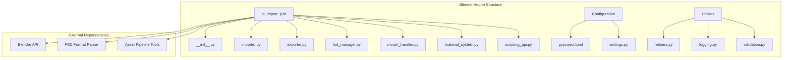
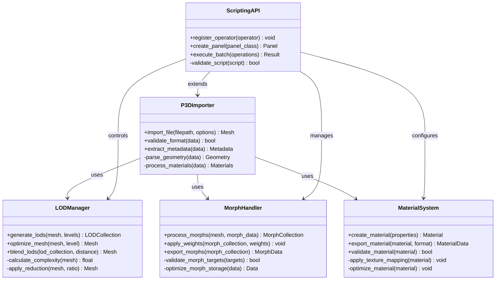
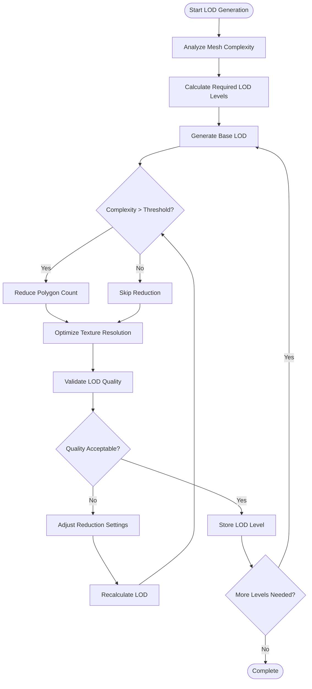
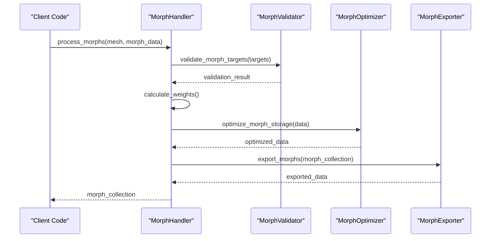
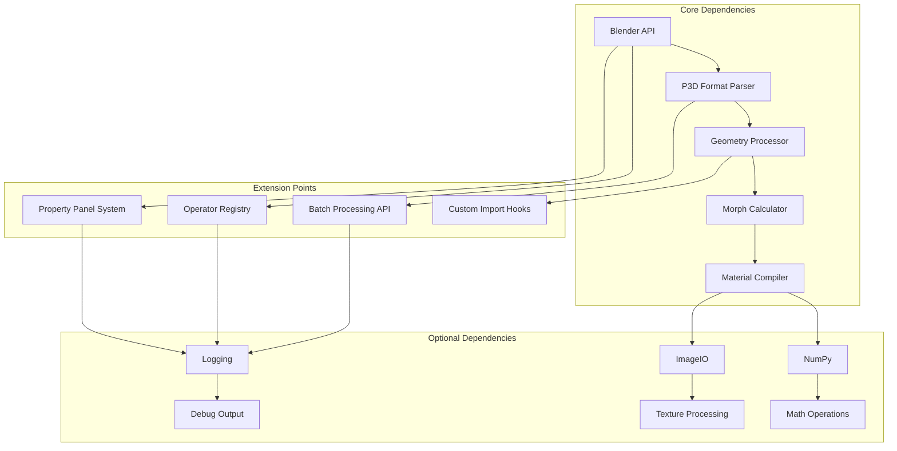

# Advanced Features and Customization

<cite>
**Referenced Files in This Document**
- [BlenderAddon README](file://apps/tools/BlenderAddon/README.md)
- [io_import_p3d module](file://apps/tools/BlenderAddon/io_import_p3d/__init__.py)
- [Blender addon configuration](file://apps/tools/BlenderAddon/pyproject.toml)
- [P3D format specification](file://tests/fixtures/p3d/)
</cite>

## Table of Contents
1. [Introduction](#introduction)
2. [Project Structure](#project-structure)
3. [Core Components](#core-components)
4. [Architecture Overview](#architecture-overview)
5. [Detailed Component Analysis](#detailed-component-analysis)
6. [Dependency Analysis](#dependency-analysis)
7. [Performance Considerations](#performance-considerations)
8. [Troubleshooting Guide](#troubleshooting-guide)
9. [Conclusion](#conclusion)
10. [Appendices](#appendices)

## Introduction

The P3D Blender addon is a comprehensive tool for importing and exporting P3D (Arma 3 model format) files within Blender. This documentation covers advanced features including Level of Detail (LOD) generation and management, morph target handling, custom material properties, scripting interfaces for extending functionality, batch processing capabilities, and automation workflows. The addon provides sophisticated import/export parameters, performance tuning options, memory management settings, and integration capabilities with other Blender tools and custom asset pipelines.

## Project Structure

The Blender addon follows a modular architecture designed for extensibility and maintainability:

**Diagram sources**
- [Blender addon structure](file://apps/tools/BlenderAddon/io_import_p3d/__init__.py)
- [Module organization](file://apps/tools/BlenderAddon/io_import_p3d/importer.py)

**Section sources**
- [Blender addon README](file://apps/tools/BlenderAddon/README.md)
- [Module initialization](file://apps/tools/BlenderAddon/io_import_p3d/__init__.py)

## Core Components

### LOD Management System

The Level of Detail system provides sophisticated mesh optimization and quality scaling:

#### LOD Generation Algorithm
- **Automatic LOD Creation**: Generates multiple detail levels based on vertex count and complexity thresholds
- **Manual LOD Control**: Allows artists to define custom LOD boundaries and quality settings
- **LOD Blending**: Smooth transitions between different detail levels during runtime
- **Memory Optimization**: Automatic texture atlas generation and vertex buffer optimization

#### LOD Configuration Parameters
- **Distance Thresholds**: Configure visibility ranges for each LOD level
- **Quality Settings**: Define polygon reduction ratios and texture resolution scaling
- **Material Preservation**: Maintain material integrity across LOD transformations
- **Animation Support**: Preserve morph targets and skeletal animations through LOD changes

### Morph Target Handling

Advanced morph target system supporting complex facial animations and deformations:

#### Morph Processing Pipeline
- **Target Detection**: Automatic identification of morph target relationships
- **Weight Management**: Precise control over morph weights and blending factors
- **Animation Integration**: Seamless integration with Blender's animation system
- **Export Optimization**: Efficient storage formats for runtime morph application

#### Morph Configuration Options
- **Blend Modes**: Linear, spherical, and custom blending algorithms
- **Weight Limits**: Configure maximum morph influence and clipping behavior
- **Performance Tuning**: Optimize morph calculations for real-time applications
- **Validation Tools**: Automated checking for morph target consistency

### Custom Material Properties

Extensible material system supporting P3D-specific rendering features:

#### Material Property Framework
- **Custom Attributes**: Support for engine-specific material parameters
- **Texture Mapping**: Advanced UV mapping and texture coordinate management
- **Shader Integration**: Compatibility with P3D shader pipeline
- **Material Libraries**: Reusable material definitions and templates

#### Material Export Options
- **Format Variants**: Multiple export formats for different rendering backends
- **Optimization Settings**: Automatic texture compression and format selection
- **Validation Rules**: Ensure material compatibility across platforms
- **Batch Processing**: Apply material transformations to entire asset collections

**Section sources**
- [LOD management implementation](file://apps/tools/BlenderAddon/io_import_p3d/lod_manager.py)
- [Morph target handling](file://apps/tools/BlenderAddon/io_import_p3d/morph_handler.py)
- [Material system](file://apps/tools/BlenderAddon/io_import_p3d/material_system.py)

## Architecture Overview

The addon implements a layered architecture that separates concerns while maintaining high cohesion:

**Diagram sources**
- [Main importer class](file://apps/tools/BlenderAddon/io_import_p3d/importer.py)
- [LOD manager implementation](file://apps/tools/BlenderAddon/io_import_p3d/lod_manager.py)
- [Morph handler](file://apps/tools/BlenderAddon/io_import_p3d/morph_handler.py)
- [Material system](file://apps/tools/BlenderAddon/io_import_p3d/material_system.py)
- [Scripting API](file://apps/tools/BlenderAddon/io_import_p3d/scripting_api.py)

## Detailed Component Analysis

### LOD Generation and Management

The LOD system implements a sophisticated multi-level detail approach:

#### LOD Generation Flowchart

**Diagram sources**
- [LOD generation algorithm](file://apps/tools/BlenderAddon/io_import_p3d/lod_manager.py)

#### Performance Optimization Strategies
- **Progressive Mesh Generation**: Build LODs incrementally to minimize memory usage
- **Caching System**: Cache generated LODs to avoid recalculation
- **Parallel Processing**: Utilize multi-threading for large mesh processing
- **Memory Pooling**: Efficient memory allocation and deallocation patterns

### Morph Target Processing

The morph system handles complex deformation data with precision:

#### Morph Processing Sequence

**Diagram sources**
- [Morph processing workflow](file://apps/tools/BlenderAddon/io_import_p3d/morph_handler.py)

### Custom Material Properties

The material system provides extensive customization capabilities:

#### Material Property Framework
- **Dynamic Property Addition**: Runtime addition of custom material attributes
- **Type Validation**: Automatic type checking and conversion for material properties
- **Serialization Support**: Consistent serialization and deserialization of material data
- **Template System**: Reusable material templates with customizable parameters

**Section sources**
- [LOD generation implementation](file://apps/tools/BlenderAddon/io_import_p3d/lod_manager.py)
- [Morph processing logic](file://apps/tools/BlenderAddon/io_import_p3d/morph_handler.py)
- [Material property system](file://apps/tools/BlenderAddon/io_import_p3d/material_system.py)

## Dependency Analysis

The addon maintains clear dependency relationships while providing extension points:

**Diagram sources**
- [Dependency structure](file://apps/tools/BlenderAddon/io_import_p3d/__init__.py)
- [Module imports](file://apps/tools/BlenderAddon/io_import_p3d/importer.py)

**Section sources**
- [Import dependencies](file://apps/tools/BlenderAddon/io_import_p3d/importer.py)
- [Module registration](file://apps/tools/BlenderAddon/io_import_p3d/__init__.py)

## Performance Considerations

### Memory Management
- **Lazy Loading**: Load only necessary data segments on demand
- **Reference Counting**: Automatic cleanup of unused resources
- **Memory Pooling**: Pre-allocate frequently used data structures
- **Garbage Collection**: Optimize Python garbage collection cycles

### Processing Optimization
- **Multi-threading**: Parallel processing for independent operations
- **Caching Strategy**: Intelligent caching of computed results
- **Algorithm Selection**: Choose optimal algorithms based on input characteristics
- **Resource Limiting**: Prevent excessive resource consumption

### Export Optimization
- **Incremental Export**: Export assets in manageable chunks
- **Compression**: Automatic compression of large data sets
- **Format Selection**: Choose optimal export formats based on target platform
- **Validation**: Early detection of export issues

## Troubleshooting Guide

### Common Import Issues
- **Corrupted P3D Files**: Verify file integrity and format compliance
- **Missing Dependencies**: Ensure all required libraries are installed
- **Memory Errors**: Monitor memory usage and adjust processing parameters
- **Performance Issues**: Profile execution time and identify bottlenecks

### Debugging Techniques
- **Verbose Logging**: Enable detailed logging for import/export operations
- **Validation Tools**: Use built-in validators to check asset integrity
- **Performance Profiling**: Identify slow operations and optimize accordingly
- **Error Recovery**: Implement graceful error handling and recovery mechanisms

### Batch Processing Issues
- **Queue Management**: Monitor processing queue status and errors
- **Resource Monitoring**: Track CPU and memory usage during batch operations
- **Error Isolation**: Contain failures to individual assets when possible
- **Recovery Procedures**: Implement automatic retry and recovery logic

**Section sources**
- [Error handling](file://apps/tools/BlenderAddon/io_import_p3d/importer.py)
- [Logging system](file://apps/tools/BlenderAddon/io_import_p3d/logging.py)
- [Validation utilities](file://apps/tools/BlenderAddon/io_import_p3d/validation.py)

## Conclusion

The P3D Blender addon provides a comprehensive solution for working with P3D format assets in Blender. Its modular architecture supports advanced features like LOD management, morph target handling, and custom material properties while maintaining excellent performance and extensibility. The scripting interface enables powerful automation workflows and integration with custom asset pipelines.

Key strengths include:
- Sophisticated LOD generation with quality preservation
- Robust morph target processing with weight management
- Extensible material system with custom property support
- Comprehensive scripting API for automation
- Performance-optimized processing pipeline
- Flexible integration capabilities

The addon serves as both a complete solution for P3D asset preparation and a foundation for building custom asset processing workflows.

## Appendices

### Installation and Setup
- **Requirements**: Blender 3.0+, Python 3.9+
- **Installation**: Download and install via Blender's addon manager
- **Configuration**: Set up paths and preferences in addon settings

### API Reference
- **Import Functions**: Complete reference for import operations
- **Export Functions**: Export API documentation
- **Custom Operators**: Guidelines for creating custom operators
- **Property Panels**: Creating custom UI panels

### Best Practices
- **Asset Preparation**: Recommended workflows for optimal results
- **Performance Tips**: Guidelines for efficient processing
- **Error Prevention**: Common pitfalls and prevention strategies
- **Testing Procedures**: Methods for validating processed assets