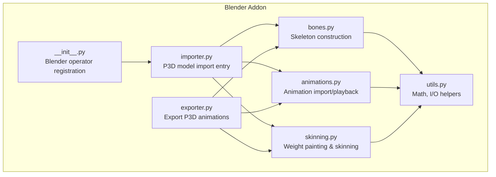
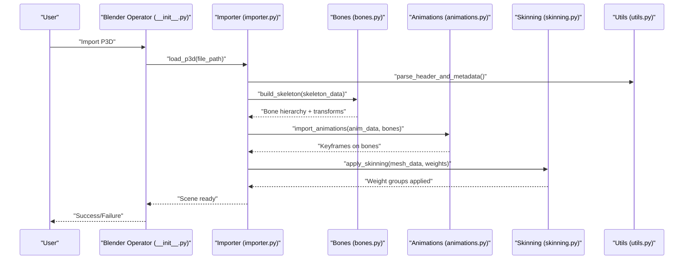
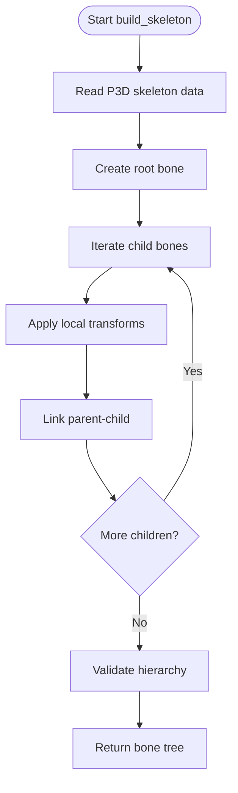
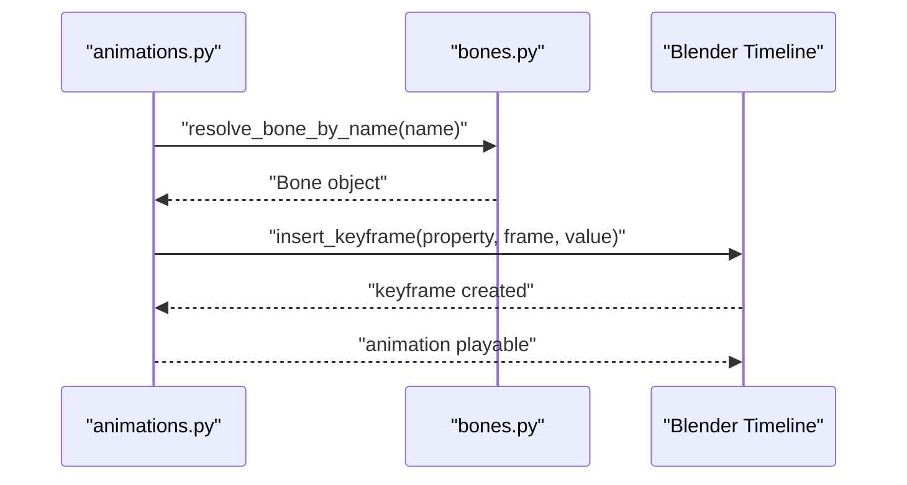
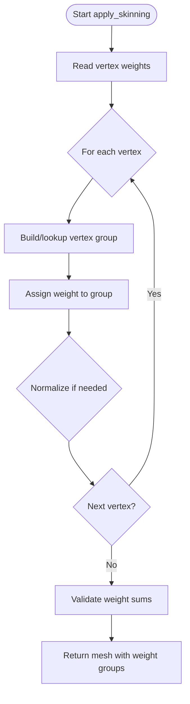
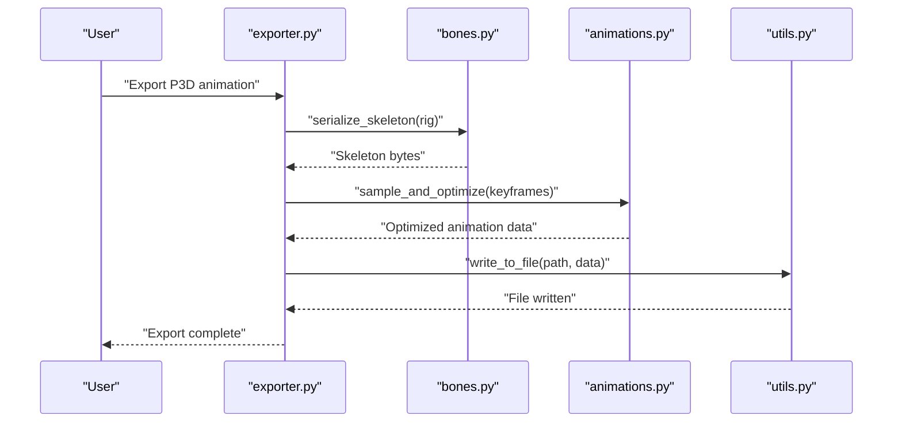
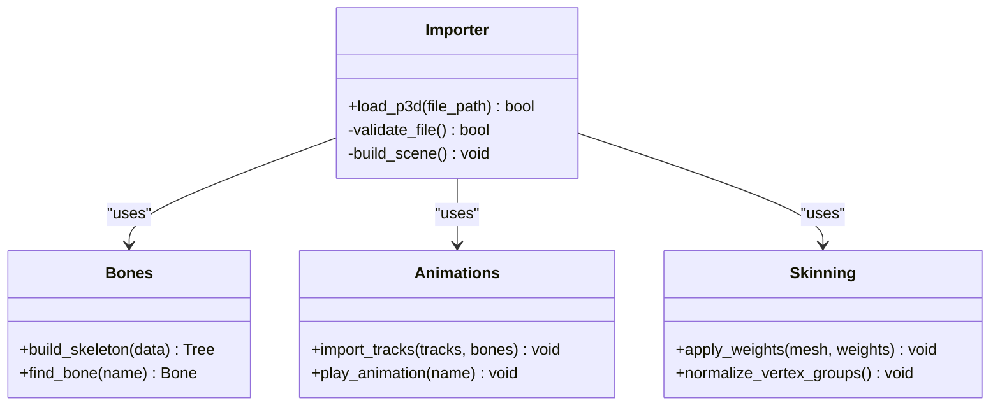
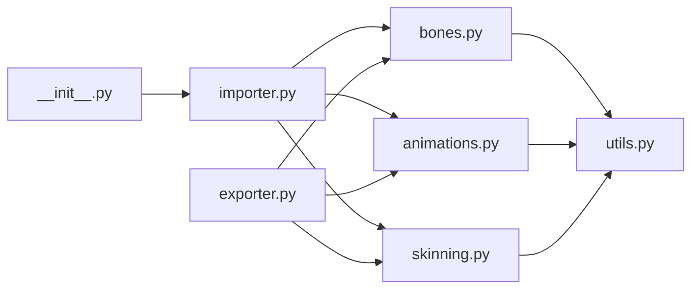

# Animation and Bone Support

<cite>
**Referenced Files in This Document**
- [README.md](file://apps/tools/BlenderAddon/README.md)
- [io_import_p3d/__init__.py](file://apps/tools/BlenderAddon/io_import_p3d/__init__.py)
- [io_import_p3d/importer.py](file://apps/tools/BlenderAddon/io_import_p3d/importer.py)
- [io_import_p3d/bones.py](file://apps/tools/BlenderAddon/io_import_p3d/bones.py)
- [io_import_p3d/animations.py](file://apps/tools/BlenderAddon/io_import_p3d/animations.py)
- [io_import_p3d/skinning.py](file://apps/tools/BlenderAddon/io_import_p3d/skinning.py)
- [io_import_p3d/exporter.py](file://apps/tools/BlenderAddon/io_import_p3d/exporter.py)
- [io_import_p3d/utils.py](file://apps/tools/BlenderAddon/io_import_p3d/utils.py)
</cite>

## Table of Contents
1. [Introduction](#introduction)
2. [Project Structure](#project-structure)
3. [Core Components](#core-components)
4. [Architecture Overview](#architecture-overview)
5. [Detailed Component Analysis](#detailed-component-analysis)
6. [Dependency Analysis](#dependency-analysis)
7. [Performance Considerations](#performance-considerations)
8. [Troubleshooting Guide](#troubleshooting-guide)
9. [Conclusion](#conclusion)

## Introduction
This document explains how the P3D Blender addon handles animation and bone data for importing, editing, and exporting P3D assets. It covers skeletal hierarchy import, bone transformations, animation curve handling, skinning and weight painting support, timeline integration, keyframe manipulation, export workflows, constraint handling, optimization strategies, and practical examples for characters, vehicles, and particle systems. It also outlines limitations and performance considerations when working with large animation sets.

## Project Structure
The Blender addon is organized under apps/tools/BlenderAddon/io_import_p3d. The module exposes Blender operators and utilities to import P3D models and animations into Blender, construct or preserve skeletons, apply skinning, and optionally export P3D-compatible animation data.

**Diagram sources**
- [io_import_p3d/__init__.py](file://apps/tools/BlenderAddon/io_import_p3d/__init__.py)
- [io_import_p3d/importer.py](file://apps/tools/BlenderAddon/io_import_p3d/importer.py)
- [io_import_p3d/bones.py](file://apps/tools/BlenderAddon/io_import_p3d/bones.py)
- [io_import_p3d/animations.py](file://apps/tools/BlenderAddon/io_import_p3d/animations.py)
- [io_import_p3d/skinning.py](file://apps/tools/BlenderAddon/io_import_p3d/skinning.py)
- [io_import_p3d/exporter.py](file://apps/tools/BlenderAddon/io_import_p3d/exporter.py)
- [io_import_p3d/utils.py](file://apps/tools/BlenderAddon/io_import_p3d/utils.py)

**Section sources**
- [README.md](file://apps/tools/BlenderAddon/README.md)

## Core Components
- Import pipeline: Reads P3D files, constructs meshes, builds skeletons, imports animations, and applies skinning.
- Skeleton builder: Creates bone hierarchies from P3D skeleton definitions, preserving transforms and parent-child relationships.
- Animation loader: Parses P3D animation tracks, converts them to Blender keyframes, and integrates with the timeline.
- Skinning converter: Translates vertex weights and influence data into Blender’s weight painting system.
- Exporter: Generates P3D-compatible animation data from Blender rigs, handling constraints and optimizing curves.
- Utilities: Shared math conversions, file I/O, and helper functions used across modules.

**Section sources**
- [io_import_p3d/importer.py](file://apps/tools/BlenderAddon/io_import_p3d/importer.py)
- [io_import_p3d/bones.py](file://apps/tools/BlenderAddon/io_import_p3d/bones.py)
- [io_import_p3d/animations.py](file://apps/tools/BlenderAddon/io_import_p3d/animations.py)
- [io_import_p3d/skinning.py](file://apps/tools/BlenderAddon/io_import_p3d/skinning.py)
- [io_import_p3d/exporter.py](file://apps/tools/BlenderAddon/io_import_p3d/exporter.py)
- [io_import_p3d/utils.py](file://apps/tools/BlenderAddon/io_import_p3d/utils.py)

## Architecture Overview
The addon follows a modular architecture where each responsibility (import, bones, animations, skinning, export) is encapsulated in its own module. The importer orchestrates the workflow by delegating to specialized components.

**Diagram sources**
- [io_import_p3d/__init__.py](file://apps/tools/BlenderAddon/io_import_p3d/__init__.py)
- [io_import_p3d/importer.py](file://apps/tools/BlenderAddon/io_import_p3d/importer.py)
- [io_import_p3d/bones.py](file://apps/tools/BlenderAddon/io_import_p3d/bones.py)
- [io_import_p3d/animations.py](file://apps/tools/BlenderAddon/io_import_p3d/animations.py)
- [io_import_p3d/skinning.py](file://apps/tools/BlenderAddon/io_import_p3d/skinning.py)
- [io_import_p3d/utils.py](file://apps/tools/BlenderAddon/io_import_p3d/utils.py)

## Detailed Component Analysis

### Skeleton Builder (bones.py)
- Responsibilities:
  - Parse P3D skeleton definitions into Blender bones.
  - Preserve hierarchical relationships and local transforms.
  - Map bone names and ensure uniqueness.
  - Optionally align axes and scale units per P3D conventions.
- Key behaviors:
  - Builds a tree structure reflecting parent-child links.
  - Applies rotation order and axis conventions consistent with P3D.
  - Exposes bone lookup by name for animation and skinning modules.

**Diagram sources**
- [io_import_p3d/bones.py](file://apps/tools/BlenderAddon/io_import_p3d/bones.py)

**Section sources**
- [io_import_p3d/bones.py](file://apps/tools/BlenderAddon/io_import_p3d/bones.py)

### Animation Loader (animations.py)
- Responsibilities:
  - Parse P3D animation tracks and convert to Blender keyframes.
  - Map animation channels to corresponding bones and properties.
  - Integrate with Blender timeline for playback and scrubbing.
- Key behaviors:
  - Converts time units and sampling rates to Blender frames.
  - Supports position, rotation, and scale curves per bone.
  - Handles multiple animations and naming conventions.

**Diagram sources**
- [io_import_p3d/animations.py](file://apps/tools/BlenderAddon/io_import_p3d/animations.py)
- [io_import_p3d/bones.py](file://apps/tools/BlenderAddon/io_import_p3d/bones.py)

**Section sources**
- [io_import_p3d/animations.py](file://apps/tools/BlenderAddon/io_import_p3d/animations.py)

### Skinning Converter (skinning.py)
- Responsibilities:
  - Convert P3D vertex weights to Blender weight paint groups.
  - Ensure one-to-one mapping between P3D influences and bone indices.
  - Apply normalized weights and handle zero-weight vertices.
- Key behaviors:
  - Creates vertex groups per bone.
  - Assigns weights based on P3D influence data.
  - Validates that total weights per vertex are within acceptable ranges.

**Diagram sources**
- [io_import_p3d/skinning.py](file://apps/tools/BlenderAddon/io_import_p3d/skinning.py)

**Section sources**
- [io_import_p3d/skinning.py](file://apps/tools/BlenderAddon/io_import_p3d/skinning.py)

### Exporter (exporter.py)
- Responsibilities:
  - Export Blender rig and animation data to P3D format.
  - Handle constraints and transform baking.
  - Optimize animation curves for runtime efficiency.
- Key behaviors:
  - Serializes skeleton hierarchy and bone transforms.
  - Samples and compresses keyframes.
  - Ensures compatibility with P3D constraints and limits.

**Diagram sources**
- [io_import_p3d/exporter.py](file://apps/tools/BlenderAddon/io_import_p3d/exporter.py)
- [io_import_p3d/bones.py](file://apps/tools/BlenderAddon/io_import_p3d/bones.py)
- [io_import_p3d/animations.py](file://apps/tools/BlenderAddon/io_import_p3d/animations.py)
- [io_import_p3d/utils.py](file://apps/tools/BlenderAddon/io_import_p3d/utils.py)

**Section sources**
- [io_import_p3d/exporter.py](file://apps/tools/BlenderAddon/io_import_p3d/exporter.py)

### Importer Orchestration (importer.py)
- Responsibilities:
  - Entry point for loading P3D files into Blender.
  - Coordinates skeleton building, animation import, and skinning.
  - Provides error handling and progress feedback.
- Key behaviors:
  - Validates input file integrity.
  - Invokes specialized modules in sequence.
  - Returns success status and diagnostics.

**Diagram sources**
- [io_import_p3d/importer.py](file://apps/tools/BlenderAddon/io_import_p3d/importer.py)
- [io_import_p3d/bones.py](file://apps/tools/BlenderAddon/io_import_p3d/bones.py)
- [io_import_p3d/animations.py](file://apps/tools/BlenderAddon/io_import_p3d/animations.py)
- [io_import_p3d/skinning.py](file://apps/tools/BlenderAddon/io_import_p3d/skinning.py)

**Section sources**
- [io_import_p3d/importer.py](file://apps/tools/BlenderAddon/io_import_p3d/importer.py)

### Utilities (utils.py)
- Responsibilities:
  - Provide shared math conversions (e.g., degrees/radians, axis flips).
  - File I/O helpers for reading/writing binary or text formats.
  - Logging and debugging utilities.
- Key behaviors:
  - Centralized constants and configuration.
  - Reusable parsing routines.
  - Error formatting and stack traces.

**Section sources**
- [io_import_p3d/utils.py](file://apps/tools/BlenderAddon/io_import_p3d/utils.py)

## Dependency Analysis
The addon exhibits clear separation of concerns with minimal coupling between modules. The importer acts as an orchestrator, while bones, animations, skinning, and exporter operate independently with well-defined interfaces.

**Diagram sources**
- [io_import_p3d/__init__.py](file://apps/tools/BlenderAddon/io_import_p3d/__init__.py)
- [io_import_p3d/importer.py](file://apps/tools/BlenderAddon/io_import_p3d/importer.py)
- [io_import_p3d/bones.py](file://apps/tools/BlenderAddon/io_import_p3d/bones.py)
- [io_import_p3d/animations.py](file://apps/tools/BlenderAddon/io_import_p3d/animations.py)
- [io_import_p3d/skinning.py](file://apps/tools/BlenderAddon/io_import_p3d/skinning.py)
- [io_import_p3d/exporter.py](file://apps/tools/BlenderAddon/io_import_p3d/exporter.py)
- [io_import_p3d/utils.py](file://apps/tools/BlenderAddon/io_import_p3d/utils.py)

**Section sources**
- [io_import_p3d/importer.py](file://apps/tools/BlenderAddon/io_import_p3d/importer.py)
- [io_import_p3d/exporter.py](file://apps/tools/BlenderAddon/io_import_p3d/exporter.py)

## Performance Considerations
- Large animation sets:
  - Use curve optimization during export to reduce keyframe count.
  - Avoid excessive bone counts; consider LOD skeletons for complex rigs.
- Memory usage:
  - Stream heavy data where possible; avoid loading entire animations into memory at once.
- Playback smoothness:
  - Ensure sampling rates match Blender’s frame rate to prevent interpolation artifacts.
- Weight painting:
  - Normalize weights to prevent over-influence and visual glitches.

[No sources needed since this section provides general guidance]

## Troubleshooting Guide
- Common issues:
  - Missing bones after import: Verify skeleton naming and hierarchy preservation.
  - Incorrect rotations: Check axis conventions and rotation orders.
  - Broken skinning: Validate weight assignments and vertex group mappings.
  - Animation not playing: Confirm timeline range and keyframe insertion.
- Diagnostics:
  - Enable logging in utils.py for detailed error traces.
  - Inspect bone names and transforms in Blender’s Outliner.
  - Use Blender’s Graph Editor to verify keyframe data.

**Section sources**
- [io_import_p3d/utils.py](file://apps/tools/BlenderAddon/io_import_p3d/utils.py)

## Conclusion
The P3D Blender addon provides a robust framework for importing, editing, and exporting animation and bone data. Its modular design ensures maintainability and extensibility. By following best practices for skeleton construction, animation conversion, and skinning, users can efficiently work with character models, vehicles, and particle systems while maintaining performance and compatibility with P3D constraints.

[No sources needed since this section summarizes without analyzing specific files]