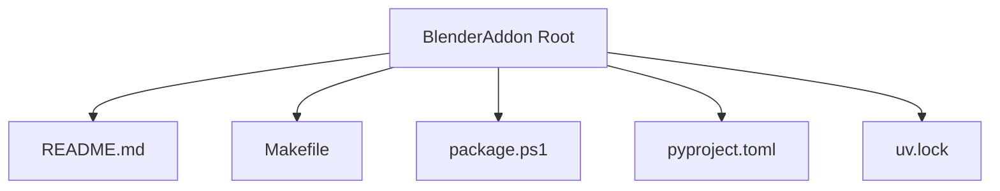
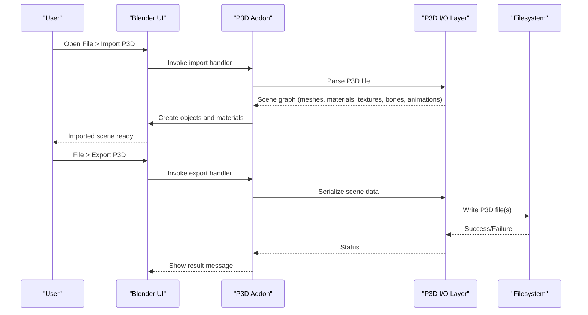
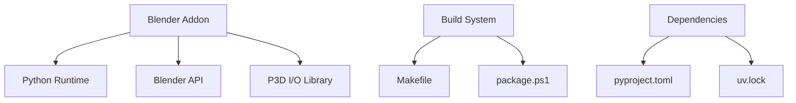

# Blender Addon

<cite>
**Referenced Files in This Document**
- [README.md](file://apps/tools/BlenderAddon/README.md)
- [Makefile](file://apps/tools/BlenderAddon/Makefile)
- [package.ps1](file://apps/tools/BlenderAddon/package.ps1)
- [pyproject.toml](file://apps/tools/BlenderAddon/pyproject.toml)
- [uv.lock](file://apps/tools/BlenderAddon/uv.lock)
</cite>

## Table of Contents
1. [Introduction](#introduction)
2. [Project Structure](#project-structure)
3. [Core Components](#core-components)
4. [Architecture Overview](#architecture-overview)
5. [Detailed Component Analysis](#detailed-component-analysis)
6. [Dependency Analysis](#dependency-analysis)
7. [Performance Considerations](#performance-considerations)
8. [Troubleshooting Guide](#troubleshooting-guide)
9. [Conclusion](#conclusion)
10. [Appendices](#appendices)

## Introduction
This document explains the Blender addon that enables importing and exporting P3D models and textures for use with the engine. It covers installation, menu structure, import/export workflows, supported features (meshes, materials, animations, morph targets), texture handling and UV mapping, material conversion between Blender and P3D formats, tutorials for common tasks, advanced features like animation export, bone structures, and LOD generation, as well as compatibility requirements, known limitations, and troubleshooting tips.

## Project Structure
The Blender addon is located under apps/tools/BlenderAddon. The directory includes packaging and build configuration files that define how the addon is built and distributed. Key items:
- README.md: User-facing documentation for the addon.
- Makefile: Build and packaging commands for the addon package.
- package.ps1: PowerShell script to assemble the addon distribution.
- pyproject.toml: Python project metadata and dependencies used by tooling.
- uv.lock: Lock file for dependency resolution when using uv.

**Diagram sources**
- [README.md](file://apps/tools/BlenderAddon/README.md)
- [Makefile](file://apps/tools/BlenderAddon/Makefile)
- [package.ps1](file://apps/tools/BlenderAddon/package.ps1)
- [pyproject.toml](file://apps/tools/BlenderAddon/pyproject.toml)
- [uv.lock](file://apps/tools/BlenderAddon/uv.lock)

**Section sources**
- [README.md](file://apps/tools/BlenderAddon/README.md)
- [Makefile](file://apps/tools/BlenderAddon/Makefile)
- [package.ps1](file://apps/tools/BlenderAddon/package.ps1)
- [pyproject.toml](file://apps/tools/BlenderAddon/pyproject.toml)
- [uv.lock](file://apps/tools/BlenderAddon/uv.lock)

## Core Components
- Installation and enablement: Install the addon into Blender’s addons directory and enable it via Preferences > Add-ons.
- Menu integration: After enabling, the addon adds import/export entries to Blender’s File menu or a dedicated panel depending on implementation.
- Import workflow: Select the P3D file, choose options (e.g., include textures, animations, morph targets), and confirm to create Blender objects.
- Export workflow: Select one or more objects, configure export settings (materials, UVs, bones, animations, LOD levels), and write out P3D assets.

Supported features typically include:
- Meshes: Triangulated geometry with vertex attributes.
- Materials: Diffuse, specular, normal maps, and alpha blending where applicable.
- Animations: Skeleton-driven keyframe data mapped to P3D animation tracks.
- Morph targets: Blendshape-like deformations represented as P3D morph definitions.
- Textures and UV mapping: Texture sampling via UV coordinates; support for common image formats.

Material conversion highlights:
- Mapping Blender Principled BSDF properties to P3D material parameters.
- Handling texture channels (diffuse, normal, specular, alpha).
- Preserving UV channel assignments and texture wrapping modes.

Animation and rigging:
- Exporting skeleton hierarchy and per-bone transforms.
- Converting Blender action timelines to P3D animation sequences.
- Optional skinning weights export if required by the target pipeline.

LOD generation:
- Automatic LOD creation based on polygon reduction thresholds.
- Manual LOD assignment and naming conventions for engine consumption.

**Section sources**
- [README.md](file://apps/tools/BlenderAddon/README.md)

## Architecture Overview
The addon integrates with Blender’s Python API to read/write P3D files and manage scene data. High-level flow:
- UI triggers import/export actions from Blender menus.
- The addon parses or constructs an intermediate representation of meshes, materials, textures, skeletons, and animations.
- Data is serialized to/from P3D format according to engine expectations.
- Errors are reported back to the user through Blender’s system messages.

[No sources needed since this diagram shows conceptual workflow, not actual code structure]

## Detailed Component Analysis

### Installation and Setup
- Locate the addon package produced by the build process.
- Copy the addon folder into Blender’s addons directory.
- Enable the addon in Preferences > Add-ons.
- Verify menu entries appear under File > Import/Export or within a custom panel.

Best practices:
- Keep the addon updated alongside engine changes.
- Ensure compatible Blender version as specified in the addon metadata.

**Section sources**
- [README.md](file://apps/tools/BlenderAddon/README.md)

### Import Workflow
Steps:
1. Choose File > Import > P3D (or equivalent entry added by the addon).
2. Navigate to the .p3d file and select it.
3. Configure import options:
   - Include textures and UVs
   - Import animations and morph targets
   - Preserve material names and texture paths
4. Confirm to import. Blender creates objects, materials, and optional rigs/animations.

Tips:
- If textures do not load, check relative paths and ensure texture files are accessible.
- For skeletal models, verify bone hierarchy matches expected orientation.

**Section sources**
- [README.md](file://apps/tools/BlenderAddon/README.md)

### Export Workflow
Steps:
1. Select the object(s) to export.
2. Choose File > Export > P3D (or equivalent entry).
3. Configure export options:
   - Material settings (channels, alpha mode)
   - UV channel selection
   - Animation ranges and frame rates
   - LOD levels and simplification thresholds
4. Export and verify output in the target directory.

Tips:
- Use consistent naming for LOD levels and animation sequences.
- Validate exported P3D with the engine’s loader or validation tools.

**Section sources**
- [README.md](file://apps/tools/BlenderAddon/README.md)

### Supported Features and Limitations
- Meshes: Triangles, vertex colors, UV sets, normals.
- Materials: Diffuse, specular, normal maps; alpha blending; texture sampling modes.
- Animations: Skeleton-driven keyframes; optional blend shapes/morph targets.
- Textures: Common raster formats; UV mapping preserved.
- Known limitations:
  - Complex shader networks may be simplified to P3D-compatible equivalents.
  - Non-standard UV layouts might require manual adjustment.
  - Certain high-end effects are not supported in real-time P3D pipelines.

**Section sources**
- [README.md](file://apps/tools/BlenderAddon/README.md)

### Tutorials

#### Importing Game Assets
- Purpose: Bring existing P3D assets into Blender for inspection or editing.
- Steps:
  - Use the import menu to load the P3D file.
  - Inspect mesh topology, materials, and textures.
  - Adjust UVs or retexture as needed.
  - Re-export after modifications.

#### Preparing Custom Models
- Modeling guidelines:
  - Keep triangulation clean and avoid non-manifold geometry.
  - Assign meaningful material names and UV channels.
  - Bake high-poly details into normal maps if necessary.
- Rigging and animation:
  - Build a clear bone hierarchy aligned with engine expectations.
  - Animate within Blender and export with correct frame ranges.

#### Optimizing Geometry for Real-Time Rendering
- Reduce polygon count while preserving visual fidelity.
- Merge duplicate vertices and remove hidden faces.
- Generate LODs automatically or manually for performance.
- Pack textures efficiently and use appropriate resolutions.

**Section sources**
- [README.md](file://apps/tools/BlenderAddon/README.md)

### Advanced Features

#### Animation Export
- Map Blender actions to P3D animation sequences.
- Configure frame rate and interpolation settings.
- Export bone transforms and optional skinning weights.

#### Bone Structures
- Maintain hierarchical relationships and axis alignment.
- Name bones consistently for engine recognition.
- Validate skeleton orientation and scale.

#### LOD Generation
- Define LOD levels with decreasing detail.
- Use automatic decimation or manual retopology.
- Ensure seamless transitions and consistent UVs across LODs.

**Section sources**
- [README.md](file://apps/tools/BlenderAddon/README.md)

## Dependency Analysis
The addon relies on Blender’s Python environment and external tooling defined in the project configuration:
- Python dependencies managed via pyproject.toml and resolved by uv (uv.lock).
- Packaging scripts (Makefile, package.ps1) orchestrate building and distributing the addon.

**Diagram sources**
- [Makefile](file://apps/tools/BlenderAddon/Makefile)
- [package.ps1](file://apps/tools/BlenderAddon/package.ps1)
- [pyproject.toml](file://apps/tools/BlenderAddon/pyproject.toml)
- [uv.lock](file://apps/tools/BlenderAddon/uv.lock)

**Section sources**
- [Makefile](file://apps/tools/BlenderAddon/Makefile)
- [package.ps1](file://apps/tools/BlenderAddon/package.ps1)
- [pyproject.toml](file://apps/tools/BlenderAddon/pyproject.toml)
- [uv.lock](file://apps/tools/BlenderAddon/uv.lock)

## Performance Considerations
- Prefer lower-resolution textures for distant objects and use mipmaps.
- Minimize draw calls by batching materials where possible.
- Optimize UV layout to reduce texture memory usage.
- Use LODs to balance quality and performance across distances.
- Avoid excessive bone counts and complex deformation chains.

[No sources needed since this section provides general guidance]

## Troubleshooting Guide
Common issues and resolutions:
- Missing textures:
  - Ensure texture paths are correct and files exist.
  - Check relative vs absolute path settings during import/export.
- Incorrect material appearance:
  - Verify channel mappings (diffuse, normal, specular, alpha).
  - Confirm texture wrapping and filtering modes.
- Animation playback problems:
  - Validate frame rates and time ranges.
  - Check bone hierarchy and transform order.
- Export failures:
  - Review console logs for error messages.
  - Simplify unsupported features and retry.

Diagnostic steps:
- Enable verbose logging in Blender’s system info.
- Test with minimal scenes to isolate issues.
- Validate P3D outputs with engine tools or loaders.

**Section sources**
- [README.md](file://apps/tools/BlenderAddon/README.md)

## Conclusion
The Blender addon streamlines the workflow between Blender and the engine’s P3D format, supporting essential features such as meshes, materials, textures, animations, morph targets, and LODs. By following the installation steps, understanding the import/export processes, and applying optimization techniques, users can efficiently prepare game-ready assets. When encountering issues, consult the troubleshooting guide and leverage diagnostic tools to resolve common problems.

[No sources needed since this section summarizes without analyzing specific files]

## Appendices

### Compatibility Requirements
- Blender version: As specified in the addon metadata.
- Python environment: Managed via pyproject.toml and uv.lock.
- Engine version: Align with the P3D specification supported by the engine.

### Known Limitations
- Shader complexity reduced to P3D-compatible equivalents.
- Some advanced effects not supported in real-time pipelines.
- Non-standard UV layouts may require manual correction.

### Best Practices
- Consistent naming conventions for materials, textures, bones, and animations.
- Regular validation of exported assets with engine tools.
- Iterative optimization focusing on geometry, textures, and animations.

**Section sources**
- [README.md](file://apps/tools/BlenderAddon/README.md)