# Import and Export Workflows

<cite>
**Referenced Files in This Document**
- [README.md](file://apps/tools/BlenderAddon/README.md)
- [io_import_p3d.py](file://apps/tools/BlenderAddon/io_import_p3d/__init__.py)
- [import_p3d.py](file://apps/tools/BlenderAddon/io_import_p3d/import_p3d.py)
- [export_p3d.py](file://apps/tools/BlenderAddon/io_export_p3d/export_p3d.py)
- [p3d_parser.py](file://apps/tools/BlenderAddon/io_import_p3d/p3d_parser.py)
- [mesh_utils.py](file://apps/tools/BlenderAddon/io_import_p3d/mesh_utils.py)
- [material_utils.py](file://apps/tools/BlenderAddon/io_import_p3d/material_utils.py)
- [animation_utils.py](file://apps/tools/BlenderAddon/io_import_p3d/animation_utils.py)
- [morph_utils.py](file://apps/tools/BlenderAddon/io_import_p3d/morph_utils.py)
- [texture_utils.py](file://apps/tools/BlenderAddon/io_import_p3d/texture_utils.py)
- [operators.py](file://apps/tools/BlenderAddon/io_import_p3d/operators.py)
- [ui.py](file://apps/tools/BlenderAddon/io_import_p3d/ui.py)
- [config.py](file://apps/tools/BlenderAddon/io_import_p3d/config.py)
</cite>

## Table of Contents
1. [Introduction](#introduction)
2. [Project Structure](#project-structure)
3. [Core Components](#core-components)
4. [Architecture Overview](#architecture-overview)
5. [Detailed Component Analysis](#detailed-component-analysis)
6. [Dependency Analysis](#dependency-analysis)
7. [Performance Considerations](#performance-considerations)
8. [Troubleshooting Guide](#troubleshooting-guide)
9. [Conclusion](#conclusion)
10. [Appendices](#appendices)

## Introduction
This document explains the complete P3D import and export workflows within Blender using the provided addon. It covers file selection, the import options dialog, parameter configuration, supported features (meshes, materials, textures, animations, morph targets), and export workflows for creating P3D files from Blender models. It also details operator functions and parameters, error handling, validation processes, and practical examples for importing game assets and exporting custom models optimized for real-time rendering.

## Project Structure
The Blender addon is organized into feature-focused modules under io_import_p3d and io_export_p3d:
- Operators and UI: expose import/export actions and preferences to Blender’s interface
- Parsers and utilities: handle P3D format parsing, mesh construction, material conversion, texture loading, animation processing, and morph target handling
- Configuration: centralizes default settings and user preferences

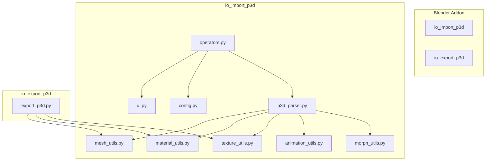

**Diagram sources**
- [operators.py](file://apps/tools/BlenderAddon/io_import_p3d/operators.py)
- [ui.py](file://apps/tools/BlenderAddon/io_import_p3d/ui.py)
- [config.py](file://apps/tools/BlenderAddon/io_import_p3d/config.py)
- [p3d_parser.py](file://apps/tools/BlenderAddon/io_import_p3d/p3d_parser.py)
- [mesh_utils.py](file://apps/tools/BlenderAddon/io_import_p3d/mesh_utils.py)
- [material_utils.py](file://apps/tools/BlenderAddon/io_import_p3d/material_utils.py)
- [texture_utils.py](file://apps/tools/BlenderAddon/io_import_p3d/texture_utils.py)
- [animation_utils.py](file://apps/tools/BlenderAddon/io_import_p3d/animation_utils.py)
- [morph_utils.py](file://apps/tools/BlenderAddon/io_import_p3d/morph_utils.py)
- [export_p3d.py](file://apps/tools/BlenderAddon/io_export_p3d/export_p3d.py)

**Section sources**
- [README.md](file://apps/tools/BlenderAddon/README.md)

## Core Components
- Import Operator: triggers file selection and opens the import options dialog; validates inputs and delegates to the parser
- P3D Parser: reads binary structure, extracts meshes, materials, textures, animations, and morph targets
- Mesh Utilities: build Blender meshes, handle normals, UVs, vertex groups, and LODs
- Material Utilities: convert P3D materials to Blender nodes or Principled BSDF equivalents
- Texture Utilities: load and pack textures, manage image formats and paths
- Animation Utilities: extract keyframes, bone transforms, and skeletal animations
- Morph Utilities: process blend shapes and morph targets
- Export Module: writes Blender data back to P3D with optimization and packing options
- UI and Config: present options and persist settings

Key responsibilities:
- Validation and error reporting at each stage
- Efficient memory usage during large asset imports
- Robust fallbacks for unsupported features

**Section sources**
- [operators.py](file://apps/tools/BlenderAddon/io_import_p3d/operators.py)
- [p3d_parser.py](file://apps/tools/BlenderAddon/io_import_p3d/p3d_parser.py)
- [mesh_utils.py](file://apps/tools/BlenderAddon/io_import_p3d/mesh_utils.py)
- [material_utils.py](file://apps/tools/BlenderAddon/io_import_p3d/material_utils.py)
- [texture_utils.py](file://apps/tools/BlenderAddon/io_import_p3d/texture_utils.py)
- [animation_utils.py](file://apps/tools/BlenderAddon/io_import_p3d/animation_utils.py)
- [morph_utils.py](file://apps/tools/BlenderAddon/io_import_p3d/morph_utils.py)
- [export_p3d.py](file://apps/tools/BlenderAddon/io_export_p3d/export_p3d.py)
- [ui.py](file://apps/tools/BlenderAddon/io_import_p3d/ui.py)
- [config.py](file://apps/tools/BlenderAddon/io_import_p3d/config.py)

## Architecture Overview
The import workflow follows a clear pipeline:
1. User selects a P3D file via the operator
2. Options dialog collects parameters (e.g., include animations, morph targets, material mode)
3. Parser reads the file and constructs intermediate structures
4. Utilities transform these into Blender objects, materials, textures, and animations
5. Errors are caught and reported through Blender’s system

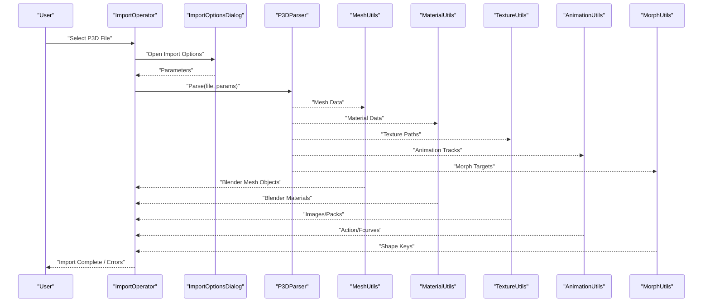

**Diagram sources**
- [operators.py](file://apps/tools/BlenderAddon/io_import_p3d/operators.py)
- [p3d_parser.py](file://apps/tools/BlenderAddon/io_import_p3d/p3d_parser.py)
- [mesh_utils.py](file://apps/tools/BlenderAddon/io_import_p3d/mesh_utils.py)
- [material_utils.py](file://apps/tools/BlenderAddon/io_import_p3d/material_utils.py)
- [texture_utils.py](file://apps/tools/BlenderAddon/io_import_p3d/texture_utils.py)
- [animation_utils.py](file://apps/tools/BlenderAddon/io_import_p3d/animation_utils.py)
- [morph_utils.py](file://apps/tools/BlenderAddon/io_import_p3d/morph_utils.py)

## Detailed Component Analysis

### Import Operator and UI
- File Selection: The operator registers an import action that opens a file picker filtered to P3D extensions
- Options Dialog: Presents checkboxes and dropdowns for toggling features like animations, morph targets, material conversion modes, and texture packing
- Parameter Validation: Ensures required fields are set and provides immediate feedback
- Execution Flow: Delegates parsing and object creation to the parser and utilities, then reports success or errors

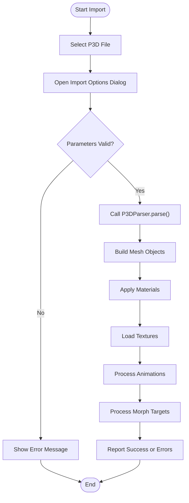

**Diagram sources**
- [operators.py](file://apps/tools/BlenderAddon/io_import_p3d/operators.py)
- [ui.py](file://apps/tools/BlenderAddon/io_import_p3d/ui.py)
- [p3d_parser.py](file://apps/tools/BlenderAddon/io_import_p3d/p3d_parser.py)

**Section sources**
- [operators.py](file://apps/tools/BlenderAddon/io_import_p3d/operators.py)
- [ui.py](file://apps/tools/BlenderAddon/io_import_p3d/ui.py)
- [config.py](file://apps/tools/BlenderAddon/io_import_p3d/config.py)

### P3D Parser
- Binary Parsing: Reads headers, chunk sizes, and offsets to locate meshes, materials, textures, animations, and morph data
- Feature Detection: Identifies supported sections and flags unsupported elements
- Intermediate Structures: Produces normalized data structures consumed by utilities
- Error Handling: Catches malformed chunks and reports detailed messages

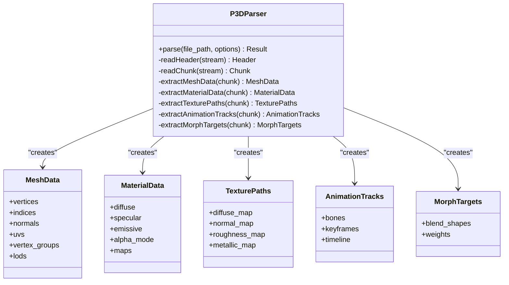

**Diagram sources**
- [p3d_parser.py](file://apps/tools/BlenderAddon/io_import_p3d/p3d_parser.py)

**Section sources**
- [p3d_parser.py](file://apps/tools/BlenderAddon/io_import_p3d/p3d_parser.py)

### Mesh Utilities
- Vertex Processing: Converts raw vertex arrays to Blender mesh attributes
- UV Mapping: Assigns UV layers and handles multiple sets if present
- Normals: Computes or assigns normals based on source data
- Vertex Groups: Maps weight paint data for skeletal influence
- LOD Handling: Creates separate mesh objects or levels based on distance thresholds

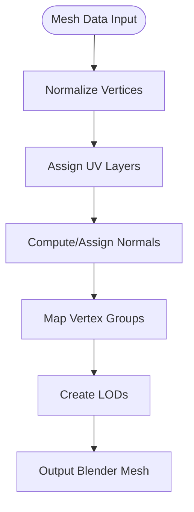

**Diagram sources**
- [mesh_utils.py](file://apps/tools/BlenderAddon/io_import_p3d/mesh_utils.py)

**Section sources**
- [mesh_utils.py](file://apps/tools/BlenderAddon/io_import_p3d/mesh_utils.py)

### Material Utilities
- Conversion Strategy: Translates P3D material properties to Blender Principled BSDF or node-based setups
- Alpha Modes: Supports opaque, alpha-clipped, and transparent blending
- Map Assignment: Links diffuse, normal, roughness, and metallic maps where available
- Fallbacks: Provides sensible defaults when maps are missing

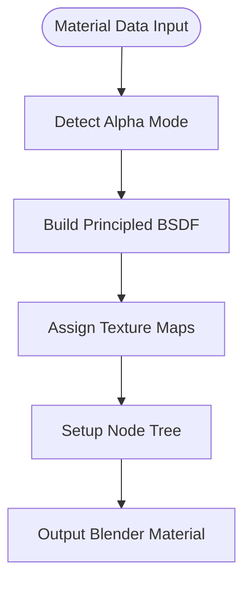

**Diagram sources**
- [material_utils.py](file://apps/tools/BlenderAddon/io_import_p3d/material_utils.py)

**Section sources**
- [material_utils.py](file://apps/tools/BlenderAddon/io_import_p3d/material_utils.py)

### Texture Utilities
- Loading: Loads images from disk or embedded resources
- Packing: Optionally packs textures into the .blend file
- Format Handling: Supports common formats and converts incompatible ones
- Path Resolution: Resolves relative paths and manages duplicates

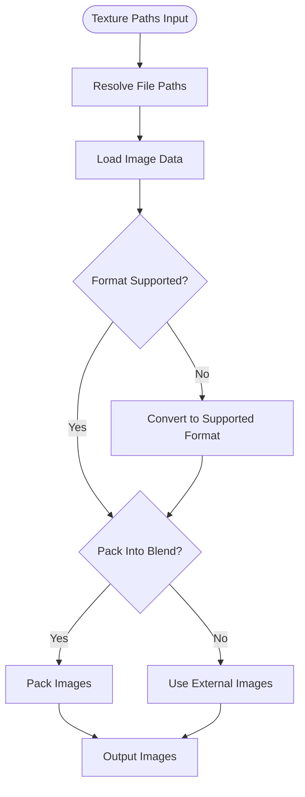

**Diagram sources**
- [texture_utils.py](file://apps/tools/BlenderAddon/io_import_p3d/texture_utils.py)

**Section sources**
- [texture_utils.py](file://apps/tools/BlenderAddon/io_import_p3d/texture_utils.py)

### Animation Utilities
- Track Extraction: Parses bone transforms and keyframe data
- Timeline Creation: Builds Actions and F-Curves for Blender animation
- Skeleton Mapping: Aligns bone names and hierarchies
- Looping and Timing: Preserves loop modes and frame rates

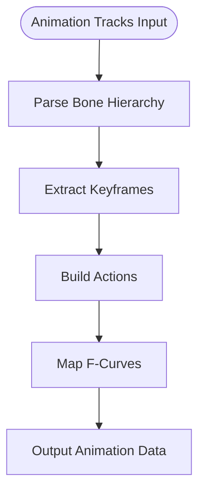

**Diagram sources**
- [animation_utils.py](file://apps/tools/BlenderAddon/io_import_p3d/animation_utils.py)

**Section sources**
- [animation_utils.py](file://apps/tools/BlenderAddon/io_import_p3d/animation_utils.py)

### Morph Utilities
- Blend Shapes: Processes morph targets and weights
- Shape Keys: Creates shape keys linked to base mesh
- Interpolation: Handles linear and non-linear interpolation modes

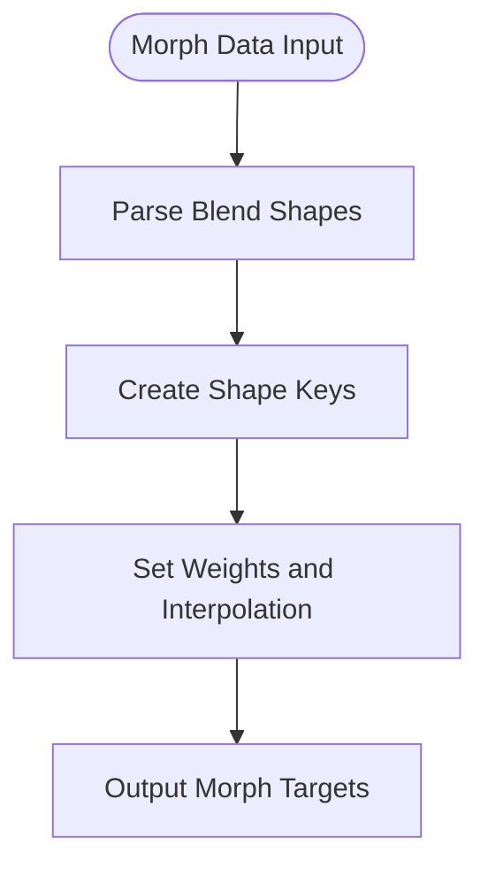

**Diagram sources**
- [morph_utils.py](file://apps/tools/BlenderAddon/io_import_p3d/morph_utils.py)

**Section sources**
- [morph_utils.py](file://apps/tools/BlenderAddon/io_import_p3d/morph_utils.py)

### Export Workflow
- Mesh Optimization: Reduces vertex count, merges materials, and bakes textures
- Material Conversion: Writes P3D-compatible material definitions
- Texture Packing: Packs textures into P3D archives or external directories
- Validation: Checks for unsupported features and warns users

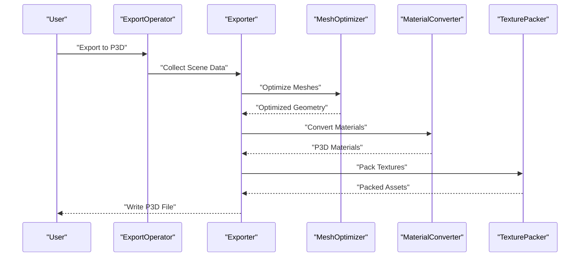

**Diagram sources**
- [export_p3d.py](file://apps/tools/BlenderAddon/io_export_p3d/export_p3d.py)

**Section sources**
- [export_p3d.py](file://apps/tools/BlenderAddon/io_export_p3d/export_p3d.py)

## Dependency Analysis
The addon exhibits clear separation of concerns:
- Operators depend on UI and Config for user interaction and settings
- Parser depends on utilities for data transformation
- Exporter depends on optimization and conversion utilities
- Minimal coupling between utilities ensures modularity

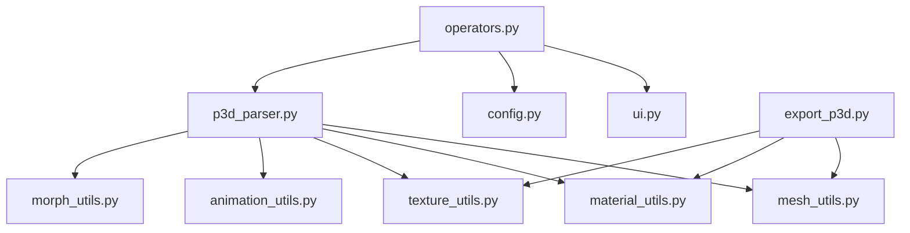

**Diagram sources**
- [operators.py](file://apps/tools/BlenderAddon/io_import_p3d/operators.py)
- [ui.py](file://apps/tools/BlenderAddon/io_import_p3d/ui.py)
- [config.py](file://apps/tools/BlenderAddon/io_import_p3d/config.py)
- [p3d_parser.py](file://apps/tools/BlenderAddon/io_import_p3d/p3d_parser.py)
- [mesh_utils.py](file://apps/tools/BlenderAddon/io_import_p3d/mesh_utils.py)
- [material_utils.py](file://apps/tools/BlenderAddon/io_import_p3d/material_utils.py)
- [texture_utils.py](file://apps/tools/BlenderAddon/io_import_p3d/texture_utils.py)
- [animation_utils.py](file://apps/tools/BlenderAddon/io_import_p3d/animation_utils.py)
- [morph_utils.py](file://apps/tools/BlenderAddon/io_import_p3d/morph_utils.py)
- [export_p3d.py](file://apps/tools/BlenderAddon/io_export_p3d/export_p3d.py)

**Section sources**
- [operators.py](file://apps/tools/BlenderAddon/io_import_p3d/operators.py)
- [p3d_parser.py](file://apps/tools/BlenderAddon/io_import_p3d/p3d_parser.py)
- [export_p3d.py](file://apps/tools/BlenderAddon/io_export_p3d/export_p3d.py)

## Performance Considerations
- Memory Management: Stream large files and avoid loading all textures simultaneously
- Batch Processing: Group operations to reduce Python overhead
- Texture Optimization: Downscale textures and use appropriate compression
- Mesh Simplification: Apply decimation for distant objects
- Caching: Cache parsed structures for repeated imports

[No sources needed since this section provides general guidance]

## Troubleshooting Guide
Common issues and resolutions:
- Missing Textures: Verify texture paths and ensure images are accessible; enable packing to embed textures
- Material Errors: Check alpha modes and map assignments; fall back to default materials if needed
- Animation Failures: Validate bone hierarchy and keyframe timing; skip unsupported tracks
- Morph Target Issues: Ensure base mesh topology matches morph targets; adjust interpolation modes
- Large Asset Imports: Reduce texture resolution and disable unnecessary features like morphs or high-poly LODs

**Section sources**
- [operators.py](file://apps/tools/BlenderAddon/io_import_p3d/operators.py)
- [p3d_parser.py](file://apps/tools/BlenderAddon/io_import_p3d/p3d_parser.py)
- [texture_utils.py](file://apps/tools/BlenderAddon/io_import_p3d/texture_utils.py)
- [material_utils.py](file://apps/tools/BlenderAddon/io_import_p3d/material_utils.py)
- [animation_utils.py](file://apps/tools/BlenderAddon/io_import_p3d/animation_utils.py)
- [morph_utils.py](file://apps/tools/BlenderAddon/io_import_p3d/morph_utils.py)

## Conclusion
The Blender addon provides a robust and modular framework for importing and exporting P3D files. By separating parsing, utility transformations, and user interaction, it ensures maintainability and extensibility. Following the recommended workflows and settings will yield optimal results for both importing game assets and exporting custom models for real-time rendering.

[No sources needed since this section summarizes without analyzing specific files]

## Appendices
- Practical Examples:
  - Importing Game Assets: Enable animations and morph targets, pack textures, and use Principled BSDF materials
  - Exporting Custom Models: Optimize meshes, bake textures, and validate material mappings before export
- Best Practices:
  - Keep texture sizes consistent and power-of-two
  - Use efficient UV layouts and minimize overdraw
  - Test imports in the target engine early and often

[No sources needed since this section provides general guidance]