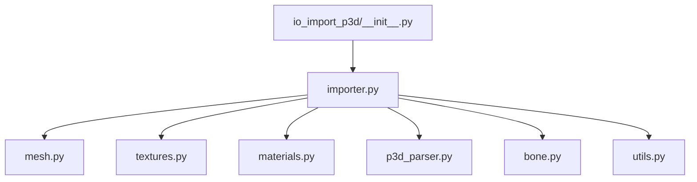
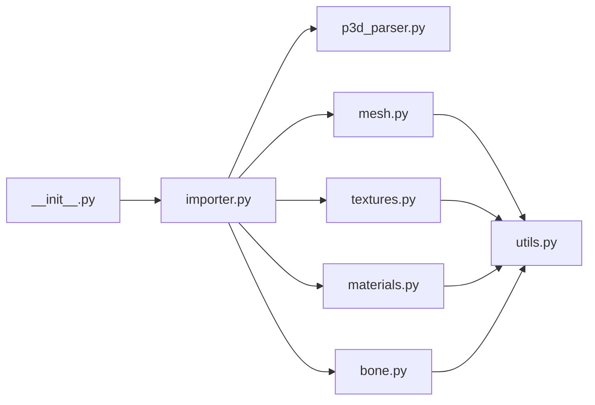

# Mesh and Texture Handling

<cite>
**Referenced Files in This Document**
- [README.md](file://apps/tools/BlenderAddon/README.md)
- [io_import_p3d/__init__.py](file://apps/tools/BlenderAddon/io_import_p3d/__init__.py)
- [io_import_p3d/importer.py](file://apps/tools/BlenderAddon/io_import_p3d/importer.py)
- [io_import_p3d/mesh.py](file://apps/tools/BlenderAddon/io_import_p3d/mesh.py)
- [io_import_p3d/textures.py](file://apps/tools/BlenderAddon/io_import_p3d/textures.py)
- [io_import_p3d/materials.py](file://apps/tools/BlenderAddon/io_import_p3d/materials.py)
- [io_import_p3d/utils.py](file://apps/tools/BlenderAddon/io_import_p3d/utils.py)
- [io_import_p3d/p3d_parser.py](file://apps/tools/BlenderAddon/io_import_p3d/p3d_parser.py)
- [io_import_p3d/bone.py](file://apps/tools/BlenderAddon/io_import_p3d/bone.py)
</cite>

## Table of Contents
1. [Introduction](#introduction)
2. [Project Structure](#project-structure)
3. [Core Components](#core-components)
4. [Architecture Overview](#architecture-overview)
5. [Detailed Component Analysis](#detailed-component-analysis)
6. [Dependency Analysis](#dependency-analysis)
7. [Performance Considerations](#performance-considerations)
8. [Troubleshooting Guide](#troubleshooting-guide)
9. [Conclusion](#conclusion)
10. [Appendices](#appendices)

## Introduction
This document explains how the P3D Blender addon parses P3D mesh data, converts it into Blender geometry, and prepares textures for real-time rendering workflows. It covers supported mesh types, vertex attributes (positions, UVs, normals, tangents), skinning data, texture atlas handling, mipmapping, compression formats, material assignment, and best practices for maintaining UV integrity and optimizing polygon counts for game engines.

## Project Structure
The Blender addon is implemented under apps/tools/BlenderAddon/io_import_p3d. The key modules are:
- Entry point and registration
- Core importer orchestration
- Mesh parsing and conversion to Blender geometry
- Texture loading, format conversion, and atlas management
- Material creation and property mapping
- Utilities and helpers
- P3D binary parser
- Bone/skinning support



**Diagram sources**
- [io_import_p3d/__init__.py](file://apps/tools/BlenderAddon/io_import_p3d/__init__.py)
- [io_import_p3d/importer.py](file://apps/tools/BlenderAddon/io_import_p3d/importer.py)
- [io_import_p3d/mesh.py](file://apps/tools/BlenderAddon/io_import_p3d/mesh.py)
- [io_import_p3d/textures.py](file://apps/tools/BlenderAddon/io_import_p3d/textures.py)
- [io_import_p3d/materials.py](file://apps/tools/BlenderAddon/io_import_p3d/materials.py)
- [io_import_p3d/p3d_parser.py](file://apps/tools/BlenderAddon/io_import_p3d/p3d_parser.py)
- [io_import_p3d/bone.py](file://apps/tools/BlenderAddon/io_import_p3d/bone.py)
- [io_import_p3d/utils.py](file://apps/tools/BlenderAddon/io_import_p3d/utils.py)

**Section sources**
- [README.md](file://apps/tools/BlenderAddon/README.md)

## Core Components
- Importer Orchestration: Coordinates file discovery, parsing, and object creation.
- Mesh Converter: Builds Blender meshes from parsed P3D primitives, handles indices, UV sets, normals, tangents, and skinning.
- Texture Pipeline: Loads PAA/PNG/JPG, converts formats, generates mipmaps, manages atlases, and assigns to materials.
- Materials: Maps P3D material properties to Blender nodes or material settings.
- P3D Parser: Reads P3D binary structures, validates chunks, and extracts mesh and texture metadata.
- Bones/Skinning: Parses skeleton and skinning data, builds armatures, and binds weights.
- Utilities: Common helpers for math, file I/O, logging, and Blender integration.

**Section sources**
- [io_import_p3d/importer.py](file://apps/tools/BlenderAddon/io_import_p3d/importer.py)
- [io_import_p3d/mesh.py](file://apps/tools/BlenderAddon/io_import_p3d/mesh.py)
- [io_import_p3d/textures.py](file://apps/tools/BlenderAddon/io_import_p3d/textures.py)
- [io_import_p3d/materials.py](file://apps/tools/BlenderAddon/io_import_p3d/materials.py)
- [io_import_p3d/p3d_parser.py](file://apps/tools/BlenderAddon/io_import_p3d/p3d_parser.py)
- [io_import_p3d/bone.py](file://apps/tools/BlenderAddon/io_import_p3d/bone.py)
- [io_import_p3d/utils.py](file://apps/tools/BlenerAddon/io_import_p3d/utils.py)

## Architecture Overview
The import pipeline follows a clear sequence:
1. User triggers import via Blender UI.
2. Addon entry registers the operator and invokes the importer.
3. Importer reads the P3D file using the parser.
4. Mesh converter creates Blender geometry with attributes.
5. Texture loader processes images and atlases.
6. Materials are created and assigned to mesh parts.
7. Optional bone/skinning setup is applied.

```mermaid
sequenceDiagram
participant U as "User"
participant Entry as "__init__.py"
participant Imp as "importer.py"
participant Par as "p3d_parser.py"
participant Mes as "mesh.py"
participant Tex as "textures.py"
participant Mat as "materials.py"
participant Bon as "bone.py"
U->>Entry : "Import P3D"
Entry->>Imp : "invoke()"
Imp->>Par : "parse(file)"
Par-->>Imp : "P3D structure"
Imp->>Mes : "build_mesh(data)"
Mes-->>Imp : "Blender mesh"
Imp->>Tex : "load_textures(paths)"
Tex-->>Imp : "images + atlas info"
Imp->>Mat : "create_materials(textures)"
Mat-->>Imp : "material assignments"
Imp->>Bon : "setup_skeleton_and_skinning(data)"
Bon-->>Imp : "armature + weight paint"
Imp-->>U : "Import complete"
```

**Diagram sources**
- [io_import_p3d/__init__.py](file://apps/tools/BlenderAddon/io_import_p3d/__init__.py)
- [io_import_p3d/importer.py](file://apps/tools/BlenderAddon/io_import_p3d/importer.py)
- [io_import_p3d/p3d_parser.py](file://apps/tools/BlenderAddon/io_import_p3d/p3d_parser.py)
- [io_import_p3d/mesh.py](file://apps/tools/BlenderAddon/io_import_p3d/mesh.py)
- [io_import_p3d/textures.py](file://apps/tools/BlenderAddon/io_import_p3d/textures.py)
- [io_import_p3d/materials.py](file://apps/tools/BlenderAddon/io_import_p3d/materials.py)
- [io_import_p3d/bone.py](file://apps/tools/BlenderAddon/io_import_p3d/bone.py)

## Detailed Component Analysis

### P3D Parser
Responsibilities:
- Validate chunk headers and sizes.
- Extract mesh definitions, vertex buffers, index buffers, UV channels, normals, tangents, and skinning tables.
- Resolve texture references and paths.

Key behaviors:
- Supports multiple mesh primitive types (triangles, quads, strips).
- Handles optional vertex attributes based on flags.
- Returns normalized data structures for downstream processing.

Optimization considerations:
- Stream large buffers when possible.
- Early exit on invalid chunks to avoid unnecessary work.

**Section sources**
- [io_import_p3d/p3d_parser.py](file://apps/tools/BlenderAddon/io_import_p3d/p3d_parser.py)

### Mesh Converter
Responsibilities:
- Convert parsed vertex/index data into Blender mesh objects.
- Create UV layers, normal vectors, tangent vectors, and color attributes if present.
- Build edge and face topology correctly for each primitive type.
- Apply skinning weights and bind to armature bones.

Processing logic:
- Normalize coordinates and handle coordinate system differences between P3D and Blender.
- Merge duplicate vertices where appropriate to reduce draw calls.
- Ensure consistent winding order for correct face culling.

UV integrity:
- Preserve original UV coordinates; avoid scaling unless explicitly requested.
- Validate UV bounds and flag out-of-range values.

Skinning:
- Parse bone influence lists and weights.
- Construct poseable meshes with proper vertex groups.

**Section sources**
- [io_import_p3d/mesh.py](file://apps/tools/BlenderAddon/io_import_p3d/mesh.py)
- [io_import_p3d/bone.py](file://apps/tools/BlenderAddon/io_import_p3d/bone.py)

### Texture Pipeline
Responsibilities:
- Load textures from PAA, PNG, JPG, and other supported formats.
- Convert pixel formats to GPU-friendly layouts.
- Generate mipmaps for LOD rendering.
- Manage texture atlases by combining multiple images into a single atlas sheet.
- Assign textures to material slots and set sampling parameters.

Format conversion:
- Detect source format and convert to RGBA or sRGB where needed.
- Handle alpha channel preservation and premultiplied alpha options.

Atlas handling:
- Compute optimal packing layout.
- Update UV coordinates to reference atlas regions.
- Provide per-surface UV offsets and scales.

Mipmapping:
- Enable automatic mipmap generation for high-resolution textures.
- Allow disabling mipmaps for specific use cases (e.g., UI elements).

Compression:
- Support compressed texture formats when available.
- Provide fallbacks for platforms without hardware compression.

**Section sources**
- [io_import_p3d/textures.py](file://apps/tools/BlenderAddon/io_import_p3d/textures.py)

### Materials
Responsibilities:
- Map P3D material properties to Blender material settings.
- Assign diffuse, specular, emissive, and transparency maps.
- Configure shader nodes or material types based on target engine requirements.

Property mapping:
- Translate opacity thresholds and blend modes.
- Set roughness, metallic, and normal map inputs where applicable.

Assignment strategy:
- Group mesh faces by material ID and assign corresponding materials.
- Maintain material naming conventions for easy identification.

**Section sources**
- [io_import_p3d/materials.py](file://apps/tools/BlenderAddon/io_import_p3d/materials.py)

### Importer Orchestration
Responsibilities:
- Coordinate parsing, mesh building, texture loading, and material assignment.
- Provide user-facing options for import behavior.
- Log progress and errors for debugging.

Workflow control:
- Batch operations to minimize Blender scene updates.
- Offer toggles for importing only geometry, textures, or both.

Error handling:
- Catch malformed P3D files and report specific issues.
- Gracefully skip unsupported features while continuing import.

**Section sources**
- [io_import_p3d/importer.py](file://apps/tools/BlenderAddon/io_import_p3d/importer.py)
- [io_import_p3d/__init__.py](file://apps/tools/BlenderAddon/io_import_p3d/__init__.py)

### Utilities
Responsibilities:
- Provide common functions for math operations, file I/O, and Blender API interactions.
- Implement logging and debugging helpers.
- Cache frequently used resources to improve performance.

Common patterns:
- Safe file path resolution and validation.
- Consistent error reporting across modules.

**Section sources**
- [io_import_p3d/utils.py](file://apps/tools/BlenderAddon/io_import_p3d/utils.py)

## Dependency Analysis
The addon exhibits a layered architecture with clear separation of concerns:
- Entry point depends on the importer module.
- Importer orchestrates parser, mesh, textures, materials, and bones.
- Mesh and textures depend on utilities for shared functionality.
- Bones module integrates with mesh for skinning.



**Diagram sources**
- [io_import_p3d/__init__.py](file://apps/tools/BlenderAddon/io_import_p3d/__init__.py)
- [io_import_p3d/importer.py](file://apps/tools/BlenderAddon/io_import_p3d/importer.py)
- [io_import_p3d/p3d_parser.py](file://apps/tools/BlenderAddon/io_import_p3d/p3d_parser.py)
- [io_import_p3d/mesh.py](file://apps/tools/BlenderAddon/io_import_p3d/mesh.py)
- [io_import_p3d/textures.py](file://apps/tools/BlenderAddon/io_import_p3d/textures.py)
- [io_import_p3d/materials.py](file://apps/tools/BlenderAddon/io_import_p3d/materials.py)
- [io_import_p3d/bone.py](file://apps/tools/BlenderAddon/io_import_p3d/bone.py)
- [io_import_p3d/utils.py](file://apps/tools/BlenderAddon/io_import_p3d/utils.py)

**Section sources**
- [io_import_p3d/importer.py](file://apps/tools/BlenderAddon/io_import_p3d/importer.py)

## Performance Considerations
- Vertex buffer optimization: Merge duplicate vertices and remove unused attributes to reduce memory footprint.
- Index buffer efficiency: Use triangle strips or fans where appropriate to minimize index count.
- Texture atlas usage: Combine small textures into atlases to reduce draw calls and state changes.
- Mipmap generation: Enable mipmaps for distant objects to improve cache locality and reduce bandwidth.
- Asynchronous loading: Offload heavy operations to background threads where possible.
- Memory management: Release intermediate buffers promptly to avoid peak memory spikes.
- Geometry simplification: Apply LOD strategies during export or preprocessing for real-time targets.

[No sources needed since this section provides general guidance]

## Troubleshooting Guide
Common issues and resolutions:
- Mesh deformation problems:
  - Verify bone weights sum to 1.0 per vertex.
  - Check for inverted normals or incorrect winding order.
  - Ensure skinning matrices are properly transformed to Blender space.
- Texture alignment issues:
  - Confirm UV coordinates match atlas regions exactly.
  - Validate texture filtering and wrapping modes.
  - Rebuild UV islands if seams cause visible artifacts.
- Material property mismatches:
  - Map opacity thresholds correctly for transparent surfaces.
  - Adjust roughness and metallic values to match source appearance.
  - Test materials in both editor and runtime environments.
- Import failures:
  - Inspect parser logs for unsupported chunks or corrupted data.
  - Validate P3D file integrity before import.
  - Use debug mode to trace import steps.

**Section sources**
- [io_import_p3d/p3d_parser.py](file://apps/tools/BlenderAddon/io_import_p3d/p3d_parser.py)
- [io_import_p3d/mesh.py](file://apps/tools/BlenderAddon/io_import_p3d/mesh.py)
- [io_import_p3d/textures.py](file://apps/tools/BlenderAddon/io_import_p3d/textures.py)
- [io_import_p3d/materials.py](file://apps/tools/BlenderAddon/io_import_p3d/materials.py)

## Conclusion
The P3D Blender addon provides a comprehensive pipeline for converting P3D assets into Blender-compatible geometry and textures. By understanding the parser, mesh conversion, texture processing, and material assignment workflows, users can efficiently prepare assets for real-time rendering. Following the optimization guidelines and troubleshooting tips ensures high-quality results and smooth integration with game engines.

[No sources needed since this section summarizes without analyzing specific files]

## Appendices

### Supported P3D Mesh Types
- Triangles: Standard triangular faces with three vertices per face.
- Quads: Four-sided polygons that may be triangulated during import.
- Triangle Strips: Efficient representation for connected triangles sharing edges.
- Triangle Fans: Radial connectivity pattern for circular or fan-shaped geometry.

### Vertex Attributes
- Positions: 3D coordinates defining mesh vertices.
- UVs: One or more texture coordinate sets for multi-texturing.
- Normals: Surface orientation vectors for lighting calculations.
- Tangents: Directional vectors supporting normal mapping.
- Colors: Per-vertex color information for shading effects.
- Skin Weights: Bone influence weights for skeletal animation.

### Texture Formats and Compression
- PAA: Proprietary format optimized for game engines.
- PNG: Lossless compression with alpha channel support.
- JPG: Lossy compression suitable for photographic textures.
- Compressed formats: Hardware-specific compression when available.

### Best Practices for Game Engine Preparation
- Maintain consistent UV layouts across related assets.
- Optimize polygon counts based on distance and importance.
- Use texture atlases to reduce draw calls.
- Generate appropriate LOD levels for complex models.
- Validate materials and textures in target engine environment.

[No sources needed since this section provides general guidance]