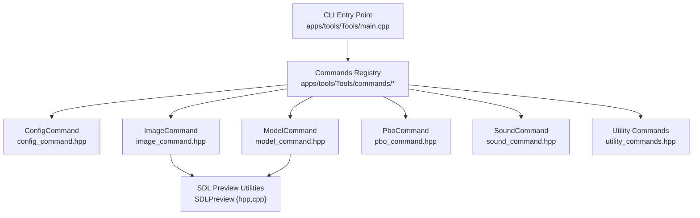
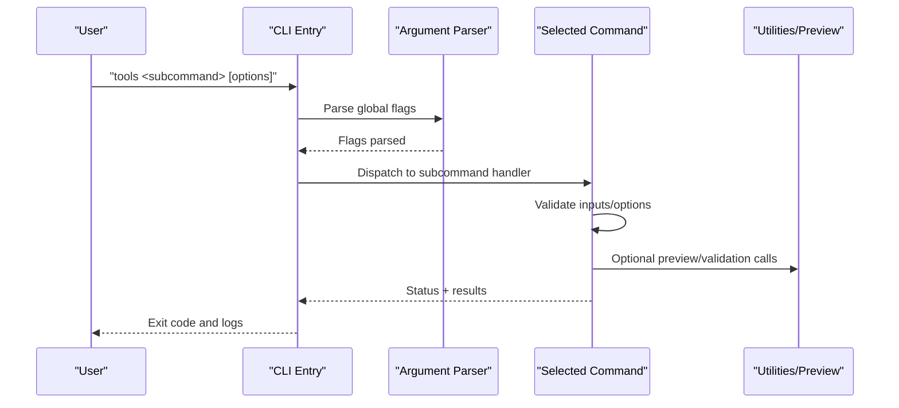
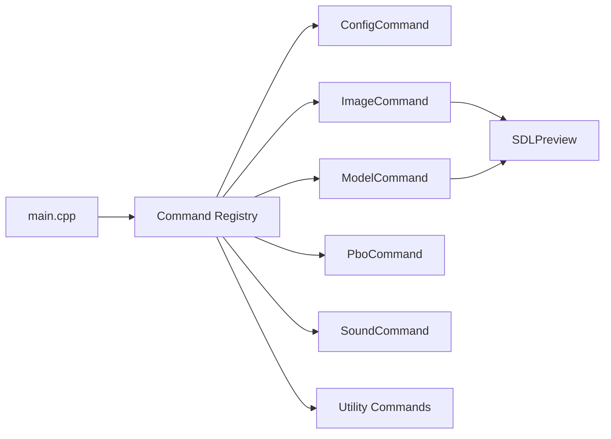

# Command-Line Tools

<cite>
**Referenced Files in This Document**
- [main.cpp](file://apps/tools/Tools/main.cpp)
- [CMakeLists.txt](file://apps/tools/Tools/CMakeLists.txt)
- [commands/config_command.hpp](file://apps/tools/Tools/commands/config_command.hpp)
- [commands/image_command.hpp](file://apps/tools/Tools/commands/image_command.hpp)
- [commands/model_command.hpp](file://apps/tools/Tools/commands/model_command.hpp)
- [commands/pbo_command.hpp](file://apps/tools/Tools/commands/pbo_command.hpp)
- [commands/sound_command.hpp](file://apps/tools/Tools/commands/sound_command.hpp)
- [commands/utility_commands.hpp](file://apps/tools/Tools/commands/utility_commands.hpp)
- [SDLPreview.hpp](file://apps/tools/Tools/SDLPreview.hpp)
- [SDLPreview.cpp](file://apps/tools/Tools/SDLPreview.cpp)
</cite>

## Table of Contents
1. [Introduction](#introduction)
2. [Project Structure](#project-structure)
3. [Core Components](#core-components)
4. [Architecture Overview](#architecture-overview)
5. [Detailed Component Analysis](#detailed-component-analysis)
6. [Dependency Analysis](#dependency-analysis)
7. [Performance Considerations](#performance-considerations)
8. [Troubleshooting Guide](#troubleshooting-guide)
9. [Conclusion](#conclusion)
10. [Appendices](#appendices)

## Introduction
This document describes the command-line tools suite for asset processing and configuration management. It covers all available commands, their syntax, parameters, options, and output formats. Practical workflows are provided for common tasks such as batch-processing textures, validating configurations, creating PBO archives, and converting audio files. The guide also explains error handling, logging options, integration with build systems, performance considerations for large batches, and troubleshooting steps for frequent failures.

## Project Structure
The command-line tool is implemented under apps/tools/Tools. The executable entry point registers and dispatches commands from a dedicated commands directory. Supporting utilities include an SDL-based preview component used by certain commands.

**Diagram sources**
- [main.cpp](file://apps/tools/Tools/main.cpp)
- [CMakeLists.txt](file://apps/tools/Tools/CMakeLists.txt)
- [SDLPreview.hpp](file://apps/tools/Tools/SDLPreview.hpp)
- [SDLPreview.cpp](file://apps/tools/Tools/SDLPreview.cpp)

**Section sources**
- [main.cpp](file://apps/tools/Tools/main.cpp)
- [CMakeLists.txt](file://apps/tools/Tools/CMakeLists.txt)

## Core Components
- ConfigCommand: Reads, validates, merges, and writes configuration files. Supports schema validation and structured output for CI pipelines.
- ImageCommand: Processes texture assets (e.g., conversion, resizing, mip generation). Provides batch mode and progress reporting.
- ModelCommand: Operates on P3D models (e.g., validation, export, inspection). Integrates with the SDL preview for quick visual checks.
- PboCommand: Creates, updates, and verifies PBO archives. Supports compression, filtering, and integrity checks.
- SoundCommand: Converts and processes audio files (e.g., format conversion, resampling, normalization).
- Utility Commands: Miscellaneous helpers (e.g., file listing, checksums, path resolution).

Each command exposes a consistent interface:
- Subcommand name
- Required and optional flags
- Input/output paths or globs
- Logging verbosity levels
- Output formats (text, JSON)

**Section sources**
- [config_command.hpp](file://apps/tools/Tools/commands/config_command.hpp)
- [image_command.hpp](file://apps/tools/Tools/commands/image_command.hpp)
- [model_command.hpp](file://apps/tools/Tools/commands/model_command.hpp)
- [pbo_command.hpp](file://apps/tools/Tools/commands/pbo_command.hpp)
- [sound_command.hpp](file://apps/tools/Tools/commands/sound_command.hpp)
- [utility_commands.hpp](file://apps/tools/Tools/commands/utility_commands.hpp)

## Architecture Overview
The CLI follows a simple dispatcher pattern:
- The main entry parses global options (verbosity, log targets).
- A subcommand is selected based on the first argument.
- The selected command parses its own arguments and executes the corresponding workflow.
- Results are emitted to stdout/stderr or written to files depending on options.

**Diagram sources**
- [main.cpp](file://apps/tools/Tools/main.cpp)
- [SDLPreview.hpp](file://apps/tools/Tools/SDLPreview.hpp)
- [SDLPreview.cpp](file://apps/tools/Tools/SDLPreview.cpp)

## Detailed Component Analysis

### ConfigCommand
Purpose:
- Read configuration files and validate against schemas.
- Merge multiple configs with precedence rules.
- Export normalized outputs for consumption by other tools.

Common workflow:
- Validate a config file and emit errors/warnings.
- Merge base and override configs into a single output.
- Generate a report in text or JSON for CI.

Options and behavior:
- Input paths: one or more config files.
- Output format: text (default) or JSON.
- Validation strictness: allow missing keys, warn vs error.
- Merge strategy: shallow/deep merge; conflict resolution policy.

Output formats:
- Text: human-readable summary and diagnostics.
- JSON: machine-readable structure suitable for automation.

Example usage patterns:
- Validate a single config file.
- Merge two configs and write result.
- Emit JSON report for CI.

Error handling:
- Missing files produce clear errors.
- Schema violations list offending keys and types.
- Non-zero exit code on validation failure.

Logging:
- Verbose flag increases diagnostic detail.
- Log target can be redirected to a file.

**Section sources**
- [config_command.hpp](file://apps/tools/Tools/commands/config_command.hpp)

### ImageCommand
Purpose:
- Convert and process image assets (textures).
- Batch operations across directories.
- Optional preview via SDL utility.

Common workflow:
- Convert a set of images to a target format.
- Resize and generate mipmaps.
- Validate image integrity and metadata.

Options and behavior:
- Input glob patterns for batch processing.
- Target format and quality settings.
- Resize dimensions and scaling algorithm.
- Mip generation toggles and levels.
- Progress indicator and per-file status.

Output formats:
- Console progress and per-file results.
- Optional JSON manifest of processed files.

Example usage patterns:
- Batch convert PNGs to a compressed texture format.
- Resize and mip all textures under a folder.
- Validate and report broken textures.

Error handling:
- Unsupported formats reported per file.
- I/O errors logged with file path context.
- Non-zero exit code if any file fails.

Logging:
- Verbose mode includes decoding details.
- Quiet mode suppresses non-error output.

**Section sources**
- [image_command.hpp](file://apps/tools/Tools/commands/image_command.hpp)
- [SDLPreview.hpp](file://apps/tools/Tools/SDLPreview.hpp)
- [SDLPreview.cpp](file://apps/tools/Tools/SDLPreview.cpp)

### ModelCommand
Purpose:
- Inspect and validate P3D model files.
- Export subsets or metadata.
- Quick preview using SDL utilities.

Common workflow:
- Validate model geometry and references.
- Extract metadata or bounding boxes.
- Preview a model interactively.

Options and behavior:
- Input model path(s).
- Validation depth (light vs full).
- Export targets (metadata, meshes).
- Preview window controls (scale, rotation).

Output formats:
- Text diagnostics and summaries.
- JSON for automated checks.

Example usage patterns:
- Validate a model and fail fast on critical issues.
- Export bounding box data for collision setup.
- Preview a model before committing changes.

Error handling:
- Corrupted models flagged with location hints.
- Missing dependencies listed explicitly.
- Non-zero exit code on validation failure.

Logging:
- Verbose mode prints traversal details.
- Quiet mode only shows errors.

**Section sources**
- [model_command.hpp](file://apps/tools/Tools/commands/model_command.hpp)
- [SDLPreview.hpp](file://apps/tools/Tools/SDLPreview.hpp)
- [SDLPreview.cpp](file://apps/tools/Tools/SDLPreview.cpp)

### PboCommand
Purpose:
- Create, update, and verify PBO archives.
- Apply compression and filters.
- Generate integrity manifests.

Common workflow:
- Build a PBO from a source tree.
- Update existing PBO with new files.
- Verify archive integrity and signatures.

Options and behavior:
- Source directory or file list.
- Compression level and algorithm selection.
- Include/exclude patterns.
- Manifest generation and verification.

Output formats:
- Console progress and summary.
- JSON manifest for downstream tools.

Example usage patterns:
- Create a compressed PBO from a mod folder.
- Update a PBO with changed assets only.
- Verify a PBO against a known manifest.

Error handling:
- Duplicate entries detected and reported.
- Write failures include disk space checks.
- Non-zero exit code on verification failure.

Logging:
- Verbose mode lists each file operation.
- Quiet mode reduces output to essential lines.

**Section sources**
- [pbo_command.hpp](file://apps/tools/Tools/commands/pbo_command.hpp)

### SoundCommand
Purpose:
- Convert and process audio files.
- Normalize volume and resample rates.
- Validate audio streams.

Common workflow:
- Convert WAV to target audio format.
- Resample to a specific sample rate.
- Normalize amplitude across a batch.

Options and behavior:
- Input audio files or globs.
- Target format and quality.
- Sample rate and channel configuration.
- Normalization thresholds.

Output formats:
- Per-file conversion status.
- Optional JSON report.

Example usage patterns:
- Convert a directory of WAVs to a compressed format.
- Resample all audio to 48 kHz.
- Normalize volumes and report outliers.

Error handling:
- Invalid headers or truncated files flagged.
- Conversion failures include codec details.
- Non-zero exit code if any file fails.

Logging:
- Verbose mode includes codec negotiation details.
- Quiet mode hides intermediate steps.

**Section sources**
- [sound_command.hpp](file://apps/tools/Tools/commands/sound_command.hpp)

### Utility Commands
Purpose:
- Provide helper operations like file listing, checksum computation, and path resolution.

Common workflow:
- List files matching patterns.
- Compute checksums for integrity checks.
- Resolve relative paths to absolute.

Options and behavior:
- Glob patterns and recursion toggles.
- Checksum algorithms (e.g., SHA-256).
- Path normalization options.

Output formats:
- Text lists and checksums.
- JSON for programmatic use.

Example usage patterns:
- Recursively list all assets under a directory.
- Generate checksums for a release bundle.
- Normalize paths for cross-platform builds.

Error handling:
- Permission errors reported per file.
- Non-zero exit code on failures.

Logging:
- Verbose mode includes detailed traversal.
- Quiet mode limits to required output.

**Section sources**
- [utility_commands.hpp](file://apps/tools/Tools/commands/utility_commands.hpp)

## Dependency Analysis
The CLI depends on:
- Argument parsing and dispatch logic in the entry point.
- Command implementations under commands/*.
- SDL preview utilities for interactive model/image previews.
- CMake build configuration for linking and installation.

**Diagram sources**
- [main.cpp](file://apps/tools/Tools/main.cpp)
- [CMakeLists.txt](file://apps/tools/Tools/CMakeLists.txt)
- [SDLPreview.hpp](file://apps/tools/Tools/SDLPreview.hpp)
- [SDLPreview.cpp](file://apps/tools/Tools/SDLPreview.cpp)

**Section sources**
- [main.cpp](file://apps/tools/Tools/main.cpp)
- [CMakeLists.txt](file://apps/tools/Tools/CMakeLists.txt)

## Performance Considerations
- Batch processing: Use glob patterns to process many files in a single invocation to reduce startup overhead.
- Parallelism: Where supported, enable parallel workers for image/audio conversions to utilize multi-core CPUs.
- Memory usage: Avoid loading entire directories into memory; stream large assets when possible.
- I/O throughput: Prefer SSD storage for input/output during large batches; avoid network mounts.
- Compression trade-offs: Higher compression levels increase CPU time; choose balanced settings for CI pipelines.
- Logging overhead: Disable verbose logging in production runs to minimize I/O contention.

[No sources needed since this section provides general guidance]

## Troubleshooting Guide
Common issues and resolutions:
- Missing input files: Ensure paths are correct and accessible; check permissions.
- Unsupported formats: Verify codecs and libraries are installed; consult error messages for specifics.
- Archive integrity failures: Rebuild the archive and regenerate manifests; compare checksums.
- Preview failures: Confirm display drivers and SDL dependencies are present; run without preview to isolate issues.
- High memory usage: Reduce batch size or disable heavy features like mip generation.

Logging strategies:
- Increase verbosity to capture detailed diagnostics.
- Redirect logs to a file for later analysis.
- Use quiet mode in automated scripts to focus on errors.

Exit codes:
- Zero indicates success.
- Non-zero indicates failure; inspect logs for root cause.

**Section sources**
- [config_command.hpp](file://apps/tools/Tools/commands/config_command.hpp)
- [image_command.hpp](file://apps/tools/Tools/commands/image_command.hpp)
- [model_command.hpp](file://apps/tools/Tools/commands/model_command.hpp)
- [pbo_command.hpp](file://apps/tools/Tools/commands/pbo_command.hpp)
- [sound_command.hpp](file://apps/tools/Tools/commands/sound_command.hpp)
- [utility_commands.hpp](file://apps/tools/Tools/commands/utility_commands.hpp)

## Conclusion
The command-line tools provide a cohesive suite for configuration management and asset processing. Each command offers consistent interfaces, robust error handling, and flexible logging. By following the documented workflows and best practices, teams can automate texture processing, model validation, PBO packaging, and audio conversion efficiently within CI/CD pipelines.

[No sources needed since this section summarizes without analyzing specific files]

## Appendices

### Practical Workflows

- Batch processing textures:
  - Use ImageCommand with glob patterns to convert and resize textures.
  - Enable mip generation and progress reporting.
  - Export a JSON manifest for tracking.

- Validating configurations:
  - Run ConfigCommand with strict validation.
  - Merge base and override configs.
  - Output JSON for CI checks.

- Creating PBO archives:
  - Use PboCommand to package a directory.
  - Select compression level appropriate for CI speed.
  - Generate and store manifests for verification.

- Converting audio files:
  - Use SoundCommand to convert and resample.
  - Normalize volumes across a batch.
  - Report failures per file for targeted fixes.

[No sources needed since this section provides general guidance]