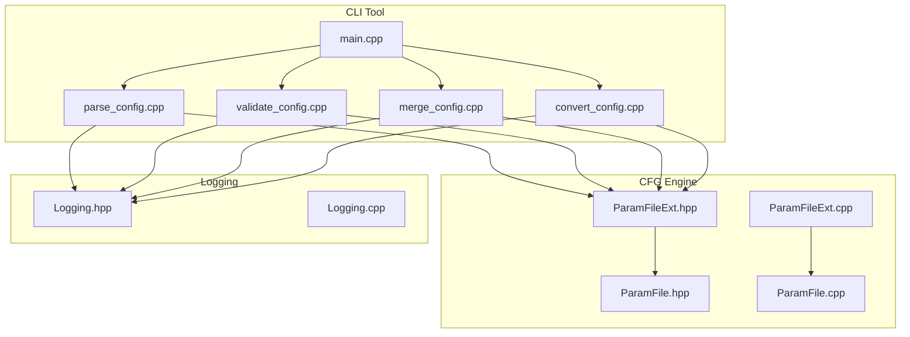
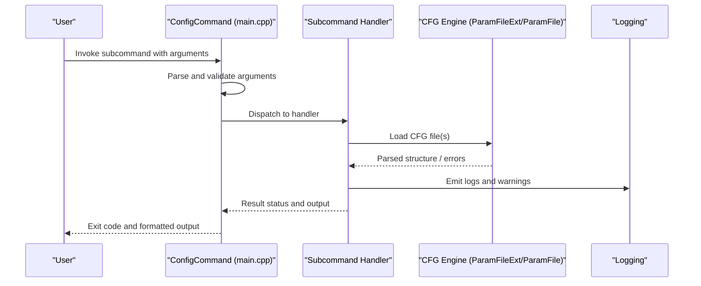
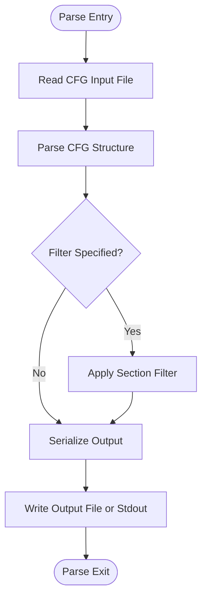
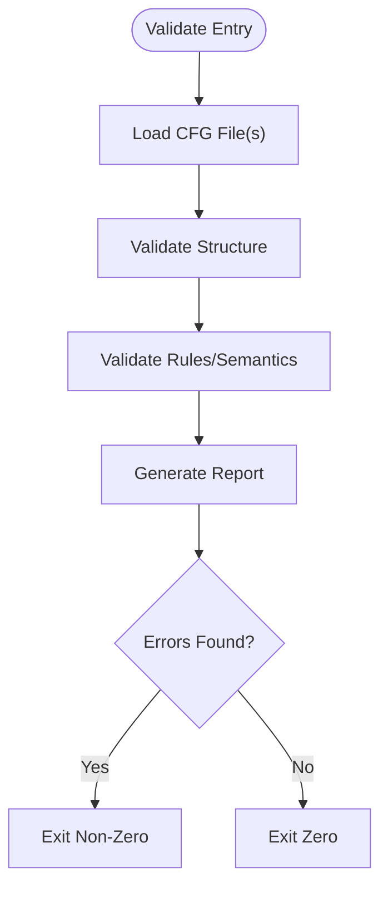
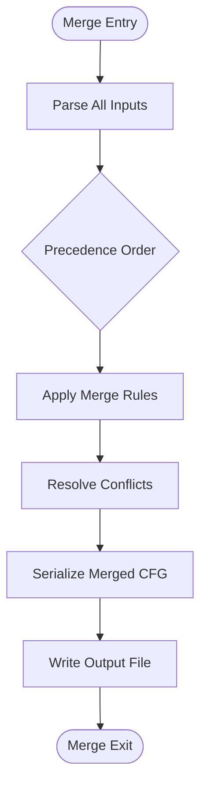
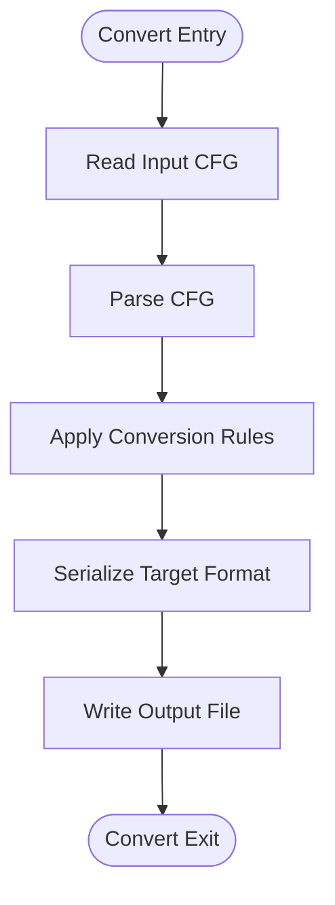
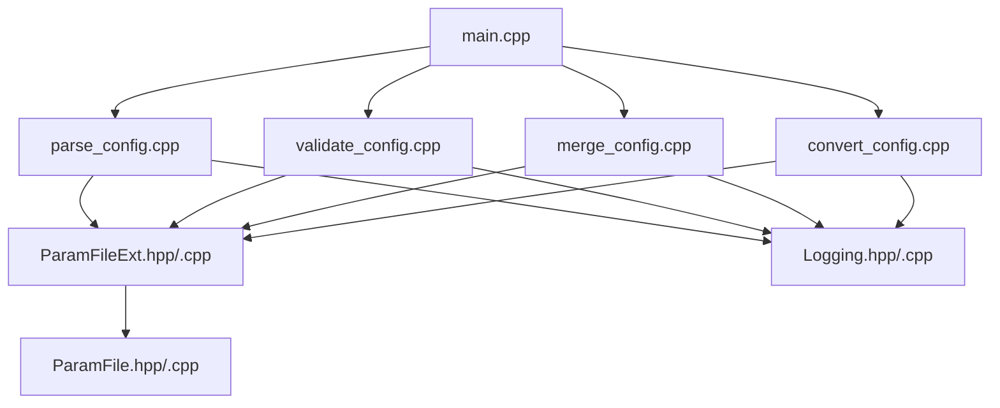

# Config Command

<cite>
**Referenced Files in This Document**
- [main.cpp](file://apps/tools/Tools/main.cpp)
- [CMakeLists.txt](file://apps/tools/Tools/CMakeLists.txt)
- [commands/parse_config.cpp](file://apps/tools/Tools/commands/parse_config.cpp)
- [commands/validate_config.cpp](file://apps/tools/Tools/commands/validate_config.cpp)
- [commands/merge_config.cpp](file://apps/tools/Tools/commands/merge_config.cpp)
- [commands/convert_config.cpp](file://apps/tools/Tools/commands/convert_config.cpp)
- [ParamFileExt.hpp](file://engine/Poseidon/IO/ParamFileExt.hpp)
- [ParamFileExt.cpp](file://engine/Poseidon/IO/ParamFileExt.cpp)
- [ParamFile.hpp](file://engine/Poseidon/IO/ParamFile/ParamFile.hpp)
- [ParamFile.cpp](file://engine/Poseidon/IO/ParamFile/ParamFile.cpp)
- [Logging.hpp](file://engine/Poseidon/Foundation/Logging/Logging.hpp)
- [Logging.cpp](file://engine/Poseidon/Foundation/Logging/Logging.cpp)
</cite>

## Table of Contents
1. [Introduction](#introduction)
2. [Project Structure](#project-structure)
3. [Core Components](#core-components)
4. [Architecture Overview](#architecture-overview)
5. [Detailed Component Analysis](#detailed-component-analysis)
6. [Dependency Analysis](#dependency-analysis)
7. [Performance Considerations](#performance-considerations)
8. [Troubleshooting Guide](#troubleshooting-guide)
9. [Conclusion](#conclusion)

## Introduction
This document describes the ConfigCommand tool used for configuration file manipulation and validation within the project. It focuses on CFG-format configuration files and provides guidance on parsing, validating, merging, and converting these files. The documentation explains command syntax, parameters, output formats, error handling, logging levels, and integration points suitable for development pipelines. Practical workflows are included to help validate mission configurations, merge multiple config files, extract specific sections, and debug issues efficiently.

## Project Structure
The ConfigCommand tool is implemented as a CLI application under the tools directory. It exposes subcommands that delegate to dedicated command handlers. Core CFG parsing and validation logic resides in the engine’s IO subsystem.

**Diagram sources**
- [main.cpp](file://apps/tools/Tools/main.cpp)
- [parse_config.cpp](file://apps/tools/Tools/commands/parse_config.cpp)
- [validate_config.cpp](file://apps/tools/Tools/commands/validate_config.cpp)
- [merge_config.cpp](file://apps/tools/Tools/commands/merge_config.cpp)
- [convert_config.cpp](file://apps/tools/Tools/commands/convert_config.cpp)
- [ParamFileExt.hpp](file://engine/Poseidon/IO/ParamFileExt.hpp)
- [ParamFileExt.cpp](file://engine/Poseidon/IO/ParamFileExt.cpp)
- [ParamFile.hpp](file://engine/Poseidon/IO/ParamFile/ParamFile.hpp)
- [ParamFile.cpp](file://engine/Poseidon/IO/ParamFile/ParamFile.cpp)
- [Logging.hpp](file://engine/Poseidon/Foundation/Logging/Logging.hpp)
- [Logging.cpp](file://engine/Poseidon/Foundation/Logging/Logging.cpp)

**Section sources**
- [main.cpp](file://apps/tools/Tools/main.cpp)
- [CMakeLists.txt](file://apps/tools/Tools/CMakeLists.txt)

## Core Components
- CLI entrypoint: Initializes argument parsing and dispatches to subcommands.
- Subcommand handlers: Implement parse, validate, merge, and convert operations for CFG files.
- CFG engine: Provides parsing, validation, and serialization utilities for CFG format.
- Logging: Centralized logging with configurable verbosity for diagnostics and pipeline integration.

Key responsibilities:
- Argument parsing and validation for each subcommand.
- File I/O for reading/writing CFG files.
- Validation rules and error reporting.
- Merging strategies and conflict resolution.
- Conversion between CFG representations or formats.

**Section sources**
- [main.cpp](file://apps/tools/Tools/main.cpp)
- [parse_config.cpp](file://apps/tools/Tools/commands/parse_config.cpp)
- [validate_config.cpp](file://apps/tools/Tools/commands/validate_config.cpp)
- [merge_config.cpp](file://apps/tools/Tools/commands/merge_config.cpp)
- [convert_config.cpp](file://apps/tools/Tools/commands/convert_config.cpp)
- [ParamFileExt.hpp](file://engine/Poseidon/IO/ParamFileExt.hpp)
- [ParamFileExt.cpp](file://engine/Poseidon/IO/ParamFileExt.cpp)
- [ParamFile.hpp](file://engine/Poseidon/IO/ParamFile/ParamFile.hpp)
- [ParamFile.cpp](file://engine/Poseidon/IO/ParamFile/ParamFile.cpp)
- [Logging.hpp](file://engine/Poseidon/Foundation/Logging/Logging.hpp)
- [Logging.cpp](file://engine/Poseidon/Foundation/Logging/Logging.cpp)

## Architecture Overview
The ConfigCommand tool follows a modular architecture where the CLI layer delegates to specialized command modules. Each command module uses the CFG engine for parsing and validation, and the logging subsystem for consistent diagnostics.

**Diagram sources**
- [main.cpp](file://apps/tools/Tools/main.cpp)
- [parse_config.cpp](file://apps/tools/Tools/commands/parse_config.cpp)
- [validate_config.cpp](file://apps/tools/Tools/commands/validate_config.cpp)
- [merge_config.cpp](file://apps/tools/Tools/commands/merge_config.cpp)
- [convert_config.cpp](file://apps/tools/Tools/commands/convert_config.cpp)
- [ParamFileExt.hpp](file://engine/Poseidon/IO/ParamFileExt.hpp)
- [ParamFileExt.cpp](file://engine/Poseidon/IO/ParamFileExt.cpp)
- [ParamFile.hpp](file://engine/Poseidon/IO/ParamFile/ParamFile.hpp)
- [ParamFile.cpp](file://engine/Poseidon/IO/ParamFile/ParamFile.cpp)
- [Logging.hpp](file://engine/Poseidon/Foundation/Logging/Logging.hpp)
- [Logging.cpp](file://engine/Poseidon/Foundation/Logging/Logging.cpp)

## Detailed Component Analysis

### CLI Entrypoint
Responsibilities:
- Parse global options (e.g., logging level).
- Recognize subcommands and forward arguments to handlers.
- Provide usage information and exit codes.

Common workflow:
- Initialize logging based on verbosity flags.
- Validate required inputs per subcommand.
- Execute handler and return appropriate exit status.

**Section sources**
- [main.cpp](file://apps/tools/Tools/main.cpp)

### Parse Subcommand
Purpose:
- Read a CFG file and produce a structured representation or textual dump.

Typical parameters:
- Input file path.
- Output destination (stdout or file).
- Output format selection (e.g., JSON-like or canonical CFG).
- Optional section filter to limit output.

Processing steps:
- Open and read input file.
- Parse CFG into internal structure.
- Apply filters if specified.
- Serialize to requested format.
- Write output and log results.

**Diagram sources**
- [parse_config.cpp](file://apps/tools/Tools/commands/parse_config.cpp)
- [ParamFileExt.hpp](file://engine/Poseidon/IO/ParamFileExt.hpp)
- [ParamFileExt.cpp](file://engine/Poseidon/IO/ParamFileExt.cpp)
- [ParamFile.hpp](file://engine/Poseidon/IO/ParamFile/ParamFile.hpp)
- [ParamFile.cpp](file://engine/Poseidon/IO/ParamFile/ParamFile.cpp)

**Section sources**
- [parse_config.cpp](file://apps/tools/Tools/commands/parse_config.cpp)

### Validate Subcommand
Purpose:
- Verify CFG integrity against schema and semantic rules.

Typical parameters:
- One or more input files.
- Strictness mode (warnings vs errors).
- Optional schema or rule set selection.
- Output format for report (text, machine-readable).

Processing steps:
- Load CFG file(s).
- Run structural and semantic validations.
- Collect errors and warnings.
- Generate report and exit with non-zero status on failures.

**Diagram sources**
- [validate_config.cpp](file://apps/tools/Tools/commands/validate_config.cpp)
- [ParamFileExt.hpp](file://engine/Poseidon/IO/ParamFileExt.hpp)
- [ParamFileExt.cpp](file://engine/Poseidon/IO/ParamFileExt.cpp)
- [ParamFile.hpp](file://engine/Poseidon/IO/ParamFile/ParamFile.hpp)
- [ParamFile.cpp](file://engine/Poseidon/IO/ParamFile/ParamFile.cpp)

**Section sources**
- [validate_config.cpp](file://apps/tools/Tools/commands/validate_config.cpp)

### Merge Subcommand
Purpose:
- Combine multiple CFG files into a single output, resolving conflicts according to defined precedence.

Typical parameters:
- Ordered list of input files (later files override earlier ones).
- Conflict strategy (last-wins, custom resolver).
- Output file path.
- Optional diff or verbose mode.

Processing steps:
- Parse all input files.
- Merge structures with precedence rules.
- Resolve conflicts using strategy.
- Serialize merged result.
- Write output and log actions.

**Diagram sources**
- [merge_config.cpp](file://apps/tools/Tools/commands/merge_config.cpp)
- [ParamFileExt.hpp](file://engine/Poseidon/IO/ParamFileExt.hpp)
- [ParamFileExt.cpp](file://engine/Poseidon/IO/ParamFileExt.cpp)
- [ParamFile.hpp](file://engine/Poseidon/IO/ParamFile/ParamFile.hpp)
- [ParamFile.cpp](file://engine/Poseidon/IO/ParamFile/ParamFile.cpp)

**Section sources**
- [merge_config.cpp](file://apps/tools/Tools/commands/merge_config.cpp)

### Convert Subcommand
Purpose:
- Transform CFG content between different representations or formats supported by the tool.

Typical parameters:
- Input file path.
- Target format (e.g., normalized CFG, JSON-like, or other).
- Output file path.
- Options controlling conversion behavior.

Processing steps:
- Read and parse input CFG.
- Apply transformation rules.
- Serialize to target format.
- Write output and log conversion details.

**Diagram sources**
- [convert_config.cpp](file://apps/tools/Tools/commands/convert_config.cpp)
- [ParamFileExt.hpp](file://engine/Poseidon/IO/ParamFileExt.hpp)
- [ParamFileExt.cpp](file://engine/Poseidon/IO/ParamFileExt.cpp)
- [ParamFile.hpp](file://engine/Poseidon/IO/ParamFile/ParamFile.hpp)
- [ParamFile.cpp](file://engine/Poseidon/IO/ParamFile/ParamFile.cpp)

**Section sources**
- [convert_config.cpp](file://apps/tools/Tools/commands/convert_config.cpp)

### CFG Engine Integration
The CFG engine provides core parsing and validation capabilities:
- Parsing CFG text into an internal tree structure.
- Validating nodes, keys, values, and relationships.
- Serializing back to CFG text or alternative formats.

Key components:
- ParamFileExt: Extended utilities for CFG operations.
- ParamFile: Core CFG data model and parser.

**Section sources**
- [ParamFileExt.hpp](file://engine/Poseidon/IO/ParamFileExt.hpp)
- [ParamFileExt.cpp](file://engine/Poseidon/IO/ParamFileExt.cpp)
- [ParamFile.hpp](file://engine/Poseidon/IO/ParamFile/ParamFile.hpp)
- [ParamFile.cpp](file://engine/Poseidon/IO/ParamFile/ParamFile.cpp)

### Logging and Diagnostics
Logging is centralized and supports multiple verbosity levels:
- Error: Critical failures and validation errors.
- Warning: Potential issues and non-fatal problems.
- Info: General progress and operation summaries.
- Debug: Detailed step-by-step diagnostics.

Integration points:
- Each subcommand emits logs at appropriate levels.
- Global verbosity can be configured via CLI flags.
- Logs can be directed to stdout/stderr or files depending on environment.

**Section sources**
- [Logging.hpp](file://engine/Poseidon/Foundation/Logging/Logging.hpp)
- [Logging.cpp](file://engine/Poseidon/Foundation/Logging/Logging.cpp)

## Dependency Analysis
The CLI depends on command modules, which in turn depend on the CFG engine and logging subsystem. There is minimal coupling between commands, promoting maintainability and testability.

**Diagram sources**
- [main.cpp](file://apps/tools/Tools/main.cpp)
- [parse_config.cpp](file://apps/tools/Tools/commands/parse_config.cpp)
- [validate_config.cpp](file://apps/tools/Tools/commands/validate_config.cpp)
- [merge_config.cpp](file://apps/tools/Tools/commands/merge_config.cpp)
- [convert_config.cpp](file://apps/tools/Tools/commands/convert_config.cpp)
- [ParamFileExt.hpp](file://engine/Poseidon/IO/ParamFileExt.hpp)
- [ParamFileExt.cpp](file://engine/Poseidon/IO/ParamFileExt.cpp)
- [ParamFile.hpp](file://engine/Poseidon/IO/ParamFile/ParamFile.hpp)
- [ParamFile.cpp](file://engine/Poseidon/IO/ParamFile/ParamFile.cpp)
- [Logging.hpp](file://engine/Poseidon/Foundation/Logging/Logging.hpp)
- [Logging.cpp](file://engine/Poseidon/Foundation/Logging/Logging.cpp)

**Section sources**
- [main.cpp](file://apps/tools/Tools/main.cpp)
- [CMakeLists.txt](file://apps/tools/Tools/CMakeLists.txt)

## Performance Considerations
- Large CFG files: Prefer streaming parsers and avoid loading entire trees into memory when possible. Use section filters to reduce processing scope.
- Validation overhead: Enable strict mode selectively; run lightweight checks first before expensive semantic validations.
- Merging performance: Order inputs strategically so that smaller or less conflicting files are processed first. Use incremental merges for very large sets.
- I/O optimization: Buffer reads/writes and avoid unnecessary re-parsing by caching intermediate structures when feasible.
- Logging impact: Reduce verbosity in production pipelines to minimize overhead; enable debug only during troubleshooting.

[No sources needed since this section provides general guidance]

## Troubleshooting Guide
Common issues and resolutions:
- Parse errors: Check syntax, missing brackets, or invalid key-value pairs. Use parse output to locate problematic sections.
- Validation failures: Review error messages and adjust CFG to match expected schema. Enable stricter modes to catch subtle issues early.
- Merge conflicts: Inspect conflict reports and adjust precedence order or implement custom resolvers.
- Missing dependencies: Ensure referenced CFG files exist and paths are correct.
- Logging not visible: Confirm verbosity flags and output destinations; redirect stderr if necessary.

Diagnostic tips:
- Use parse to dump CFG structure and verify correctness.
- Run validate with increasing strictness to isolate issues.
- For merges, generate diffs to understand overrides.
- Capture logs with debug level to trace execution flow.

**Section sources**
- [parse_config.cpp](file://apps/tools/Tools/commands/parse_config.cpp)
- [validate_config.cpp](file://apps/tools/Tools/commands/validate_config.cpp)
- [merge_config.cpp](file://apps/tools/Tools/commands/merge_config.cpp)
- [convert_config.cpp](file://apps/tools/Tools/commands/convert_config.cpp)
- [Logging.hpp](file://engine/Poseidon/Foundation/Logging/Logging.hpp)
- [Logging.cpp](file://engine/Poseidon/Foundation/Logging/Logging.cpp)

## Conclusion
The ConfigCommand tool provides a robust set of subcommands for working with CFG configuration files. Its modular design separates CLI concerns from CFG engine logic, enabling clear maintenance and extensibility. By following the documented workflows and leveraging logging and validation features, developers can efficiently manage configuration files in both interactive and automated environments.

[No sources needed since this section summarizes without analyzing specific files]