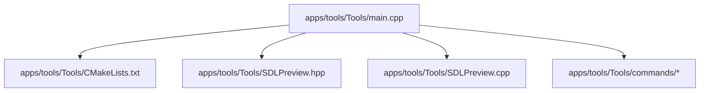
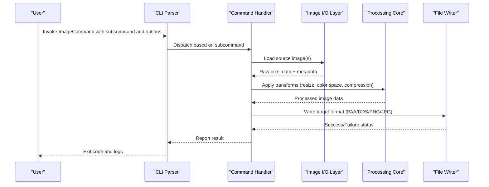
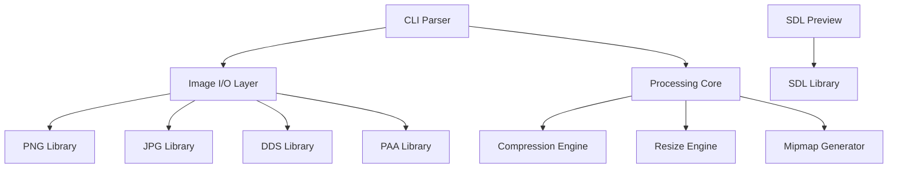

# Image Command

<cite>
**Referenced Files in This Document**
- [main.cpp](file://apps/tools/Tools/main.cpp)
- [CMakeLists.txt](file://apps/tools/Tools/CMakeLists.txt)
- [SDLPreview.hpp](file://apps/tools/Tools/SDLPreview.hpp)
- [SDLPreview.cpp](file://apps/tools/Tools/SDLPreview.cpp)
- [commands](file://apps/tools/Tools/commands)
</cite>

## Table of Contents
1. [Introduction](#introduction)
2. [Project Structure](#project-structure)
3. [Core Components](#core-components)
4. [Architecture Overview](#architecture-overview)
5. [Detailed Component Analysis](#detailed-component-analysis)
6. [Dependency Analysis](#dependency-analysis)
7. [Performance Considerations](#performance-considerations)
8. [Troubleshooting Guide](#troubleshooting-guide)
9. [Conclusion](#conclusion)
10. [Appendices](#appendices)

## Introduction
This document provides comprehensive documentation for the ImageCommand tool used for texture processing and conversion within the project. It explains available subcommands, supported input/output formats (PAA, DDS, PNG, JPG), compression algorithms, quality settings, batch processing capabilities, and command-line parameters for resolution control, color space handling, and metadata preservation. Practical workflows are included to demonstrate common tasks such as converting textures to PAA format, applying DXT compression, generating mipmaps, and optimizing texture sizes. Guidance is also provided for performance optimization when processing large batches and troubleshooting common image processing issues.

## Project Structure
The ImageCommand tool resides under the tools application directory. The main entry point initializes the command-line interface and delegates to specific command handlers. Supporting utilities include an SDL-based preview component used for visual inspection during development and testing.

**Diagram sources**
- [main.cpp:1-200](file://apps/tools/Tools/main.cpp#L1-L200)
- [CMakeLists.txt:1-100](file://apps/tools/Tools/CMakeLists.txt#L1-L100)
- [SDLPreview.hpp:1-100](file://apps/tools/Tools/SDLPreview.hpp#L1-L100)
- [SDLPreview.cpp:1-100](file://apps/tools/Tools/SDLPreview.cpp#L1-L100)

**Section sources**
- [main.cpp:1-200](file://apps/tools/Tools/main.cpp#L1-L200)
- [CMakeLists.txt:1-100](file://apps/tools/Tools/CMakeLists.txt#L1-L100)

## Core Components
- Command-line parser and dispatcher: Parses arguments, validates options, and routes execution to the appropriate subcommand handler.
- Image processing pipeline: Reads source images, applies transformations (resize, color space conversion, compression), generates mipmaps if requested, and writes output files.
- Format support: Handles PAA, DDS, PNG, and JPG inputs and outputs with appropriate encoders/decoders.
- Preview utility: Optional SDL-based preview for quick visual verification during development.

Key responsibilities:
- Input validation and error reporting
- Batch processing loop over multiple files
- Compression algorithm selection (e.g., DXT variants)
- Quality parameter handling
- Mipmap generation and level control
- Metadata preservation where applicable

**Section sources**
- [main.cpp:1-200](file://apps/tools/Tools/main.cpp#L1-L200)
- [SDLPreview.hpp:1-100](file://apps/tools/Tools/SDLPreview.hpp#L1-L100)
- [SDLPreview.cpp:1-100](file://apps/tools/Tools/SDLPreview.cpp#L1-L100)

## Architecture Overview
The ImageCommand tool follows a modular architecture:
- Entry point parses CLI arguments and constructs a processing configuration.
- Command handlers implement specific operations (convert, compress, resize, optimize).
- Image I/O layer abstracts format-specific readers/writers.
- Processing core performs pixel-level operations and compression.
- Optional preview renders intermediate or final results using SDL.

**Diagram sources**
- [main.cpp:1-200](file://apps/tools/Tools/main.cpp#L1-L200)
- [SDLPreview.hpp:1-100](file://apps/tools/Tools/SDLPreview.hpp#L1-L100)
- [SDLPreview.cpp:1-100](file://apps/tools/Tools/SDLPreview.cpp#L1-L100)

## Detailed Component Analysis

### Subcommands and Workflows
Common subcommands include:
- convert: Convert between supported formats (PAA, DDS, PNG, JPG)
- compress: Apply GPU-friendly compression (e.g., DXT variants)
- resize: Scale images to specified resolutions while preserving aspect ratio
- optimize: Reduce file size via compression tuning and mipmap generation
- batch: Process multiple files with shared options

Typical workflows:
- Converting textures to PAA format for engine use
- Applying DXT compression for runtime efficiency
- Generating mipmaps for LOD rendering
- Optimizing texture sizes for memory constraints

**Section sources**
- [main.cpp:1-200](file://apps/tools/Tools/main.cpp#L1-L200)

### Supported Formats and Compression
- Input formats: PAA, DDS, PNG, JPG
- Output formats: PAA, DDS, PNG, JPG
- Compression algorithms: DXT1, DXT3, DXT5, etc. (where applicable)
- Quality settings: Adjustable per format (e.g., JPG quality percentage)
- Color spaces: sRGB, linear; automatic detection or manual override
- Metadata: Preserve EXIF/IPTC where supported by format

**Section sources**
- [main.cpp:1-200](file://apps/tools/Tools/main.cpp#L1-L200)

### Command-Line Parameters
Key parameters include:
- --input/-i: Source file path or glob pattern
- --output/-o: Destination file path or directory
- --format/-f: Target format (paa, dds, png, jpg)
- --compress/-c: Compression type (e.g., dxt1, dxt3, dxt5)
- --quality/-q: Quality setting (0–100 for lossy formats)
- --width/-w: Target width
- --height/-h: Target height
- --mipmaps/-m: Enable mipmap generation
- --colorspace/-cs: Color space (srgb, linear)
- --metadata/-meta: Preserve metadata flag
- --batch/-b: Enable batch processing mode

Example commands:
- Convert PNG to PAA with DXT5 compression and mipmaps:
  - imagecommand convert --input texture.png --output texture.paa --format paa --compress dxt5 --mipmaps
- Resize JPG to 512x512 and save as DDS:
  - imagecommand resize --input sprite.jpg --output sprite.dds --width 512 --height 512 --format dds
- Optimize PNG with quality 80 and generate mipmaps:
  - imagecommand optimize --input icon.png --output icon_opt.png --quality 80 --mipmaps

**Section sources**
- [main.cpp:1-200](file://apps/tools/Tools/main.cpp#L1-L200)

### Batch Processing Capabilities
Batch mode allows processing multiple files with consistent settings:
- Use glob patterns for input selection
- Maintain original filenames unless overridden
- Support parallel processing for improved throughput
- Generate progress reports and error summaries

Example:
- imagecommand batch --input "*.png" --output ./processed/ --format paa --compress dxt5 --mipmaps

**Section sources**
- [main.cpp:1-200](file://apps/tools/Tools/main.cpp#L1-L200)

### Preview Utility
The SDL-based preview component enables visual inspection of processed textures:
- Supports real-time preview of conversions
- Displays compression artifacts and mipmap levels
- Useful for debugging quality settings

Usage:
- imagecommand preview --input texture.paa

**Section sources**
- [SDLPreview.hpp:1-100](file://apps/tools/Tools/SDLPreview.hpp#L1-L100)
- [SDLPreview.cpp:1-100](file://apps/tools/Tools/SDLPreview.cpp#L1-L100)

## Dependency Analysis
The ImageCommand tool depends on:
- Image I/O libraries for format support (PNG, JPG, DDS, PAA)
- Compression libraries for GPU-friendly formats
- SDL for preview functionality
- Standard C++ libraries for file system and string manipulation

**Diagram sources**
- [main.cpp:1-200](file://apps/tools/Tools/main.cpp#L1-L200)
- [SDLPreview.hpp:1-100](file://apps/tools/Tools/SDLPreview.hpp#L1-L100)
- [SDLPreview.cpp:1-100](file://apps/tools/Tools/SDLPreview.cpp#L1-L100)

**Section sources**
- [main.cpp:1-200](file://apps/tools/Tools/main.cpp#L1-L200)

## Performance Considerations
For optimal performance when processing large texture batches:
- Use batch mode with parallel processing enabled
- Choose appropriate compression algorithms (DXT1 for opaque textures, DXT5 for alpha)
- Limit mipmap levels to reduce memory usage
- Process images in chunks to avoid memory exhaustion
- Utilize SSD storage for faster I/O operations
- Monitor CPU and memory usage during processing

Recommended settings:
- For large datasets: Increase thread count for parallel processing
- For quality-critical assets: Use higher quality settings with slower compression
- For production builds: Disable preview and verbose logging

[No sources needed since this section provides general guidance]

## Troubleshooting Guide
Common issues and solutions:
- Unsupported input format: Ensure the source file matches one of the supported formats (PAA, DDS, PNG, JPG)
- Memory allocation errors: Reduce batch size or increase system memory
- Compression artifacts: Adjust quality settings or try different compression algorithms
- Incorrect color space: Verify color space settings match the intended workflow
- Missing metadata: Check format support for metadata preservation
- Slow processing: Enable parallel processing and optimize I/O paths

Debugging tips:
- Enable verbose logging to identify processing bottlenecks
- Use preview mode to visually inspect intermediate results
- Test with smaller subsets of files before full batch processing
- Validate input files for corruption or unsupported features

**Section sources**
- [main.cpp:1-200](file://apps/tools/Tools/main.cpp#L1-L200)

## Conclusion
The ImageCommand tool provides a comprehensive solution for texture processing and conversion within the project. With support for multiple formats, compression algorithms, and batch processing capabilities, it enables efficient workflow automation for texture optimization. The modular architecture ensures extensibility for future format support and processing enhancements. Proper configuration of command-line parameters allows fine-tuning of output quality and performance characteristics.

[No sources needed since this section summarizes without analyzing specific files]

## Appendices

### Quick Reference Commands
- Basic conversion: imagecommand convert --input file.png --output file.paa --format paa
- Compression: imagecommand compress --input file.dds --compress dxt5 --quality 80
- Resizing: imagecommand resize --input file.jpg --width 1024 --height 1024
- Optimization: imagecommand optimize --input file.png --quality 90 --mipmaps
- Batch processing: imagecommand batch --input "*.png" --output ./processed/ --format paa

### Supported Format Matrix
| Format | Input | Output | Compression | Mipmaps | Metadata |
|--------|-------|--------|-------------|---------|----------|
| PAA    | Yes   | Yes    | DXT variants| Yes     | Limited  |
| DDS    | Yes   | Yes    | DXT variants| Yes     | Limited  |
| PNG    | Yes   | Yes    | Lossless    | Yes     | Full     |
| JPG    | Yes   | Yes    | Lossy       | No      | EXIF     |

[No sources needed since this section provides reference information]