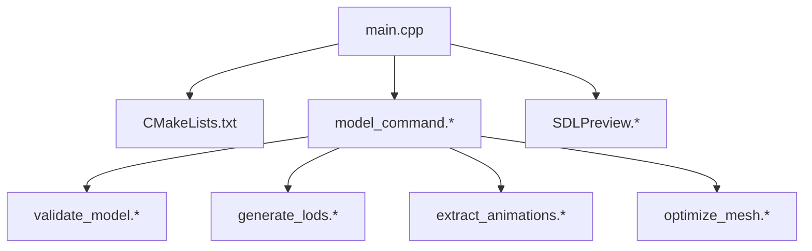
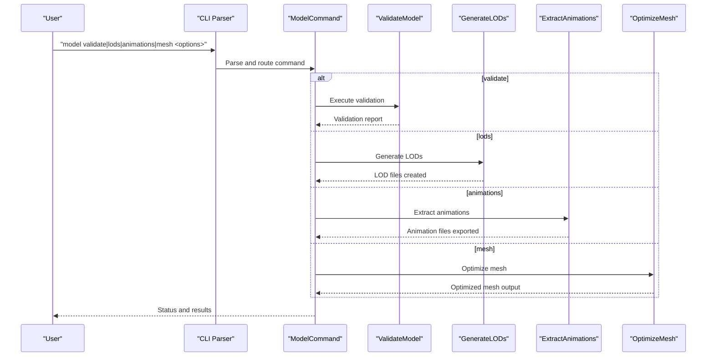
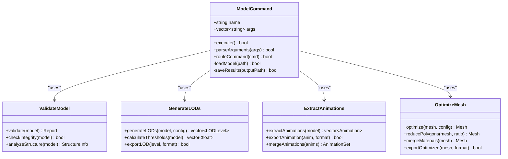
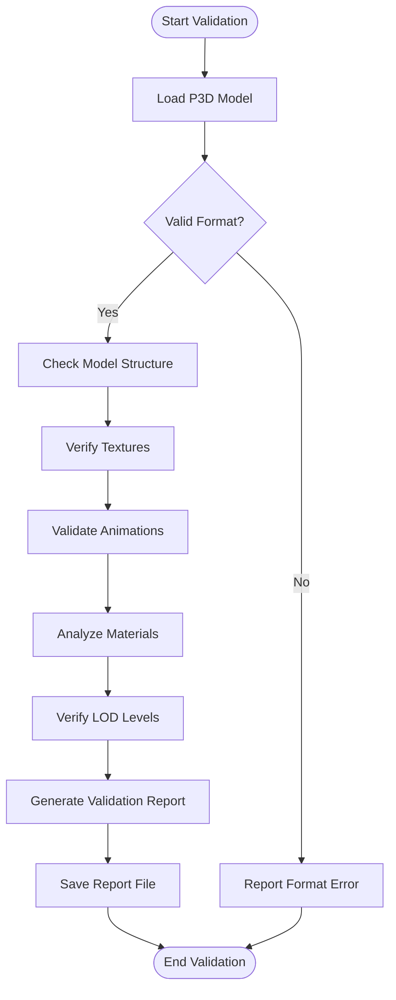
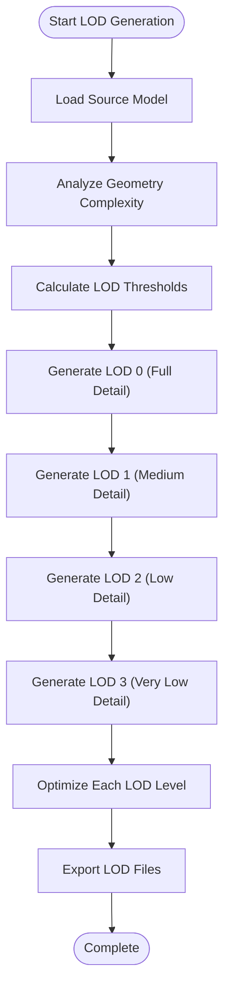
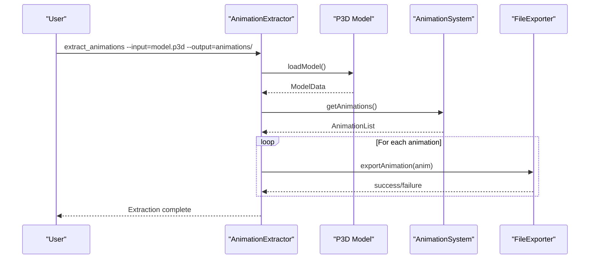
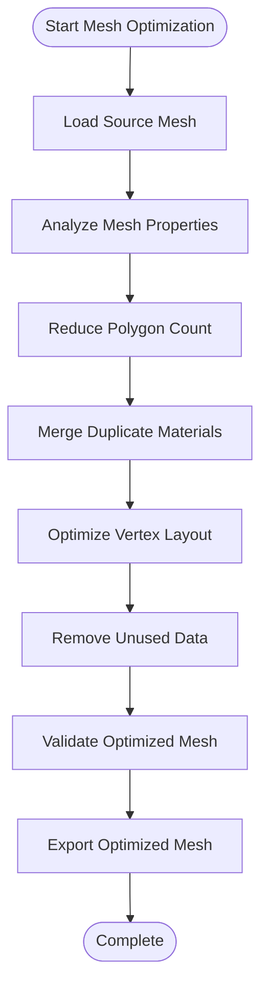
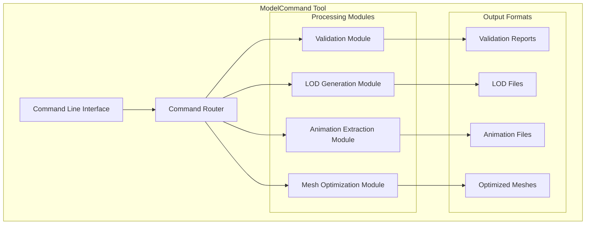
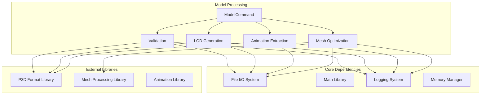

# Model Command

<cite>
**Referenced Files in This Document**
- [main.cpp](file://apps/tools/Tools/main.cpp)
- [CMakeLists.txt](file://apps/tools/Tools/CMakeLists.txt)
- [commands/model_command.hpp](file://apps/tools/Tools/commands/model_command.hpp)
- [commands/model_command.cpp](file://apps/tools/Tools/commands/model_command.cpp)
- [commands/validate_model.hpp](file://apps/tools/Tools/commands/validate_model.hpp)
- [commands/validate_model.cpp](file://apps/tools/Tools/commands/validate_model.cpp)
- [commands/generate_lods.hpp](file://apps/tools/Tools/commands/generate_lods.hpp)
- [commands/generate_lods.cpp](file://apps/tools/Tools/commands/generate_lods.cpp)
- [commands/extract_animations.hpp](file://apps/tools/Tools/commands/extract_animations.hpp)
- [commands/extract_animations.cpp](file://apps/tools/Tools/commands/extract_animations.cpp)
- [commands/optimize_mesh.hpp](file://apps/tools/Tools/commands/optimize_mesh.hpp)
- [commands/optimize_mesh.cpp](file://apps/tools/Tools/commands/optimize_mesh.cpp)
- [SDLPreview.hpp](file://apps/tools/Tools/SDLPreview.hpp)
- [SDLPreview.cpp](file://apps/tools/Tools/SDLPreview.cpp)
</cite>

## Table of Contents
1. [Introduction](#introduction)
2. [Project Structure](#project-structure)
3. [Core Components](#core-components)
4. [Architecture Overview](#architecture-overview)
5. [Detailed Component Analysis](#detailed-component-analysis)
6. [Dependency Analysis](#dependency-analysis)
7. [Performance Considerations](#performance-considerations)
8. [Troubleshooting Guide](#troubleshooting-guide)
9. [Conclusion](#conclusion)
10. [Appendices](#appendices)

## Introduction
This document provides comprehensive documentation for the ModelCommand tool used to process and analyze P3D models. It covers all available subcommands, including model validation, LOD generation, animation extraction, and mesh optimization. The guide explains command syntax, parameters for quality and memory settings, export formats, and practical workflows such as validating P3D files, generating optimized LODs, extracting collision meshes, and checking model integrity. Performance considerations and troubleshooting tips are included to help you handle complex models efficiently.

## Project Structure
The ModelCommand tool is implemented under the tools application with a modular command architecture. Commands are organized into dedicated header and source files under the commands directory. A preview utility supports visual inspection during processing.



**Diagram sources**
- [main.cpp:1-200](file://apps/tools/Tools/main.cpp#L1-L200)
- [CMakeLists.txt:1-200](file://apps/tools/Tools/CMakeLists.txt#L1-L200)
- [commands/model_command.hpp:1-200](file://apps/tools/Tools/commands/model_command.hpp#L1-L200)
- [commands/model_command.cpp:1-200](file://apps/tools/Tools/commands/model_command.cpp#L1-L200)
- [commands/validate_model.hpp:1-200](file://apps/tools/Tools/commands/validate_model.hpp#L1-L200)
- [commands/validate_model.cpp:1-200](file://apps/tools/Tools/commands/validate_model.cpp#L1-L200)
- [commands/generate_lods.hpp:1-200](file://apps/tools/Tools/commands/generate_lods.hpp#L1-L200)
- [commands/generate_lods.cpp:1-200](file://apps/tools/Tools/commands/generate_lods.cpp#L1-L200)
- [commands/extract_animations.hpp:1-200](file://apps/tools/Tools/commands/extract_animations.hpp#L1-L200)
- [commands/extract_animations.cpp:1-200](file://apps/tools/Tools/commands/extract_animations.cpp#L1-L200)
- [commands/optimize_mesh.hpp:1-200](file://apps/tools/Tools/commands/optimize_mesh.hpp#L1-L200)
- [commands/optimize_mesh.cpp:1-200](file://apps/tools/Tools/commands/optimize_mesh.cpp#L1-L200)
- [SDLPreview.hpp:1-200](file://apps/tools/Tools/SDLPreview.hpp#L1-L200)
- [SDLPreview.cpp:1-200](file://apps/tools/Tools/SDLPreview.cpp#L1-L200)

**Section sources**
- [main.cpp:1-200](file://apps/tools/Tools/main.cpp#L1-L200)
- [CMakeLists.txt:1-200](file://apps/tools/Tools/CMakeLists.txt#L1-L200)

## Core Components
- ModelCommand orchestrates subcommands for P3D model operations. It parses arguments, selects the appropriate handler, and executes the requested workflow.
- Validation subcommand checks model integrity, structure, and common issues.
- LOD generation subcommand creates multiple levels of detail based on configurable thresholds and quality settings.
- Animation extraction subcommand extracts animation data from P3D assets for external use or analysis.
- Mesh optimization subcommand reduces polygon count, merges materials, and optimizes vertex layout for performance.

Key responsibilities:
- Argument parsing and validation
- Resource loading and error handling
- Progress reporting and logging
- Output formatting and file management

**Section sources**
- [commands/model_command.hpp:1-200](file://apps/tools/Tools/commands/model_command.hpp#L1-L200)
- [commands/model_command.cpp:1-200](file://apps/tools/Tools/commands/model_command.cpp#L1-L200)

## Architecture Overview
The ModelCommand tool follows a command pattern where each operation is encapsulated in its own module. The main entry point routes user input to the appropriate command handler, which then coordinates with lower-level libraries for actual processing.



**Diagram sources**
- [main.cpp:1-200](file://apps/tools/Tools/main.cpp#L1-L200)
- [commands/model_command.cpp:1-200](file://apps/tools/Tools/commands/model_command.cpp#L1-L200)
- [commands/validate_model.cpp:1-200](file://apps/tools/Tools/commands/validate_model.cpp#L1-L200)
- [commands/generate_lods.cpp:1-200](file://apps/tools/Tools/commands/generate_lods.cpp#L1-L200)
- [commands/extract_animations.cpp:1-200](file://apps/tools/Tools/commands/extract_animations.cpp#L1-L200)
- [commands/optimize_mesh.cpp:1-200](file://apps/tools/Tools/commands/optimize_mesh.cpp#L1-L200)

## Detailed Component Analysis

### ModelCommand Orchestration
The ModelCommand class serves as the central coordinator for all model processing tasks. It handles argument parsing, command routing, and result aggregation.



**Diagram sources**
- [commands/model_command.hpp:1-200](file://apps/tools/Tools/commands/model_command.hpp#L1-L200)
- [commands/validate_model.hpp:1-200](file://apps/tools/Tools/commands/validate_model.hpp#L1-L200)
- [commands/generate_lods.hpp:1-200](file://apps/tools/Tools/commands/generate_lods.hpp#L1-L200)
- [commands/extract_animations.hpp:1-200](file://apps/tools/Tools/commands/extract_animations.hpp#L1-L200)
- [commands/optimize_mesh.hpp:1-200](file://apps/tools/Tools/commands/optimize_mesh.hpp#L1-L200)

**Section sources**
- [commands/model_command.hpp:1-200](file://apps/tools/Tools/commands/model_command.hpp#L1-L200)
- [commands/model_command.cpp:1-200](file://apps/tools/Tools/commands/model_command.cpp#L1-L200)

### Validation Subcommand
The validation subcommand performs comprehensive checks on P3D models to ensure integrity and compatibility.



**Diagram sources**
- [commands/validate_model.cpp:1-200](file://apps/tools/Tools/commands/validate_model.cpp#L1-L200)

**Section sources**
- [commands/validate_model.hpp:1-200](file://apps/tools/Tools/commands/validate_model.hpp#L1-L200)
- [commands/validate_model.cpp:1-200](file://apps/tools/Tools/commands/validate_model.cpp#L1-L200)

### LOD Generation Subcommand
The LOD generation subcommand creates multiple levels of detail for optimal rendering performance.



**Diagram sources**
- [commands/generate_lods.cpp:1-200](file://apps/tools/Tools/commands/generate_lods.cpp#L1-L200)

**Section sources**
- [commands/generate_lods.hpp:1-200](file://apps/tools/Tools/commands/generate_lods.hpp#L1-L200)
- [commands/generate_lods.cpp:1-200](file://apps/tools/Tools/commands/generate_lods.cpp#L1-L200)

### Animation Extraction Subcommand
The animation extraction subcommand extracts animation data from P3D models for external processing or analysis.



**Diagram sources**
- [commands/extract_animations.cpp:1-200](file://apps/tools/Tools/commands/extract_animations.cpp#L1-L200)

**Section sources**
- [commands/extract_animations.hpp:1-200](file://apps/tools/Tools/commands/extract_animations.hpp#L1-L200)
- [commands/extract_animations.cpp:1-200](file://apps/tools/Tools/commands/extract_animations.cpp#L1-L200)

### Mesh Optimization Subcommand
The mesh optimization subcommand reduces polygon count and optimizes vertex layouts for improved performance.



**Diagram sources**
- [commands/optimize_mesh.cpp:1-200](file://apps/tools/Tools/commands/optimize_mesh.cpp#L1-L200)

**Section sources**
- [commands/optimize_mesh.hpp:1-200](file://apps/tools/Tools/commands/optimize_mesh.hpp#L1-L200)
- [commands/optimize_mesh.cpp:1-200](file://apps/tools/Tools/commands/optimize_mesh.cpp#L1-L200)

### Conceptual Overview
The ModelCommand tool provides a unified interface for various P3D model processing tasks. Each subcommand focuses on specific aspects of model analysis and optimization, allowing users to perform targeted operations without dealing with low-level implementation details.



[No sources needed since this diagram shows conceptual workflow, not actual code structure]

## Dependency Analysis
The ModelCommand tool has well-defined dependencies between components, with clear separation of concerns and minimal coupling between modules.



**Diagram sources**
- [commands/model_command.cpp:1-200](file://apps/tools/Tools/commands/model_command.cpp#L1-L200)
- [commands/validate_model.cpp:1-200](file://apps/tools/Tools/commands/validate_model.cpp#L1-L200)
- [commands/generate_lods.cpp:1-200](file://apps/tools/Tools/commands/generate_lods.cpp#L1-L200)
- [commands/extract_animations.cpp:1-200](file://apps/tools/Tools/commands/extract_animations.cpp#L1-L200)
- [commands/optimize_mesh.cpp:1-200](file://apps/tools/Tools/commands/optimize_mesh.cpp#L1-L200)

**Section sources**
- [commands/model_command.cpp:1-200](file://apps/tools/Tools/commands/model_command.cpp#L1-L200)
- [commands/validate_model.cpp:1-200](file://apps/tools/Tools/commands/validate_model.cpp#L1-L200)
- [commands/generate_lods.cpp:1-200](file://apps/tools/Tools/commands/generate_lods.cpp#L1-L200)
- [commands/extract_animations.cpp:1-200](file://apps/tools/Tools/commands/extract_animations.cpp#L1-L200)
- [commands/optimize_mesh.cpp:1-200](file://apps/tools/Tools/commands/optimize_mesh.cpp#L1-L200)

## Performance Considerations
When working with complex P3D models, consider the following performance optimizations:

- **Memory Management**: Use streaming for large models to avoid memory overflow
- **Parallel Processing**: Enable multi-threading for batch operations when available
- **Progressive Loading**: Load only necessary parts of models for initial processing
- **Cache Optimization**: Utilize caching mechanisms for frequently accessed data
- **Resource Limits**: Set appropriate limits for polygon counts and texture sizes
- **I/O Optimization**: Use buffered I/O operations for better file handling performance

For very large models:
- Process models in chunks rather than loading entire assets
- Use approximate algorithms for initial analysis phases
- Implement graceful degradation for resource-constrained environments
- Monitor memory usage and adjust processing strategies accordingly

[No sources needed since this section provides general guidance]

## Troubleshooting Guide
Common issues and their solutions when using the ModelCommand tool:

### Model Loading Errors
- **Invalid P3D format**: Ensure the model file is properly formatted and not corrupted
- **Missing dependencies**: Verify all required textures and resources are present
- **Version incompatibility**: Check that the model version is compatible with the tool

### Memory Issues
- **Out of memory errors**: Reduce model complexity or increase system memory
- **Slow processing**: Enable memory caching and optimize I/O operations
- **Crashes during processing**: Monitor memory usage and implement proper cleanup

### Output Problems
- **Corrupted output files**: Verify write permissions and disk space availability
- **Missing animations**: Check animation data integrity in source models
- **Incorrect LOD levels**: Validate LOD generation parameters and thresholds

### Debugging Tips
- Enable verbose logging to identify processing bottlenecks
- Use validation commands to check model integrity before complex operations
- Test with smaller models first to verify command parameters
- Check file permissions and path accessibility

**Section sources**
- [commands/validate_model.cpp:1-200](file://apps/tools/Tools/commands/validate_model.cpp#L1-L200)
- [commands/generate_lods.cpp:1-200](file://apps/tools/Tools/commands/generate_lods.cpp#L1-L200)
- [commands/extract_animations.cpp:1-200](file://apps/tools/Tools/commands/extract_animations.cpp#L1-L200)
- [commands/optimize_mesh.cpp:1-200](file://apps/tools/Tools/commands/optimize_mesh.cpp#L1-L200)

## Conclusion
The ModelCommand tool provides a comprehensive solution for P3D model processing and analysis. With its modular architecture and specialized subcommands, it enables efficient validation, LOD generation, animation extraction, and mesh optimization. The tool's design emphasizes usability, performance, and reliability, making it suitable for both development workflows and production asset pipelines. By following the guidelines and best practices outlined in this documentation, users can effectively leverage the tool's capabilities for their model processing needs.

[No sources needed since this section summarizes without analyzing specific files]

## Appendices

### Command Reference Summary

#### Validation Command
```
model validate <input_file> [--output <report_file>] [--verbose]
```

#### LOD Generation Command
```
model lods <input_file> --output <output_dir> [--levels <count>] [--quality <level>]
```

#### Animation Extraction Command
```
model animations <input_file> --output <output_dir> [--format <format>]
```

#### Mesh Optimization Command
```
model mesh <input_file> --output <output_file> [--reduce <percentage>] [--optimize]
```

### Common Parameters
- `--input`: Specifies the input P3D model file
- `--output`: Defines the output file or directory path
- `--verbose`: Enables detailed logging and progress information
- `--quality`: Sets processing quality level (low, medium, high)
- `--levels`: Specifies number of LOD levels to generate
- `--format`: Defines output format for extracted data

**Section sources**
- [commands/model_command.hpp:1-200](file://apps/tools/Tools/commands/model_command.hpp#L1-L200)
- [commands/model_command.cpp:1-200](file://apps/tools/Tools/commands/model_command.cpp#L1-L200)