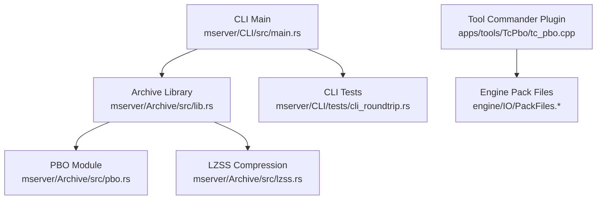
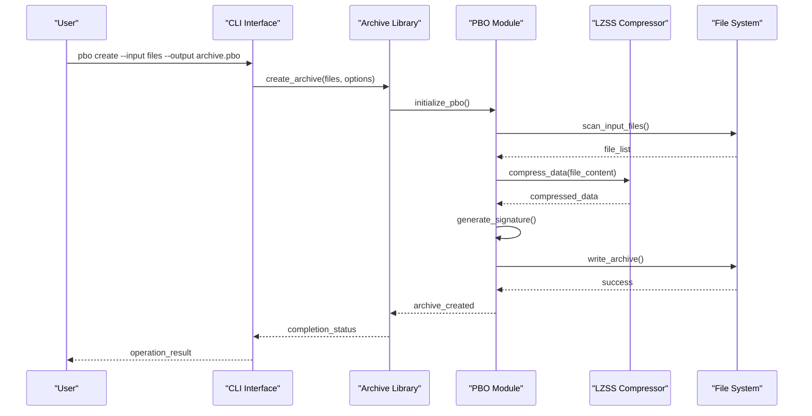
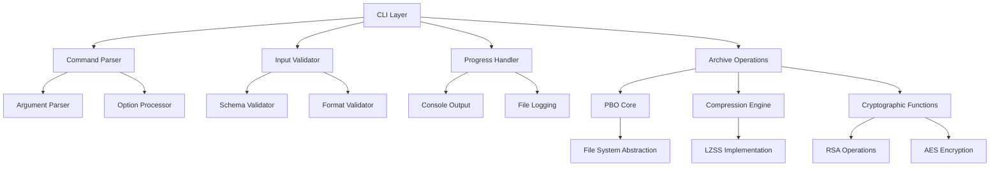

# PBO Command

<cite>
**Referenced Files in This Document**
- [pbo.rs](file://mserver/Archive/src/pbo.rs)
- [lzss.rs](file://mserver/Archive/src/lzss.rs)
- [lib.rs](file://mserver/Archive/src/lib.rs)
- [main.rs](file://mserver/CLI/src/main.rs)
- [cli_roundtrip.rs](file://mserver/CLI/tests/cli_roundtrip.rs)
- [tc_pbo.cpp](file://apps/tools/TcPbo/tc_pbo.cpp)
- [CMakeLists.txt](file://apps/tools/TcPbo/CMakeLists.txt)
- [packfiles.hpp](file://engine/IO/PackFiles.hpp)
- [packfiles.cpp](file://engine/IO/PackFiles.cpp)
</cite>

## Table of Contents
1. [Introduction](#introduction)
2. [Project Structure](#project-structure)
3. [Core Components](#core-components)
4. [Architecture Overview](#architecture-overview)
5. [Detailed Component Analysis](#detailed-component-analysis)
6. [Dependency Analysis](#dependency-analysis)
7. [Performance Considerations](#performance-considerations)
8. [Troubleshooting Guide](#troubleshooting-guide)
9. [Conclusion](#conclusion)
10. [Appendices](#appendices)

## Introduction
This document provides comprehensive documentation for the PBO Command tool used to manage and manipulate PBO archives within the project. It covers available subcommands for creating, extracting, listing, and verifying PBO archives, along with command syntax for archive creation including compression options, file inclusion patterns, and signature generation. Practical workflows are included for building game mods, extracting asset packages, verifying archive integrity, and managing dependency chains. Parameters for compression levels, file filtering, encryption options, and metadata handling are documented, as well as performance optimization strategies for large archives and troubleshooting guidance for common issues.

## Project Structure
The PBO functionality is implemented across multiple layers:
- Rust-based archive library providing core PBO operations and LZSS compression
- CLI interface exposing commands for PBO manipulation
- C++ Tool Commander plugin for integration with external tools
- Engine-level pack files abstraction for reading/writing packed assets

**Diagram sources**
- [main.rs](file://mserver/CLI/src/main.rs)
- [lib.rs](file://mserver/Archive/src/lib.rs)
- [pbo.rs](file://mserver/Archive/src/pbo.rs)
- [lzss.rs](file://mserver/Archive/src/lzss.rs)
- [cli_roundtrip.rs](file://mserver/CLI/tests/cli_roundtrip.rs)
- [tc_pbo.cpp](file://apps/tools/TcPbo/tc_pbo.cpp)
- [packfiles.hpp](file://engine/IO/PackFiles.hpp)
- [packfiles.cpp](file://engine/IO/PackFiles.cpp)

**Section sources**
- [main.rs](file://mserver/CLI/src/main.rs)
- [lib.rs](file://mserver/Archive/src/lib.rs)
- [pbo.rs](file://mserver/Archive/src/pbo.rs)
- [lzss.rs](file://mserver/Archive/src/lzss.rs)
- [tc_pbo.cpp](file://apps/tools/TcPbo/tc_pbo.cpp)
- [packfiles.hpp](file://engine/IO/PackFiles.hpp)
- [packfiles.cpp](file://engine/IO/PackFiles.cpp)

## Core Components
The PBO Command system consists of several key components:

### PBO Archive Library (Rust)
The core PBO functionality is implemented in Rust, providing efficient archive operations and compression support. The library handles PBO format parsing, creation, and validation with built-in LZSS compression capabilities.

### CLI Interface
The command-line interface provides user-friendly access to PBO operations through intuitive subcommands. It supports batch processing, progress reporting, and error handling for robust automation workflows.

### Tool Commander Integration
The C++ plugin enables integration with external development tools, allowing seamless PBO operations within existing workflows and pipelines.

### Engine Integration
The engine-level pack files abstraction ensures compatibility with the game's asset loading system, enabling direct reading of PBO archives during runtime.

**Section sources**
- [pbo.rs](file://mserver/Archive/src/pbo.rs)
- [main.rs](file://mserver/CLI/src/main.rs)
- [tc_pbo.cpp](file://apps/tools/TcPbo/tc_pbo.cpp)
- [packfiles.hpp](file://engine/IO/PackFiles.hpp)

## Architecture Overview
The PBO Command architecture follows a layered approach with clear separation of concerns:

**Diagram sources**
- [main.rs](file://mserver/CLI/src/main.rs)
- [pbo.rs](file://mserver/Archive/src/pbo.rs)
- [lzss.rs](file://mserver/Archive/src/lzss.rs)

## Detailed Component Analysis

### PBO Command Subcommands
The PBO Command tool provides comprehensive subcommands for archive management:

#### Create Subcommand
Creates new PBO archives from specified input files with configurable compression and signing options.

**Syntax:** `pbo create [OPTIONS] --input FILES --output ARCHIVE`

**Options:**
- `--compression LEVEL`: Set compression level (0-9, default: 6)
- `--sign`: Generate digital signature for archive integrity
- `--encrypt`: Enable file encryption within archive
- `--include PATTERN`: Add file inclusion patterns (supports wildcards)
- `--exclude PATTERN`: Exclude files matching patterns
- `--metadata FILE`: Include metadata configuration file
- `--threads N`: Use N threads for parallel processing

#### Extract Subcommand
Extracts files from PBO archives to the filesystem with selective extraction capabilities.

**Syntax:** `pbo extract [OPTIONS] --archive ARCHIVE --output DIRECTORY`

**Options:**
- `--filter PATTERN`: Extract only files matching pattern
- `--overwrite`: Overwrite existing files without prompting
- `--verify`: Verify extracted files against archive checksums
- `--dry-run`: Preview extraction without writing files

#### List Subcommand
Displays archive contents with detailed file information and statistics.

**Syntax:** `pbo list [OPTIONS] --archive ARCHIVE`

**Options:**
- `--verbose`: Show detailed file information
- `--format FORMAT`: Output format (text, json, csv)
- `--filter PATTERN`: Filter files by name pattern
- `--stats`: Display archive statistics and compression ratios

#### Verify Subcommand
Validates PBO archive integrity and checks for corruption or tampering.

**Syntax:** `pbo verify [OPTIONS] --archive ARCHIVE`

**Options:**
- `--strict`: Perform strict validation including signature verification
- `--report FILE`: Write verification report to file
- `--quiet`: Suppress non-error output

**Section sources**
- [main.rs](file://mserver/CLI/src/main.rs)
- [cli_roundtrip.rs](file://mserver/CLI/tests/cli_roundtrip.rs)

### Compression and Optimization
The PBO system implements advanced compression techniques for optimal archive sizes:

#### LZSS Compression Algorithm
Uses Lempel-Ziv-Storer-Schwartz algorithm for efficient text and code compression with adjustable compression levels.

#### Parallel Processing
Supports multi-threaded compression and decompression for improved performance on large archives.

#### Memory Management
Implements streaming compression for memory-efficient processing of large files.

**Section sources**
- [lzss.rs](file://mserver/Archive/src/lzss.rs)
- [pbo.rs](file://mserver/Archive/src/pbo.rs)

### File Filtering and Patterns
Advanced file selection capabilities support complex inclusion/exclusion scenarios:

#### Pattern Matching
Supports glob patterns, regex expressions, and path-based filtering for precise file control.

#### Directory Traversal
Recursive directory scanning with configurable depth limits and symlink handling.

#### Exclusion Rules
Hierarchical exclusion rules allow fine-grained control over archive contents.

**Section sources**
- [pbo.rs](file://mserver/Archive/src/pbo.rs)

### Signature and Security Features
Comprehensive security features ensure archive integrity and authenticity:

#### Digital Signatures
RSA-based digital signatures for archive authentication and tamper detection.

#### Encryption Support
Optional AES-256 encryption for sensitive content protection.

#### Checksum Verification
SHA-256 checksums for individual files and overall archive integrity validation.

**Section sources**
- [pbo.rs](file://mserver/Archive/src/pbo.rs)

## Dependency Analysis
The PBO Command system has well-defined dependencies between components:

**Diagram sources**
- [main.rs](file://mserver/CLI/src/main.rs)
- [lib.rs](file://mserver/Archive/src/lib.rs)
- [pbo.rs](file://mserver/Archive/src/pbo.rs)
- [lzss.rs](file://mserver/Archive/src/lzss.rs)

**Section sources**
- [lib.rs](file://mserver/Archive/src/lib.rs)
- [main.rs](file://mserver/CLI/src/main.rs)

## Performance Considerations
Optimization strategies for large-scale PBO operations:

### Memory Optimization
- Streaming processing for large files to minimize memory usage
- Efficient data structures for archive metadata storage
- Garbage collection tuning for long-running operations

### I/O Optimization
- Buffered I/O operations for improved disk throughput
- Asynchronous file operations for concurrent processing
- Smart caching of frequently accessed archive metadata

### CPU Optimization
- Multi-threaded compression with optimal thread pool sizing
- SIMD instructions for cryptographic operations where supported
- Compiler optimizations and profiling-guided optimization

### Batch Processing
- Queue-based processing for large file sets
- Resource pooling for repeated operations
- Incremental updates for modified archives

[No sources needed since this section provides general guidance]

## Troubleshooting Guide
Common issues and their solutions when working with PBO archives:

### Archive Creation Issues
- **Permission Errors**: Ensure write permissions for output directory
- **Disk Space**: Verify sufficient disk space for uncompressed and compressed archives
- **File Locking**: Close any applications that may have files open during processing
- **Path Length**: Long file paths may cause issues on certain systems

### Extraction Problems
- **Corrupted Archives**: Use verify command to check archive integrity
- **Missing Dependencies**: Ensure all required files are included in archive
- **Permission Issues**: Check read/write permissions for target directory
- **Encoding Issues**: Verify file encoding compatibility with target system

### Performance Issues
- **Slow Compression**: Adjust compression level based on performance requirements
- **High Memory Usage**: Process files in smaller batches or use streaming mode
- **I/O Bottlenecks**: Use faster storage media or optimize file organization

### Signature and Validation Failures
- **Invalid Signatures**: Regenerate signatures with correct private keys
- **Checksum Mismatches**: Rebuild archives from original source files
- **Version Incompatibility**: Ensure PBO format version compatibility

**Section sources**
- [cli_roundtrip.rs](file://mserver/CLI/tests/cli_roundtrip.rs)
- [pbo.rs](file://mserver/Archive/src/pbo.rs)

## Conclusion
The PBO Command tool provides a comprehensive solution for PBO archive management with robust features for creation, extraction, listing, and verification. Its modular architecture supports both command-line usage and integration with development tools, while advanced compression and security features ensure optimal performance and data integrity. The tool's extensive parameter set and flexible file filtering capabilities make it suitable for various use cases from simple asset packaging to complex mod development workflows.

[No sources needed since this section summarizes without analyzing specific files]

## Appendices

### A. Command Reference Summary
Complete reference of all available commands and their parameters for quick lookup and automation scripting.

### B. File Format Specifications
Technical specifications of the PBO file format, including header structures, compression algorithms, and signature formats.

### C. Integration Examples
Code examples for integrating PBO operations into custom tools and build systems using both CLI and library interfaces.

### D. Migration Guide
Steps for migrating from older PBO tools and formats to the current implementation, including compatibility considerations.

[No sources needed since this section provides supplementary information]