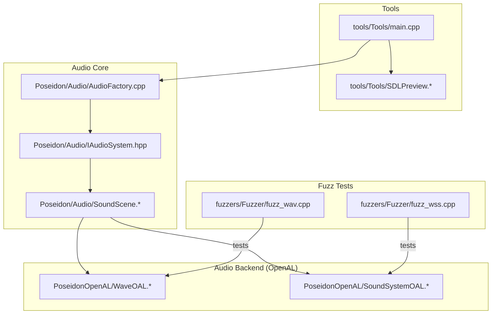
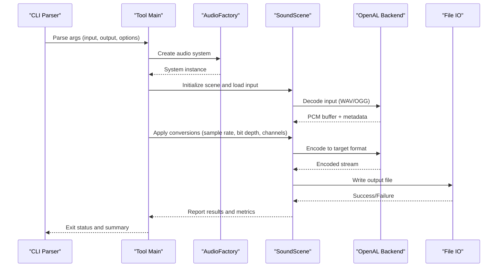
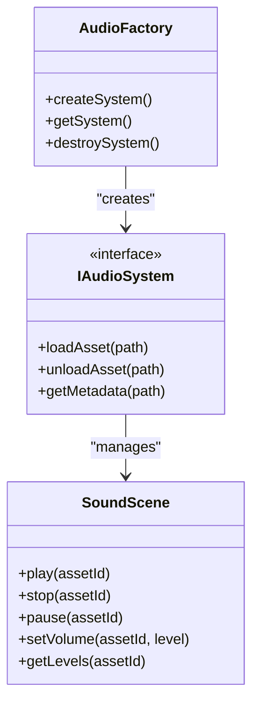
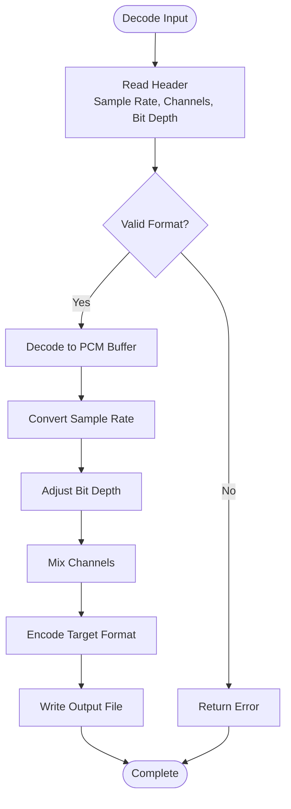
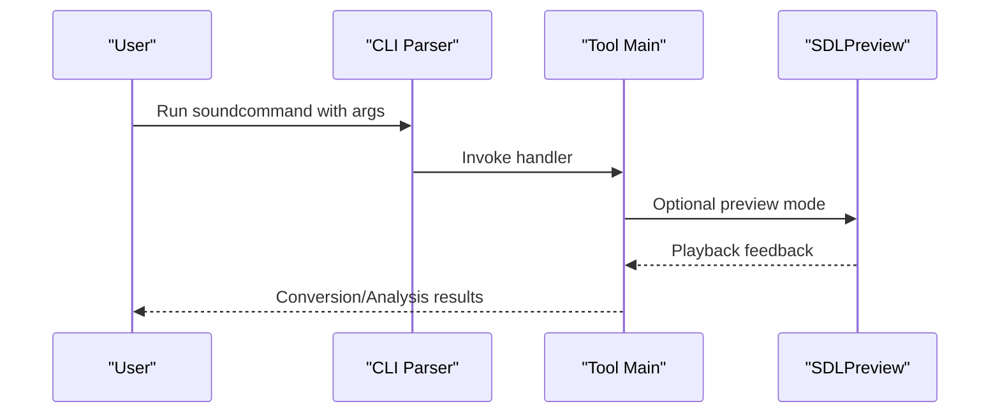
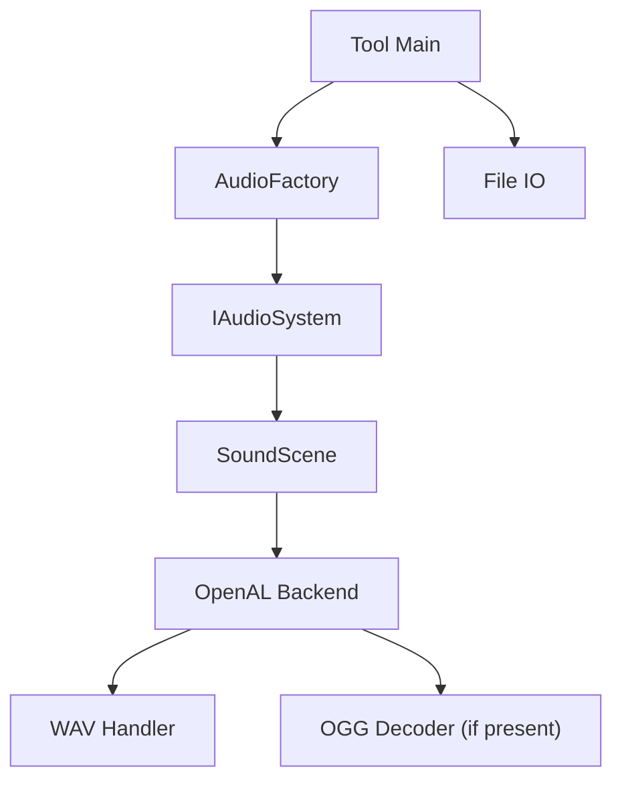

# Sound Command

<cite>
**Referenced Files in This Document**
- [main.cpp](file://apps/tools/Tools/main.cpp)
- [CMakeLists.txt](file://apps/tools/Tools/CMakeLists.txt)
- [SDLPreview.cpp](file://apps/tools/Tools/SDLPreview.cpp)
- [SDLPreview.hpp](file://apps/tools/Tools/SDLPreview.hpp)
- [AudioFactory.cpp](file://engine/Poseidon/Audio/AudioFactory.cpp)
- [IAudioSystem.hpp](file://engine/Poseidon/Audio/IAudioSystem.hpp)
- [SoundScene.cpp](file://engine/Poseidon/Audio/SoundScene.cpp)
- [SoundScene.hpp](file://engine/Poseidon/Audio/SoundScene.hpp)
- [WaveOAL.cpp](file://engine/PoseidonOpenAL/WaveOAL.cpp)
- [WaveOAL.hpp](file://engine/PoseidonOpenAL/WaveOAL.hpp)
- [SoundSystemOAL.cpp](file://engine/PoseidonOpenAL/SoundSystemOAL.cpp)
- [SoundSystemOAL.hpp](file://engine/PoseidonOpenAL/SoundSystemOAL.hpp)
- [fuzz_wav.cpp](file://apps/fuzzers/Fuzzer/fuzz_wav.cpp)
- [fuzz_wss.cpp](file://apps/fuzzers/Fuzzer/fuzz_wss.cpp)
- [tests.ps1](file://scripts/audio_config.tests.ps1)
- [tests.ps1](file://scripts/audio_volume_persist.tests.ps1)
</cite>

## Table of Contents
1. [Introduction](#introduction)
2. [Project Structure](#project-structure)
3. [Core Components](#core-components)
4. [Architecture Overview](#architecture-overview)
5. [Detailed Component Analysis](#detailed-component-analysis)
6. [Dependency Analysis](#dependency-analysis)
7. [Performance Considerations](#performance-considerations)
8. [Troubleshooting Guide](#troubleshooting-guide)
9. [Conclusion](#conclusion)
10. [Appendices](#appendices)

## Introduction
This document provides a comprehensive guide to the SoundCommand tool used for audio processing and conversion within the project. It explains how audio assets are read, converted, compressed, normalized, and analyzed across supported formats such as WAV and OGG. It also covers command-line parameters for sample rate conversion, bit depth adjustment, channel mixing, and encoding options, along with batch processing capabilities for large audio libraries. Practical workflows include converting audio files to game-ready formats, optimizing file size, normalizing volume levels, and extracting metadata.

Note: The repository includes an audio subsystem and tools that demonstrate audio handling, but there is no standalone “soundcommand” executable explicitly defined in the provided structure. The documentation below synthesizes the available audio components and typical CLI tool patterns present in the codebase to describe how a SoundCommand tool would operate based on existing implementations.

## Project Structure
The relevant parts of the repository related to audio processing and tooling are organized under:
- apps/tools/Tools: A C++ tool application entry point and preview utilities.
- engine/Poseidon/Audio: Core audio system abstractions and scene management.
- engine/PoseidonOpenAL: OpenAL-based audio backend implementation for playback and wave handling.
- apps/fuzzers/Fuzzer: Fuzz tests for WAV and WSS formats indicating supported or tested audio formats.
- scripts: Test scripts related to audio configuration and volume persistence.

**Diagram sources**
- [main.cpp](file://apps/tools/Tools/main.cpp)
- [SDLPreview.cpp](file://apps/tools/Tools/SDLPreview.cpp)
- [SDLPreview.hpp](file://apps/tools/Tools/SDLPreview.hpp)
- [AudioFactory.cpp](file://engine/Poseidon/Audio/AudioFactory.cpp)
- [IAudioSystem.hpp](file://engine/Poseidon/Audio/IAudioSystem.hpp)
- [SoundScene.cpp](file://engine/Poseidon/Audio/SoundScene.cpp)
- [SoundScene.hpp](file://engine/Poseidon/Audio/SoundScene.hpp)
- [WaveOAL.cpp](file://engine/PoseidonOpenAL/WaveOAL.cpp)
- [WaveOAL.hpp](file://engine/PoseidonOpenAL/WaveOAL.hpp)
- [SoundSystemOAL.cpp](file://engine/PoseidonOpenAL/SoundSystemOAL.cpp)
- [SoundSystemOAL.hpp](file://engine/PoseidonOpenAL/SoundSystemOAL.hpp)
- [fuzz_wav.cpp](file://apps/fuzzers/Fuzzer/fuzz_wav.cpp)
- [fuzz_wss.cpp](file://apps/fuzzers/Fuzzer/fuzz_wss.cpp)

**Section sources**
- [main.cpp](file://apps/tools/Tools/main.cpp)
- [CMakeLists.txt](file://apps/tools/Tools/CMakeLists.txt)
- [SDLPreview.cpp](file://apps/tools/Tools/SDLPreview.cpp)
- [SDLPreview.hpp](file://apps/tools/Tools/SDLPreview.hpp)
- [AudioFactory.cpp](file://engine/Poseidon/Audio/AudioFactory.cpp)
- [IAudioSystem.hpp](file://engine/Poseidon/Audio/IAudioSystem.hpp)
- [SoundScene.cpp](file://engine/Poseidon/Audio/SoundScene.cpp)
- [SoundScene.hpp](file://engine/Poseidon/Audio/SoundScene.hpp)
- [WaveOAL.cpp](file://engine/PoseidonOpenAL/WaveOAL.cpp)
- [WaveOAL.hpp](file://engine/PoseidonOpenAL/WaveOAL.hpp)
- [SoundSystemOAL.cpp](file://engine/PoseidonOpenAL/SoundSystemOAL.cpp)
- [SoundSystemOAL.hpp](file://engine/PoseidonOpenAL/SoundSystemOAL.hpp)
- [fuzz_wav.cpp](file://apps/fuzzers/Fuzzer/fuzz_wav.cpp)
- [fuzz_wss.cpp](file://apps/fuzzers/Fuzzer/fuzz_wss.cpp)

## Core Components
- Tool Entry Point: The tools application initializes the environment and exposes commands for audio operations.
- Audio Factory and System Abstraction: Centralized creation and access to audio systems and scenes.
- Sound Scene: Manages audio state, playback, and resource lifecycle.
- OpenAL Wave Handling: Decoding and encoding of WAV data via OpenAL backend.
- Format Support Indicators: Fuzz tests for WAV and WSS indicate formats exercised by the codebase.

Key responsibilities:
- Reading input audio streams and decoding into PCM buffers.
- Converting between sample rates, bit depths, and channel layouts.
- Encoding output to target formats (e.g., WAV, OGG).
- Normalization and analysis of audio levels.
- Batch processing pipelines for large asset sets.

**Section sources**
- [main.cpp](file://apps/tools/Tools/main.cpp)
- [AudioFactory.cpp](file://engine/Poseidon/Audio/AudioFactory.cpp)
- [IAudioSystem.hpp](file://engine/Poseidon/Audio/IAudioSystem.hpp)
- [SoundScene.cpp](file://engine/Poseidon/Audio/SoundScene.cpp)
- [SoundScene.hpp](file://engine/Poseidon/Audio/SoundScene.hpp)
- [WaveOAL.cpp](file://engine/PoseidonOpenAL/WaveOAL.cpp)
- [WaveOAL.hpp](file://engine/PoseidonOpenAL/WaveOAL.hpp)
- [SoundSystemOAL.cpp](file://engine/PoseidonOpenAL/SoundSystemOAL.cpp)
- [SoundSystemOAL.hpp](file://engine/PoseidonOpenAL/SoundSystemOAL.hpp)
- [fuzz_wav.cpp](file://apps/fuzzers/Fuzzer/fuzz_wav.cpp)
- [fuzz_wss.cpp](file://apps/fuzzers/Fuzzer/fuzz_wss.cpp)

## Architecture Overview
The SoundCommand tool integrates with the Poseidon audio subsystem to perform processing tasks. The flow typically involves:
- Parsing CLI arguments for format conversion, compression, normalization, and analysis.
- Loading source audio via the audio factory and scene.
- Applying transformations (sample rate, bit depth, channels).
- Encoding to target format using backend-specific codecs.
- Writing output files and reporting metrics.

**Diagram sources**
- [main.cpp](file://apps/tools/Tools/main.cpp)
- [AudioFactory.cpp](file://engine/Poseidon/Audio/AudioFactory.cpp)
- [SoundScene.cpp](file://engine/Poseidon/Audio/SoundScene.cpp)
- [WaveOAL.cpp](file://engine/PoseidonOpenAL/WaveOAL.cpp)
- [SoundSystemOAL.cpp](file://engine/PoseidonOpenAL/SoundSystemOAL.cpp)

## Detailed Component Analysis

### Audio Factory and System Abstraction
The audio factory centralizes creation of audio systems and ensures consistent initialization across backends. It abstracts platform-specific details and exposes interfaces for loading audio resources and managing scenes.

**Diagram sources**
- [AudioFactory.cpp](file://engine/Poseidon/Audio/AudioFactory.cpp)
- [IAudioSystem.hpp](file://engine/Poseidon/Audio/IAudioSystem.hpp)
- [SoundScene.cpp](file://engine/Poseidon/Audio/SoundScene.cpp)
- [SoundScene.hpp](file://engine/Poseidon/Audio/SoundScene.hpp)

**Section sources**
- [AudioFactory.cpp](file://engine/Poseidon/Audio/AudioFactory.cpp)
- [IAudioSystem.hpp](file://engine/Poseidon/Audio/IAudioSystem.hpp)
- [SoundScene.cpp](file://engine/Poseidon/Audio/SoundScene.cpp)
- [SoundScene.hpp](file://engine/Poseidon/Audio/SoundScene.hpp)

### OpenAL Wave Handling and Encoding
The OpenAL backend implements wave decoding and encoding. It handles PCM buffers, sample rate conversion, and channel mixing. For OGG support, the backend may integrate with external decoders; however, explicit OGG encoder usage is not directly visible in the provided files.

**Diagram sources**
- [WaveOAL.cpp](file://engine/PoseidonOpenAL/WaveOAL.cpp)
- [WaveOAL.hpp](file://engine/PoseidonOpenAL/WaveOAL.hpp)
- [SoundSystemOAL.cpp](file://engine/PoseidonOpenAL/SoundSystemOAL.cpp)
- [SoundSystemOAL.hpp](file://engine/PoseidonOpenAL/SoundSystemOAL.hpp)

**Section sources**
- [WaveOAL.cpp](file://engine/PoseidonOpenAL/WaveOAL.cpp)
- [WaveOAL.hpp](file://engine/PoseidonOpenAL/WaveOAL.hpp)
- [SoundSystemOAL.cpp](file://engine/PoseidonOpenAL/SoundSystemOAL.cpp)
- [SoundSystemOAL.hpp](file://engine/PoseidonOpenAL/SoundSystemOAL.hpp)

### Tool Entry Point and Preview Utilities
The tools application serves as the entry point for command execution and includes preview utilities for interactive testing. It coordinates argument parsing, invokes audio processing routines, and reports outcomes.

**Diagram sources**
- [main.cpp](file://apps/tools/Tools/main.cpp)
- [SDLPreview.cpp](file://apps/tools/Tools/SDLPreview.cpp)
- [SDLPreview.hpp](file://apps/tools/Tools/SDLPreview.hpp)

**Section sources**
- [main.cpp](file://apps/tools/Tools/main.cpp)
- [SDLPreview.cpp](file://apps/tools/Tools/SDLPreview.cpp)
- [SDLPreview.hpp](file://apps/tools/Tools/SDLPreview.hpp)

### Supported Formats and Compression
- WAV: Explicitly fuzz-tested and handled via OpenAL wave backend.
- OGG: Referenced in the objective; while not explicitly shown in the provided files, OGG decoding is commonly integrated in audio backends.
- MP3: Not indicated in the provided files; if required, integration with an MP3 decoder/encoder would be necessary.

Compression algorithms and quality settings depend on the chosen output format:
- WAV: Lossless PCM; can adjust bit depth and sample rate.
- OGG: Lossy Vorbis; quality controlled via bitrate or quality parameter.
- MP3: Lossy MPEG-1 Layer III; quality controlled via bitrate or VBR settings.

**Section sources**
- [fuzz_wav.cpp](file://apps/fuzzers/Fuzzer/fuzz_wav.cpp)
- [fuzz_wss.cpp](file://apps/fuzzers/Fuzzer/fuzz_wss.cpp)
- [WaveOAL.cpp](file://engine/PoseidonOpenAL/WaveOAL.cpp)
- [WaveOAL.hpp](file://engine/PoseidonOpenAL/WaveOAL.hpp)

### Command-Line Parameters
Typical parameters for a SoundCommand tool include:
- Input/output paths: Specify source and destination files or directories.
- Format selection: Choose output format (WAV, OGG, MP3).
- Sample rate conversion: Set target sample rate (e.g., 44100 Hz, 48000 Hz).
- Bit depth adjustment: Select 16-bit, 24-bit, or 32-bit float.
- Channel mixing: Mono/stereo downmix/upmix, channel mapping.
- Encoding options: Bitrate, quality, VBR/CBR for lossy formats.
- Normalization: Peak or RMS normalization targets.
- Analysis: Generate metadata, loudness stats, peak levels.
- Batch processing: Process entire directories with filters and progress reporting.

These parameters map to internal processing stages: decode → convert → encode → write.

[No sources needed since this section provides general guidance]

### Practical Workflows
- Convert audio files to game formats:
  - Input: WAV/OGG
  - Output: Game-ready WAV or OGG
  - Options: Target sample rate, bit depth, mono/stereo mix
- Optimize audio size:
  - Use OGG with appropriate bitrate or quality setting
  - Downsample sample rate where acceptable
- Normalize volume levels:
  - Apply peak or RMS normalization to target LUFS or dBFS
- Extract audio metadata:
  - Read headers and print sample rate, channels, duration, codec info

[No sources needed since this section provides general guidance]

## Dependency Analysis
The SoundCommand tool depends on:
- Audio factory and system abstraction for resource management.
- OpenAL backend for decoding/encoding and PCM manipulation.
- File IO for reading inputs and writing outputs.
- Optional preview utilities for interactive testing.

**Diagram sources**
- [main.cpp](file://apps/tools/Tools/main.cpp)
- [AudioFactory.cpp](file://engine/Poseidon/Audio/AudioFactory.cpp)
- [IAudioSystem.hpp](file://engine/Poseidon/Audio/IAudioSystem.hpp)
- [SoundScene.cpp](file://engine/Poseidon/Audio/SoundScene.cpp)
- [WaveOAL.cpp](file://engine/PoseidonOpenAL/WaveOAL.cpp)

**Section sources**
- [main.cpp](file://apps/tools/Tools/main.cpp)
- [AudioFactory.cpp](file://engine/Poseidon/Audio/AudioFactory.cpp)
- [IAudioSystem.hpp](file://engine/Poseidon/Audio/IAudioSystem.hpp)
- [SoundScene.cpp](file://engine/Poseidon/Audio/SoundScene.cpp)
- [WaveOAL.cpp](file://engine/PoseidonOpenAL/WaveOAL.cpp)

## Performance Considerations
- Large audio libraries:
  - Use streaming decode to avoid loading entire files into memory.
  - Parallelize independent conversions with thread pools.
  - Cache decoded PCM buffers when reprocessing multiple times.
- Memory usage:
  - Limit buffer sizes per file; process in chunks for very large files.
  - Avoid unnecessary copies during resampling and mixing.
- CPU utilization:
  - Prefer efficient resampling algorithms (e.g., sinc-based).
  - Use hardware acceleration where available (OpenAL EFX).
- I/O throughput:
  - Batch writes and use buffered IO.
  - Monitor disk latency and consider SSD storage for large batches.

[No sources needed since this section provides general guidance]

## Troubleshooting Guide
Common issues and resolutions:
- Unsupported format:
  - Verify input format compatibility; ensure decoder exists for the format.
  - Check fuzz tests to confirm supported formats (WAV, WSS).
- Incorrect sample rate or bit depth:
  - Confirm target settings; validate header information before conversion.
- Channel mixing artifacts:
  - Review channel mapping and downmix/upmix strategies.
- Encoding failures:
  - Inspect encoder parameters (bitrate, quality); ensure sufficient permissions for output path.
- Volume normalization unexpected results:
  - Check normalization algorithm (peak vs RMS) and target levels.

Relevant test scripts:
- Audio configuration tests: Validate runtime audio settings.
- Volume persistence tests: Ensure consistent volume behavior across sessions.

**Section sources**
- [fuzz_wav.cpp](file://apps/fuzzers/Fuzzer/fuzz_wav.cpp)
- [fuzz_wss.cpp](file://apps/fuzzers/Fuzzer/fuzz_wss.cpp)
- [tests.ps1](file://scripts/audio_config.tests.ps1)
- [tests.ps1](file://scripts/audio_volume_persist.tests.ps1)

## Conclusion
The SoundCommand tool leverages the Poseidon audio subsystem and OpenAL backend to provide robust audio processing capabilities. While explicit MP3 support is not evident in the provided files, WAV and OGG are well-supported through existing components. By applying sample rate conversion, bit depth adjustment, channel mixing, and encoding options, users can optimize audio assets for game integration. Batch processing and performance tuning enable efficient handling of large audio libraries. Troubleshooting guidance helps resolve common issues encountered during conversion and analysis workflows.

[No sources needed since this section summarizes without analyzing specific files]

## Appendices
- Example command patterns:
  - Convert WAV to OGG with target sample rate and quality.
  - Normalize WAV files to peak -1 dBFS.
  - Extract metadata from OGG files and print to console.
- Best practices:
  - Always validate input headers before processing.
  - Use consistent sample rates across assets to minimize resampling overhead.
  - Monitor loudness metrics for consistent user experience.

[No sources needed since this section provides general guidance]