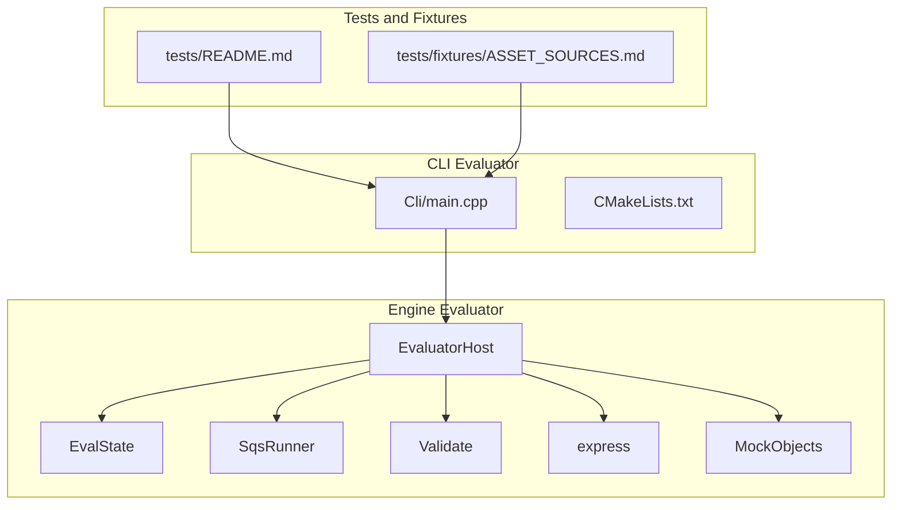
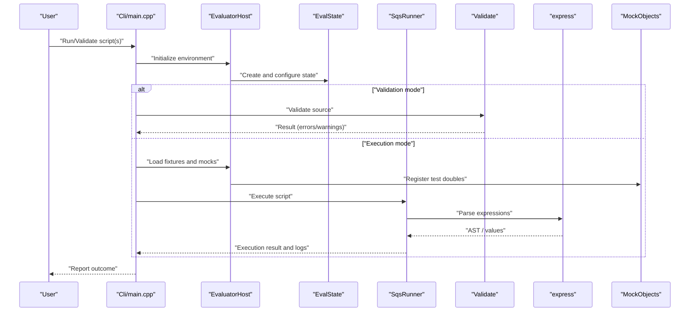
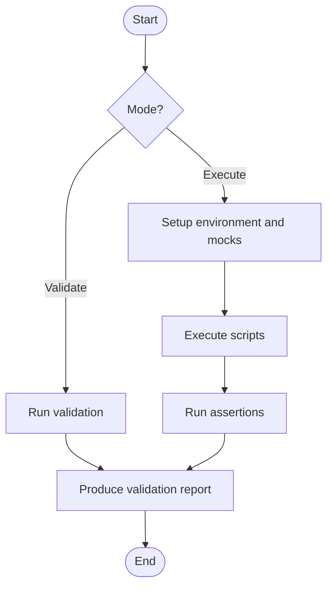
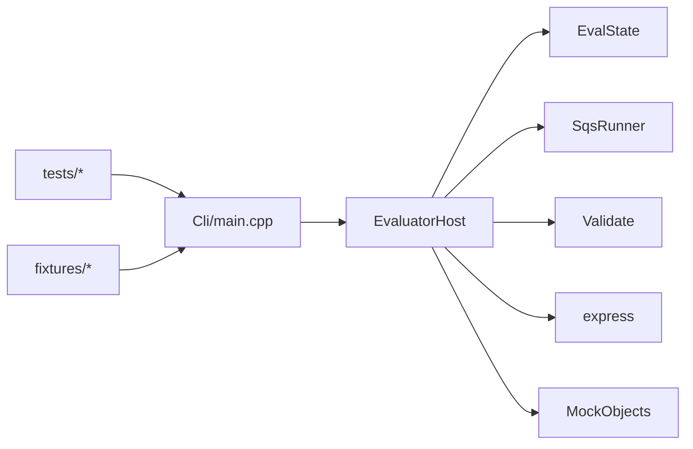

# Evaluation Tools

<cite>
**Referenced Files in This Document**
- [EvaluatorHost.cpp](file://engine/Evaluator/EvaluatorHost.cpp)
- [EvaluatorHost.hpp](file://engine/Evaluator/EvaluatorHost.hpp)
- [EvalState.cpp](file://engine/Evaluator/EvalState.cpp)
- [EvalState.hpp](file://engine/Evaluator/EvalState.hpp)
- [SqsRunner.cpp](file://engine/Evaluator/SqsRunner.cpp)
- [SqsRunner.hpp](file://engine/Evaluator/SqsRunner.hpp)
- [Validate.cpp](file://engine/Evaluator/Validate.cpp)
- [Validate.hpp](file://engine/Evaluator/Validate.hpp)
- [express.cpp](file://engine/Evaluator/express.cpp)
- [express.hpp](file://engine/Evaluator/express.hpp)
- [MockObjects.cpp](file://engine/Evaluator/MockObjects.cpp)
- [MockObjects.hpp](file://engine/Evaluator/MockObjects.hpp)
- [Cli/main.cpp](file://apps/tools/Evaluator/Cli/main.cpp)
- [CMakeLists.txt](file://apps/tools/Evaluator/CMakeLists.txt)
- [README.md](file://tests/README.md)
- [ASSET_SOURCES.md](file://tests/fixtures/ASSET_SOURCES.md)
</cite>

## Table of Contents
1. [Introduction](#introduction)
2. [Project Structure](#project-structure)
3. [Core Components](#core-components)
4. [Architecture Overview](#architecture-overview)
5. [Detailed Component Analysis](#detailed-component-analysis)
6. [Dependency Analysis](#dependency-analysis)
7. [Performance Considerations](#performance-considerations)
8. [Troubleshooting Guide](#troubleshooting-guide)
9. [Conclusion](#conclusion)
10. [Appendices](#appendices)

## Introduction
This document explains the evaluation tools used to test and validate SQF/SQS scripts within the project. It covers the command-line evaluator for running script tests, validation utilities for syntax and semantics checks, debugging capabilities, and how these tools integrate with the game engine’s scripting system. It also provides guidance on writing unit and integration tests, creating fixtures, assertions, result reporting, performance benchmarking, and integrating the tools into continuous integration pipelines.

## Project Structure
The evaluation tooling spans two main areas:
- Engine-side evaluation runtime and validation components under engine/Evaluator
- A command-line evaluator application under apps/tools/Evaluator

**Diagram sources**
- [Cli/main.cpp](file://apps/tools/Evaluator/Cli/main.cpp)
- [CMakeLists.txt](file://apps/tools/Evaluator/CMakeLists.txt)
- [EvaluatorHost.cpp](file://engine/Evaluator/EvaluatorHost.cpp)
- [EvalState.cpp](file://engine/Evaluator/EvalState.cpp)
- [SqsRunner.cpp](file://engine/Evaluator/SqsRunner.cpp)
- [Validate.cpp](file://engine/Evaluator/Validate.cpp)
- [express.cpp](file://engine/Evaluator/express.cpp)
- [MockObjects.cpp](file://engine/Evaluator/MockObjects.cpp)
- [README.md](file://tests/README.md)
- [ASSET_SOURCES.md](file://tests/fixtures/ASSET_SOURCES.md)

**Section sources**
- [Cli/main.cpp](file://apps/tools/Evaluator/Cli/main.cpp)
- [CMakeLists.txt](file://apps/tools/Evaluator/CMakeLists.txt)
- [README.md](file://tests/README.md)
- [ASSET_SOURCES.md](file://tests/fixtures/ASSET_SOURCES.md)

## Core Components
- EvaluatorHost: Hosts the evaluation environment, initializes state, and orchestrates execution and validation flows.
- EvalState: Holds runtime state for script evaluation (variables, context, execution stack).
- SqsRunner: Executes SQS scripts and manages lifecycle and error propagation.
- Validate: Provides syntax and semantic validation routines for SQF/SQS inputs.
- express: Expression parsing and evaluation helpers used by the evaluator.
- MockObjects: Test doubles and stubs to simulate engine objects during scripted tests.
- CLI: Command-line entry point that wires together evaluation, validation, and reporting.

Key responsibilities:
- Parse and validate script sources
- Initialize a controlled evaluation environment
- Execute scripts deterministically where possible
- Capture results and errors for reporting
- Provide hooks for assertions and diagnostics

**Section sources**
- [EvaluatorHost.cpp](file://engine/Evaluator/EvaluatorHost.cpp)
- [EvaluatorHost.hpp](file://engine/Evaluator/EvaluatorHost.hpp)
- [EvalState.cpp](file://engine/Evaluator/EvalState.cpp)
- [EvalState.hpp](file://engine/Evaluator/EvalState.hpp)
- [SqsRunner.cpp](file://engine/Evaluator/SqsRunner.cpp)
- [SqsRunner.hpp](file://engine/Evaluator/SqsRunner.hpp)
- [Validate.cpp](file://engine/Evaluator/Validate.cpp)
- [Validate.hpp](file://engine/Evaluator/Validate.hpp)
- [express.cpp](file://engine/Evaluator/express.cpp)
- [express.hpp](file://engine/Evaluator/express.hpp)
- [MockObjects.cpp](file://engine/Evaluator/MockObjects.cpp)
- [MockObjects.hpp](file://engine/Evaluator/MockObjects.hpp)

## Architecture Overview
The CLI evaluator invokes the engine’s evaluation subsystem to run or validate scripts. The host sets up an isolated state, optionally loads fixtures, executes scripts via the runner, and collects outcomes. Validation can be performed without full execution to catch syntax and semantic issues early.

**Diagram sources**
- [Cli/main.cpp](file://apps/tools/Evaluator/Cli/main.cpp)
- [EvaluatorHost.cpp](file://engine/Evaluator/EvaluatorHost.cpp)
- [EvalState.cpp](file://engine/Evaluator/EvalState.cpp)
- [SqsRunner.cpp](file://engine/Evaluator/SqsRunner.cpp)
- [Validate.cpp](file://engine/Evaluator/Validate.cpp)
- [express.cpp](file://engine/Evaluator/express.cpp)
- [MockObjects.cpp](file://engine/Evaluator/MockObjects.cpp)

## Detailed Component Analysis

### Command-Line Evaluator
The CLI is the primary interface for running tests and validations. It parses arguments, selects modes (run vs. validate), configures the evaluation host, and formats output for human consumption and CI integration.

- Responsibilities:
  - Argument parsing and mode selection
  - Invoking validation or execution paths
  - Configuring fixture loading and mock registration
  - Aggregating and printing results

- Typical usage patterns:
  - Validate syntax/semantics of one or more scripts
  - Run a single script or a suite of scripts
  - Output structured results suitable for CI parsers

**Section sources**
- [Cli/main.cpp](file://apps/tools/Evaluator/Cli/main.cpp)
- [CMakeLists.txt](file://apps/tools/Evaluator/CMakeLists.txt)

### Evaluation Host and State
The host encapsulates the lifecycle of the evaluation environment. It creates and manages the evaluation state, binds mocks, and coordinates between the runner and validator.

- Responsibilities:
  - Environment initialization and teardown
  - State management for variables and context
  - Hooking into expression evaluation
  - Error capture and propagation

- Data structures:
  - Evaluation state holds global variables, call stacks, and execution context
  - Host configuration includes flags for strictness, logging, and fixture paths

**Section sources**
- [EvaluatorHost.cpp](file://engine/Evaluator/EvaluatorHost.cpp)
- [EvaluatorHost.hpp](file://engine/Evaluator/EvaluatorHost.hpp)
- [EvalState.cpp](file://engine/Evaluator/EvalState.cpp)
- [EvalState.hpp](file://engine/Evaluator/EvalState.hpp)

### Script Execution Runner
The runner executes SQS scripts, managing control flow, function calls, and error handling. It integrates with the expression evaluator to resolve and compute values.

- Responsibilities:
  - Parsing and executing script commands
  - Managing function scope and variable lifetimes
  - Reporting execution errors and warnings
  - Providing hooks for assertions and side-effect verification

**Section sources**
- [SqsRunner.cpp](file://engine/Evaluator/SqsRunner.cpp)
- [SqsRunner.hpp](file://engine/Evaluator/SqsRunner.hpp)
- [express.cpp](file://engine/Evaluator/express.cpp)
- [express.hpp](file://engine/Evaluator/express.hpp)

### Validation Utilities
Validation routines check script syntax and semantics without requiring full execution. They are useful for fast feedback during development and for pre-commit checks.

- Responsibilities:
  - Lexing and parsing script sources
  - Semantic analysis (type checks, symbol resolution)
  - Generating actionable error messages

**Section sources**
- [Validate.cpp](file://engine/Evaluator/Validate.cpp)
- [Validate.hpp](file://engine/Evaluator/Validate.hpp)

### Mock Objects and Test Doubles
MockObjects provide simulated engine entities and services for deterministic testing. Tests can assert behavior against these doubles without needing the full engine.

- Responsibilities:
  - Implementing minimal interfaces expected by scripts
  - Recording interactions for assertion
  - Allowing configuration of responses and states

**Section sources**
- [MockObjects.cpp](file://engine/Evaluator/MockObjects.cpp)
- [MockObjects.hpp](file://engine/Evaluator/MockObjects.hpp)

### Test Fixtures and Assertions
Fixtures define reusable setup data and environment configurations. Assertions verify expected outcomes after script execution.

- Fixture creation:
  - Define baseline state and resources
  - Load required assets and configurations
  - Register mocks and stubs

- Assertion methods:
  - Verify return values and side effects
  - Check state transitions and object interactions
  - Validate error conditions and warnings

**Section sources**
- [README.md](file://tests/README.md)
- [ASSET_SOURCES.md](file://tests/fixtures/ASSET_SOURCES.md)

### Conceptual Overview
The evaluation tools form a cohesive pipeline:
- Input: SQF/SQS scripts and optional fixtures
- Processing: Validation, parsing, execution, and assertion
- Output: Structured results, logs, and diagnostics

[No sources needed since this diagram shows conceptual workflow, not actual code structure]

## Dependency Analysis
The CLI depends on the evaluation host, which composes the state, runner, validator, expression evaluator, and mocks. Tests and fixtures feed into the CLI to drive scenarios.

**Diagram sources**
- [Cli/main.cpp](file://apps/tools/Evaluator/Cli/main.cpp)
- [EvaluatorHost.cpp](file://engine/Evaluator/EvaluatorHost.cpp)
- [EvalState.cpp](file://engine/Evaluator/EvalState.cpp)
- [SqsRunner.cpp](file://engine/Evaluator/SqsRunner.cpp)
- [Validate.cpp](file://engine/Evaluator/Validate.cpp)
- [express.cpp](file://engine/Evaluator/express.cpp)
- [MockObjects.cpp](file://engine/Evaluator/MockObjects.cpp)

**Section sources**
- [Cli/main.cpp](file://apps/tools/Evaluator/Cli/main.cpp)
- [EvaluatorHost.cpp](file://engine/Evaluator/EvaluatorHost.cpp)
- [README.md](file://tests/README.md)

## Performance Considerations
- Prefer validation-only runs for fast feedback on large script suites
- Reuse evaluation state across related tests to reduce overhead
- Minimize heavy fixture loads; use lightweight mocks where possible
- Profile critical execution paths using built-in diagnostics if available
- Batch multiple small scripts into a single run to reduce startup costs

[No sources needed since this section provides general guidance]

## Troubleshooting Guide
Common issues and techniques:
- Syntax errors: Use validation mode to quickly identify parse failures
- Runtime errors: Inspect execution logs from the runner and expression evaluator
- Missing symbols: Ensure mocks and fixtures are registered before execution
- Flaky tests: Stabilize randomness and time-dependent behavior via mocks and deterministic seeds
- Debugging: Enable verbose logging in the host and runner; step through expression evaluation when necessary

**Section sources**
- [Validate.cpp](file://engine/Evaluator/Validate.cpp)
- [SqsRunner.cpp](file://engine/Evaluator/SqsRunner.cpp)
- [express.cpp](file://engine/Evaluator/express.cpp)
- [EvaluatorHost.cpp](file://engine/Evaluator/EvaluatorHost.cpp)

## Conclusion
The evaluation tools provide a robust foundation for validating and testing SQF/SQS scripts. By combining validation, controlled execution, and rich mocking, developers can write reliable unit and integration tests, diagnose issues efficiently, and integrate automated checks into CI pipelines. Following best practices for fixture design, assertions, and performance will ensure maintainable and fast test suites.

[No sources needed since this section summarizes without analyzing specific files]

## Appendices

### Writing Unit Tests for Game Logic
- Isolate logic behind clear interfaces
- Use MockObjects to simulate engine behavior
- Assert on state changes and returned values
- Keep tests deterministic and fast

### Integration Tests for Mission Scripts
- Load mission-specific fixtures and configs
- Simulate multi-step scenarios with sequential script execution
- Validate end-to-end outcomes and side effects
- Use structured reporting for CI

### Performance Benchmarking
- Measure execution time for critical scripts
- Compare different implementations or configurations
- Use consistent fixtures and environments
- Track regressions over time

### Integrating Into Continuous Integration
- Add validation steps to pre-commit or PR checks
- Run unit and integration suites on each build
- Publish structured test reports
- Fail builds on validation or assertion failures

[No sources needed since this section provides general guidance]