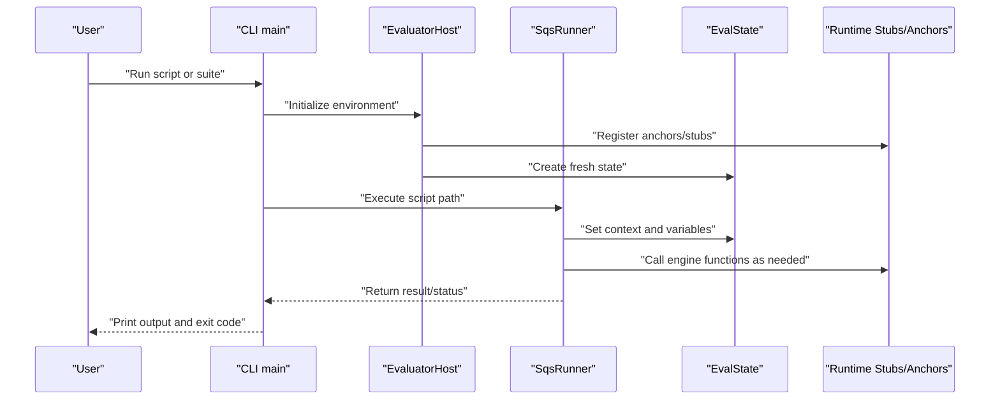
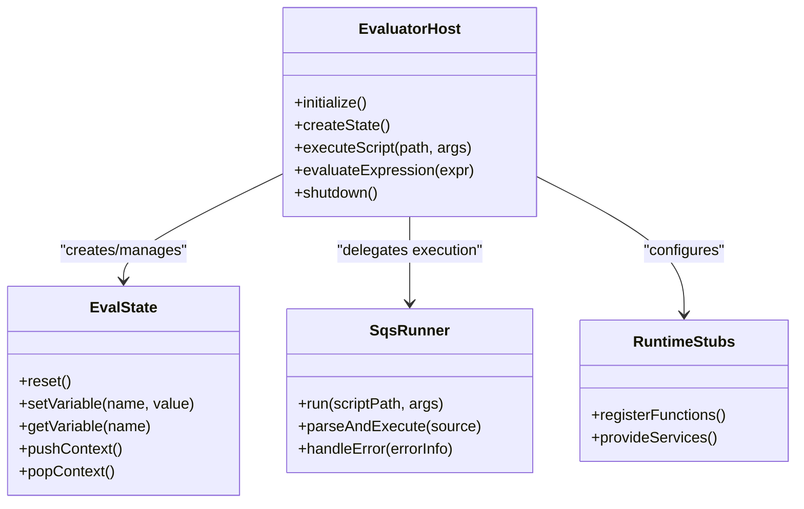
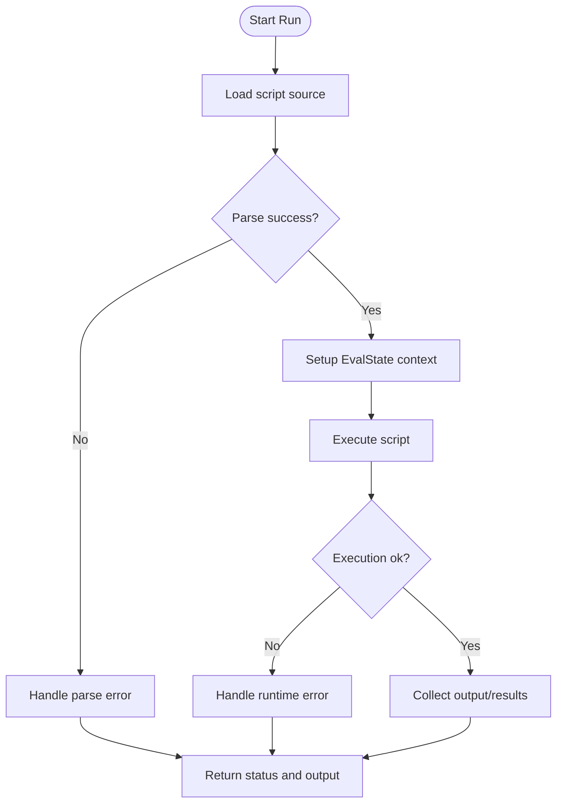
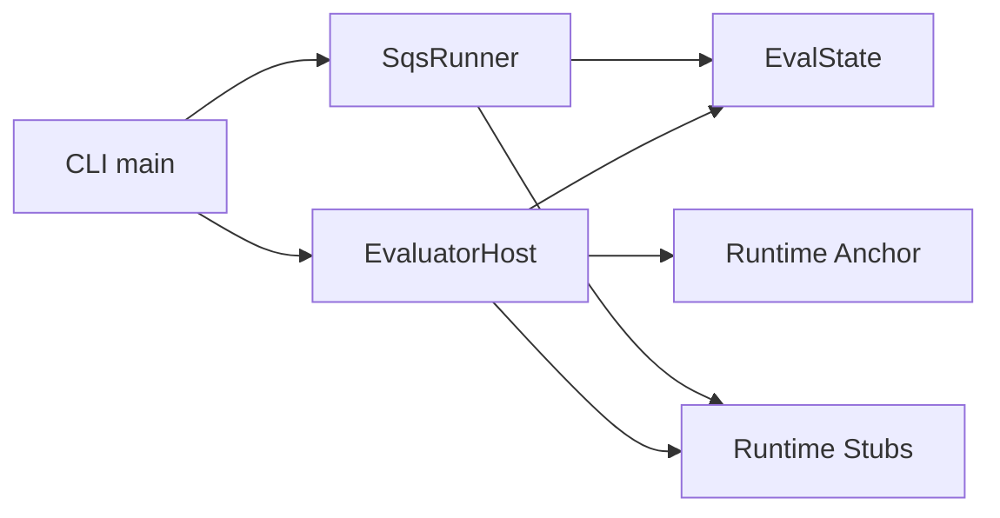

# Script Evaluator

<cite>
**Referenced Files in This Document**
- [EvaluatorHost.hpp](file://engine/Evaluator/EvaluatorHost.hpp)
- [EvaluatorHost.cpp](file://engine/Evaluator/EvaluatorHost.cpp)
- [SqsRunner.hpp](file://engine/Evaluator/SqsRunner.hpp)
- [SqsRunner.cpp](file://engine/Evaluator/SqsRunner.cpp)
- [EvalState.hpp](file://engine/Evaluator/EvalState.hpp)
- [EvalState.cpp](file://engine/Evaluator/EvalState.cpp)
- [EvaluatorRuntimeStubs.cpp](file://engine/Evaluator/EvaluatorRuntimeStubs.cpp)
- [EvaluatorRuntimeAnchor.cpp](file://engine/Evaluator/EvaluatorRuntimeAnchor.cpp)
- [MockObjects.hpp](file://engine/Evaluator/MockObjects.hpp)
- [MockObjects.cpp](file://engine/Evaluator/MockObjects.cpp)
- [Validate.hpp](file://engine/Evaluator/Validate.hpp)
- [Validate.cpp](file://engine/Evaluator/Validate.cpp)
- [express.hpp](file://engine/Evaluator/express.hpp)
- [express.cpp](file://engine/Evaluator/express.cpp)
- [Cli/main.cpp](file://apps/tools/Evaluator/Cli/main.cpp)
- [CMakeLists.txt](file://apps/tools/Evaluator/CMakeLists.txt)
- [fuzz_sqf_exec.cpp](file://apps/fuzzers/Fuzzer/fuzz_sqf_exec.cpp)
- [fuzz_sqs.cpp](file://apps/fuzzers/Fuzzer/fuzz_sqs.cpp)
- [README.md](file://README.md)
</cite>

## Table of Contents
1. [Introduction](#introduction)
2. [Project Structure](#project-structure)
3. [Core Components](#core-components)
4. [Architecture Overview](#architecture-overview)
5. [Detailed Component Analysis](#detailed-component-analysis)
6. [Dependency Analysis](#dependency-analysis)
7. [Performance Considerations](#performance-considerations)
8. [Troubleshooting Guide](#troubleshooting-guide)
9. [Conclusion](#conclusion)
10. [Appendices](#appendices)

## Introduction
This document explains the script evaluator system used to execute SQF and SQS scripts outside the full game loop, with a focus on:
- Command-line interface for running scripts and test suites
- SqsRunner implementation for executing scripts
- EvaluatorHost for managing script state and environment
- Integration points with the game engine’s scripting runtime
- Debugging techniques, performance profiling, and development workflow integration

The evaluator is designed to be lightweight and deterministic where possible, enabling automated testing and rapid iteration without launching the entire application.

## Project Structure
The evaluator lives under engine/Evaluator and is exposed via a small CLI tool under apps/tools/Evaluator. Fuzzers under apps/fuzzers provide additional execution paths for robustness testing.

```mermaid
graph TB
subgraph "CLI"
CLI["apps/tools/Evaluator/Cli/main.cpp"]
CMake["apps/tools/Evaluator/CMakeLists.txt"]
end
subgraph "Evaluator Core"
Host["engine/Evaluator/EvaluatorHost.*"]
Runner["engine/Evaluator/SqsRunner.*"]
State["engine/Evaluator/EvalState.*"]
Stubs["engine/Evaluator/EvaluatorRuntimeStubs.cpp"]
Anchor["engine/Evaluator/EvaluatorRuntimeAnchor.cpp"]
Mocks["engine/Evaluator/MockObjects.*"]
Validate["engine/Evaluator/Validate.*"]
Express["engine/Evaluator/express.*"]
end
subgraph "Fuzzers"
FuzzSQFExec["apps/fuzzers/Fuzzer/fuzz_sqf_exec.cpp"]
FuzzSQS["apps/fuzzers/Fuzzer/fuzz_sqs.cpp"]
end
CLI --> Host
CLI --> Runner
Host --> State
Host --> Stubs
Host --> Anchor
Runner --> State
FuzzSQFExec --> Host
FuzzSQS --> Runner
```

**Diagram sources**
- [Cli/main.cpp](file://apps/tools/Evaluator/Cli/main.cpp)
- [CMakeLists.txt](file://apps/tools/Evaluator/CMakeLists.txt)
- [EvaluatorHost.hpp](file://engine/Evaluator/EvaluatorHost.hpp)
- [EvaluatorHost.cpp](file://engine/Evaluator/EvaluatorHost.cpp)
- [SqsRunner.hpp](file://engine/Evaluator/SqsRunner.hpp)
- [SqsRunner.cpp](file://engine/Evaluator/SqsRunner.cpp)
- [EvalState.hpp](file://engine/Evaluator/EvalState.hpp)
- [EvalState.cpp](file://engine/Evaluator/EvalState.cpp)
- [EvaluatorRuntimeStubs.cpp](file://engine/Evaluator/EvaluatorRuntimeStubs.cpp)
- [EvaluatorRuntimeAnchor.cpp](file://engine/Evaluator/EvaluatorRuntimeAnchor.cpp)
- [MockObjects.hpp](file://engine/Evaluator/MockObjects.hpp)
- [MockObjects.cpp](file://engine/Evaluator/MockObjects.cpp)
- [Validate.hpp](file://engine/Evaluator/Validate.hpp)
- [Validate.cpp](file://engine/Evaluator/Validate.cpp)
- [express.hpp](file://engine/Evaluator/express.hpp)
- [express.cpp](file://engine/Evaluator/express.cpp)
- [fuzz_sqf_exec.cpp](file://apps/fuzzers/Fuzzer/fuzz_sqf_exec.cpp)
- [fuzz_sqs.cpp](file://apps/fuzzers/Fuzzer/fuzz_sqs.cpp)

**Section sources**
- [README.md](file://README.md)

## Core Components
- EvaluatorHost: Manages the evaluation environment, initializes runtime anchors/stubs, and exposes entry points for executing scripts or expressions. It encapsulates lifecycle management and provides hooks into the engine’s scripting subsystem.
- SqsRunner: Implements execution of SQS (and potentially SQF) scripts. It parses input, sets up execution context, runs the script, and returns results or errors.
- EvalState: Holds per-evaluation state such as variables, call stacks, and execution flags. It ensures isolation between runs and supports resetting between tests.
- Runtime Anchors and Stubs: Provide minimal implementations of engine services required by scripts during evaluation, allowing deterministic execution without a full game world.
- MockObjects: Supplies fake objects and behaviors for unit and integration tests that exercise scripting logic without real assets.
- Validate and Express: Utilities for validating script inputs and evaluating expressions within the evaluator context.

Key responsibilities:
- Lifecycle: Initialize, run, and tear down evaluation contexts safely.
- Isolation: Ensure each run has a clean state unless explicitly shared.
- Extensibility: Allow adding new runtime stubs or mock objects for testing.
- Observability: Expose diagnostics and error reporting suitable for CI and debugging.

**Section sources**
- [EvaluatorHost.hpp](file://engine/Evaluator/EvaluatorHost.hpp)
- [EvaluatorHost.cpp](file://engine/Evaluator/EvaluatorHost.cpp)
- [SqsRunner.hpp](file://engine/Evaluator/SqsRunner.hpp)
- [SqsRunner.cpp](file://engine/Evaluator/SqsRunner.cpp)
- [EvalState.hpp](file://engine/Evaluator/EvalState.hpp)
- [EvalState.cpp](file://engine/Evaluator/EvalState.cpp)
- [EvaluatorRuntimeStubs.cpp](file://engine/Evaluator/EvaluatorRuntimeStubs.cpp)
- [EvaluatorRuntimeAnchor.cpp](file://engine/Evaluator/EvaluatorRuntimeAnchor.cpp)
- [MockObjects.hpp](file://engine/Evaluator/MockObjects.hpp)
- [MockObjects.cpp](file://engine/Evaluator/MockObjects.cpp)
- [Validate.hpp](file://engine/Evaluator/Validate.hpp)
- [Validate.cpp](file://engine/Evaluator/Validate.cpp)
- [express.hpp](file://engine/Evaluator/express.hpp)
- [express.cpp](file://engine/Evaluator/express.cpp)

## Architecture Overview
The evaluator follows a layered architecture:
- CLI layer: Parses arguments, selects mode (run single script, run suite), and invokes the host.
- Host layer: Configures runtime anchors/stubs, prepares EvalState, and delegates execution to SqsRunner.
- Execution layer: SqsRunner handles parsing and execution, interacts with EvalState, and uses runtime stubs for engine features.
- Test and fuzz layers: Reuse the same host and runner to validate behavior across many inputs.



**Diagram sources**
- [Cli/main.cpp](file://apps/tools/Evaluator/Cli/main.cpp)
- [EvaluatorHost.hpp](file://engine/Evaluator/EvaluatorHost.hpp)
- [EvaluatorHost.cpp](file://engine/Evaluator/EvaluatorHost.cpp)
- [SqsRunner.hpp](file://engine/Evaluator/SqsRunner.hpp)
- [SqsRunner.cpp](file://engine/Evaluator/SqsRunner.cpp)
- [EvalState.hpp](file://engine/Evaluator/EvalState.hpp)
- [EvaluatorRuntimeStubs.cpp](file://engine/Evaluator/EvaluatorRuntimeStubs.cpp)
- [EvaluatorRuntimeAnchor.cpp](file://engine/Evaluator/EvaluatorRuntimeAnchor.cpp)

## Detailed Component Analysis

### EvaluatorHost
EvaluatorHost is the central orchestrator for evaluation sessions. It:
- Initializes runtime anchors and stubs required by scripts
- Creates and manages EvalState instances
- Provides APIs to execute scripts or evaluate expressions
- Handles cleanup and resource management

Typical usage pattern:
- Construct host with configuration
- Register any custom runtime stubs or mocks
- Create an EvalState for the session
- Invoke execution methods provided by the host



**Diagram sources**
- [EvaluatorHost.hpp](file://engine/Evaluator/EvaluatorHost.hpp)
- [EvaluatorHost.cpp](file://engine/Evaluator/EvaluatorHost.cpp)
- [EvalState.hpp](file://engine/Evaluator/EvalState.hpp)
- [SqsRunner.hpp](file://engine/Evaluator/SqsRunner.hpp)
- [EvaluatorRuntimeStubs.cpp](file://engine/Evaluator/EvaluatorRuntimeStubs.cpp)

**Section sources**
- [EvaluatorHost.hpp](file://engine/Evaluator/EvaluatorHost.hpp)
- [EvaluatorHost.cpp](file://engine/Evaluator/EvaluatorHost.cpp)
- [EvalState.hpp](file://engine/Evaluator/EvalState.hpp)
- [EvalState.cpp](file://engine/Evaluator/EvalState.cpp)

### SqsRunner
SqsRunner implements the core execution pipeline for SQS and SQF scripts:
- Input handling: Accepts file paths or raw source strings
- Parsing: Converts script text into executable form
- Execution: Runs within the provided EvalState and runtime context
- Error handling: Captures and reports errors consistently



**Diagram sources**
- [SqsRunner.hpp](file://engine/Evaluator/SqsRunner.hpp)
- [SqsRunner.cpp](file://engine/Evaluator/SqsRunner.cpp)
- [EvalState.hpp](file://engine/Evaluator/EvalState.hpp)

**Section sources**
- [SqsRunner.hpp](file://engine/Evaluator/SqsRunner.hpp)
- [SqsRunner.cpp](file://engine/Evaluator/SqsRunner.cpp)

### EvalState
EvalState maintains per-run data:
- Variable storage and scoping
- Call stack and context management
- Flags controlling execution behavior
- Reset mechanisms for test isolation

It ensures that each evaluation starts from a known baseline and can be reused safely across multiple runs when reset appropriately.

**Section sources**
- [EvalState.hpp](file://engine/Evaluator/EvalState.hpp)
- [EvalState.cpp](file://engine/Evaluator/EvalState.cpp)

### Runtime Anchors and Stubs
- EvaluatorRuntimeAnchor: Provides anchor points for engine services required by scripts. These are minimal implementations sufficient for evaluation without a full game world.
- EvaluatorRuntimeStubs: Registers functions and services that scripts may call during execution. They can be swapped out for mocks in tests.

These components enable deterministic execution and allow scripts to interact with a controlled subset of engine functionality.

**Section sources**
- [EvaluatorRuntimeAnchor.cpp](file://engine/Evaluator/EvaluatorRuntimeAnchor.cpp)
- [EvaluatorRuntimeStubs.cpp](file://engine/Evaluator/EvaluatorRuntimeStubs.cpp)

### MockObjects
MockObjects supplies fake entities and behaviors for testing scripting logic. They simulate engine objects and interactions so tests can verify script outcomes without loading heavy assets.

**Section sources**
- [MockObjects.hpp](file://engine/Evaluator/MockObjects.hpp)
- [MockObjects.cpp](file://engine/Evaluator/MockObjects.cpp)

### Validate and Express
- Validate: Ensures inputs are well-formed before execution, catching issues early.
- Express: Evaluates expressions within the evaluator context, useful for quick checks and assertions in tests.

**Section sources**
- [Validate.hpp](file://engine/Evaluator/Validate.hpp)
- [Validate.cpp](file://engine/Evaluator/Validate.cpp)
- [express.hpp](file://engine/Evaluator/express.hpp)
- [express.cpp](file://engine/Evaluator/express.cpp)

## Dependency Analysis
The evaluator’s dependencies are intentionally minimal to support fast, isolated execution:
- CLI depends on EvaluatorHost and SqsRunner
- EvaluatorHost depends on EvalState and runtime anchors/stubs
- SqsRunner depends on EvalState and runtime stubs
- Tests and fuzzers reuse the same host and runner



**Diagram sources**
- [Cli/main.cpp](file://apps/tools/Evaluator/Cli/main.cpp)
- [EvaluatorHost.hpp](file://engine/Evaluator/EvaluatorHost.hpp)
- [EvaluatorHost.cpp](file://engine/Evaluator/EvaluatorHost.cpp)
- [SqsRunner.hpp](file://engine/Evaluator/SqsRunner.hpp)
- [SqsRunner.cpp](file://engine/Evaluator/SqsRunner.cpp)
- [EvalState.hpp](file://engine/Evaluator/EvalState.hpp)
- [EvaluatorRuntimeStubs.cpp](file://engine/Evaluator/EvaluatorRuntimeStubs.cpp)
- [EvaluatorRuntimeAnchor.cpp](file://engine/Evaluator/EvaluatorRuntimeAnchor.cpp)

**Section sources**
- [CMakeLists.txt](file://apps/tools/Evaluator/CMakeLists.txt)

## Performance Considerations
- Keep EvalState resets efficient; avoid unnecessary allocations between runs.
- Prefer reusing runtime stubs rather than recreating them per run.
- Minimize I/O by batching reads and avoiding repeated file loads in tight loops.
- Use expression evaluation for lightweight checks instead of full script runs when possible.
- Profile hot paths in SqsRunner parsing and execution using standard profilers.

[No sources needed since this section provides general guidance]

## Troubleshooting Guide
Common issues and resolutions:
- Parse errors: Validate script syntax early using Validate utilities; check for missing includes or malformed constructs.
- Runtime errors: Inspect error messages returned by SqsRunner; ensure required runtime stubs are registered.
- State leakage: Reset EvalState between runs; verify variable scoping rules.
- Missing engine features: Confirm that necessary anchors/stubs are present; add mocks for unimplemented services in tests.
- Output capture: Ensure stdout/stderr redirection is configured in the CLI if you need to capture logs.

Debugging tips:
- Enable verbose logging in the CLI to see initialization steps and errors.
- Use expression evaluation to probe variable values during tests.
- Leverage MockObjects to isolate failures to specific script logic.

**Section sources**
- [Validate.hpp](file://engine/Evaluator/Validate.hpp)
- [Validate.cpp](file://engine/Evaluator/Validate.cpp)
- [SqsRunner.hpp](file://engine/Evaluator/SqsRunner.hpp)
- [SqsRunner.cpp](file://engine/Evaluator/SqsRunner.cpp)
- [EvaluatorRuntimeStubs.cpp](file://engine/Evaluator/EvaluatorRuntimeStubs.cpp)
- [EvaluatorRuntimeAnchor.cpp](file://engine/Evaluator/EvaluatorRuntimeAnchor.cpp)
- [MockObjects.hpp](file://engine/Evaluator/MockObjects.hpp)
- [MockObjects.cpp](file://engine/Evaluator/MockObjects.cpp)

## Conclusion
The script evaluator provides a focused, extensible framework for executing SQF and SQS scripts outside the full game environment. By separating concerns among CLI, host, runner, state, and runtime stubs, it enables reliable automation, testing, and debugging. The design supports both simple script runs and comprehensive test suites while maintaining clear integration points with the engine’s scripting runtime.

[No sources needed since this section summarizes without analyzing specific files]

## Appendices

### Command-Line Interface Usage
- Running a single script:
  - Invoke the CLI with the script path and optional parameters
  - Capture stdout/stderr for output and logs
- Executing a test suite:
  - Point the CLI at a directory or manifest of test scripts
  - Aggregate results and report pass/fail status
- Parameter passing:
  - Pass command-line arguments to scripts through the CLI
  - Access parameters inside scripts via the evaluator’s variable API
- Error handling:
  - Non-zero exit codes indicate failures
  - Error messages include parse and runtime details

Examples:
- Run a script:
  - evaluator --script path/to/script.sqf --arg key=value
- Run a suite:
  - evaluator --suite tests/scripts --verbose
- Capture output:
  - evaluator --script path/to/script.sqf > output.log 2>&1

[No sources needed since this section provides general guidance]

### Relationship to Game Engine’s Scripting Runtime
- Runtime anchors and stubs mirror essential engine services required by scripts
- Scripts executed by the evaluator can call these stubs just like in the full game
- For full fidelity, replace stubs with real engine implementations when integrating with the live runtime

[No sources needed since this section provides general guidance]

### Development Workflow Integration
- Build the CLI target using the project’s build system
- Add new test cases under the evaluator fixtures or tests directories
- Use MockObjects to simulate complex engine interactions
- Integrate the CLI into CI pipelines to run suites automatically

**Section sources**
- [CMakeLists.txt](file://apps/tools/Evaluator/CMakeLists.txt)
- [fuzz_sqf_exec.cpp](file://apps/fuzzers/Fuzzer/fuzz_sqf_exec.cpp)
- [fuzz_sqs.cpp](file://apps/fuzzers/Fuzzer/fuzz_sqs.cpp)