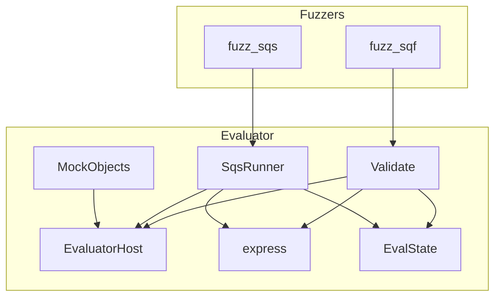
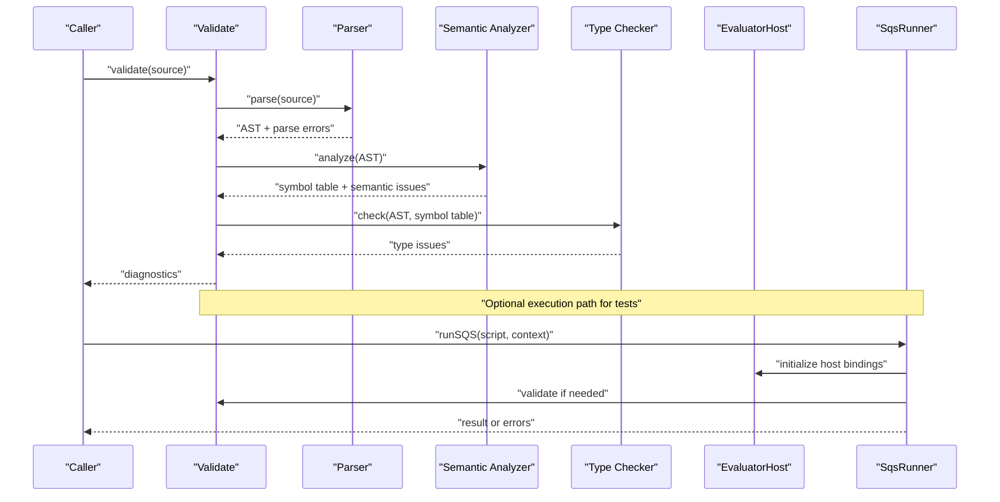
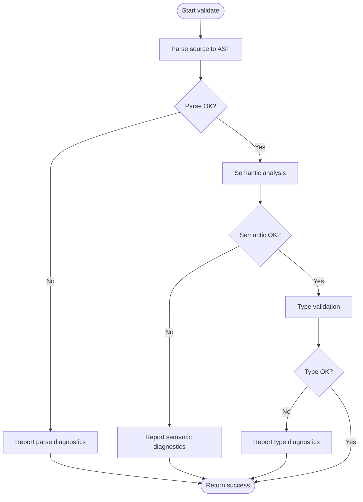
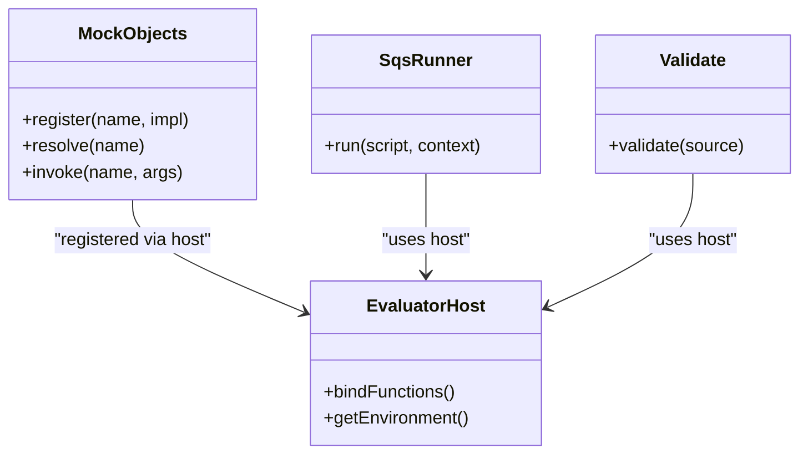
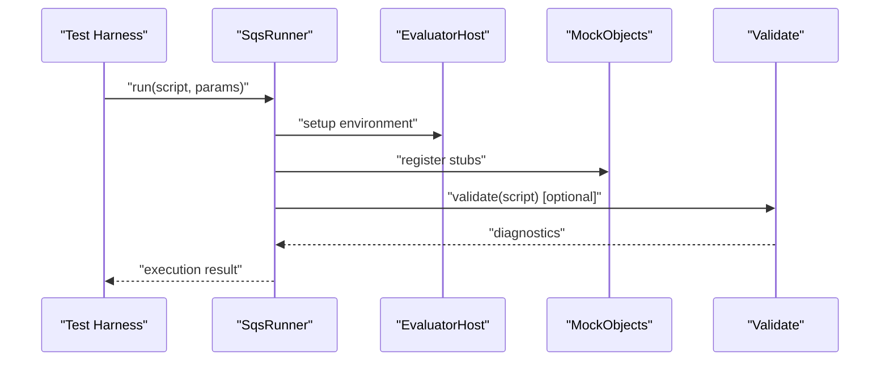
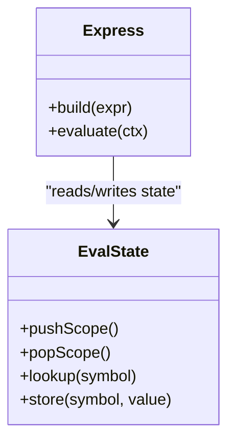
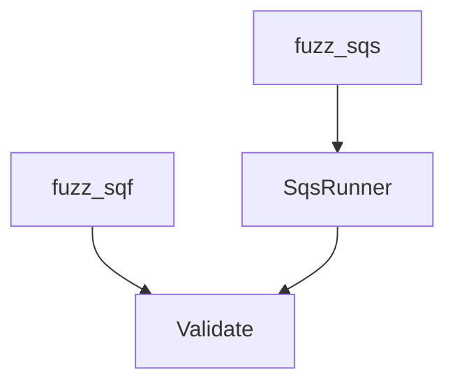
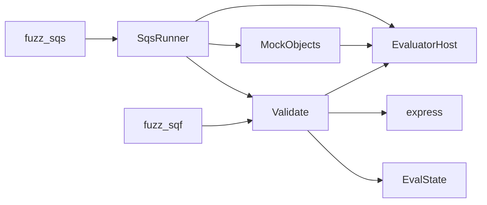

# Script Validation

<cite>
**Referenced Files in This Document**
- [Validate.hpp](file://engine/Evaluator/Validate.hpp)
- [Validate.cpp](file://engine/Evaluator/Validate.cpp)
- [MockObjects.hpp](file://engine/Evaluator/MockObjects.hpp)
- [MockObjects.cpp](file://engine/Evaluator/MockObjects.cpp)
- [EvaluatorHost.hpp](file://engine/Evaluator/EvaluatorHost.hpp)
- [EvaluatorHost.cpp](file://engine/Evaluator/EvaluatorHost.cpp)
- [SqsRunner.hpp](file://engine/Evaluator/SqsRunner.hpp)
- [SqsRunner.cpp](file://engine/Evaluator/SqsRunner.cpp)
- [express.hpp](file://engine/Evaluator/express.hpp)
- [express.cpp](file://engine/Evaluator/express.cpp)
- [EvalState.hpp](file://engine/Evaluator/EvalState.hpp)
- [EvalState.cpp](file://engine/Evaluator/EvalState.cpp)
- [fuzz_sqf.cpp](file://apps/fuzzers/Fuzzer/fuzz_sqf.cpp)
- [fuzz_sqs.cpp](file://apps/fuzzers/Fuzzer/fuzz_sqs.cpp)
</cite>

## Table of Contents
1. Introduction
2. Project Structure
3. Core Components
4. Architecture Overview
5. Detailed Component Analysis
6. Dependency Analysis
7. Performance Considerations
8. Troubleshooting Guide
9. Conclusion
10. Appendices

## Introduction
This document explains the script validation system for SQF and SQS scripts, including syntax checking, semantic analysis, and type validation. It also documents the MockObjects system used to test script functions without full engine initialization, and provides guidance on writing validation tests, custom validators, and assertion frameworks. Finally, it covers common validation errors, diagnostic messages, troubleshooting techniques, IDE integration, automated quality checks, and how to extend the validator with custom rules.

## Project Structure
The validation system is implemented within the Evaluator subsystem under engine/Evaluator. Key files include:
- Validate.{hpp,cpp}: Entry points and orchestration for parsing, validation, and diagnostics.
- MockObjects.{hpp,cpp}: Lightweight stubs enabling isolated testing of script logic.
- EvaluatorHost.{hpp,cpp}: Host interface bridging validation and runtime contexts.
- SqsRunner.{hpp,cpp}: Execution harness for SQS scripts during validation or tests.
- express.{hpp,cpp}: Expression utilities used by validation and evaluation.
- EvalState.{hpp,cpp}: State management for evaluation and validation phases.
- Fuzzers (apps/fuzzers/Fuzzer): Automated fuzzing targets for SQF and SQS to exercise validation paths.

**Diagram sources**
- [Validate.hpp](file://engine/Evaluator/Validate.hpp)
- [Validate.cpp](file://engine/Evaluator/Validate.cpp)
- [MockObjects.hpp](file://engine/Evaluator/MockObjects.hpp)
- [MockObjects.cpp](file://engine/Evaluator/MockObjects.cpp)
- [EvaluatorHost.hpp](file://engine/Evaluator/EvaluatorHost.hpp)
- [EvaluatorHost.cpp](file://engine/Evaluator/EvaluatorHost.cpp)
- [SqsRunner.hpp](file://engine/Evaluator/SqsRunner.hpp)
- [SqsRunner.cpp](file://engine/Evaluator/SqsRunner.cpp)
- [express.hpp](file://engine/Evaluator/express.hpp)
- [express.cpp](file://engine/Evaluator/express.cpp)
- [EvalState.hpp](file://engine/Evaluator/EvalState.hpp)
- [EvalState.cpp](file://engine/Evaluator/EvalState.cpp)
- [fuzz_sqf.cpp](file://apps/fuzzers/Fuzzer/fuzz_sqf.cpp)
- [fuzz_sqs.cpp](file://apps/fuzzers/Fuzzer/fuzz_sqs.cpp)

**Section sources**
- [Validate.hpp](file://engine/Evaluator/Validate.hpp)
- [Validate.cpp](file://engine/Evaluator/Validate.cpp)
- [MockObjects.hpp](file://engine/Evaluator/MockObjects.hpp)
- [MockObjects.cpp](file://engine/Evaluator/MockObjects.cpp)
- [EvaluatorHost.hpp](file://engine/Evaluator/EvaluatorHost.hpp)
- [EvaluatorHost.cpp](file://engine/Evaluator/EvaluatorHost.cpp)
- [SqsRunner.hpp](file://engine/Evaluator/SqsRunner.hpp)
- [SqsRunner.cpp](file://engine/Evaluator/SqsRunner.cpp)
- [express.hpp](file://engine/Evaluator/express.hpp)
- [express.cpp](file://engine/Evaluator/express.cpp)
- [EvalState.hpp](file://engine/Evaluator/EvalState.hpp)
- [EvalState.cpp](file://engine/Evaluator/EvalState.cpp)
- [fuzz_sqf.cpp](file://apps/fuzzers/Fuzzer/fuzz_sqf.cpp)
- [fuzz_sqs.cpp](file://apps/fuzzers/Fuzzer/fuzz_sqs.cpp)

## Core Components
- Validate: Orchestrates parsing, semantic analysis, and type validation for SQF and SQS. Produces structured diagnostics and error reports.
- MockObjects: Provides lightweight, deterministic stubs for engine objects and functions, enabling unit-style testing of script behavior without full engine boot.
- EvaluatorHost: Abstracts host capabilities exposed to the evaluator, allowing validation and execution to share a consistent environment model.
- SqsRunner: Executes SQS scripts in a controlled context suitable for validation and tests.
- express: Utility layer for expression handling used across validation and evaluation.
- EvalState: Tracks state during parsing/validation/execution, including scopes, symbols, and temporary values.

Key responsibilities:
- Syntax checking: Lexing and parsing SQF/SQS into an AST and reporting parse errors.
- Semantic analysis: Resolving identifiers, validating function signatures, and enforcing language semantics.
- Type validation: Checking argument types and return types against expected signatures.
- Diagnostics: Generating human-readable messages with file/line information and suggestions.

**Section sources**
- [Validate.hpp](file://engine/Evaluator/Validate.hpp)
- [Validate.cpp](file://engine/Evaluator/Validate.cpp)
- [MockObjects.hpp](file://engine/Evaluator/MockObjects.hpp)
- [MockObjects.cpp](file://engine/Evaluator/MockObjects.cpp)
- [EvaluatorHost.hpp](file://engine/Evaluator/EvaluatorHost.hpp)
- [EvaluatorHost.cpp](file://engine/Evaluator/EvaluatorHost.cpp)
- [SqsRunner.hpp](file://engine/Evaluator/SqsRunner.hpp)
- [SqsRunner.cpp](file://engine/Evaluator/SqsRunner.cpp)
- [express.hpp](file://engine/Evaluator/express.hpp)
- [express.cpp](file://engine/Evaluator/express.cpp)
- [EvalState.hpp](file://engine/Evaluator/EvalState.hpp)
- [EvalState.cpp](file://engine/Evaluator/EvalState.cpp)

## Architecture Overview
The validation pipeline processes SQF/SQS input through parsing, semantic analysis, and type checking before producing diagnostics. The same infrastructure supports execution via SqsRunner when needed for tests.

**Diagram sources**
- [Validate.hpp](file://engine/Evaluator/Validate.hpp)
- [Validate.cpp](file://engine/Evaluator/Validate.cpp)
- [EvaluatorHost.hpp](file://engine/Evaluator/EvaluatorHost.hpp)
- [EvaluatorHost.cpp](file://engine/Evaluator/EvaluatorHost.cpp)
- [SqsRunner.hpp](file://engine/Evaluator/SqsRunner.hpp)
- [SqsRunner.cpp](file://engine/Evaluator/SqsRunner.cpp)

## Detailed Component Analysis

### Validate: Syntax, Semantics, and Type Validation
- Responsibilities:
  - Parse SQF/SQS source into an AST.
  - Perform semantic analysis (identifier resolution, scope management).
  - Enforce type constraints and function signature compatibility.
  - Aggregate diagnostics with precise locations and suggestions.
- Integration points:
  - Uses EvaluatorHost for environment exposure.
  - Consumes express utilities for expression handling.
  - Can be invoked by SqsRunner prior to execution.

**Diagram sources**
- [Validate.hpp](file://engine/Evaluator/Validate.hpp)
- [Validate.cpp](file://engine/Evaluator/Validate.cpp)

**Section sources**
- [Validate.hpp](file://engine/Evaluator/Validate.hpp)
- [Validate.cpp](file://engine/Evaluator/Validate.cpp)

### MockObjects: Testing Without Full Engine Initialization
- Purpose: Provide deterministic, lightweight stubs for engine objects and functions so that script logic can be tested quickly and reliably.
- Typical usage:
  - Instantiate a minimal host via EvaluatorHost.
  - Register mock objects/functions required by the script under test.
  - Execute or validate the script using SqsRunner or Validate.
  - Assert outcomes via simple assertions or custom validators.

**Diagram sources**
- [MockObjects.hpp](file://engine/Evaluator/MockObjects.hpp)
- [MockObjects.cpp](file://engine/Evaluator/MockObjects.cpp)
- [EvaluatorHost.hpp](file://engine/Evaluator/EvaluatorHost.hpp)
- [EvaluatorHost.cpp](file://engine/Evaluator/EvaluatorHost.cpp)
- [SqsRunner.hpp](file://engine/Evaluator/SqsRunner.hpp)
- [SqsRunner.cpp](file://engine/Evaluator/SqsRunner.cpp)
- [Validate.hpp](file://engine/Evaluator/Validate.hpp)
- [Validate.cpp](file://engine/Evaluator/Validate.cpp)

**Section sources**
- [MockObjects.hpp](file://engine/Evaluator/MockObjects.hpp)
- [MockObjects.cpp](file://engine/Evaluator/MockObjects.cpp)
- [EvaluatorHost.hpp](file://engine/Evaluator/EvaluatorHost.hpp)
- [EvaluatorHost.cpp](file://engine/Evaluator/EvaluatorHost.cpp)
- [SqsRunner.hpp](file://engine/Evaluator/SqsRunner.hpp)
- [SqsRunner.cpp](file://engine/Evaluator/SqsRunner.cpp)
- [Validate.hpp](file://engine/Evaluator/Validate.hpp)
- [Validate.cpp](file://engine/Evaluator/Validate.cpp)

### SqsRunner: Controlled Execution for Validation and Tests
- Responsibilities:
  - Initialize a minimal execution context.
  - Optionally run validation before execution.
  - Execute SQS scripts deterministically using MockObjects where applicable.
- Use cases:
  - Unit tests for script functions.
  - Regression tests for mission scripts.
  - Automated checks in CI pipelines.

**Diagram sources**
- [SqsRunner.hpp](file://engine/Evaluator/SqsRunner.hpp)
- [SqsRunner.cpp](file://engine/Evaluator/SqsRunner.cpp)
- [EvaluatorHost.hpp](file://engine/Evaluator/EvaluatorHost.hpp)
- [EvaluatorHost.cpp](file://engine/Evaluator/EvaluatorHost.cpp)
- [MockObjects.hpp](file://engine/Evaluator/MockObjects.hpp)
- [MockObjects.cpp](file://engine/Evaluator/MockObjects.cpp)
- [Validate.hpp](file://engine/Evaluator/Validate.hpp)
- [Validate.cpp](file://engine/Evaluator/Validate.cpp)

**Section sources**
- [SqsRunner.hpp](file://engine/Evaluator/SqsRunner.hpp)
- [SqsRunner.cpp](file://engine/Evaluator/SqsRunner.cpp)
- [EvaluatorHost.hpp](file://engine/Evaluator/EvaluatorHost.hpp)
- [EvaluatorHost.cpp](file://engine/Evaluator/EvaluatorHost.cpp)
- [MockObjects.hpp](file://engine/Evaluator/MockObjects.hpp)
- [MockObjects.cpp](file://engine/Evaluator/MockObjects.cpp)
- [Validate.hpp](file://engine/Evaluator/Validate.hpp)
- [Validate.cpp](file://engine/Evaluator/Validate.cpp)

### Express and EvalState: Utilities and State Management
- express: Provides helpers for building and manipulating expressions used during validation and evaluation.
- EvalState: Maintains scopes, symbol tables, and transient data structures necessary for parsing, validation, and execution.

**Diagram sources**
- [express.hpp](file://engine/Evaluator/express.hpp)
- [express.cpp](file://engine/Evaluator/express.cpp)
- [EvalState.hpp](file://engine/Evaluator/EvalState.hpp)
- [EvalState.cpp](file://engine/Evaluator/EvalState.cpp)

**Section sources**
- [express.hpp](file://engine/Evaluator/express.hpp)
- [express.cpp](file://engine/Evaluator/express.cpp)
- [EvalState.hpp](file://engine/Evaluator/EvalState.hpp)
- [EvalState.cpp](file://engine/Evaluator/EvalState.cpp)

### Fuzzers: Automated Stress and Coverage
- fuzz_sqf: Exercises SQF parsing and validation paths with randomized inputs.
- fuzz_sqs: Exercises SQS parsing and execution paths with randomized inputs.
- Benefits:
  - Uncovers edge cases in parsers and validators.
  - Improves robustness and coverage of validation logic.

**Diagram sources**
- [fuzz_sqf.cpp](file://apps/fuzzers/Fuzzer/fuzz_sqf.cpp)
- [fuzz_sqs.cpp](file://apps/fuzzers/Fuzzer/fuzz_sqs.cpp)
- [Validate.hpp](file://engine/Evaluator/Validate.hpp)
- [Validate.cpp](file://engine/Evaluator/Validate.cpp)
- [SqsRunner.hpp](file://engine/Evaluator/SqsRunner.hpp)
- [SqsRunner.cpp](file://engine/Evaluator/SqsRunner.cpp)

**Section sources**
- [fuzz_sqf.cpp](file://apps/fuzzers/Fuzzer/fuzz_sqf.cpp)
- [fuzz_sqs.cpp](file://apps/fuzzers/Fuzzer/fuzz_sqs.cpp)
- [Validate.hpp](file://engine/Evaluator/Validate.hpp)
- [Validate.cpp](file://engine/Evaluator/Validate.cpp)
- [SqsRunner.hpp](file://engine/Evaluator/SqsRunner.hpp)
- [SqsRunner.cpp](file://engine/Evaluator/SqsRunner.cpp)

## Dependency Analysis
The validation system has clear separation between parsing, semantic analysis, type checking, and execution. Dependencies are primarily unidirectional:
- Validate depends on EvaluatorHost, express, and EvalState.
- SqsRunner depends on EvaluatorHost, MockObjects, and optionally Validate.
- MockObjects depend on EvaluatorHost for binding registration.
- Fuzzers depend on Validate and SqsRunner to exercise code paths.

**Diagram sources**
- [Validate.hpp](file://engine/Evaluator/Validate.hpp)
- [Validate.cpp](file://engine/Evaluator/Validate.cpp)
- [EvaluatorHost.hpp](file://engine/Evaluator/EvaluatorHost.hpp)
- [EvaluatorHost.cpp](file://engine/Evaluator/EvaluatorHost.cpp)
- [express.hpp](file://engine/Evaluator/express.hpp)
- [express.cpp](file://engine/Evaluator/express.cpp)
- [EvalState.hpp](file://engine/Evaluator/EvalState.hpp)
- [EvalState.cpp](file://engine/Evaluator/EvalState.cpp)
- [MockObjects.hpp](file://engine/Evaluator/MockObjects.hpp)
- [MockObjects.cpp](file://engine/Evaluator/MockObjects.cpp)
- [SqsRunner.hpp](file://engine/Evaluator/SqsRunner.hpp)
- [SqsRunner.cpp](file://engine/Evaluator/SqsRunner.cpp)
- [fuzz_sqf.cpp](file://apps/fuzzers/Fuzzer/fuzz_sqf.cpp)
- [fuzz_sqs.cpp](file://apps/fuzzers/Fuzzer/fuzz_sqs.cpp)

**Section sources**
- [Validate.hpp](file://engine/Evaluator/Validate.hpp)
- [Validate.cpp](file://engine/Evaluator/Validate.cpp)
- [EvaluatorHost.hpp](file://engine/Evaluator/EvaluatorHost.hpp)
- [EvaluatorHost.cpp](file://engine/Evaluator/EvaluatorHost.cpp)
- [express.hpp](file://engine/Evaluator/express.hpp)
- [express.cpp](file://engine/Evaluator/express.cpp)
- [EvalState.hpp](file://engine/Evaluator/EvalState.hpp)
- [EvalState.cpp](file://engine/Evaluator/EvalState.cpp)
- [MockObjects.hpp](file://engine/Evaluator/MockObjects.hpp)
- [MockObjects.cpp](file://engine/Evaluator/MockObjects.cpp)
- [SqsRunner.hpp](file://engine/Evaluator/SqsRunner.hpp)
- [SqsRunner.cpp](file://engine/Evaluator/SqsRunner.cpp)
- [fuzz_sqf.cpp](file://apps/fuzzers/Fuzzer/fuzz_sqf.cpp)
- [fuzz_sqs.cpp](file://apps/fuzzers/Fuzzer/fuzz_sqs.cpp)

## Performance Considerations
- Parsing and validation should be incremental where possible to avoid re-parsing unchanged files.
- Cache symbol tables and resolved identifiers per file to reduce repeated work.
- Minimize allocations in hot paths; reuse buffers for diagnostics and intermediate results.
- Use MockObjects judiciously to keep test execution fast and deterministic.
- Profile validation runs to identify bottlenecks in lexing, parsing, or type checking.

[No sources needed since this section provides general guidance]

## Troubleshooting Guide
Common validation errors and diagnostics:
- Syntax errors: Missing tokens, mismatched parentheses, invalid operators.
- Semantic errors: Undefined identifiers, incorrect scoping, invalid control flow.
- Type errors: Mismatched argument types, incompatible return types, invalid operations.

Diagnostic best practices:
- Include file name, line number, and column for precise location.
- Provide actionable suggestions (e.g., correct function names, expected types).
- Group related diagnostics to reduce noise.

Troubleshooting steps:
- Isolate failing scripts and run them through SqsRunner with minimal MockObjects to reproduce.
- Enable verbose logging in Validate to see parse/semantic/type stages.
- Use fuzzers to generate edge-case inputs that trigger failures.
- Review EvalState snapshots to understand scope and symbol resolution issues.

**Section sources**
- [Validate.hpp](file://engine/Evaluator/Validate.hpp)
- [Validate.cpp](file://engine/Evaluator/Validate.cpp)
- [EvalState.hpp](file://engine/Evaluator/EvalState.hpp)
- [EvalState.cpp](file://engine/Evaluator/EvalState.cpp)
- [SqsRunner.hpp](file://engine/Evaluator/SqsRunner.hpp)
- [SqsRunner.cpp](file://engine/Evaluator/SqsRunner.cpp)

## Conclusion
The script validation system provides robust syntax, semantic, and type checking for SQF and SQS, supported by a flexible MockObjects framework for testing without full engine initialization. By leveraging Validate, SqsRunner, and MockObjects, developers can write comprehensive validation tests, integrate automated checks into CI, and extend the validator with custom rules. Following the guidelines here will help ensure reliable, maintainable, and high-quality scripting workflows.

[No sources needed since this section summarizes without analyzing specific files]

## Appendices

### Writing Validation Tests
- Steps:
  - Prepare script source and minimal MockObjects setup.
  - Invoke Validate to check syntax and semantics.
  - Optionally execute via SqsRunner to verify runtime behavior.
  - Assert expected diagnostics and outcomes.
- Tips:
  - Keep tests focused on single concerns (parsing, semantics, types).
  - Use deterministic MockObjects to avoid flaky tests.
  - Leverage fuzzers to expand coverage.

**Section sources**
- [Validate.hpp](file://engine/Evaluator/Validate.hpp)
- [Validate.cpp](file://engine/Evaluator/Validate.cpp)
- [MockObjects.hpp](file://engine/Evaluator/MockObjects.hpp)
- [MockObjects.cpp](file://engine/Evaluator/MockObjects.cpp)
- [SqsRunner.hpp](file://engine/Evaluator/SqsRunner.hpp)
- [SqsRunner.cpp](file://engine/Evaluator/SqsRunner.cpp)
- [fuzz_sqf.cpp](file://apps/fuzzers/Fuzzer/fuzz_sqf.cpp)
- [fuzz_sqs.cpp](file://apps/fuzzers/Fuzzer/fuzz_sqs.cpp)

### Creating Custom Validators
- Approach:
  - Extend Validate’s analysis phase to add domain-specific checks.
  - Use EvalState to access scopes and symbols.
  - Emit diagnostics via the existing diagnostic infrastructure.
- Best practices:
  - Keep custom rules composable and independent.
  - Provide clear error messages and suggestions.
  - Add unit tests for each custom rule.

**Section sources**
- [Validate.hpp](file://engine/Evaluator/Validate.hpp)
- [Validate.cpp](file://engine/Evaluator/Validate.cpp)
- [EvalState.hpp](file://engine/Evaluator/EvalState.hpp)
- [EvalState.cpp](file://engine/Evaluator/EvalState.cpp)

### IDE and Automated Quality Checks
- IDE integration:
  - Hook into Validate to provide real-time diagnostics.
  - Surface suggestions and quick fixes based on diagnostic categories.
- CI automation:
  - Run Validate on all scripts as part of build pipelines.
  - Integrate fuzzers for continuous stress testing.
  - Fail builds on new validation errors or regressions.

**Section sources**
- [Validate.hpp](file://engine/Evaluator/Validate.hpp)
- [Validate.cpp](file://engine/Evaluator/Validate.cpp)
- [fuzz_sqf.cpp](file://apps/fuzzers/Fuzzer/fuzz_sqf.cpp)
- [fuzz_sqs.cpp](file://apps/fuzzers/Fuzzer/fuzz_sqs.cpp)