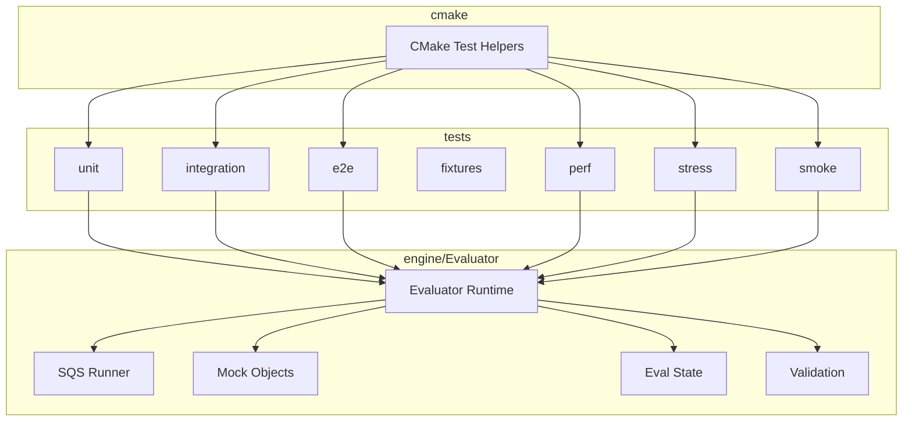
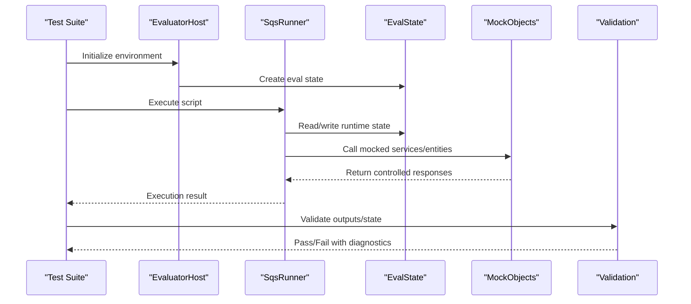
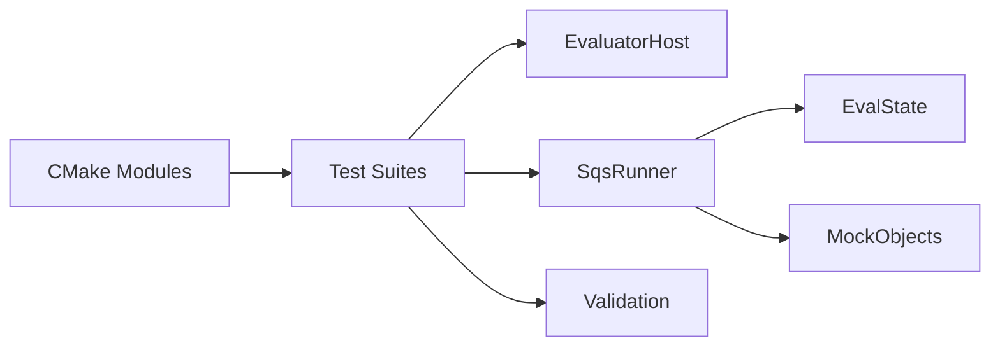

# Test Framework

<cite>
**Referenced Files in This Document**
- [tests/README.md](file://tests/README.md)
- [CMakeLists.txt](file://CMakeLists.txt)
- [cmake/CatchAddWindowsSafeTests.cmake](file://cmake/CatchAddWindowsSafeTests.cmake)
- [cmake/CatchWindowsSafe.cmake](file://cmake/CatchWindowsSafe.cmake)
- [cmake/RunTridentCTest.cmake](file://cmake/RunTridentCTest.cmake)
- [cmake/TridentCTest.cmake](file://cmake/TridentCTest.cmake)
- [engine/Evaluator/MockObjects.cpp](file://engine/Evaluator/MockObjects.cpp)
- [engine/Evaluator/MockObjects.hpp](file://engine/Evaluator/MockObjects.hpp)
- [engine/Evaluator/SqsRunner.cpp](file://engine/Evaluator/SqsRunner.cpp)
- [engine/Evaluator/SqsRunner.hpp](file://engine/Evaluator/SqsRunner.hpp)
- [engine/Evaluator/EvaluatorHost.cpp](file://engine/Evaluator/EvaluatorHost.cpp)
- [engine/Evaluator/EvaluatorHost.hpp](file://engine/Evaluator/EvaluatorHost.hpp)
- [engine/Evaluator/EvalState.cpp](file://engine/Evaluator/EvalState.cpp)
- [engine/Evaluator/EvalState.hpp](file://engine/Evaluator/EvalState.hpp)
- [engine/Evaluator/Validate.cpp](file://engine/Evaluator/Validate.cpp)
- [engine/Evaluator/Validate.hpp](file://engine/Evaluator/Validate.hpp)
- [apps/tools/Tools/fixtures/main.cpp](file://apps/tools/Tools/fixtures/main.cpp)
- [scripts/Build.ps1](file://scripts/Build.ps1)
- [scripts/Start.ps1](file://scripts/Start.ps1)
</cite>

## Table of Contents
1. [Introduction](#introduction)
2. [Project Structure](#project-structure)
3. [Core Components](#core-components)
4. [Architecture Overview](#architecture-overview)
5. [Detailed Component Analysis](#detailed-component-analysis)
6. [Dependency Analysis](#dependency-analysis)
7. [Performance Considerations](#performance-considerations)
8. [Troubleshooting Guide](#troubleshooting-guide)
9. [Conclusion](#conclusion)
10. [Appendices](#appendices)

## Introduction
This document explains the evaluation test framework used to validate script execution, mission logic, and end-to-end scenarios. It covers how to write unit tests for script functions, integration tests for mission flows, and end-to-end tests that exercise complete scenarios. It also documents fixture creation, mock object usage, assertion strategies, result reporting, performance and stress testing, continuous integration setup, debugging failed tests, and optimizing execution time.

The framework centers around:
- Script evaluation via an evaluator runtime and SQS runner
- CMake-based test discovery and execution
- Organized test directories for unit, integration, e2e, smoke, perf, and stress suites
- Fixtures and mock objects to simulate game state and external dependencies

## Project Structure
Test assets and suites are organized under a dedicated tests directory with clear separation by scope:
- unit: Engine and application unit tests
- integration: Mission flows, scripting, multiplayer, UI, rendering
- e2e: End-to-end scenario scripts
- fixtures: Shared data, configs, missions, mods, and resources
- perf: Performance-focused missions and harnesses
- stress: Long-running or high-load scenarios
- smoke: Quick sanity checks for configuration and behavior

**Diagram sources**
- [CMakeLists.txt](file://CMakeLists.txt)
- [cmake/RunTridentCTest.cmake](file://cmake/RunTridentCTest.cmake)
- [cmake/TridentCTest.cmake](file://cmake/TridentCTest.cmake)
- [engine/Evaluator/SqsRunner.cpp](file://engine/Evaluator/SqsRunner.cpp)
- [engine/Evaluator/MockObjects.cpp](file://engine/Evaluator/MockObjects.cpp)
- [engine/Evaluator/EvalState.cpp](file://engine/Evaluator/EvalState.cpp)
- [engine/Evaluator/Validate.cpp](file://engine/Evaluator/Validate.cpp)

**Section sources**
- [tests/README.md](file://tests/README.md)
- [CMakeLists.txt](file://CMakeLists.txt)

## Core Components
The evaluation test framework relies on these core components:
- Evaluator Host: Initializes and manages the script evaluation environment
- SQS Runner: Executes SQF/SQS scripts within a controlled context
- Mock Objects: Provide stubs for engine services and game entities
- Eval State: Holds runtime state during script evaluation
- Validation Utilities: Helper functions for assertions and diagnostics
- CMake Test Integration: Discovers and runs tests across platforms (including Windows-safe variants)

Key responsibilities:
- Isolate script execution from heavy subsystems using mocks
- Provide deterministic state for reproducible tests
- Expose assertion helpers for output validation
- Support both fast unit tests and longer integration/e2e suites

**Section sources**
- [engine/Evaluator/EvaluatorHost.cpp](file://engine/Evaluator/EvaluatorHost.cpp)
- [engine/Evaluator/SqsRunner.cpp](file://engine/Evaluator/SqsRunner.cpp)
- [engine/Evaluator/MockObjects.cpp](file://engine/Evaluator/MockObjects.cpp)
- [engine/Evaluator/EvalState.cpp](file://engine/Evaluator/EvalState.cpp)
- [engine/Evaluator/Validate.cpp](file://engine/Evaluator/Validate.cpp)
- [cmake/CatchAddWindowsSafeTests.cmake](file://cmake/CatchAddWindowsSafeTests.cmake)
- [cmake/CatchWindowsSafe.cmake](file://cmake/CatchWindowsSafe.cmake)

## Architecture Overview
The test architecture layers script execution, state management, and assertions:

**Diagram sources**
- [engine/Evaluator/EvaluatorHost.cpp](file://engine/Evaluator/EvaluatorHost.cpp)
- [engine/Evaluator/SqsRunner.cpp](file://engine/Evaluator/SqsRunner.cpp)
- [engine/Evaluator/EvalState.cpp](file://engine/Evaluator/EvalState.cpp)
- [engine/Evaluator/MockObjects.cpp](file://engine/Evaluator/MockObjects.cpp)
- [engine/Evaluator/Validate.cpp](file://engine/Evaluator/Validate.cpp)

## Detailed Component Analysis

### Evaluator Host
Purpose:
- Bootstraps the evaluation environment
- Configures global settings and resource paths
- Provides lifecycle hooks for test setup and teardown

Usage patterns:
- Initialize once per test process or per test case depending on isolation needs
- Ensure cleanup of allocated resources to avoid cross-test contamination

Best practices:
- Keep initialization minimal in unit tests
- Use separate instances for integration tests requiring full environment

**Section sources**
- [engine/Evaluator/EvaluatorHost.cpp](file://engine/Evaluator/EvaluatorHost.cpp)
- [engine/Evaluator/EvaluatorHost.hpp](file://engine/Evaluator/EvaluatorHost.hpp)

### SQS Runner
Purpose:
- Executes SQF/SQS scripts in a sandboxed context
- Bridges script calls to host-provided functions and mocks
- Captures execution results and errors

Execution flow:
- Load script source
- Bind host functions and variables
- Run script loop until completion or timeout
- Collect logs and return status

Optimization tips:
- Reuse runner instances where safe
- Avoid heavy initialization inside frequently executed scripts

**Section sources**
- [engine/Evaluator/SqsRunner.cpp](file://engine/Evaluator/SqsRunner.cpp)
- [engine/Evaluator/SqsRunner.hpp](file://engine/Evaluator/SqsRunner.hpp)

### Mock Objects
Purpose:
- Replace engine subsystems with deterministic implementations
- Allow precise control over inputs and outputs during tests

Common patterns:
- Stub methods to return fixed values
- Track call counts and parameters for verification
- Simulate failures or edge cases

Guidelines:
- Keep mocks focused and minimal
- Prefer composition over inheritance for flexibility

**Section sources**
- [engine/Evaluator/MockObjects.cpp](file://engine/Evaluator/MockObjects.cpp)
- [engine/Evaluator/MockObjects.hpp](file://engine/Evaluator/MockObjects.hpp)

### Eval State
Purpose:
- Maintains runtime variables, entity references, and simulation progress
- Provides accessors for test assertions

Design considerations:
- Thread-safety is not required for single-threaded tests
- Clear reset mechanisms between tests

**Section sources**
- [engine/Evaluator/EvalState.cpp](file://engine/Evaluator/EvalState.cpp)
- [engine/Evaluator/EvalState.hpp](file://engine/Evaluator/EvalState.hpp)

### Validation Utilities
Purpose:
- Offer assertion helpers tailored to script evaluation outcomes
- Format diagnostic messages for easier debugging

Recommendations:
- Use descriptive messages in assertions
- Group related checks into helper functions

**Section sources**
- [engine/Evaluator/Validate.cpp](file://engine/Evaluator/Validate.cpp)
- [engine/Evaluator/Validate.hpp](file://engine/Evaluator/Validate.hpp)

### CMake Test Integration
Purpose:
- Discover and run tests across platforms
- Provide Windows-safe test execution utilities
- Integrate with CI pipelines

Key files:
- TridentCTest.cmake: Defines test targets and properties
- RunTridentCTest.cmake: Orchestrates test execution
- CatchWindowsSafe.cmake and CatchAddWindowsSafeTests.cmake: Handle platform-specific quirks

Usage:
- Add test targets using provided macros
- Configure timeouts and filters as needed

**Section sources**
- [cmake/TridentCTest.cmake](file://cmake/TridentCTest.cmake)
- [cmake/RunTridentCTest.cmake](file://cmake/RunTridentCTest.cmake)
- [cmake/CatchWindowsSafe.cmake](file://cmake/CatchWindowsSafe.cmake)
- [cmake/CatchAddWindowsSafeTests.cmake](file://cmake/CatchAddWindowsSafeTests.cmake)

## Dependency Analysis
The test framework has clear dependency boundaries:
- Tests depend on Evaluator Host and SQS Runner
- Mock Objects abstract engine subsystems
- Validation Utilities provide assertion capabilities
- CMake modules handle build and execution orchestration

**Diagram sources**
- [engine/Evaluator/EvaluatorHost.cpp](file://engine/Evaluator/EvaluatorHost.cpp)
- [engine/Evaluator/SqsRunner.cpp](file://engine/Evaluator/SqsRunner.cpp)
- [engine/Evaluator/EvalState.cpp](file://engine/Evaluator/EvalState.cpp)
- [engine/Evaluator/MockObjects.cpp](file://engine/Evaluator/MockObjects.cpp)
- [engine/Evaluator/Validate.cpp](file://engine/Evaluator/Validate.cpp)
- [cmake/TridentCTest.cmake](file://cmake/TridentCTest.cmake)

**Section sources**
- [CMakeLists.txt](file://CMakeLists.txt)

## Performance Considerations
To optimize test execution:
- Minimize initialization overhead in test setup
- Reuse expensive resources where thread-safe
- Use selective test filtering for rapid feedback
- Parallelize independent test suites
- Profile slow tests and refactor bottlenecks

For performance and stress testing:
- Leverage perf and stress directories for specialized suites
- Use realistic datasets from fixtures
- Monitor resource usage and memory leaks

[No sources needed since this section provides general guidance]

## Troubleshooting Guide
Common issues and resolutions:
- Test hangs: Check for infinite loops in scripts or missing timeouts
- Flaky tests: Ensure deterministic mocks and clean state resets
- Resource leaks: Verify proper cleanup in teardown phases
- Platform-specific failures: Use Windows-safe test utilities

Debugging steps:
- Enable verbose logging in evaluator
- Inspect eval state after execution
- Use targeted assertions to isolate failures
- Review mock call histories for unexpected interactions

**Section sources**
- [engine/Evaluator/Validate.cpp](file://engine/Evaluator/Validate.cpp)
- [engine/Evaluator/MockObjects.cpp](file://engine/Evaluator/MockObjects.cpp)

## Conclusion
The evaluation test framework provides a robust foundation for validating script execution, mission logic, and end-to-end scenarios. By leveraging mock objects, structured fixtures, and CMake-based test orchestration, teams can maintain high confidence in code quality while ensuring efficient test execution. Following the guidelines in this document will help create reliable, maintainable, and scalable test suites.

[No sources needed since this section summarizes without analyzing specific files]

## Appendices

### Writing Unit Tests for Script Functions
- Isolate function logic using mocks
- Define clear input/output expectations
- Use assertion helpers for precise validation
- Keep tests fast and deterministic

### Integration Tests for Mission Logic
- Set up realistic game state with fixtures
- Execute multi-step mission flows
- Validate intermediate and final states
- Handle asynchronous operations appropriately

### End-to-End Tests for Complete Scenarios
- Exercise full application lifecycle
- Use real-world data sets from fixtures
- Validate user-facing behaviors
- Include error scenarios and recovery paths

### Test Fixture Creation
- Organize shared resources under fixtures directory
- Use version-controlled assets for consistency
- Provide minimal viable fixtures for quick tests
- Document fixture purposes and dependencies

### Mock Object Usage
- Implement interfaces for all external dependencies
- Track interactions for verification
- Simulate edge cases and failure modes
- Keep mocks simple and focused

### Assertion Methods
- Use descriptive assertion messages
- Group related assertions logically
- Provide context in failure reports
- Leverage custom validators for complex checks

### Test Organization Patterns
- Follow naming conventions for clarity
- Group related tests in logical hierarchies
- Separate concerns by test type (unit/integration/e2e)
- Maintain consistent structure across suites

### Result Reporting
- Generate machine-readable output for CI
- Include detailed diagnostics in failures
- Summarize test coverage metrics
- Archive artifacts for analysis

### Continuous Integration Setup
- Configure automated test execution
- Implement parallel test running
- Set up artifact collection
- Monitor test stability over time

### Debugging Failed Tests
- Reproduce failures locally with detailed logs
- Use incremental debugging approaches
- Isolate problematic components
- Collaborate with team members for insights

### Optimizing Test Execution Time
- Profile test suites to identify bottlenecks
- Implement smart caching strategies
- Reduce unnecessary I/O operations
- Consider test splitting for parallelization

**Section sources**
- [scripts/Build.ps1](file://scripts/Build.ps1)
- [scripts/Start.ps1](file://scripts/Start.ps1)
- [apps/tools/Tools/fixtures/main.cpp](file://apps/tools/Tools/fixtures/main.cpp)