# Mission Editor Core

<cite>
**Referenced Files in This Document**
- [StudioApp.cpp](file://apps/tools/Studio/StudioApp.cpp)
- [StudioApp.hpp](file://apps/tools/Studio/StudioApp.hpp)
- [StudioConfig.cpp](file://apps/tools/Studio/StudioConfig.cpp)
- [StudioConfig.hpp](file://apps/tools/Studio/StudioConfig.hpp)
- [main.cpp](file://apps/tools/Studio/main.cpp)
- [CMakeLists.txt](file://apps/tools/Studio/CMakeLists.txt)
- [EvaluatorHost.cpp](file://engine/Poseidon/Evaluator/EvaluatorHost.cpp)
- [EvaluatorHost.hpp](file://engine/Poseidon/Evaluator/EvaluatorHost.hpp)
- [SqsRunner.cpp](file://engine/Poseidon/Evaluator/SqsRunner.cpp)
- [SqsRunner.hpp](file://engine/Poseidon/Evaluator/SqsRunner.hpp)
- [Validate.cpp](file://engine/Poseidon/Evaluator/Validate.cpp)
- [Validate.hpp](file://engine/Poseidon/Evaluator/Validate.hpp)
- [World.cpp](file://engine/Poseidon/World/World.cpp)
- [World.hpp](file://engine/Poseidon/World/World.hpp)
- [WorldImpl.cpp](file://engine/Poseidon/World/WorldImpl.cpp)
- [Editor.cpp](file://engine/Poseidon/Game/Editor.cpp)
- [Editor.hpp](file://engine/Poseidon/Game/Editor.hpp)
- [Terrain.h](file://engine/Poseidon/World/Terrain/Terrain.h)
- [LightingManager.cpp](file://engine/Poseidon/Graphics/Core/LightingManager.cpp)
- [GraphicsEngineFactory.cpp](file://engine/Poseidon/Graphics/GraphicsEngineFactory.cpp)
- [EngineGL33.cpp](file://engine/Poseidon/PoseidonGL33/EngineGL33.cpp)
- [EngineWgpu.cpp](file://engine/Poseidon/WgpuRenderer/EngineWgpu.cpp)
- [ModSystem.cpp](file://engine/Poseidon/Core/ModSystem.cpp)
- [ModCollection.cpp](file://engine/Poseidon/Core/ModCollection.cpp)
- [NetworkMissionTransfer.cpp](file://engine/Poseidon/Network/NetworkMissionTransfer.cpp)
- [SaveVersion.hpp](file://engine/Poseidon/Core/SaveVersion.hpp)
- [Profile.cpp](file://engine/Poseidon/Core/Profile/Profile.cpp)
- [Profile.hpp](file://engine/Poseidon/Core/Profile/Profile.hpp)
</cite>

## Table of Contents
1. [Introduction](#introduction)
2. [Project Structure](#project-structure)
3. [Core Components](#core-components)
4. [Architecture Overview](#architecture-overview)
5. [Detailed Component Analysis](#detailed-component-analysis)
6. [Dependency Analysis](#dependency-analysis)
7. [Performance Considerations](#performance-considerations)
8. [Troubleshooting Guide](#troubleshooting-guide)
9. [Conclusion](#conclusion)
10. [Appendices](#appendices)

## Introduction
This document explains the mission editing capabilities within the Studio application and how they integrate with the Poseidon engine. It covers object placement tools, terrain editing features, lighting configuration, scripting integration (SQF/SQS), validation and real-time testing, preview rendering, performance profiling, debugging, workflows for templates and asset imports, dependency management, save/load operations, version control integration, collaborative editing, common scenarios, best practices, and optimization techniques for large missions.

## Project Structure
The Studio tool is a C++ application that orchestrates mission editing workflows and delegates heavy lifting to the Poseidon engine subsystems:
- Studio application entrypoint and configuration
- Evaluator runtime for SQF/SQS execution and validation
- World and editor subsystems for scene manipulation
- Graphics backends for preview rendering
- Mod system and network utilities for dependencies and collaboration

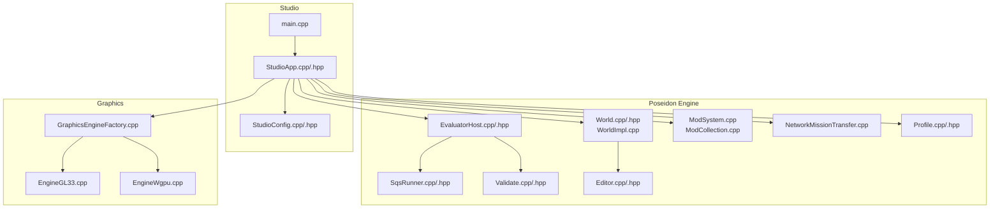

**Diagram sources**
- [main.cpp](file://apps/tools/Studio/main.cpp)
- [StudioApp.cpp](file://apps/tools/Studio/StudioApp.cpp)
- [StudioConfig.cpp](file://apps/tools/Studio/StudioConfig.cpp)
- [EvaluatorHost.cpp](file://engine/Poseidon/Evaluator/EvaluatorHost.cpp)
- [SqsRunner.cpp](file://engine/Poseidon/Evaluator/SqsRunner.cpp)
- [Validate.cpp](file://engine/Poseidon/Evaluator/Validate.cpp)
- [World.cpp](file://engine/Poseidon/World/World.cpp)
- [WorldImpl.cpp](file://engine/Poseidon/World/WorldImpl.cpp)
- [Editor.cpp](file://engine/Poseidon/Game/Editor.cpp)
- [ModSystem.cpp](file://engine/Poseidon/Core/ModSystem.cpp)
- [ModCollection.cpp](file://engine/Poseidon/Core/ModCollection.cpp)
- [NetworkMissionTransfer.cpp](file://engine/Poseidon/Network/NetworkMissionTransfer.cpp)
- [Profile.cpp](file://engine/Poseidon/Core/Profile/Profile.cpp)
- [GraphicsEngineFactory.cpp](file://engine/Poseidon/Graphics/GraphicsEngineFactory.cpp)
- [EngineGL33.cpp](file://engine/Poseidon/PoseidonGL33/EngineGL33.cpp)
- [EngineWgpu.cpp](file://engine/Poseidon/WgpuRenderer/EngineWgpu.cpp)

**Section sources**
- [main.cpp](file://apps/tools/Studio/main.cpp)
- [StudioApp.cpp](file://apps/tools/Studio/StudioApp.cpp)
- [StudioConfig.cpp](file://apps/tools/Studio/StudioConfig.cpp)
- [CMakeLists.txt](file://apps/tools/Studio/CMakeLists.txt)

## Core Components
- Studio Application: Initializes UI, loads configuration, manages mission lifecycle, and coordinates engine subsystems.
- Evaluator Host: Provides an execution environment for SQF/SQS scripts, including validation and live evaluation hooks.
- World and Editor: Manages scene graph, entity placement, terrain data, and editor-specific interactions.
- Graphics Backends: Provide preview rendering via OpenGL or WGPU.
- Mod System: Resolves mission dependencies and external assets from mods.
- Network Utilities: Support mission transfer and collaborative workflows.
- Profiling: Captures performance metrics during editing and preview.

**Section sources**
- [StudioApp.cpp](file://apps/tools/Studio/StudioApp.cpp)
- [StudioConfig.cpp](file://apps/tools/Studio/StudioConfig.cpp)
- [EvaluatorHost.cpp](file://engine/Poseidon/Evaluator/EvaluatorHost.cpp)
- [SqsRunner.cpp](file://engine/Poseidon/Evaluator/SqsRunner.cpp)
- [Validate.cpp](file://engine/Poseidon/Evaluator/Validate.cpp)
- [World.cpp](file://engine/Poseidon/World/World.cpp)
- [Editor.cpp](file://engine/Poseidon/Game/Editor.cpp)
- [ModSystem.cpp](file://engine/Poseidon/Core/ModSystem.cpp)
- [NetworkMissionTransfer.cpp](file://engine/Poseidon/Network/NetworkMissionTransfer.cpp)
- [Profile.cpp](file://engine/Poseidon/Core/Profile/Profile.cpp)

## Architecture Overview
The Studio app composes engine services to provide a cohesive mission editing experience. The Evaluator integrates with the World and Editor to enable live scripting feedback. Graphics backends are abstracted through a factory to support multiple renderers.

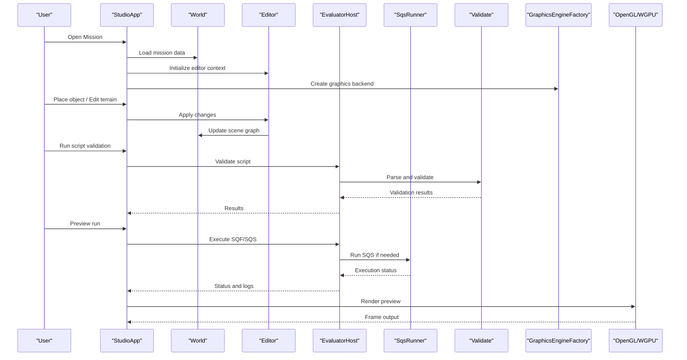

**Diagram sources**
- [StudioApp.cpp](file://apps/tools/Studio/StudioApp.cpp)
- [World.cpp](file://engine/Poseidon/World/World.cpp)
- [Editor.cpp](file://engine/Poseidon/Game/Editor.cpp)
- [EvaluatorHost.cpp](file://engine/Poseidon/Evaluator/EvaluatorHost.cpp)
- [SqsRunner.cpp](file://engine/Poseidon/Evaluator/SqsRunner.cpp)
- [Validate.cpp](file://engine/Poseidon/Evaluator/Validate.cpp)
- [GraphicsEngineFactory.cpp](file://engine/Poseidon/Graphics/GraphicsEngineFactory.cpp)
- [EngineGL33.cpp](file://engine/Poseidon/PoseidonGL33/EngineGL33.cpp)
- [EngineWgpu.cpp](file://engine/Poseidon/WgpuRenderer/EngineWgpu.cpp)

## Detailed Component Analysis

### Studio Application Lifecycle
- Initialization: Loads configuration, sets up logging, and prepares subsystems.
- Mission Management: Opens, creates, saves, and exports missions; tracks unsaved changes.
- Integration: Coordinates World, Editor, Evaluator, and Graphics backends.

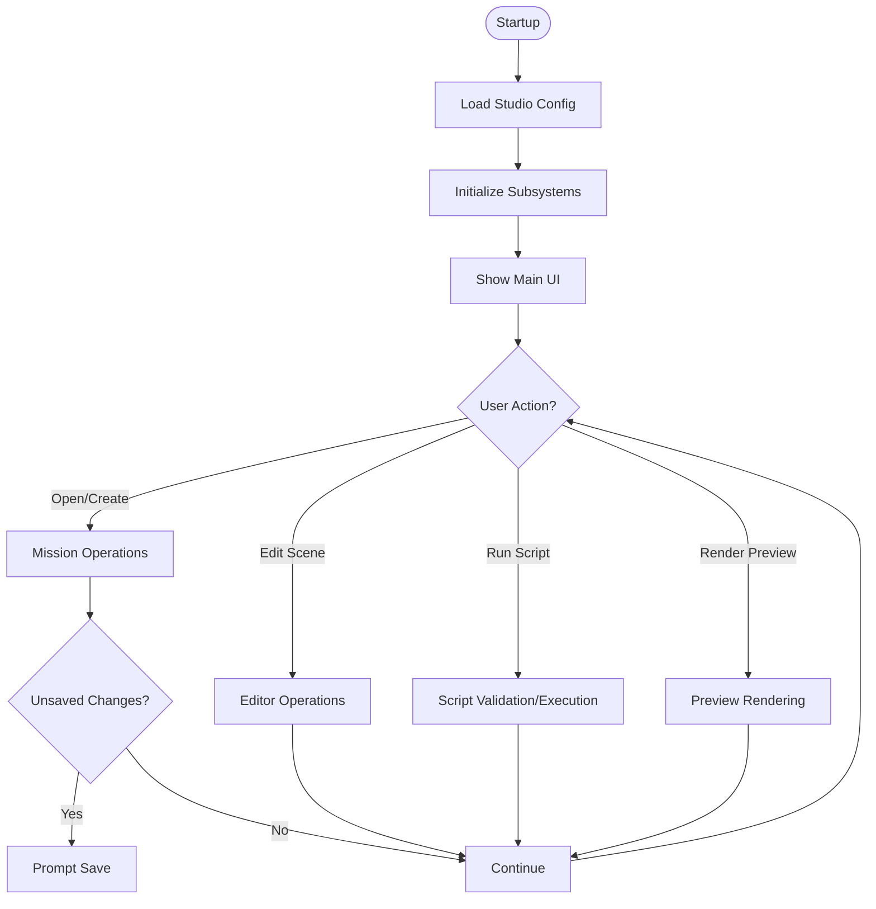

**Diagram sources**
- [StudioApp.cpp](file://apps/tools/Studio/StudioApp.cpp)
- [StudioConfig.cpp](file://apps/tools/Studio/StudioConfig.cpp)

**Section sources**
- [StudioApp.cpp](file://apps/tools/Studio/StudioApp.cpp)
- [StudioConfig.cpp](file://apps/tools/Studio/StudioConfig.cpp)

### Object Placement Tools
- Selection and snapping: Supports grid snapping, surface normal alignment, and collision checks.
- Entity creation: Instantiates world entities from definitions and applies transforms.
- Batch operations: Copy/paste, group selection, and bulk property edits.

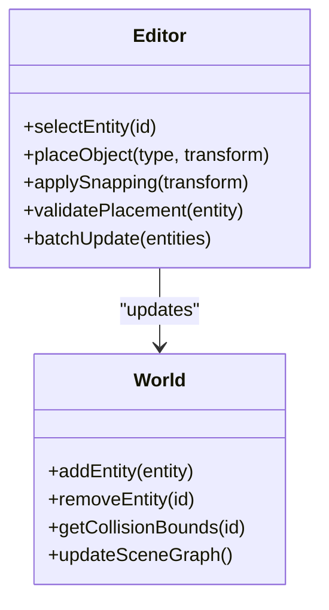

**Diagram sources**
- [Editor.cpp](file://engine/Poseidon/Game/Editor.cpp)
- [World.cpp](file://engine/Poseidon/World/World.cpp)

**Section sources**
- [Editor.cpp](file://engine/Poseidon/Game/Editor.cpp)
- [World.cpp](file://engine/Poseidon/World/World.cpp)

### Terrain Editing Features
- Heightmap manipulation: Brush-based elevation changes, smoothing, and erosion simulation.
- Texture painting: Layer blending, alpha masks, and material assignment.
- Performance considerations: LOD generation, streaming, and culling updates.

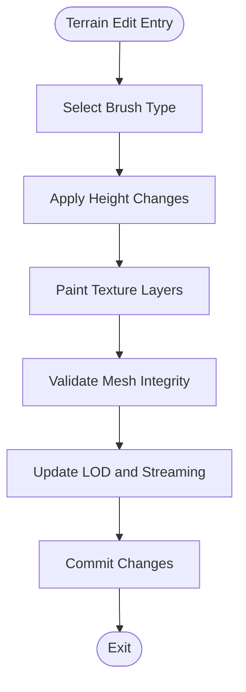

**Diagram sources**
- [Terrain.h](file://engine/Poseidon/World/Terrain/Terrain.h)

**Section sources**
- [Terrain.h](file://engine/Poseidon/World/Terrain/Terrain.h)

### Lighting Configuration
- Light types: Directional, point, spot, and area lights with intensity and color controls.
- Shadows: Cascaded shadow maps, soft shadows, and resolution tuning.
- Environment: Skyboxes, ambient occlusion, and global illumination settings.

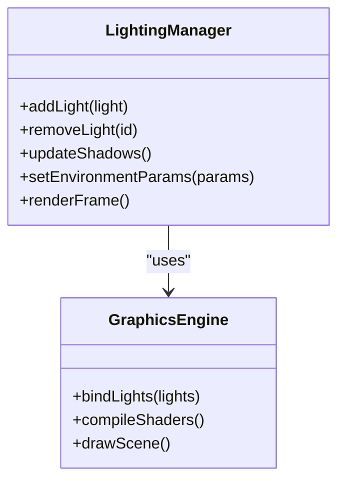

**Diagram sources**
- [LightingManager.cpp](file://engine/Poseidon/Graphics/Core/LightingManager.cpp)
- [EngineGL33.cpp](file://engine/Poseidon/PoseidonGL33/EngineGL33.cpp)
- [EngineWgpu.cpp](file://engine/Poseidon/WgpuRenderer/EngineWgpu.cpp)

**Section sources**
- [LightingManager.cpp](file://engine/Poseidon/Graphics/Core/LightingManager.cpp)
- [EngineGL33.cpp](file://engine/Poseidon/PoseidonGL33/EngineGL33.cpp)
- [EngineWgpu.cpp](file://engine/Poseidon/WgpuRenderer/EngineWgpu.cpp)

### Scripting Integration (SQF/SQS)
- Validation: Parses and validates syntax and semantics before execution.
- Real-time testing: Executes snippets in a sandboxed environment with live feedback.
- Function references: Maps engine functions to scripting APIs and handles errors.

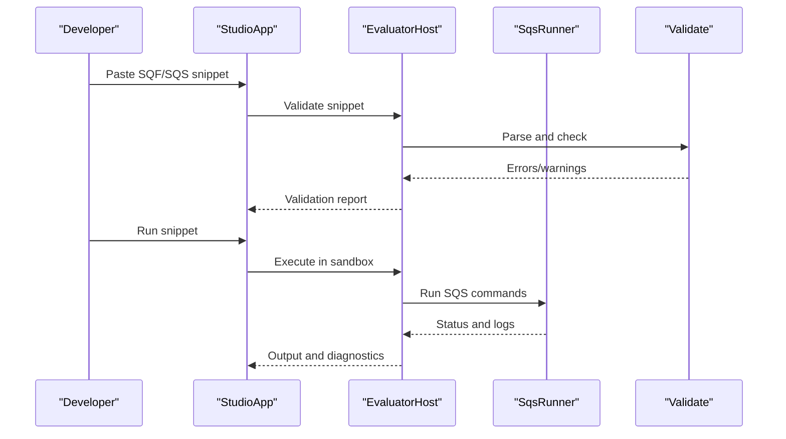

**Diagram sources**
- [EvaluatorHost.cpp](file://engine/Poseidon/Evaluator/EvaluatorHost.cpp)
- [SqsRunner.cpp](file://engine/Poseidon/Evaluator/SqsRunner.cpp)
- [Validate.cpp](file://engine/Poseidon/Evaluator/Validate.cpp)

**Section sources**
- [EvaluatorHost.cpp](file://engine/Poseidon/Evaluator/EvaluatorHost.cpp)
- [SqsRunner.cpp](file://engine/Poseidon/Evaluator/SqsRunner.cpp)
- [Validate.cpp](file://engine/Poseidon/Evaluator/Validate.cpp)

### Preview Rendering System
- Backend abstraction: Factory selects OpenGL or WGPU based on configuration.
- Frame loop: Updates scene, processes input, and renders frames.
- Debug overlays: Bounding boxes, draw calls, and FPS counters.

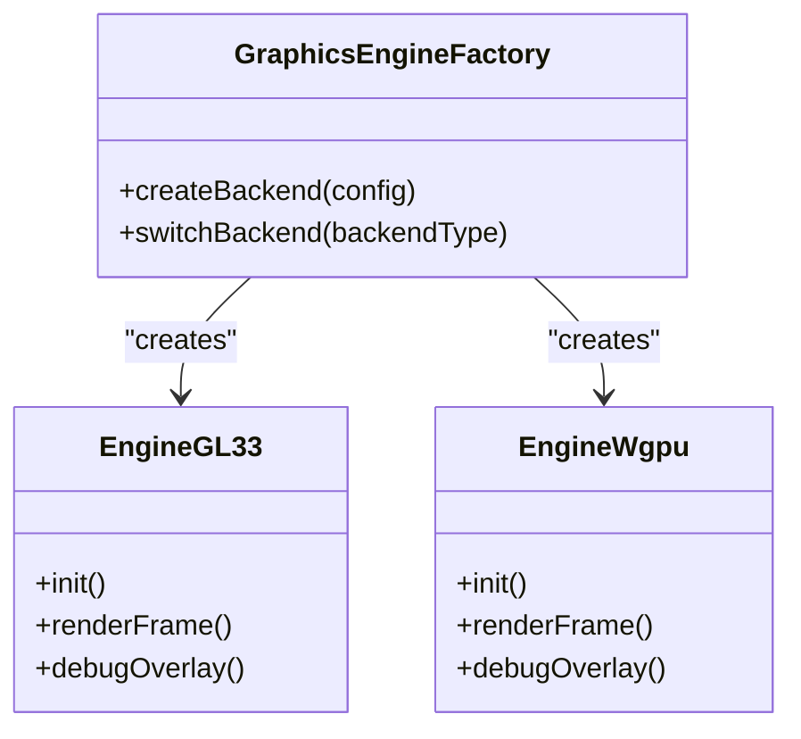

**Diagram sources**
- [GraphicsEngineFactory.cpp](file://engine/Poseidon/Graphics/GraphicsEngineFactory.cpp)
- [EngineGL33.cpp](file://engine/Poseidon/PoseidonGL33/EngineGL33.cpp)
- [EngineWgpu.cpp](file://engine/Poseidon/WgpuRenderer/EngineWgpu.cpp)

**Section sources**
- [GraphicsEngineFactory.cpp](file://engine/Poseidon/Graphics/GraphicsEngineFactory.cpp)
- [EngineGL33.cpp](file://engine/Poseidon/PoseidonGL33/EngineGL33.cpp)
- [EngineWgpu.cpp](file://engine/Poseidon/WgpuRenderer/EngineWgpu.cpp)

### Performance Profiling and Debugging
- Metrics collection: Frame times, memory usage, and GPU/CPU hotspots.
- Logging: Structured logs for editor actions, script execution, and errors.
- Diagnostic tools: In-editor overlays and exportable profiles.

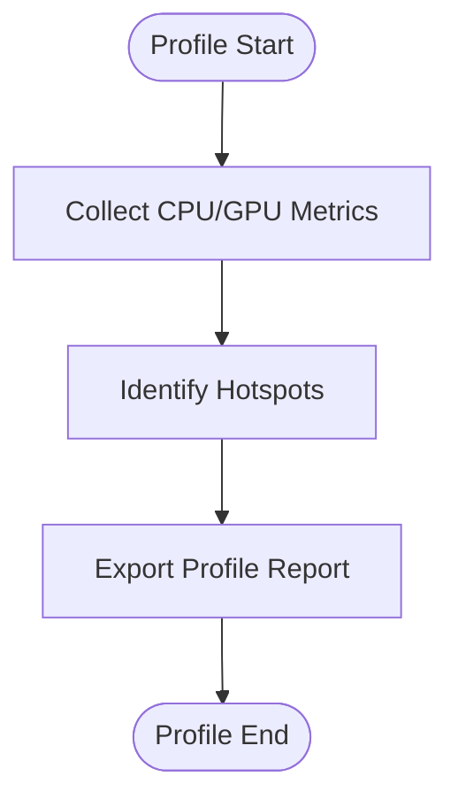

**Diagram sources**
- [Profile.cpp](file://engine/Poseidon/Core/Profile/Profile.cpp)

**Section sources**
- [Profile.cpp](file://engine/Poseidon/Core/Profile/Profile.cpp)

### Workflow: Templates, Imports, and Dependencies
- Templates: Predefined mission structures with default entities, lighting, and scripts.
- Asset import: Import external models, textures, and audio into the project.
- Dependency management: Resolve mods and external resources automatically.

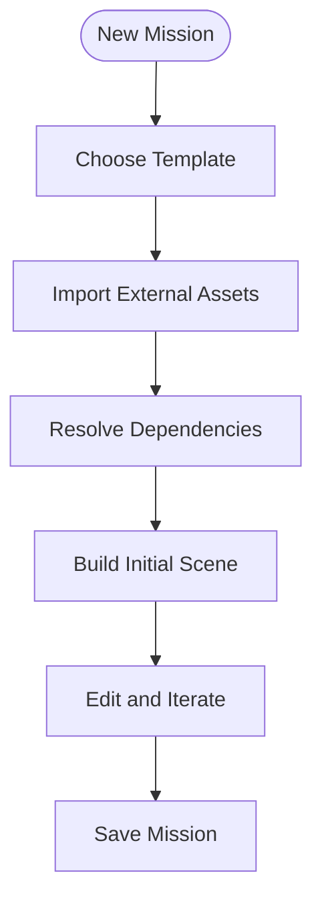

**Diagram sources**
- [ModSystem.cpp](file://engine/Poseidon/Core/ModSystem.cpp)
- [ModCollection.cpp](file://engine/Poseidon/Core/ModCollection.cpp)

**Section sources**
- [ModSystem.cpp](file://engine/Poseidon/Core/ModSystem.cpp)
- [ModCollection.cpp](file://engine/Poseidon/Core/ModCollection.cpp)

### Save/Load Operations and Version Control
- Save formats: Serialized mission data with versioning and compatibility checks.
- Load pipeline: Validates structure, resolves references, and initializes state.
- Version control: Integrates with Git or other VCS for tracking changes and collaboration.

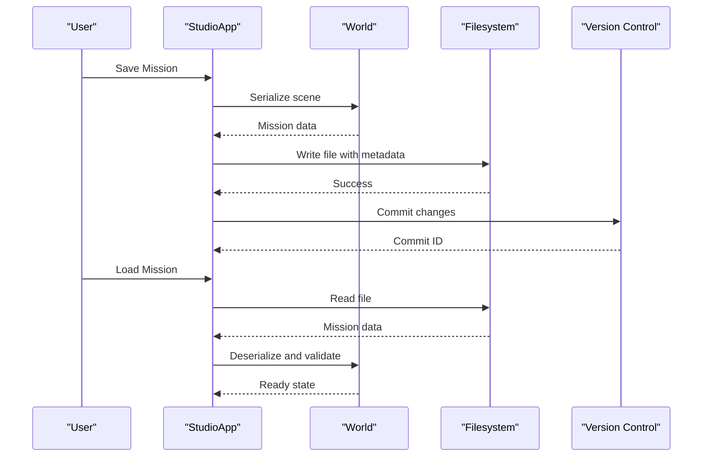

**Diagram sources**
- [SaveVersion.hpp](file://engine/Poseidon/Core/SaveVersion.hpp)

**Section sources**
- [SaveVersion.hpp](file://engine/Poseidon/Core/SaveVersion.hpp)

### Collaborative Editing
- Mission transfer: Share mission files and assets across team members.
- Conflict resolution: Merge strategies for overlapping edits.
- Real-time sync: Optional live synchronization for co-editing sessions.

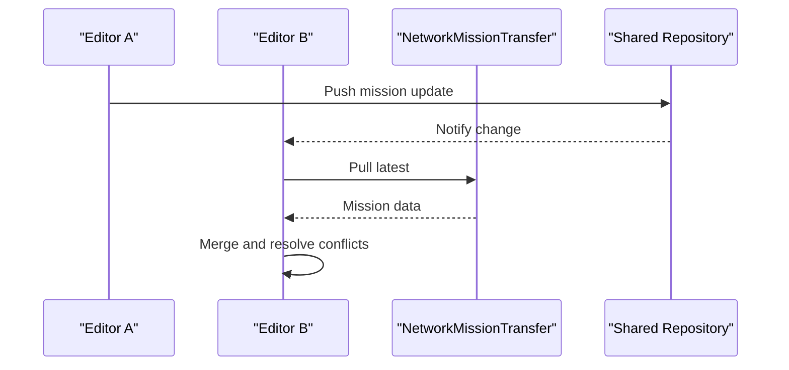

**Diagram sources**
- [NetworkMissionTransfer.cpp](file://engine/Poseidon/Network/NetworkMissionTransfer.cpp)

**Section sources**
- [NetworkMissionTransfer.cpp](file://engine/Poseidon/Network/NetworkMissionTransfer.cpp)

## Dependency Analysis
The Studio application depends on several engine modules:
- Evaluator for scripting
- World and Editor for scene manipulation
- Graphics backends for rendering
- Mod system for dependencies
- Network utilities for collaboration
- Profiling for performance insights

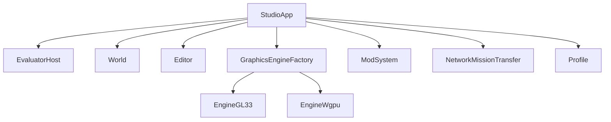

**Diagram sources**
- [StudioApp.cpp](file://apps/tools/Studio/StudioApp.cpp)
- [EvaluatorHost.cpp](file://engine/Poseidon/Evaluator/EvaluatorHost.cpp)
- [World.cpp](file://engine/Poseidon/World/World.cpp)
- [Editor.cpp](file://engine/Poseidon/Game/Editor.cpp)
- [GraphicsEngineFactory.cpp](file://engine/Poseidon/Graphics/GraphicsEngineFactory.cpp)
- [EngineGL33.cpp](file://engine/Poseidon/PoseidonGL33/EngineGL33.cpp)
- [EngineWgpu.cpp](file://engine/Poseidon/WgpuRenderer/EngineWgpu.cpp)
- [ModSystem.cpp](file://engine/Poseidon/Core/ModSystem.cpp)
- [NetworkMissionTransfer.cpp](file://engine/Poseidon/Network/NetworkMissionTransfer.cpp)
- [Profile.cpp](file://engine/Poseidon/Core/Profile/Profile.cpp)

**Section sources**
- [StudioApp.cpp](file://apps/tools/Studio/StudioApp.cpp)
- [EvaluatorHost.cpp](file://engine/Poseidon/Evaluator/EvaluatorHost.cpp)
- [World.cpp](file://engine/Poseidon/World/World.cpp)
- [Editor.cpp](file://engine/Poseidon/Game/Editor.cpp)
- [GraphicsEngineFactory.cpp](file://engine/Poseidon/Graphics/GraphicsEngineFactory.cpp)
- [EngineGL33.cpp](file://engine/Poseidon/PoseidonGL33/EngineGL33.cpp)
- [EngineWgpu.cpp](file://engine/Poseidon/WgpuRenderer/EngineWgpu.cpp)
- [ModSystem.cpp](file://engine/Poseidon/Core/ModSystem.cpp)
- [NetworkMissionTransfer.cpp](file://engine/Poseidon/Network/NetworkMissionTransfer.cpp)
- [Profile.cpp](file://engine/Poseidon/Core/Profile/Profile.cpp)

## Performance Considerations
- Optimize entity counts and LOD levels for large scenes.
- Use efficient texture atlases and compress assets.
- Profile frequently to identify bottlenecks in CPU/GPU usage.
- Stream terrain and assets to reduce memory pressure.
- Minimize script overhead by batching operations and avoiding frequent evaluations.

[No sources needed since this section provides general guidance]

## Troubleshooting Guide
- Script errors: Use validation reports and logs to diagnose syntax and runtime issues.
- Rendering artifacts: Check shader compilation and light configurations.
- Missing assets: Verify mod dependencies and asset paths.
- Save/load failures: Inspect version compatibility and serialized data integrity.

**Section sources**
- [Validate.cpp](file://engine/Poseidon/Evaluator/Validate.cpp)
- [EngineGL33.cpp](file://engine/Poseidon/PoseidonGL33/EngineGL33.cpp)
- [EngineWgpu.cpp](file://engine/Poseidon/WgpuRenderer/EngineWgpu.cpp)
- [SaveVersion.hpp](file://engine/Poseidon/Core/SaveVersion.hpp)

## Conclusion
The Studio application provides a robust mission editing environment integrated with the Poseidon engine. It supports comprehensive object placement, terrain editing, lighting configuration, scripting validation and execution, preview rendering, profiling, and collaborative workflows. By following best practices and leveraging the provided tools, developers can efficiently create and optimize missions of any scale.

[No sources needed since this section summarizes without analyzing specific files]

## Appendices
- Best practices for mission structure: Organize entities logically, use templates, and maintain clear naming conventions.
- Optimization techniques: Reduce draw calls, utilize instancing, and profile regularly.
- Common editing scenarios: Quick prototyping, iterative refinement, and large-scale deployment.

[No sources needed since this section provides general guidance]