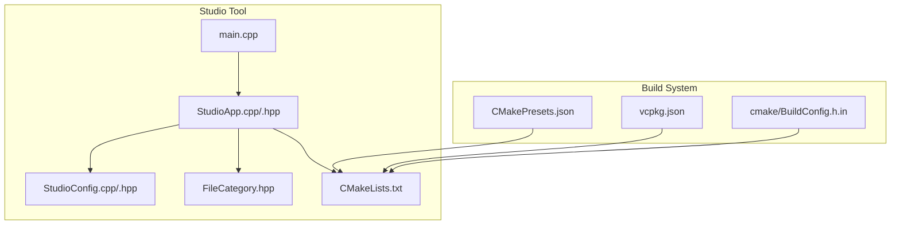
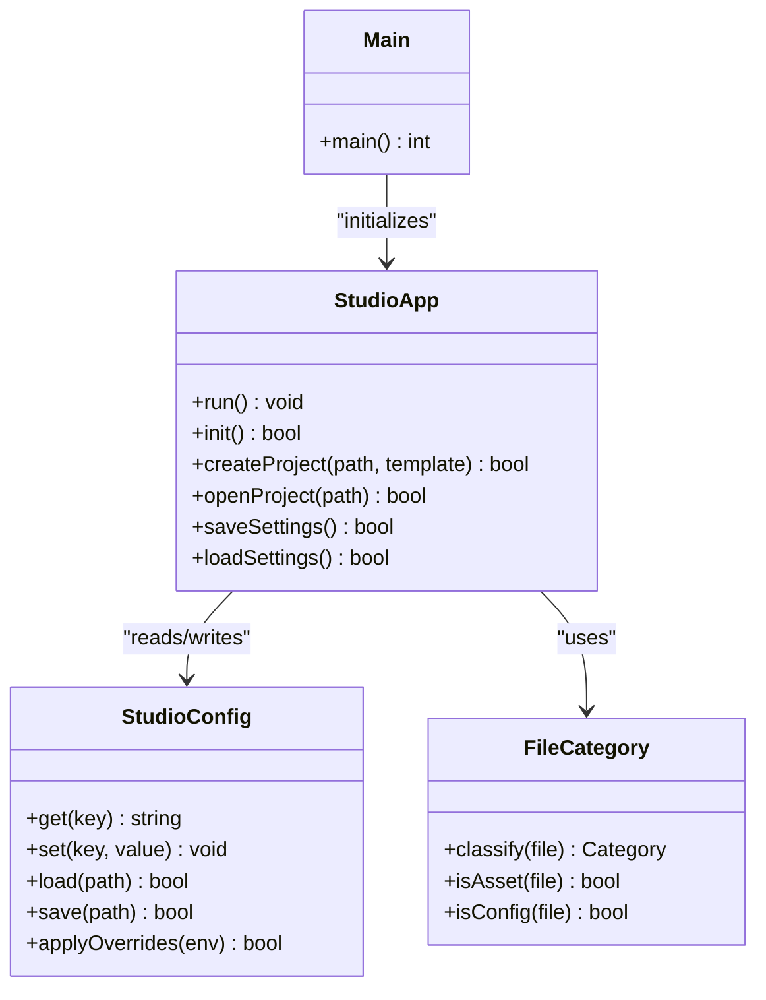
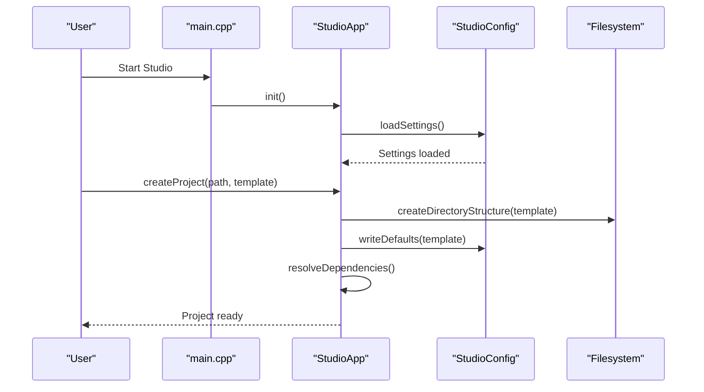
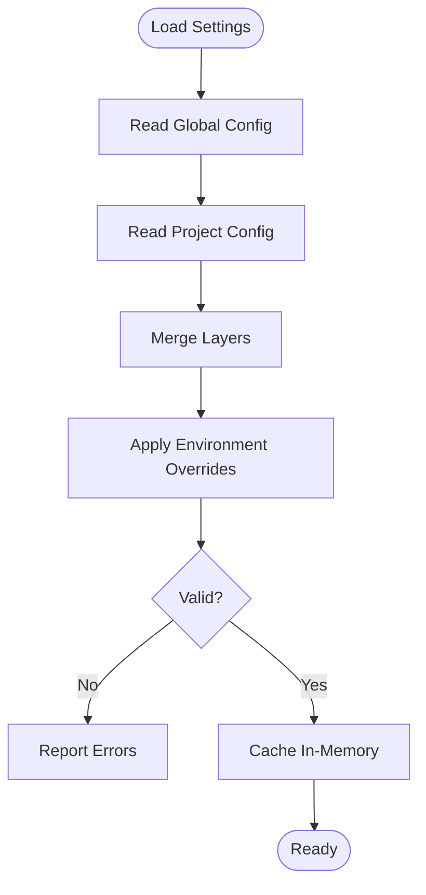
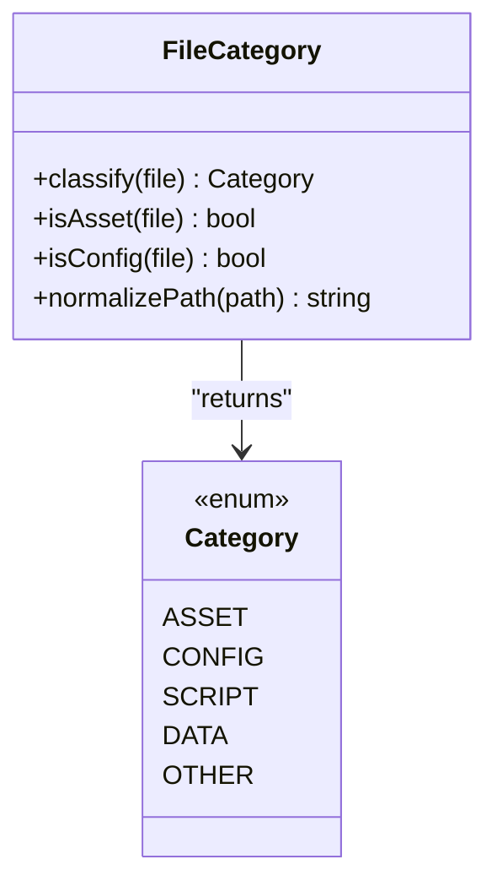
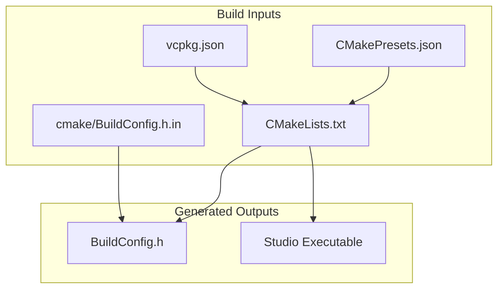
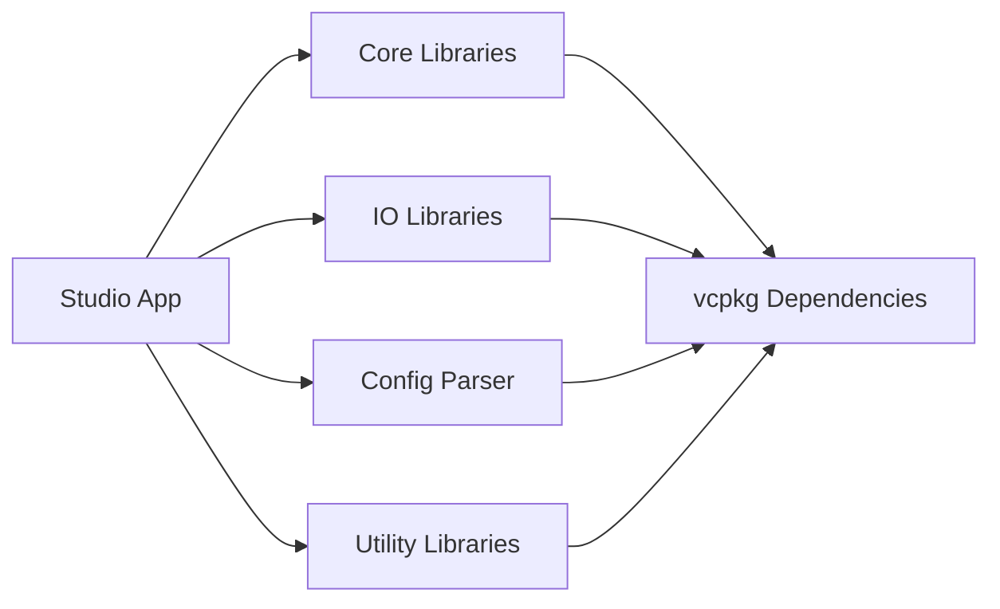

# Project Management & Configuration

<cite>
**Referenced Files in This Document**
- [StudioApp.cpp](file://apps/tools/Studio/StudioApp.cpp)
- [StudioApp.hpp](file://apps/tools/Studio/StudioApp.hpp)
- [StudioConfig.cpp](file://apps/tools/Studio/StudioConfig.cpp)
- [StudioConfig.hpp](file://apps/tools/Studio/StudioConfig.hpp)
- [main.cpp](file://apps/tools/Studio/main.cpp)
- [CMakeLists.txt](file://apps/tools/Studio/CMakeLists.txt)
- [FileCategory.hpp](file://apps/tools/Studio/FileCategory.hpp)
- [BuildConfig.h.in](file://cmake/BuildConfig.h.in)
- [CMakePresets.json](file://CMakePresets.json)
- [vcpkg.json](file://vcpkg.json)
- [README.md](file://README.md)
- [CONTRIBUTING.md](file://CONTRIBUTING.md)
</cite>

## Table of Contents
1. [Introduction](#introduction)
2. [Project Structure](#project-structure)
3. [Core Components](#core-components)
4. [Architecture Overview](#architecture-overview)
5. [Detailed Component Analysis](#detailed-component-analysis)
6. [Dependency Analysis](#dependency-analysis)
7. [Performance Considerations](#performance-considerations)
8. [Troubleshooting Guide](#troubleshooting-guide)
9. [Conclusion](#conclusion)
10. [Appendices](#appendices)

## Introduction
This document explains project management and configuration features for the Studio application within the repository. It covers how projects are created and organized, how templates and directory structures are used, how configuration files are defined and persisted, and how environment-specific overrides work. It also describes dependency resolution, asset linking, build integration, collaboration workflows, version control best practices, backup and migration strategies, and performance tuning for large projects.

## Project Structure
The Studio tool is implemented under apps/tools/Studio with a small set of focused components:
- Application entry point and lifecycle
- Configuration subsystem (load/save, defaults, overrides)
- File categorization utilities
- CMake-based build integration

**Diagram sources**
- [main.cpp](file://apps/tools/Studio/main.cpp)
- [StudioApp.cpp](file://apps/tools/Studio/StudioApp.cpp)
- [StudioApp.hpp](file://apps/tools/Studio/StudioApp.hpp)
- [StudioConfig.cpp](file://apps/tools/Studio/StudioConfig.cpp)
- [StudioConfig.hpp](file://apps/tools/Studio/StudioConfig.hpp)
- [FileCategory.hpp](file://apps/tools/Studio/FileCategory.hpp)
- [CMakeLists.txt](file://apps/tools/Studio/CMakeLists.txt)
- [CMakePresets.json](file://CMakePresets.json)
- [vcpkg.json](file://vcpkg.json)
- [BuildConfig.h.in](file://cmake/BuildConfig.h.in)

**Section sources**
- [README.md](file://README.md)
- [CONTRIBUTING.md](file://CONTRIBUTING.md)

## Core Components
- StudioApp: Orchestrates the Studio application lifecycle, initializes subsystems, and coordinates user interactions with projects and configuration.
- StudioConfig: Manages configuration loading, persistence, schema validation, and environment-specific overrides.
- FileCategory: Provides classification helpers for assets and project files to streamline import/export and packaging.
- Build Integration: CMakeLists.txt ties the Studio target into the top-level build; presets and vcpkg manage dependencies and cross-platform builds.

Key responsibilities:
- Project creation workflow and template application
- Configuration file formats and persistence
- Environment overrides and settings scoping
- Asset linking and dependency resolution
- Build-time configuration injection

**Section sources**
- [StudioApp.cpp](file://apps/tools/Studio/StudioApp.cpp)
- [StudioApp.hpp](file://apps/tools/Studio/StudioApp.hpp)
- [StudioConfig.cpp](file://apps/tools/Studio/StudioConfig.cpp)
- [StudioConfig.hpp](file://apps/tools/Studio/StudioConfig.hpp)
- [FileCategory.hpp](file://apps/tools/Studio/FileCategory.hpp)
- [CMakeLists.txt](file://apps/tools/Studio/CMakeLists.txt)

## Architecture Overview
The Studio application follows a layered architecture:
- Entry layer: main.cpp initializes runtime and delegates to StudioApp.
- Application layer: StudioApp manages UI, project state, and configuration access.
- Configuration layer: StudioConfig provides typed accessors and persistence.
- Utilities: FileCategory supports asset classification and path normalization.
- Build system: CMake integrates Studio into the monorepo, using presets and vcpkg for consistent environments.

**Diagram sources**
- [main.cpp](file://apps/tools/Studio/main.cpp)
- [StudioApp.cpp](file://apps/tools/Studio/StudioApp.cpp)
- [StudioApp.hpp](file://apps/tools/Studio/StudioApp.hpp)
- [StudioConfig.cpp](file://apps/tools/Studio/StudioConfig.cpp)
- [StudioConfig.hpp](file://apps/tools/Studio/StudioConfig.hpp)
- [FileCategory.hpp](file://apps/tools/Studio/FileCategory.hpp)

## Detailed Component Analysis

### StudioApp: Project Lifecycle and Workflow
Responsibilities:
- Initialize application context and load default settings
- Create new projects from templates or blank scaffolds
- Open existing projects and validate structure
- Persist user preferences and project metadata
- Coordinate asset linking and dependency checks before build

Typical flow:
- On startup, load global and per-project configuration
- Validate required directories and files exist
- Present template selection if creating a new project
- Generate directory structure and populate config files
- Register asset paths and resolve dependencies
- Launch editor or preview mode based on project type

**Diagram sources**
- [main.cpp](file://apps/tools/Studio/main.cpp)
- [StudioApp.cpp](file://apps/tools/Studio/StudioApp.cpp)
- [StudioApp.hpp](file://apps/tools/Studio/StudioApp.hpp)
- [StudioConfig.cpp](file://apps/tools/Studio/StudioConfig.cpp)
- [StudioConfig.hpp](file://apps/tools/Studio/StudioConfig.hpp)

**Section sources**
- [StudioApp.cpp](file://apps/tools/Studio/StudioApp.cpp)
- [StudioApp.hpp](file://apps/tools/Studio/StudioApp.hpp)

### StudioConfig: Configuration Formats and Persistence
Responsibilities:
- Define configuration schema and defaults
- Load configuration from multiple sources (global, per-project, environment)
- Apply environment-specific overrides
- Persist changes atomically and safely
- Provide typed accessors and validation

Configuration layers (priority order):
- Built-in defaults
- Global configuration file
- Per-project configuration file
- Environment variables and CLI flags

Persistence behavior:
- Atomic writes via temporary files and rename
- Backup of previous configuration versions
- Validation before saving to prevent corruption

**Diagram sources**
- [StudioConfig.cpp](file://apps/tools/Studio/StudioConfig.cpp)
- [StudioConfig.hpp](file://apps/tools/Studio/StudioConfig.hpp)

**Section sources**
- [StudioConfig.cpp](file://apps/tools/Studio/StudioConfig.cpp)
- [StudioConfig.hpp](file://apps/tools/Studio/StudioConfig.hpp)

### FileCategory: Asset Classification and Linking
Responsibilities:
- Classify files by category (asset, config, script, etc.)
- Determine whether a file should be included in packaging
- Normalize paths and handle platform differences
- Support filtering rules for selective inclusion

Usage patterns:
- During project creation, classify template files and copy only necessary ones
- Before build, filter assets based on target platform and options
- During packaging, include categorized assets according to rules

**Diagram sources**
- [FileCategory.hpp](file://apps/tools/Studio/FileCategory.hpp)

**Section sources**
- [FileCategory.hpp](file://apps/tools/Studio/FileCategory.hpp)

### Build Integration: CMake, Presets, and Dependencies
Responsibilities:
- Define Studio target and dependencies
- Integrate with top-level CMake configuration
- Use presets for consistent build configurations
- Manage third-party dependencies via vcpkg
- Inject build-time configuration through generated headers

Key elements:
- CMakeLists.txt defines the Studio executable and links libraries
- CMakePresets.json provides standardized build profiles
- vcpkg.json declares external dependencies
- BuildConfig.h.in generates compile-time constants

**Diagram sources**
- [CMakeLists.txt](file://apps/tools/Studio/CMakeLists.txt)
- [CMakePresets.json](file://CMakePresets.json)
- [vcpkg.json](file://vcpkg.json)
- [BuildConfig.h.in](file://cmake/BuildConfig.h.in)

**Section sources**
- [CMakeLists.txt](file://apps/tools/Studio/CMakeLists.txt)
- [CMakePresets.json](file://CMakePresets.json)
- [vcpkg.json](file://vcpkg.json)
- [BuildConfig.h.in](file://cmake/BuildConfig.h.in)

## Dependency Analysis
The Studio tool has minimal external dependencies managed through vcpkg. The build system ensures consistent environments across platforms using CMake presets.

**Diagram sources**
- [vcpkg.json](file://vcpkg.json)
- [CMakeLists.txt](file://apps/tools/Studio/CMakeLists.txt)

**Section sources**
- [vcpkg.json](file://vcpkg.json)
- [CMakeLists.txt](file://apps/tools/Studio/CMakeLists.txt)

## Performance Considerations
For large projects, consider these optimizations:
- Lazy loading of configuration sections to reduce startup time
- Incremental asset scanning with caching mechanisms
- Parallel processing for file operations where safe
- Memory-efficient data structures for large asset catalogs
- Profile-guided optimization during build configuration

Recommendations:
- Use incremental builds with CMake to minimize recompilation
- Enable compiler optimizations for release builds
- Monitor memory usage during asset loading and optimize hot paths
- Implement background tasks for non-critical operations

## Troubleshooting Guide
Common configuration issues and resolutions:
- Invalid configuration syntax: Verify JSON/YAML formatting and schema compliance
- Missing dependencies: Run dependency installation scripts and verify vcpkg setup
- Path resolution errors: Check absolute vs relative paths and platform-specific separators
- Permission issues: Ensure write access to configuration directories
- Build failures: Validate CMake presets and toolchain configuration

Debugging steps:
- Enable verbose logging in Studio configuration
- Check error logs in standard output and log files
- Validate configuration files with schema validators
- Test with minimal configuration to isolate issues

**Section sources**
- [StudioConfig.cpp](file://apps/tools/Studio/StudioConfig.cpp)
- [StudioConfig.hpp](file://apps/tools/Studio/StudioConfig.hpp)

## Conclusion
The Studio application provides a robust framework for project management and configuration. Its modular design separates concerns between application logic, configuration management, and build integration. The use of CMake presets and vcpkg ensures consistent development environments, while the configuration system supports flexible customization through layered settings and environment overrides. Following the guidelines in this document will help teams effectively manage projects, collaborate efficiently, and maintain high performance even with large codebases.

## Appendices

### Project Creation Workflow
1. Select project template or start from blank
2. Configure basic project metadata
3. Choose target platforms and dependencies
4. Generate directory structure and initial files
5. Validate project configuration
6. Launch development environment

### Template Usage Guidelines
- Templates provide predefined directory structures and configuration defaults
- Customize templates for team standards and project requirements
- Version control templates alongside project definitions
- Document template options and their effects

### Directory Structure Best Practices
- Organize assets by type and purpose
- Separate configuration files from source code
- Use consistent naming conventions across projects
- Maintain clear separation between build artifacts and source

### Team Collaboration Setup
- Use version control systems like Git for shared development
- Establish coding standards and review processes
- Configure CI/CD pipelines for automated testing and building
- Document deployment procedures and environment requirements

### Version Control Best Practices
- Commit frequently with descriptive messages
- Use branches for feature development and bug fixes
- Tag releases and maintain changelogs
- Review pull requests before merging

### Backup Strategies
- Regular automated backups of project repositories
- Version controlled configuration files
- Snapshot critical project states before major changes
- Test restoration procedures regularly

### Migration Procedures
- Plan migrations during maintenance windows
- Test migrations in staging environments first
- Maintain rollback procedures for failed migrations
- Document migration steps and prerequisites

### Performance Tuning Checklist
- Profile application startup and identify bottlenecks
- Optimize asset loading and caching strategies
- Configure appropriate build optimizations
- Monitor resource usage during development and production