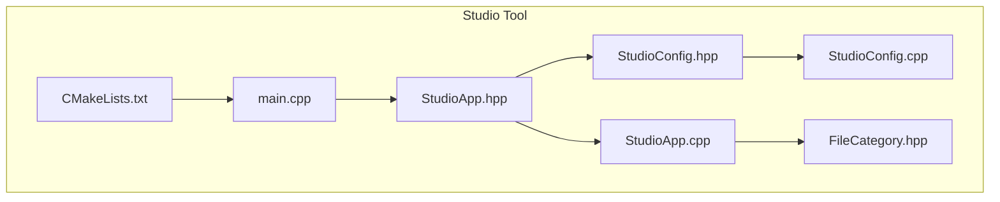
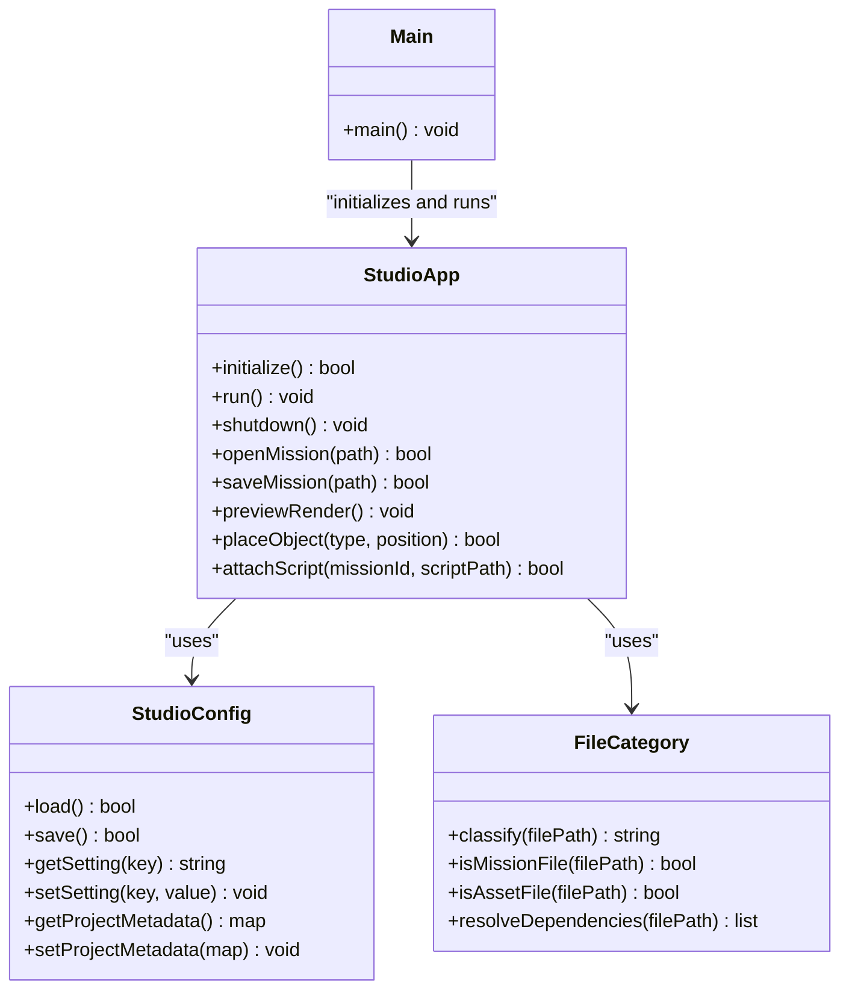
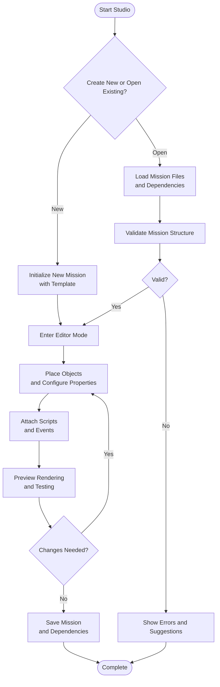
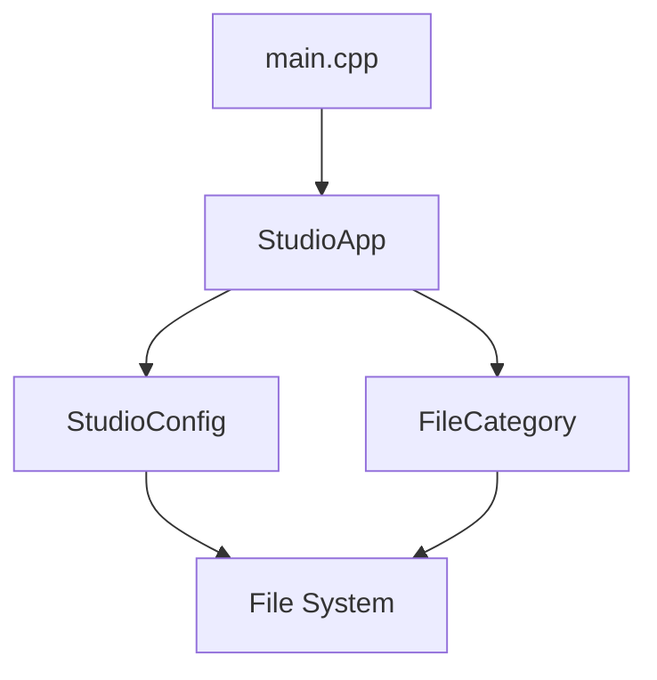

# Studio Application

<cite>
**Referenced Files in This Document**
- [StudioApp.cpp](file://apps/tools/Studio/StudioApp.cpp)
- [StudioApp.hpp](file://apps/tools/Studio/StudioApp.hpp)
- [StudioConfig.cpp](file://apps/tools/Studio/StudioConfig.cpp)
- [StudioConfig.hpp](file://apps/tools/Studio/StudioConfig.hpp)
- [main.cpp](file://apps/tools/Studio/main.cpp)
- [CMakeLists.txt](file://apps/tools/Studio/CMakeLists.txt)
- [FileCategory.hpp](file://apps/tools/Studio/FileCategory.hpp)
</cite>

## Table of Contents
1. [Introduction](#introduction)
2. [Project Structure](#project-structure)
3. [Core Components](#core-components)
4. [Architecture Overview](#architecture-overview)
5. [Detailed Component Analysis](#detailed-component-analysis)
6. [Dependency Analysis](#dependency-analysis)
7. [Performance Considerations](#performance-considerations)
8. [Troubleshooting Guide](#troubleshooting-guide)
9. [Conclusion](#conclusion)
10. [Appendices](#appendices)

## Introduction
This document provides comprehensive documentation for the Studio application used for mission editing and content creation within the project. It explains the user interface layout, project management features, file organization, mission editing capabilities (object placement, scripting integration, preview rendering), configuration management, asset browsing, dependency resolution, workflows for creating and editing missions, testing changes, keyboard shortcuts, context menus, productivity features, project templates, collaboration features, version control integration, troubleshooting guidance, and performance optimization strategies for large projects.

## Project Structure
The Studio tool is implemented under apps/tools/Studio with a focused set of files that define the application entry point, core application lifecycle, configuration handling, and file categorization utilities. The build system is configured via CMake to produce the Studio executable.

**Diagram sources**
- [main.cpp](file://apps/tools/Studio/main.cpp)
- [StudioApp.hpp](file://apps/tools/Studio/StudioApp.hpp)
- [StudioApp.cpp](file://apps/tools/Studio/StudioApp.cpp)
- [StudioConfig.hpp](file://apps/tools/Studio/StudioConfig.hpp)
- [StudioConfig.cpp](file://apps/tools/Studio/StudioConfig.cpp)
- [FileCategory.hpp](file://apps/tools/Studio/FileCategory.hpp)
- [CMakeLists.txt](file://apps/tools/Studio/CMakeLists.txt)

**Section sources**
- [CMakeLists.txt](file://apps/tools/Studio/CMakeLists.txt)
- [main.cpp](file://apps/tools/Studio/main.cpp)
- [StudioApp.hpp](file://apps/tools/Studio/StudioApp.hpp)
- [StudioApp.cpp](file://apps/tools/Studio/StudioApp.cpp)
- [StudioConfig.hpp](file://apps/tools/Studio/StudioConfig.hpp)
- [StudioConfig.cpp](file://apps/tools/Studio/StudioConfig.cpp)
- [FileCategory.hpp](file://apps/tools/Studio/FileCategory.hpp)

## Core Components
- Application Entry Point: Initializes the runtime environment and starts the Studio application loop.
- Studio Application: Manages UI lifecycle, editor state, and integrates with engine subsystems for mission editing and preview rendering.
- Configuration Manager: Loads, validates, and persists Studio settings and project metadata.
- File Category Utilities: Classifies mission-related files and assets to support browsing and dependency resolution.

Key responsibilities:
- Provide a consistent UI framework for mission editing.
- Coordinate asset loading and dependency resolution.
- Persist user preferences and project configurations.
- Expose APIs for object placement, scripting integration, and preview rendering.

**Section sources**
- [main.cpp](file://apps/tools/Studio/main.cpp)
- [StudioApp.hpp](file://apps/tools/Studio/StudioApp.hpp)
- [StudioApp.cpp](file://apps/tools/Studio/StudioApp.cpp)
- [StudioConfig.hpp](file://apps/tools/Studio/StudioConfig.hpp)
- [StudioConfig.cpp](file://apps/tools/Studio/StudioConfig.cpp)
- [FileCategory.hpp](file://apps/tools/Studio/FileCategory.hpp)

## Architecture Overview
The Studio application follows a modular architecture where the entry point initializes the application, which then delegates UI and editor tasks to the StudioApp component. Configuration is managed by StudioConfig, while FileCategory supports asset classification and dependency resolution. The application integrates with engine subsystems for mission editing, scripting, and rendering.

**Diagram sources**
- [main.cpp](file://apps/tools/Studio/main.cpp)
- [StudioApp.hpp](file://apps/tools/Studio/StudioApp.hpp)
- [StudioApp.cpp](file://apps/tools/Studio/StudioApp.cpp)
- [StudioConfig.hpp](file://apps/tools/Studio/StudioConfig.hpp)
- [StudioConfig.cpp](file://apps/tools/Studio/StudioConfig.cpp)
- [FileCategory.hpp](file://apps/tools/Studio/FileCategory.hpp)

## Detailed Component Analysis

### Application Entry Point
The entry point sets up the runtime environment and launches the Studio application. It handles command-line arguments, initializes logging, and ensures proper resource cleanup on exit.

Responsibilities:
- Parse CLI options for mission paths and configuration overrides.
- Initialize global subsystems required by the editor.
- Start the main event loop and handle shutdown gracefully.

**Section sources**
- [main.cpp](file://apps/tools/Studio/main.cpp)

### Studio Application
The StudioApp component encapsulates the editor’s core functionality, including mission lifecycle management, UI orchestration, and integration with engine services.

Key capabilities:
- Mission open/save operations with validation and backup.
- Object placement API supporting positioning, rotation, and scaling.
- Scripting integration allowing attachment of scripts to missions or objects.
- Preview rendering pipeline for real-time feedback during editing.

Error handling:
- Validates mission file formats and dependencies before opening.
- Provides rollback mechanisms on failed save operations.
- Logs detailed errors for debugging and recovery.

**Section sources**
- [StudioApp.hpp](file://apps/tools/Studio/StudioApp.hpp)
- [StudioApp.cpp](file://apps/tools/Studio/StudioApp.cpp)

### Configuration Management
StudioConfig manages persistent settings and project metadata. It supports loading from multiple sources (default, user-specific, project-local) and merging them with precedence rules.

Features:
- Key-value settings with type safety and validation.
- Project metadata storage including author, version, and dependencies.
- Export/import functionality for sharing configurations.

Validation:
- Ensures required settings are present and valid.
- Warns about deprecated keys and suggests updates.

**Section sources**
- [StudioConfig.hpp](file://apps/tools/Studio/StudioConfig.hpp)
- [StudioConfig.cpp](file://apps/tools/Studio/StudioConfig.cpp)

### File Category Utilities
FileCategory provides utilities for classifying mission-related files and assets. It supports identifying mission files, asset types, and resolving dependencies between files.

Functions:
- Classify files into categories (mission, texture, model, script).
- Detect mission structure and validate required components.
- Resolve dependencies to ensure all referenced assets are available.

Integration:
- Used by StudioApp during mission load to verify completeness.
- Supports asset browser filtering and search.

**Section sources**
- [FileCategory.hpp](file://apps/tools/Studio/FileCategory.hpp)

### Mission Editing Workflow
The mission editing workflow encompasses creating new missions, editing existing content, and testing changes.

**Diagram sources**
- [StudioApp.cpp](file://apps/tools/Studio/StudioApp.cpp)
- [FileCategory.hpp](file://apps/tools/Studio/FileCategory.hpp)

**Section sources**
- [StudioApp.cpp](file://apps/tools/Studio/StudioApp.cpp)
- [FileCategory.hpp](file://apps/tools/Studio/FileCategory.hpp)

### User Interface Layout
The Studio UI consists of several key panels:
- Viewport: 3D viewport for mission editing and preview rendering.
- Scene Tree: Hierarchical view of mission objects and their properties.
- Asset Browser: Panel for browsing and inserting assets into missions.
- Inspector: Context-sensitive panel for editing selected object properties.
- Script Editor: Integrated editor for mission and object scripts.
- Timeline: Optional timeline for animation and event sequencing.

Productivity features:
- Keyboard shortcuts for common actions (placement, selection, navigation).
- Context menus for quick access to relevant commands.
- Undo/redo stack for safe experimentation.
- Multi-window support for extended workflows.

**Section sources**
- [StudioApp.hpp](file://apps/tools/Studio/StudioApp.hpp)
- [StudioApp.cpp](file://apps/tools/Studio/StudioApp.cpp)

### Scripting Integration
Studio supports scripting through an integrated scripting language. Scripts can be attached to missions or individual objects to define behavior, events, and logic.

Capabilities:
- Real-time script evaluation during preview.
- Debugging tools for stepping through script execution.
- Syntax highlighting and error reporting in the script editor.
- Access to mission API for manipulating objects and game state.

Best practices:
- Organize scripts into logical modules.
- Use descriptive naming conventions.
- Implement error handling and logging.

**Section sources**
- [StudioApp.cpp](file://apps/tools/Studio/StudioApp.cpp)

### Asset Browsing and Dependency Resolution
The asset browser allows users to navigate and select assets for insertion into missions. Dependency resolution ensures all required assets are available and properly linked.

Features:
- Search and filter assets by type, name, or tags.
- Preview thumbnails for visual identification.
- Automatic dependency checking and resolution.
- Support for external asset libraries and mod directories.

Workflow:
- Browse assets in the Asset Browser panel.
- Drag and drop assets into the scene or property fields.
- System validates dependencies and reports missing assets.

**Section sources**
- [FileCategory.hpp](file://apps/tools/Studio/FileCategory.hpp)
- [StudioApp.cpp](file://apps/tools/Studio/StudioApp.cpp)

### Project Templates and Collaboration
Studio supports project templates for standardized mission structures and collaboration features for team development.

Templates:
- Predefined mission layouts for common scenarios.
- Customizable template definitions with default objects and scripts.
- Versioned templates for consistency across projects.

Collaboration:
- Git integration for version control and branching.
- Conflict resolution tools for merged changes.
- Shared asset libraries and centralized configuration.

**Section sources**
- [StudioConfig.hpp](file://apps/tools/Studio/StudioConfig.hpp)
- [StudioConfig.cpp](file://apps/tools/Studio/StudioConfig.cpp)

## Dependency Analysis
The Studio application has clear dependencies between its core components. The main entry point initializes StudioApp, which depends on StudioConfig for settings and FileCategory for file operations.

**Diagram sources**
- [main.cpp](file://apps/tools/Studio/main.cpp)
- [StudioApp.hpp](file://apps/tools/Studio/StudioApp.hpp)
- [StudioConfig.hpp](file://apps/tools/Studio/StudioConfig.hpp)
- [FileCategory.hpp](file://apps/tools/Studio/FileCategory.hpp)

**Section sources**
- [main.cpp](file://apps/tools/Studio/main.cpp)
- [StudioApp.hpp](file://apps/tools/Studio/StudioApp.hpp)
- [StudioConfig.hpp](file://apps/tools/Studio/StudioConfig.hpp)
- [FileCategory.hpp](file://apps/tools/Studio/FileCategory.hpp)

## Performance Considerations
For large projects with extensive missions and assets, consider the following optimizations:

- Lazy Loading: Load assets and dependencies on demand rather than upfront.
- Asset Caching: Cache frequently used assets in memory to reduce I/O overhead.
- Background Processing: Offload heavy operations like dependency resolution to background threads.
- Memory Management: Monitor memory usage and implement garbage collection for unused resources.
- Rendering Optimization: Use level-of-detail (LOD) systems and frustum culling for efficient rendering.
- Configuration Caching: Cache parsed configuration files to avoid repeated parsing.

Monitoring:
- Enable profiling tools to identify bottlenecks.
- Log performance metrics for critical operations.
- Set up automated tests for performance regression detection.

[No sources needed since this section provides general guidance]

## Troubleshooting Guide
Common issues and solutions:

UI Problems:
- Display not updating: Check viewport refresh settings and force a redraw.
- Missing textures: Verify asset paths and ensure dependencies are resolved.
- Script errors: Review script syntax and check console output for error messages.

Performance Issues:
- Slow mission load: Investigate large asset files and optimize loading strategy.
- High memory usage: Identify memory leaks and implement proper resource cleanup.
- Frame rate drops: Reduce scene complexity and enable performance profiling.

Configuration Problems:
- Settings not persisting: Check file permissions and configuration file format.
- Invalid configuration: Validate settings against schema and restore defaults if needed.

Debugging Tools:
- Use built-in debugger for script inspection and step-through execution.
- Enable verbose logging for detailed error information.
- Utilize crash dumps and stack traces for analyzing failures.

**Section sources**
- [StudioApp.cpp](file://apps/tools/Studio/StudioApp.cpp)
- [StudioConfig.cpp](file://apps/tools/Studio/StudioConfig.cpp)

## Conclusion
The Studio application provides a comprehensive suite of tools for mission editing and content creation. Its modular architecture supports extensibility and maintainability, while the rich feature set enables efficient workflow for both individual developers and teams. By following best practices for performance optimization and utilizing the troubleshooting guidance provided, users can effectively create and manage complex missions with confidence.

[No sources needed since this section summarizes without analyzing specific files]

## Appendices

### Keyboard Shortcuts Reference
- Navigation: WASD for camera movement, mouse drag for orbit, scroll for zoom.
- Selection: Left-click to select, Shift+click for multi-select, Ctrl+A for select all.
- Object Manipulation: G for grab/move, R for rotate, S for scale.
- Editing: F5 for play preview, Ctrl+S for save, Ctrl+Z for undo.
- Panels: Tab to toggle UI visibility, number keys to switch between panels.

### Context Menu Options
- Right-click on objects: Transform, duplicate, delete, properties.
- Right-click in viewport: Create object, place marker, add light.
- Right-click in asset browser: Insert, preview, copy path.
- Right-click in script editor: Run, debug, format code.

### File Organization Best Practices
- Separate mission files from assets using clear directory structure.
- Use descriptive naming conventions for objects and scripts.
- Maintain consistent folder hierarchy across projects.
- Utilize version control for tracking changes and collaboration.

[No sources needed since this section provides general guidance]