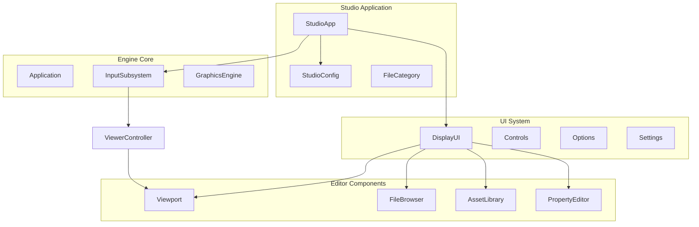
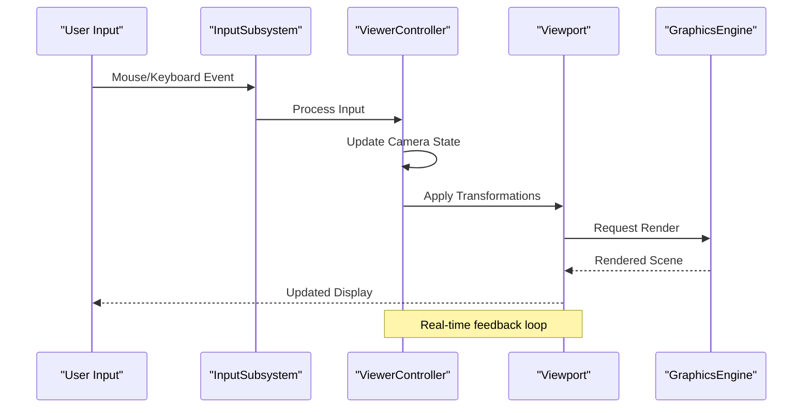
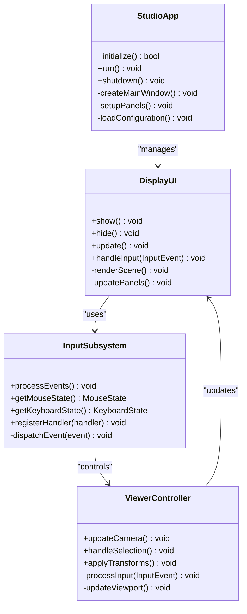

# Studio Interface & Navigation

<cite>
**Referenced Files in This Document**
- [StudioApp.cpp](file://apps/tools/Studio/StudioApp.cpp)
- [StudioApp.hpp](file://apps/tools/Studio/StudioApp.hpp)
- [StudioConfig.cpp](file://apps/tools/Studio/StudioConfig.cpp)
- [StudioConfig.hpp](file://apps/tools/Studio/StudioConfig.hpp)
- [DisplayUI.hpp](file://engine/Poseidon/UI/DisplayUI.hpp)
- [DisplayUICommon.hpp](file://engine/Poseidon/UI/DisplayUICommon.hpp)
- [InputSubsystem.hpp](file://engine/Poseidon/Input/InputSubsystem.hpp)
- [ViewerController.hpp](file://engine/Poseidon/Input/ViewerController.hpp)
- [ViewerControls.hpp](file://engine/Poseidon/Input/ViewerControls.hpp)
</cite>

## Table of Contents
1. [Introduction](#introduction)
2. [Project Structure](#project-structure)
3. [Core Components](#core-components)
4. [Architecture Overview](#architecture-overview)
5. [Detailed Component Analysis](#detailed-component-analysis)
6. [Dependency Analysis](#dependency-analysis)
7. [Performance Considerations](#performance-considerations)
8. [Troubleshooting Guide](#troubleshooting-guide)
9. [Conclusion](#conclusion)

## Introduction

The Studio application is a comprehensive 3D editing environment designed for content creation and scene manipulation within the Poseidon engine ecosystem. It provides an intuitive interface for artists and developers to build, edit, and visualize 3D scenes with professional-grade tools and workflows. The interface follows modern design principles while maintaining efficiency for complex editing tasks.

## Project Structure

The Studio application is organized into several key components that work together to provide a cohesive editing experience:

**Diagram sources**
- [StudioApp.hpp](file://apps/tools/Studio/StudioApp.hpp)
- [DisplayUI.hpp](file://engine/Poseidon/UI/DisplayUI.hpp)
- [InputSubsystem.hpp](file://engine/Poseidon/Input/InputSubsystem.hpp)

**Section sources**
- [StudioApp.cpp](file://apps/tools/Studio/StudioApp.cpp)
- [StudioApp.hpp](file://apps/tools/Studio/StudioApp.hpp)

## Core Components

### Main Window Architecture

The main window serves as the primary container for all Studio functionality, implementing a flexible layout system that supports docking panels and customizable arrangements.

#### Window Layout Structure
- **Menu Bar**: Top-level application commands and file operations
- **Toolbar**: Quick access to frequently used tools and functions
- **Viewport**: Central 3D viewing area with camera controls
- **Docking Panels**: Resizable and dockable interface elements
- **Status Bar**: Contextual information and tool status

#### Panel Management System
The panel management system supports:
- Dynamic panel creation and destruction
- Docking and undocking operations
- Layout persistence and restoration
- Multi-monitor support with panel distribution

**Section sources**
- [StudioApp.cpp](file://apps/tools/Studio/StudioApp.cpp)
- [DisplayUI.hpp](file://engine/Poseidon/UI/DisplayUI.hpp)

### Viewport Controls and Camera Manipulation

The viewport provides a 3D navigation interface with intuitive camera controls:

#### Mouse Gestures
- **Left Click + Drag**: Orbit camera around focus point
- **Right Click + Drag**: Pan camera horizontally/vertically
- **Scroll Wheel**: Zoom in/out
- **Middle Click + Drag**: Trackball rotation
- **Shift + Left Click**: Select objects in viewport

#### Keyboard Shortcuts
- **WASD**: Move camera forward/backward/left/right
- **Q/E**: Move camera up/down
- **R**: Reset camera to default position
- **F**: Frame selected object(s)
- **G**: Toggle grid visibility
- **H**: Hide/unhide selected objects
- **X/Y/Z**: Lock camera axis during orbit

#### Camera Modes
- **Orbit Mode**: Rotate around focus point
- **Fly Mode**: Free movement without constraints
- **Top/Bottom/Side Views**: Orthographic projections
- **Perspective/Orthographic Toggle**: Projection mode switching

**Section sources**
- [ViewerController.hpp](file://engine/Poseidon/Input/ViewerController.hpp)
- [ViewerControls.hpp](file://engine/Poseidon/Input/ViewerControls.hpp)

### Object Selection Mechanisms

The selection system supports multiple interaction paradigms:

#### Selection Methods
- **Click Selection**: Single object selection by clicking
- **Box Selection**: Multiple selection by dragging selection box
- **Lasso Selection**: Free-form selection outline
- **Layer-based Selection**: Select all objects in a layer
- **Type-based Selection**: Filter by object type

#### Selection Feedback
- Visual highlighting with color overlays
- Bounding box display for selected objects
- Selection count and hierarchy information
- Crosshair and cursor state changes

#### Selection Operations
- Transform selected objects (move, rotate, scale)
- Group/ungroup operations
- Copy/paste between selections
- Invert selection logic

**Section sources**
- [InputSubsystem.hpp](file://engine/Poseidon/Input/InputSubsystem.hpp)

## Architecture Overview

The Studio interface follows a modular architecture pattern that separates concerns between input handling, rendering, and UI management:

**Diagram sources**
- [InputSubsystem.hpp](file://engine/Poseidon/Input/InputSubsystem.hpp)
- [ViewerController.hpp](file://engine/Poseidon/Input/ViewerController.hpp)

### File Browser Interface

The file browser provides hierarchical navigation through the asset directory structure:

#### Features
- Tree view with expandable folders
- Thumbnail previews for supported formats
- Search and filter capabilities
- Drag-and-drop file operations
- Recent files list

#### Supported Formats
- 3D models (.p3d, .obj, .fbx)
- Textures (.tga, .png, .jpg)
- Audio files (.wav, .ogg)
- Configuration files (.cpp, .sqf)

### Asset Library

The asset library organizes reusable content for quick access:

#### Organization
- Category-based grouping
- Tag-based metadata system
- Favorites and bookmarks
- Import/export functionality

#### Preview System
- Real-time thumbnail generation
- Animated preview for 3D models
- Audio waveform visualization
- Video clip thumbnails

### Property Editor

The property editor displays and modifies object attributes:

#### Dynamic Property Display
- Context-sensitive property lists
- Type-specific editors (sliders, color pickers)
- Undo/redo support for property changes
- Batch property modification

#### Property Categories
- Transform properties (position, rotation, scale)
- Material properties (textures, colors, shaders)
- Animation properties (keyframes, curves)
- Custom user-defined properties

**Section sources**
- [DisplayUI.hpp](file://engine/Poseidon/UI/DisplayUI.hpp)
- [DisplayUICommon.hpp](file://engine/Poseidon/UI/DisplayUICommon.hpp)

## Detailed Component Analysis

### Workspace Customization System

The workspace customization allows users to tailor the interface to their workflow:

#### Layout Management
- Save/load custom layouts
- Per-project workspace configurations
- Default layout templates
- Layout validation and recovery

#### Panel Configuration
- Show/hide individual panels
- Resize and reposition panels
- Tabbed panel groups
- Floating panel windows

#### Theme Support
- Color scheme customization
- Icon set selection
- Font size and scaling options
- High DPI support

### Multi-Monitor Support

The Studio supports multi-monitor setups for enhanced productivity:

#### Monitor Detection
- Automatic monitor enumeration
- Resolution and refresh rate detection
- Primary monitor identification
- Virtual desktop support

#### Panel Distribution
- Assign specific panels to monitors
- Full-screen viewport on secondary monitor
- Menu bar on primary monitor only
- Status bar across all monitors

#### Window Management
- Cross-monitor drag and drop
- Window snapping and alignment
- Taskbar integration
- Alt-tab behavior control

### Accessibility Features

The interface includes comprehensive accessibility options:

#### Visual Accessibility
- High contrast themes
- Large text scaling
- Screen reader support
- Keyboard-only navigation

#### Motor Accessibility
- Customizable hotkeys
- Macro recording and playback
- Voice command integration
- Eye tracking support

#### Cognitive Accessibility
- Clear visual hierarchy
- Consistent interaction patterns
- Error prevention mechanisms
- Help system integration

**Section sources**
- [StudioConfig.cpp](file://apps/tools/Studio/StudioConfig.cpp)
- [StudioConfig.hpp](file://apps/tools/Studio/StudioConfig.hpp)

## Dependency Analysis

The Studio interface has well-defined dependencies that ensure modularity and maintainability:

**Diagram sources**
- [StudioApp.hpp](file://apps/tools/Studio/StudioApp.hpp)
- [DisplayUI.hpp](file://engine/Poseidon/UI/DisplayUI.hpp)
- [InputSubsystem.hpp](file://engine/Poseidon/Input/InputSubsystem.hpp)
- [ViewerController.hpp](file://engine/Poseidon/Input/ViewerController.hpp)

### Component Coupling Analysis

The interface components exhibit low coupling through well-defined interfaces:

- **InputSubsystem**: Abstracts hardware input details
- **DisplayUI**: Encapsulates rendering logic
- **ViewerController**: Manages camera and selection state
- **StudioApp**: Orchestrates application lifecycle

This separation allows for independent testing and replacement of components without affecting the entire system.

**Section sources**
- [StudioApp.cpp](file://apps/tools/Studio/StudioApp.cpp)
- [DisplayUI.hpp](file://engine/Poseidon/UI/DisplayUI.hpp)

## Performance Considerations

The Studio interface is optimized for smooth operation during complex editing tasks:

### Rendering Optimization
- **Frustum Culling**: Only render visible objects
- **Level of Detail (LOD)**: Reduce geometry complexity at distance
- **Batch Rendering**: Group similar draw calls
- **Texture Atlasing**: Minimize texture switches

### Memory Management
- **Object Pooling**: Reuse frequently created objects
- **Lazy Loading**: Load assets on demand
- **Memory Mapping**: Efficient file I/O operations
- **Garbage Collection**: Automatic memory cleanup

### Input Processing
- **Event Throttling**: Limit input processing frequency
- **Asynchronous Processing**: Non-blocking input handling
- **Input Buffering**: Smooth input response
- **Priority Queuing**: Important inputs processed first

### UI Responsiveness
- **Background Threading**: Heavy operations off main thread
- **Progress Indicators**: User feedback during long operations
- **Caching**: Store frequently accessed data
- **Optimistic Updates**: Immediate UI feedback with rollback

## Troubleshooting Guide

### Common Interface Issues

#### Viewport Not Responding
- Check input device connections
- Verify keyboard/mouse driver installation
- Reset input configuration to defaults
- Restart the application

#### Panel Docking Problems
- Clear panel layout cache
- Restore default layout configuration
- Check for conflicting hotkey assignments
- Verify screen resolution compatibility

#### Performance Issues
- Lower graphics quality settings
- Close unnecessary background applications
- Update graphics drivers
- Check for memory leaks in custom scripts

#### Multi-Monitor Problems
- Recreate monitor configuration
- Update display drivers
- Check for Windows display scaling issues
- Verify OpenGL/WGL context support

### Debugging Tools

#### Console Commands
- `/debug_panel` - Show panel debug information
- `/input_trace` - Enable input event logging
- `/memory_stats` - Display memory usage statistics
- `/render_stats` - Show rendering performance metrics

#### Log Files
- Application startup logs
- Input event history
- Error and warning messages
- Performance profiling data

**Section sources**
- [StudioConfig.cpp](file://apps/tools/Studio/StudioConfig.cpp)

## Conclusion

The Studio interface provides a comprehensive and extensible platform for 3D content creation. Its modular architecture ensures maintainability while supporting advanced features like multi-monitor setups and extensive customization options. The emphasis on performance optimization and accessibility makes it suitable for both professional workflows and diverse user needs.

The interface design balances power and usability through intuitive controls, comprehensive keyboard shortcuts, and flexible workspace customization. Future enhancements should focus on improving plugin support, expanding accessibility features, and optimizing performance for increasingly complex scenes.