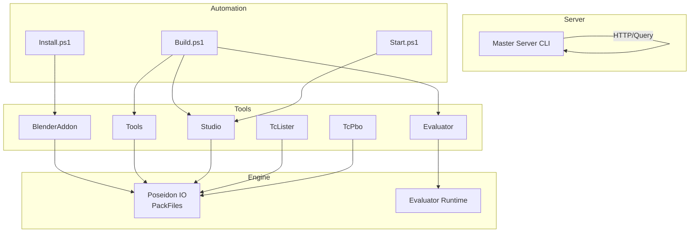
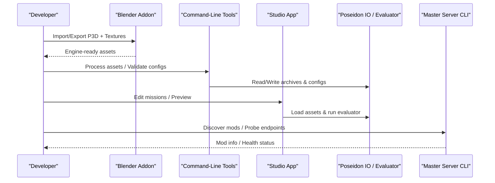
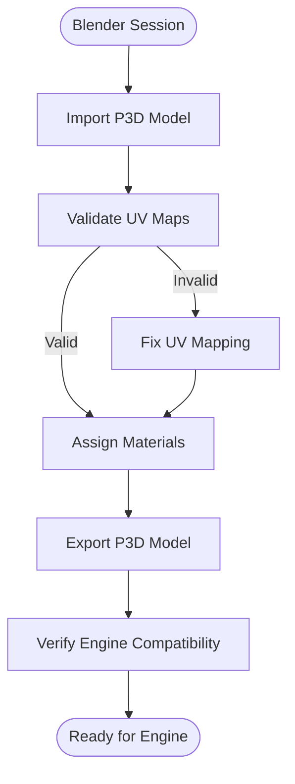
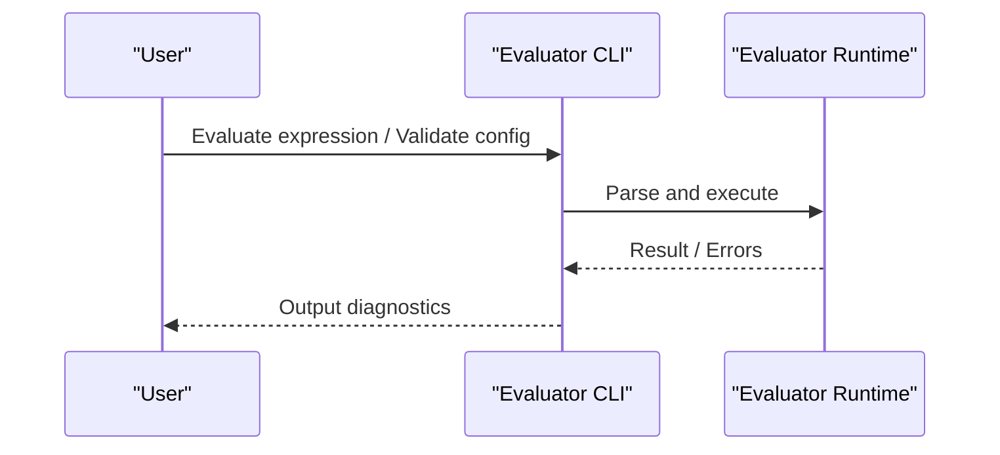
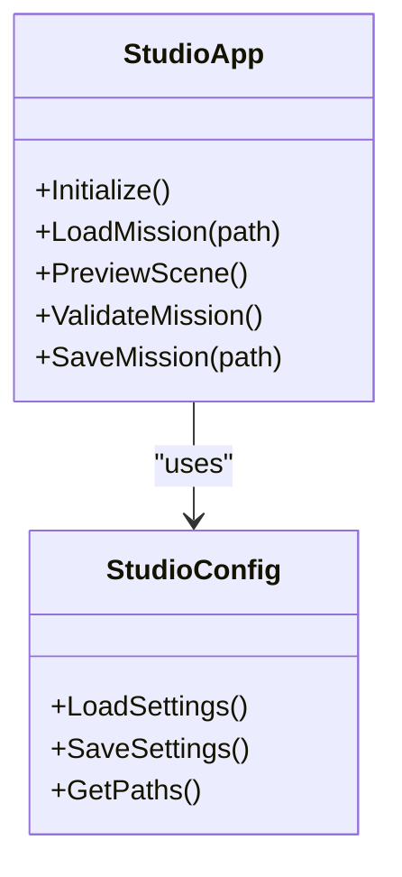
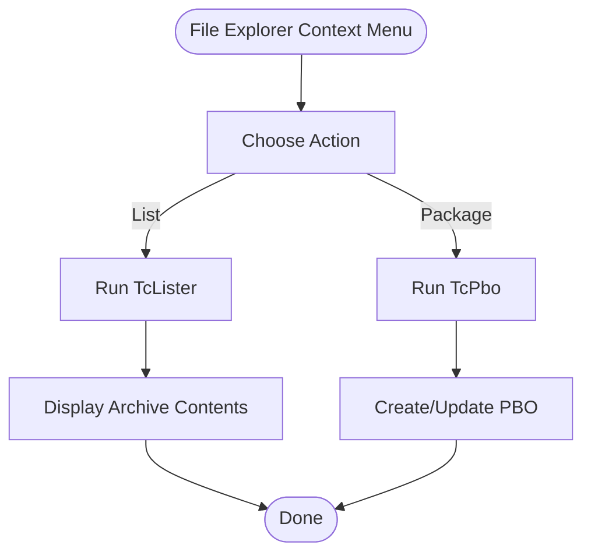
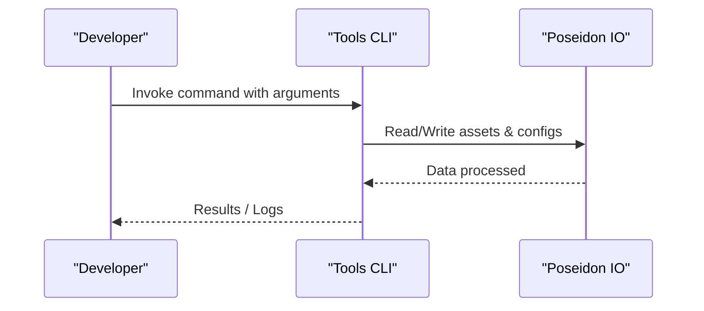
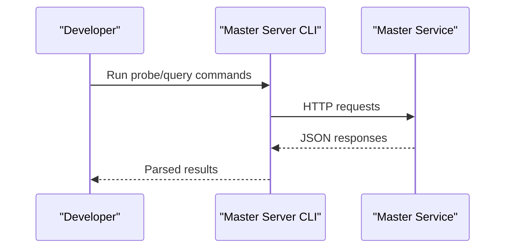
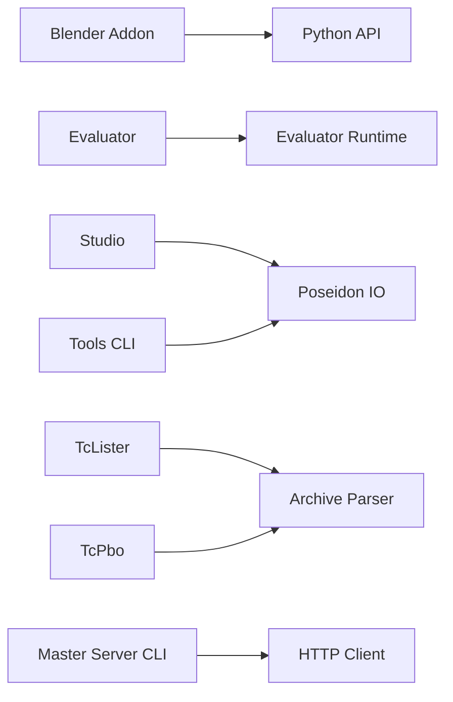

# Tools Suite

<cite>
**Referenced Files in This Document**
- [README.md](file://README.md)
- [apps/tools/BlenderAddon/README.md](file://apps/tools/BlenderAddon/README.md)
- [apps/tools/BlenderAddon/pyproject.toml](file://apps/tools/BlenderAddon/pyproject.toml)
- [apps/tools/BlenderAddon/package.ps1](file://apps/tools/BlenderAddon/package.ps1)
- [apps/tools/Evaluator/CMakeLists.txt](file://apps/tools/Evaluator/CMakeLists.txt)
- [apps/tools/Studio/CMakeLists.txt](file://apps/tools/Studio/CMakeLists.txt)
- [apps/tools/Studio/main.cpp](file://apps/tools/Studio/main.cpp)
- [apps/tools/Studio/StudioApp.hpp](file://apps/tools/Studio/StudioApp.hpp)
- [apps/tools/Studio/StudioConfig.hpp](file://apps/tools/Studio/StudioConfig.hpp)
- [apps/tools/TcLister/tc_lister.cpp](file://apps/tools/TcLister/tc_lister.cpp)
- [apps/tools/TcPbo/tc_pbo.cpp](file://apps/tools/TcPbo/tc_pbo.cpp)
- [apps/tools/Tools/main.cpp](file://apps/tools/Tools/main.cpp)
- [apps/tools/Tools/CMakeLists.txt](file://apps/tools/Tools/CMakeLists.txt)
- [engine/Poseidon/IO/PackFiles.cpp](file://engine/Poseidon/IO/PackFiles.cpp)
- [engine/Poseidon/IO/PackFiles.hpp](file://engine/Poseidon/IO/PackFiles.hpp)
- [mserver/CLI/src/main.rs](file://mserver/CLI/src/main.rs)
- [scripts/Build.ps1](file://scripts/Build.ps1)
- [scripts/Install.ps1](file://scripts/Install.ps1)
- [scripts/Start.ps1](file://scripts/Start.ps1)
</cite>

## Table of Contents
1. [Introduction](#introduction)
2. [Project Structure](#project-structure)
3. [Core Components](#core-components)
4. [Architecture Overview](#architecture-overview)
5. [Detailed Component Analysis](#detailed-component-analysis)
6. [Dependency Analysis](#dependency-analysis)
7. [Performance Considerations](#performance-considerations)
8. [Troubleshooting Guide](#troubleshooting-guide)
9. [Conclusion](#conclusion)
10. [Appendices](#appendices)

## Introduction
This document describes the development and content creation tools included with CWR-CE. It covers command-line utilities for asset processing, configuration management, and mission editing; the Blender addon for importing/exporting P3D models and textures; and the Studio application for mission editing and evaluation. It also explains how these tools integrate with the game engine and asset formats, provides practical usage examples, and addresses automation, batch processing, troubleshooting, and performance optimization for large projects.

## Project Structure
The tools are organized under apps/tools and complemented by build and automation scripts:
- BlenderAddon: Python-based Blender plugin for P3D import/export and texture workflows.
- Evaluator: Command-line tool to evaluate scripting expressions and validate configurations.
- Studio: Desktop application for mission editing and interactive authoring.
- TcLister and TcPbo: Windows shell integration utilities for listing and packaging assets.
- Tools: Core command-line utilities for asset processing and configuration tasks.
- mserver CLI: Command-line interface for interacting with the master server (mod discovery, probing).
- Scripts: PowerShell automation for building, installing, and launching toolchains.

**Diagram sources**
- [apps/tools/BlenderAddon/README.md](file://apps/tools/BlenderAddon/README.md)
- [apps/tools/Evaluator/CMakeLists.txt](file://apps/tools/Evaluator/CMakeLists.txt)
- [apps/tools/Studio/CMakeLists.txt](file://apps/tools/Studio/CMakeLists.txt)
- [apps/tools/TcLister/tc_lister.cpp](file://apps/tools/TcLister/tc_lister.cpp)
- [apps/tools/TcPbo/tc_pbo.cpp](file://apps/tools/TcPbo/tc_pbo.cpp)
- [apps/tools/Tools/main.cpp](file://apps/tools/Tools/main.cpp)
- [engine/Poseidon/IO/PackFiles.cpp](file://engine/Poseidon/IO/PackFiles.cpp)
- [mserver/CLI/src/main.rs](file://mserver/CLI/src/main.rs)
- [scripts/Build.ps1](file://scripts/Build.ps1)
- [scripts/Install.ps1](file://scripts/Install.ps1)
- [scripts/Start.ps1](file://scripts/Start.ps1)

**Section sources**
- [README.md](file://README.md)

## Core Components
- Blender Addon: Provides import/export of P3D models, texture handling, and animation pipeline support within Blender.
- Evaluator: Executes script expressions and validates configuration data using the engine’s evaluator runtime.
- Studio: Mission editor application enabling visual editing, preview, and validation of missions.
- TcLister: Shell extension to list contents of archives and packages.
- TcPbo: Shell extension to create and manage PBO archives via context menu.
- Tools: Centralized command-line utilities for asset processing, configuration management, and mission editing tasks.
- Master Server CLI: Interacts with the master service for mod discovery and probing.

Key responsibilities:
- Asset processing: Import/export, conversion, packaging, and validation.
- Configuration management: Parsing, merging, and validating config files.
- Mission editing: Visual authoring, scene composition, and testing.
- Automation: Build, install, and launch pipelines via scripts.

**Section sources**
- [apps/tools/BlenderAddon/README.md](file://apps/tools/BlenderAddon/README.md)
- [apps/tools/Evaluator/CMakeLists.txt](file://apps/tools/Evaluator/CMakeLists.txt)
- [apps/tools/Studio/CMakeLists.txt](file://apps/tools/Studio/CMakeLists.txt)
- [apps/tools/TcLister/tc_lister.cpp](file://apps/tools/TcLister/tc_lister.cpp)
- [apps/tools/TcPbo/tc_pbo.cpp](file://apps/tools/TcPbo/tc_pbo.cpp)
- [apps/tools/Tools/main.cpp](file://apps/tools/Tools/main.cpp)
- [mserver/CLI/src/main.rs](file://mserver/CLI/src/main.rs)

## Architecture Overview
The tools suite integrates with the engine through shared libraries and formats:
- Poseidon IO PackFiles handles archive formats used by the engine (e.g., PBO-like structures).
- The Evaluator runtime powers expression evaluation and config validation across tools.
- Studio leverages engine subsystems for mission editing and preview.
- Blender addon exports/import assets into engine-compatible formats.
- Master Server CLI communicates with the master service for mod metadata and probing.

**Diagram sources**
- [apps/tools/BlenderAddon/README.md](file://apps/tools/BlenderAddon/README.md)
- [apps/tools/Tools/main.cpp](file://apps/tools/Tools/main.cpp)
- [apps/tools/Studio/CMakeLists.txt](file://apps/tools/Studio/CMakeLists.txt)
- [engine/Poseidon/IO/PackFiles.cpp](file://engine/Poseidon/IO/PackFiles.cpp)
- [mserver/CLI/src/main.rs](file://mserver/CLI/src/main.rs)

## Detailed Component Analysis

### Blender Addon
Responsibilities:
- Import P3D models into Blender with correct hierarchy and materials.
- Export P3D models from Blender back to engine format.
- Manage texture workflows including UV mapping and texture paths.
- Support animation pipelines for skeletal animations.

Implementation highlights:
- Python plugin structure defined by project configuration and package scripts.
- Packaging utility for distributing the addon.

Practical usage:
- Install the addon into Blender using the provided packaging script.
- Use import/export operators within Blender to work with P3D assets.
- Ensure texture paths align with engine expectations for seamless integration.

**Diagram sources**
- [apps/tools/BlenderAddon/README.md](file://apps/tools/BlenderAddon/README.md)
- [apps/tools/BlenderAddon/pyproject.toml](file://apps/tools/BlenderAddon/pyproject.toml)
- [apps/tools/BlenderAddon/package.ps1](file://apps/tools/BlenderAddon/package.ps1)

**Section sources**
- [apps/tools/BlenderAddon/README.md](file://apps/tools/BlenderAddon/README.md)
- [apps/tools/BlenderAddon/pyproject.toml](file://apps/tools/BlenderAddon/pyproject.toml)
- [apps/tools/BlenderAddon/package.ps1](file://apps/tools/BlenderAddon/package.ps1)

### Evaluator Tool
Responsibilities:
- Execute scripting expressions against engine state.
- Validate configuration files and data structures.
- Provide feedback on syntax and semantic correctness.

Usage patterns:
- Run expression evaluations for debugging or automated checks.
- Integrate into CI pipelines to validate mission scripts and configs.

**Diagram sources**
- [apps/tools/Evaluator/CMakeLists.txt](file://apps/tools/Evaluator/CMakeLists.txt)

**Section sources**
- [apps/tools/Evaluator/CMakeLists.txt](file://apps/tools/Evaluator/CMakeLists.txt)

### Studio Application
Responsibilities:
- Visual mission editor with scene composition and asset placement.
- Real-time preview and validation of missions.
- Integration with engine subsystems for loading assets and running evaluators.

Implementation overview:
- Entry point and application lifecycle managed by main module.
- Configuration handling for user preferences and project settings.

**Diagram sources**
- [apps/tools/Studio/main.cpp](file://apps/tools/Studio/main.cpp)
- [apps/tools/Studio/StudioApp.hpp](file://apps/tools/Studio/StudioApp.hpp)
- [apps/tools/Studio/StudioConfig.hpp](file://apps/tools/Studio/StudioConfig.hpp)

**Section sources**
- [apps/tools/Studio/CMakeLists.txt](file://apps/tools/Studio/CMakeLists.txt)
- [apps/tools/Studio/main.cpp](file://apps/tools/Studio/main.cpp)
- [apps/tools/Studio/StudioApp.hpp](file://apps/tools/Studio/StudioApp.hpp)
- [apps/tools/Studio/StudioConfig.hpp](file://apps/tools/Studio/StudioConfig.hpp)

### TcLister and TcPbo
Responsibilities:
- TcLister: List contents of archives/packages via shell integration.
- TcPbo: Create and manage PBO archives via context menu operations.

Usage patterns:
- Right-click context menu actions in file explorer for quick inspection and packaging.
- Useful for verifying asset organization and preparing distributions.

**Diagram sources**
- [apps/tools/TcLister/tc_lister.cpp](file://apps/tools/TcLister/tc_lister.cpp)
- [apps/tools/TcPbo/tc_pbo.cpp](file://apps/tools/TcPbo/tc_pbo.cpp)

**Section sources**
- [apps/tools/TcLister/tc_lister.cpp](file://apps/tools/TcLister/tc_lister.cpp)
- [apps/tools/TcPbo/tc_pbo.cpp](file://apps/tools/TcPbo/tc_pbo.cpp)

### Tools Command-Line Utilities
Responsibilities:
- Asset processing: Convert, validate, and optimize assets for engine use.
- Configuration management: Parse, merge, and validate configuration files.
- Mission editing: Batch operations on mission files and related resources.

Integration points:
- Uses engine IO libraries for reading/writing archives and configs.
- Can be scripted for automation and CI/CD pipelines.

**Diagram sources**
- [apps/tools/Tools/main.cpp](file://apps/tools/Tools/main.cpp)
- [engine/Poseidon/IO/PackFiles.cpp](file://engine/Poseidon/IO/PackFiles.cpp)

**Section sources**
- [apps/tools/Tools/main.cpp](file://apps/tools/Tools/main.cpp)
- [apps/tools/Tools/CMakeLists.txt](file://apps/tools/Tools/CMakeLists.txt)
- [engine/Poseidon/IO/PackFiles.cpp](file://engine/Poseidon/IO/PackFiles.cpp)
- [engine/Poseidon/IO/PackFiles.hpp](file://engine/Poseidon/IO/PackFiles.hpp)

### Master Server CLI
Responsibilities:
- Interact with the master service for mod discovery and health probing.
- Query endpoints and retrieve metadata about available mods.

Usage patterns:
- Automate mod inventory checks and dependency resolution.
- Integrate with deployment pipelines to verify mod availability.

**Diagram sources**
- [mserver/CLI/src/main.rs](file://mserver/CLI/src/main.rs)

**Section sources**
- [mserver/CLI/src/main.rs](file://mserver/CLI/src/main.rs)

## Dependency Analysis
Tool dependencies and relationships:
- Blender Addon depends on Python and Blender APIs; packaged via pyproject and PowerShell scripts.
- Evaluator depends on engine’s evaluator runtime for execution.
- Studio depends on engine IO and UI subsystems for mission editing.
- TcLister and TcPbo depend on archive parsing libraries.
- Tools CLI depends on Poseidon IO for asset and config handling.
- Master Server CLI depends on HTTP client libraries for service communication.

**Diagram sources**
- [apps/tools/BlenderAddon/pyproject.toml](file://apps/tools/BlenderAddon/pyproject.toml)
- [apps/tools/Evaluator/CMakeLists.txt](file://apps/tools/Evaluator/CMakeLists.txt)
- [apps/tools/Studio/CMakeLists.txt](file://apps/tools/Studio/CMakeLists.txt)
- [apps/tools/TcLister/tc_lister.cpp](file://apps/tools/TcLister/tc_lister.cpp)
- [apps/tools/TcPbo/tc_pbo.cpp](file://apps/tools/TcPbo/tc_pbo.cpp)
- [apps/tools/Tools/main.cpp](file://apps/tools/Tools/main.cpp)
- [engine/Poseidon/IO/PackFiles.cpp](file://engine/Poseidon/IO/PackFiles.cpp)
- [mserver/CLI/src/main.rs](file://mserver/CLI/src/main.rs)

**Section sources**
- [apps/tools/BlenderAddon/pyproject.toml](file://apps/tools/BlenderAddon/pyproject.toml)
- [apps/tools/Evaluator/CMakeLists.txt](file://apps/tools/Evaluator/CMakeLists.txt)
- [apps/tools/Studio/CMakeLists.txt](file://apps/tools/Studio/CMakeLists.txt)
- [apps/tools/TcLister/tc_lister.cpp](file://apps/tools/TcLister/tc_lister.cpp)
- [apps/tools/TcPbo/tc_pbo.cpp](file://apps/tools/TcPbo/tc_pbo.cpp)
- [apps/tools/Tools/main.cpp](file://apps/tools/Tools/main.cpp)
- [engine/Poseidon/IO/PackFiles.cpp](file://engine/Poseidon/IO/PackFiles.cpp)
- [mserver/CLI/src/main.rs](file://mserver/CLI/src/main.rs)

## Performance Considerations
- Asset Processing:
  - Use batch processing commands to minimize overhead when handling large numbers of assets.
  - Prefer incremental builds and caching where supported by tools.
- Blender Workflow:
  - Optimize model complexity and texture sizes before export to reduce engine load times.
  - Validate UV maps and material assignments early to avoid rework.
- Studio Editing:
  - Limit scene complexity during editing; use previews sparingly to maintain responsiveness.
  - Save frequently and utilize version control to prevent data loss.
- Evaluator:
  - Cache validated configurations to speed up repeated runs.
  - Avoid heavy computations in evaluated expressions; precompute where possible.
- Master Server CLI:
  - Implement rate limiting and retry logic in automated scripts to handle transient failures.

[No sources needed since this section provides general guidance]

## Troubleshooting Guide
Common issues and resolutions:
- Blender Addon:
  - If import fails, verify P3D format compatibility and ensure all required dependencies are installed.
  - Texture path errors often result from incorrect relative paths; adjust mappings accordingly.
- Evaluator:
  - Syntax errors in expressions should be corrected based on diagnostic output.
  - Configuration validation failures require checking schema compliance and missing fields.
- Studio:
  - Mission loading errors may indicate missing assets or invalid references; verify asset paths and integrity.
  - Preview crashes can be mitigated by reducing scene complexity or updating graphics drivers.
- TcLister/TcPbo:
  - Archive listing failures typically stem from corrupted or unsupported formats; repackage assets if necessary.
  - Packaging errors often relate to permission issues or insufficient disk space.
- Tools CLI:
  - Command failures usually provide detailed logs; review error messages for actionable insights.
  - Path resolution issues can be resolved by specifying absolute paths or adjusting working directories.
- Master Server CLI:
  - Connection errors may indicate network issues or service downtime; check connectivity and service status.
  - Response parsing failures suggest API changes; update CLI version or adjust parameters.

**Section sources**
- [apps/tools/BlenderAddon/README.md](file://apps/tools/BlenderAddon/README.md)
- [apps/tools/Evaluator/CMakeLists.txt](file://apps/tools/Evaluator/CMakeLists.txt)
- [apps/tools/Studio/CMakeLists.txt](file://apps/tools/Studio/CMakeLists.txt)
- [apps/tools/TcLister/tc_lister.cpp](file://apps/tools/TcLister/tc_lister.cpp)
- [apps/tools/TcPbo/tc_pbo.cpp](file://apps/tools/TcPbo/tc_pbo.cpp)
- [apps/tools/Tools/main.cpp](file://apps/tools/Tools/main.cpp)
- [mserver/CLI/src/main.rs](file://mserver/CLI/src/main.rs)

## Conclusion
The CWR-CE tools suite provides a comprehensive set of utilities for asset processing, configuration management, and mission editing. By integrating with the engine’s IO and evaluator systems, these tools enable efficient content creation and validation workflows. The Blender addon facilitates seamless model and texture workflows, while Studio offers powerful mission editing capabilities. Automation scripts streamline build and deployment processes, ensuring consistency across development environments. Adhering to best practices and leveraging the provided tools will enhance productivity and quality in content creation for CWR-CE.

[No sources needed since this section summarizes without analyzing specific files]

## Appendices

### Practical Examples
- Using Blender Addon:
  - Install the addon using the packaging script and import P3D models into Blender.
  - Export modified models back to P3D format for use in the engine.
- Running Evaluator Commands:
  - Execute script expressions to test logic or validate configurations.
  - Integrate evaluator runs into CI pipelines for automated validation.
- Editing Missions in Studio:
  - Open existing missions or create new ones using the visual editor.
  - Preview and validate missions before deployment.
- Automating with Scripts:
  - Use Build.ps1 to compile tools and dependencies.
  - Leverage Install.ps1 to set up the environment and Start.ps1 to launch applications.

**Section sources**
- [apps/tools/BlenderAddon/README.md](file://apps/tools/BlenderAddon/README.md)
- [apps/tools/Evaluator/CMakeLists.txt](file://apps/tools/Evaluator/CMakeLists.txt)
- [apps/tools/Studio/CMakeLists.txt](file://apps/tools/Studio/CMakeLists.txt)
- [scripts/Build.ps1](file://scripts/Build.ps1)
- [scripts/Install.ps1](file://scripts/Install.ps1)
- [scripts/Start.ps1](file://scripts/Start.ps1)