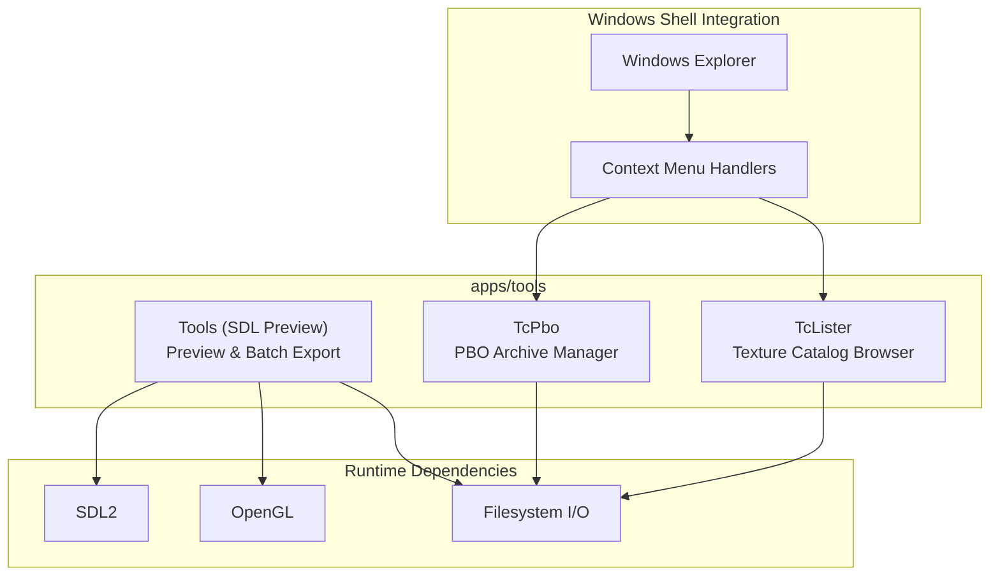
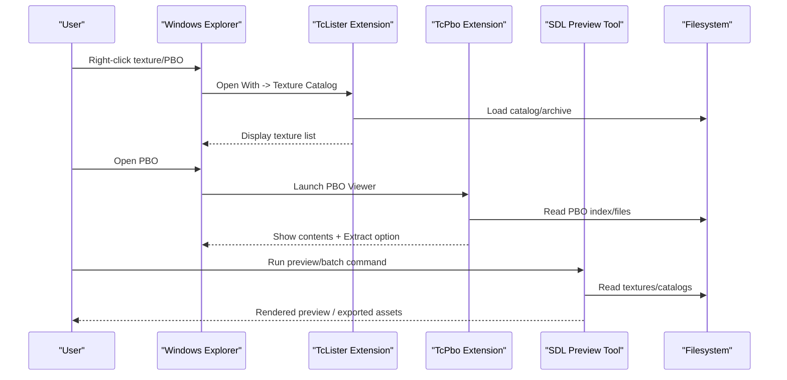
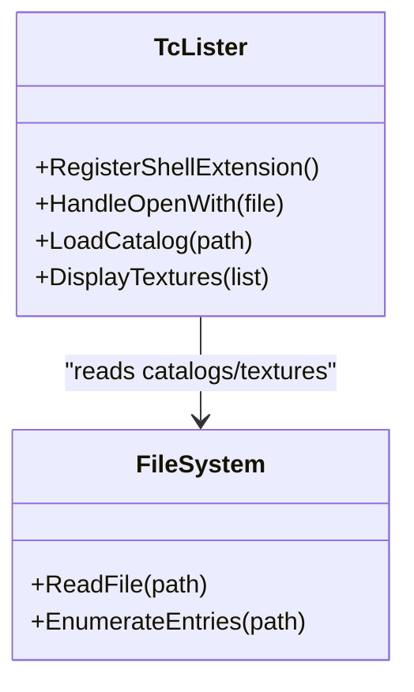
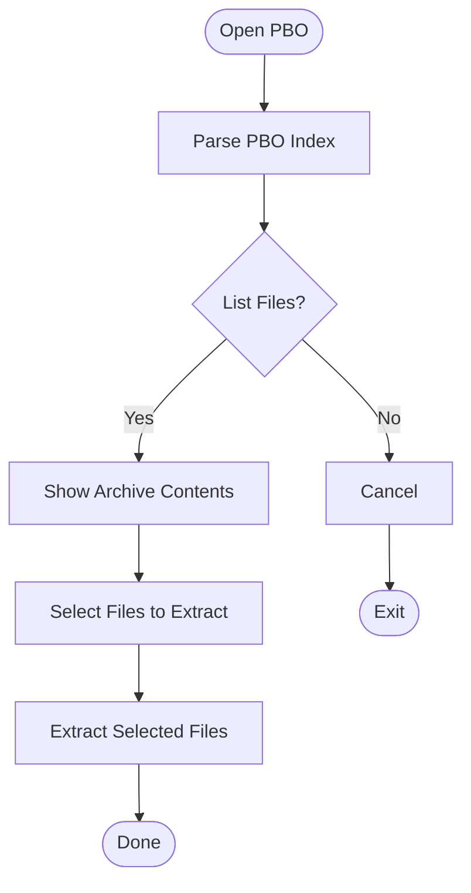
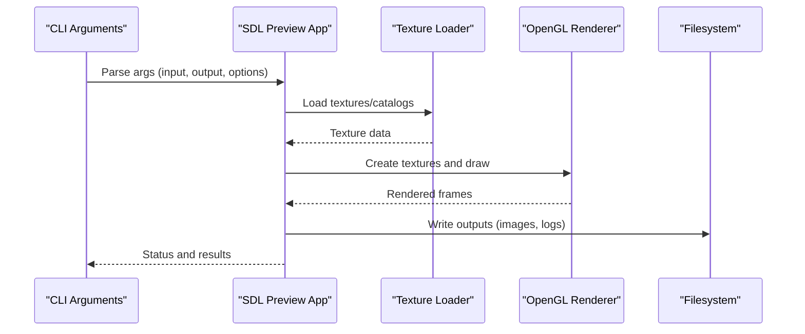
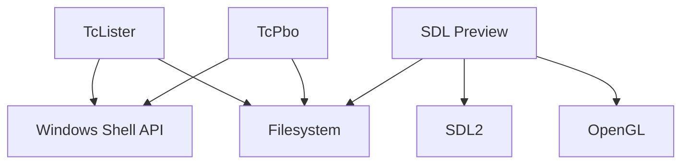

# Utility Utilities

<cite>
**Referenced Files in This Document**
- [tc_lister.cpp](file://apps/tools/TcLister/tc_lister.cpp)
- [listplug.h](file://apps/tools/TcLister/listplug.h)
- [pluginst.inf](file://apps/tools/TcLister/pluginst.inf)
- [tc_pbo.cpp](file://apps/tools/TcPbo/tc_pbo.cpp)
- [wcxhead.h](file://apps/tools/TcPbo/wcxhead.h)
- [SDLPreview.cpp](file://apps/tools/Tools/SDLPreview.cpp)
- [SDLPreview.hpp](file://apps/tools/Tools/SDLPreview.hpp)
- [main.cpp](file://apps/tools/Tools/main.cpp)
- [CMakeLists.txt](file://apps/tools/TcLister/CMakeLists.txt)
- [CMakeLists.txt](file://apps/tools/TcPbo/CMakeLists.txt)
- [CMakeLists.txt](file://apps/tools/Tools/CMakeLists.txt)
</cite>

## Table of Contents
1. [Introduction](#introduction)
2. [Project Structure](#project-structure)
3. [Core Components](#core-components)
4. [Architecture Overview](#architecture-overview)
5. [Detailed Component Analysis](#detailed-component-analysis)
6. [Dependency Analysis](#dependency-analysis)
7. [Performance Considerations](#performance-considerations)
8. [Troubleshooting Guide](#troubleshooting-guide)
9. [Conclusion](#conclusion)
10. [Appendices](#appendices)

## Introduction
This document describes the specialized utility tools included with the project: TcLister for texture catalog browsing, TcPbo for PBO archive management, and SDL-based preview utilities. It explains their purpose, usage patterns, command-line interfaces, integration points, supported texture formats, PBO compression options, and preview rendering capabilities. It also provides examples of batch operations, automation scripts, and workflow integration, along with performance considerations for large asset collections and troubleshooting guidance. Finally, it clarifies how these utilities relate to the main toolchain components.

## Project Structure
The utilities are implemented under apps/tools:
- TcLister: A Windows shell extension that integrates into Explorer’s “Open With” context menu to browse texture catalogs.
- TcPbo: A Windows shell extension for PBO archives, enabling quick inspection and extraction via Explorer.
- Tools (SDL Preview): A standalone executable that renders textures using SDL and OpenGL, suitable for previews and batch export.

**Diagram sources**
- [CMakeLists.txt](file://apps/tools/TcLister/CMakeLists.txt)
- [CMakeLists.txt](file://apps/tools/TcPbo/CMakeLists.txt)
- [CMakeLists.txt](file://apps/tools/Tools/CMakeLists.txt)

**Section sources**
- [tc_lister.cpp](file://apps/tools/TcLister/tc_lister.cpp)
- [listplug.h](file://apps/tools/TcLister/listplug.h)
- [pluginst.inf](file://apps/tools/TcLister/pluginst.inf)
- [tc_pbo.cpp](file://apps/tools/TcPbo/tc_pbo.cpp)
- [wcxhead.h](file://apps/tools/TcPbo/wcxhead.h)
- [SDLPreview.cpp](file://apps/tools/Tools/SDLPreview.cpp)
- [SDLPreview.hpp](file://apps/tools/Tools/SDLPreview.hpp)
- [main.cpp](file://apps/tools/Tools/main.cpp)

## Core Components
- TcLister: Provides a texture catalog browser as a Windows shell extension. It registers itself in the “Open With” context menu for texture files and displays a browsable list of textures from catalogs or archives.
- TcPbo: Implements a PBO viewer/explorer shell extension. It allows users to open PBO archives directly from Explorer, view contents, and extract selected files.
- SDL Preview: A console-driven or interactive preview tool built with SDL and OpenGL. It can render textures for visual inspection and supports batch operations such as exporting frames or converting formats.

Key responsibilities:
- TcLister focuses on catalog browsing and listing metadata for textures.
- TcPbo focuses on archive navigation and file extraction within PBO containers.
- SDL Preview focuses on rendering and conversion workflows, integrating with the rest of the toolchain through common input/output paths.

**Section sources**
- [tc_lister.cpp](file://apps/tools/TcLister/tc_lister.cpp)
- [listplug.h](file://apps/tools/TcLister/listplug.h)
- [tc_pbo.cpp](file://apps/tools/TcPbo/tc_pbo.cpp)
- [SDLPreview.cpp](file://apps/tools/Tools/SDLPreview.cpp)
- [SDLPreview.hpp](file://apps/tools/Tools/SDLPreview.hpp)
- [main.cpp](file://apps/tools/Tools/main.cpp)

## Architecture Overview
At a high level:
- Windows Explorer invokes shell extensions registered by TcLister and TcPbo when users interact with texture files or PBO archives.
- The SDL Preview tool runs independently and uses SDL for windowing/input and OpenGL for rendering. It reads textures from catalogs or archives and can output images or perform conversions.

**Diagram sources**
- [pluginst.inf](file://apps/tools/TcLister/pluginst.inf)
- [tc_pbo.cpp](file://apps/tools/TcPbo/tc_pbo.cpp)
- [SDLPreview.cpp](file://apps/tools/Tools/SDLPreview.cpp)
- [main.cpp](file://apps/tools/Tools/main.cpp)

## Detailed Component Analysis

### TcLister: Texture Catalog Browser
Purpose:
- Integrate with Windows Explorer to provide a “Open With” handler for texture catalogs.
- Browse and display texture entries contained in catalogs or archives.

Usage:
- Register the shell extension via the provided installer configuration.
- Use Explorer’s “Open With” context menu on texture files to launch TcLister.

Command-line interface:
- Primarily invoked by Explorer; direct CLI usage is not typical. Refer to the registration configuration for available parameters.

Integration points:
- Windows shell extension framework.
- Filesystem access to read catalogs and texture metadata.

Texture format support:
- Depends on underlying catalog parsing and texture readers used by the extension. Typically includes common game texture formats handled by the engine’s asset pipeline.

Batch operations and automation:
- Not designed for batch processing; use SDL Preview for automated workflows.

Performance considerations:
- Avoid opening very large catalogs in Explorer; prefer filtering or indexing strategies if needed.

Troubleshooting:
- Ensure the shell extension is properly registered.
- Verify file associations and permissions for reading catalogs.

**Diagram sources**
- [tc_lister.cpp](file://apps/tools/TcLister/tc_lister.cpp)
- [listplug.h](file://apps/tools/TcLister/listplug.h)

**Section sources**
- [tc_lister.cpp](file://apps/tools/TcLister/tc_lister.cpp)
- [listplug.h](file://apps/tools/TcLister/listplug.h)
- [pluginst.inf](file://apps/tools/TcLister/pluginst.inf)

### TcPbo: PBO Archive Manager
Purpose:
- Provide a Windows shell extension for PBO archives.
- Allow users to inspect archive contents and extract files directly from Explorer.

Usage:
- Install the shell extension so PBO files appear with a custom handler.
- Right-click a PBO file and select the TcPbo option to open its contents.

Command-line interface:
- Designed primarily as a shell extension; CLI usage is limited. For scripting, consider invoking the extension indirectly or using other tools.

Integration points:
- Windows shell extension framework.
- PBO parsing and file extraction routines.

PBO compression options:
- Supports standard PBO compression schemes used by the engine. Extraction preserves original compression where applicable.

Batch operations and automation:
- Not intended for batch operations; use SDL Preview or dedicated CLI tools for automation.

Performance considerations:
- Large PBOs may take time to enumerate; avoid excessive simultaneous extractions.

Troubleshooting:
- Confirm the extension is installed and associated with .pbo files.
- Check disk space and write permissions when extracting.

**Diagram sources**
- [tc_pbo.cpp](file://apps/tools/TcPbo/tc_pbo.cpp)
- [wcxhead.h](file://apps/tools/TcPbo/wcxhead.h)

**Section sources**
- [tc_pbo.cpp](file://apps/tools/TcPbo/tc_pbo.cpp)
- [wcxhead.h](file://apps/tools/TcPbo/wcxhead.h)

### SDL Preview: Preview and Batch Utilities
Purpose:
- Render textures for visual inspection using SDL and OpenGL.
- Support batch operations such as exporting frames or converting textures.

Usage:
- Run the executable with appropriate arguments to load textures or catalogs.
- Use keyboard/mouse controls for navigation and interaction.

Command-line interface:
- Accepts arguments for input paths, output directories, and rendering options. Typical flags include specifying input files, output formats, and scaling factors.

Integration points:
- SDL2 for windowing and input.
- OpenGL for rendering.
- Filesystem I/O for reading/writing assets.

Texture format support:
- Handles formats supported by the engine’s texture loaders; typically includes common image formats and proprietary game textures.

Batch operations and automation:
- Suitable for scripting: iterate over directories, process multiple textures, and export results.

Performance considerations:
- Use efficient batching and avoid unnecessary re-decoding.
- Prefer GPU-accelerated pipelines where possible.

Troubleshooting:
- Ensure SDL2 and OpenGL drivers are up to date.
- Validate input file integrity and permissions.

**Diagram sources**
- [SDLPreview.cpp](file://apps/tools/Tools/SDLPreview.cpp)
- [SDLPreview.hpp](file://apps/tools/Tools/SDLPreview.hpp)
- [main.cpp](file://apps/tools/Tools/main.cpp)

**Section sources**
- [SDLPreview.cpp](file://apps/tools/Tools/SDLPreview.cpp)
- [SDLPreview.hpp](file://apps/tools/Tools/SDLPreview.hpp)
- [main.cpp](file://apps/tools/Tools/main.cpp)

## Dependency Analysis
The utilities rely on:
- Windows shell extension APIs for TcLister and TcPbo.
- SDL2 and OpenGL for SDL Preview.
- Filesystem I/O across all utilities.

**Diagram sources**
- [CMakeLists.txt](file://apps/tools/TcLister/CMakeLists.txt)
- [CMakeLists.txt](file://apps/tools/TcPbo/CMakeLists.txt)
- [CMakeLists.txt](file://apps/tools/Tools/CMakeLists.txt)

**Section sources**
- [CMakeLists.txt](file://apps/tools/TcLister/CMakeLists.txt)
- [CMakeLists.txt](file://apps/tools/TcPbo/CMakeLists.txt)
- [CMakeLists.txt](file://apps/tools/Tools/CMakeLists.txt)

## Performance Considerations
- Large catalogs and archives:
  - Prefer lazy loading and pagination in TcLister to reduce memory pressure.
  - Avoid concurrent heavy extractions in TcPbo; queue operations to prevent I/O contention.
- Rendering performance:
  - Reuse textures and minimize format conversions in SDL Preview.
  - Use appropriate texture sizes and mipmaps to balance quality and speed.
- I/O efficiency:
  - Batch file operations and leverage async I/O where feasible.
  - Cache frequently accessed metadata to reduce repeated reads.

[No sources needed since this section provides general guidance]

## Troubleshooting Guide
Common issues and resolutions:
- Shell extension not registering:
  - Verify installation steps and registry entries for TcLister and TcPbo.
  - Ensure file associations are correctly set for textures and PBO files.
- Preview failures:
  - Check SDL2 and OpenGL driver compatibility.
  - Validate input file paths and permissions.
- Slow enumeration:
  - Limit directory recursion depth.
  - Use filters to narrow down relevant files.

**Section sources**
- [pluginst.inf](file://apps/tools/TcLister/pluginst.inf)
- [tc_pbo.cpp](file://apps/tools/TcPbo/tc_pbo.cpp)
- [SDLPreview.cpp](file://apps/tools/Tools/SDLPreview.cpp)

## Conclusion
TcLister, TcPbo, and SDL Preview form a cohesive set of utilities supporting texture catalog browsing, PBO archive management, and preview/export workflows. While TcLister and TcPbo integrate tightly with Windows Explorer for convenience, SDL Preview offers robust capabilities for automation and batch processing. Together, they streamline asset handling within the broader toolchain, enabling efficient workflows for developers and content creators.

[No sources needed since this section summarizes without analyzing specific files]

## Appendices
- Example batch operation script:
  - Iterate over a directory of textures, invoke SDL Preview with appropriate flags, and collect outputs into a target folder.
- Workflow integration:
  - Combine TcPbo extraction with SDL Preview conversion to produce standardized assets for downstream tools.

[No sources needed since this section provides general guidance]