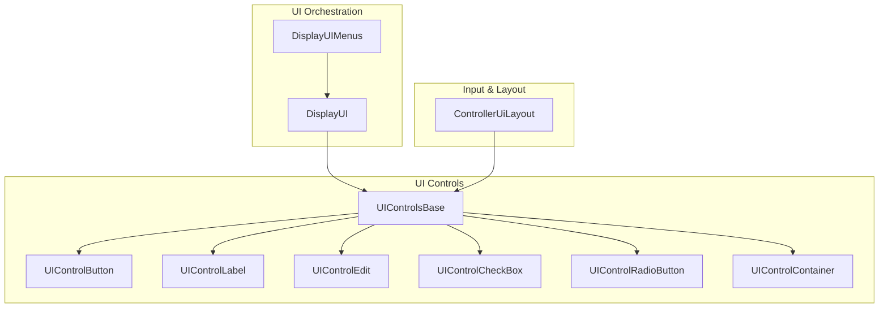
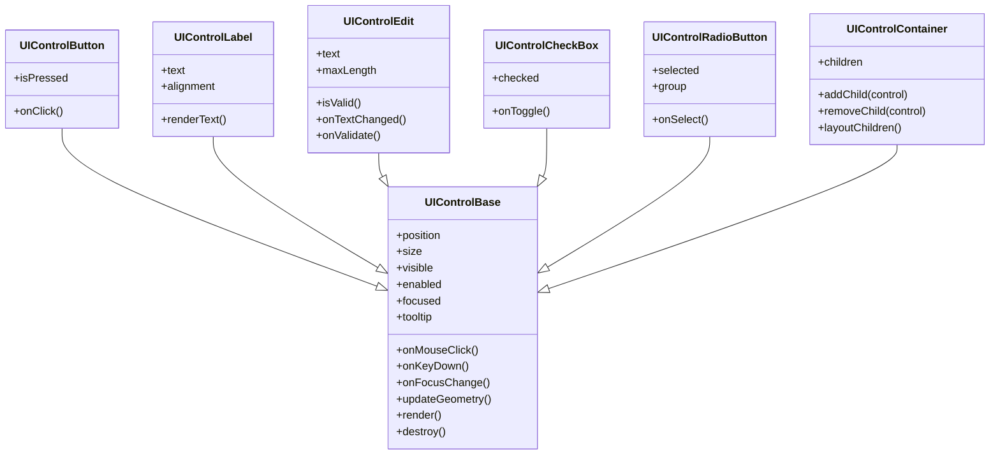
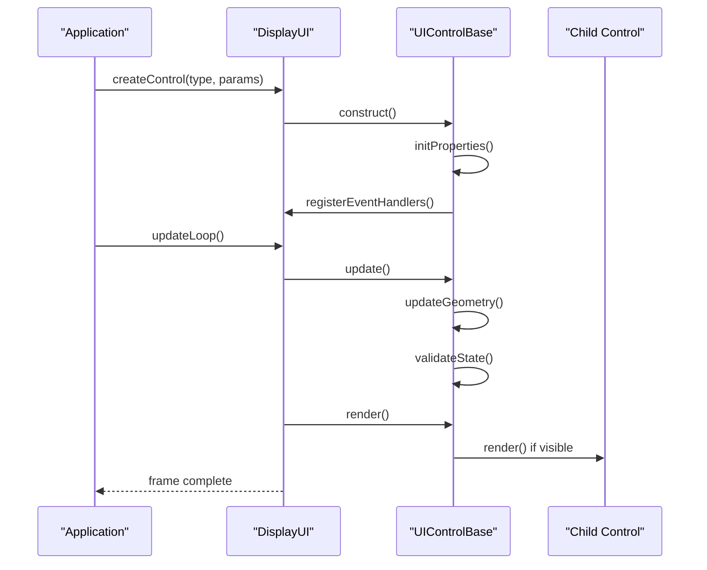
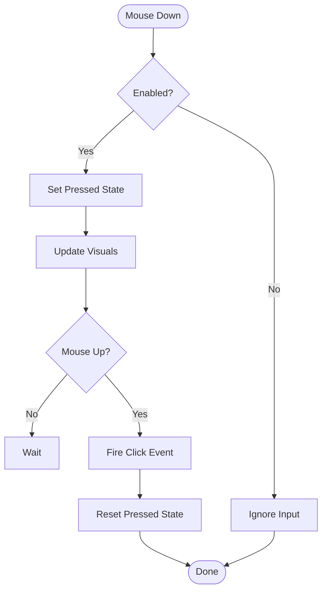
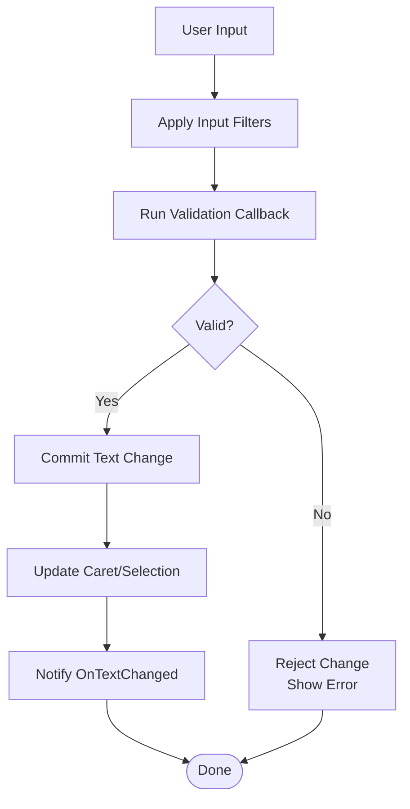
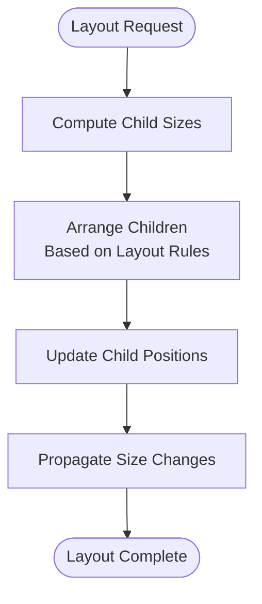
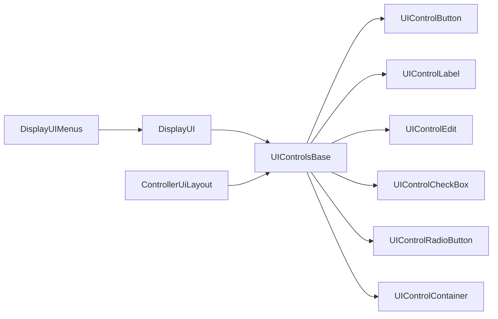

# Base Controls

<cite>
**Referenced Files in This Document**
- [UIControlsBase.hpp](file://engine/Poseidon/UI/Controls/UIControlsBase.hpp)
- [UIControlsBase.cpp](file://engine/Poseidon/UI/Controls/UIControlsBase.cpp)
- [UIControlButton.hpp](file://engine/Poseidon/UI/Controls/UIControlButton.hpp)
- [UIControlButton.cpp](file://engine/Poseidon/UI/Controls/UIControlButton.cpp)
- [UIControlLabel.hpp](file://engine/Poseidon/UI/Controls/UIControlLabel.hpp)
- [UIControlLabel.cpp](file://engine/Poseidon/UI/Controls/UIControlLabel.cpp)
- [UIControlEdit.hpp](file://engine/Poseidon/UI/Controls/UIControlEdit.hpp)
- [UIControlEdit.cpp](file://engine/Poseidon/UI/Controls/UIControlEdit.cpp)
- [UIControlCheckBox.hpp](file://engine/Poseidon/UI/Controls/UIControlCheckBox.hpp)
- [UIControlCheckBox.cpp](file://engine/Poseidon/UI/Controls/UIControlCheckBox.cpp)
- [UIControlRadioButton.hpp](file://engine/Poseidon/UI/Controls/UIControlRadioButton.hpp)
- [UIControlRadioButton.cpp](file://engine/Poseidon/UI/Controls/UIControlRadioButton.cpp)
- [UIControlContainer.hpp](file://engine/Poseidon/UI/Controls/UIControlContainer.hpp)
- [UIControlContainer.cpp](file://engine/Poseidon/UI/Controls/UIControlContainer.cpp)
- [DisplayUI.hpp](file://engine/Poseidon/UI/DisplayUI.hpp)
- [DisplayUIMenus.cpp](file://engine/Poseidon/UI/DisplayUIMenus.cpp)
- [ControllerUiLayout.hpp](file://engine/Poseidon/Input/ControllerUiLayout.hpp)
- [ControllerUiLayout.cpp](file://engine/Poseidon/Input/ControllerUiLayout.cpp)
</cite>

## Table of Contents
1. [Introduction](#introduction)
2. [Project Structure](#project-structure)
3. [Core Components](#core-components)
4. [Architecture Overview](#architecture-overview)
5. [Detailed Component Analysis](#detailed-component-analysis)
6. [Dependency Analysis](#dependency-analysis)
7. [Performance Considerations](#performance-considerations)
8. [Troubleshooting Guide](#troubleshooting-guide)
9. [Conclusion](#conclusion)
10. [Appendices](#appendices)

## Introduction
This document explains the base control system architecture used by the UI layer. It focuses on the UIControlsBase class hierarchy, fundamental control properties, event handling mechanisms, and layout positioning. It also documents core control types such as buttons, labels, text inputs, checkboxes, radio buttons, and basic containers. Practical guidance is provided for creating controls, binding properties, validating input, styling, managing state, and implementing common UI patterns. The document concludes with lifecycle, memory management, and performance considerations.

## Project Structure
The UI control system resides under the Poseidon engine’s UI module. The base control infrastructure and concrete control implementations are organized into a cohesive set of header and source files. Display orchestration and controller-driven layouts provide integration points for rendering and input.

**Diagram sources**
- [UIControlsBase.hpp:1-200](file://engine/Poseidon/UI/Controls/UIControlsBase.hpp#L1-L200)
- [UIControlButton.hpp:1-200](file://engine/Poseidon/UI/Controls/UIControlButton.hpp#L1-L200)
- [UIControlLabel.hpp:1-200](file://engine/Poseidon/UI/Controls/UIControlLabel.hpp#L1-L200)
- [UIControlEdit.hpp:1-200](file://engine/Poseidon/UI/Controls/UIControlEdit.hpp#L1-L200)
- [UIControlCheckBox.hpp:1-200](file://engine/Poseidon/UI/Controls/UIControlCheckBox.hpp#L1-L200)
- [UIControlRadioButton.hpp:1-200](file://engine/Poseidon/UI/Controls/UIControlRadioButton.hpp#L1-L200)
- [UIControlContainer.hpp:1-200](file://engine/Poseidon/UI/Controls/UIControlContainer.hpp#L1-L200)
- [DisplayUI.hpp:1-200](file://engine/Poseidon/UI/DisplayUI.hpp#L1-L200)
- [DisplayUIMenus.cpp:1-200](file://engine/Poseidon/UI/DisplayUIMenus.cpp#L1-L200)
- [ControllerUiLayout.hpp:1-200](file://engine/Poseidon/Input/ControllerUiLayout.hpp#L1-L200)

**Section sources**
- [UIControlsBase.hpp:1-200](file://engine/Poseidon/UI/Controls/UIControlsBase.hpp#L1-L200)
- [DisplayUI.hpp:1-200](file://engine/Poseidon/UI/DisplayUI.hpp#L1-L200)
- [ControllerUiLayout.hpp:1-200](file://engine/Poseidon/Input/ControllerUiLayout.hpp#L1-L200)

## Core Components
At the heart of the system is the base control class that defines shared properties, lifecycle hooks, event dispatch, and layout primitives. Concrete controls inherit from this base to implement specific behavior and rendering.

Key responsibilities of the base control include:
- Property storage and accessors (e.g., position, size, visibility, enabled state, focus, tooltip)
- Event registration and dispatch (mouse, keyboard, focus changes)
- Layout metrics computation and hit testing
- Styling hooks and theme integration points
- Lifecycle callbacks (creation, update, render, destruction)

Concrete control types extend the base to add domain-specific features:
- Button: click handling, pressed/hover states
- Label: text rendering and alignment
- Edit: text editing, validation, selection, caret movement
- CheckBox: boolean state toggling
- RadioButton: mutually exclusive selection within groups
- Container: child control management and layout propagation

**Section sources**
- [UIControlsBase.hpp:1-200](file://engine/Poseidon/UI/Controls/UIControlsBase.hpp#L1-L200)
- [UIControlsBase.cpp:1-200](file://engine/Poseidon/UI/Controls/UIControlsBase.cpp#L1-L200)
- [UIControlButton.hpp:1-200](file://engine/Poseidon/UI/Controls/UIControlButton.hpp#L1-L200)
- [UIControlLabel.hpp:1-200](file://engine/Poseidon/UI/Controls/UIControlLabel.hpp#L1-L200)
- [UIControlEdit.hpp:1-200](file://engine/Poseidon/UI/Controls/UIControlEdit.hpp#L1-L200)
- [UIControlCheckBox.hpp:1-200](file://engine/Poseidon/UI/Controls/UIControlCheckBox.hpp#L1-L200)
- [UIControlRadioButton.hpp:1-200](file://engine/Poseidon/UI/Controls/UIControlRadioButton.hpp#L1-L200)
- [UIControlContainer.hpp:1-200](file://engine/Poseidon/UI/Controls/UIControlContainer.hpp#L1-L200)

## Architecture Overview
The control system follows a hierarchical composition model where containers hold child controls. Each control owns its geometry, style, and event handlers. Input events propagate through the display pipeline and are dispatched to focused or hovered controls. Rendering traverses the control tree to draw visible elements.

**Diagram sources**
- [UIControlsBase.hpp:1-200](file://engine/Poseidon/UI/Controls/UIControlsBase.hpp#L1-L200)
- [UIControlButton.hpp:1-200](file://engine/Poseidon/UI/Controls/UIControlButton.hpp#L1-L200)
- [UIControlLabel.hpp:1-200](file://engine/Poseidon/UI/Controls/UIControlLabel.hpp#L1-L200)
- [UIControlEdit.hpp:1-200](file://engine/Poseidon/UI/Controls/UIControlEdit.hpp#L1-L200)
- [UIControlCheckBox.hpp:1-200](file://engine/Poseidon/UI/Controls/UIControlCheckBox.hpp#L1-L200)
- [UIControlRadioButton.hpp:1-200](file://engine/Poseidon/UI/Controls/UIControlRadioButton.hpp#L1-L200)
- [UIControlContainer.hpp:1-200](file://engine/Poseidon/UI/Controls/UIControlContainer.hpp#L1-L200)

## Detailed Component Analysis

### UIControlBase: Foundation and Lifecycle
The base control defines the contract for all UI elements. It encapsulates:
- Properties: position, size, visibility, enabled state, focus, tooltips
- Events: mouse clicks, key presses, focus changes
- Geometry: update and hit-testing utilities
- Lifecycle: creation, update, render, destruction hooks

Lifecycle flow:
- Creation initializes default properties and registers event listeners
- Update recalculates layout and validates state
- Render draws the control based on current style and state
- Destruction releases resources and unregisters events

**Diagram sources**
- [DisplayUI.hpp:1-200](file://engine/Poseidon/UI/DisplayUI.hpp#L1-L200)
- [UIControlsBase.hpp:1-200](file://engine/Poseidon/UI/Controls/UIControlsBase.hpp#L1-L200)
- [UIControlsBase.cpp:1-200](file://engine/Poseidon/UI/Controls/UIControlsBase.cpp#L1-L200)

**Section sources**
- [UIControlsBase.hpp:1-200](file://engine/Poseidon/UI/Controls/UIControlsBase.hpp#L1-L200)
- [UIControlsBase.cpp:1-200](file://engine/Poseidon/UI/Controls/UIControlsBase.cpp#L1-L200)

### UIControlButton: Interaction and State
Buttons handle user clicks and maintain pressed/hover states. They typically trigger actions via callbacks or commands.

Key behaviors:
- Mouse down/up transitions to pressed/released
- Hover detection updates visual state
- Click event dispatch to registered handlers
- Keyboard activation (Enter/Space) when focused

**Diagram sources**
- [UIControlButton.hpp:1-200](file://engine/Poseidon/UI/Controls/UIControlButton.hpp#L1-L200)
- [UIControlButton.cpp:1-200](file://engine/Poseidon/UI/Controls/UIControlButton.cpp#L1-L200)

**Section sources**
- [UIControlButton.hpp:1-200](file://engine/Poseidon/UI/Controls/UIControlButton.hpp#L1-L200)
- [UIControlButton.cpp:1-200](file://engine/Poseidon/UI/Controls/UIControlButton.cpp#L1-L200)

### UIControlLabel: Text Display and Alignment
Labels render static text with configurable alignment and styling. They do not accept input but may respond to hover for tooltips.

Features:
- Text content and formatting
- Horizontal/vertical alignment options
- Font and color styling hooks
- Tooltip support

**Section sources**
- [UIControlLabel.hpp:1-200](file://engine/Poseidon/UI/Controls/UIControlLabel.hpp#L1-L200)
- [UIControlLabel.cpp:1-200](file://engine/Poseidon/UI/Controls/UIControlLabel.cpp#L1-L200)

### UIControlEdit: Text Input and Validation
Text edit controls manage user input, selection, and validation. They handle keystrokes, clipboard operations, and caret navigation.

Core capabilities:
- Text buffer management
- Input filtering and maxLength enforcement
- Validation callback before accepting changes
- Selection and caret positioning
- Focus and keyboard shortcuts

Validation flow:

**Diagram sources**
- [UIControlEdit.hpp:1-200](file://engine/Poseidon/UI/Controls/UIControlEdit.hpp#L1-L200)
- [UIControlEdit.cpp:1-200](file://engine/Poseidon/UI/Controls/UIControlEdit.cpp#L1-L200)

**Section sources**
- [UIControlEdit.hpp:1-200](file://engine/Poseidon/UI/Controls/UIControlEdit.hpp#L1-L200)
- [UIControlEdit.cpp:1-200](file://engine/Poseidon/UI/Controls/UIControlEdit.cpp#L1-L200)

### UIControlCheckBox: Boolean Toggle
Checkboxes toggle a boolean state. They visually indicate checked/unchecked states and notify on change.

Behavior:
- Click toggles checked state
- Keyboard activation (Space) when focused
- Optional label association
- Disabled state prevents interaction

**Section sources**
- [UIControlCheckBox.hpp:1-200](file://engine/Poseidon/UI/Controls/UIControlCheckBox.hpp#L1-L200)
- [UIControlCheckBox.cpp:1-200](file://engine/Poseidon/UI/Controls/UIControlCheckBox.cpp#L1-L200)

### UIControlRadioButton: Mutually Exclusive Selection
Radio buttons allow selecting one option from a group. Only one radio button in a group can be selected at a time.

Group management:
- Group identifier links related radio buttons
- Selecting one deselects others in the same group
- Visual feedback for selected state
- Keyboard navigation within group

**Section sources**
- [UIControlRadioButton.hpp:1-200](file://engine/Poseidon/UI/Controls/UIControlRadioButton.hpp#L1-L200)
- [UIControlRadioButton.cpp:1-200](file://engine/Poseidon/UI/Controls/UIControlRadioButton.cpp#L1-L200)

### UIControlContainer: Child Management and Layout
Containers organize child controls and manage their layout. They propagate events and coordinate updates across the hierarchy.

Responsibilities:
- Adding/removing child controls
- Layout calculation and resizing
- Event bubbling and focus traversal
- Visibility and enablement cascading

Layout algorithm:

**Diagram sources**
- [UIControlContainer.hpp:1-200](file://engine/Poseidon/UI/Controls/UIControlContainer.hpp#L1-L200)
- [UIControlContainer.cpp:1-200](file://engine/Poseidon/UI/Controls/UIControlContainer.cpp#L1-L200)

**Section sources**
- [UIControlContainer.hpp:1-200](file://engine/Poseidon/UI/Controls/UIControlContainer.hpp#L1-L200)
- [UIControlContainer.cpp:1-200](file://engine/Poseidon/UI/Controls/UIControlContainer.cpp#L1-L200)

## Dependency Analysis
The control system has clear dependencies between base classes and concrete implementations. Display orchestration depends on the control hierarchy for rendering and input handling. Controller layouts integrate with controls for gamepad-friendly navigation.

**Diagram sources**
- [UIControlsBase.hpp:1-200](file://engine/Poseidon/UI/Controls/UIControlsBase.hpp#L1-L200)
- [DisplayUI.hpp:1-200](file://engine/Poseidon/UI/DisplayUI.hpp#L1-L200)
- [DisplayUIMenus.cpp:1-200](file://engine/Poseidon/UI/DisplayUIMenus.cpp#L1-L200)
- [ControllerUiLayout.hpp:1-200](file://engine/Poseidon/Input/ControllerUiLayout.hpp#L1-L200)

**Section sources**
- [UIControlsBase.hpp:1-200](file://engine/Poseidon/UI/Controls/UIControlsBase.hpp#L1-L200)
- [DisplayUI.hpp:1-200](file://engine/Poseidon/UI/DisplayUI.hpp#L1-L200)
- [ControllerUiLayout.hpp:1-200](file://engine/Poseidon/Input/ControllerUiLayout.hpp#L1-L200)

## Performance Considerations
- Minimize property updates: batch changes to reduce layout recalculation
- Avoid frequent allocations: reuse buffers for text and graphics
- Efficient hit testing: use bounding boxes and early exits
- Lazy rendering: skip drawing invisible or off-screen controls
- Event throttling: debounce rapid input events where appropriate
- Memory management: ensure proper destruction order to prevent dangling references

[No sources needed since this section provides general guidance]

## Troubleshooting Guide
Common issues and resolutions:
- Controls not responding to input: verify focus state and enabled visibility
- Layout problems: check parent-child relationships and size constraints
- Validation errors: inspect validation callbacks and error messages
- Memory leaks: ensure proper destruction and cleanup of event handlers
- Performance drops: profile update/render cycles and optimize heavy operations

**Section sources**
- [UIControlsBase.cpp:1-200](file://engine/Poseidon/UI/Controls/UIControlsBase.cpp#L1-L200)
- [UIControlEdit.cpp:1-200](file://engine/Poseidon/UI/Controls/UIControlEdit.cpp#L1-L200)

## Conclusion
The base control system provides a robust foundation for building interactive user interfaces. Through a well-defined hierarchy, consistent event handling, and flexible layout system, it supports a wide range of UI patterns. By following best practices for property management, validation, and performance optimization, developers can create responsive and maintainable UI components.

[No sources needed since this section summarizes without analyzing specific files]

## Appendices

### Practical Examples and Patterns
- Creating a button with click handler: instantiate button, set properties, register click callback
- Building a form with validation: combine edit controls with validation logic and error display
- Implementing settings panel: use containers and radio buttons for grouped options
- Handling focus traversal: configure tab order and keyboard navigation

[No sources needed since this section provides conceptual guidance]