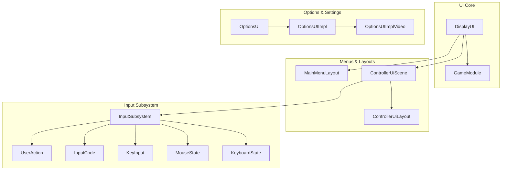
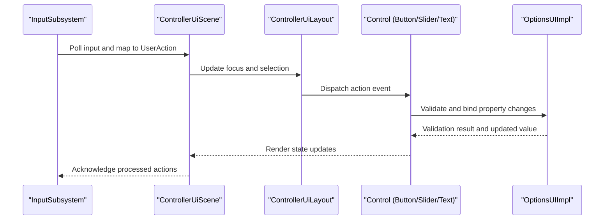
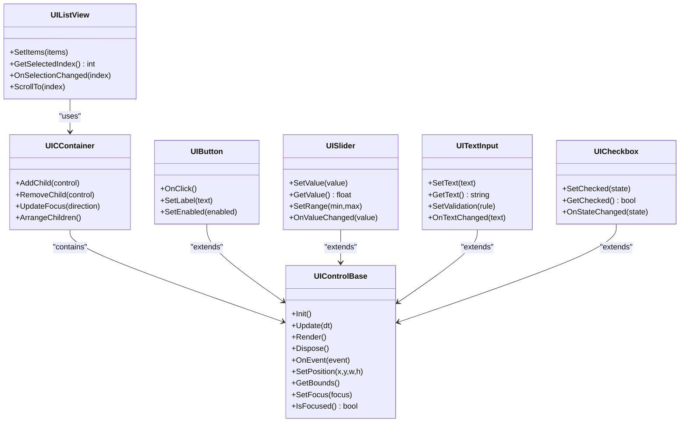
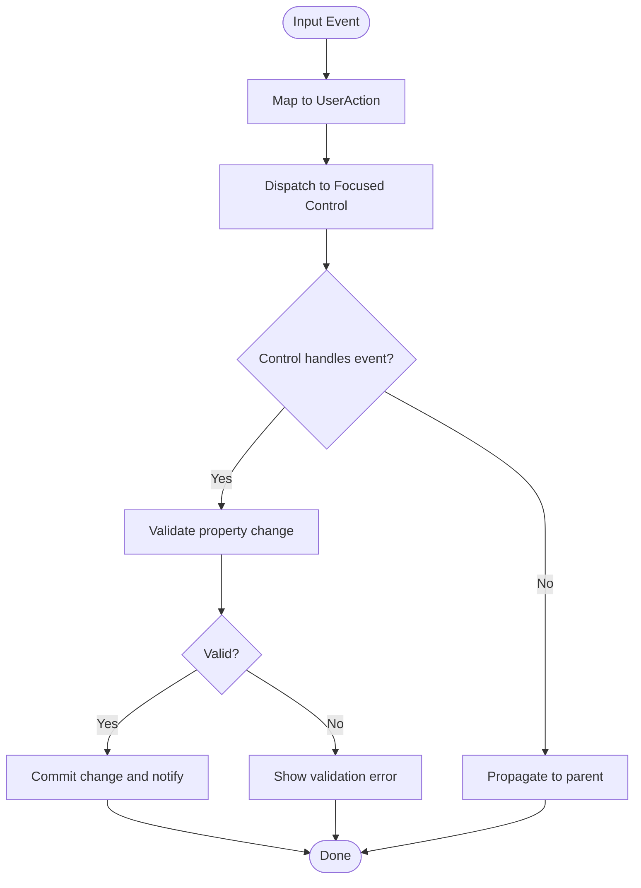
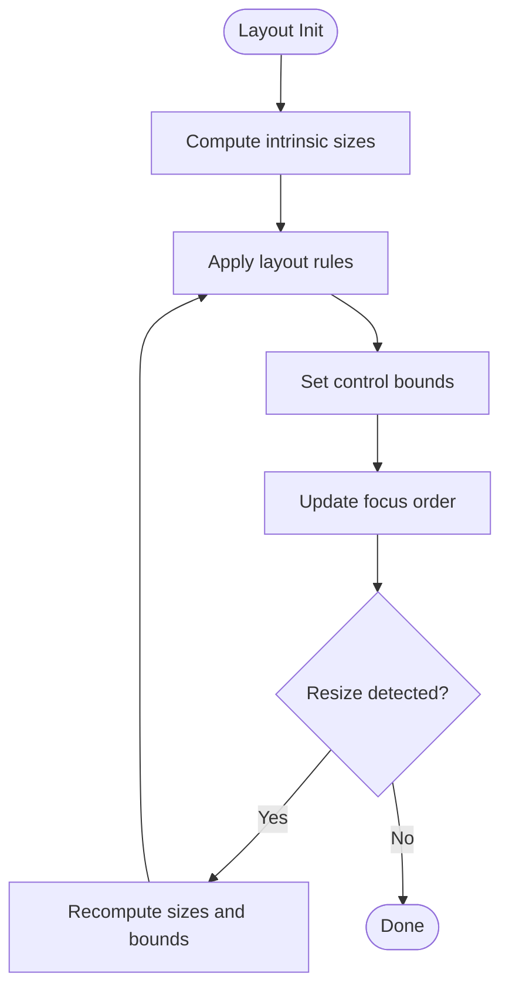
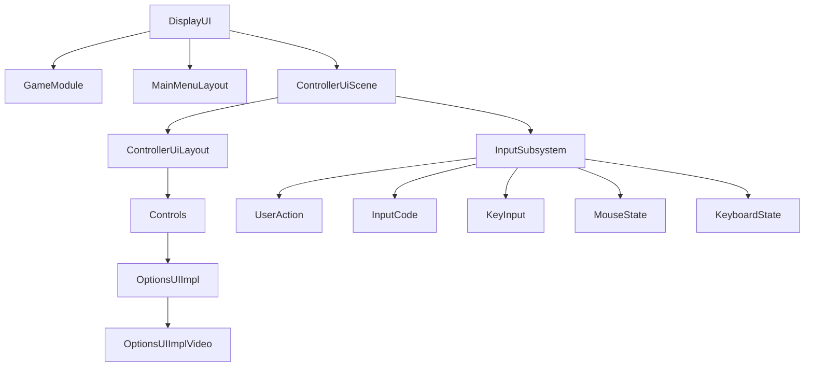

# Control System

<cite>
**Referenced Files in This Document**
- [DisplayUI.hpp](file://engine/Poseidon/UI/DisplayUI.hpp)
- [DisplayUI.cpp](file://engine/Poseidon/UI/DisplayUI.cpp)
- [DisplayUIMenus.cpp](file://engine/Poseidon/UI/DisplayUIMenus.cpp)
- [DisplayUISetup.cpp](file://engine/Poseidon/UI/DisplayUISetup.cpp)
- [OptionsUI.hpp](file://engine/Poseidon/UI/OptionsUI.hpp)
- [OptionsUI.cpp](file://engine/Poseidon/UI/OptionsUI.cpp)
- [OptionsUIImpl.cpp](file://engine/Poseidon/UI/OptionsUIImpl.cpp)
- [OptionsUIImplVideo.cpp](file://engine/Poseidon/UI/OptionsUIImplVideo.cpp)
- [MainMenuLayout.hpp](file://engine/Poseidon/UI/MainMenuLayout.hpp)
- [MainMenuLayout.cpp](file://engine/Poseidon/UI/MainMenuLayout.cpp)
- [GameModule.hpp](file://engine/Poseidon/UI/GameModule.hpp)
- [GameModule.cpp](file://engine/Poseidon/UI/GameModule.cpp)
- [ControllerUiLayout.hpp](file://engine/Poseidon/Input/ControllerUiLayout.hpp)
- [ControllerUiLayout.cpp](file://engine/Poseidon/Input/ControllerUiLayout.cpp)
- [ControllerUiScene.hpp](file://engine/Poseidon/Input/ControllerUiScene.hpp)
- [ControllerUiScene.cpp](file://engine/Poseidon/Input/ControllerUiScene.cpp)
- [InputSubsystem.hpp](file://engine/Poseidon/Input/InputSubsystem.hpp)
- [InputSubsystem.cpp](file://engine/Poseidon/Input/InputSubsystem.cpp)
- [UserAction.hpp](file://engine/Poseidon/Input/UserAction.hpp)
- [InputCode.hpp](file://engine/Poseidon/Input/InputCode.hpp)
- [KeyInput.hpp](file://engine/Poseidon/Input/KeyInput.hpp)
- [KeyInput.cpp](file://engine/Poseidon/Input/KeyInput.cpp)
- [MouseState.hpp](file://engine/Poseidon/Input/MouseState.hpp)
- [MouseState.cpp](file://engine/Poseidon/Input/MouseState.cpp)
- [KeyboardState.hpp](file://engine/Poseidon/Input/KeyboardState.hpp)
- [KeyboardState.cpp](file://engine/Poseidon/Input/KeyboardState.cpp)
</cite>

## Table of Contents
1. [Introduction](#introduction)
2. [Project Structure](#project-structure)
3. [Core Components](#core-components)
4. [Architecture Overview](#architecture-overview)
5. [Detailed Component Analysis](#detailed-component-analysis)
6. [Dependency Analysis](#dependency-analysis)
7. [Performance Considerations](#performance-considerations)
8. [Troubleshooting Guide](#troubleshooting-guide)
9. [Conclusion](#conclusion)
10. [Appendices](#appendices)

## Introduction
This document explains the UI control system that provides reusable interface components for menus, options panels, and in-game overlays. It focuses on the base control architecture, event handling mechanisms, layout positioning, built-in controls (buttons, sliders, text inputs, checkboxes, list views), property binding, validation, styling, composition patterns, accessibility support, and cross-platform considerations. The goal is to help developers extend existing controls, create custom widgets, and implement complex interactive elements with a consistent and maintainable approach.

## Project Structure
The UI control system spans several modules:
- UI core and display management
- Options and settings UI implementation
- Menu layouts and scene orchestration
- Input subsystem and controller UI integration
- Platform input abstractions (keyboard, mouse, key codes)

**Diagram sources**
- [DisplayUI.hpp](file://engine/Poseidon/UI/DisplayUI.hpp)
- [GameModule.hpp](file://engine/Poseidon/UI/GameModule.hpp)
- [OptionsUI.hpp](file://engine/Poseidon/UI/OptionsUI.hpp)
- [OptionsUIImpl.cpp](file://engine/Poseidon/UI/OptionsUIImpl.cpp)
- [OptionsUIImplVideo.cpp](file://engine/Poseidon/UI/OptionsUIImplVideo.cpp)
- [MainMenuLayout.hpp](file://engine/Poseidon/UI/MainMenuLayout.hpp)
- [ControllerUiLayout.hpp](file://engine/Poseidon/Input/ControllerUiLayout.hpp)
- [ControllerUiScene.hpp](file://engine/Poseidon/Input/ControllerUiScene.hpp)
- [InputSubsystem.hpp](file://engine/Poseidon/Input/InputSubsystem.hpp)
- [UserAction.hpp](file://engine/Poseidon/Input/UserAction.hpp)
- [InputCode.hpp](file://engine/Poseidon/Input/InputCode.hpp)
- [KeyInput.hpp](file://engine/Poseidon/Input/KeyInput.hpp)
- [MouseState.hpp](file://engine/Poseidon/Input/MouseState.hpp)
- [KeyboardState.hpp](file://engine/Poseidon/Input/KeyboardState.hpp)

**Section sources**
- [DisplayUI.hpp](file://engine/Poseidon/UI/DisplayUI.hpp)
- [DisplayUI.cpp](file://engine/Poseidon/UI/DisplayUI.cpp)
- [OptionsUI.hpp](file://engine/Poseidon/UI/OptionsUI.hpp)
- [OptionsUI.cpp](file://engine/Poseidon/UI/OptionsUI.cpp)
- [OptionsUIImpl.cpp](file://engine/Poseidon/UI/OptionsUIImpl.cpp)
- [OptionsUIImplVideo.cpp](file://engine/Poseidon/UI/OptionsUIImplVideo.cpp)
- [MainMenuLayout.hpp](file://engine/Poseidon/UI/MainMenuLayout.hpp)
- [MainMenuLayout.cpp](file://engine/Poseidon/UI/MainMenuLayout.cpp)
- [ControllerUiLayout.hpp](file://engine/Poseidon/Input/ControllerUiLayout.hpp)
- [ControllerUiLayout.cpp](file://engine/Poseidon/Input/ControllerUiLayout.cpp)
- [ControllerUiScene.hpp](file://engine/Poseidon/Input/ControllerUiScene.hpp)
- [ControllerUiScene.cpp](file://engine/Poseidon/Input/ControllerUiScene.cpp)
- [InputSubsystem.hpp](file://engine/Poseidon/Input/InputSubsystem.hpp)
- [InputSubsystem.cpp](file://engine/Poseidon/Input/InputSubsystem.cpp)
- [UserAction.hpp](file://engine/Poseidon/Input/UserAction.hpp)
- [InputCode.hpp](file://engine/Poseidon/Input/InputCode.hpp)
- [KeyInput.hpp](file://engine/Poseidon/Input/KeyInput.hpp)
- [KeyInput.cpp](file://engine/Poseidon/Input/KeyInput.cpp)
- [MouseState.hpp](file://engine/Poseidon/Input/MouseState.hpp)
- [MouseState.cpp](file://engine/Poseidon/Input/MouseState.cpp)
- [KeyboardState.hpp](file://engine/Poseidon/Input/KeyboardState.hpp)
- [KeyboardState.cpp](file://engine/Poseidon/Input/KeyboardState.cpp)

## Core Components
- DisplayUI: Manages active displays, transitions, and high-level UI lifecycle. It coordinates between game modules and UI scenes/layouts.
- GameModule: Encapsulates game-specific UI logic and integrates with the display system.
- OptionsUI and implementations: Provide structured settings panels with typed properties, validation, and platform-specific rendering hooks.
- MainMenuLayout and ControllerUiScene: Orchestrate menu composition, focus management, and controller-driven navigation.
- InputSubsystem: Centralizes input polling, action mapping, and dispatch to UI controls.

Key responsibilities:
- Control creation and lifecycle (init, update, render, dispose)
- Event propagation and action dispatch
- Layout and positioning within parent containers
- Property binding and validation pipelines
- Styling and theme application
- Accessibility annotations and focus traversal

**Section sources**
- [DisplayUI.hpp](file://engine/Poseidon/UI/DisplayUI.hpp)
- [DisplayUI.cpp](file://engine/Poseidon/UI/DisplayUI.cpp)
- [GameModule.hpp](file://engine/Poseidon/UI/GameModule.hpp)
- [GameModule.cpp](file://engine/Poseidon/UI/GameModule.cpp)
- [OptionsUI.hpp](file://engine/Poseidon/UI/OptionsUI.hpp)
- [OptionsUI.cpp](file://engine/Poseidon/UI/OptionsUI.cpp)
- [OptionsUIImpl.cpp](file://engine/Poseidon/UI/OptionsUIImpl.cpp)
- [OptionsUIImplVideo.cpp](file://engine/Poseidon/UI/OptionsUIImplVideo.cpp)
- [MainMenuLayout.hpp](file://engine/Poseidon/UI/MainMenuLayout.hpp)
- [MainMenuLayout.cpp](file://engine/Poseidon/UI/MainMenuLayout.cpp)
- [ControllerUiScene.hpp](file://engine/Poseidon/Input/ControllerUiScene.hpp)
- [ControllerUiScene.cpp](file://engine/Poseidon/Input/ControllerUiScene.cpp)
- [InputSubsystem.hpp](file://engine/Poseidon/Input/InputSubsystem.hpp)
- [InputSubsystem.cpp](file://engine/Poseidon/Input/InputSubsystem.cpp)

## Architecture Overview
The UI control system follows a layered architecture:
- Presentation layer: Controls (buttons, sliders, text inputs, checkboxes, lists) rendered by the graphics backend.
- Composition layer: Layouts and scenes manage control hierarchies, focus, and navigation.
- Logic layer: Options and settings provide typed properties, validation, and persistence.
- Input layer: InputSubsystem maps raw input to user actions and dispatches events to controls.

**Diagram sources**
- [InputSubsystem.hpp](file://engine/Poseidon/Input/InputSubsystem.hpp)
- [ControllerUiScene.hpp](file://engine/Poseidon/Input/ControllerUiScene.hpp)
- [ControllerUiLayout.hpp](file://engine/Poseidon/Input/ControllerUiLayout.hpp)
- [OptionsUIImpl.cpp](file://engine/Poseidon/UI/OptionsUIImpl.cpp)

**Section sources**
- [DisplayUI.hpp](file://engine/Poseidon/UI/DisplayUI.hpp)
- [ControllerUiScene.cpp](file://engine/Poseidon/Input/ControllerUiScene.cpp)
- [ControllerUiLayout.cpp](file://engine/Poseidon/Input/ControllerUiLayout.cpp)
- [OptionsUIImpl.cpp](file://engine/Poseidon/UI/OptionsUIImpl.cpp)

## Detailed Component Analysis

### Base Control Architecture
Controls share a common hierarchy:
- Base control defines lifecycle methods, event hooks, and layout primitives.
- Container controls manage child controls and focus traversal.
- Leaf controls implement specific interaction behaviors (button click, slider drag, text edit).

**Diagram sources**
- [DisplayUI.hpp](file://engine/Poseidon/UI/DisplayUI.hpp)
- [OptionsUIImpl.cpp](file://engine/Poseidon/UI/OptionsUIImpl.cpp)
- [ControllerUiLayout.hpp](file://engine/Poseidon/Input/ControllerUiLayout.hpp)

**Section sources**
- [DisplayUI.hpp](file://engine/Poseidon/UI/DisplayUI.hpp)
- [OptionsUIImpl.cpp](file://engine/Poseidon/UI/OptionsUIImpl.cpp)
- [ControllerUiLayout.hpp](file://engine/Poseidon/Input/ControllerUiLayout.hpp)

### Event Handling Mechanisms
- InputSubsystem polls devices and maps raw input to UserAction identifiers.
- ControllerUiScene receives mapped actions and forwards them to focused controls via ControllerUiLayout.
- Controls handle events through virtual callbacks; they can propagate or consume events.
- Validation occurs before committing property changes; errors are surfaced to the control for feedback.

**Diagram sources**
- [InputSubsystem.hpp](file://engine/Poseidon/Input/InputSubsystem.hpp)
- [ControllerUiScene.hpp](file://engine/Poseidon/Input/ControllerUiScene.hpp)
- [ControllerUiLayout.hpp](file://engine/Poseidon/Input/ControllerUiLayout.hpp)
- [OptionsUIImpl.cpp](file://engine/Poseidon/UI/OptionsUIImpl.cpp)

**Section sources**
- [InputSubsystem.cpp](file://engine/Poseidon/Input/InputSubsystem.cpp)
- [ControllerUiScene.cpp](file://engine/Poseidon/Input/ControllerUiScene.cpp)
- [ControllerUiLayout.cpp](file://engine/Poseidon/Input/ControllerUiLayout.cpp)
- [OptionsUIImpl.cpp](file://engine/Poseidon/UI/OptionsUIImpl.cpp)

### Layout Positioning
- Controls define bounds relative to their parent container.
- Layout managers arrange children using rules (stack, grid, flow).
- Focus traversal respects visual order and explicit tab order.
- Responsive adjustments recalculate positions on resize.

**Diagram sources**
- [ControllerUiLayout.hpp](file://engine/Poseidon/Input/ControllerUiLayout.hpp)
- [ControllerUiLayout.cpp](file://engine/Poseidon/Input/ControllerUiLayout.cpp)

**Section sources**
- [ControllerUiLayout.cpp](file://engine/Poseidon/Input/ControllerUiLayout.cpp)

### Built-in Controls
- Buttons: Trigger actions on press; support labels, enabled states, and keyboard/mouse/controller activation.
- Sliders: Bind numeric values with min/max ranges; support step increments and formatting.
- Text Inputs: Accept user text with validation rules; support placeholders and input masks.
- Checkboxes: Toggle boolean states; integrate with option toggles.
- List Views: Display selectable items; support scrolling, selection, and item delegates.

Implementation highlights:
- Creation: Factory functions or declarative builders instantiate controls and attach to containers.
- Property binding: Two-way binding connects control properties to model fields.
- Validation: Rules applied on change; errors displayed inline.
- Styling: Theme-aware colors, fonts, and textures; hover/focus states.

**Section sources**
- [OptionsUIImpl.cpp](file://engine/Poseidon/UI/OptionsUIImpl.cpp)
- [OptionsUIImplVideo.cpp](file://engine/Poseidon/UI/OptionsUIImplVideo.cpp)
- [ControllerUiLayout.hpp](file://engine/Poseidon/Input/ControllerUiLayout.hpp)

### Control Creation, Property Binding, Validation, and Styling
- Creation: Use container APIs to add controls; set initial properties and event handlers.
- Binding: Bind control properties to data sources; updates propagate automatically.
- Validation: Attach validators to inputs; show messages and prevent invalid commits.
- Styling: Apply themes and style overrides; customize appearance per control type.

Practical examples:
- Extending an existing control: Override event handlers and add new properties; reuse base layout and rendering.
- Creating a custom widget: Compose multiple controls; implement focus traversal and accessibility labels.
- Complex interactive elements: Combine sliders and text inputs; synchronize state across controls.

**Section sources**
- [OptionsUIImpl.cpp](file://engine/Poseidon/UI/OptionsUIImpl.cpp)
- [OptionsUIImplVideo.cpp](file://engine/Poseidon/UI/OptionsUIImplVideo.cpp)

### Control Composition Patterns
- Composite controls: Group related controls into reusable units (e.g., volume control with slider and label).
- Delegates: Separate item rendering and behavior from list data.
- Presenters: Manage view state and interactions without embedding logic in controls.

Accessibility support:
- Labels and descriptions for screen readers.
- Focus indicators and keyboard navigation.
- High contrast and scalable text options.

Cross-platform compatibility:
- Abstract input interfaces for keyboard, mouse, and controller.
- Platform-specific rendering hooks for native look-and-feel.
- Consistent behavior across Windows and Linux builds.

**Section sources**
- [ControllerUiLayout.hpp](file://engine/Poseidon/Input/ControllerUiLayout.hpp)
- [ControllerUiLayout.cpp](file://engine/Poseidon/Input/ControllerUiLayout.cpp)
- [InputSubsystem.hpp](file://engine/Poseidon/Input/InputSubsystem.hpp)
- [InputSubsystem.cpp](file://engine/Poseidon/Input/InputSubsystem.cpp)

## Dependency Analysis
The UI control system depends on:
- DisplayUI for lifecycle and scene management
- InputSubsystem for event mapping and dispatch
- OptionsUI implementations for settings logic
- ControllerUiLayout and ControllerUiScene for navigation and focus

**Diagram sources**
- [DisplayUI.hpp](file://engine/Poseidon/UI/DisplayUI.hpp)
- [GameModule.hpp](file://engine/Poseidon/UI/GameModule.hpp)
- [MainMenuLayout.hpp](file://engine/Poseidon/UI/MainMenuLayout.hpp)
- [ControllerUiScene.hpp](file://engine/Poseidon/Input/ControllerUiScene.hpp)
- [ControllerUiLayout.hpp](file://engine/Poseidon/Input/ControllerUiLayout.hpp)
- [OptionsUIImpl.cpp](file://engine/Poseidon/UI/OptionsUIImpl.cpp)
- [OptionsUIImplVideo.cpp](file://engine/Poseidon/UI/OptionsUIImplVideo.cpp)
- [InputSubsystem.hpp](file://engine/Poseidon/Input/InputSubsystem.hpp)
- [UserAction.hpp](file://engine/Poseidon/Input/UserAction.hpp)
- [InputCode.hpp](file://engine/Poseidon/Input/InputCode.hpp)
- [KeyInput.hpp](file://engine/Poseidon/Input/KeyInput.hpp)
- [MouseState.hpp](file://engine/Poseidon/Input/MouseState.hpp)
- [KeyboardState.hpp](file://engine/Poseidon/Input/KeyboardState.hpp)

**Section sources**
- [DisplayUI.cpp](file://engine/Poseidon/UI/DisplayUI.cpp)
- [GameModule.cpp](file://engine/Poseidon/UI/GameModule.cpp)
- [MainMenuLayout.cpp](file://engine/Poseidon/UI/MainMenuLayout.cpp)
- [ControllerUiScene.cpp](file://engine/Poseidon/Input/ControllerUiScene.cpp)
- [ControllerUiLayout.cpp](file://engine/Poseidon/Input/ControllerUiLayout.cpp)
- [OptionsUIImpl.cpp](file://engine/Poseidon/UI/OptionsUIImpl.cpp)
- [OptionsUIImplVideo.cpp](file://engine/Poseidon/UI/OptionsUIImplVideo.cpp)
- [InputSubsystem.cpp](file://engine/Poseidon/Input/InputSubsystem.cpp)

## Performance Considerations
- Minimize control updates: Batch property changes and invalidate only affected regions.
- Efficient layout passes: Avoid recalculating full layouts on minor changes; use incremental updates.
- Input throttling: Debounce rapid input events to reduce processing overhead.
- Rendering optimization: Reuse textures and fonts; avoid frequent allocations during frame updates.
- Memory management: Dispose unused controls promptly; prefer object pools for frequently created controls.

[No sources needed since this section provides general guidance]

## Troubleshooting Guide
Common issues and resolutions:
- Events not firing: Verify input mapping and focus state; ensure control is enabled and visible.
- Validation errors not shown: Confirm validators are attached and error display logic is implemented.
- Layout misalignment: Check parent-child bounds and layout rules; debug intrinsic sizes.
- Cross-platform differences: Inspect platform-specific input and rendering paths; normalize behavior.

Debugging tips:
- Log event dispatch and validation results.
- Visualize focus order and control bounds.
- Isolate problematic controls by disabling siblings.

**Section sources**
- [InputSubsystem.cpp](file://engine/Poseidon/Input/InputSubsystem.cpp)
- [ControllerUiScene.cpp](file://engine/Poseidon/Input/ControllerUiScene.cpp)
- [ControllerUiLayout.cpp](file://engine/Poseidon/Input/ControllerUiLayout.cpp)
- [OptionsUIImpl.cpp](file://engine/Poseidon/UI/OptionsUIImpl.cpp)

## Conclusion
The UI control system provides a robust foundation for building interactive interfaces with consistent behavior across platforms. By leveraging the base control architecture, event handling mechanisms, and layout positioning, developers can create reusable components and complex interactive elements efficiently. Adhering to composition patterns, accessibility standards, and performance best practices ensures a high-quality user experience.

[No sources needed since this section summarizes without analyzing specific files]

## Appendices
- Best practices for extending controls and creating custom widgets
- Guidelines for implementing validation and styling
- Examples of composing complex interactive elements
- Accessibility checklist for UI controls

[No sources needed since this section provides general guidance]