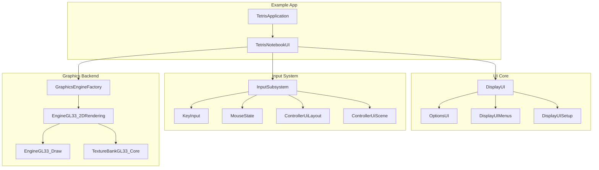
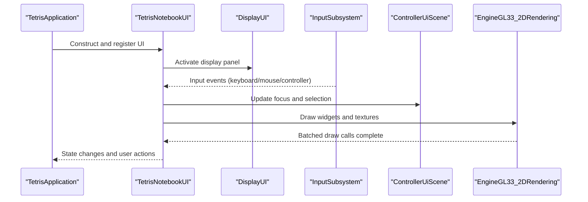
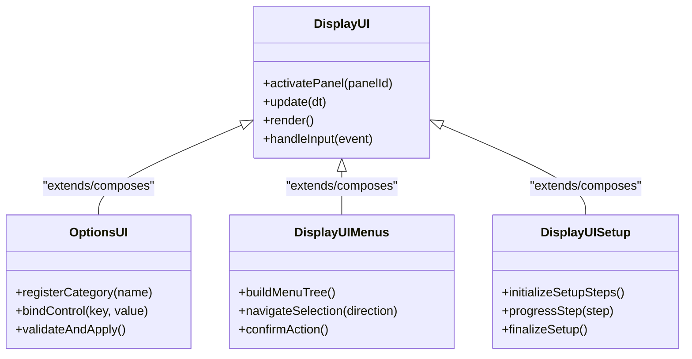
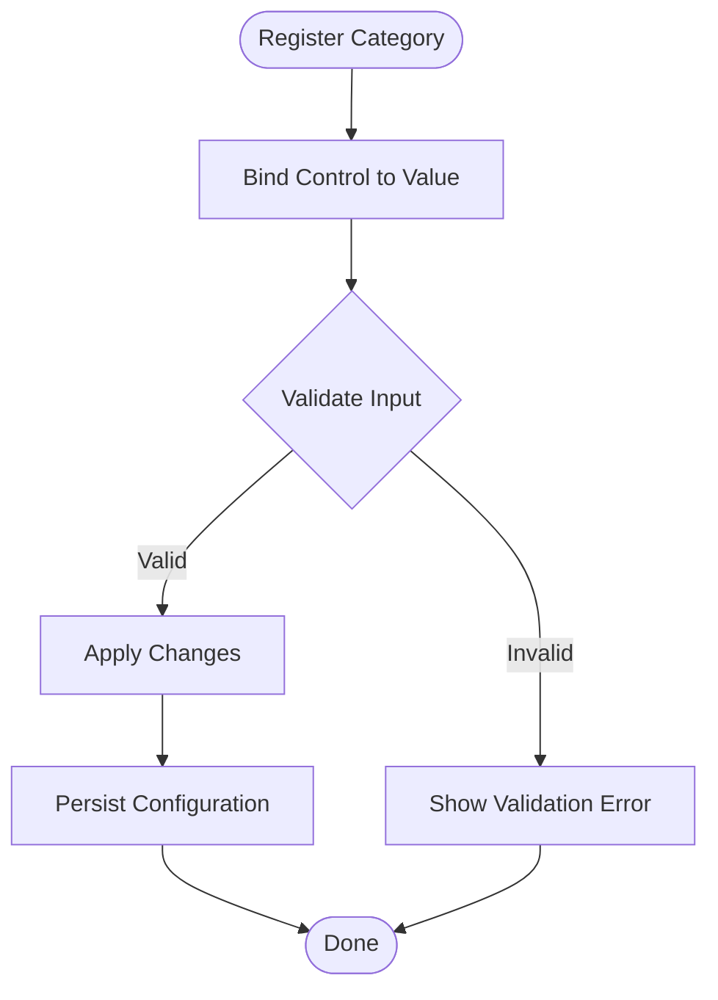
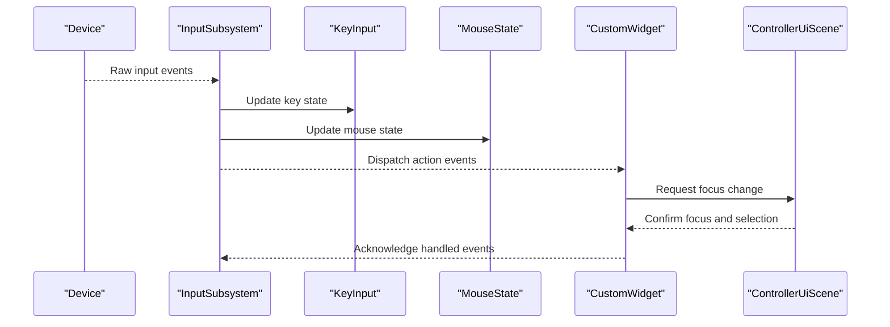
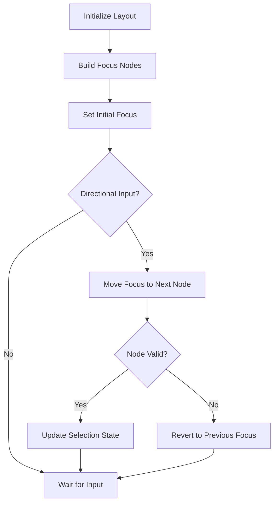
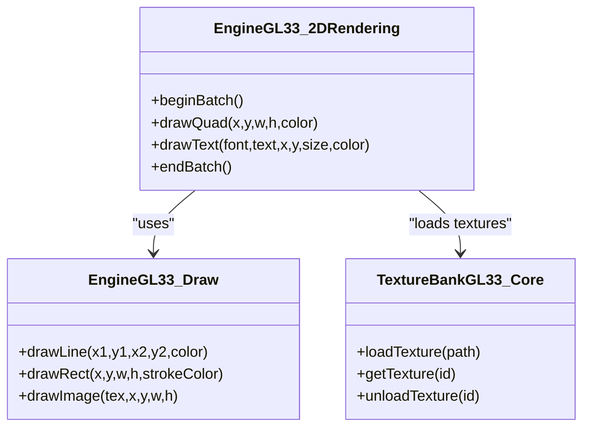
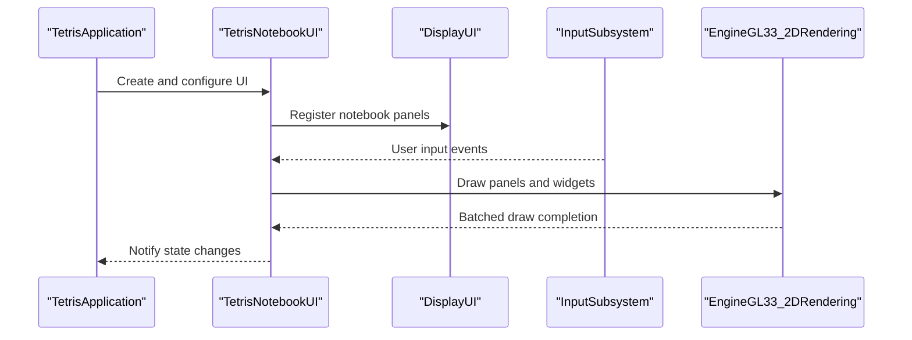
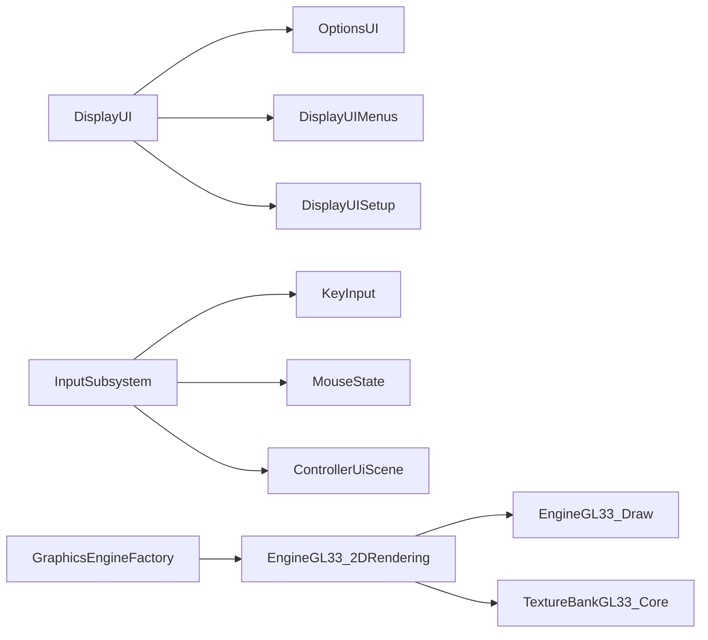

# Custom Widget Development

<cite>
**Referenced Files in This Document**
- [DisplayUI.hpp](file://engine/Poseidon/UI/DisplayUI.hpp)
- [DisplayUI.cpp](file://engine/Poseidon/UI/DisplayUI.cpp)
- [DisplayUIMenus.cpp](file://engine/Poseidon/UI/DisplayUIMenus.cpp)
- [DisplayUISetup.cpp](file://engine/Poseidon/UI/DisplayUISetup.cpp)
- [OptionsUI.hpp](file://engine/Poseidon/UI/OptionsUI.hpp)
- [OptionsUI.cpp](file://engine/Poseidon/UI/OptionsUI.cpp)
- [OptionsUIImpl.cpp](file://engine/Poseidon/UI/OptionsUIImpl.cpp)
- [OptionsUIImplVideo.cpp](file://engine/Poseidon/UI/OptionsUIImplVideo.cpp)
- [ControllerUiLayout.hpp](file://engine/Poseidon/Input/ControllerUiLayout.hpp)
- [ControllerUiLayout.cpp](file://engine/Poseidon/Input/ControllerUiLayout.cpp)
- [ControllerUiScene.hpp](file://engine/Poseidon/Input/ControllerUiScene.hpp)
- [ControllerUiScene.cpp](file://engine/Poseidon/Input/ControllerUiScene.cpp)
- [InputSubsystem.hpp](file://engine/Poseidon/Input/InputSubsystem.hpp)
- [InputSubsystem.cpp](file://engine/Poseidon/Input/InputSubsystem.cpp)
- [KeyInput.hpp](file://engine/Poseidon/Input/KeyInput.hpp)
- [KeyInput.cpp](file://engine/Poseidon/Input/KeyInput.cpp)
- [MouseState.hpp](file://engine/Poseidon/Input/MouseState.hpp)
- [MouseState.cpp](file://engine/Poseidon/Input/MouseState.cpp)
- [GraphicsEngineFactory.hpp](file://engine/Poseidon/Graphics/GraphicsEngineFactory.hpp)
- [EngineGL33_2DRendering.cpp](file://engine/Poseidon/Graphics/PoseidonGL33/EngineGL33_2DRendering.cpp)
- [EngineGL33_Draw.cpp](file://engine/Poseidon/Graphics/PoseidonGL33/EngineGL33_Draw.cpp)
- [TextureBankGL33_Core.cpp](file://engine/Poseidon/Graphics/PoseidonGL33/TextureBankGL33_Core.cpp)
- [TetrisNotebookUI.hpp](file://apps/tetris/Tetris/TetrisNotebookUI.hpp)
- [TetrisNotebookUI.cpp](file://apps/tetris/Tetris/TetrisNotebookUI.cpp)
- [TetrisApplication.hpp](file://apps/tetris/Tetris/TetrisApplication.hpp)
- [TetrisApplication.cpp](file://apps/tetris/Tetris/TetrisApplication.cpp)
</cite>

## Table of Contents
1. [Introduction](#introduction)
2. [Project Structure](#project-structure)
3. [Core Components](#core-components)
4. [Architecture Overview](#architecture-overview)
5. [Detailed Component Analysis](#detailed-component-analysis)
6. [Dependency Analysis](#dependency-analysis)
7. [Performance Considerations](#performance-considerations)
8. [Troubleshooting Guide](#troubleshooting-guide)
9. [Conclusion](#conclusion)
10. [Appendices](#appendices)

## Introduction
This document explains how to develop custom UI widgets and extend the control system within the project. It covers widget creation, inheritance from base classes, event handling, custom rendering, property systems, validation, styling, layout integration, testing strategies, performance optimization, debugging techniques, and best practices for maintainable widget development. The guidance is grounded in the existing UI subsystems and examples present in the codebase.

## Project Structure
The UI framework spans several engine modules:
- UI core and displays: Display management, menus, setup screens, options UI
- Input subsystem: Keyboard, mouse, controller input, and controller UI scenes
- Graphics backend: 2D rendering and texture management used by UI
- Example application: A Tetris app demonstrating a custom UI implementation

**Diagram sources**
- [DisplayUI.hpp](file://engine/Poseidon/UI/DisplayUI.hpp)
- [DisplayUIMenus.cpp](file://engine/Poseidon/UI/DisplayUIMenus.cpp)
- [DisplayUISetup.cpp](file://engine/Poseidon/UI/DisplayUISetup.cpp)
- [OptionsUI.hpp](file://engine/Poseidon/UI/OptionsUI.hpp)
- [OptionsUI.cpp](file://engine/Poseidon/UI/OptionsUI.cpp)
- [OptionsUIImpl.cpp](file://engine/Poseidon/UI/OptionsUIImpl.cpp)
- [OptionsUIImplVideo.cpp](file://engine/Poseidon/UI/OptionsUIImplVideo.cpp)
- [InputSubsystem.hpp](file://engine/Poseidon/Input/InputSubsystem.hpp)
- [InputSubsystem.cpp](file://engine/Poseidon/Input/InputSubsystem.cpp)
- [KeyInput.hpp](file://engine/Poseidon/Input/KeyInput.hpp)
- [KeyInput.cpp](file://engine/Poseidon/Input/KeyInput.cpp)
- [MouseState.hpp](file://engine/Poseidon/Input/MouseState.hpp)
- [MouseState.cpp](file://engine/Poseidon/Input/MouseState.cpp)
- [ControllerUiLayout.hpp](file://engine/Poseidon/Input/ControllerUiLayout.hpp)
- [ControllerUiLayout.cpp](file://engine/Poseidon/Input/ControllerUiLayout.cpp)
- [ControllerUiScene.hpp](file://engine/Poseidon/Input/ControllerUiScene.hpp)
- [ControllerUiScene.cpp](file://engine/Poseidon/Input/ControllerUiScene.cpp)
- [GraphicsEngineFactory.hpp](file://engine/Poseidon/Graphics/GraphicsEngineFactory.hpp)
- [EngineGL33_2DRendering.cpp](file://engine/Poseidon/Graphics/PoseidonGL33/EngineGL33_2DRendering.cpp)
- [EngineGL33_Draw.cpp](file://engine/Poseidon/Graphics/PoseidonGL33/EngineGL33_Draw.cpp)
- [TextureBankGL33_Core.cpp](file://engine/Poseidon/Graphics/PoseidonGL33/TextureBankGL33_Core.cpp)
- [TetrisApplication.hpp](file://apps/tetris/Tetris/TetrisApplication.hpp)
- [TetrisApplication.cpp](file://apps/tetris/Tetris/TetrisApplication.cpp)
- [TetrisNotebookUI.hpp](file://apps/tetris/Tetris/TetrisNotebookUI.hpp)
- [TetrisNotebookUI.cpp](file://apps/tetris/Tetris/TetrisNotebookUI.cpp)

**Section sources**
- [DisplayUI.hpp](file://engine/Poseidon/UI/DisplayUI.hpp)
- [DisplayUIMenus.cpp](file://engine/Poseidon/UI/DisplayUIMenus.cpp)
- [DisplayUISetup.cpp](file://engine/Poseidon/UI/DisplayUISetup.cpp)
- [OptionsUI.hpp](file://engine/Poseidon/UI/OptionsUI.hpp)
- [OptionsUI.cpp](file://engine/Poseidon/UI/OptionsUI.cpp)
- [OptionsUIImpl.cpp](file://engine/Poseidon/UI/OptionsUIImpl.cpp)
- [OptionsUIImplVideo.cpp](file://engine/Poseidon/UI/OptionsUIImplVideo.cpp)
- [InputSubsystem.hpp](file://engine/Poseidon/Input/InputSubsystem.hpp)
- [InputSubsystem.cpp](file://engine/Poseidon/Input/InputSubsystem.cpp)
- [KeyInput.hpp](file://engine/Poseidon/Input/KeyInput.hpp)
- [KeyInput.cpp](file://engine/Poseidon/Input/KeyInput.cpp)
- [MouseState.hpp](file://engine/Poseidon/Input/MouseState.hpp)
- [MouseState.cpp](file://engine/Poseidon/Input/MouseState.cpp)
- [ControllerUiLayout.hpp](file://engine/Poseidon/Input/ControllerUiLayout.hpp)
- [ControllerUiLayout.cpp](file://engine/Poseidon/Input/ControllerUiLayout.cpp)
- [ControllerUiScene.hpp](file://engine/Poseidon/Input/ControllerUiScene.hpp)
- [ControllerUiScene.cpp](file://engine/Poseidon/Input/ControllerUiScene.cpp)
- [GraphicsEngineFactory.hpp](file://engine/Poseidon/Graphics/GraphicsEngineFactory.hpp)
- [EngineGL33_2DRendering.cpp](file://engine/Poseidon/Graphics/PoseidonGL33/EngineGL33_2DRendering.cpp)
- [EngineGL33_Draw.cpp](file://engine/Poseidon/Graphics/PoseidonGL33/EngineGL33_Draw.cpp)
- [TextureBankGL33_Core.cpp](file://engine/Poseidon/Graphics/PoseidonGL33/TextureBankGL33_Core.cpp)
- [TetrisApplication.hpp](file://apps/tetris/Tetris/TetrisApplication.hpp)
- [TetrisApplication.cpp](file://apps/tetris/Tetris/TetrisApplication.cpp)
- [TetrisNotebookUI.hpp](file://apps/tetris/Tetris/TetrisNotebookUI.hpp)
- [TetrisNotebookUI.cpp](file://apps/tetris/Tetris/TetrisNotebookUI.cpp)

## Core Components
- Display management: Centralized display lifecycle and routing for UI panels and menus.
- Options UI: A structured approach to building settings screens with grouped controls and validation.
- Input subsystem: Unified input abstraction for keyboard, mouse, and controller events that drive UI interactions.
- Controller UI scene/layout: Specialized UI components designed for gamepad navigation and focus management.
- Graphics backend: 2D rendering pipeline and texture management used by UI elements.
- Example UI: A concrete implementation showing how to assemble reusable widgets and integrate with layout and input.

Key responsibilities:
- DisplayUI coordinates active displays and dispatches updates.
- OptionsUI organizes settings categories and binds controls to values.
- InputSubsystem aggregates input sources and forwards events to UI layers.
- ControllerUiScene manages focus traversal and selection states.
- EngineGL33_2DRendering provides drawing primitives and batching for UI.

**Section sources**
- [DisplayUI.hpp](file://engine/Poseidon/UI/DisplayUI.hpp)
- [DisplayUIMenus.cpp](file://engine/Poseidon/UI/DisplayUIMenus.cpp)
- [DisplayUISetup.cpp](file://engine/Poseidon/UI/DisplayUISetup.cpp)
- [OptionsUI.hpp](file://engine/Poseidon/UI/OptionsUI.hpp)
- [OptionsUI.cpp](file://engine/Poseidon/UI/OptionsUI.cpp)
- [OptionsUIImpl.cpp](file://engine/Poseidon/UI/OptionsUIImpl.cpp)
- [OptionsUIImplVideo.cpp](file://engine/Poseidon/UI/OptionsUIImplVideo.cpp)
- [InputSubsystem.hpp](file://engine/Poseidon/Input/InputSubsystem.hpp)
- [InputSubsystem.cpp](file://engine/Poseidon/Input/InputSubsystem.cpp)
- [ControllerUiLayout.hpp](file://engine/Poseidon/Input/ControllerUiLayout.hpp)
- [ControllerUiLayout.cpp](file://engine/Poseidon/Input/ControllerUiLayout.cpp)
- [ControllerUiScene.hpp](file://engine/Poseidon/Input/ControllerUiScene.hpp)
- [ControllerUiScene.cpp](file://engine/Poseidon/Input/ControllerUiScene.cpp)
- [EngineGL33_2DRendering.cpp](file://engine/Poseidon/Graphics/PoseidonGL33/EngineGL33_2DRendering.cpp)
- [EngineGL33_Draw.cpp](file://engine/Poseidon/Graphics/PoseidonGL33/EngineGL33_Draw.cpp)
- [TextureBankGL33_Core.cpp](file://engine/Poseidon/Graphics/PoseidonGL33/TextureBankGL33_Core.cpp)

## Architecture Overview
The UI architecture follows a layered design:
- Application layer constructs and owns UI components (e.g., TetrisApplication).
- Display layer manages visible panels and transitions.
- Control layer implements interactive widgets and behaviors.
- Input layer abstracts device-specific events into UI actions.
- Rendering layer draws widgets using the graphics backend.

**Diagram sources**
- [TetrisApplication.hpp](file://apps/tetris/Tetris/TetrisApplication.hpp)
- [TetrisApplication.cpp](file://apps/tetris/Tetris/TetrisApplication.cpp)
- [TetrisNotebookUI.hpp](file://apps/tetris/Tetris/TetrisNotebookUI.hpp)
- [TetrisNotebookUI.cpp](file://apps/tetris/Tetris/TetrisNotebookUI.cpp)
- [DisplayUI.hpp](file://engine/Poseidon/UI/DisplayUI.hpp)
- [InputSubsystem.hpp](file://engine/Poseidon/Input/InputSubsystem.hpp)
- [ControllerUiScene.hpp](file://engine/Poseidon/Input/ControllerUiScene.hpp)
- [EngineGL33_2DRendering.cpp](file://engine/Poseidon/Graphics/PoseidonGL33/EngineGL33_2DRendering.cpp)

## Detailed Component Analysis

### Display Management and Panels
- DisplayUI centralizes panel activation, lifecycle, and update cycles.
- Menus and setup screens are implemented as specialized displays.
- Use this pattern to create custom panels that inherit or compose display behavior.

**Diagram sources**
- [DisplayUI.hpp](file://engine/Poseidon/UI/DisplayUI.hpp)
- [OptionsUI.hpp](file://engine/Poseidon/UI/OptionsUI.hpp)
- [DisplayUIMenus.cpp](file://engine/Poseidon/UI/DisplayUIMenus.cpp)
- [DisplayUISetup.cpp](file://engine/Poseidon/UI/DisplayUISetup.cpp)

**Section sources**
- [DisplayUI.hpp](file://engine/Poseidon/UI/DisplayUI.hpp)
- [DisplayUIMenus.cpp](file://engine/Poseidon/UI/DisplayUIMenus.cpp)
- [DisplayUISetup.cpp](file://engine/Poseidon/UI/DisplayUISetup.cpp)
- [OptionsUI.hpp](file://engine/Poseidon/UI/OptionsUI.hpp)
- [OptionsUI.cpp](file://engine/Poseidon/UI/OptionsUI.cpp)

### Options UI and Property Binding
- OptionsUI demonstrates grouping controls, binding to configuration values, and applying validated changes.
- Implement custom settings pages by registering categories and bindings, then validating inputs before committing.

**Diagram sources**
- [OptionsUI.hpp](file://engine/Poseidon/UI/OptionsUI.hpp)
- [OptionsUI.cpp](file://engine/Poseidon/UI/OptionsUI.cpp)
- [OptionsUIImpl.cpp](file://engine/Poseidon/UI/OptionsUIImpl.cpp)
- [OptionsUIImplVideo.cpp](file://engine/Poseidon/UI/OptionsUIImplVideo.cpp)

**Section sources**
- [OptionsUI.hpp](file://engine/Poseidon/UI/OptionsUI.hpp)
- [OptionsUI.cpp](file://engine/Poseidon/UI/OptionsUI.cpp)
- [OptionsUIImpl.cpp](file://engine/Poseidon/UI/OptionsUIImpl.cpp)
- [OptionsUIImplVideo.cpp](file://engine/Poseidon/UI/OptionsUIImplVideo.cpp)

### Input Subsystem and Event Handling
- InputSubsystem aggregates keyboard, mouse, and controller input and forwards events to UI layers.
- KeyInput and MouseState provide low-level state tracking; ControllerUiScene handles focus and selection.

**Diagram sources**
- [InputSubsystem.hpp](file://engine/Poseidon/Input/InputSubsystem.hpp)
- [InputSubsystem.cpp](file://engine/Poseidon/Input/InputSubsystem.cpp)
- [KeyInput.hpp](file://engine/Poseidon/Input/KeyInput.hpp)
- [KeyInput.cpp](file://engine/Poseidon/Input/KeyInput.cpp)
- [MouseState.hpp](file://engine/Poseidon/Input/MouseState.hpp)
- [MouseState.cpp](file://engine/Poseidon/Input/MouseState.cpp)
- [ControllerUiScene.hpp](file://engine/Poseidon/Input/ControllerUiScene.hpp)
- [ControllerUiScene.cpp](file://engine/Poseidon/Input/ControllerUiScene.cpp)

**Section sources**
- [InputSubsystem.hpp](file://engine/Poseidon/Input/InputSubsystem.hpp)
- [InputSubsystem.cpp](file://engine/Poseidon/Input/InputSubsystem.cpp)
- [KeyInput.hpp](file://engine/Poseidon/Input/KeyInput.hpp)
- [KeyInput.cpp](file://engine/Poseidon/Input/KeyInput.cpp)
- [MouseState.hpp](file://engine/Poseidon/Input/MouseState.hpp)
- [MouseState.cpp](file://engine/Poseidon/Input/MouseState.cpp)
- [ControllerUiScene.hpp](file://engine/Poseidon/Input/ControllerUiScene.hpp)
- [ControllerUiScene.cpp](file://engine/Poseidon/Input/ControllerUiScene.cpp)

### Controller UI Layout and Focus Management
- ControllerUiLayout defines navigation paths and focus order for gamepad-driven interfaces.
- ControllerUiScene maintains current focus, selection state, and responds to directional input.

**Diagram sources**
- [ControllerUiLayout.hpp](file://engine/Poseidon/Input/ControllerUiLayout.hpp)
- [ControllerUiLayout.cpp](file://engine/Poseidon/Input/ControllerUiLayout.cpp)
- [ControllerUiScene.hpp](file://engine/Poseidon/Input/ControllerUiScene.hpp)
- [ControllerUiScene.cpp](file://engine/Poseidon/Input/ControllerUiScene.cpp)

**Section sources**
- [ControllerUiLayout.hpp](file://engine/Poseidon/Input/ControllerUiLayout.hpp)
- [ControllerUiLayout.cpp](file://engine/Poseidon/Input/ControllerUiLayout.cpp)
- [ControllerUiScene.hpp](file://engine/Poseidon/Input/ControllerUiScene.hpp)
- [ControllerUiScene.cpp](file://engine/Poseidon/Input/ControllerUiScene.cpp)

### Custom Rendering Pipeline
- EngineGL33_2DRendering provides drawing primitives and batching for UI elements.
- TextureBankGL33_Core manages texture resources used by widgets.
- EngineGL33_Draw exposes drawing operations for shapes, text, and images.

**Diagram sources**
- [EngineGL33_2DRendering.cpp](file://engine/Poseidon/Graphics/PoseidonGL33/EngineGL33_2DRendering.cpp)
- [EngineGL33_Draw.cpp](file://engine/Poseidon/Graphics/PoseidonGL33/EngineGL33_Draw.cpp)
- [TextureBankGL33_Core.cpp](file://engine/Poseidon/Graphics/PoseidonGL33/TextureBankGL33_Core.cpp)

**Section sources**
- [EngineGL33_2DRendering.cpp](file://engine/Poseidon/Graphics/PoseidonGL33/EngineGL33_2DRendering.cpp)
- [EngineGL33_Draw.cpp](file://engine/Poseidon/Graphics/PoseidonGL33/EngineGL33_Draw.cpp)
- [TextureBankGL33_Core.cpp](file://engine/Poseidon/Graphics/PoseidonGL33/TextureBankGL33_Core.cpp)

### Example: Tetris Notebook UI
- TetrisApplication constructs the application and registers the UI.
- TetrisNotebookUI demonstrates assembling reusable widgets, integrating with layout, and handling input-driven interactions.

**Diagram sources**
- [TetrisApplication.hpp](file://apps/tetris/Tetris/TetrisApplication.hpp)
- [TetrisApplication.cpp](file://apps/tetris/Tetris/TetrisApplication.cpp)
- [TetrisNotebookUI.hpp](file://apps/tetris/Tetris/TetrisNotebookUI.hpp)
- [TetrisNotebookUI.cpp](file://apps/tetris/Tetris/TetrisNotebookUI.cpp)
- [DisplayUI.hpp](file://engine/Poseidon/UI/DisplayUI.hpp)
- [InputSubsystem.hpp](file://engine/Poseidon/Input/InputSubsystem.hpp)
- [EngineGL33_2DRendering.cpp](file://engine/Poseidon/Graphics/PoseidonGL33/EngineGL33_2DRendering.cpp)

**Section sources**
- [TetrisApplication.hpp](file://apps/tetris/Tetris/TetrisApplication.hpp)
- [TetrisApplication.cpp](file://apps/tetris/Tetris/TetrisApplication.cpp)
- [TetrisNotebookUI.hpp](file://apps/tetris/Tetris/TetrisNotebookUI.hpp)
- [TetrisNotebookUI.cpp](file://apps/tetris/Tetris/TetrisNotebookUI.cpp)

## Dependency Analysis
The UI system exhibits clear separation of concerns:
- DisplayUI depends on OptionsUI, DisplayUIMenus, and DisplayUISetup for specific panels.
- InputSubsystem composes KeyInput, MouseState, and ControllerUiScene to deliver unified events.
- Rendering uses GraphicsEngineFactory to obtain the appropriate backend and delegates drawing to EngineGL33_2DRendering and EngineGL33_Draw.
- Texture resources are managed centrally via TextureBankGL33_Core.

**Diagram sources**
- [DisplayUI.hpp](file://engine/Poseidon/UI/DisplayUI.hpp)
- [OptionsUI.hpp](file://engine/Poseidon/UI/OptionsUI.hpp)
- [DisplayUIMenus.cpp](file://engine/Poseidon/UI/DisplayUIMenus.cpp)
- [DisplayUISetup.cpp](file://engine/Poseidon/UI/DisplayUISetup.cpp)
- [InputSubsystem.hpp](file://engine/Poseidon/Input/InputSubsystem.hpp)
- [KeyInput.hpp](file://engine/Poseidon/Input/KeyInput.hpp)
- [MouseState.hpp](file://engine/Poseidon/Input/MouseState.hpp)
- [ControllerUiScene.hpp](file://engine/Poseidon/Input/ControllerUiScene.hpp)
- [GraphicsEngineFactory.hpp](file://engine/Poseidon/Graphics/GraphicsEngineFactory.hpp)
- [EngineGL33_2DRendering.cpp](file://engine/Poseidon/Graphics/PoseidonGL33/EngineGL33_2DRendering.cpp)
- [EngineGL33_Draw.cpp](file://engine/Poseidon/Graphics/PoseidonGL33/EngineGL33_Draw.cpp)
- [TextureBankGL33_Core.cpp](file://engine/Poseidon/Graphics/PoseidonGL33/TextureBankGL33_Core.cpp)

**Section sources**
- [DisplayUI.hpp](file://engine/Poseidon/UI/DisplayUI.hpp)
- [OptionsUI.hpp](file://engine/Poseidon/UI/OptionsUI.hpp)
- [DisplayUIMenus.cpp](file://engine/Poseidon/UI/DisplayUIMenus.cpp)
- [DisplayUISetup.cpp](file://engine/Poseidon/UI/DisplayUISetup.cpp)
- [InputSubsystem.hpp](file://engine/Poseidon/Input/InputSubsystem.hpp)
- [KeyInput.hpp](file://engine/Poseidon/Input/KeyInput.hpp)
- [MouseState.hpp](file://engine/Poseidon/Input/MouseState.hpp)
- [ControllerUiScene.hpp](file://engine/Poseidon/Input/ControllerUiScene.hpp)
- [GraphicsEngineFactory.hpp](file://engine/Poseidon/Graphics/GraphicsEngineFactory.hpp)
- [EngineGL33_2DRendering.cpp](file://engine/Poseidon/Graphics/PoseidonGL33/EngineGL33_2DRendering.cpp)
- [EngineGL33_Draw.cpp](file://engine/Poseidon/Graphics/PoseidonGL33/EngineGL33_Draw.cpp)
- [TextureBankGL33_Core.cpp](file://engine/Poseidon/Graphics/PoseidonGL33/TextureBankGL33_Core.cpp)

## Performance Considerations
- Batch rendering calls to minimize GPU state changes and draw call overhead.
- Cache frequently used textures and fonts to avoid repeated loading.
- Avoid heavy computations in the UI update loop; defer to background tasks where possible.
- Use efficient data structures for focus nodes and widget hierarchies to reduce traversal costs.
- Limit per-frame allocations in hot paths; reuse buffers and objects when feasible.

[No sources needed since this section provides general guidance]

## Troubleshooting Guide
Common issues and remedies:
- Input not reaching UI: Verify InputSubsystem event forwarding and ensure widgets subscribe to relevant actions.
- Focus not moving correctly: Inspect ControllerUiLayout node definitions and ControllerUiScene state transitions.
- Rendering artifacts: Check texture loading and batch boundaries; ensure proper resource lifecycle.
- Validation errors: Review OptionsUI binding and validator logic; log invalid inputs and show feedback.

Practical steps:
- Add logging at input dispatch points to trace event flow.
- Visualize focus graph during runtime to confirm expected navigation.
- Profile rendering to identify excessive draw calls or texture swaps.
- Use unit tests for validators and widget state machines.

**Section sources**
- [InputSubsystem.hpp](file://engine/Poseidon/Input/InputSubsystem.hpp)
- [InputSubsystem.cpp](file://engine/Poseidon/Input/InputSubsystem.cpp)
- [ControllerUiLayout.hpp](file://engine/Poseidon/Input/ControllerUiLayout.hpp)
- [ControllerUiLayout.cpp](file://engine/Poseidon/Input/ControllerUiLayout.cpp)
- [ControllerUiScene.hpp](file://engine/Poseidon/Input/ControllerUiScene.hpp)
- [ControllerUiScene.cpp](file://engine/Poseidon/Input/ControllerUiScene.cpp)
- [EngineGL33_2DRendering.cpp](file://engine/Poseidon/Graphics/PoseidonGL33/EngineGL33_2DRendering.cpp)
- [TextureBankGL33_Core.cpp](file://engine/Poseidon/Graphics/PoseidonGL33/TextureBankGL33_Core.cpp)
- [OptionsUI.hpp](file://engine/Poseidon/UI/OptionsUI.hpp)
- [OptionsUI.cpp](file://engine/Poseidon/UI/OptionsUI.cpp)

## Conclusion
Developing custom widgets in this codebase involves composing display panels, binding properties through OptionsUI patterns, handling input via InputSubsystem, and rendering with the 2D graphics pipeline. Follow the established patterns for focus management, validation, and resource usage to build robust, performant, and maintainable UI components. The Tetris example provides a practical template for assembling reusable widgets and integrating them into the layout and input systems.

[No sources needed since this section summarizes without analyzing specific files]

## Appendices
- Best practices:
  - Keep widget logic decoupled from rendering; use separate view models where appropriate.
  - Centralize styling and theme data to simplify customization.
  - Write tests for widget state transitions and input handling.
  - Document widget APIs and expected input behaviors for team clarity.

[No sources needed since this section provides general guidance]