# Extended Controls

<cite>
**Referenced Files in This Document**
- [DisplayUI.hpp](file://engine/Poseidon/UI/DisplayUI.hpp)
- [DisplayUI.cpp](file://engine/Poseidon/UI/DisplayUI.cpp)
- [DisplayUIMenus.cpp](file://engine/Poseidon/UI/DisplayUIMenus.cpp)
- [DisplayUISetup.cpp](file://engine/Poseidon/UI/DisplayUISetup.cpp)
- [OptionsUI.hpp](file://engine/Poseidon/UI/OptionsUI.hpp)
- [OptionsUI.cpp](file://engine/Poseidon/UI/OptionsUI.cpp)
- [OptionsUIImpl.cpp](file://engine/Poseidon/UI/OptionsUIImpl.cpp)
- [OptionsUIImplVideo.cpp](file://engine/Poseidon/UI/OptionsUIImplVideo.cpp)
- [ControlsCategory.hpp](file://engine/Poseidon/Input/ControlsCategory.hpp)
- [ControlsCategory.cpp](file://engine/Poseidon/Input/ControlsCategory.cpp)
- [ControllerUiLayout.hpp](file://engine/Poseidon/Input/ControllerUiLayout.hpp)
- [ControllerUiLayout.cpp](file://engine/Poseidon/Input/ControllerUiLayout.cpp)
- [ControllerUiScene.hpp](file://engine/Poseidon/Input/ControllerUiScene.hpp)
- [ControllerUiScene.cpp](file://engine/Poseidon/Input/ControllerUiScene.cpp)
- [InputSubsystem.hpp](file://engine/Poseidon/Input/InputSubsystem.hpp)
- [InputSubsystem.cpp](file://engine/Poseidon/Input/InputSubsystem.cpp)
- [KeyInput.hpp](file://engine/Poseidon/Input/KeyInput.hpp)
- [KeyInput.cpp](file://engine/Poseidon/Input/KeyInput.cpp)
- [MouseState.hpp](file://engine/Poseidon/Input/MouseState.hpp)
- [MouseState.cpp](file://engine/Poseidon/Input/MouseState.cpp)
- [KeyboardState.hpp](file://engine/Poseidon/Input/KeyboardState.hpp)
- [KeyboardState.cpp](file://engine/Poseidon/Input/KeyboardState.cpp)
- [UserActionDesc.hpp](file://engine/Poseidon/Input/UserActionDesc.hpp)
- [UserActionDesc.cpp](file://engine/Poseidon/Input/UserActionDesc.cpp)
- [EngineGL33.hpp](file://engine/PoseidonGL33/EngineGL33.hpp)
- [EngineGL33_2DRendering.cpp](file://engine/PoseidonGL33/EngineGL33_2DRendering.cpp)
- [EngineWgpu.hpp](file://engine/WgpuRenderer/EngineWgpu.hpp)
- [wgpu_renderer.hpp](file://engine/WgpuRenderer/include/wgpu_renderer.hpp)
</cite>

## Table of Contents
1. [Introduction](#introduction)
2. [Project Structure](#project-structure)
3. [Core Components](#core-components)
4. [Architecture Overview](#architecture-overview)
5. [Detailed Component Analysis](#detailed-component-analysis)
6. [Dependency Analysis](#dependency-analysis)
7. [Performance Considerations](#performance-considerations)
8. [Troubleshooting Guide](#troubleshooting-guide)
9. [Conclusion](#conclusion)
10. [Appendices](#appendices)

## Introduction
This document provides comprehensive guidance for implementing and extending advanced UI controls within the engine’s UI subsystem. It focuses on complex widgets such as sliders with custom ranges, hierarchical tree views, 3D spatial controls, and specialized input controls. The guide covers data binding patterns, virtualization strategies for large datasets, custom rendering pipelines, and advanced interaction models. It also includes practical examples for scrollable lists, collapsible trees, range selectors, and interactive 3D elements, along with performance optimization techniques, accessibility considerations, and cross-platform compatibility notes.

## Project Structure
The extended controls are implemented across several layers:
- UI framework and display management
- Input subsystem and control layouts
- Rendering backends (OpenGL and WGPU)
- Options and setup screens that demonstrate advanced controls

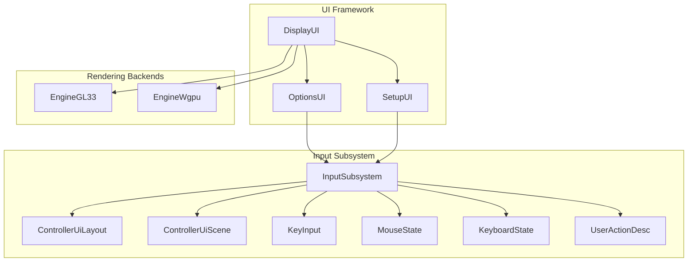

**Diagram sources**
- [DisplayUI.hpp](file://engine/Poseidon/UI/DisplayUI.hpp)
- [OptionsUI.hpp](file://engine/Poseidon/UI/OptionsUI.hpp)
- [InputSubsystem.hpp](file://engine/Poseidon/Input/InputSubsystem.hpp)
- [EngineGL33.hpp](file://engine/PoseidonGL33/EngineGL33.hpp)
- [EngineWgpu.hpp](file://engine/WgpuRenderer/EngineWgpu.hpp)

**Section sources**
- [DisplayUI.hpp](file://engine/Poseidon/UI/DisplayUI.hpp)
- [OptionsUI.hpp](file://engine/Poseidon/UI/OptionsUI.hpp)
- [InputSubsystem.hpp](file://engine/Poseidon/Input/InputSubsystem.hpp)

## Core Components
- DisplayUI: Orchestrates UI displays, manages active screens, and coordinates rendering updates.
- OptionsUI: Provides a flexible options system used by various settings panels, including video and input configurations.
- InputSubsystem: Centralizes input processing, device abstraction, and event dispatching to UI components.
- ControllerUiLayout and ControllerUiScene: Define layout structures and scene-based interactions for controller-driven UI navigation.
- KeyInput, MouseState, KeyboardState: Low-level input state tracking and event capture.
- UserActionDesc: Describes user actions and their mappings for consistent input handling.

These components collaborate to support advanced controls through a layered architecture that separates concerns between UI logic, input handling, and rendering.

**Section sources**
- [DisplayUI.cpp](file://engine/Poseidon/UI/DisplayUI.cpp)
- [OptionsUI.cpp](file://engine/Poseidon/UI/OptionsUI.cpp)
- [InputSubsystem.cpp](file://engine/Poseidon/Input/InputSubsystem.cpp)
- [ControllerUiLayout.cpp](file://engine/Poseidon/Input/ControllerUiLayout.cpp)
- [ControllerUiScene.cpp](file://engine/Poseidon/Input/ControllerUiScene.cpp)
- [KeyInput.cpp](file://engine/Poseidon/Input/KeyInput.cpp)
- [MouseState.cpp](file://engine/Poseidon/Input/MouseState.cpp)
- [KeyboardState.cpp](file://engine/Poseidon/Input/KeyboardState.cpp)
- [UserActionDesc.cpp](file://engine/Poseidon/Input/UserActionDesc.cpp)

## Architecture Overview
The extended controls architecture follows a clear separation of responsibilities:
- UI layer handles widget composition, layout, and user interactions.
- Input layer abstracts devices and normalizes events for UI consumption.
- Rendering layer provides platform-specific drawing capabilities.

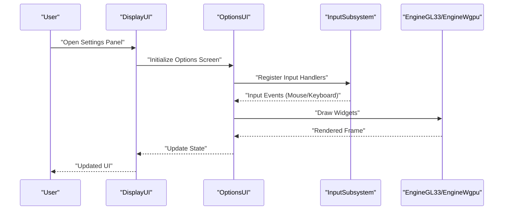

**Diagram sources**
- [DisplayUI.cpp](file://engine/Poseidon/UI/DisplayUI.cpp)
- [OptionsUI.cpp](file://engine/Poseidon/UI/OptionsUI.cpp)
- [InputSubsystem.cpp](file://engine/Poseidon/Input/InputSubsystem.cpp)
- [EngineGL33_2DRendering.cpp](file://engine/PoseidonGL33/EngineGL33_2DRendering.cpp)

## Detailed Component Analysis

### Sliders with Custom Ranges
Sliders provide value selection within defined bounds, supporting both linear and logarithmic scales. They integrate with data binding to reflect changes in real-time.

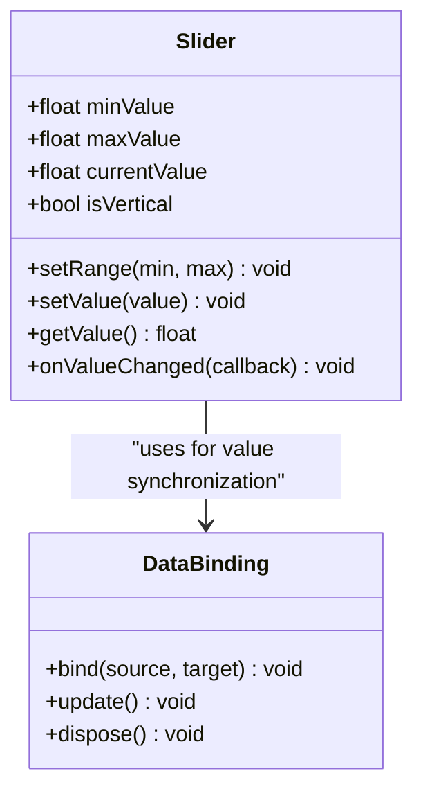

**Diagram sources**
- [OptionsUIImpl.cpp](file://engine/Poseidon/UI/OptionsUIImpl.cpp)
- [OptionsUIImplVideo.cpp](file://engine/Poseidon/UI/OptionsUIImplVideo.cpp)

**Section sources**
- [OptionsUIImpl.cpp](file://engine/Poseidon/UI/OptionsUIImpl.cpp)
- [OptionsUIImplVideo.cpp](file://engine/Poseidon/UI/OptionsUIImplVideo.cpp)

### Tree Views with Hierarchical Data
Tree views display nested data structures with expand/collapse functionality. They support virtualization to handle large datasets efficiently.

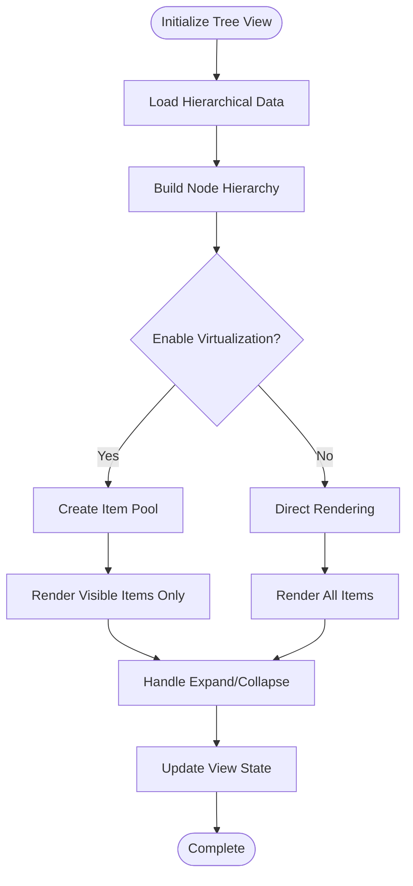

**Diagram sources**
- [DisplayUIMenus.cpp](file://engine/Poseidon/UI/DisplayUIMenus.cpp)
- [DisplayUISetup.cpp](file://engine/Poseidon/UI/DisplayUISetup.cpp)

**Section sources**
- [DisplayUIMenus.cpp](file://engine/Poseidon/UI/DisplayUIMenus.cpp)
- [DisplayUISetup.cpp](file://engine/Poseidon/UI/DisplayUISetup.cpp)

### 3D Controls for Spatial Interfaces
3D controls enable spatial manipulation of objects within a three-dimensional context. They utilize camera systems and transformation matrices for intuitive interaction.

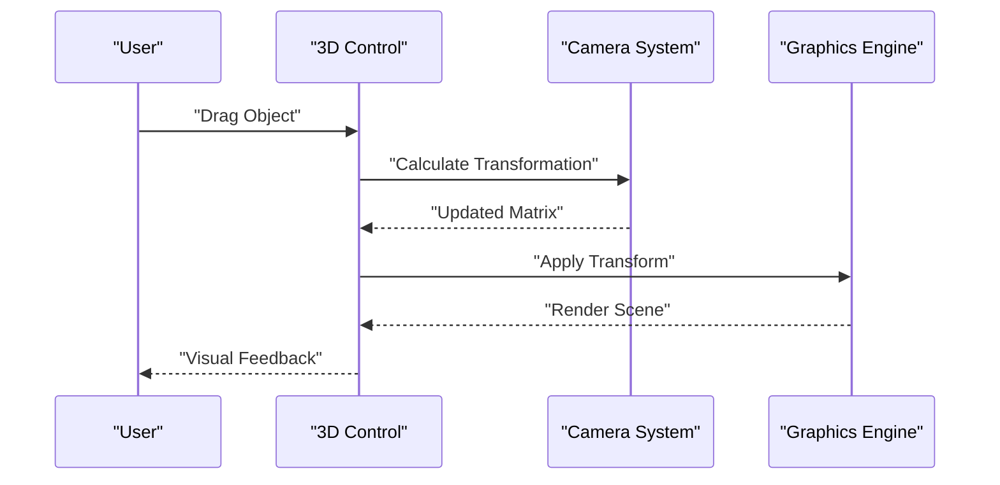

**Diagram sources**
- [EngineGL33_2DRendering.cpp](file://engine/PoseidonGL33/EngineGL33_2DRendering.cpp)
- [wgpu_renderer.hpp](file://engine/WgpuRenderer/include/wgpu_renderer.hpp)

**Section sources**
- [EngineGL33_2DRendering.cpp](file://engine/PoseidonGL33/EngineGL33_2DRendering.cpp)
- [wgpu_renderer.hpp](file://engine/WgpuRenderer/include/wgpu_renderer.hpp)

### Specialized Input Controls
Specialized input controls include key remapping interfaces, mouse sensitivity sliders, and controller configuration panels. They provide comprehensive input customization capabilities.

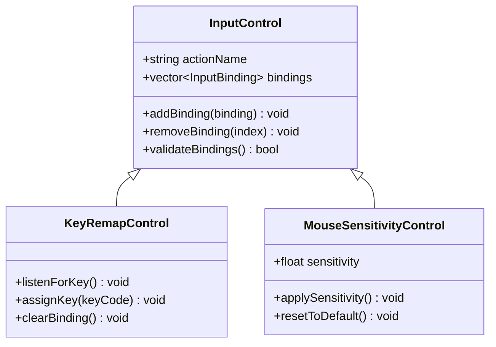

**Diagram sources**
- [ControlsCategory.cpp](file://engine/Poseidon/Input/ControlsCategory.cpp)
- [UserActionDesc.cpp](file://engine/Poseidon/Input/UserActionDesc.cpp)

**Section sources**
- [ControlsCategory.cpp](file://engine/Poseidon/Input/ControlsCategory.cpp)
- [UserActionDesc.cpp](file://engine/Poseidon/Input/UserActionDesc.cpp)

### Scrollable Lists Implementation
Scrollable lists efficiently render large datasets by only displaying visible items and reusing list item instances through pooling mechanisms.

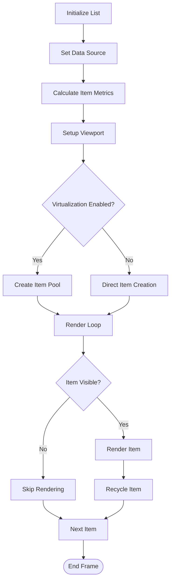

**Diagram sources**
- [DisplayUIMenus.cpp](file://engine/Poseidon/UI/DisplayUIMenus.cpp)
- [DisplayUISetup.cpp](file://engine/Poseidon/UI/DisplayUISetup.cpp)

**Section sources**
- [DisplayUIMenus.cpp](file://engine/Poseidon/UI/DisplayUIMenus.cpp)
- [DisplayUISetup.cpp](file://engine/Poseidon/UI/DisplayUISetup.cpp)

### Collapsible Trees Implementation
Collapsible trees manage hierarchical data with dynamic expansion and collapse operations, maintaining optimal performance through lazy loading and selective rendering.

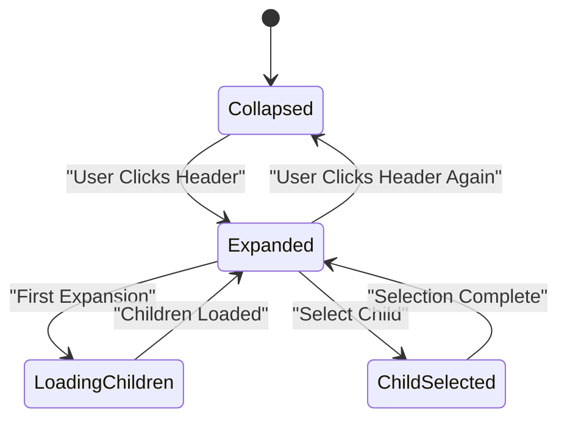

**Diagram sources**
- [DisplayUIMenus.cpp](file://engine/Poseidon/UI/DisplayUIMenus.cpp)
- [DisplayUISetup.cpp](file://engine/Poseidon/UI/DisplayUISetup.cpp)

**Section sources**
- [DisplayUIMenus.cpp](file://engine/Poseidon/UI/DisplayUIMenus.cpp)
- [DisplayUISetup.cpp](file://engine/Poseidon/UI/DisplayUISetup.cpp)

### Range Selectors Implementation
Range selectors allow users to select values within specified boundaries, supporting both single-value and dual-handle range selection modes.

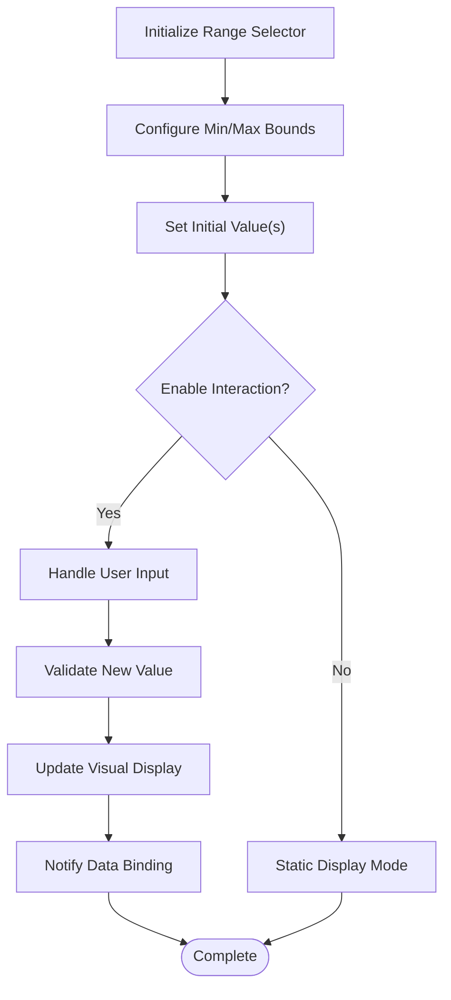

**Diagram sources**
- [OptionsUIImpl.cpp](file://engine/Poseidon/UI/OptionsUIImpl.cpp)
- [OptionsUIImplVideo.cpp](file://engine/Poseidon/UI/OptionsUIImplVideo.cpp)

**Section sources**
- [OptionsUIImpl.cpp](file://engine/Poseidon/UI/OptionsUIImpl.cpp)
- [OptionsUIImplVideo.cpp](file://engine/Poseidon/UI/OptionsUIImplVideo.cpp)

### Interactive 3D Elements
Interactive 3D elements respond to user input through raycasting and collision detection, providing intuitive manipulation of three-dimensional objects.

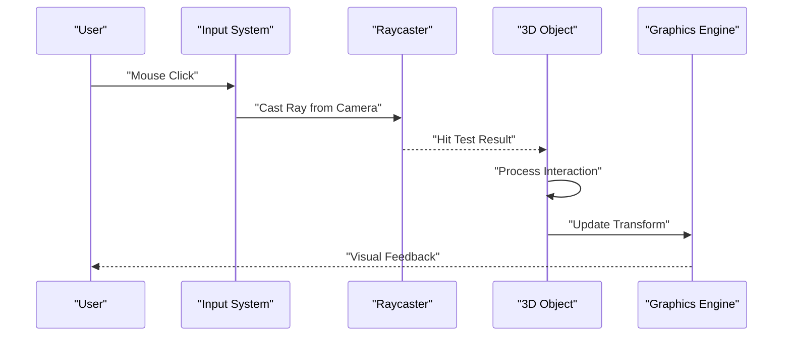

**Diagram sources**
- [EngineGL33_2DRendering.cpp](file://engine/PoseidonGL33/EngineGL33_2DRendering.cpp)
- [wgpu_renderer.hpp](file://engine/WgpuRenderer/include/wgpu_renderer.hpp)

**Section sources**
- [EngineGL33_2DRendering.cpp](file://engine/PoseidonGL33/EngineGL33_2DRendering.cpp)
- [wgpu_renderer.hpp](file://engine/WgpuRenderer/include/wgpu_renderer.hpp)

## Dependency Analysis
The extended controls system exhibits clear dependency relationships between UI components, input handling, and rendering backends.

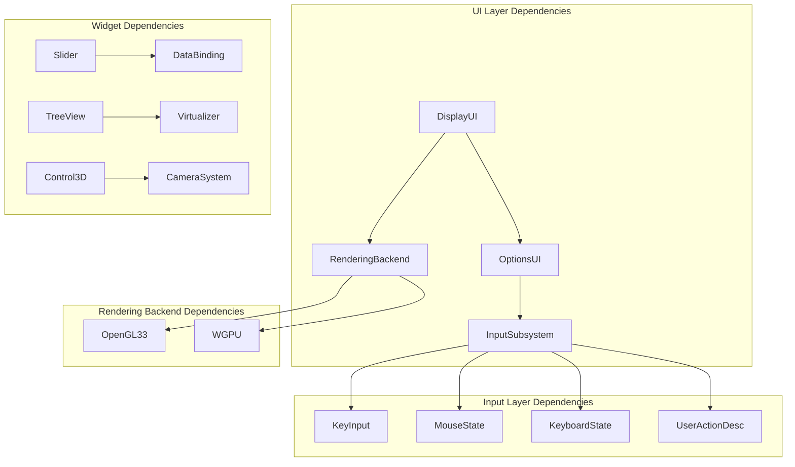

**Diagram sources**
- [DisplayUI.hpp](file://engine/Poseidon/UI/DisplayUI.hpp)
- [OptionsUI.hpp](file://engine/Poseidon/UI/OptionsUI.hpp)
- [InputSubsystem.hpp](file://engine/Poseidon/Input/InputSubsystem.hpp)
- [EngineGL33.hpp](file://engine/PoseidonGL33/EngineGL33.hpp)
- [EngineWgpu.hpp](file://engine/WgpuRenderer/EngineWgpu.hpp)

**Section sources**
- [DisplayUI.hpp](file://engine/Poseidon/UI/DisplayUI.hpp)
- [OptionsUI.hpp](file://engine/Poseidon/UI/OptionsUI.hpp)
- [InputSubsystem.hpp](file://engine/Poseidon/Input/InputSubsystem.hpp)

## Performance Considerations
- **Virtualization**: Implement item pooling and viewport culling for large datasets to minimize memory usage and rendering overhead.
- **Lazy Loading**: Load hierarchical data incrementally to reduce initial load times and memory footprint.
- **Event Throttling**: Apply debouncing and throttling to input events to prevent excessive processing during rapid user interactions.
- **Batch Rendering**: Group similar draw calls to optimize GPU utilization and reduce state changes.
- **Memory Management**: Use object pools for frequently created/destroyed UI elements to avoid garbage collection pauses.
- **Async Operations**: Perform heavy computations asynchronously to maintain responsive UI during long-running tasks.

## Troubleshooting Guide
Common issues and their solutions:
- **Input Event Conflicts**: Ensure proper event routing and priority handling to prevent conflicts between different input sources.
- **Rendering Artifacts**: Verify proper state management and resource cleanup to avoid visual glitches.
- **Performance Degradation**: Monitor frame times and identify bottlenecks using profiling tools.
- **Memory Leaks**: Implement proper resource disposal patterns and use memory debugging tools to detect leaks.
- **Cross-Platform Compatibility**: Test thoroughly on all target platforms and handle platform-specific differences in input and rendering APIs.

**Section sources**
- [InputSubsystem.cpp](file://engine/Poseidon/Input/InputSubsystem.cpp)
- [EngineGL33_2DRendering.cpp](file://engine/PoseidonGL33/EngineGL33_2DRendering.cpp)

## Conclusion
The extended controls system provides a robust foundation for implementing advanced UI components with sophisticated functionality. Through careful architectural design, performance optimization, and comprehensive input handling, developers can create responsive and accessible interfaces that work seamlessly across platforms. The modular structure allows for easy extension and customization while maintaining high performance standards.

## Appendices

### Accessibility Features
- **Keyboard Navigation**: Full keyboard support for all interactive elements
- **Screen Reader Support**: Proper labeling and semantic structure for assistive technologies
- **High Contrast Modes**: Support for high contrast themes and color-blind friendly palettes
- **Focus Management**: Logical tab order and focus indicators for better navigation

### Cross-Platform Compatibility
- **Input Abstraction**: Unified input API across Windows, Linux, and other platforms
- **Rendering Abstraction**: Backend-agnostic rendering interface supporting OpenGL and WGPU
- **Configuration Management**: Platform-specific configuration file locations and formats
- **Font Handling**: Consistent text rendering across different operating systems

[No sources needed since this section provides general guidance]