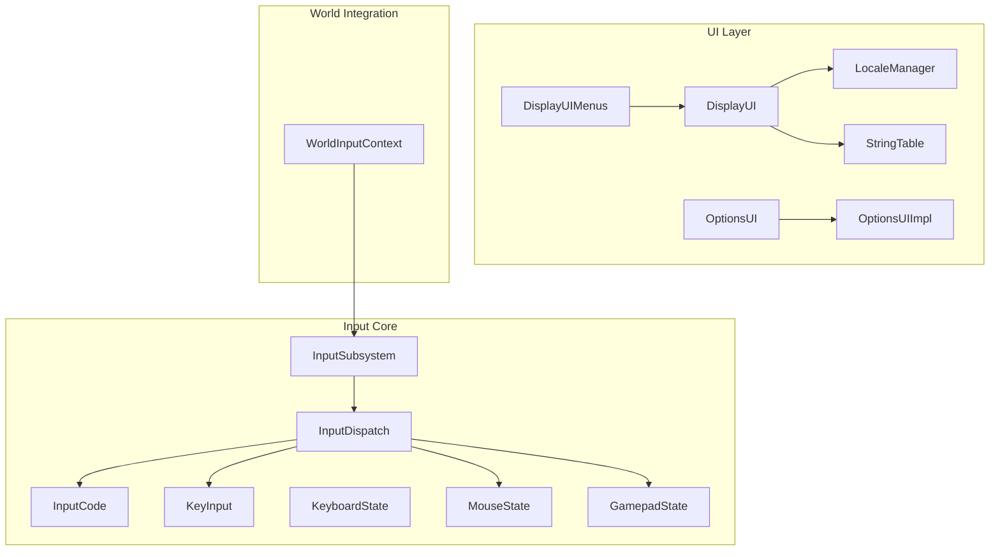
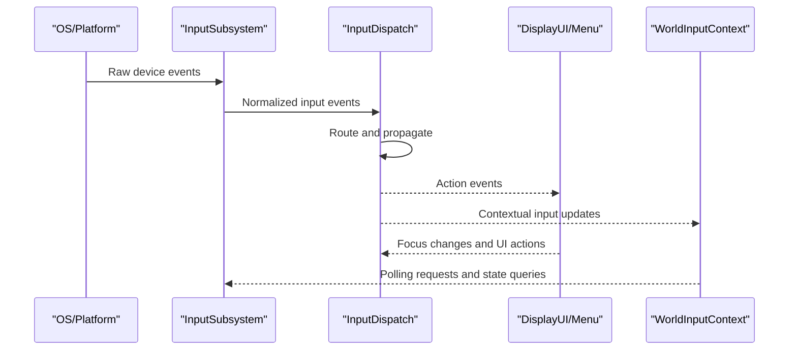
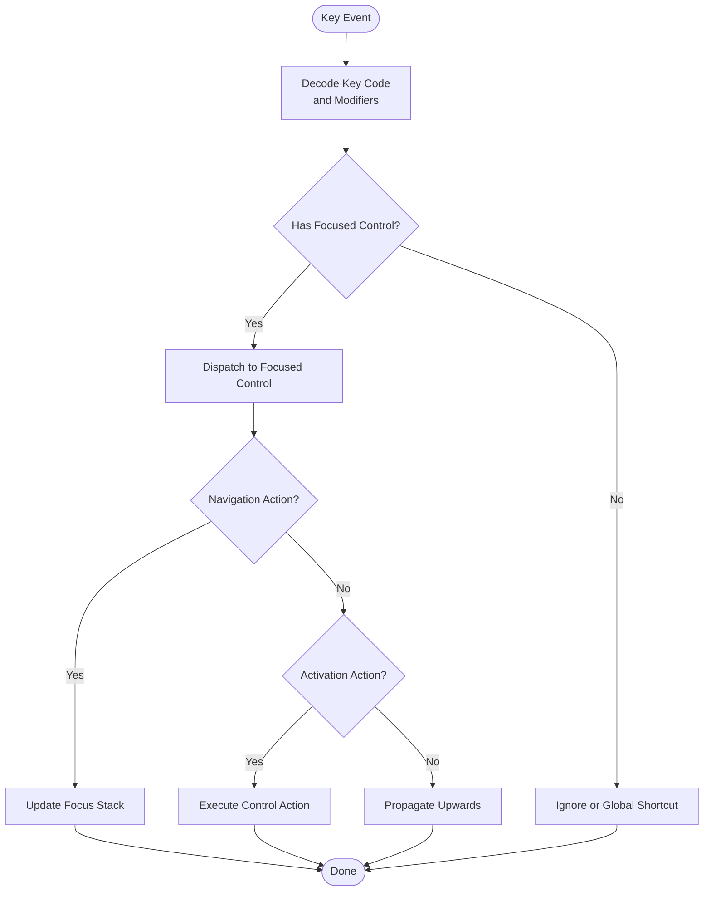
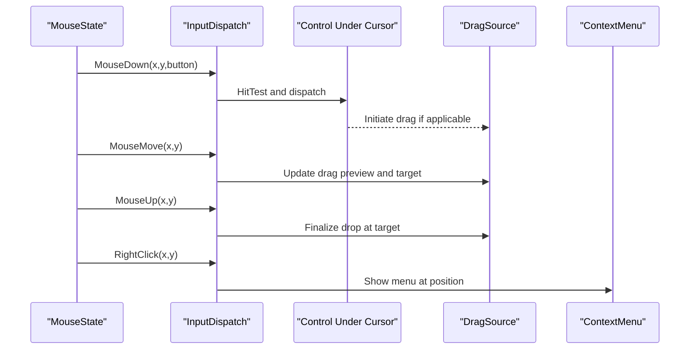
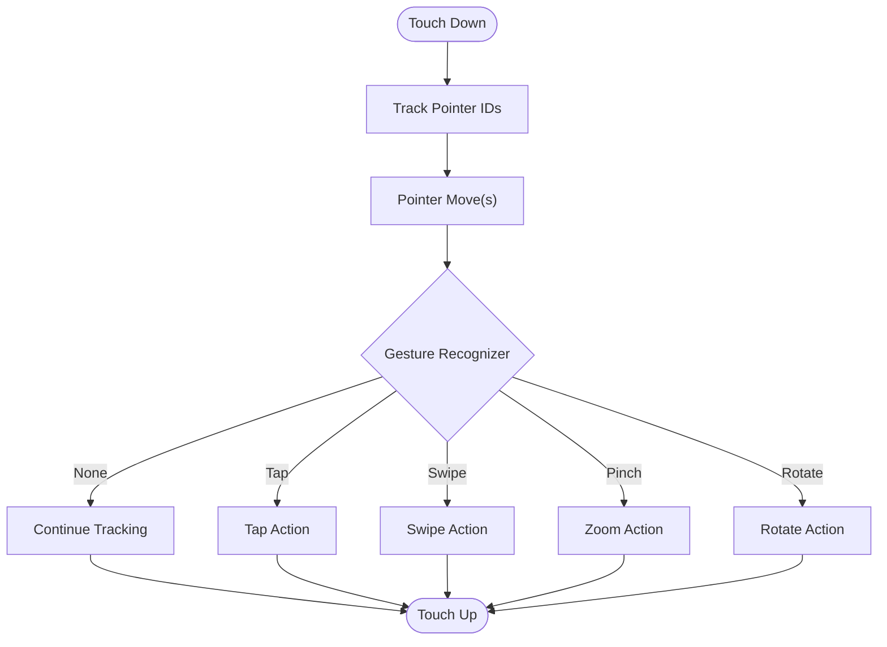
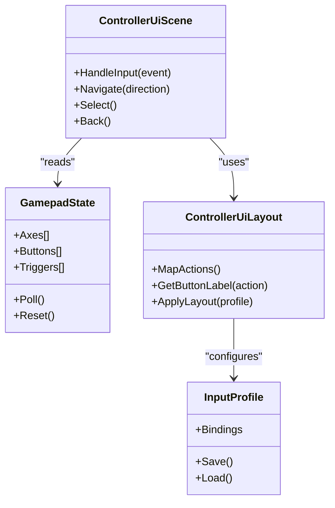
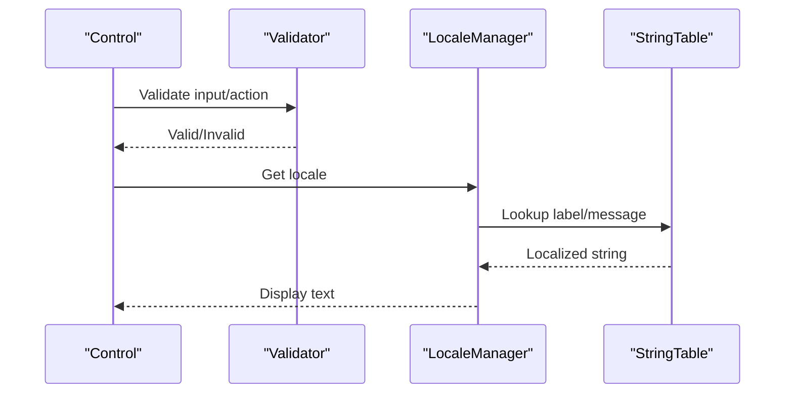
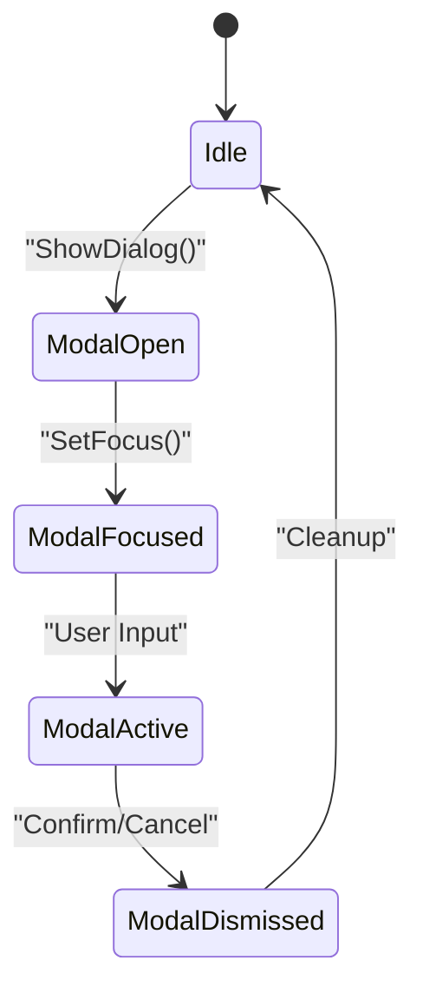
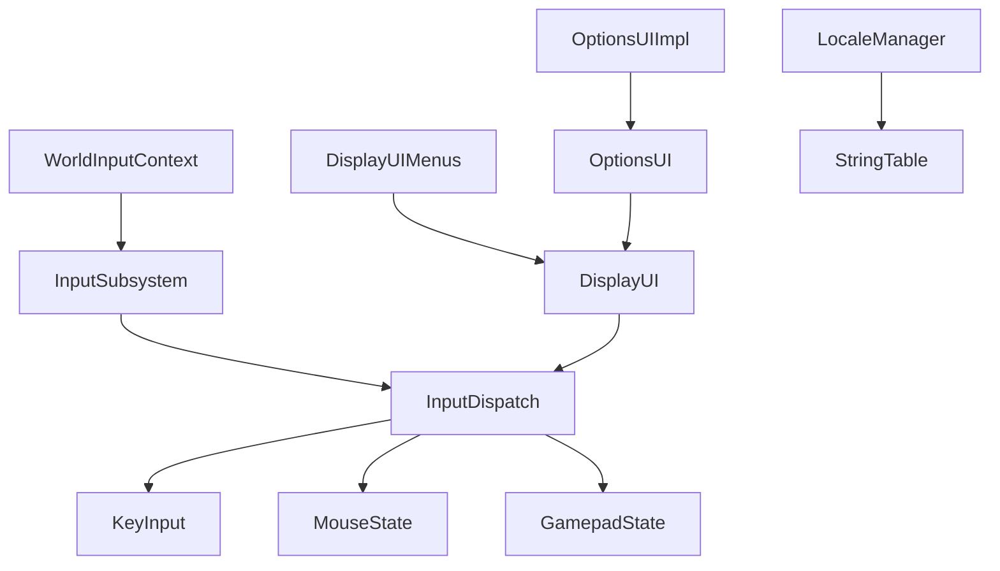

# Interaction Patterns

<cite>
**Referenced Files in This Document**
- [InputSubsystem.hpp](file://engine/Poseidon/Input/InputSubsystem.hpp)
- [InputSubsystem.cpp](file://engine/Poseidon/Input/InputSubsystem.cpp)
- [InputDispatch.cpp](file://engine/Poseidon/Input/InputDispatch.cpp)
- [InputCode.hpp](file://engine/Poseidon/Input/InputCode.hpp)
- [KeyInput.hpp](file://engine/Poseidon/Input/KeyInput.hpp)
- [KeyInput.cpp](file://engine/Poseidon/Input/KeyInput.cpp)
- [KeyboardState.hpp](file://engine/Poseidon/Input/KeyboardState.hpp)
- [MouseState.hpp](file://engine/Poseidon/Input/MouseState.hpp)
- [GamepadState.hpp](file://engine/Poseidon/Input/GamepadState.hpp)
- [ControllerUiLayout.hpp](file://engine/Poseidon/Input/ControllerUiLayout.hpp)
- [ControllerUiScene.hpp](file://engine/Poseidon/Input/ControllerUiScene.hpp)
- [UserActionDesc.hpp](file://engine/Poseidon/Input/UserActionDesc.hpp)
- [UserActionDesc.cpp](file://engine/Poseidon/Input/UserActionDesc.cpp)
- [InputProfile.hpp](file://engine/Poseidon/Input/InputProfile.hpp)
- [InputProfile.cpp](file://engine/Poseidon/Input/InputProfile.cpp)
- [InputContext.hpp](file://engine/Poseidon/Input/InputContext.hpp)
- [WorldInputContext.hpp](file://engine/Poseidon/World/WorldInputContext.hpp)
- [WorldInputContext.cpp](file://engine/Poseidon/World/WorldInputContext.cpp)
- [DisplayUI.hpp](file://engine/Poseidon/UI/DisplayUI.hpp)
- [DisplayUIMenus.cpp](file://engine/Poseidon/UI/DisplayUIMenus.cpp)
- [OptionsUI.hpp](file://engine/Poseidon/UI/OptionsUI.hpp)
- [OptionsUIImpl.cpp](file://engine/Poseidon/UI/OptionsUIImpl.cpp)
- [LocaleManager.hpp](file://engine/Poseidon/UI/Locale/LocaleManager.hpp)
- [StringTable.hpp](file://engine/Poseidon/UI/Locale/StringTable.hpp)
- [TetrisNotebookUI.hpp](file://apps/tetris/Tetris/TetrisNotebookUI.hpp)
- [TetrisNotebookUI.cpp](file://apps/tetris/Tetris/TetrisNotebookUI.cpp)
</cite>

## Table of Contents
1. [Introduction](#introduction)
2. [Project Structure](#project-structure)
3. [Core Components](#core-components)
4. [Architecture Overview](#architecture-overview)
5. [Detailed Component Analysis](#detailed-component-analysis)
6. [Dependency Analysis](#dependency-analysis)
7. [Performance Considerations](#performance-considerations)
8. [Troubleshooting Guide](#troubleshooting-guide)
9. [Conclusion](#conclusion)
10. [Appendices](#appendices)

## Introduction
This document explains advanced interaction patterns and input handling within the control system. It covers keyboard navigation, mouse interactions, touch gestures, and gamepad support across different control types. It also documents focus management, input validation, accessibility features, internationalization support, and examples for drag-and-drop, multi-touch gestures, context menus, and modal dialogs. Finally, it addresses input routing, event propagation, performance considerations for responsive UIs, and cross-platform input abstraction layers.

## Project Structure
The input and UI subsystems are organized into focused modules:
- Input core and device abstractions (keyboard, mouse, gamepad)
- Input dispatching and action mapping
- UI layer with displays, menus, options, and locale support
- World integration for in-game input contexts

**Diagram sources**
- [InputSubsystem.hpp](file://engine/Poseidon/Input/InputSubsystem.hpp)
- [InputDispatch.cpp](file://engine/Poseidon/Input/InputDispatch.cpp)
- [InputCode.hpp](file://engine/Poseidon/Input/InputCode.hpp)
- [KeyInput.hpp](file://engine/Poseidon/Input/KeyInput.hpp)
- [MouseState.hpp](file://engine/Poseidon/Input/MouseState.hpp)
- [GamepadState.hpp](file://engine/Poseidon/Input/GamepadState.hpp)
- [DisplayUI.hpp](file://engine/Poseidon/UI/DisplayUI.hpp)
- [DisplayUIMenus.cpp](file://engine/Poseidon/UI/DisplayUIMenus.cpp)
- [OptionsUI.hpp](file://engine/Poseidon/UI/OptionsUI.hpp)
- [OptionsUIImpl.cpp](file://engine/Poseidon/UI/OptionsUIImpl.cpp)
- [WorldInputContext.hpp](file://engine/Poseidon/World/WorldInputContext.hpp)

**Section sources**
- [InputSubsystem.hpp](file://engine/Poseidon/Input/InputSubsystem.hpp)
- [InputDispatch.cpp](file://engine/Poseidon/Input/InputDispatch.cpp)
- [DisplayUI.hpp](file://engine/Poseidon/UI/DisplayUI.hpp)
- [WorldInputContext.hpp](file://engine/Poseidon/World/WorldInputContext.hpp)

## Core Components
- InputSubsystem: Centralizes platform input polling and dispatch to higher-level systems.
- InputDispatch: Routes raw events to appropriate handlers and manages event propagation.
- KeyInput/KeyboardState: Tracks key states and provides keyboard-specific utilities.
- MouseState: Tracks mouse position, buttons, and wheel events.
- GamepadState: Exposes controller axes, buttons, and triggers.
- UserActionDesc/InputProfile: Maps physical inputs to semantic actions and profiles.
- DisplayUI/DisplayUIMenus/OptionsUI: UI components that consume input and manage focus.
- LocaleManager/StringTable: Internationalization for labels and messages.
- WorldInputContext: Bridges world state and input contexts for in-game scenarios.

**Section sources**
- [InputSubsystem.hpp](file://engine/Poseidon/Input/InputSubsystem.hpp)
- [InputDispatch.cpp](file://engine/Poseidon/Input/InputDispatch.cpp)
- [KeyInput.hpp](file://engine/Poseidon/Input/KeyInput.hpp)
- [MouseState.hpp](file://engine/Poseidon/Input/MouseState.hpp)
- [GamepadState.hpp](file://engine/Poseidon/Input/GamepadState.hpp)
- [UserActionDesc.hpp](file://engine/Poseidon/Input/UserActionDesc.hpp)
- [InputProfile.hpp](file://engine/Poseidon/Input/InputProfile.hpp)
- [DisplayUI.hpp](file://engine/Poseidon/UI/DisplayUI.hpp)
- [DisplayUIMenus.cpp](file://engine/Poseidon/UI/DisplayUIMenus.cpp)
- [OptionsUI.hpp](file://engine/Poseidon/UI/OptionsUI.hpp)
- [LocaleManager.hpp](file://engine/Poseidon/UI/Locale/LocaleManager.hpp)
- [StringTable.hpp](file://engine/Poseidon/UI/Locale/StringTable.hpp)
- [WorldInputContext.hpp](file://engine/Poseidon/World/WorldInputContext.hpp)

## Architecture Overview
The input pipeline abstracts platform details and exposes a unified interface to UI and game logic. Events flow from device drivers through InputSubsystem to InputDispatch, which routes them to registered handlers. UI components subscribe to actions and manage focus. World contexts integrate input with simulation state.

**Diagram sources**
- [InputSubsystem.hpp](file://engine/Poseidon/Input/InputSubsystem.hpp)
- [InputDispatch.cpp](file://engine/Poseidon/Input/InputDispatch.cpp)
- [DisplayUI.hpp](file://engine/Poseidon/UI/DisplayUI.hpp)
- [WorldInputContext.hpp](file://engine/Poseidon/World/WorldInputContext.hpp)

## Detailed Component Analysis

### Keyboard Navigation and Focus Management
- KeyboardState tracks pressed keys and modifiers; KeyInput provides helper methods for key queries and state transitions.
- DisplayUI and menu components implement focus traversal using arrow keys, Tab/Shift+Tab, Enter/Space activation, and Escape dismissal.
- Focus is managed by UI containers that maintain a focus stack and propagate focus changes to child controls.

**Diagram sources**
- [KeyInput.hpp](file://engine/Poseidon/Input/KeyInput.hpp)
- [KeyInput.cpp](file://engine/Poseidon/Input/KeyInput.cpp)
- [KeyboardState.hpp](file://engine/Poseidon/Input/KeyboardState.hpp)
- [DisplayUI.hpp](file://engine/Poseidon/UI/DisplayUI.hpp)
- [DisplayUIMenus.cpp](file://engine/Poseidon/UI/DisplayUIMenus.cpp)

**Section sources**
- [KeyInput.hpp](file://engine/Poseidon/Input/KeyInput.hpp)
- [KeyInput.cpp](file://engine/Poseidon/Input/KeyInput.cpp)
- [KeyboardState.hpp](file://engine/Poseidon/Input/KeyboardState.hpp)
- [DisplayUI.hpp](file://engine/Poseidon/UI/DisplayUI.hpp)
- [DisplayUIMenus.cpp](file://engine/Poseidon/UI/DisplayUIMenus.cpp)

### Mouse Interactions and Drag-and-Drop
- MouseState exposes position, button states, and wheel deltas.
- Drag-and-drop is implemented by tracking press/move/release sequences and hit-testing targets.
- Context menus appear on right-click or long-press, anchored to the pointer location.

**Diagram sources**
- [MouseState.hpp](file://engine/Poseidon/Input/MouseState.hpp)
- [InputDispatch.cpp](file://engine/Poseidon/Input/InputDispatch.cpp)
- [DisplayUI.hpp](file://engine/Poseidon/UI/DisplayUI.hpp)

**Section sources**
- [MouseState.hpp](file://engine/Poseidon/Input/MouseState.hpp)
- [InputDispatch.cpp](file://engine/Poseidon/Input/InputDispatch.cpp)
- [DisplayUI.hpp](file://engine/Poseidon/UI/DisplayUI.hpp)

### Touch Gestures and Multi-Touch
- Touch events are normalized into pointer streams similar to mouse but include multi-point coordinates and gesture recognition.
- Common gestures: tap, double-tap, swipe, pinch-to-zoom, rotate.
- Gesture recognizer composes low-level pointer events into high-level gestures and dispatches to UI elements.

[No sources needed since this diagram shows conceptual workflow, not actual code structure]

### Gamepad Support and Controller UI
- GamepadState exposes axes, buttons, and triggers; ControllerUiLayout defines layout mappings for menus and options.
- ControllerUiScene orchestrates navigation and selection using d-pad, analog sticks, and face buttons.
- InputProfile allows remapping and per-user customization.

**Diagram sources**
- [GamepadState.hpp](file://engine/Poseidon/Input/GamepadState.hpp)
- [ControllerUiLayout.hpp](file://engine/Poseidon/Input/ControllerUiLayout.hpp)
- [ControllerUiScene.hpp](file://engine/Poseidon/Input/ControllerUiScene.hpp)
- [InputProfile.hpp](file://engine/Poseidon/Input/InputProfile.hpp)

**Section sources**
- [GamepadState.hpp](file://engine/Poseidon/Input/GamepadState.hpp)
- [ControllerUiLayout.hpp](file://engine/Poseidon/Input/ControllerUiLayout.hpp)
- [ControllerUiScene.hpp](file://engine/Poseidon/Input/ControllerUiScene.hpp)
- [InputProfile.hpp](file://engine/Poseidon/Input/InputProfile.hpp)
- [InputProfile.cpp](file://engine/Poseidon/Input/InputProfile.cpp)

### Input Validation and Accessibility
- Input validation ensures only valid actions are executed based on current UI/game state.
- Accessibility features include focus indicators, screen reader text via StringTable, and consistent keyboard shortcuts.
- Internationalization uses LocaleManager and StringTable to provide localized labels and messages.

**Diagram sources**
- [DisplayUI.hpp](file://engine/Poseidon/UI/DisplayUI.hpp)
- [LocaleManager.hpp](file://engine/Poseidon/UI/Locale/LocaleManager.hpp)
- [StringTable.hpp](file://engine/Poseidon/UI/Locale/StringTable.hpp)

**Section sources**
- [DisplayUI.hpp](file://engine/Poseidon/UI/DisplayUI.hpp)
- [LocaleManager.hpp](file://engine/Poseidon/UI/Locale/LocaleManager.hpp)
- [StringTable.hpp](file://engine/Poseidon/UI/Locale/StringTable.hpp)

### Modal Dialogs and Context Menus
- Modal dialogs capture input until dismissed; they overlay other UI and prevent background interaction.
- Context menus are transient overlays triggered by specific events and auto-dismissed on outside clicks.

[No sources needed since this diagram shows conceptual workflow, not actual code structure]

### Examples: Implementing Drag-and-Drop, Multi-Touch, Context Menus, and Modals
- Drag-and-drop: Use MouseState to track press/move/release and implement hit-testing; update drag preview and finalize on release.
- Multi-touch gestures: Normalize pointer events and use a gesture recognizer to detect taps, swipes, pinches, and rotations.
- Context menus: On right-click or long-press, compute anchor point and render menu items; handle selection and dismiss on outside click.
- Modal dialogs: Capture focus, block background input, and process confirm/cancel actions; ensure keyboard navigation and accessibility labels.

[No sources needed since this section provides general guidance]

## Dependency Analysis
Input subsystems depend on platform abstractions and expose stable interfaces to UI and world layers. UI components depend on input actions and localization. World contexts integrate input with simulation state.

**Diagram sources**
- [InputSubsystem.hpp](file://engine/Poseidon/Input/InputSubsystem.hpp)
- [InputDispatch.cpp](file://engine/Poseidon/Input/InputDispatch.cpp)
- [KeyInput.hpp](file://engine/Poseidon/Input/KeyInput.hpp)
- [MouseState.hpp](file://engine/Poseidon/Input/MouseState.hpp)
- [GamepadState.hpp](file://engine/Poseidon/Input/GamepadState.hpp)
- [DisplayUI.hpp](file://engine/Poseidon/UI/DisplayUI.hpp)
- [DisplayUIMenus.cpp](file://engine/Poseidon/UI/DisplayUIMenus.cpp)
- [OptionsUI.hpp](file://engine/Poseidon/UI/OptionsUI.hpp)
- [OptionsUIImpl.cpp](file://engine/Poseidon/UI/OptionsUIImpl.cpp)
- [WorldInputContext.hpp](file://engine/Poseidon/World/WorldInputContext.hpp)
- [LocaleManager.hpp](file://engine/Poseidon/UI/Locale/LocaleManager.hpp)
- [StringTable.hpp](file://engine/Poseidon/UI/Locale/StringTable.hpp)

**Section sources**
- [InputSubsystem.hpp](file://engine/Poseidon/Input/InputSubsystem.hpp)
- [InputDispatch.cpp](file://engine/Poseidon/Input/InputDispatch.cpp)
- [DisplayUI.hpp](file://engine/Poseidon/UI/DisplayUI.hpp)
- [WorldInputContext.hpp](file://engine/Poseidon/World/WorldInputContext.hpp)

## Performance Considerations
- Minimize event processing overhead by batching and coalescing events where possible.
- Avoid heavy computations in input handlers; defer to background tasks when necessary.
- Use efficient hit-testing algorithms and spatial partitioning for large UI trees.
- Cache localized strings and frequently used labels to reduce lookup costs.
- Profile input latency and responsiveness; ensure frame budget compliance for smooth UI.

[No sources needed since this section provides general guidance]

## Troubleshooting Guide
- Keyboard navigation issues: Verify focus stack and tab order; ensure controls are enabled and visible.
- Mouse/drag problems: Check hit-testing bounds and pointer state consistency; validate drag start conditions.
- Gamepad not detected: Confirm device enumeration and profile bindings; test with ControllerUiScene.
- Localization missing: Ensure LocaleManager is initialized and StringTable entries exist for current locale.
- Modal not capturing input: Confirm modal focus and input blocking flags; check for overlapping UI layers.

**Section sources**
- [DisplayUI.hpp](file://engine/Poseidon/UI/DisplayUI.hpp)
- [DisplayUIMenus.cpp](file://engine/Poseidon/UI/DisplayUIMenus.cpp)
- [OptionsUI.hpp](file://engine/Poseidon/UI/OptionsUI.hpp)
- [OptionsUIImpl.cpp](file://engine/Poseidon/UI/OptionsUIImpl.cpp)
- [LocaleManager.hpp](file://engine/Poseidon/UI/Locale/LocaleManager.hpp)
- [StringTable.hpp](file://engine/Poseidon/UI/Locale/StringTable.hpp)

## Conclusion
The control system provides a robust, extensible foundation for advanced interaction patterns across keyboard, mouse, touch, and gamepad inputs. By leveraging InputSubsystem and InputDispatch, UI components can implement sophisticated behaviors such as drag-and-drop, multi-touch gestures, context menus, and modal dialogs while maintaining accessibility and internationalization. Proper focus management, input validation, and performance optimization ensure responsive and user-friendly experiences.

## Appendices

### Cross-Platform Input Abstraction Layers
- Platform-specific drivers feed into InputSubsystem, which normalizes events for consistent behavior across platforms.
- InputCode centralizes key codes and mappings; UserActionDesc maps physical inputs to semantic actions.
- InputProfile enables per-user customization and persistence.

**Section sources**
- [InputCode.hpp](file://engine/Poseidon/Input/InputCode.hpp)
- [UserActionDesc.hpp](file://engine/Poseidon/Input/UserActionDesc.hpp)
- [UserActionDesc.cpp](file://engine/Poseidon/Input/UserActionDesc.cpp)
- [InputProfile.hpp](file://engine/Poseidon/Input/InputProfile.hpp)
- [InputProfile.cpp](file://engine/Poseidon/Input/InputProfile.cpp)

### Example: Tetris Notebook UI Interaction
- Demonstrates keyboard navigation and UI control usage within a simple application.

**Section sources**
- [TetrisNotebookUI.hpp](file://apps/tetris/Tetris/TetrisNotebookUI.hpp)
- [TetrisNotebookUI.cpp](file://apps/tetris/Tetris/TetrisNotebookUI.cpp)