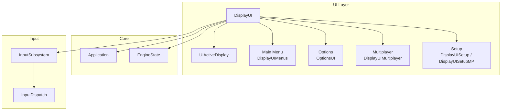
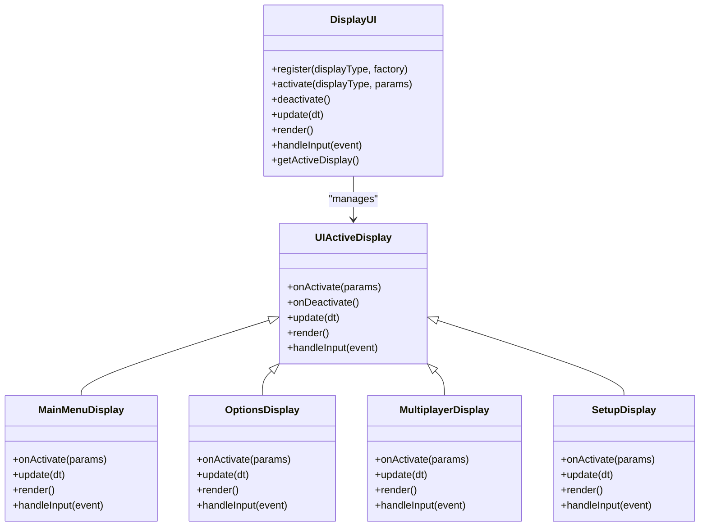
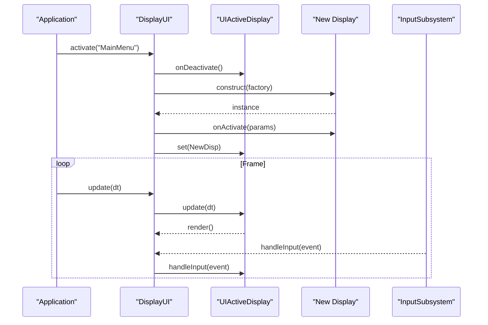
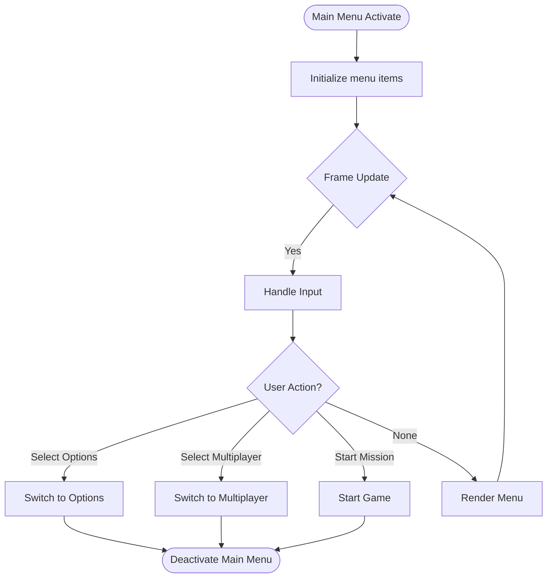
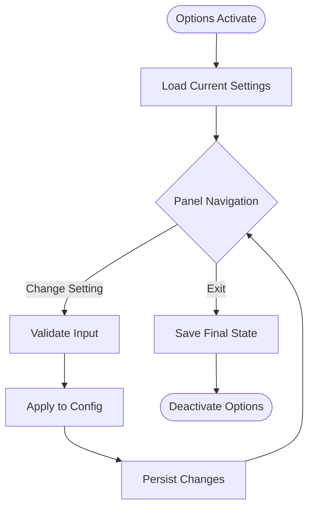
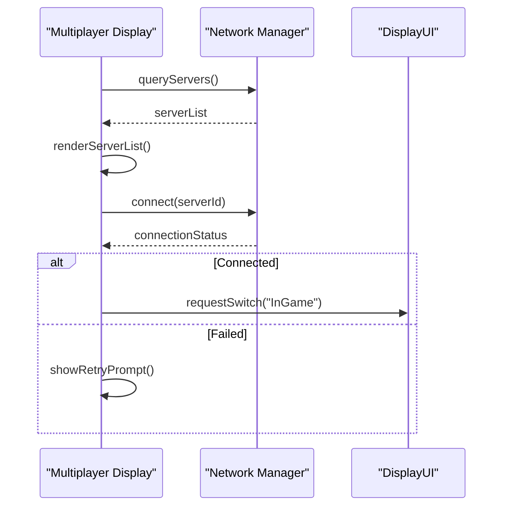
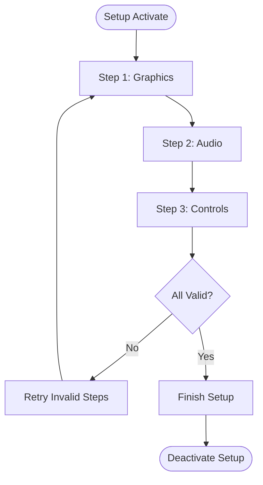
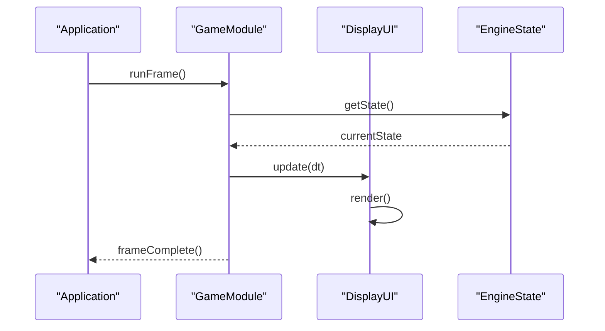
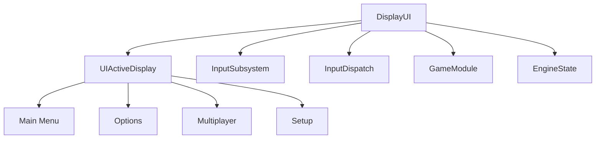

# Display Management

<cite>
**Referenced Files in This Document**
- [DisplayUI.hpp](file://engine/Poseidon/UI/DisplayUI.hpp)
- [DisplayUI.cpp](file://engine/Poseidon/UI/DisplayUI.cpp)
- [DisplayUIMenus.cpp](file://engine/Poseidon/UI/DisplayUIMenus.cpp)
- [DisplayUIMultiplayer.cpp](file://engine/Poseidon/UI/DisplayUIMultiplayer.cpp)
- [DisplayUISetup.cpp](file://engine/Poseidon/UI/DisplayUISetup.cpp)
- [DisplayUISetupMP.cpp](file://engine/Poseidon/UI/DisplayUISetupMP.cpp)
- [DisplayUICommon.hpp](file://engine/Poseidon/UI/DisplayUICommon.hpp)
- [UIActiveDisplay.hpp](file://engine/Poseidon/UI/UIActiveDisplay.hpp)
- [GameModule.hpp](file://engine/Poseidon/UI/GameModule.hpp)
- [GameModule.cpp](file://engine/Poseidon/UI/GameModule.cpp)
- [MainMenuLayout.hpp](file://engine/Poseidon/UI/MainMenuLayout.hpp)
- [MainMenuLayout.cpp](file://engine/Poseidon/UI/MainMenuLayout.cpp)
- [OptionsUI.hpp](file://engine/Poseidon/UI/OptionsUI.hpp)
- [OptionsUI.cpp](file://engine/Poseidon/UI/OptionsUI.cpp)
- [OptionsUIApp.cpp](file://engine/Poseidon/UI/OptionsUIApp.cpp)
- [InputSubsystem.hpp](file://engine/Poseidon/Input/InputSubsystem.hpp)
- [InputDispatch.cpp](file://engine/Poseidon/Input/InputDispatch.cpp)
- [Application.hpp](file://engine/Poseidon/Core/Application.hpp)
- [EngineState.hpp](file://engine/Poseidon/Core/EngineState.hpp)
</cite>

## Table of Contents
1. Introduction
2. Project Structure
3. Core Components
4. Architecture Overview
5. Detailed Component Analysis
6. Dependency Analysis
7. Performance Considerations
8. Troubleshooting Guide
9. Conclusion

## Introduction
This document explains the Display Management system responsible for screen state transitions and display lifecycle within the UI subsystem. It covers how DisplayUI manages different screen types such as main menu, options, multiplayer, and in-game displays; the display hierarchy; state management patterns; transition animations; registration and activation/deactivation cycles; memory management; creating custom displays; handling display-specific input; integrating with the game loop; performance considerations; and debugging techniques.

## Project Structure
The Display Management system is implemented under the Poseidon UI module. Key files include:
- Display core and orchestration: DisplayUI.hpp, DisplayUI.cpp, DisplayUICommon.hpp
- Screen implementations: DisplayUIMenus.cpp (main menu), OptionsUI.* (options screens), DisplayUIMultiplayer.* (multiplayer flows), DisplayUISetup* (setup flows)
- Active display abstraction: UIActiveDisplay.hpp
- Game integration: GameModule.hpp/.cpp
- Input integration: InputSubsystem.hpp, InputDispatch.cpp
- Application and engine state: Application.hpp, EngineState.hpp

**Diagram sources**
- [DisplayUI.hpp](file://engine/Poseidon/UI/DisplayUI.hpp)
- [DisplayUI.cpp](file://engine/Poseidon/UI/DisplayUI.cpp)
- [UIActiveDisplay.hpp](file://engine/Poseidon/UI/UIActiveDisplay.hpp)
- [DisplayUIMenus.cpp](file://engine/Poseidon/UI/DisplayUIMenus.cpp)
- [OptionsUI.hpp](file://engine/Poseidon/UI/OptionsUI.hpp)
- [DisplayUIMultiplayer.cpp](file://engine/Poseidon/UI/DisplayUIMultiplayer.cpp)
- [DisplayUISetup.cpp](file://engine/Poseidon/UI/DisplayUISetup.cpp)
- [DisplayUISetupMP.cpp](file://engine/Poseidon/UI/DisplayUISetupMP.cpp)
- [InputSubsystem.hpp](file://engine/Poseidon/Input/InputSubsystem.hpp)
- [InputDispatch.cpp](file://engine/Poseidon/Input/InputDispatch.cpp)
- [Application.hpp](file://engine/Poseidon/Core/Application.hpp)
- [EngineState.hpp](file://engine/Poseidon/Core/EngineState.hpp)

**Section sources**
- [DisplayUI.hpp](file://engine/Poseidon/UI/DisplayUI.hpp)
- [DisplayUI.cpp](file://engine/Poseidon/UI/DisplayUI.cpp)
- [UIActiveDisplay.hpp](file://engine/Poseidon/UI/UIActiveDisplay.hpp)
- [DisplayUIMenus.cpp](file://engine/Poseidon/UI/DisplayUIMenus.cpp)
- [OptionsUI.hpp](file://engine/Poseidon/UI/OptionsUI.hpp)
- [DisplayUIMultiplayer.cpp](file://engine/Poseidon/UI/DisplayUIMultiplayer.cpp)
- [DisplayUISetup.cpp](file://engine/Poseidon/UI/DisplayUISetup.cpp)
- [DisplayUISetupMP.cpp](file://engine/Poseidon/UI/DisplayUISetupMP.cpp)
- [InputSubsystem.hpp](file://engine/Poseidon/Input/InputSubsystem.hpp)
- [InputDispatch.cpp](file://engine/Poseidon/Input/InputDispatch.cpp)
- [Application.hpp](file://engine/Poseidon/Core/Application.hpp)
- [EngineState.hpp](file://engine/Poseidon/Core/EngineState.hpp)

## Core Components
- DisplayUI: Central orchestrator that registers, activates, deactivates, and renders active displays. Manages transitions and delegates input to the current display.
- UIActiveDisplay: Abstraction representing the currently active display surface, encapsulating lifecycle hooks and rendering responsibilities.
- Display Implementations: Concrete screens like Main Menu, Options, Multiplayer, and Setup. Each implements its own update/render/input logic and exposes a consistent interface via the active display abstraction.
- Input Integration: InputSubsystem and InputDispatch feed events into DisplayUI, which routes them to the active display’s input handler.
- Game Integration: GameModule bridges DisplayUI with the broader game loop and engine state, ensuring proper sequencing of updates and rendering.

Key responsibilities:
- Registration of display types and instances
- Activation/deactivation lifecycle management
- Transition animation coordination
- Input routing per display
- Resource management tied to display lifetime

**Section sources**
- [DisplayUI.hpp](file://engine/Poseidon/UI/DisplayUI.hpp)
- [DisplayUI.cpp](file://engine/Poseidon/UI/DisplayUI.cpp)
- [UIActiveDisplay.hpp](file://engine/Poseidon/UI/UIActiveDisplay.hpp)
- [GameModule.hpp](file://engine/Poseidon/UI/GameModule.hpp)
- [GameModule.cpp](file://engine/Poseidon/UI/GameModule.cpp)
- [InputSubsystem.hpp](file://engine/Poseidon/Input/InputSubsystem.hpp)
- [InputDispatch.cpp](file://engine/Poseidon/Input/InputDispatch.cpp)

## Architecture Overview
DisplayUI acts as the facade over multiple display implementations. The active display pattern ensures only one screen is fully interactive at a time, while background displays can be paused or hidden. Transitions are coordinated by DisplayUI to provide smooth visual changes between screens.

**Diagram sources**
- [DisplayUI.hpp](file://engine/Poseidon/UI/DisplayUI.hpp)
- [DisplayUI.cpp](file://engine/Poseidon/UI/DisplayUI.cpp)
- [UIActiveDisplay.hpp](file://engine/Poseidon/UI/UIActiveDisplay.hpp)
- [DisplayUIMenus.cpp](file://engine/Poseidon/UI/DisplayUIMenus.cpp)
- [OptionsUI.hpp](file://engine/Poseidon/UI/OptionsUI.hpp)
- [DisplayUIMultiplayer.cpp](file://engine/Poseidon/UI/DisplayUIMultiplayer.cpp)
- [DisplayUISetup.cpp](file://engine/Poseidon/UI/DisplayUISetup.cpp)

**Section sources**
- [DisplayUI.hpp](file://engine/Poseidon/UI/DisplayUI.hpp)
- [DisplayUI.cpp](file://engine/Poseidon/UI/DisplayUI.cpp)
- [UIActiveDisplay.hpp](file://engine/Poseidon/UI/UIActiveDisplay.hpp)

## Detailed Component Analysis

### DisplayUI Orchestration
DisplayUI coordinates the lifecycle of displays:
- Registration: Displays are registered with a type identifier and a factory function to create instances.
- Activation: When activating a display, DisplayUI constructs the instance, calls onActivate, and sets it as the active display.
- Deactivation: Before switching, DisplayUI calls onDeactivate on the previous display and releases resources if needed.
- Update and Render: Each frame, DisplayUI updates and renders the active display.
- Input Routing: Input events are dispatched to the active display’s handler.

Transition animations are typically handled by interpolating visibility or alpha values during the switch, ensuring seamless user experience.

**Diagram sources**
- [DisplayUI.cpp](file://engine/Poseidon/UI/DisplayUI.cpp)
- [UIActiveDisplay.hpp](file://engine/Poseidon/UI/UIActiveDisplay.hpp)
- [InputSubsystem.hpp](file://engine/Poseidon/Input/InputSubsystem.hpp)

**Section sources**
- [DisplayUI.cpp](file://engine/Poseidon/UI/DisplayUI.cpp)
- [UIActiveDisplay.hpp](file://engine/Poseidon/UI/UIActiveDisplay.hpp)

### Main Menu Display
The main menu display provides navigation to other screens (options, multiplayer, start mission). It handles menu selection, hover states, and input routing for keyboard/mouse or controller.

**Diagram sources**
- [DisplayUIMenus.cpp](file://engine/Poseidon/UI/DisplayUIMenus.cpp)
- [MainMenuLayout.hpp](file://engine/Poseidon/UI/MainMenuLayout.hpp)
- [MainMenuLayout.cpp](file://engine/Poseidon/UI/MainMenuLayout.cpp)

**Section sources**
- [DisplayUIMenus.cpp](file://engine/Poseidon/UI/DisplayUIMenus.cpp)
- [MainMenuLayout.hpp](file://engine/Poseidon/UI/MainMenuLayout.hpp)
- [MainMenuLayout.cpp](file://engine/Poseidon/UI/MainMenuLayout.cpp)

### Options Display
Options display manages settings panels, validation, and persistence. It integrates with configuration systems to apply changes and may trigger graphics/audio reinitialization when necessary.

**Diagram sources**
- [OptionsUI.hpp](file://engine/Poseidon/UI/OptionsUI.hpp)
- [OptionsUI.cpp](file://engine/Poseidon/UI/OptionsUI.cpp)
- [OptionsUIApp.cpp](file://engine/Poseidon/UI/OptionsUIApp.cpp)

**Section sources**
- [OptionsUI.hpp](file://engine/Poseidon/UI/OptionsUI.hpp)
- [OptionsUI.cpp](file://engine/Poseidon/UI/OptionsUI.cpp)
- [OptionsUIApp.cpp](file://engine/Poseidon/UI/OptionsUIApp.cpp)

### Multiplayer Display
Multiplayer display handles session browsing, matchmaking, and connection flow. It interacts with network components and updates UI based on server availability and player status.

**Diagram sources**
- [DisplayUIMultiplayer.cpp](file://engine/Poseidon/UI/DisplayUIMultiplayer.cpp)

**Section sources**
- [DisplayUIMultiplayer.cpp](file://engine/Poseidon/UI/DisplayUIMultiplayer.cpp)

### Setup Display
Setup display guides users through initial configuration steps, including graphics, audio, and control setup. It validates inputs and persists preferences before transitioning to gameplay or main menu.

**Diagram sources**
- [DisplayUISetup.cpp](file://engine/Poseidon/UI/DisplayUISetup.cpp)
- [DisplayUISetupMP.cpp](file://engine/Poseidon/UI/DisplayUISetupMP.cpp)

**Section sources**
- [DisplayUISetup.cpp](file://engine/Poseidon/UI/DisplayUISetup.cpp)
- [DisplayUISetupMP.cpp](file://engine/Poseidon/UI/DisplayUISetupMP.cpp)

### Creating Custom Displays
To implement a custom display:
- Derive from the active display interface defined in UIActiveDisplay.
- Implement required lifecycle methods: onActivate, onDeactivate, update, render, handleInput.
- Register the display with DisplayUI using a factory function.
- Ensure resource initialization occurs in onActivate and cleanup in onDeactivate.
- Route input appropriately and avoid blocking operations in update/render.

Best practices:
- Keep update and render lightweight; defer heavy work to background tasks.
- Use consistent input handling patterns across displays.
- Manage memory carefully; avoid leaks by releasing resources in onDeactivate.

**Section sources**
- [UIActiveDisplay.hpp](file://engine/Poseidon/UI/UIActiveDisplay.hpp)
- [DisplayUI.hpp](file://engine/Poseidon/UI/DisplayUI.hpp)
- [DisplayUI.cpp](file://engine/Poseidon/UI/DisplayUI.cpp)

### Handling Display-Specific Input
Input events are routed through InputSubsystem and InputDispatch to DisplayUI, which forwards them to the active display’s handleInput method. Each display should:
- Consume relevant events and ignore others.
- Avoid global side effects; keep input logic scoped to the display.
- Support both keyboard/mouse and controller inputs where applicable.

Integration points:
- InputSubsystem aggregates device states and events.
- InputDispatch normalizes and dispatches events to the UI layer.
- DisplayUI maintains focus context for the active display.

**Section sources**
- [InputSubsystem.hpp](file://engine/Poseidon/Input/InputSubsystem.hpp)
- [InputDispatch.cpp](file://engine/Poseidon/Input/InputDispatch.cpp)
- [DisplayUI.cpp](file://engine/Poseidon/UI/DisplayUI.cpp)

### Integrating with the Game Loop
DisplayUI integrates with the application and engine state to ensure correct sequencing:
- Application drives the main loop and calls DisplayUI update/render each frame.
- EngineState may influence display behavior (e.g., pausing in-game displays when the game is paused).
- GameModule coordinates transitions between gameplay and UI displays.

**Diagram sources**
- [Application.hpp](file://engine/Poseidon/Core/Application.hpp)
- [EngineState.hpp](file://engine/Poseidon/Core/EngineState.hpp)
- [GameModule.hpp](file://engine/Poseidon/UI/GameModule.hpp)
- [GameModule.cpp](file://engine/Poseidon/UI/GameModule.cpp)
- [DisplayUI.cpp](file://engine/Poseidon/UI/DisplayUI.cpp)

**Section sources**
- [Application.hpp](file://engine/Poseidon/Core/Application.hpp)
- [EngineState.hpp](file://engine/Poseidon/Core/EngineState.hpp)
- [GameModule.hpp](file://engine/Poseidon/UI/GameModule.hpp)
- [GameModule.cpp](file://engine/Poseidon/UI/GameModule.cpp)

## Dependency Analysis
DisplayUI depends on:
- UIActiveDisplay for the active screen abstraction
- InputSubsystem and InputDispatch for event handling
- GameModule for integration with the game loop
- EngineState for contextual behavior

Concrete displays depend on their respective modules (e.g., OptionsUI depends on configuration systems; MultiplayerDisplay depends on networking).

**Diagram sources**
- [DisplayUI.hpp](file://engine/Poseidon/UI/DisplayUI.hpp)
- [UIActiveDisplay.hpp](file://engine/Poseidon/UI/UIActiveDisplay.hpp)
- [InputSubsystem.hpp](file://engine/Poseidon/Input/InputSubsystem.hpp)
- [InputDispatch.cpp](file://engine/Poseidon/Input/InputDispatch.cpp)
- [GameModule.hpp](file://engine/Poseidon/UI/GameModule.hpp)
- [EngineState.hpp](file://engine/Poseidon/Core/EngineState.hpp)

**Section sources**
- [DisplayUI.hpp](file://engine/Poseidon/UI/DisplayUI.hpp)
- [UIActiveDisplay.hpp](file://engine/Poseidon/UI/UIActiveDisplay.hpp)
- [InputSubsystem.hpp](file://engine/Poseidon/Input/InputSubsystem.hpp)
- [InputDispatch.cpp](file://engine/Poseidon/Input/InputDispatch.cpp)
- [GameModule.hpp](file://engine/Poseidon/UI/GameModule.hpp)
- [EngineState.hpp](file://engine/Poseidon/Core/EngineState.hpp)

## Performance Considerations
- Minimize allocations during update/render to reduce GC pressure and frame spikes.
- Batch UI rendering operations where possible to reduce draw calls.
- Avoid heavy computations in input handlers; offload to background threads.
- Cache frequently used assets and layouts to prevent repeated loading.
- Use efficient data structures for menu items and UI state.
- Profile display switches to identify bottlenecks in transition animations.

[No sources needed since this section provides general guidance]

## Troubleshooting Guide
Common issues and resolutions:
- Display not appearing: Verify registration and activation sequence; check onActivate implementation.
- Input not responding: Ensure InputSubsystem is feeding events to DisplayUI and the active display’s handleInput is invoked.
- Memory leaks: Confirm onDeallocate releases all allocated resources; use memory profiling tools.
- Stuttering during transitions: Optimize asset loading; pre-warm resources; simplify animations.
- Incorrect engine state interaction: Check GameModule and EngineState integration; ensure proper sequencing.

Debugging techniques:
- Log display lifecycle events (activate, deactivate, update, render).
- Inspect input event flow through InputDispatch.
- Use profiler to identify hotspots in update/render paths.
- Validate configuration persistence in Options display.

**Section sources**
- [DisplayUI.cpp](file://engine/Poseidon/UI/DisplayUI.cpp)
- [InputDispatch.cpp](file://engine/Poseidon/Input/InputDispatch.cpp)
- [OptionsUI.cpp](file://engine/Poseidon/UI/OptionsUI.cpp)

## Conclusion
The Display Management system provides a robust framework for managing screen states, transitions, and input within the UI layer. By adhering to the active display pattern and leveraging DisplayUI’s orchestration capabilities, developers can implement scalable and maintainable screen flows. Proper attention to performance, memory management, and input handling ensures a smooth user experience across various display types.

[No sources needed since this section summarizes without analyzing specific files]