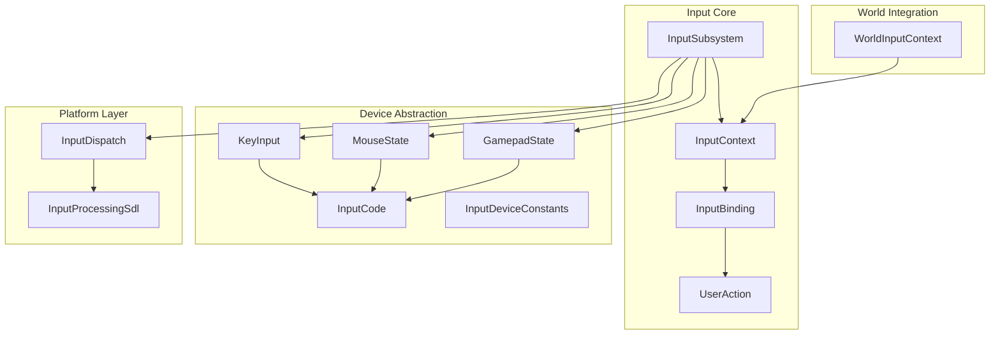
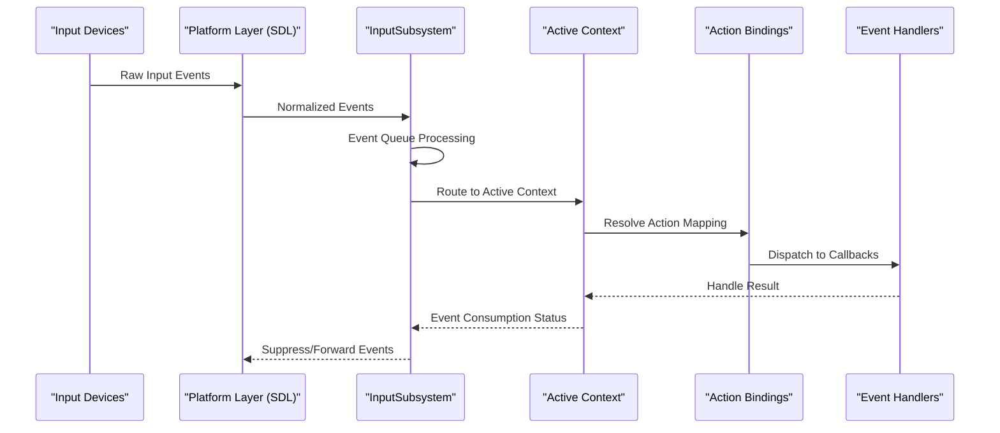
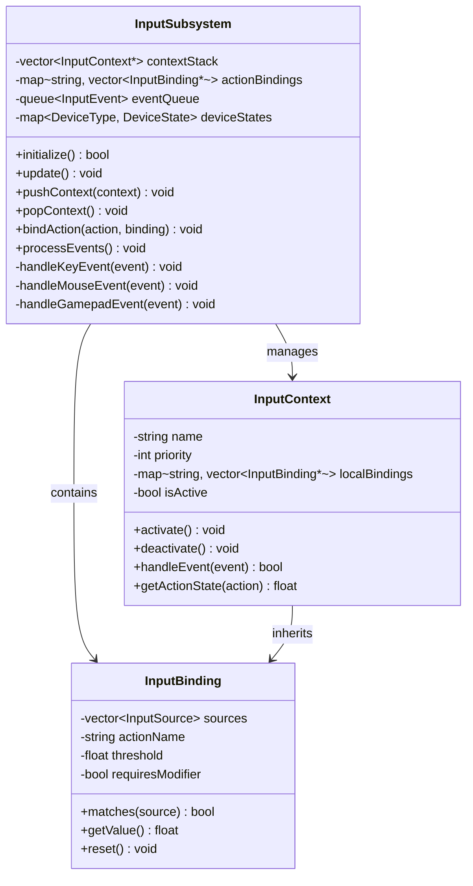
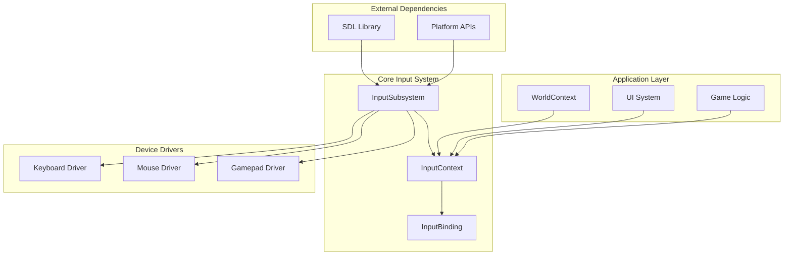

# Input Handling

<cite>
**Referenced Files in This Document**
- [InputSubsystem.hpp](file://engine/Poseidon/Input/InputSubsystem.hpp)
- [InputSubsystem.cpp](file://engine/Poseidon/Input/InputSubsystem.cpp)
- [InputContext.hpp](file://engine/Poseidon/Input/InputContext.hpp)
- [InputBinding.hpp](file://engine/Poseidon/Input/InputBinding.hpp)
- [UserAction.hpp](file://engine/Poseidon/Input/UserAction.hpp)
- [KeyInput.hpp](file://engine/Poseidon/Input/KeyInput.hpp)
- [MouseState.hpp](file://engine/Poseidon/Input/MouseState.hpp)
- [GamepadState.hpp](file://engine/Poseidon/Input/GamepadState.hpp)
- [InputCode.hpp](file://engine/Poseidon/Input/InputCode.hpp)
- [InputDeviceConstants.hpp](file://engine/Poseidon/Input/InputDeviceConstants.hpp)
- [InputDispatch.cpp](file://engine/Poseidon/Input/InputDispatch.cpp)
- [InputProcessingSdl.cpp](file://engine/Poseidon/Input/InputProcessingSdl.cpp)
- [WorldInputContext.hpp](file://engine/Poseidon/World/WorldInputContext.hpp)
- [WorldInputContext.cpp](file://engine/Poseidon/World/WorldInputContext.cpp)
</cite>

## Table of Contents
1. [Introduction](#introduction)
2. [Project Structure](#project-structure)
3. [Core Components](#core-components)
4. [Architecture Overview](#architecture-overview)
5. [Detailed Component Analysis](#detailed-component-analysis)
6. [Dependency Analysis](#dependency-analysis)
7. [Performance Considerations](#performance-considerations)
8. [Troubleshooting Guide](#troubleshooting-guide)
9. [Conclusion](#conclusion)

## Introduction

The Input Handling system is a comprehensive framework designed to process user interactions across multiple devices including keyboards, mice, gamepads, and touch interfaces. This system provides device abstraction, intelligent input routing, context-aware processing, and flexible action binding mechanisms that enable consistent user experiences across different platforms and input methods.

The architecture follows modern game engine design patterns with clear separation between low-level device polling, input normalization, context management, and high-level action dispatching. This approach ensures optimal performance while maintaining flexibility for various use cases from simple UI interactions to complex gameplay mechanics.

## Project Structure

The Input Handling system is organized within the `engine/Poseidon/Input` directory with a modular architecture that separates concerns into distinct components:

**Diagram sources**
- [InputSubsystem.hpp:1-100](file://engine/Poseidon/Input/InputSubsystem.hpp#L1-L100)
- [InputContext.hpp:1-100](file://engine/Poseidon/Input/InputContext.hpp#L1-L100)
- [InputBinding.hpp:1-100](file://engine/Poseidon/Input/InputBinding.hpp#L1-L100)

**Section sources**
- [InputSubsystem.hpp:1-150](file://engine/Poseidon/Input/InputSubsystem.hpp#L1-L150)
- [InputContext.hpp:1-150](file://engine/Poseidon/Input/InputContext.hpp#L1-L150)

## Core Components

### InputSubsystem Architecture

The InputSubsystem serves as the central coordinator for all input operations, managing device polling, event distribution, and context lifecycle. It implements a layered architecture where raw device events are normalized into abstract actions before being dispatched to appropriate contexts.

Key responsibilities include:
- Device manager initialization and lifecycle management
- Event queue management and prioritization
- Context stack management for state-based input handling
- Action binding resolution and dispatch
- Cross-platform abstraction layer coordination

### Device Abstraction Layer

The device abstraction layer provides unified interfaces for different input devices:

**Keyboard Input Processing**: Handles key press, release, and repeat events with platform-specific key code mapping and modifier state tracking. Supports both immediate and sustained key states for different interaction patterns.

**Mouse State Management**: Tracks cursor position, button states, scroll wheel events, and movement deltas. Implements coordinate transformation between screen space and world space when needed.

**Gamepad Support**: Manages controller connection detection, button mapping, analog stick processing with dead zones, and rumble feedback. Supports multiple controller types and hot-plugging scenarios.

### Input Context System

The context system enables state-based input handling where different UI states or gameplay modes have distinct input behaviors. Contexts can be stacked hierarchically, allowing for nested input handling such as menus within gameplay or tooltips within dialogs.

Context features include:
- Priority-based context activation
- Inherited action bindings
- Context-specific input validation
- Smooth transitions between contexts
- Resource cleanup on context destruction

**Section sources**
- [InputSubsystem.cpp:1-200](file://engine/Poseidon/Input/InputSubsystem.cpp#L1-L200)
- [InputContext.hpp:1-200](file://engine/Poseidon/Input/InputContext.hpp#L1-L200)
- [KeyInput.hpp:1-150](file://engine/Poseidon/Input/KeyInput.hpp#L1-L150)
- [MouseState.hpp:1-150](file://engine/Poseidon/Input/MouseState.hpp#L1-L150)
- [GamepadState.hpp:1-150](file://engine/Poseidon/Input/GamepadState.hpp#L1-L150)

## Architecture Overview

The Input Handling system follows a pipeline architecture that transforms raw device events into meaningful user actions through several processing stages:

**Diagram sources**
- [InputDispatch.cpp:1-150](file://engine/Poseidon/Input/InputDispatch.cpp#L1-L150)
- [InputProcessingSdl.cpp:1-150](file://engine/Poseidon/Input/InputProcessingSdl.cpp#L1-L150)
- [InputSubsystem.cpp:1-300](file://engine/Poseidon/Input/InputSubsystem.cpp#L1-L300)

### Input Routing Mechanism

The routing system determines which context should handle each input event based on:
- Context priority and activation state
- Input type compatibility
- Spatial targeting for mouse/touch events
- Modifier key combinations
- Time-based filtering and debouncing

### Action Binding System

The binding system maps low-level input events to high-level semantic actions:

**Static Bindings**: Configured at startup from configuration files or default layouts
**Dynamic Bindings**: Runtime modifications for user customization
**Conditional Bindings**: Context-dependent mappings that change based on application state
**Priority Bindings**: Multiple bindings per action with precedence rules

**Section sources**
- [InputDispatch.cpp:1-200](file://engine/Poseidon/Input/InputDispatch.cpp#L1-L200)
- [InputProcessingSdl.cpp:1-200](file://engine/Poseidon/Input/InputProcessingSdl.cpp#L1-L200)
- [InputBinding.hpp:1-200](file://engine/Poseidon/Input/InputBinding.hpp#L1-L200)

## Detailed Component Analysis

### InputSubsystem Implementation

The InputSubsystem class manages the complete input lifecycle from device initialization to event dispatch. It maintains separate queues for different input types and processes them in a deterministic order to ensure consistent behavior.

Key implementation aspects:
- **Thread Safety**: Input processing occurs on the main thread with proper synchronization for background device polling
- **Memory Management**: Efficient event pooling and recycling to minimize allocations during gameplay
- **Error Handling**: Graceful degradation when devices become unavailable
- **Configuration**: Runtime adjustment of sensitivity, dead zones, and other parameters

#### Class Diagram

**Diagram sources**
- [InputSubsystem.hpp:1-200](file://engine/Poseidon/Input/InputSubsystem.hpp#L1-L200)
- [InputContext.hpp:1-200](file://engine/Poseidon/Input/InputContext.hpp#L1-L200)
- [InputBinding.hpp:1-200](file://engine/Poseidon/Input/InputBinding.hpp#L1-L200)

### World Input Context Integration

The WorldInputContext extends the base InputContext to provide game-world specific functionality including camera controls, character movement, and interaction with 3D objects. It handles coordinate transformations and spatial queries for mouse-based selection.

Features include:
- Camera orbit and zoom controls
- Character movement and animation triggers
- Object selection and interaction
- HUD element targeting
- Multi-device coordination for split-screen scenarios

**Section sources**
- [WorldInputContext.hpp:1-200](file://engine/Poseidon/World/WorldInputContext.hpp#L1-L200)
- [WorldInputContext.cpp:1-200](file://engine/Poseidon/World/WorldInputContext.cpp#L1-L200)

### Device-Specific Processing

#### Keyboard Input Processing

Keyboard handling supports both immediate actions (like jumping) and sustained inputs (like running). The system tracks key states separately from events to support both discrete and continuous input patterns.

Implementation details:
- Key repeat rate configuration
- Modifier key combination support
- International keyboard layout compatibility
- N-key rollover for gaming scenarios

#### Mouse Input Processing

Mouse processing includes position tracking, button state management, and scroll wheel events. The system supports both absolute positioning for UI navigation and relative movement for camera control.

Advanced features:
- Cursor hiding and custom cursor support
- Coordinate transformation utilities
- Click and drag gesture recognition
- Scroll acceleration curves

#### Gamepad Input Processing

Gamepad support includes controller detection, button mapping, analog stick processing with configurable dead zones, and haptic feedback. The system handles controller hot-plugging and reconfiguration without requiring application restart.

Controller features:
- Multiple controller type support
- Button remapping interface
- Analog stick curve configuration
- Vibration pattern control

**Section sources**
- [KeyInput.hpp:1-200](file://engine/Poseidon/Input/KeyInput.hpp#L1-L200)
- [MouseState.hpp:1-200](file://engine/Poseidon/Input/MouseState.hpp#L1-L200)
- [GamepadState.hpp:1-200](file://engine/Poseidon/Input/GamepadState.hpp#L1-L200)

### Input Validation and Filtering

The system includes comprehensive input validation to prevent invalid or malicious input:

**Range Validation**: Ensures numeric inputs fall within acceptable bounds
**Format Validation**: Validates text input against expected patterns
**Rate Limiting**: Prevents excessive input frequency to avoid abuse
**Context Validation**: Ensures inputs are valid for the current application state

**Section sources**
- [InputCode.hpp:1-150](file://engine/Poseidon/Input/InputCode.hpp#L1-L150)
- [InputDeviceConstants.hpp:1-150](file://engine/Poseidon/Input/InputDeviceConstants.hpp#L1-L150)

## Dependency Analysis

The Input Handling system has well-defined dependencies that promote modularity and testability:

**Diagram sources**
- [InputProcessingSdl.cpp:1-100](file://engine/Poseidon/Input/InputProcessingSdl.cpp#L1-L100)
- [InputDispatch.cpp:1-100](file://engine/Poseidon/Input/InputDispatch.cpp#L1-L100)

### Internal Dependencies

The system maintains loose coupling between components through well-defined interfaces:
- InputSubsystem depends on device drivers but not their implementations
- Contexts depend on binding interfaces but not specific bindings
- Device drivers depend on platform abstractions but not application logic

### External Dependencies

Primary external dependencies include:
- **SDL Library**: Cross-platform input device abstraction
- **Platform APIs**: Native OS input handling where necessary
- **Math Libraries**: Vector and matrix operations for coordinate transformations

**Section sources**
- [InputProcessingSdl.cpp:1-200](file://engine/Poseidon/Input/InputProcessingSdl.cpp#L1-L200)
- [InputDispatch.cpp:1-200](file://engine/Poseidon/Input/InputDispatch.cpp#L1-L200)

## Performance Considerations

The Input Handling system is optimized for real-time performance with several key strategies:

### Memory Management
- **Event Pooling**: Reuses input event objects to minimize heap allocations
- **Zero-Copy Processing**: Avoids unnecessary data copying between processing stages
- **Efficient Data Structures**: Uses hash maps for O(1) action lookup and vectors for ordered processing

### Processing Optimization
- **Batched Updates**: Groups device polling calls to reduce system overhead
- **Early Exit Optimization**: Skips processing for inactive contexts
- **Delta Compression**: Only processes changed input values

### Threading Strategy
- **Main Thread Processing**: All input processing occurs on the main thread for consistency
- **Background Polling**: Device polling runs asynchronously with lock-free queues
- **Frame Synchronization**: Input updates synchronized with frame rendering

### Latency Reduction
- **Minimal Processing Pipeline**: Reduces steps between input and response
- **Predictive Processing**: Pre-processes likely inputs based on context
- **Hardware Acceleration**: Leverages GPU for mouse cursor rendering when available

## Troubleshooting Guide

### Common Input Issues

**Unresponsive Controls**: Check context activation status and action binding configuration
**Input Lag**: Verify frame rate impact and input processing pipeline efficiency
**Device Detection Problems**: Ensure proper device enumeration and driver compatibility
**Multi-Device Conflicts**: Review input priority settings and context-specific bindings

### Debugging Tools

The system includes comprehensive debugging capabilities:

**Input Logging**: Detailed logging of all input events and processing decisions
**Visualization Tools**: Real-time display of active contexts and bound actions
**Performance Profiling**: Metrics for input latency and processing overhead
**State Inspection**: Runtime inspection of device states and context hierarchy

### Accessibility Features

Built-in accessibility support includes:
- **High Contrast Modes**: Enhanced visual feedback for input events
- **Alternative Input Methods**: Support for switch devices and eye tracking
- **Customizable Sensitivity**: Adjustable thresholds for motor impairments
- **Audio Feedback**: Sound cues for important input events

**Section sources**
- [InputSubsystem.cpp:200-400](file://engine/Poseidon/Input/InputSubsystem.cpp#L200-L400)
- [WorldInputContext.cpp:200-400](file://engine/Poseidon/World/WorldInputContext.cpp#L200-L400)

## Conclusion

The Input Handling system provides a robust, flexible foundation for processing user interactions across diverse devices and platforms. Its modular architecture enables easy extension and customization while maintaining high performance and reliability. The comprehensive feature set supports everything from simple UI interactions to complex gameplay mechanics, with built-in accessibility considerations ensuring broad usability.

The system's emphasis on context management, action binding, and device abstraction creates a clean separation of concerns that facilitates testing, maintenance, and evolution. Future enhancements can build upon this solid foundation while preserving backward compatibility and performance characteristics.

For developers working with the input system, the provided interfaces and documentation enable rapid integration of new input devices, custom processing pipelines, and specialized interaction patterns while leveraging the existing infrastructure for common input handling tasks.