# Localization & Internationalization

<cite>
**Referenced Files in This Document**
- [stringtable.cpp](file://engine/Poseidon/IO/ParamFile/stringtable.cpp)
- [stringtable.hpp](file://engine/Poseidon/IO/ParamFile/stringtable.hpp)
- [LocaleManager.cpp](file://engine/Poseidon/UI/Locale/LocaleManager.cpp)
- [LocaleManager.hpp](file://engine/Poseidon/UI/Locale/LocaleManager.hpp)
- [LanguageRegistry.cpp](file://engine/Poseidon/UI/Locale/LanguageRegistry.cpp)
- [LanguageRegistry.hpp](file://engine/Poseidon/UI/Locale/LanguageRegistry.hpp)
- [StringFormatter.cpp](file://engine/Poseidon/Foundation/Strings/StringFormatter.cpp)
- [StringFormatter.hpp](file://engine/Poseidon/Foundation/Strings/StringFormatter.hpp)
- [DateTimeLocalization.cpp](file://engine/Poseidon/Foundation/Time/DateTimeLocalization.cpp)
- [DateTimeLocalization.hpp](file://engine/Poseidon/Foundation/Time/DateTimeLocalization.hpp)
- [NumberFormatting.cpp](file://engine/Poseidon/Foundation/Strings/NumberFormatting.cpp)
- [NumberFormatting.hpp](file://engine/Poseidon/Foundation/Strings/NumberFormatting.hpp)
- [rtl_support.cpp](file://engine/Poseidon/Graphics/Text/rtl_support.cpp)
- [rtl_support.hpp](file://engine/Poseidon/Graphics/Text/rtl_support.hpp)
- [fuzz_stringtable.cpp](file://apps/fuzzers/Fuzzer/fuzz_stringtable.cpp)
- [stringtable_fixture.xml](file://tests/fixtures/stringtable/stringtable_fixture.xml)
- [stringtable_test.cpp](file://tests/unit/engine/paramfile/stringtable_test.cpp)
</cite>

## Table of Contents
1. [Introduction](#introduction)
2. [Project Structure](#project-structure)
3. [Core Components](#core-components)
4. [Architecture Overview](#architecture-overview)
5. [Detailed Component Analysis](#detailed-component-analysis)
6. [Dependency Analysis](#dependency-analysis)
7. [Performance Considerations](#performance-considerations)
8. [Troubleshooting Guide](#troubleshooting-guide)
9. [Conclusion](#conclusion)
10. [Appendices](#appendices)

## Introduction
This document explains the Localization and Internationalization (i18n) system that enables multiple languages, regional formats, runtime language switching, and robust fallback behavior. It covers:
- The stringtable system for managing localized text resources
- Language detection and registry of supported locales
- Runtime language switching with fallback mechanisms
- Encoding handling and character set support
- String formatting, date/time localization, and number formatting
- Right-to-left (RTL) layout support
- Practical guidance for adding new languages, creating stringtable files, and testing internationalized applications

## Project Structure
The i18n subsystem spans several engine modules:
- ParamFile parsing for stringtable XML resources
- UI Locale management for language selection and runtime switching
- Foundation utilities for string, number, and date/time formatting
- Graphics text rendering helpers for RTL scripts
- Fuzzing and unit tests to ensure correctness and resilience

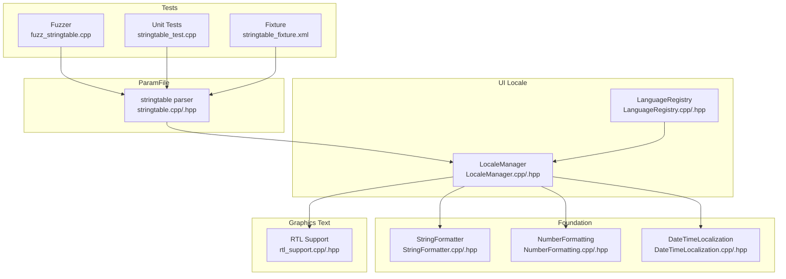

**Diagram sources**
- [stringtable.cpp](file://engine/Poseidon/IO/ParamFile/stringtable.cpp)
- [stringtable.hpp](file://engine/Poseidon/IO/ParamFile/stringtable.hpp)
- [LocaleManager.cpp](file://engine/Poseidon/UI/Locale/LocaleManager.cpp)
- [LocaleManager.hpp](file://engine/Poseidon/UI/Locale/LocaleManager.hpp)
- [LanguageRegistry.cpp](file://engine/Poseidon/UI/Locale/LanguageRegistry.cpp)
- [LanguageRegistry.hpp](file://engine/Poseidon/UI/Locale/LanguageRegistry.hpp)
- [StringFormatter.cpp](file://engine/Poseidon/Foundation/Strings/StringFormatter.cpp)
- [StringFormatter.hpp](file://engine/Poseidon/Foundation/Strings/StringFormatter.hpp)
- [NumberFormatting.cpp](file://engine/Poseidon/Foundation/Strings/NumberFormatting.cpp)
- [NumberFormatting.hpp](file://engine/Poseidon/Foundation/Strings/NumberFormatting.hpp)
- [DateTimeLocalization.cpp](file://engine/Poseidon/Foundation/Time/DateTimeLocalization.cpp)
- [DateTimeLocalization.hpp](file://engine/Poseidon/Foundation/Time/DateTimeLocalization.hpp)
- [rtl_support.cpp](file://engine/Poseidon/Graphics/Text/rtl_support.cpp)
- [rtl_support.hpp](file://engine/Poseidon/Graphics/Text/rtl_support.hpp)
- [fuzz_stringtable.cpp](file://apps/fuzzers/Fuzzer/fuzz_stringtable.cpp)
- [stringtable_test.cpp](file://tests/unit/engine/paramfile/stringtable_test.cpp)
- [stringtable_fixture.xml](file://tests/fixtures/stringtable/stringtable_fixture.xml)

**Section sources**
- [stringtable.cpp](file://engine/Poseidon/IO/ParamFile/stringtable.cpp)
- [stringtable.hpp](file://engine/Poseidon/IO/ParamFile/stringtable.hpp)
- [LocaleManager.cpp](file://engine/Poseidon/UI/Locale/LocaleManager.cpp)
- [LocaleManager.hpp](file://engine/Poseidon/UI/Locale/LocaleManager.hpp)
- [LanguageRegistry.cpp](file://engine/Poseidon/UI/Locale/LanguageRegistry.cpp)
- [LanguageRegistry.hpp](file://engine/Poseidon/UI/Locale/LanguageRegistry.hpp)
- [StringFormatter.cpp](file://engine/Poseidon/Foundation/Strings/StringFormatter.cpp)
- [StringFormatter.hpp](file://engine/Poseidon/Foundation/Strings/StringFormatter.hpp)
- [NumberFormatting.cpp](file://engine/Poseidon/Foundation/Strings/NumberFormatting.cpp)
- [NumberFormatting.hpp](file://engine/Poseidon/Foundation/Strings/NumberFormatting.hpp)
- [DateTimeLocalization.cpp](file://engine/Poseidon/Foundation/Time/DateTimeLocalization.cpp)
- [DateTimeLocalization.hpp](file://engine/Poseidon/Foundation/Time/DateTimeLocalization.hpp)
- [rtl_support.cpp](file://engine/Poseidon/Graphics/Text/rtl_support.cpp)
- [rtl_support.hpp](file://engine/Poseidon/Graphics/Text/rtl_support.hpp)
- [fuzz_stringtable.cpp](file://apps/fuzzers/Fuzzer/fuzz_stringtable.cpp)
- [stringtable_test.cpp](file://tests/unit/engine/paramfile/stringtable_test.cpp)
- [stringtable_fixture.xml](file://tests/fixtures/stringtable/stringtable_fixture.xml)

## Core Components
- Stringtable Parser: Loads and parses XML-based stringtable resources into a lookup structure keyed by entry identifiers and locale tags.
- LocaleManager: Tracks current language, detects preferred locale from environment or user settings, and provides localized strings via fallback chains.
- LanguageRegistry: Declares supported languages and their metadata; used by LocaleManager to validate and select locales.
- StringFormatter: Formats strings with placeholders and locale-aware rules.
- NumberFormatting: Applies locale-specific number formatting (grouping, decimals, currency).
- DateTimeLocalization: Formats dates and times according to selected locale conventions.
- RTL Support: Detects and processes right-to-left scripts for correct text shaping and layout.

**Section sources**
- [stringtable.cpp](file://engine/Poseidon/IO/ParamFile/stringtable.cpp)
- [stringtable.hpp](file://engine/Poseidon/IO/ParamFile/stringtable.hpp)
- [LocaleManager.cpp](file://engine/Poseidon/UI/Locale/LocaleManager.cpp)
- [LocaleManager.hpp](file://engine/Poseidon/UI/Locale/LocaleManager.hpp)
- [LanguageRegistry.cpp](file://engine/Poseidon/UI/Locale/LanguageRegistry.cpp)
- [LanguageRegistry.hpp](file://engine/Poseidon/UI/Locale/LanguageRegistry.hpp)
- [StringFormatter.cpp](file://engine/Poseidon/Foundation/Strings/StringFormatter.cpp)
- [StringFormatter.hpp](file://engine/Poseidon/Foundation/Strings/StringFormatter.hpp)
- [NumberFormatting.cpp](file://engine/Poseidon/Foundation/Strings/NumberFormatting.cpp)
- [NumberFormatting.hpp](file://engine/Poseidon/Foundation/Strings/NumberFormatting.hpp)
- [DateTimeLocalization.cpp](file://engine/Poseidon/Foundation/Time/DateTimeLocalization.cpp)
- [DateTimeLocalization.hpp](file://engine/Poseidon/Foundation/Time/DateTimeLocalization.hpp)
- [rtl_support.cpp](file://engine/Poseidon/Graphics/Text/rtl_support.cpp)
- [rtl_support.hpp](file://engine/Poseidon/Graphics/Text/rtl_support.hpp)

## Architecture Overview
The i18n pipeline integrates resource loading, locale resolution, and formatting services:

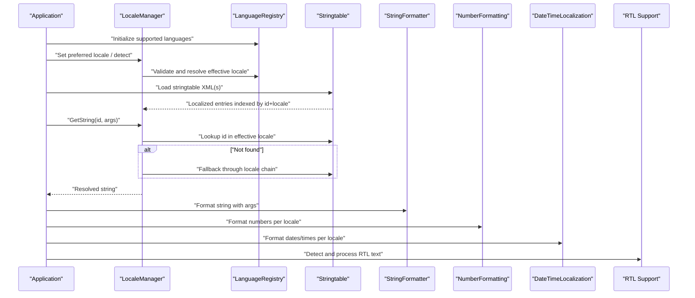

**Diagram sources**
- [LocaleManager.cpp](file://engine/Poseidon/UI/Locale/LocaleManager.cpp)
- [LocaleManager.hpp](file://engine/Poseidon/UI/Locale/LocaleManager.hpp)
- [LanguageRegistry.cpp](file://engine/Poseidon/UI/Locale/LanguageRegistry.cpp)
- [LanguageRegistry.hpp](file://engine/Poseidon/UI/Locale/LanguageRegistry.hpp)
- [stringtable.cpp](file://engine/Poseidon/IO/ParamFile/stringtable.cpp)
- [stringtable.hpp](file://engine/Poseidon/IO/ParamFile/stringtable.hpp)
- [StringFormatter.cpp](file://engine/Poseidon/Foundation/Strings/StringFormatter.cpp)
- [StringFormatter.hpp](file://engine/Poseidon/Foundation/Strings/StringFormatter.hpp)
- [NumberFormatting.cpp](file://engine/Poseidon/Foundation/Strings/NumberFormatting.cpp)
- [NumberFormatting.hpp](file://engine/Poseidon/Foundation/Strings/NumberFormatting.hpp)
- [DateTimeLocalization.cpp](file://engine/Poseidon/Foundation/Time/DateTimeLocalization.cpp)
- [DateTimeLocalization.hpp](file://engine/Poseidon/Foundation/Time/DateTimeLocalization.hpp)
- [rtl_support.cpp](file://engine/Poseidon/Graphics/Text/rtl_support.cpp)
- [rtl_support.hpp](file://engine/Poseidon/Graphics/Text/rtl_support.hpp)

## Detailed Component Analysis

### Stringtable System
Responsibilities:
- Parse XML stringtable files into an internal map keyed by entry ID and locale tag
- Provide fast lookup with fallback across locale variants
- Handle encoding normalization during load

Key behaviors:
- Supports multiple <trans unit> elements per ID with different locale attributes
- Normalizes whitespace and handles nested markup safely
- Returns a default fallback when no matching locale is found

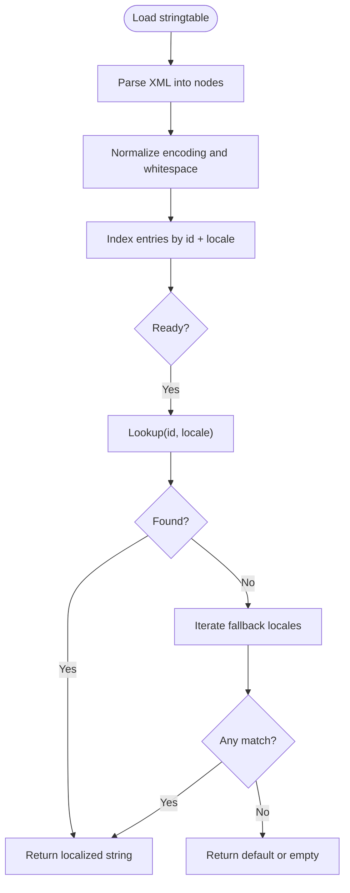

**Diagram sources**
- [stringtable.cpp](file://engine/Poseidon/IO/ParamFile/stringtable.cpp)
- [stringtable.hpp](file://engine/Poseidon/IO/ParamFile/stringtable.hpp)

**Section sources**
- [stringtable.cpp](file://engine/Poseidon/IO/ParamFile/stringtable.cpp)
- [stringtable.hpp](file://engine/Poseidon/IO/ParamFile/stringtable.hpp)

### Language Detection and Registry
Responsibilities:
- Maintain a registry of supported languages with canonical codes and display names
- Resolve the effective locale from user preferences, OS settings, or defaults
- Validate requested locales against the registry

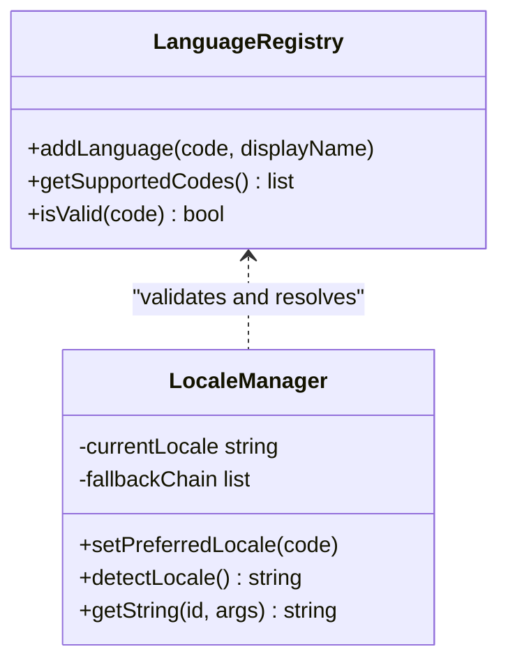

**Diagram sources**
- [LanguageRegistry.cpp](file://engine/Poseidon/UI/Locale/LanguageRegistry.cpp)
- [LanguageRegistry.hpp](file://engine/Poseidon/UI/Locale/LanguageRegistry.hpp)
- [LocaleManager.cpp](file://engine/Poseidon/UI/Locale/LocaleManager.cpp)
- [LocaleManager.hpp](file://engine/Poseidon/UI/Locale/LocaleManager.hpp)

**Section sources**
- [LanguageRegistry.cpp](file://engine/Poseidon/UI/Locale/LanguageRegistry.cpp)
- [LanguageRegistry.hpp](file://engine/Poseidon/UI/Locale/LanguageRegistry.hpp)
- [LocaleManager.cpp](file://engine/Poseidon/UI/Locale/LocaleManager.cpp)
- [LocaleManager.hpp](file://engine/Poseidon/UI/Locale/LocaleManager.hpp)

### Runtime Language Switching
Runtime switching updates the active locale and refreshes dependent caches:
- Update current locale in LocaleManager
- Rebuild fallback chain based on LanguageRegistry
- Invalidate cached lookups if necessary
- Ensure subsequent GetString calls use the new locale

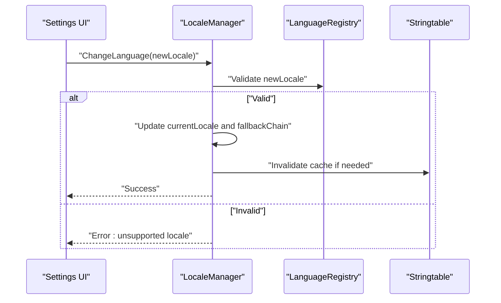

**Diagram sources**
- [LocaleManager.cpp](file://engine/Poseidon/UI/Locale/LocaleManager.cpp)
- [LocaleManager.hpp](file://engine/Poseidon/UI/Locale/LocaleManager.hpp)
- [LanguageRegistry.cpp](file://engine/Poseidon/UI/Locale/LanguageRegistry.cpp)
- [LanguageRegistry.hpp](file://engine/Poseidon/UI/Locale/LanguageRegistry.hpp)
- [stringtable.cpp](file://engine/Poseidon/IO/ParamFile/stringtable.cpp)
- [stringtable.hpp](file://engine/Poseidon/IO/ParamFile/stringtable.hpp)

**Section sources**
- [LocaleManager.cpp](file://engine/Poseidon/UI/Locale/LocaleManager.cpp)
- [LocaleManager.hpp](file://engine/Poseidon/UI/Locale/LocaleManager.hpp)
- [LanguageRegistry.cpp](file://engine/Poseidon/UI/Locale/LanguageRegistry.cpp)
- [LanguageRegistry.hpp](file://engine/Poseidon/UI/Locale/LanguageRegistry.hpp)
- [stringtable.cpp](file://engine/Poseidon/IO/ParamFile/stringtable.cpp)
- [stringtable.hpp](file://engine/Poseidon/IO/ParamFile/stringtable.hpp)

### String Formatting
- Placeholder substitution with type safety
- Locale-aware pluralization and gender rules where applicable
- Escaping and safe interpolation for dynamic content

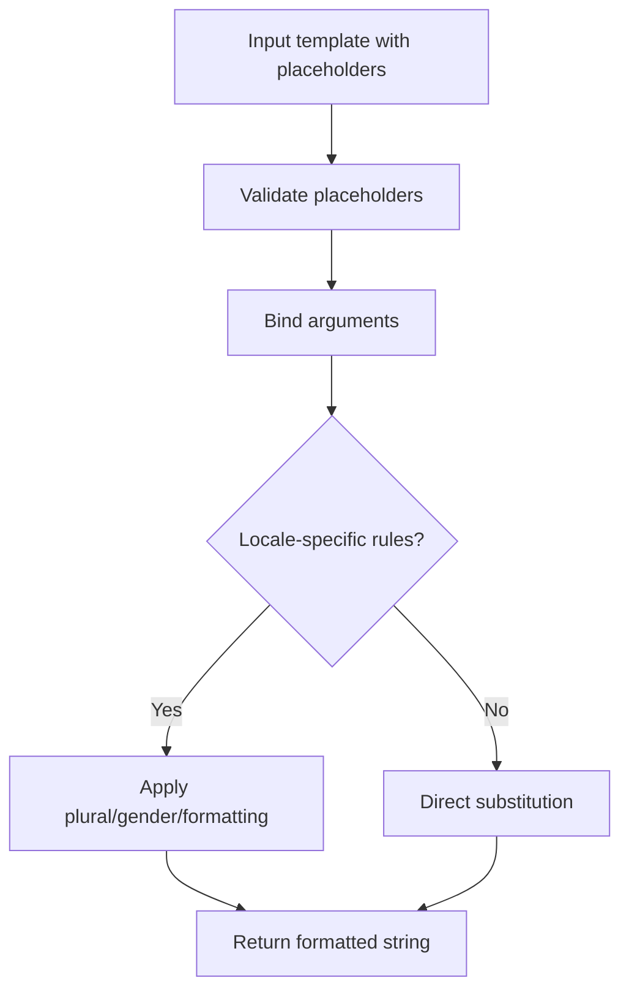

**Diagram sources**
- [StringFormatter.cpp](file://engine/Poseidon/Foundation/Strings/StringFormatter.cpp)
- [StringFormatter.hpp](file://engine/Poseidon/Foundation/Strings/StringFormatter.hpp)

**Section sources**
- [StringFormatter.cpp](file://engine/Poseidon/Foundation/Strings/StringFormatter.cpp)
- [StringFormatter.hpp](file://engine/Poseidon/Foundation/Strings/StringFormatter.hpp)

### Date/Time Localization
- Format dates and times using locale-specific patterns
- Respect calendar systems and time zones as configured
- Provide consistent APIs for both short and long formats

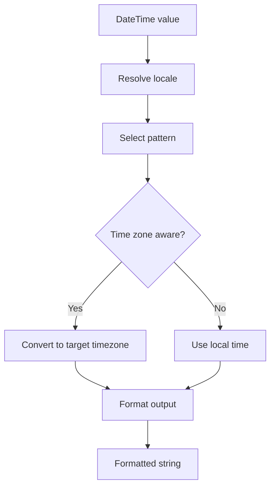

**Diagram sources**
- [DateTimeLocalization.cpp](file://engine/Poseidon/Foundation/Time/DateTimeLocalization.cpp)
- [DateTimeLocalization.hpp](file://engine/Poseidon/Foundation/Time/DateTimeLocalization.hpp)

**Section sources**
- [DateTimeLocalization.cpp](file://engine/Poseidon/Foundation/Time/DateTimeLocalization.cpp)
- [DateTimeLocalization.hpp](file://engine/Poseidon/Foundation/Time/DateTimeLocalization.hpp)

### Number Formatting
- Grouping separators, decimal separators, and precision control
- Currency formatting with symbols and codes
- Locale-specific rounding and display rules

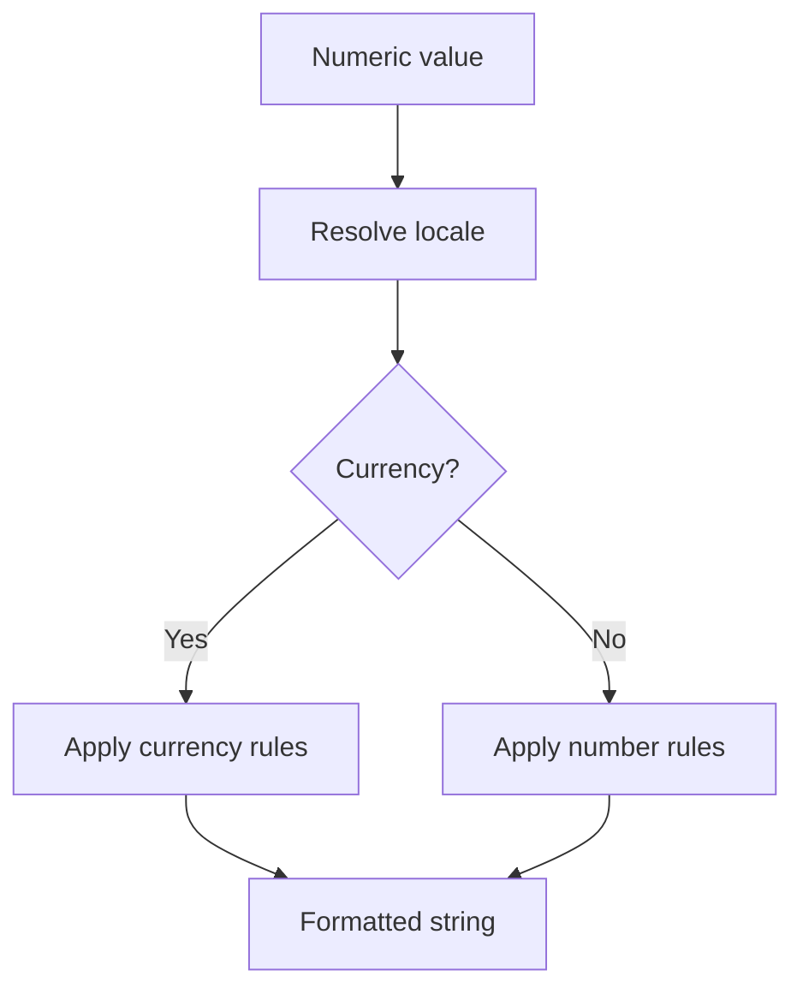

**Diagram sources**
- [NumberFormatting.cpp](file://engine/Poseidon/Foundation/Strings/NumberFormatting.cpp)
- [NumberFormatting.hpp](file://engine/Poseidon/Foundation/Strings/NumberFormatting.hpp)

**Section sources**
- [NumberFormatting.cpp](file://engine/Poseidon/Foundation/Strings/NumberFormatting.cpp)
- [NumberFormatting.hpp](file://engine/Poseidon/Foundation/Strings/NumberFormatting.hpp)

### Right-to-Left (RTL) Layout Support
- Detect RTL scripts in input text
- Apply bidirectional processing for correct visual order
- Integrate with text rendering pipeline for proper shaping

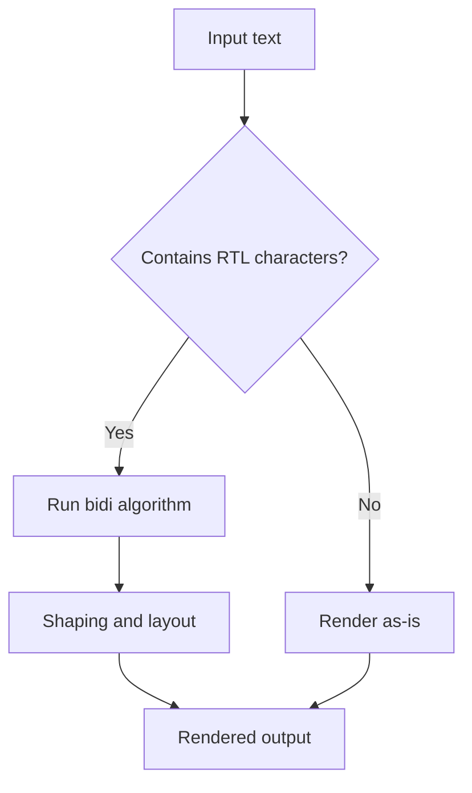

**Diagram sources**
- [rtl_support.cpp](file://engine/Poseidon/Graphics/Text/rtl_support.cpp)
- [rtl_support.hpp](file://engine/Poseidon/Graphics/Text/rtl_support.hpp)

**Section sources**
- [rtl_support.cpp](file://engine/Poseidon/Graphics/Text/rtl_support.cpp)
- [rtl_support.hpp](file://engine/Poseidon/Graphics/Text/rtl_support.hpp)

### Conceptual Overview
The i18n system composes these components to deliver a seamless experience:
- Resource layer (stringtable) supplies localized strings
- Locale layer (LocaleManager + LanguageRegistry) selects and validates languages
- Formatting layer (StringFormatter, NumberFormatting, DateTimeLocalization) adapts outputs
- Rendering layer (RTL Support) ensures correct script directionality

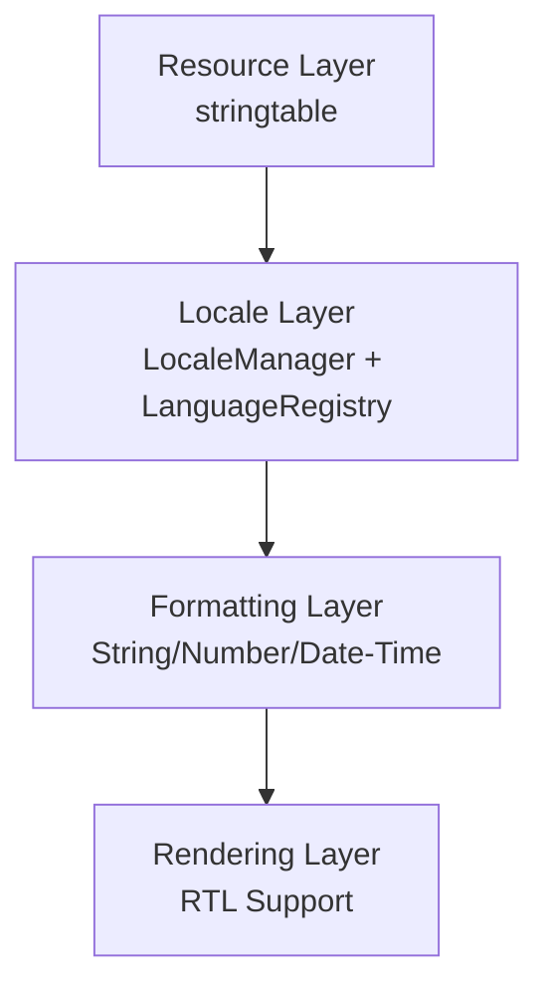

[No sources needed since this diagram shows conceptual workflow, not actual code structure]

## Dependency Analysis
High-level dependencies among i18n components:

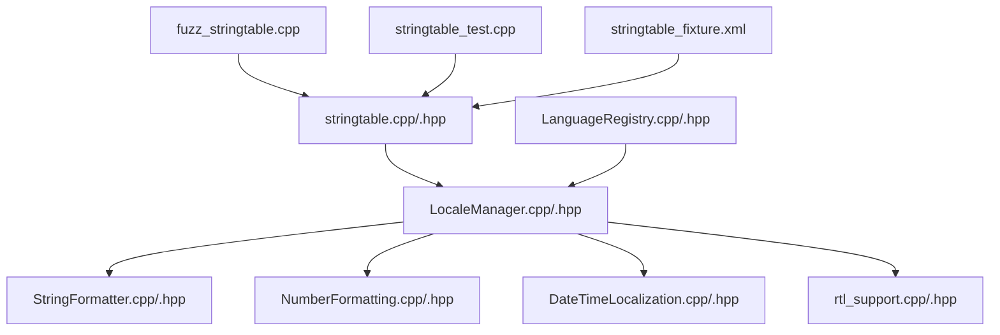

**Diagram sources**
- [stringtable.cpp](file://engine/Poseidon/IO/ParamFile/stringtable.cpp)
- [stringtable.hpp](file://engine/Poseidon/IO/ParamFile/stringtable.hpp)
- [LocaleManager.cpp](file://engine/Poseidon/UI/Locale/LocaleManager.cpp)
- [LocaleManager.hpp](file://engine/Poseidon/UI/Locale/LocaleManager.hpp)
- [LanguageRegistry.cpp](file://engine/Poseidon/UI/Locale/LanguageRegistry.cpp)
- [LanguageRegistry.hpp](file://engine/Poseidon/UI/Locale/LanguageRegistry.hpp)
- [StringFormatter.cpp](file://engine/Poseidon/Foundation/Strings/StringFormatter.cpp)
- [StringFormatter.hpp](file://engine/Poseidon/Foundation/Strings/StringFormatter.hpp)
- [NumberFormatting.cpp](file://engine/Poseidon/Foundation/Strings/NumberFormatting.cpp)
- [NumberFormatting.hpp](file://engine/Poseidon/Foundation/Strings/NumberFormatting.hpp)
- [DateTimeLocalization.cpp](file://engine/Poseidon/Foundation/Time/DateTimeLocalization.cpp)
- [DateTimeLocalization.hpp](file://engine/Poseidon/Foundation/Time/DateTimeLocalization.hpp)
- [rtl_support.cpp](file://engine/Poseidon/Graphics/Text/rtl_support.cpp)
- [rtl_support.hpp](file://engine/Poseidon/Graphics/Text/rtl_support.hpp)
- [fuzz_stringtable.cpp](file://apps/fuzzers/Fuzzer/fuzz_stringtable.cpp)
- [stringtable_test.cpp](file://tests/unit/engine/paramfile/stringtable_test.cpp)
- [stringtable_fixture.xml](file://tests/fixtures/stringtable/stringtable_fixture.xml)

**Section sources**
- [stringtable.cpp](file://engine/Poseidon/IO/ParamFile/stringtable.cpp)
- [stringtable.hpp](file://engine/Poseidon/IO/ParamFile/stringtable.hpp)
- [LocaleManager.cpp](file://engine/Poseidon/UI/Locale/LocaleManager.cpp)
- [LocaleManager.hpp](file://engine/Poseidon/UI/Locale/LocaleManager.hpp)
- [LanguageRegistry.cpp](file://engine/Poseidon/UI/Locale/LanguageRegistry.cpp)
- [LanguageRegistry.hpp](file://engine/Poseidon/UI/Locale/LanguageRegistry.hpp)
- [StringFormatter.cpp](file://engine/Poseidon/Foundation/Strings/StringFormatter.cpp)
- [StringFormatter.hpp](file://engine/Poseidon/Foundation/Strings/StringFormatter.hpp)
- [NumberFormatting.cpp](file://engine/Poseidon/Foundation/Strings/NumberFormatting.cpp)
- [NumberFormatting.hpp](file://engine/Poseidon/Foundation/Strings/NumberFormatting.hpp)
- [DateTimeLocalization.cpp](file://engine/Poseidon/Foundation/Time/DateTimeLocalization.cpp)
- [DateTimeLocalization.hpp](file://engine/Poseidon/Foundation/Time/DateTimeLocalization.hpp)
- [rtl_support.cpp](file://engine/Poseidon/Graphics/Text/rtl_support.cpp)
- [rtl_support.hpp](file://engine/Poseidon/Graphics/Text/rtl_support.hpp)
- [fuzz_stringtable.cpp](file://apps/fuzzers/Fuzzer/fuzz_stringtable.cpp)
- [stringtable_test.cpp](file://tests/unit/engine/paramfile/stringtable_test.cpp)
- [stringtable_fixture.xml](file://tests/fixtures/stringtable/stringtable_fixture.xml)

## Performance Considerations
- Cache localized strings after first lookup to avoid repeated parsing and fallback traversal
- Preload commonly used stringtables at startup to reduce latency
- Minimize fallback chain length by providing precise locale variants
- Avoid heavy formatting operations on hot paths; batch or defer where possible
- Use efficient data structures for stringtable indexing (e.g., hash maps keyed by id+locale)

[No sources needed since this section provides general guidance]

## Troubleshooting Guide
Common issues and resolutions:
- Missing localized strings: Verify stringtable includes the target locale and entry IDs; check fallback chain and default values
- Incorrect encoding: Ensure stringtable files are UTF-8; normalize encoding during load
- Wrong number/date formats: Confirm locale is correctly set and patterns are available
- RTL rendering problems: Validate bidi processing and font coverage for the script
- Performance regressions: Inspect caching behavior and excessive fallback traversals

**Section sources**
- [stringtable.cpp](file://engine/Poseidon/IO/ParamFile/stringtable.cpp)
- [stringtable.hpp](file://engine/Poseidon/IO/ParamFile/stringtable.hpp)
- [LocaleManager.cpp](file://engine/Poseidon/UI/Locale/LocaleManager.cpp)
- [LocaleManager.hpp](file://engine/Poseidon/UI/Locale/LocaleManager.hpp)
- [rtl_support.cpp](file://engine/Poseidon/Graphics/Text/rtl_support.cpp)
- [rtl_support.hpp](file://engine/Poseidon/Graphics/Text/rtl_support.hpp)

## Conclusion
The i18n system combines robust resource management, flexible locale resolution, and comprehensive formatting services to deliver a fully localized experience. By following the guidelines for adding languages, structuring stringtable files, and leveraging built-in formatting and RTL support, developers can create accessible, globally compatible applications.

[No sources needed since this section summarizes without analyzing specific files]

## Appendices

### Adding a New Language
Steps:
- Register the new language in LanguageRegistry with its canonical code and display name
- Add stringtable entries for the new locale tag
- Ensure fonts cover required scripts
- Test with unit tests and fuzzing

**Section sources**
- [LanguageRegistry.cpp](file://engine/Poseidon/UI/Locale/LanguageRegistry.cpp)
- [LanguageRegistry.hpp](file://engine/Poseidon/UI/Locale/LanguageRegistry.hpp)
- [stringtable.cpp](file://engine/Poseidon/IO/ParamFile/stringtable.cpp)
- [stringtable.hpp](file://engine/Poseidon/IO/ParamFile/stringtable.hpp)

### Creating Stringtable Files
Guidelines:
- Use UTF-8 encoding
- Include unique entry IDs and locale attributes
- Provide fallback entries for missing translations
- Keep placeholders consistent across locales

**Section sources**
- [stringtable.cpp](file://engine/Poseidon/IO/ParamFile/stringtable.cpp)
- [stringtable.hpp](file://engine/Poseidon/IO/ParamFile/stringtable.hpp)
- [stringtable_fixture.xml](file://tests/fixtures/stringtable/stringtable_fixture.xml)

### Handling RTL Text Layouts
Recommendations:
- Enable bidi processing for mixed-direction text
- Choose fonts with full glyph coverage for RTL scripts
- Validate layout in UI tests across common RTL locales

**Section sources**
- [rtl_support.cpp](file://engine/Poseidon/Graphics/Text/rtl_support.cpp)
- [rtl_support.hpp](file://engine/Poseidon/Graphics/Text/rtl_support.hpp)

### Testing Strategies
- Unit tests for stringtable parsing and fallback logic
- Fuzzing to catch edge cases in XML parsing
- Integration tests verifying runtime language switching and formatting
- Visual regression checks for RTL layouts

**Section sources**
- [stringtable_test.cpp](file://tests/unit/engine/paramfile/stringtable_test.cpp)
- [fuzz_stringtable.cpp](file://apps/fuzzers/Fuzzer/fuzz_stringtable.cpp)
- [stringtable_fixture.xml](file://tests/fixtures/stringtable/stringtable_fixture.xml)