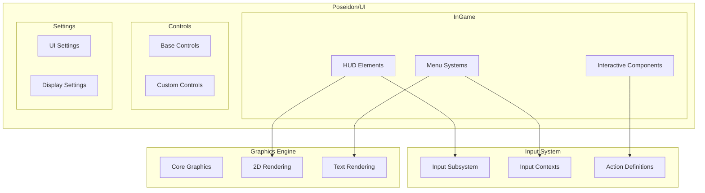
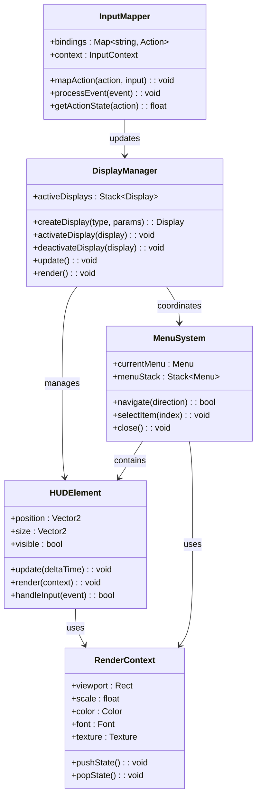
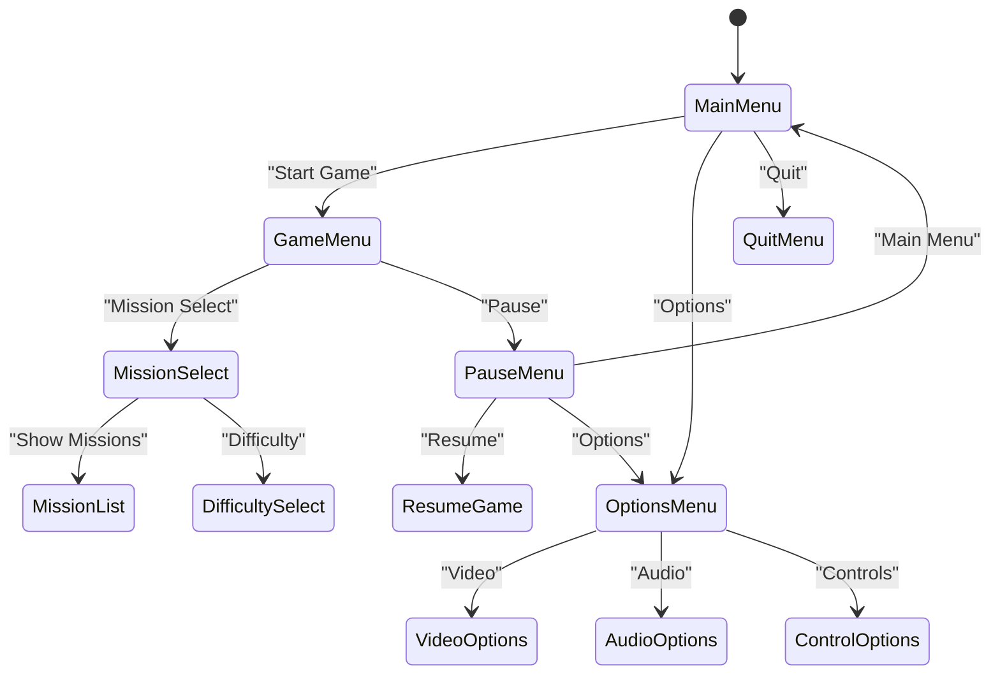
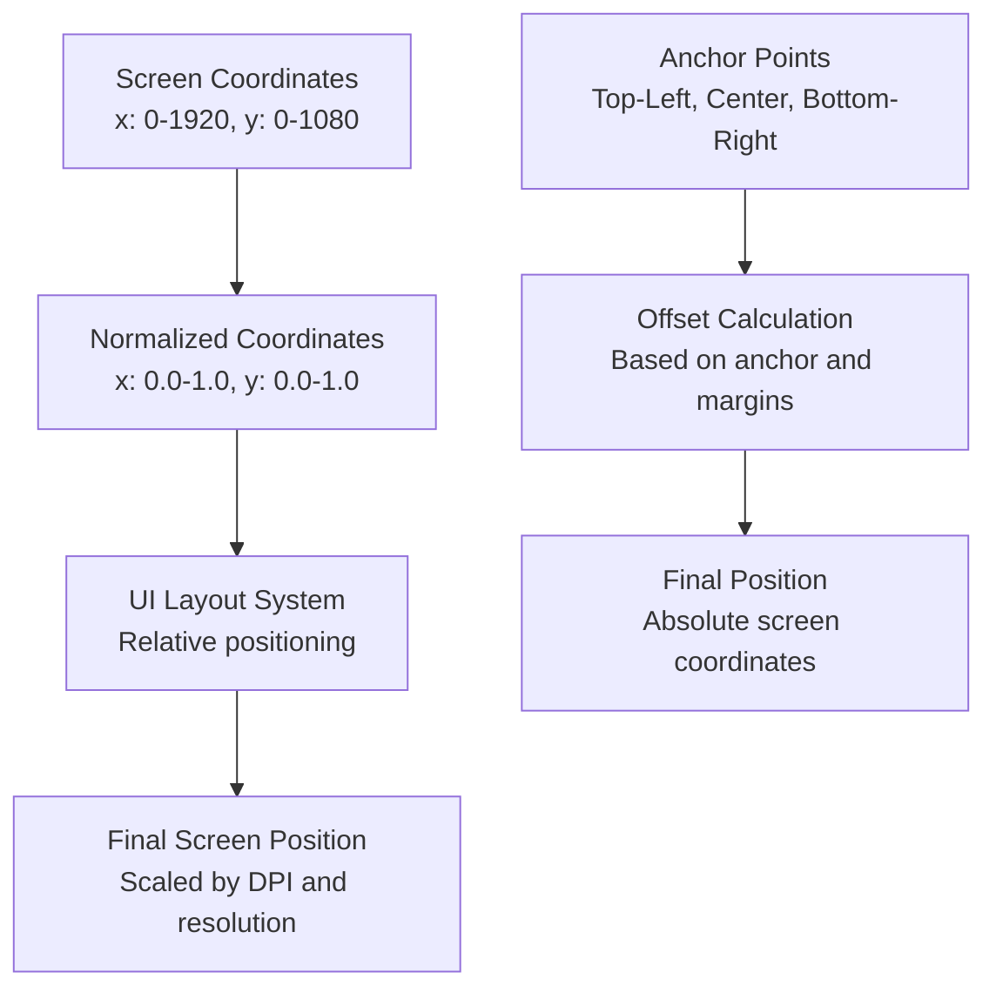
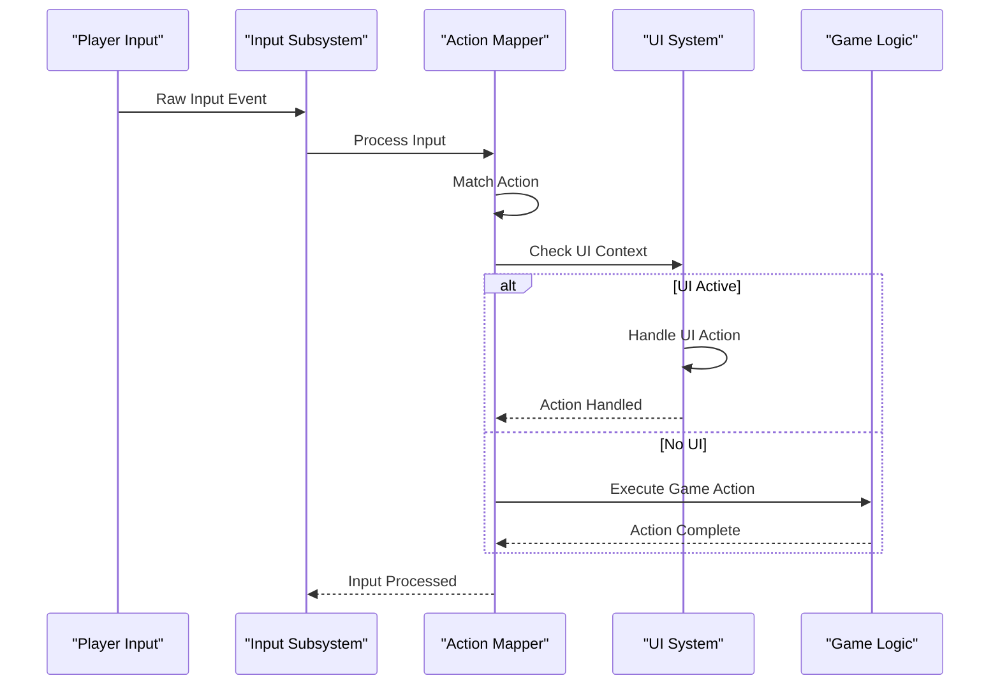

# In-Game UI

<cite>
**Referenced Files in This Document**
- [DisplayUI.hpp](file://engine/Poseidon/UI/DisplayUI.hpp)
- [DisplayUIMenus.cpp](file://engine/Poseidon/UI/DisplayUIMenus.cpp)
- [GameModule.hpp](file://engine/Poseidon/UI/GameModule.hpp)
- [UserAction.hpp](file://engine/Poseidon/Input/UserAction.hpp)
- [InputSubsystem.hpp](file://engine/Poseidon/Input/InputSubsystem.hpp)
- [IGraphicsEngine.hpp](file://engine/Poseidon/Graphics/Core/IGraphicsEngine.hpp)
- [EngineGL33_2DRendering.cpp](file://engine/PoseidonGL33/EngineGL33_2DRendering.cpp)
- [ControllerUiScene.hpp](file://engine/Poseidon/Input/ControllerUiScene.hpp)
- [InputContext.hpp](file://engine/Poseidon/Input/InputContext.hpp)
</cite>

## Table of Contents
1. [Introduction](#introduction)
2. [Project Structure](#project-structure)
3. [Core Components](#core-components)
4. [Architecture Overview](#architecture-overview)
5. [Detailed Component Analysis](#detailed-component-analysis)
6. [Drawing System and 2D Rendering](#drawing-system-and-2d-rendering)
7. [Action System and Input Mapping](#action-system-and-input-mapping)
8. [Performance Considerations](#performance-considerations)
9. [Troubleshooting Guide](#troubleshooting-guide)
10. [Conclusion](#conclusion)

## Introduction

The In-Game User Interface (InGameUI) system is a sophisticated overlay framework that provides HUD elements, contextual menus, and interactive components during gameplay. This system operates independently from the main game rendering pipeline, utilizing a dedicated 2D drawing subsystem to ensure smooth performance while maintaining visual fidelity over the 3D game world.

The InGameUI architecture follows a component-based design pattern, allowing for modular development of HUD elements, dynamic menu systems, and context-sensitive interactions. The system integrates seamlessly with the game's input handling, event processing, and rendering pipelines to deliver responsive user experiences across various gameplay scenarios.

## Project Structure

The InGameUI system is organized within the Poseidon engine's UI module, with specialized subdirectories for different UI contexts:

**Diagram sources**
- [DisplayUI.hpp:1-50](file://engine/Poseidon/UI/DisplayUI.hpp#L1-L50)
- [GameModule.hpp:1-30](file://engine/Poseidon/UI/GameModule.hpp#L1-L30)

**Section sources**
- [DisplayUI.hpp:1-100](file://engine/Poseidon/UI/DisplayUI.hpp#L1-L100)
- [GameModule.hpp:1-50](file://engine/Poseidon/UI/GameModule.hpp#L1-L50)

## Core Components

The InGameUI system consists of several core components that work together to provide a cohesive user experience:

### Display Management
The display management system handles the lifecycle of UI displays, managing their creation, activation, and destruction. It maintains a stack of active displays and coordinates transitions between different UI states.

### HUD Framework
The HUD framework provides base classes for creating heads-up display elements. It includes positioning systems, scaling mechanisms, and update cycles that synchronize with the game's frame rate.

### Menu System
The menu system implements hierarchical menu structures with support for nested menus, conditional visibility, and dynamic content generation. It handles focus management and keyboard/mouse navigation.

### Input Integration
Input integration maps raw input events to semantic actions, supporting both direct input handling and action-based input processing. It maintains context-aware input bindings that change based on the current UI state.

**Section sources**
- [DisplayUI.hpp:50-150](file://engine/Poseidon/UI/DisplayUI.hpp#L50-L150)
- [UserAction.hpp:1-100](file://engine/Poseidon/Input/UserAction.hpp#L1-L100)

## Architecture Overview

The InGameUI architecture follows a layered approach with clear separation of concerns:

**Diagram sources**
- [DisplayUI.hpp:100-200](file://engine/Poseidon/UI/DisplayUI.hpp#L100-L200)
- [UserAction.hpp:50-150](file://engine/Poseidon/Input/UserAction.hpp#L50-L150)

## Detailed Component Analysis

### Display Management System

The display management system serves as the central coordinator for all UI components. It maintains a stack of active displays and ensures proper lifecycle management.

#### Key Features:
- **Stack-based Display Management**: Displays are managed in a last-in-first-out stack, allowing for modal dialog behavior
- **Automatic Lifecycle Management**: Displays are automatically created, updated, and destroyed based on game state
- **Cross-display Communication**: Displays can communicate through a centralized event system
- **Resource Management**: Automatic cleanup of textures, fonts, and other resources when displays are destroyed

#### Implementation Details:
The display manager uses a priority-based system where higher-priority displays can temporarily override lower-priority ones. Each display implements a standard interface that includes update, render, and input handling methods.

**Section sources**
- [DisplayUI.hpp:150-250](file://engine/Poseidon/UI/DisplayUI.hpp#L150-L250)

### HUD Element Framework

The HUD element framework provides a foundation for creating custom HUD components. Elements inherit from a base class that handles common functionality like positioning, scaling, and visibility.

#### Base Class Structure:
- **Positioning System**: Supports absolute positioning, relative positioning, and anchoring to screen edges
- **Scaling System**: Handles different screen resolutions and aspect ratios
- **Update Cycle**: Synchronized with the game's update loop for smooth animations
- **Input Handling**: Built-in support for mouse and keyboard interactions

#### Custom HUD Creation:
To create a custom HUD element, developers extend the base HUDElement class and implement the required virtual methods. The framework handles the common aspects, allowing focus on specific functionality.

**Section sources**
- [DisplayUIMenus.cpp:1-100](file://engine/Poseidon/UI/DisplayUIMenus.cpp#L1-L100)

### Menu System Architecture

The menu system implements a hierarchical structure that supports complex navigation patterns found in modern games.

#### Menu Hierarchy:

**Diagram sources**
- [DisplayUIMenus.cpp:100-200](file://engine/Poseidon/UI/DisplayUIMenus.cpp#L100-L200)

#### Navigation Patterns:
- **Keyboard Navigation**: Arrow keys for movement, Enter for selection, Escape for back
- **Mouse Support**: Click navigation and hover effects
- **Controller Support**: D-pad navigation and button mapping
- **Contextual Menus**: Dynamic menu content based on game state

**Section sources**
- [DisplayUIMenus.cpp:100-300](file://engine/Poseidon/UI/DisplayUIMenus.cpp#L100-L300)

## Drawing System and 2D Rendering

The 2D rendering system is built on top of the graphics engine's core capabilities, providing optimized drawing operations specifically designed for UI elements.

### Coordinate System

The InGameUI uses a normalized coordinate system where the screen is mapped to a 0-1 range:

**Diagram sources**
- [EngineGL33_2DRendering.cpp:1-100](file://engine/PoseidonGL33/EngineGL33_2DRendering.cpp#L1-L100)

### Rendering Pipeline

The 2D rendering pipeline is optimized for batched drawing operations:

1. **Batch Collection**: UI elements are collected into draw batches based on texture and shader usage
2. **State Management**: Graphics state changes are minimized through smart batching
3. **Vertex Generation**: UI geometry is generated efficiently using instanced rendering
4. **Shader Optimization**: Specialized shaders for text, sprites, and effects
5. **Depth Sorting**: Proper depth sorting for overlapping UI elements

### Performance Optimizations

Several optimization techniques are employed to maintain high frame rates:

- **Texture Atlasing**: Multiple UI textures are combined into atlases to reduce draw calls
- **Font Rasterization**: Text is pre-rasterized and cached for frequently used strings
- **Dirty Rectangle Rendering**: Only changed portions of the UI are re-rendered
- **GPU Instancing**: Repeated UI elements use GPU instancing for efficient rendering
- **Level of Detail**: Complex UI elements are simplified at lower quality settings

**Section sources**
- [EngineGL33_2DRendering.cpp:100-300](file://engine/PoseidonGL33/EngineGL33_2DRendering.cpp#L100-L300)

## Action System and Input Mapping

The action system provides a flexible framework for mapping player inputs to game commands and UI actions.

### Action Definition Structure

Actions are defined with metadata including:
- **Action Name**: Unique identifier for the action
- **Input Bindings**: Keyboard, mouse, and controller mappings
- **Context Rules**: Conditions under which the action is available
- **Priority**: Conflict resolution when multiple actions match the same input

### Input Processing Flow

**Diagram sources**
- [UserAction.hpp:100-200](file://engine/Poseidon/Input/UserAction.hpp#L100-L200)
- [InputSubsystem.hpp:1-100](file://engine/Poseidon/Input/InputSubsystem.hpp#L1-L100)

### Context-Sensitive Actions

The system supports context-sensitive actions that change based on the current game state:

- **Game State Context**: Different actions available in menu vs. gameplay
- **Entity Context**: Actions change based on selected entity
- **Location Context**: Actions vary based on player location
- **Equipment Context**: Available actions depend on equipped items

### Controller Support

Full controller support includes:
- **D-Pad Navigation**: Arrow key equivalents for menu navigation
- **Analog Stick Support**: Precise control for certain actions
- **Button Remapping**: Full customization of controller buttons
- **Vibration Feedback**: Haptic feedback for important actions

**Section sources**
- [UserAction.hpp:100-300](file://engine/Poseidon/Input/UserAction.hpp#L100-L300)
- [ControllerUiScene.hpp:1-100](file://engine/Poseidon/Input/ControllerUiScene.hpp#L1-L100)

## Performance Considerations

### Real-time UI Updates

For real-time UI elements like health bars, ammo counters, and minimaps:

- **Delta-time Updates**: All animations and transitions use delta time for frame-rate independence
- **Conditional Updates**: Update only when values change significantly
- **Throttled Updates**: Limit update frequency for non-critical UI elements
- **Async Updates**: Heavy calculations performed on background threads

### Memory Management

Efficient memory management strategies include:

- **Object Pooling**: Reuse UI elements instead of frequent allocation/deallocation
- **Texture Caching**: Cache frequently used textures and fonts
- **String Interning**: Share identical string instances to reduce memory usage
- **Lazy Loading**: Load UI resources only when needed

### Rendering Optimization

- **Batch Rendering**: Group similar draw calls to minimize state changes
- **Culling**: Skip rendering of off-screen or occluded UI elements
- **LOD System**: Reduce complexity of distant or small UI elements
- **GPU Acceleration**: Use GPU for text rendering and complex effects

### Event System Integration

The UI system integrates with the game's event system for efficient communication:

- **Event-driven Updates**: UI updates triggered by relevant game events
- **Observer Pattern**: UI components subscribe to specific events they care about
- **Message Queue**: Asynchronous event processing prevents blocking
- **Event Prioritization**: Critical events processed before less important ones

**Section sources**
- [InputContext.hpp:1-100](file://engine/Poseidon/Input/InputContext.hpp#L1-L100)

## Troubleshooting Guide

### Common UI Issues

**UI Not Appearing:**
- Check display activation status
- Verify viewport configuration
- Ensure proper z-ordering of UI elements
- Confirm texture and font loading

**Input Not Responding:**
- Verify input context is active
- Check action binding configuration
- Ensure no conflicting input handlers
- Validate input device connection

**Performance Problems:**
- Monitor draw call count
- Check for excessive texture switching
- Identify memory leaks in UI components
- Profile update loops for bottlenecks

### Debugging Tools

The UI system includes several debugging utilities:

- **UI Inspector**: Visual inspection of UI hierarchy and properties
- **Input Debugger**: Real-time input event visualization
- **Performance Profiler**: Frame-by-frame analysis of UI performance
- **Memory Analyzer**: Tracking of UI resource usage

### Best Practices

- **Use Object Pools**: Avoid frequent allocation/deallocation of UI elements
- **Batch Operations**: Group related UI updates together
- **Cache Resources**: Reuse textures, fonts, and other expensive resources
- **Validate Inputs**: Always validate user input before processing
- **Handle Errors Gracefully**: Provide fallbacks for missing resources or failed operations

**Section sources**
- [GameModule.hpp:100-200](file://engine/Poseidon/UI/GameModule.hpp#L100-L200)

## Conclusion

The InGameUI system provides a robust, flexible, and performant framework for creating engaging user interfaces in gameplay scenarios. Its modular architecture allows for easy extension and customization while maintaining high performance standards.

Key strengths of the system include:

- **Modular Design**: Clean separation of concerns enables independent development and testing
- **Performance Focus**: Optimized rendering pipeline and memory management ensure smooth gameplay
- **Flexible Input Handling**: Comprehensive input system supports multiple devices and contexts
- **Extensible Architecture**: Easy to add new UI components and interaction patterns
- **Cross-platform Compatibility**: Works consistently across different hardware configurations

The system's emphasis on performance, flexibility, and ease of use makes it suitable for a wide range of game types and UI requirements. Developers can leverage the existing components while extending the system to meet specific needs through its well-defined interfaces and patterns.

Future enhancements could include improved animation systems, enhanced accessibility features, and better integration with emerging input technologies. The foundation laid by the current architecture provides a solid basis for such extensions while maintaining backward compatibility.