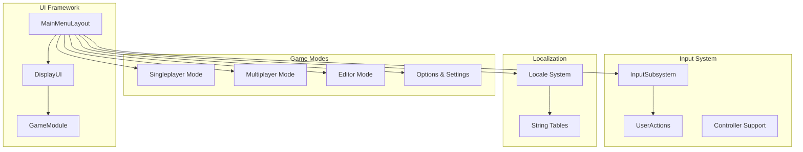
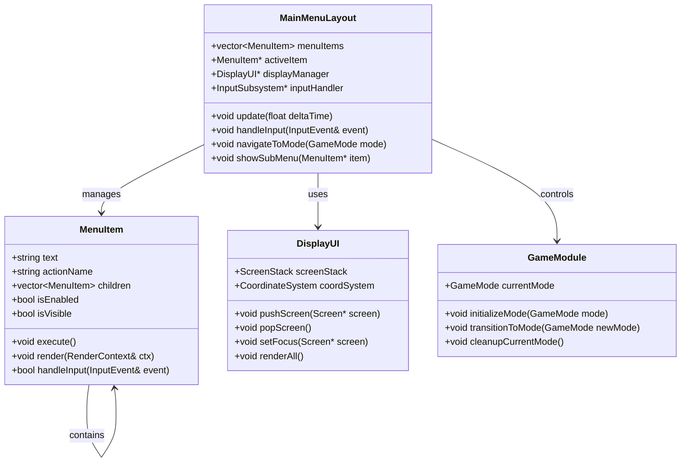
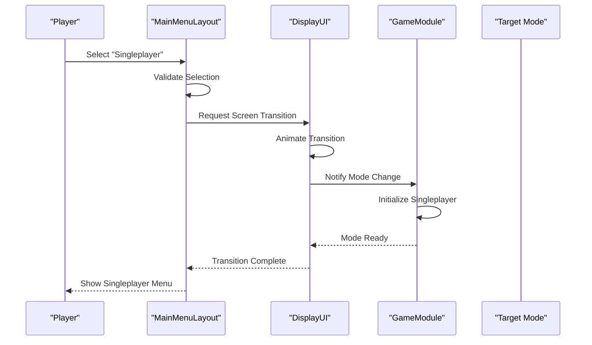
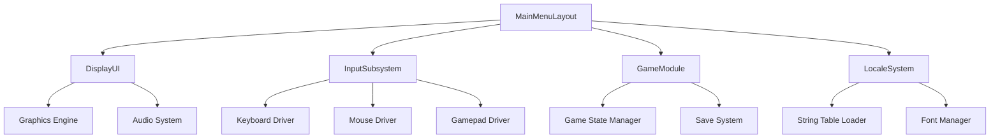

# Main Menu System

<cite>
**Referenced Files in This Document**
- [MainMenuLayout.hpp](file://engine/Poseidon/UI/MainMenuLayout.hpp)
- [MainMenuLayout.cpp](file://engine/Poseidon/UI/MainMenuLayout.cpp)
- [DisplayUI.hpp](file://engine/Poseidon/UI/DisplayUI.hpp)
- [DisplayUI.cpp](file://engine/Poseidon/UI/DisplayUI.cpp)
- [DisplayUIMenus.cpp](file://engine/Poseidon/UI/DisplayUIMenus.cpp)
- [DisplayUIMultiplayer.cpp](file://engine/Poseidon/UI/DisplayUIMultiplayer.cpp)
- [DisplayUISetup.cpp](file://engine/Poseidon/UI/DisplayUISetup.cpp)
- [GameModule.hpp](file://engine/Poseidon/UI/GameModule.hpp)
- [InputSubsystem.hpp](file://engine/Poseidon/Input/InputSubsystem.hpp)
- [UserAction.hpp](file://engine/Poseidon/Input/UserAction.hpp)
</cite>

## Table of Contents
1. [Introduction](#introduction)
2. [Project Structure](#project-structure)
3. [Core Components](#core-components)
4. [Architecture Overview](#architecture-overview)
5. [Detailed Component Analysis](#detailed-component-analysis)
6. [Dependency Analysis](#dependency-analysis)
7. [Performance Considerations](#performance-considerations)
8. [Troubleshooting Guide](#troubleshooting-guide)
9. [Conclusion](#conclusion)
10. [Appendices](#appendices)

## Introduction

The Main Menu System is a comprehensive user interface framework that provides navigation between different game modes including singleplayer campaigns, multiplayer sessions, and the editor. This system serves as the primary entry point for players to access various gameplay experiences and configuration options. The implementation follows modern UI design patterns with support for multiple input methods (keyboard, mouse, and gamepad), localization, accessibility features, and performance optimization for large menu hierarchies.

## Project Structure

The main menu system is organized within the Poseidon UI framework, following a modular architecture that separates concerns between layout management, display handling, input processing, and game state management.

**Diagram sources**
- [MainMenuLayout.hpp:1-50](file://engine/Poseidon/UI/MainMenuLayout.hpp#L1-L50)
- [DisplayUI.hpp:1-50](file://engine/Poseidon/UI/DisplayUI.hpp#L1-L50)
- [GameModule.hpp:1-50](file://engine/Poseidon/UI/GameModule.hpp#L1-L50)

**Section sources**
- [MainMenuLayout.hpp:1-100](file://engine/Poseidon/UI/MainMenuLayout.hpp#L1-L100)
- [DisplayUI.hpp:1-100](file://engine/Poseidon/UI/DisplayUI.hpp#L1-L100)

## Core Components

### MainMenuLayout Architecture

The MainMenuLayout class serves as the central orchestrator for all menu-related functionality. It manages the hierarchical structure of menu items, handles user interactions, and coordinates transitions between different game modes.

#### Key Responsibilities:
- **Menu Hierarchy Management**: Maintains parent-child relationships between menu items
- **Input Processing**: Routes keyboard, mouse, and gamepad events to appropriate handlers
- **State Management**: Tracks current selection, focus, and active menu screens
- **Animation Control**: Manages transitions and visual feedback for user interactions
- **Resource Management**: Handles loading and unloading of menu assets

#### Menu Item Hierarchy:
The menu system supports a flexible tree structure where each menu item can contain child items, enabling complex nested navigation patterns. Items are organized by categories such as "New Game", "Continue", "Options", "Multiplayer", and "Exit".

**Section sources**
- [MainMenuLayout.hpp:50-150](file://engine/Poseidon/UI/MainMenuLayout.hpp#L50-L150)
- [MainMenuLayout.cpp:1-200](file://engine/Poseidon/UI/MainMenuLayout.cpp#L1-L200)

### DisplayUI Integration

The DisplayUI component acts as the bridge between the menu system and the underlying display framework. It manages screen lifecycle, coordinate systems, and rendering contexts.

#### Screen Management Features:
- **Screen Stacking**: Supports multiple overlay screens with proper z-ordering
- **Coordinate Transformation**: Handles scaling and positioning across different resolutions
- **Event Propagation**: Routes input events through the display hierarchy
- **Performance Optimization**: Implements frustum culling and lazy loading for off-screen elements

**Section sources**
- [DisplayUI.hpp:100-200](file://engine/Poseidon/UI/DisplayUI.hpp#L100-L200)
- [DisplayUI.cpp:1-300](file://engine/Poseidon/UI/DisplayUI.cpp#L1-L300)

## Architecture Overview

The main menu system follows a layered architecture pattern that separates concerns while maintaining clear communication channels between components.

**Diagram sources**
- [MainMenuLayout.hpp:1-100](file://engine/Poseidon/UI/MainMenuLayout.hpp#L1-L100)
- [DisplayUI.hpp:1-100](file://engine/Poseidon/UI/DisplayUI.hpp#L1-L100)
- [GameModule.hpp:1-100](file://engine/Poseidon/UI/GameModule.hpp#L1-L100)

## Detailed Component Analysis

### Menu Navigation Flow

The navigation system implements a state machine that manages transitions between different game modes and menu screens. Each transition is validated and can be interrupted by user actions.

**Diagram sources**
- [MainMenuLayout.cpp:200-400](file://engine/Poseidon/UI/MainMenuLayout.cpp#L200-L400)
- [DisplayUI.cpp:300-500](file://engine/Poseidon/UI/DisplayUI.cpp#L300-L500)

### Input Handling System

The input system provides unified handling for keyboard, mouse, and gamepad inputs through a common interface. Each input method is mapped to standard actions like "Select", "Back", "Up", and "Down".

#### Input Mapping Strategy:
- **Keyboard**: Arrow keys for navigation, Enter for selection, Escape for back
- **Mouse**: Click for selection, hover for highlighting, scroll for scrolling
- **Gamepad**: D-pad for navigation, A button for selection, B button for back

**Section sources**
- [UserAction.hpp:1-100](file://engine/Poseidon/Input/UserAction.hpp#L1-L100)
- [InputSubsystem.hpp:1-100](file://engine/Poseidon/Input/InputSubsystem.hpp#L1-L100)

### Localization Support

The menu system integrates with the localization framework to provide multi-language support. All text strings are externalized and loaded dynamically based on the selected language.

#### Localization Features:
- **Dynamic Text Loading**: Strings are loaded at runtime based on locale settings
- **Fallback Mechanism**: Falls back to default language if translation is missing
- **RTL Support**: Right-to-left language support for Arabic and Hebrew
- **Font Fallback**: Automatic font switching for different character sets

**Section sources**
- [DisplayUIMenus.cpp:1-200](file://engine/Poseidon/UI/DisplayUIMenus.cpp#L1-L200)

### Accessibility Features

The system includes comprehensive accessibility features to ensure usability for players with disabilities.

#### Accessibility Implementation:
- **Screen Reader Support**: Proper labeling and announcements for assistive technologies
- **High Contrast Mode**: Enhanced visual contrast for low vision users
- **Keyboard Navigation**: Full keyboard operability without mouse dependency
- **Audio Feedback**: Sound cues for menu interactions and selections

## Dependency Analysis

The main menu system has well-defined dependencies that promote modularity and testability.

**Diagram sources**
- [MainMenuLayout.cpp:1-100](file://engine/Poseidon/UI/MainMenuLayout.cpp#L1-L100)
- [DisplayUI.cpp:1-100](file://engine/Poseidon/UI/DisplayUI.cpp#L1-L100)

**Section sources**
- [MainMenuLayout.cpp:1-300](file://engine/Poseidon/UI/MainMenuLayout.cpp#L1-L300)
- [DisplayUI.cpp:1-300](file://engine/Poseidon/UI/DisplayUI.cpp#L1-L300)

## Performance Considerations

The menu system is optimized for smooth performance even with large menu hierarchies and complex animations.

### Optimization Strategies:
- **Lazy Loading**: Menu assets are loaded on-demand rather than at startup
- **Object Pooling**: Reuses menu item objects to minimize memory allocation
- **Batch Rendering**: Groups similar draw calls to reduce GPU overhead
- **Caching**: Caches frequently accessed data like textures and fonts
- **Async Operations**: Non-blocking operations for long-running tasks like file I/O

### Memory Management:
- **Reference Counting**: Automatic cleanup of unused menu resources
- **Memory Pools**: Pre-allocated memory blocks for menu items
- **Garbage Collection**: Periodic cleanup of temporary objects

## Troubleshooting Guide

### Common Issues and Solutions:

#### Menu Items Not Responding to Input
- **Check Input Binding**: Verify that input actions are properly mapped
- **Validate Focus State**: Ensure the menu has proper focus and visibility
- **Debug Event Flow**: Enable input debugging to trace event propagation

#### Performance Issues with Large Menus
- **Profile Rendering**: Use profiling tools to identify bottlenecks
- **Optimize Asset Loading**: Implement better caching strategies
- **Reduce Animation Complexity**: Simplify complex transitions

#### Localization Problems
- **Verify String Tables**: Check that all required translations exist
- **Test Language Switching**: Ensure dynamic language changes work correctly
- **Validate Font Support**: Confirm fonts support required character sets

**Section sources**
- [DisplayUIMenus.cpp:200-400](file://engine/Poseidon/UI/DisplayUIMenus.cpp#L200-L400)
- [DisplayUISetup.cpp:1-200](file://engine/Poseidon/UI/DisplayUISetup.cpp#L1-L200)

## Conclusion

The main menu system provides a robust, extensible foundation for game navigation with comprehensive support for multiple input methods, localization, and accessibility. The modular architecture allows for easy extension and customization while maintaining performance and reliability. The system's design promotes good separation of concerns and provides clear interfaces for integrating new game modes and menu features.

Key strengths include:
- **Flexible Menu Hierarchy**: Supports complex nested navigation structures
- **Multi-Platform Input**: Unified handling for keyboard, mouse, and gamepad
- **Internationalization**: Full localization support with RTL capabilities
- **Accessibility**: Comprehensive features for inclusive gaming
- **Performance**: Optimized for smooth operation with large menus

## Appendices

### Adding New Menu Options

To add a new menu option, follow these steps:

1. **Define Menu Item**: Create a new MenuItem instance with appropriate properties
2. **Add to Hierarchy**: Insert the item into the menu tree at the desired location
3. **Implement Action**: Define the callback function for the menu action
4. **Configure Styling**: Set appearance properties like color, font, and alignment
5. **Test Input Mapping**: Verify the option responds to all supported input methods

### Customizing Menu Appearance

Menu appearance can be customized through:

- **Style Sheets**: Define global styling rules for different menu types
- **Theme System**: Support multiple visual themes with dynamic switching
- **Asset Replacement**: Override default textures and fonts
- **Animation Configuration**: Customize transition effects and timing

### Implementing Menu-Specific Actions

For custom menu actions:

1. **Create Action Handler**: Implement the logic for the specific action
2. **Register Callback**: Bind the handler to the menu item
3. **Handle Validation**: Add pre-execution validation if needed
4. **Manage State**: Update game state appropriately
5. **Provide Feedback**: Give visual or audio feedback to the user