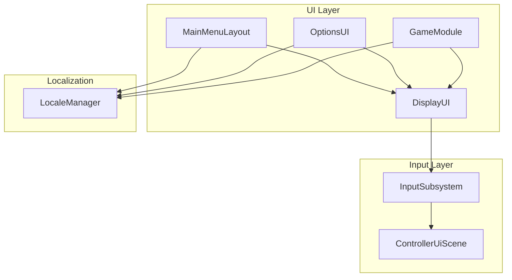
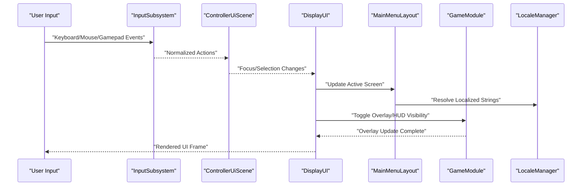
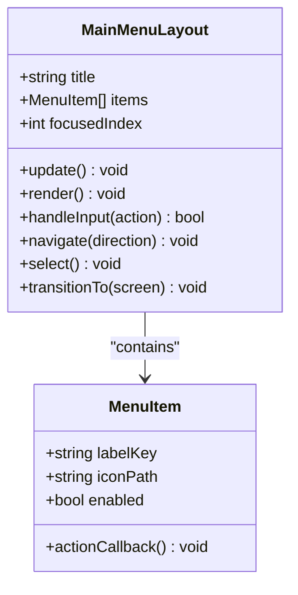
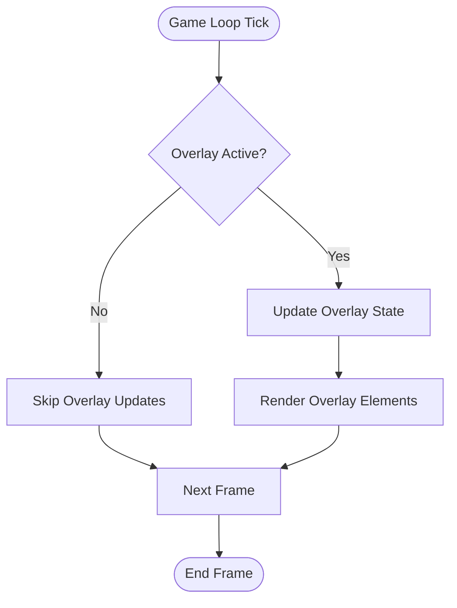
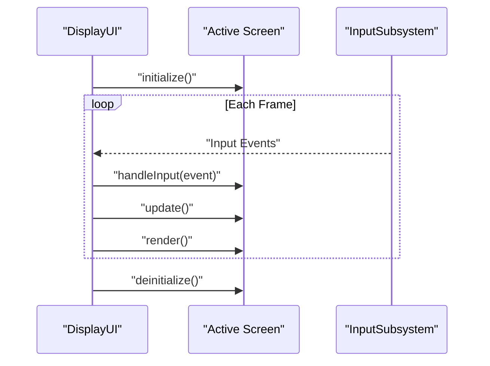
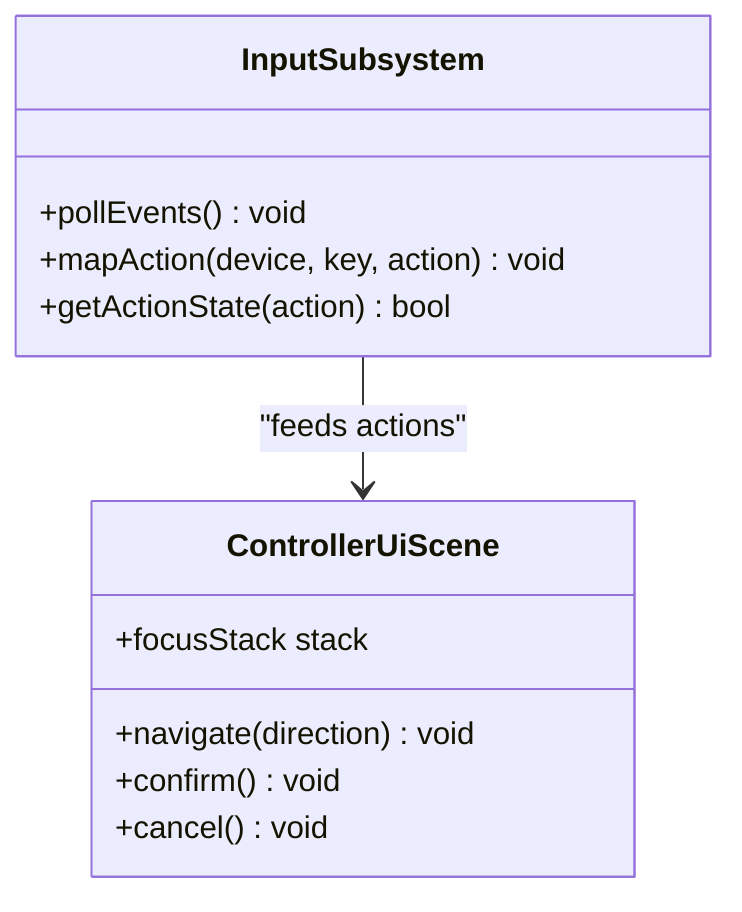
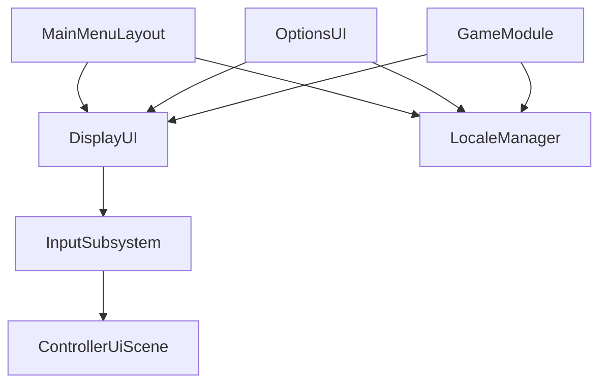

# Menu Implementations

<cite>
**Referenced Files in This Document**
- [MainMenuLayout.hpp](file://engine/Poseidon/UI/MainMenuLayout.hpp)
- [MainMenuLayout.cpp](file://engine/Poseidon/UI/MainMenuLayout.cpp)
- [GameModule.hpp](file://engine/Poseidon/UI/GameModule.hpp)
- [GameModule.cpp](file://engine/Poseidon/UI/GameModule.cpp)
- [DisplayUI.hpp](file://engine/Poseidon/UI/DisplayUI.hpp)
- [DisplayUI.cpp](file://engine/Poseidon/UI/DisplayUI.cpp)
- [InputSubsystem.hpp](file://engine/Poseidon/Input/InputSubsystem.hpp)
- [InputSubsystem.cpp](file://engine/Poseidon/Input/InputSubsystem.cpp)
- [ControllerUiScene.hpp](file://engine/Poseidon/Input/ControllerUiScene.hpp)
- [ControllerUiScene.cpp](file://engine/Poseidon/Input/ControllerUiScene.cpp)
- [LocaleManager.hpp](file://engine/Poseidon/UI/Locale/LocaleManager.hpp)
- [LocaleManager.cpp](file://engine/Poseidon/UI/Locale/LocaleManager.cpp)
- [OptionsUI.hpp](file://engine/Poseidon/UI/OptionsUI.hpp)
- [OptionsUI.cpp](file://engine/Poseidon/UI/OptionsUI.cpp)
</cite>

## Table of Contents
1. [Introduction](#introduction)
2. [Project Structure](#project-structure)
3. [Core Components](#core-components)
4. [Architecture Overview](#architecture-overview)
5. [Detailed Component Analysis](#detailed-component-analysis)
6. [Dependency Analysis](#dependency-analysis)
7. [Performance Considerations](#performance-considerations)
8. [Troubleshooting Guide](#troubleshooting-guide)
9. [Conclusion](#conclusion)
10. [Appendices](#appendices)

## Introduction
This document explains the menu implementations across the main menu, game menus, and specialized interfaces. It focuses on MainMenuLayout structure, menu item organization, navigation patterns, GameModule integration for in-game overlays and HUD elements, state management, input handling (keyboard/mouse/gamepad), responsive design, localization support, accessibility features, and performance optimization strategies for complex menu hierarchies. It also provides practical guidance for creating new menu screens, implementing menu actions, and integrating with game systems.

## Project Structure
The UI subsystem is organized under engine/Poseidon/UI with related input handling under engine/Poseidon/Input and localization under engine/Poseidon/UI/Locale. Key files include:
- Main menu layout and rendering: MainMenuLayout.*
- In-game overlay/HUD integration: GameModule.*
- Display orchestration and lifecycle: DisplayUI.*
- Input subsystem and controller UI scene: InputSubsystem.*, ControllerUiScene.*
- Localization manager: LocaleManager.*
- Options UI as a reference implementation: OptionsUI.*

**Diagram sources**
- [MainMenuLayout.hpp](file://engine/Poseidon/UI/MainMenuLayout.hpp)
- [GameModule.hpp](file://engine/Poseidon/UI/GameModule.hpp)
- [DisplayUI.hpp](file://engine/Poseidon/UI/DisplayUI.hpp)
- [InputSubsystem.hpp](file://engine/Poseidon/Input/InputSubsystem.hpp)
- [ControllerUiScene.hpp](file://engine/Poseidon/Input/ControllerUiScene.hpp)
- [LocaleManager.hpp](file://engine/Poseidon/UI/Locale/LocaleManager.hpp)
- [OptionsUI.hpp](file://engine/Poseidon/UI/OptionsUI.hpp)

**Section sources**
- [MainMenuLayout.hpp](file://engine/Poseidon/UI/MainMenuLayout.hpp)
- [GameModule.hpp](file://engine/Poseidon/UI/GameModule.hpp)
- [DisplayUI.hpp](file://engine/Poseidon/UI/DisplayUI.hpp)
- [InputSubsystem.hpp](file://engine/Poseidon/Input/InputSubsystem.hpp)
- [ControllerUiScene.hpp](file://engine/Poseidon/Input/ControllerUiScene.hpp)
- [LocaleManager.hpp](file://engine/Poseidon/UI/Locale/LocaleManager.hpp)
- [OptionsUI.hpp](file://engine/Poseidon/UI/OptionsUI.hpp)

## Core Components
- MainMenuLayout: Defines the main menu screen structure, organizes menu items, handles focus and selection, and coordinates transitions to other screens or game states.
- GameModule: Integrates UI overlays and HUD elements into the game loop, manages visibility and update cycles, and bridges between gameplay events and UI updates.
- DisplayUI: Orchestrates display lifecycle, active screen management, and event propagation to current UI components.
- InputSubsystem: Centralizes input polling, device abstraction, and action mapping; feeds normalized inputs to UI layers.
- ControllerUiScene: Provides controller-friendly navigation patterns and focus management for gamepad users.
- LocaleManager: Supplies localized strings and formatting for UI text.
- OptionsUI: Demonstrates a complete settings screen with validation, persistence, and localization.

Key responsibilities:
- State management: Active screen tracking, modal overlays, and transition animations.
- Navigation: Keyboard/mouse/gamepad focus traversal, confirmation/cancel actions, and context-aware behavior.
- Responsive design: Scaling and layout adjustments based on resolution and aspect ratio.
- Localization: Text retrieval via locale keys and dynamic updates when language changes.
- Accessibility: High contrast modes, keyboard-only navigation, and screen reader hints where applicable.

**Section sources**
- [MainMenuLayout.cpp](file://engine/Poseidon/UI/MainMenuLayout.cpp)
- [GameModule.cpp](file://engine/Poseidon/UI/GameModule.cpp)
- [DisplayUI.cpp](file://engine/Poseidon/UI/DisplayUI.cpp)
- [InputSubsystem.cpp](file://engine/Poseidon/Input/InputSubsystem.cpp)
- [ControllerUiScene.cpp](file://engine/Poseidon/Input/ControllerUiScene.cpp)
- [LocaleManager.cpp](file://engine/Poseidon/UI/Locale/LocaleManager.cpp)
- [OptionsUI.cpp](file://engine/Poseidon/UI/OptionsUI.cpp)

## Architecture Overview
The UI architecture separates concerns between display orchestration, input processing, and specific menu implementations. MainMenuLayout and OptionsUI implement concrete screens that are managed by DisplayUI. GameModule integrates overlays and HUD elements during gameplay, while InputSubsystem and ControllerUiScene provide unified input and navigation semantics.

**Diagram sources**
- [InputSubsystem.hpp](file://engine/Poseidon/Input/InputSubsystem.hpp)
- [ControllerUiScene.hpp](file://engine/Poseidon/Input/ControllerUiScene.hpp)
- [DisplayUI.hpp](file://engine/Poseidon/UI/DisplayUI.hpp)
- [MainMenuLayout.hpp](file://engine/Poseidon/UI/MainMenuLayout.hpp)
- [GameModule.hpp](file://engine/Poseidon/UI/GameModule.hpp)
- [LocaleManager.hpp](file://engine/Poseidon/UI/Locale/LocaleManager.hpp)

## Detailed Component Analysis

### MainMenuLayout Analysis
MainMenuLayout defines the main menu screen, including:
- Menu item organization: A structured list of entries with labels, icons, and actions.
- Focus and selection: Traversal logic supporting keyboard arrows and gamepad D-pad/stick.
- Transitions: Switching to other screens or initiating gameplay.
- Localization: Resolving text via locale keys and updating dynamically.

**Diagram sources**
- [MainMenuLayout.hpp](file://engine/Poseidon/UI/MainMenuLayout.hpp)
- [MainMenuLayout.cpp](file://engine/Poseidon/UI/MainMenuLayout.cpp)

Implementation highlights:
- Menu item creation: Define entries with localized labels and associated callbacks.
- Navigation patterns: Arrow/D-pad movement wraps at boundaries; Enter/Confirm triggers selected action.
- Responsive scaling: Layout recalculates positions based on screen dimensions.
- Error handling: Disabled items skip focus; invalid transitions log warnings and remain on current screen.

**Section sources**
- [MainMenuLayout.hpp](file://engine/Poseidon/UI/MainMenuLayout.hpp)
- [MainMenuLayout.cpp](file://engine/Poseidon/UI/MainMenuLayout.cpp)

### GameModule Integration
GameModule integrates overlays and HUD elements within the game loop:
- Overlay lifecycle: Show/hide based on gameplay events (pause, inventory, map).
- Update cycle: Sync UI state with simulation data each frame.
- Event bridging: Translate game events into UI actions (e.g., health changes, notifications).

**Diagram sources**
- [GameModule.hpp](file://engine/Poseidon/UI/GameModule.hpp)
- [GameModule.cpp](file://engine/Poseidon/UI/GameModule.cpp)

Integration points:
- Pause system: Toggles pause overlay and freezes input processing for gameplay.
- HUD updates: Binds live data (health, ammo, objectives) to UI bindings.
- Accessibility: Supports high-contrast themes and scalable text sizes.

**Section sources**
- [GameModule.hpp](file://engine/Poseidon/UI/GameModule.hpp)
- [GameModule.cpp](file://engine/Poseidon/UI/GameModule.cpp)

### DisplayUI Orchestration
DisplayUI manages the active screen and event routing:
- Active screen switching: Push/pop stacks for nested menus and modals.
- Event propagation: Dispatches input events to the current screen.
- Lifecycle hooks: Initialize/update/render phases per screen.

**Diagram sources**
- [DisplayUI.hpp](file://engine/Poseidon/UI/DisplayUI.hpp)
- [DisplayUI.cpp](file://engine/Poseidon/UI/DisplayUI.cpp)

**Section sources**
- [DisplayUI.hpp](file://engine/Poseidon/UI/DisplayUI.hpp)
- [DisplayUI.cpp](file://engine/Poseidon/UI/DisplayUI.cpp)

### Input Subsystem and Controller UI Scene
InputSubsystem centralizes input polling and action mapping:
- Device abstraction: Unified interface for keyboard, mouse, and gamepad.
- Action mapping: Configurable bindings for user actions.
- Normalization: Converts raw inputs to semantic actions for UI.

ControllerUiScene provides controller-friendly navigation:
- Focus management: Maintains focus state and traversal order.
- Haptic feedback: Optional rumble cues for selections and confirmations.
- Accessibility: Large cursor visuals and audible feedback options.

**Diagram sources**
- [InputSubsystem.hpp](file://engine/Poseidon/Input/InputSubsystem.hpp)
- [InputSubsystem.cpp](file://engine/Poseidon/Input/InputSubsystem.cpp)
- [ControllerUiScene.hpp](file://engine/Poseidon/Input/ControllerUiScene.hpp)
- [ControllerUiScene.cpp](file://engine/Poseidon/Input/ControllerUiScene.cpp)

**Section sources**
- [InputSubsystem.hpp](file://engine/Poseidon/Input/InputSubsystem.hpp)
- [InputSubsystem.cpp](file://engine/Poseidon/Input/InputSubsystem.cpp)
- [ControllerUiScene.hpp](file://engine/Poseidon/Input/ControllerUiScene.hpp)
- [ControllerUiScene.cpp](file://engine/Poseidon/Input/ControllerUiScene.cpp)

### Localization Support
LocaleManager provides localized strings and formatting:
- Key-based retrieval: UI requests text via stable keys.
- Dynamic updates: Language changes refresh all UI text without restart.
- Fallbacks: Default language fallback for missing translations.

Best practices:
- Use descriptive keys (e.g., "menu.start_game").
- Avoid hardcoding strings in code.
- Test with multiple languages and long strings for layout robustness.

**Section sources**
- [LocaleManager.hpp](file://engine/Poseidon/UI/Locale/LocaleManager.hpp)
- [LocaleManager.cpp](file://engine/Poseidon/UI/Locale/LocaleManager.cpp)

### OptionsUI Reference Implementation
OptionsUI demonstrates a complete settings screen:
- Validation: Enforces valid ranges and dependencies between options.
- Persistence: Saves preferences to configuration files.
- Localization: All labels and descriptions use locale keys.
- Accessibility: Keyboard navigation and clear focus indicators.

Creating new menu screens:
- Derive from base screen interface.
- Implement initialize/update/render methods.
- Register input handlers and transitions.
- Use LocaleManager for all text.

Implementing menu actions:
- Bind actions to input events.
- Validate inputs before execution.
- Provide feedback (visual/audio) for success/failure.

Integrating with game systems:
- Use event buses or callbacks to notify gameplay.
- Avoid tight coupling; prefer interfaces.
- Ensure thread safety for shared state.

**Section sources**
- [OptionsUI.hpp](file://engine/Poseidon/UI/OptionsUI.hpp)
- [OptionsUI.cpp](file://engine/Poseidon/UI/OptionsUI.cpp)

## Dependency Analysis
The UI layer depends on input and localization subsystems, while DisplayUI orchestrates screen lifecycle. GameModule bridges gameplay and UI updates.

**Diagram sources**
- [MainMenuLayout.hpp](file://engine/Poseidon/UI/MainMenuLayout.hpp)
- [OptionsUI.hpp](file://engine/Poseidon/UI/OptionsUI.hpp)
- [GameModule.hpp](file://engine/Poseidon/UI/GameModule.hpp)
- [DisplayUI.hpp](file://engine/Poseidon/UI/DisplayUI.hpp)
- [InputSubsystem.hpp](file://engine/Poseidon/Input/InputSubsystem.hpp)
- [ControllerUiScene.hpp](file://engine/Poseidon/Input/ControllerUiScene.hpp)
- [LocaleManager.hpp](file://engine/Poseidon/UI/Locale/LocaleManager.hpp)

Potential circular dependencies:
- Avoid direct references from Gameplay to UI; use events/callbacks.
- Keep DisplayUI as the single entry point for screen management.

External dependencies:
- Input devices abstracted via InputSubsystem.
- Localization via LocaleManager.
- Graphics backend handled by higher-level rendering pipeline.

**Section sources**
- [MainMenuLayout.hpp](file://engine/Poseidon/UI/MainMenuLayout.hpp)
- [OptionsUI.hpp](file://engine/Poseidon/UI/OptionsUI.hpp)
- [GameModule.hpp](file://engine/Poseidon/UI/GameModule.hpp)
- [DisplayUI.hpp](file://engine/Poseidon/UI/DisplayUI.hpp)
- [InputSubsystem.hpp](file://engine/Poseidon/Input/InputSubsystem.hpp)
- [ControllerUiScene.hpp](file://engine/Poseidon/Input/ControllerUiScene.hpp)
- [LocaleManager.hpp](file://engine/Poseidon/UI/Locale/LocaleManager.hpp)

## Performance Considerations
- Batch UI updates: Coalesce frequent state changes to reduce render calls.
- Lazy loading: Defer heavy resource loading until needed.
- Font caching: Cache glyph textures for common characters.
- Input throttling: Limit input processing frequency for non-critical actions.
- Memory management: Reuse UI objects and avoid allocations in hot paths.
- Profiling: Use frame analyzers to identify UI bottlenecks.

[No sources needed since this section provides general guidance]

## Troubleshooting Guide
Common issues and resolutions:
- Input not recognized: Verify action mappings and device polling rates.
- Localization missing: Check locale keys and fallback mechanisms.
- Focus stuck: Inspect focus stack and navigation logic.
- Overlay not updating: Confirm GameModule update cycle and event triggers.
- Performance drops: Profile UI rendering and optimize asset loading.

Debugging tips:
- Enable verbose logging for input and UI events.
- Use developer overlays to visualize focus and hit areas.
- Test with different input devices and resolutions.

**Section sources**
- [InputSubsystem.cpp](file://engine/Poseidon/Input/InputSubsystem.cpp)
- [LocaleManager.cpp](file://engine/Poseidon/UI/Locale/LocaleManager.cpp)
- [ControllerUiScene.cpp](file://engine/Poseidon/Input/ControllerUiScene.cpp)
- [GameModule.cpp](file://engine/Poseidon/UI/GameModule.cpp)

## Conclusion
The menu system combines modular screen implementations, centralized input handling, and robust localization support. MainMenuLayout provides a flexible main menu structure, while GameModule ensures seamless integration of overlays and HUD elements. By following the patterns outlined here, developers can create accessible, performant, and maintainable UI experiences that adapt to various input methods and locales.

[No sources needed since this section summarizes without analyzing specific files]

## Appendices
- Creating a new menu screen:
  - Implement initialize/update/render methods.
  - Register input handlers and define transitions.
  - Use LocaleManager for all text.
- Implementing menu actions:
  - Bind actions to input events.
  - Validate inputs and provide feedback.
  - Integrate with game systems via callbacks.
- Best practices:
  - Keep UI logic decoupled from gameplay.
  - Prioritize accessibility and responsiveness.
  - Optimize for performance and memory usage.

[No sources needed since this section provides general guidance]