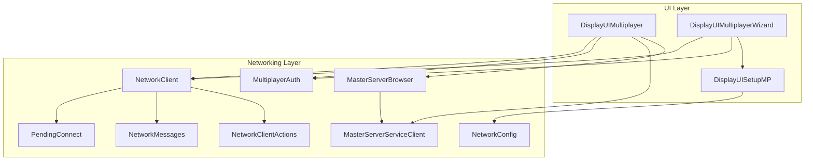
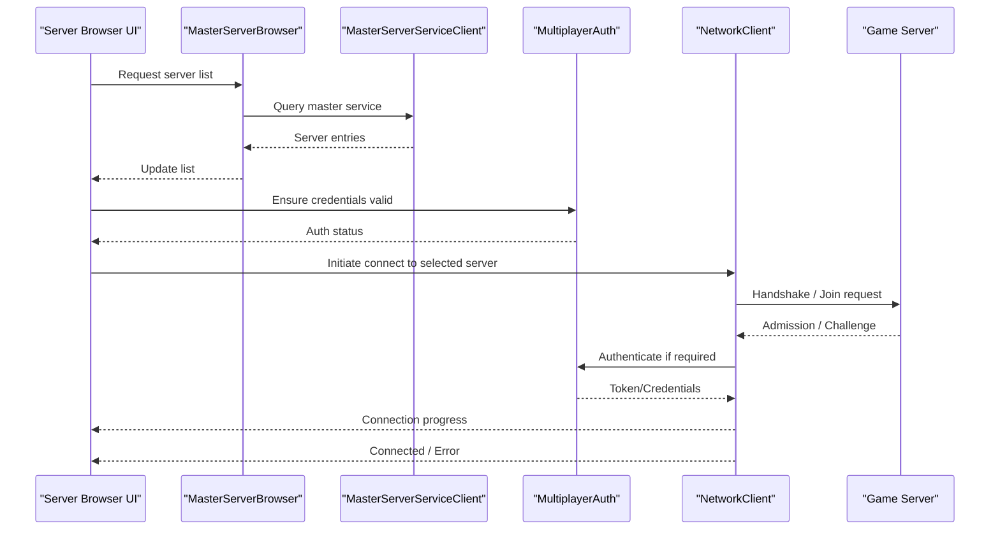
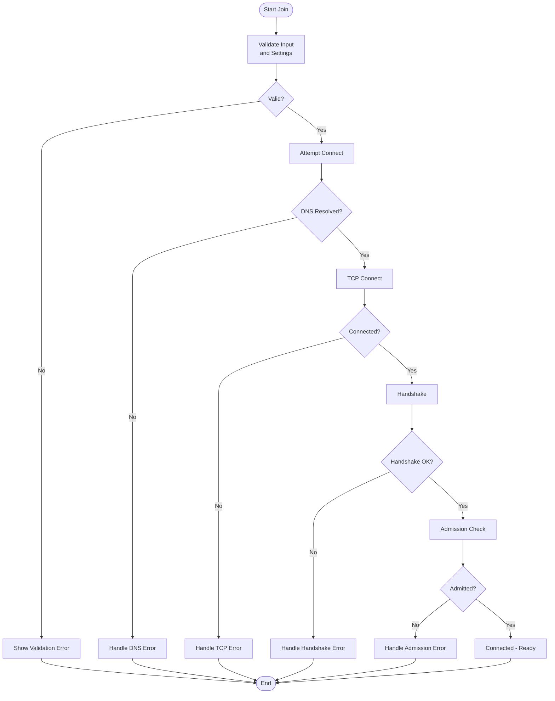
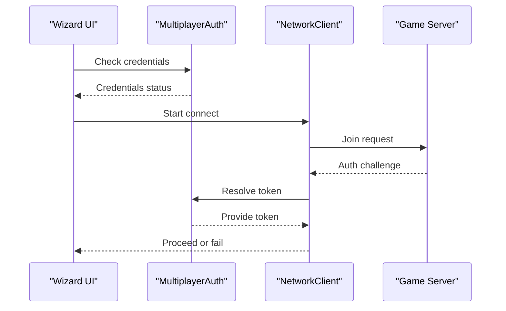
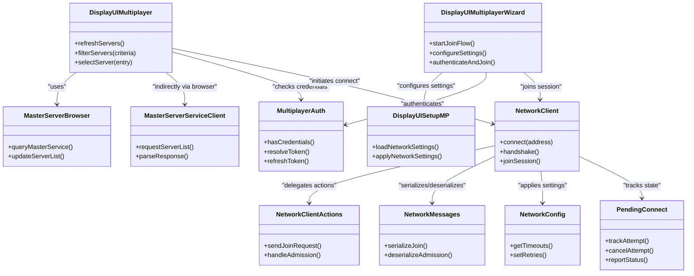

# Multiplayer Interface

<cite>
**Referenced Files in This Document**
- [DisplayUIMultiplayer.cpp](file://engine/Poseidon/UI/DisplayUIMultiplayer.cpp)
- [DisplayUIMultiplayerWizard.cpp](file://engine/Poseidon/UI/DisplayUIMultiplayerWizard.cpp)
- [DisplayUISetupMP.cpp](file://engine/Poseidon/UI/DisplayUISetupMP.cpp)
- [MasterServerBrowser.cpp](file://engine/Poseidon/Network/MasterServerBrowser.cpp)
- [MasterServerBrowser.hpp](file://engine/Poseidon/Network/MasterServerBrowser.hpp)
- [MasterServerServiceClient.cpp](file://engine/Poseidon/Network/MasterServerServiceClient.cpp)
- [MasterServerServiceClient.hpp](file://engine/Poseidon/Network/MasterServerServiceClient.hpp)
- [MultiplayerAuth.cpp](file://engine/Poseidon/Network/MultiplayerAuth.cpp)
- [MultiplayerAuth.hpp](file://engine/Poseidon/Network/MultiplayerAuth.hpp)
- [NetworkConfig.cpp](file://engine/Poseidon/Network/NetworkConfig.cpp)
- [NetworkConfig.hpp](file://engine/Poseidon/Network/NetworkConfig.hpp)
- [NetworkClient.cpp](file://engine/Poseidon/Network/NetworkClient.cpp)
- [NetworkClientActions.cpp](file://engine/Poseidon/Network/NetworkClientActions.cpp)
- [NetworkMessages.cpp](file://engine/Poseidon/Network/NetworkMessages.cpp)
- [NetworkMessages.hpp](file://engine/Poseidon/Network/NetworkMessages.hpp)
- [PendingConnect.cpp](file://engine/Poseidon/Core/PendingConnect.cpp)
- [PendingConnect.hpp](file://engine/Poseidon/Core/PendingConnect.hpp)
</cite>

## Table of Contents
1. [Introduction](#introduction)
2. [Project Structure](#project-structure)
3. [Core Components](#core-components)
4. [Architecture Overview](#architecture-overview)
5. [Detailed Component Analysis](#detailed-component-analysis)
6. [Dependency Analysis](#dependency-analysis)
7. [Performance Considerations](#performance-considerations)
8. [Troubleshooting Guide](#troubleshooting-guide)
9. [Conclusion](#conclusion)
10. [Appendices](#appendices)

## Introduction
This document explains the multiplayer interface implementation, focusing on the MultiplayerModule responsibilities for server browser functionality, connection management, and session discovery. It details the UI components that present servers, how filtering works, and the end-to-end workflow from browsing to joining a game. It also covers the multiplayer wizard for joining games, configuring network settings, and handling authentication. Finally, it provides guidance for integrating custom server lists, implementing connection status indicators, managing multiplayer-specific UI states, and handling network errors and timeouts with clear user feedback.

## Project Structure
The multiplayer interface spans two main areas:
- UI layer under engine/Poseidon/UI, which implements the server browser screens, wizard flows, and setup dialogs.
- Networking layer under engine/Poseidon/Network, which implements master server browsing, service client communication, authentication, and client connection lifecycle.

**Diagram sources**
- [DisplayUIMultiplayer.cpp](file://engine/Poseidon/UI/DisplayUIMultiplayer.cpp)
- [DisplayUIMultiplayerWizard.cpp](file://engine/Poseidon/UI/DisplayUIMultiplayerWizard.cpp)
- [DisplayUISetupMP.cpp](file://engine/Poseidon/UI/DisplayUISetupMP.cpp)
- [MasterServerBrowser.cpp](file://engine/Poseidon/Network/MasterServerBrowser.cpp)
- [MasterServerBrowser.hpp](file://engine/Poseidon/Network/MasterServerBrowser.hpp)
- [MasterServerServiceClient.cpp](file://engine/Poseidon/Network/MasterServerServiceClient.cpp)
- [MasterServerServiceClient.hpp](file://engine/Poseidon/Network/MasterServerServiceClient.hpp)
- [MultiplayerAuth.cpp](file://engine/Poseidon/Network/MultiplayerAuth.cpp)
- [MultiplayerAuth.hpp](file://engine/Poseidon/Network/MultiplayerAuth.hpp)
- [NetworkConfig.cpp](file://engine/Poseidon/Network/NetworkConfig.cpp)
- [NetworkConfig.hpp](file://engine/Poseidon/Network/NetworkConfig.hpp)
- [NetworkClient.cpp](file://engine/Poseidon/Network/NetworkClient.cpp)
- [NetworkClientActions.cpp](file://engine/Poseidon/Network/NetworkClientActions.cpp)
- [NetworkMessages.cpp](file://engine/Poseidon/Network/NetworkMessages.cpp)
- [NetworkMessages.hpp](file://engine/Poseidon/Network/NetworkMessages.hpp)
- [PendingConnect.cpp](file://engine/Poseidon/Core/PendingConnect.cpp)
- [PendingConnect.hpp](file://engine/Poseidon/Core/PendingConnect.hpp)

**Section sources**
- [DisplayUIMultiplayer.cpp](file://engine/Poseidon/UI/DisplayUIMultiplayer.cpp)
- [DisplayUIMultiplayerWizard.cpp](file://engine/Poseidon/UI/DisplayUIMultiplayerWizard.cpp)
- [DisplayUISetupMP.cpp](file://engine/Poseidon/UI/DisplayUISetupMP.cpp)
- [MasterServerBrowser.cpp](file://engine/Poseidon/Network/MasterServerBrowser.cpp)
- [MasterServerBrowser.hpp](file://engine/Poseidon/Network/MasterServerBrowser.hpp)
- [MasterServerServiceClient.cpp](file://engine/Poseidon/Network/MasterServerServiceClient.cpp)
- [MasterServerServiceClient.hpp](file://engine/Poseidon/Network/MasterServerServiceClient.hpp)
- [MultiplayerAuth.cpp](file://engine/Poseidon/Network/MultiplayerAuth.cpp)
- [MultiplayerAuth.hpp](file://engine/Poseidon/Network/MultiplayerAuth.hpp)
- [NetworkConfig.cpp](file://engine/Poseidon/Network/NetworkConfig.cpp)
- [NetworkConfig.hpp](file://engine/Poseidon/Network/NetworkConfig.hpp)
- [NetworkClient.cpp](file://engine/Poseidon/Network/NetworkClient.cpp)
- [NetworkClientActions.cpp](file://engine/Poseidon/Network/NetworkClientActions.cpp)
- [NetworkMessages.cpp](file://engine/Poseidon/Network/NetworkMessages.cpp)
- [NetworkMessages.hpp](file://engine/Poseidon/Network/NetworkMessages.hpp)
- [PendingConnect.cpp](file://engine/Poseidon/Core/PendingConnect.cpp)
- [PendingConnect.hpp](file://engine/Poseidon/Core/PendingConnect.hpp)

## Core Components
- Server Browser (MasterServerBrowser): Discovers and maintains a list of available servers via the master service. Supports refresh cycles and exposes server metadata for display.
- Master Service Client (MasterServerServiceClient): Handles HTTP or protocol-level requests to the master service, parsing responses into structured server entries.
- Authentication (MultiplayerAuth): Manages credentials and tokens required by servers, including login flows and token caching.
- Network Client (NetworkClient + NetworkClientActions): Establishes TCP/UDP connections, performs handshakes, manages channels, and executes actions like join, chat, and mission transfer.
- Messages (NetworkMessages): Defines message types and serialization used across the networking stack.
- Configuration (NetworkConfig): Holds network-related settings such as ports, timeouts, and transport options.
- Pending Connect (PendingConnect): Tracks ongoing connection attempts, state transitions, and cancellation.

These components collaborate to provide a robust multiplayer experience: the UI queries the browser, presents results, collects user input, authenticates if needed, and initiates a connection through the networking layer while keeping the UI responsive and informative.

**Section sources**
- [MasterServerBrowser.cpp](file://engine/Poseidon/Network/MasterServerBrowser.cpp)
- [MasterServerBrowser.hpp](file://engine/Poseidon/Network/MasterServerBrowser.hpp)
- [MasterServerServiceClient.cpp](file://engine/Poseidon/Network/MasterServerServiceClient.cpp)
- [MasterServerServiceClient.hpp](file://engine/Poseidon/Network/MasterServerServiceClient.hpp)
- [MultiplayerAuth.cpp](file://engine/Poseidon/Network/MultiplayerAuth.cpp)
- [MultiplayerAuth.hpp](file://engine/Poseidon/Network/MultiplayerAuth.hpp)
- [NetworkClient.cpp](file://engine/Poseidon/Network/NetworkClient.cpp)
- [NetworkClientActions.cpp](file://engine/Poseidon/Network/NetworkClientActions.cpp)
- [NetworkMessages.cpp](file://engine/Poseidon/Network/NetworkMessages.cpp)
- [NetworkMessages.hpp](file://engine/Poseidon/Network/NetworkMessages.hpp)
- [NetworkConfig.cpp](file://engine/Poseidon/Network/NetworkConfig.cpp)
- [NetworkConfig.hpp](file://engine/Poseidon/Network/NetworkConfig.hpp)
- [PendingConnect.cpp](file://engine/Poseidon/Core/PendingConnect.cpp)
- [PendingConnect.hpp](file://engine/Poseidon/Core/PendingConnect.hpp)

## Architecture Overview
The multiplayer architecture separates UI concerns from networking logic. The UI triggers operations (browse, filter, join), the browser fetches data from the master service, and the network client handles low-level connectivity. Authentication is decoupled so that credentials can be reused across sessions.

**Diagram sources**
- [DisplayUIMultiplayer.cpp](file://engine/Poseidon/UI/DisplayUIMultiplayer.cpp)
- [MasterServerBrowser.cpp](file://engine/Poseidon/Network/MasterServerBrowser.cpp)
- [MasterServerServiceClient.cpp](file://engine/Poseidon/Network/MasterServerServiceClient.cpp)
- [MultiplayerAuth.cpp](file://engine/Poseidon/Network/MultiplayerAuth.cpp)
- [NetworkClient.cpp](file://engine/Poseidon/Network/NetworkClient.cpp)

## Detailed Component Analysis

### Server Browser UI and Filtering
- Displays discovered servers with key attributes (name, map, player count, ping).
- Provides filters for region, game mode, password protection, and player capacity.
- Debounces refresh requests and shows loading indicators during master service queries.
- Updates rows incrementally to keep the UI responsive.

Implementation highlights:
- Browsing flow uses MasterServerBrowser to poll the master service and update internal state.
- Filtering is applied client-side against cached server entries before rendering.
- Status indicators reflect connection readiness and current network state.

**Section sources**
- [DisplayUIMultiplayer.cpp](file://engine/Poseidon/UI/DisplayUIMultiplayer.cpp)
- [MasterServerBrowser.cpp](file://engine/Poseidon/Network/MasterServerBrowser.cpp)
- [MasterServerBrowser.hpp](file://engine/Poseidon/Network/MasterServerBrowser.hpp)

### Multiplayer Wizard: Joining Games and Configuring Settings
- Guides users through selecting a server, entering credentials, and confirming network settings.
- Validates inputs and pre-checks connectivity where possible.
- Integrates with authentication to ensure tokens are present before attempting to join.
- Presents step-by-step progress and error messages.

Workflow overview:
- Step 1: Choose server from browser or enter address manually.
- Step 2: Configure network settings (ports, transports) via DisplayUISetupMP.
- Step 3: Authenticate using MultiplayerAuth.
- Step 4: Start connection via NetworkClient and report status.

**Section sources**
- [DisplayUIMultiplayerWizard.cpp](file://engine/Poseidon/UI/DisplayUIMultiplayerWizard.cpp)
- [DisplayUISetupMP.cpp](file://engine/Poseidon/UI/DisplayUISetupMP.cpp)
- [MultiplayerAuth.cpp](file://engine/Poseidon/Network/MultiplayerAuth.cpp)
- [NetworkConfig.cpp](file://engine/Poseidon/Network/NetworkConfig.cpp)

### Connection Management and Session Discovery
- PendingConnect tracks active connection attempts, cancellations, and timeouts.
- NetworkClient coordinates handshake, admission, and channel setup.
- NetworkMessages defines the protocol structures exchanged during join and session establishment.

Key behaviors:
- Timeouts are enforced per stage (DNS, TCP connect, handshake, admission).
- Errors are categorized (network unreachable, auth failure, server full) and surfaced to the UI.
- Reconnect logic can be triggered based on transient errors.

**Diagram sources**
- [PendingConnect.cpp](file://engine/Poseidon/Core/PendingConnect.cpp)
- [PendingConnect.hpp](file://engine/Poseidon/Core/PendingConnect.hpp)
- [NetworkClient.cpp](file://engine/Poseidon/Network/NetworkClient.cpp)
- [NetworkClientActions.cpp](file://engine/Poseidon/Network/NetworkClientActions.cpp)
- [NetworkMessages.cpp](file://engine/Poseidon/Network/NetworkMessages.cpp)
- [NetworkMessages.hpp](file://engine/Poseidon/Network/NetworkMessages.hpp)

**Section sources**
- [PendingConnect.cpp](file://engine/Poseidon/Core/PendingConnect.cpp)
- [PendingConnect.hpp](file://engine/Poseidon/Core/PendingConnect.hpp)
- [NetworkClient.cpp](file://engine/Poseidon/Network/NetworkClient.cpp)
- [NetworkClientActions.cpp](file://engine/Poseidon/Network/NetworkClientActions.cpp)
- [NetworkMessages.cpp](file://engine/Poseidon/Network/NetworkMessages.cpp)
- [NetworkMessages.hpp](file://engine/Poseidon/Network/NetworkMessages.hpp)

### Authentication Flow
- Ensures credentials are present and valid before initiating a join.
- Supports token refresh and re-authentication prompts when required by the server.
- Caches tokens securely and clears them on logout or expiration.

**Diagram sources**
- [DisplayUIMultiplayerWizard.cpp](file://engine/Poseidon/UI/DisplayUIMultiplayerWizard.cpp)
- [MultiplayerAuth.cpp](file://engine/Poseidon/Network/MultiplayerAuth.cpp)
- [MultiplayerAuth.hpp](file://engine/Poseidon/Network/MultiplayerAuth.hpp)
- [NetworkClient.cpp](file://engine/Poseidon/Network/NetworkClient.cpp)

**Section sources**
- [MultiplayerAuth.cpp](file://engine/Poseidon/Network/MultiplayerAuth.cpp)
- [MultiplayerAuth.hpp](file://engine/Poseidon/Network/MultiplayerAuth.hpp)
- [DisplayUIMultiplayerWizard.cpp](file://engine/Poseidon/UI/DisplayUIMultiplayerWizard.cpp)
- [NetworkClient.cpp](file://engine/Poseidon/Network/NetworkClient.cpp)

### Network Configuration and Settings
- Centralizes network parameters such as timeouts, retries, and transport options.
- Exposes settings to the UI for customization and persistence.
- Applies configuration changes dynamically where supported.

**Section sources**
- [NetworkConfig.cpp](file://engine/Poseidon/Network/NetworkConfig.cpp)
- [NetworkConfig.hpp](file://engine/Poseidon/Network/NetworkConfig.hpp)
- [DisplayUISetupMP.cpp](file://engine/Poseidon/UI/DisplayUISetupMP.cpp)

## Dependency Analysis
The following diagram illustrates core dependencies between UI and networking components:

**Diagram sources**
- [DisplayUIMultiplayer.cpp](file://engine/Poseidon/UI/DisplayUIMultiplayer.cpp)
- [DisplayUIMultiplayerWizard.cpp](file://engine/Poseidon/UI/DisplayUIMultiplayerWizard.cpp)
- [DisplayUISetupMP.cpp](file://engine/Poseidon/UI/DisplayUISetupMP.cpp)
- [MasterServerBrowser.cpp](file://engine/Poseidon/Network/MasterServerBrowser.cpp)
- [MasterServerBrowser.hpp](file://engine/Poseidon/Network/MasterServerBrowser.hpp)
- [MasterServerServiceClient.cpp](file://engine/Poseidon/Network/MasterServerServiceClient.cpp)
- [MasterServerServiceClient.hpp](file://engine/Poseidon/Network/MasterServerServiceClient.hpp)
- [MultiplayerAuth.cpp](file://engine/Poseidon/Network/MultiplayerAuth.cpp)
- [MultiplayerAuth.hpp](file://engine/Poseidon/Network/MultiplayerAuth.hpp)
- [NetworkClient.cpp](file://engine/Poseidon/Network/NetworkClient.cpp)
- [NetworkClientActions.cpp](file://engine/Poseidon/Network/NetworkClientActions.cpp)
- [NetworkMessages.cpp](file://engine/Poseidon/Network/NetworkMessages.cpp)
- [NetworkMessages.hpp](file://engine/Poseidon/Network/NetworkMessages.hpp)
- [NetworkConfig.cpp](file://engine/Poseidon/Network/NetworkConfig.cpp)
- [NetworkConfig.hpp](file://engine/Poseidon/Network/NetworkConfig.hpp)
- [PendingConnect.cpp](file://engine/Poseidon/Core/PendingConnect.cpp)
- [PendingConnect.hpp](file://engine/Poseidon/Core/PendingConnect.hpp)

**Section sources**
- [DisplayUIMultiplayer.cpp](file://engine/Poseidon/UI/DisplayUIMultiplayer.cpp)
- [DisplayUIMultiplayerWizard.cpp](file://engine/Poseidon/UI/DisplayUIMultiplayerWizard.cpp)
- [DisplayUISetupMP.cpp](file://engine/Poseidon/UI/DisplayUISetupMP.cpp)
- [MasterServerBrowser.cpp](file://engine/Poseidon/Network/MasterServerBrowser.cpp)
- [MasterServerBrowser.hpp](file://engine/Poseidon/Network/MasterServerBrowser.hpp)
- [MasterServerServiceClient.cpp](file://engine/Poseidon/Network/MasterServerServiceClient.cpp)
- [MasterServerServiceClient.hpp](file://engine/Poseidon/Network/MasterServerServiceClient.hpp)
- [MultiplayerAuth.cpp](file://engine/Poseidon/Network/MultiplayerAuth.cpp)
- [MultiplayerAuth.hpp](file://engine/Poseidon/Network/MultiplayerAuth.hpp)
- [NetworkClient.cpp](file://engine/Poseidon/Network/NetworkClient.cpp)
- [NetworkClientActions.cpp](file://engine/Poseidon/Network/NetworkClientActions.cpp)
- [NetworkMessages.cpp](file://engine/Poseidon/Network/NetworkMessages.cpp)
- [NetworkMessages.hpp](file://engine/Poseidon/Network/NetworkMessages.hpp)
- [NetworkConfig.cpp](file://engine/Poseidon/Network/NetworkConfig.cpp)
- [NetworkConfig.hpp](file://engine/Poseidon/Network/NetworkConfig.hpp)
- [PendingConnect.cpp](file://engine/Poseidon/Core/PendingConnect.cpp)
- [PendingConnect.hpp](file://engine/Poseidon/Core/PendingConnect.hpp)

## Performance Considerations
- Debounce server list refreshes to avoid excessive master service calls.
- Apply client-side filtering on cached entries to reduce UI updates.
- Use incremental row updates in the server list to maintain responsiveness.
- Tune timeouts and retries in NetworkConfig based on expected network conditions.
- Avoid blocking the UI thread; offload network operations to background tasks.

[No sources needed since this section provides general guidance]

## Troubleshooting Guide
Common issues and resolutions:
- DNS resolution failures: Verify hostnames and network connectivity; show actionable messages.
- TCP connection timeouts: Increase timeout values in NetworkConfig; check firewall rules.
- Authentication challenges: Prompt for credential refresh; clear stale tokens.
- Admission denied: Inform users about server restrictions (full, banned, mod mismatch); suggest alternatives.
- Intermittent disconnects: Implement reconnect logic with exponential backoff; log detailed error codes.

User feedback best practices:
- Show clear progress indicators during connection attempts.
- Provide specific error messages with suggested next steps.
- Allow cancellation of long-running operations.

**Section sources**
- [NetworkConfig.cpp](file://engine/Poseidon/Network/NetworkConfig.cpp)
- [NetworkConfig.hpp](file://engine/Poseidon/Network/NetworkConfig.hpp)
- [MultiplayerAuth.cpp](file://engine/Poseidon/Network/MultiplayerAuth.cpp)
- [PendingConnect.cpp](file://engine/Poseidon/Core/PendingConnect.cpp)
- [PendingConnect.hpp](file://engine/Poseidon/Core/PendingConnect.hpp)

## Conclusion
The multiplayer interface integrates a robust server browser, a guided wizard for joining games, and a resilient networking stack. By separating UI concerns from networking logic, the system remains modular and extensible. Proper error handling, timeouts, and user feedback ensure a smooth experience even under adverse network conditions. Custom server lists and status indicators can be integrated by extending the browser and connecting to the same networking primitives.

[No sources needed since this section summarizes without analyzing specific files]

## Appendices

### Integrating Custom Server Lists
- Replace or extend MasterServerBrowser to query alternative endpoints.
- Map external server metadata to the internal server entry format used by the UI.
- Keep filtering and sorting consistent with existing criteria.

**Section sources**
- [MasterServerBrowser.cpp](file://engine/Poseidon/Network/MasterServerBrowser.cpp)
- [MasterServerBrowser.hpp](file://engine/Poseidon/Network/MasterServerBrowser.hpp)
- [MasterServerServiceClient.cpp](file://engine/Poseidon/Network/MasterServerServiceClient.cpp)
- [MasterServerServiceClient.hpp](file://engine/Poseidon/Network/MasterServerServiceClient.hpp)

### Implementing Connection Status Indicators
- Subscribe to PendingConnect state changes to update UI indicators.
- Reflect stages: resolving, connecting, authenticating, admitted, connected, failed.
- Provide cancel and retry actions where appropriate.

**Section sources**
- [PendingConnect.cpp](file://engine/Poseidon/Core/PendingConnect.cpp)
- [PendingConnect.hpp](file://engine/Poseidon/Core/PendingConnect.hpp)
- [NetworkClient.cpp](file://engine/Poseidon/Network/NetworkClient.cpp)

### Managing Multiplayer-Specific UI States
- Maintain states for browsing, filtering, connecting, authenticated, and joined.
- Disable conflicting actions during connection attempts.
- Persist last-used filters and settings for convenience.

**Section sources**
- [DisplayUIMultiplayer.cpp](file://engine/Poseidon/UI/DisplayUIMultiplayer.cpp)
- [DisplayUIMultiplayerWizard.cpp](file://engine/Poseidon/UI/DisplayUIMultiplayerWizard.cpp)
- [DisplayUISetupMP.cpp](file://engine/Poseidon/UI/DisplayUISetupMP.cpp)