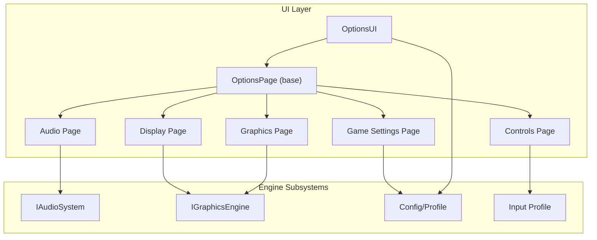
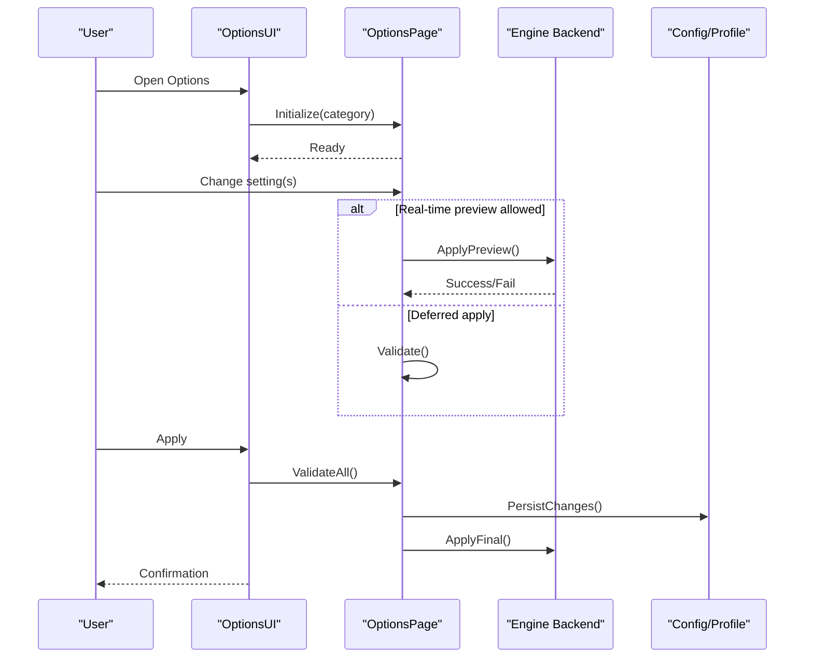
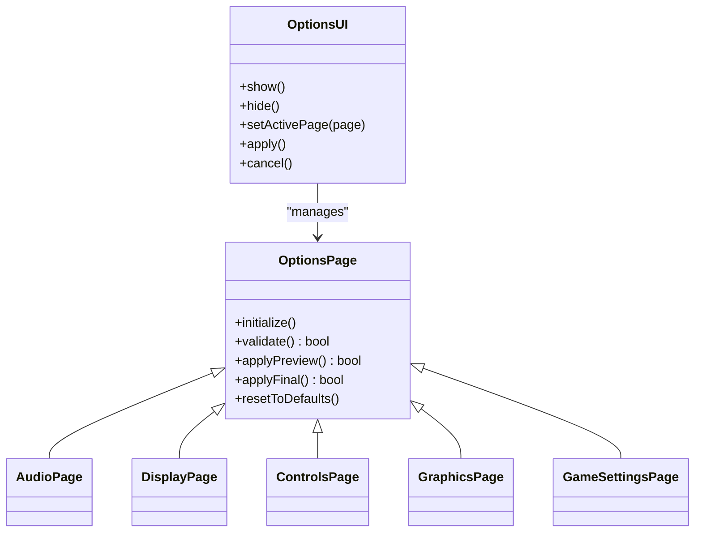
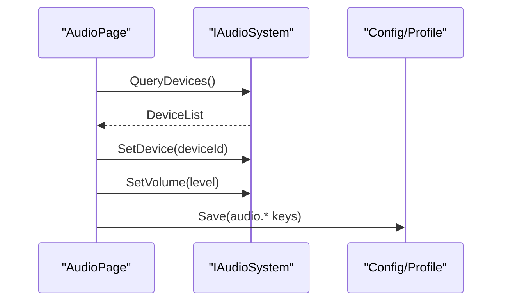
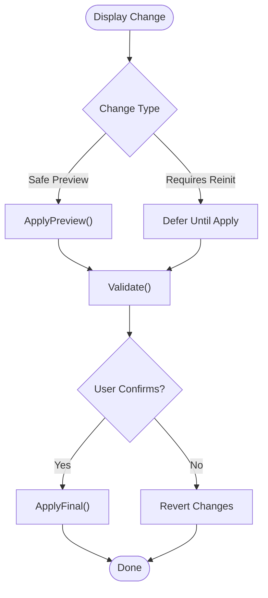
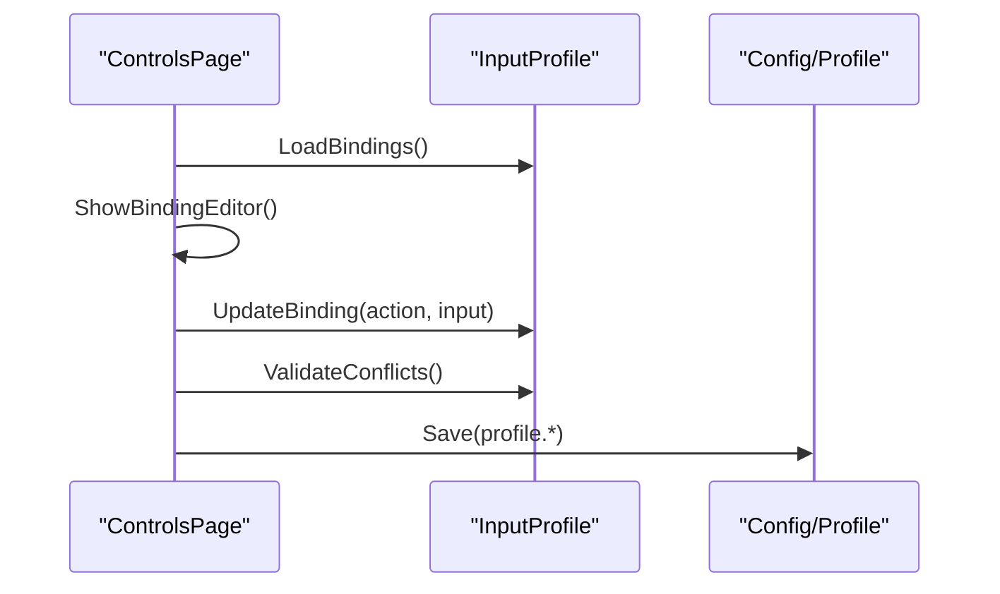
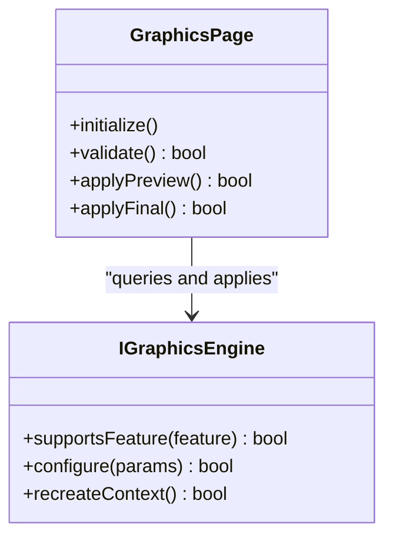
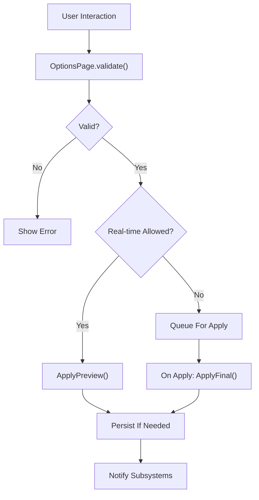
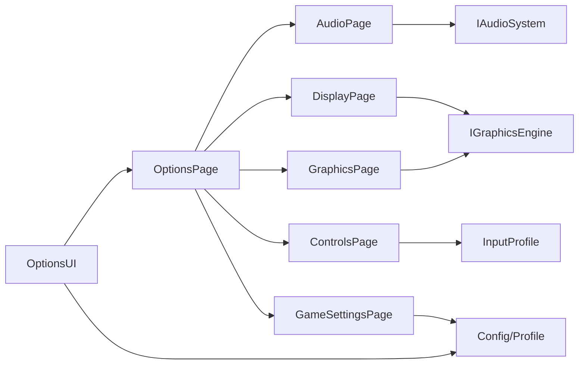

# Options System

<cite>
**Referenced Files in This Document**
- [OptionsUI.hpp](file://engine/Poseidon/UI/OptionsUI.hpp)
- [OptionsUI.cpp](file://engine/Poseidon/UI/OptionsUI.cpp)
- [OptionsUIImpl.cpp](file://engine/Poseidon/UI/OptionsUIImpl.cpp)
- [OptionsUIImplVideo.cpp](file://engine/Poseidon/UI/OptionsUIImplVideo.cpp)
- [OptionsUICommon.hpp](file://engine/Poseidon/UI/OptionsUICommon.hpp)
- [DisplayUI.hpp](file://engine/Poseidon/UI/DisplayUI.hpp)
- [DisplayUI.cpp](file://engine/Poseidon/UI/DisplayUI.cpp)
- [ControlsCategory.hpp](file://engine/Poseidon/Input/ControlsCategory.hpp)
- [ControlsCategory.cpp](file://engine/Poseidon/Input/ControlsCategory.cpp)
- [InputProfile.hpp](file://engine/Poseidon/Input/InputProfile.hpp)
- [InputProfile.cpp](file://engine/Poseidon/Input/InputProfile.cpp)
- [AudioFactory.hpp](file://engine/Poseidon/Audio/AudioFactory.hpp)
- [IAudioSystem.hpp](file://engine/Poseidon/Audio/IAudioSystem.hpp)
- [GraphicsEngineFactory.hpp](file://engine/Poseidon/Graphics/GraphicsEngineFactory.hpp)
- [IGraphicsEngine.hpp](file://engine/Poseidon/Graphics/IGraphicsEngine.hpp)
- [Config.hpp](file://engine/Poseidon/Core/Config/Config.hpp)
- [Config.cpp](file://engine/Poseidon/Core/Config/Config.cpp)
- [Profile.hpp](file://engine/Poseidon/Core/Profile/Profile.hpp)
- [Profile.cpp](file://engine/Poseidon/Core/Profile/Profile.cpp)
</cite>

## Table of Contents
1. [Introduction](#introduction)
2. [Project Structure](#project-structure)
3. [Core Components](#core-components)
4. [Architecture Overview](#architecture-overview)
5. [Detailed Component Analysis](#detailed-component-analysis)
6. [Dependency Analysis](#dependency-analysis)
7. [Performance Considerations](#performance-considerations)
8. [Troubleshooting Guide](#troubleshooting-guide)
9. [Conclusion](#conclusion)
10. [Appendices](#appendices)

## Introduction
This document explains the options system architecture and implementation used by the UI layer to manage user preferences across categories such as audio, display, controls, graphics, and game settings. It focuses on the OptionsShell framework concept, the base OptionsPage abstraction, specialized pages for each category, configuration persistence, validation rules, real-time preview behavior, and how UI changes propagate to underlying engine subsystems. It also covers hot-reloading of settings and migration strategies for older configuration formats.

## Project Structure
The options system spans several areas:
- UI layer: Options shell, page base class, and category-specific implementations
- Input subsystem: Controls mapping and profiles
- Audio subsystem: Audio device and runtime configuration
- Graphics subsystem: Renderer selection and runtime parameters
- Core configuration/profile: Persistence and schema handling

**Diagram sources**
- [OptionsUI.hpp](file://engine/Poseidon/UI/OptionsUI.hpp)
- [OptionsUICommon.hpp](file://engine/Poseidon/UI/OptionsUICommon.hpp)
- [IAudioSystem.hpp](file://engine/Poseidon/Audio/IAudioSystem.hpp)
- [IGraphicsEngine.hpp](file://engine/Poseidon/Graphics/IGraphicsEngine.hpp)
- [InputProfile.hpp](file://engine/Poseidon/Input/InputProfile.hpp)
- [Config.hpp](file://engine/Poseidon/Core/Config/Config.hpp)

**Section sources**
- [OptionsUI.hpp](file://engine/Poseidon/UI/OptionsUI.hpp)
- [OptionsUICommon.hpp](file://engine/Poseidon/UI/OptionsUICommon.hpp)

## Core Components
- OptionsShell framework: Orchestrates the options UI lifecycle, tab/category navigation, and applies or cancels changes.
- OptionsPage base class: Defines the interface for a settings category, including initialization, validation, apply/cancel semantics, and real-time preview hooks.
- Specialized pages: Implement concrete settings groups (audio, display, controls, graphics, game).
- Configuration persistence: Centralized via Config/Profile to read/write settings with versioning and migration support.
- Validation and preview: Per-page validation rules and optional immediate application for non-disruptive settings.

Key responsibilities:
- OptionsUI: Hosts the shell, manages active page, dispatches apply/cancel, and coordinates with engine backends.
- OptionsPage: Encapsulates state, UI bindings, validation, and apply logic per category.
- Category pages: Bind to specific subsystems (audio, graphics, input) and translate UI changes into engine calls.

**Section sources**
- [OptionsUI.cpp](file://engine/Poseidon/UI/OptionsUI.cpp)
- [OptionsUIImpl.cpp](file://engine/Poseidon/UI/OptionsUIImpl.cpp)
- [OptionsUICommon.hpp](file://engine/Poseidon/UI/OptionsUICommon.hpp)

## Architecture Overview
The options system follows a layered design:
- UI Shell: Presents a consistent experience across categories and handles global actions (Apply, Cancel, Reset).
- Page Abstraction: Each category implements a page that owns its settings state and validation.
- Engine Integration: Pages call into subsystem interfaces to apply changes immediately or defer until Apply is confirmed.
- Persistence: All settings are persisted through a central configuration mechanism supporting schema evolution.

**Diagram sources**
- [OptionsUI.cpp](file://engine/Poseidon/UI/OptionsUI.cpp)
- [OptionsUIImpl.cpp](file://engine/Poseidon/UI/OptionsUIImpl.cpp)
- [Config.hpp](file://engine/Poseidon/Core/Config/Config.hpp)

## Detailed Component Analysis

### OptionsShell and Base Page
- OptionsShell: Manages tabbed categories, tracks dirty state, and ensures atomic apply/cancel operations.
- OptionsPage base: Provides common lifecycle methods for setup, validation, preview, and finalization.

**Diagram sources**
- [OptionsUI.hpp](file://engine/Poseidon/UI/OptionsUI.hpp)
- [OptionsUICommon.hpp](file://engine/Poseidon/UI/OptionsUICommon.hpp)

**Section sources**
- [OptionsUI.cpp](file://engine/Poseidon/UI/OptionsUI.cpp)
- [OptionsUIImpl.cpp](file://engine/Poseidon/UI/OptionsUIImpl.cpp)
- [OptionsUICommon.hpp](file://engine/Poseidon/UI/OptionsUICommon.hpp)

### Audio Settings Page
- Binds to audio devices, volume levels, output format, and voice chat toggles.
- Supports real-time preview for non-destructive changes (e.g., volume, device switch when safe).
- Applies final changes to the audio backend upon confirmation.

**Diagram sources**
- [IAudioSystem.hpp](file://engine/Poseidon/Audio/IAudioSystem.hpp)
- [AudioFactory.hpp](file://engine/Poseidon/Audio/AudioFactory.hpp)
- [Config.hpp](file://engine/Poseidon/Core/Config/Config.hpp)

**Section sources**
- [IAudioSystem.hpp](file://engine/Poseidon/Audio/IAudioSystem.hpp)
- [AudioFactory.hpp](file://engine/Poseidon/Audio/AudioFactory.hpp)

### Display Settings Page
- Manages resolution, refresh rate, fullscreen/windowed mode, VSync, and scaling.
- Some changes require reinitializing the graphics context; these are deferred until Apply.
- Real-time preview may be limited to safe parameters like brightness or UI scale.

**Diagram sources**
- [IGraphicsEngine.hpp](file://engine/Poseidon/Graphics/IGraphicsEngine.hpp)
- [GraphicsEngineFactory.hpp](file://engine/Poseidon/Graphics/GraphicsEngineFactory.hpp)

**Section sources**
- [IGraphicsEngine.hpp](file://engine/Poseidon/Graphics/IGraphicsEngine.hpp)
- [GraphicsEngineFactory.hpp](file://engine/Poseidon/Graphics/GraphicsEngineFactory.hpp)

### Controls Settings Page
- Handles keybindings, mouse sensitivity, controller mappings, and action categories.
- Uses InputProfile to persist and load binding configurations.
- Validates conflicts and enforces reserved keys where applicable.

**Diagram sources**
- [ControlsCategory.hpp](file://engine/Poseidon/Input/ControlsCategory.hpp)
- [InputProfile.hpp](file://engine/Poseidon/Input/InputProfile.hpp)
- [Config.hpp](file://engine/Poseidon/Core/Config/Config.hpp)

**Section sources**
- [ControlsCategory.hpp](file://engine/Poseidon/Input/ControlsCategory.hpp)
- [ControlsCategory.cpp](file://engine/Poseidon/Input/ControlsCategory.cpp)
- [InputProfile.hpp](file://engine/Poseidon/Input/InputProfile.hpp)
- [InputProfile.cpp](file://engine/Poseidon/Input/InputProfile.cpp)

### Graphics Settings Page
- Manages renderer selection, quality presets, texture filtering, shadow quality, and advanced rendering flags.
- Requires careful validation due to potential driver limitations and hardware constraints.
- May trigger graphics context recreation on Apply.

**Diagram sources**
- [IGraphicsEngine.hpp](file://engine/Poseidon/Graphics/IGraphicsEngine.hpp)
- [GraphicsEngineFactory.hpp](file://engine/Poseidon/Graphics/GraphicsEngineFactory.hpp)

**Section sources**
- [IGraphicsEngine.hpp](file://engine/Poseidon/Graphics/IGraphicsEngine.hpp)
- [GraphicsEngineFactory.hpp](file://engine/Poseidon/Graphics/GraphicsEngineFactory.hpp)

### Game Settings Page
- Covers gameplay-related options such as difficulty, HUD layout, language, and mod toggles.
- Persists via Config/Profile and may affect mission loading or runtime behavior.
- Often requires restart or mission reload for full effect.

**Section sources**
- [Config.hpp](file://engine/Poseidon/Core/Config/Config.hpp)
- [Profile.hpp](file://engine/Poseidon/Core/Profile/Profile.hpp)

### Conceptual Overview
The options system separates UI concerns from engine specifics through well-defined interfaces. Pages encapsulate category-specific logic while the shell provides consistent UX. Validation and preview mechanisms ensure stability and responsiveness.

[No sources needed since this diagram shows conceptual workflow, not actual code structure]

## Dependency Analysis
The options system depends on core configuration and subsystem interfaces:
- UI components depend on OptionsUI and OptionsPage abstractions.
- Category pages depend on their respective subsystem interfaces (audio, graphics, input).
- Persistence relies on Config/Profile for storage and migration.

**Diagram sources**
- [OptionsUI.hpp](file://engine/Poseidon/UI/OptionsUI.hpp)
- [OptionsUICommon.hpp](file://engine/Poseidon/UI/OptionsUICommon.hpp)
- [IAudioSystem.hpp](file://engine/Poseidon/Audio/IAudioSystem.hpp)
- [IGraphicsEngine.hpp](file://engine/Poseidon/Graphics/IGraphicsEngine.hpp)
- [InputProfile.hpp](file://engine/Poseidon/Input/InputProfile.hpp)
- [Config.hpp](file://engine/Poseidon/Core/Config/Config.hpp)

**Section sources**
- [OptionsUI.cpp](file://engine/Poseidon/UI/OptionsUI.cpp)
- [OptionsUIImpl.cpp](file://engine/Poseidon/UI/OptionsUIImpl.cpp)
- [Config.hpp](file://engine/Poseidon/Core/Config/Config.hpp)

## Performance Considerations
- Avoid heavy operations in real-time preview; defer expensive reinitializations to Apply.
- Batch configuration writes to minimize disk I/O.
- Cache capability queries for graphics/audio to reduce repeated checks.
- Use lazy loading for large option sets (e.g., control bindings).

[No sources needed since this section provides general guidance]

## Troubleshooting Guide
Common issues and resolutions:
- Invalid settings rejected: Ensure validation rules match subsystem capabilities.
- Hot-reload failures: Confirm that ApplyFinal properly notifies all subsystems.
- Persistence errors: Verify Config/Profile paths and permissions; check schema version compatibility.
- Control binding conflicts: Use conflict detection and provide clear error messages.

**Section sources**
- [Config.cpp](file://engine/Poseidon/Core/Config/Config.cpp)
- [Profile.cpp](file://engine/Poseidon/Core/Profile/Profile.cpp)

## Conclusion
The options system provides a robust, extensible framework for managing user preferences across multiple engine subsystems. By separating UI concerns from engine specifics and enforcing validation and persistence, it ensures a stable and responsive user experience. Extending the system involves implementing new OptionsPage subclasses and integrating with appropriate subsystem interfaces.

[No sources needed since this section summarizes without analyzing specific files]

## Appendices

### Creating a New Option Category
Steps to add a new category:
1. Create a new OptionsPage subclass with initialize, validate, applyPreview, and applyFinal methods.
2. Register the page with OptionsUI for display in the shell.
3. Implement validation rules and real-time preview as appropriate.
4. Integrate with the relevant subsystem interface for applying changes.
5. Add persistence keys to Config/Profile and handle migration if needed.

**Section sources**
- [OptionsUI.hpp](file://engine/Poseidon/UI/OptionsUI.hpp)
- [OptionsUICommon.hpp](file://engine/Poseidon/UI/OptionsUICommon.hpp)
- [Config.hpp](file://engine/Poseidon/Core/Config/Config.hpp)

### Implementing Custom UI Controls
Guidelines:
- Derive custom controls from existing UI primitives.
- Bind control values to OptionsPage state using two-way data binding.
- Trigger validation on change events for immediate feedback.
- Ensure accessibility and localization support.

[No sources needed since this section provides general guidance]

### Handling Configuration Changes
Best practices:
- Use ApplyFinal for destructive changes requiring subsystem reconfiguration.
- Use ApplyPreview for safe, reversible changes.
- Persist changes incrementally to avoid data loss.
- Notify dependent systems of changes via callbacks or events.

**Section sources**
- [OptionsUI.cpp](file://engine/Poseidon/UI/OptionsUI.cpp)
- [Config.cpp](file://engine/Poseidon/Core/Config/Config.cpp)

### Relationship Between UI Options and Engine Configuration
- UI pages map user-facing options to engine configuration keys.
- Validation ensures compatibility with hardware and software capabilities.
- ApplyFinal triggers engine updates and may require context recreation.
- Persistence stores effective settings with version metadata.

**Section sources**
- [IAudioSystem.hpp](file://engine/Poseidon/Audio/IAudioSystem.hpp)
- [IGraphicsEngine.hpp](file://engine/Poseidon/Graphics/IGraphicsEngine.hpp)
- [Config.hpp](file://engine/Poseidon/Core/Config/Config.hpp)

### Hot-Reloading of Settings
- Safe settings can be applied immediately via ApplyPreview.
- Unsafe settings require ApplyFinal and may trigger subsystem restarts.
- Monitor for errors during hot-reload and provide rollback mechanisms.

**Section sources**
- [OptionsUIImpl.cpp](file://engine/Poseidon/UI/OptionsUIImpl.cpp)
- [Config.cpp](file://engine/Poseidon/Core/Config/Config.cpp)

### Migration of Old Configuration Formats
- Implement schema version checks in Config/Profile.
- Provide migration functions to transform old formats to new schemas.
- Log migration steps for debugging and auditing.
- Test migrations thoroughly with sample configurations.

**Section sources**
- [Config.cpp](file://engine/Poseidon/Core/Config/Config.cpp)
- [Profile.cpp](file://engine/Poseidon/Core/Profile/Profile.cpp)