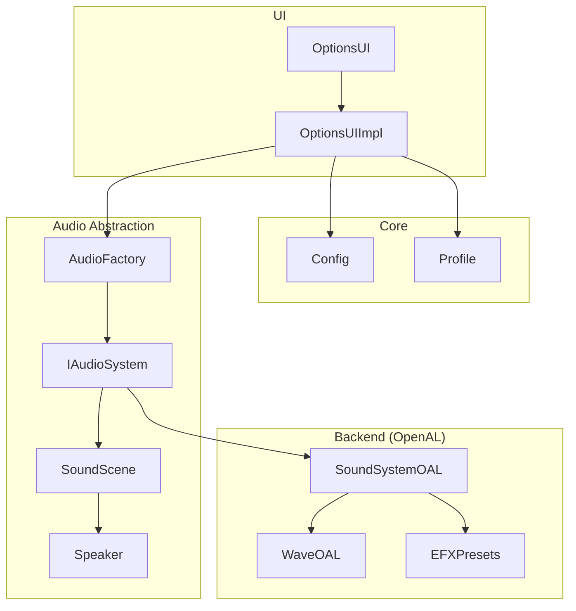
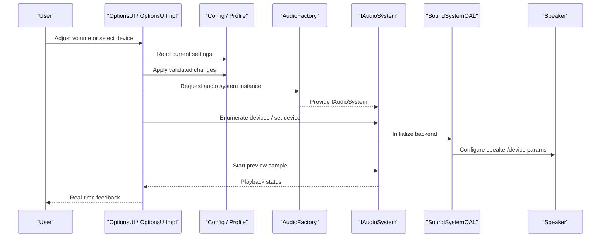
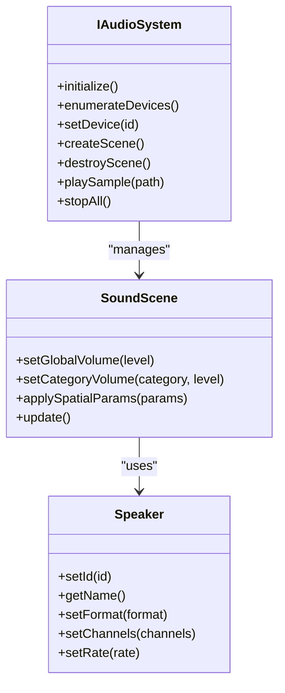
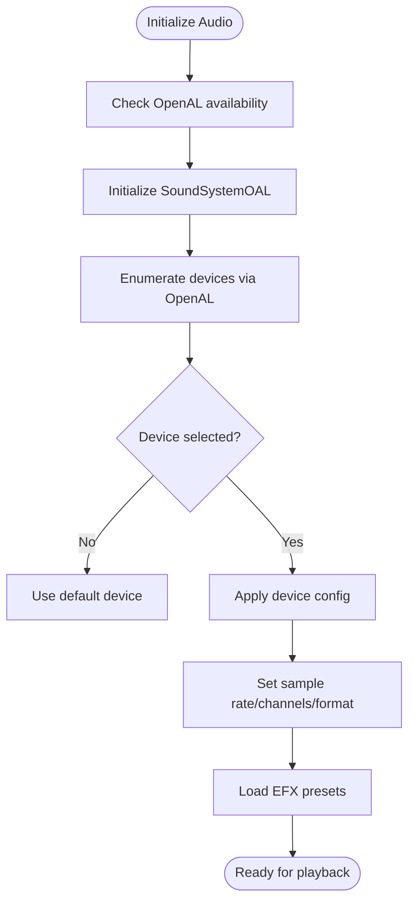
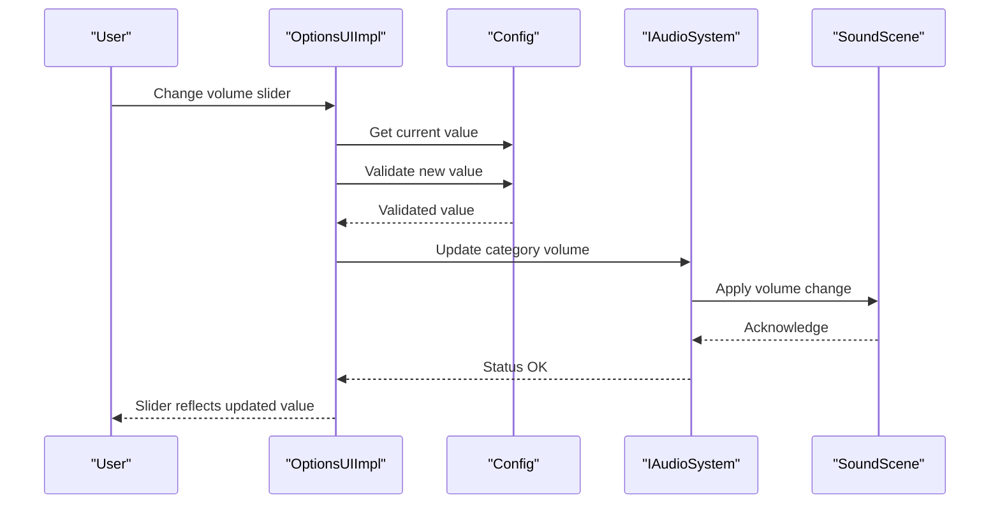
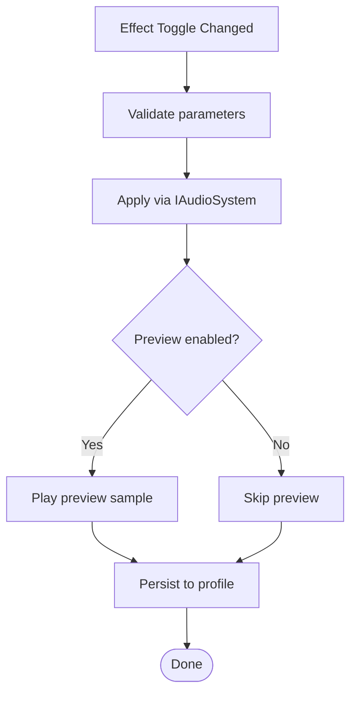
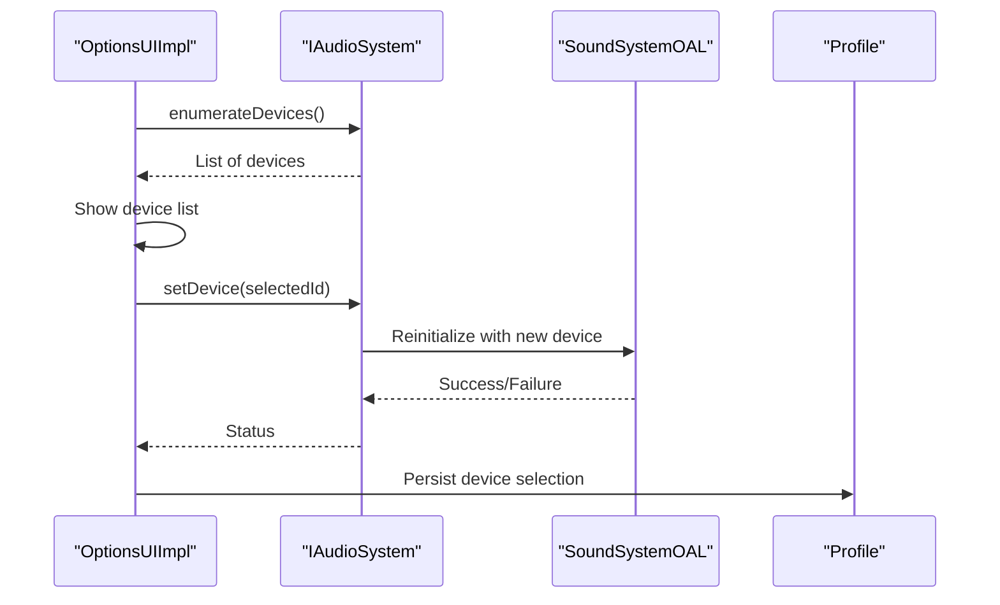
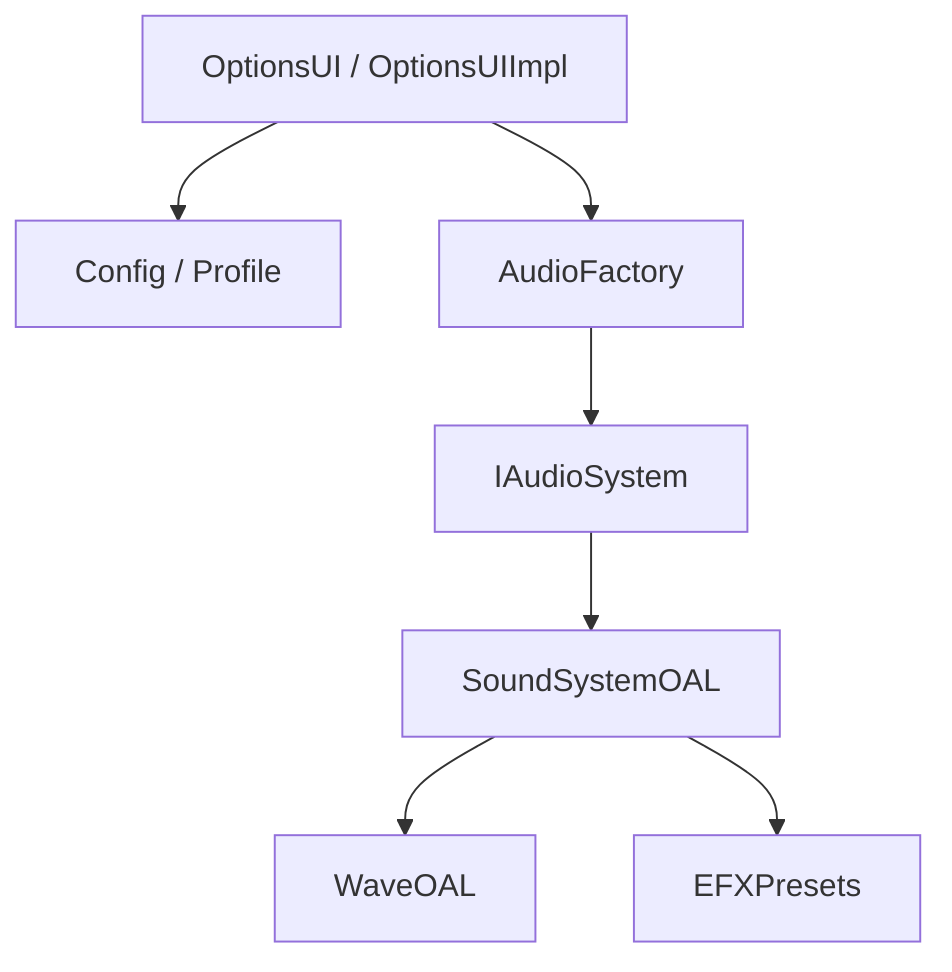

# Audio Settings

<cite>
**Referenced Files in This Document**
- [AudioFactory.cpp](file://engine/Poseidon/Audio/AudioFactory.cpp)
- [IAudioSystem.hpp](file://engine/Poseidon/Audio/IAudioSystem.hpp)
- [SoundScene.cpp](file://engine/Poseidon/Audio/SoundScene.cpp)
- [SoundScene.hpp](file://engine/Poseidon/Audio/SoundScene.hpp)
- [Speaker.cpp](file://engine/Poseidon/Audio/Speaker.cpp)
- [Speaker.hpp](file://engine/Poseidon/Audio/Speaker.hpp)
- [SoundSystemOAL.cpp](file://engine/Poseidon/PoseidonOpenAL/SoundSystemOAL.cpp)
- [SoundSystemOAL.hpp](file://engine/Poseidon/PoseidonOpenAL/SoundSystemOAL.hpp)
- [WaveOAL.cpp](file://engine/Poseidon/PoseidonOpenAL/WaveOAL.cpp)
- [WaveOAL.hpp](file://engine/Poseidon/PoseidonOpenAL/WaveOAL.hpp)
- [EFXPresets.hpp](file://engine/Poseidon/PoseidonOpenAL/EFXPresets.hpp)
- [OptionsUI.cpp](file://engine/Poseidon/UI/OptionsUI.cpp)
- [OptionsUI.hpp](file://engine/Poseidon/UI/OptionsUI.hpp)
- [OptionsUIImpl.cpp](file://engine/Poseidon/UI/OptionsUIImpl.cpp)
- [OptionsUICommon.hpp](file://engine/Poseidon/UI/OptionsUICommon.hpp)
- [InputSubsystem.cpp](file://engine/Poseidon/Input/InputSubsystem.cpp)
- [InputSubsystem.hpp](file://engine/Poseidon/Input/InputSubsystem.hpp)
- [Config.cpp](file://engine/Poseidon/Core/Config/Config.cpp)
- [Config.hpp](file://engine/Poseidon/Core/Config/Config.hpp)
- [Profile.cpp](file://engine/Poseidon/Core/Profile/Profile.cpp)
- [Profile.hpp](file://engine/Poseidon/Core/Profile/Profile.hpp)
- [audio_config.tests.ps1](file://tests/smoke/audio_config.tests.ps1)
- [audio_volume_persist.tests.ps1](file://tests/smoke/audio_volume_persist.tests.ps1)
</cite>

## Table of Contents
1. Introduction
2. Project Structure
3. Core Components
4. Architecture Overview
5. Detailed Component Analysis
6. Dependency Analysis
7. Performance Considerations
8. Troubleshooting Guide
9. Conclusion
10. Appendices

## Introduction
This document provides comprehensive documentation for the Audio Settings subsystem, focusing on configuration options such as volume controls, device selection, quality settings, and spatial audio parameters. It explains how the UI layer (including an AudioPage-like experience) integrates with the audio engine to provide real-time preview, device enumeration, and dynamic updates. Guidance is included for adding new audio settings, implementing effect toggles, handling device changes, validating configurations, applying defaults, and troubleshooting common issues.

## Project Structure
The audio subsystem spans multiple layers:
- UI Options layer: Presents settings and binds user actions to configuration changes.
- Configuration and Profile layer: Persists and loads settings.
- Audio abstraction layer: Defines interfaces and scene management.
- Backend implementation: OpenAL-based sound system and wave playback.
- Tests: Validate configuration behavior and persistence.

**Diagram sources**
- [OptionsUI.cpp](file://engine/Poseidon/UI/OptionsUI.cpp)
- [OptionsUIImpl.cpp](file://engine/Poseidon/UI/OptionsUIImpl.cpp)
- [Config.cpp](file://engine/Poseidon/Core/Config/Config.cpp)
- [Profile.cpp](file://engine/Poseidon/Core/Profile/Profile.cpp)
- [AudioFactory.cpp](file://engine/Poseidon/Audio/AudioFactory.cpp)
- [IAudioSystem.hpp](file://engine/Poseidon/Audio/IAudioSystem.hpp)
- [SoundScene.cpp](file://engine/Poseidon/Audio/SoundScene.cpp)
- [Speaker.cpp](file://engine/Poseidon/Audio/Speaker.cpp)
- [SoundSystemOAL.cpp](file://engine/Poseidon/PoseidonOpenAL/SoundSystemOAL.cpp)
- [WaveOAL.cpp](file://engine/Poseidon/PoseidonOpenAL/WaveOAL.cpp)
- [EFXPresets.hpp](file://engine/Poseidon/PoseidonOpenAL/EFXPresets.hpp)

**Section sources**
- [OptionsUI.cpp](file://engine/Poseidon/UI/OptionsUI.cpp)
- [OptionsUIImpl.cpp](file://engine/Poseidon/UI/OptionsUIImpl.cpp)
- [Config.cpp](file://engine/Poseidon/Core/Config/Config.cpp)
- [Profile.cpp](file://engine/Poseidon/Core/Profile/Profile.cpp)
- [AudioFactory.cpp](file://engine/Poseidon/Audio/AudioFactory.cpp)
- [IAudioSystem.hpp](file://engine/Poseidon/Audio/IAudioSystem.hpp)
- [SoundScene.cpp](file://engine/Poseidon/Audio/SoundScene.cpp)
- [Speaker.cpp](file://engine/Poseidon/Audio/Speaker.cpp)
- [SoundSystemOAL.cpp](file://engine/Poseidon/PoseidonOpenAL/SoundSystemOAL.cpp)
- [WaveOAL.cpp](file://engine/Poseidon/PoseidonOpenAL/WaveOAL.cpp)
- [EFXPresets.hpp](file://engine/Poseidon/PoseidonOpenAL/EFXPresets.hpp)

## Core Components
- Audio abstraction interface: Defines the contract for initializing, enumerating devices, managing scenes, and controlling playback.
- Sound scene: Manages active audio contexts, routing, and per-scene settings.
- Speaker: Represents output devices and handles device-specific parameters.
- OpenAL backend: Implements the audio interface using OpenAL, including effects and presets.
- UI integration: Binds settings to user interactions and persists changes.

Key responsibilities:
- Device enumeration and selection
- Volume control across categories
- Quality and spatial audio parameters
- Real-time preview and dynamic updates
- Validation and default application

**Section sources**
- [IAudioSystem.hpp](file://engine/Poseidon/Audio/IAudioSystem.hpp)
- [SoundScene.cpp](file://engine/Poseidon/Audio/SoundScene.cpp)
- [Speaker.cpp](file://engine/Poseidon/Audio/Speaker.cpp)
- [SoundSystemOAL.cpp](file://engine/Poseidon/PoseidonOpenAL/SoundSystemOAL.cpp)
- [OptionsUIImpl.cpp](file://engine/Poseidon/UI/OptionsUIImpl.cpp)

## Architecture Overview
The Audio Settings subsystem follows a layered architecture:
- UI layer exposes settings and triggers events.
- Configuration layer stores and validates values.
- Audio factory selects and initializes the backend.
- Backend implements device enumeration, playback, and effects.

**Diagram sources**
- [OptionsUI.cpp](file://engine/Poseidon/UI/OptionsUI.cpp)
- [OptionsUIImpl.cpp](file://engine/Poseidon/UI/OptionsUIImpl.cpp)
- [Config.cpp](file://engine/Poseidon/Core/Config/Config.cpp)
- [Profile.cpp](file://engine/Poseidon/Core/Profile/Profile.cpp)
- [AudioFactory.cpp](file://engine/Poseidon/Audio/AudioFactory.cpp)
- [IAudioSystem.hpp](file://engine/Poseidon/Audio/IAudioSystem.hpp)
- [SoundSystemOAL.cpp](file://engine/Poseidon/PoseidonOpenAL/SoundSystemOAL.cpp)
- [Speaker.cpp](file://engine/Poseidon/Audio/Speaker.cpp)

## Detailed Component Analysis

### Audio Abstraction and Scene Management
- IAudioSystem defines methods for initialization, device enumeration, scene lifecycle, and playback control.
- SoundScene manages active audio context, global volumes, and per-category volumes.
- Speaker encapsulates output device state and parameters.

**Diagram sources**
- [IAudioSystem.hpp](file://engine/Poseidon/Audio/IAudioSystem.hpp)
- [SoundScene.cpp](file://engine/Poseidon/Audio/SoundScene.cpp)
- [Speaker.cpp](file://engine/Poseidon/Audio/Speaker.cpp)

**Section sources**
- [IAudioSystem.hpp](file://engine/Poseidon/Audio/IAudioSystem.hpp)
- [SoundScene.cpp](file://engine/Poseidon/Audio/SoundScene.cpp)
- [Speaker.cpp](file://engine/Poseidon/Audio/Speaker.cpp)

### OpenAL Backend Implementation
- SoundSystemOAL implements IAudioSystem using OpenAL, providing device enumeration, format configuration, and playback.
- WaveOAL handles loading and streaming audio data.
- EFXPresets defines reusable audio effects and spatial parameters.

**Diagram sources**
- [SoundSystemOAL.cpp](file://engine/Poseidon/PoseidonOpenAL/SoundSystemOAL.cpp)
- [WaveOAL.cpp](file://engine/Poseidon/PoseidonOpenAL/WaveOAL.cpp)
- [EFXPresets.hpp](file://engine/Poseidon/PoseidonOpenAL/EFXPresets.hpp)

**Section sources**
- [SoundSystemOAL.cpp](file://engine/Poseidon/PoseidonOpenAL/SoundSystemOAL.cpp)
- [WaveOAL.cpp](file://engine/Poseidon/PoseidonOpenAL/WaveOAL.cpp)
- [EFXPresets.hpp](file://engine/Poseidon/PoseidonOpenAL/EFXPresets.hpp)

### UI Integration and Real-Time Preview
- OptionsUI and OptionsUIImpl bind UI controls to configuration keys and trigger audio operations.
- Real-time preview uses a short sample triggered by user interaction; playback status updates UI accordingly.
- Dynamic updates apply changes immediately without restarting the audio system when possible.

**Diagram sources**
- [OptionsUI.cpp](file://engine/Poseidon/UI/OptionsUI.cpp)
- [OptionsUIImpl.cpp](file://engine/Poseidon/UI/OptionsUIImpl.cpp)
- [Config.cpp](file://engine/Poseidon/Core/Config/Config.cpp)
- [IAudioSystem.hpp](file://engine/Poseidon/Audio/IAudioSystem.hpp)
- [SoundScene.cpp](file://engine/Poseidon/Audio/SoundScene.cpp)

**Section sources**
- [OptionsUI.cpp](file://engine/Poseidon/UI/OptionsUI.cpp)
- [OptionsUIImpl.cpp](file://engine/Poseidon/UI/OptionsUIImpl.cpp)
- [Config.cpp](file://engine/Poseidon/Core/Config/Config.cpp)
- [IAudioSystem.hpp](file://engine/Poseidon/Audio/IAudioSystem.hpp)
- [SoundScene.cpp](file://engine/Poseidon/Audio/SoundScene.cpp)

### Adding New Audio Settings
Steps to add a new setting:
- Define a configuration key in the configuration layer.
- Add validation rules and default values.
- Bind UI control to the configuration key in OptionsUIImpl.
- If runtime update is required, call IAudioSystem to apply changes.
- Persist changes through the profile layer.

Example flow for adding a new “Reverb” toggle:
- Add key and default in configuration.
- Create UI toggle bound to the key.
- On change, validate and apply via IAudioSystem.
- Persist to profile.

**Section sources**
- [Config.cpp](file://engine/Poseidon/Core/Config/Config.cpp)
- [OptionsUIImpl.cpp](file://engine/Poseidon/UI/OptionsUIImpl.cpp)
- [IAudioSystem.hpp](file://engine/Poseidon/Audio/IAudioSystem.hpp)
- [Profile.cpp](file://engine/Poseidon/Core/Profile/Profile.cpp)

### Implementing Audio Effect Toggles
- Effects are managed via EFX presets and applied at the scene or source level.
- Toggle logic should:
  - Validate parameter ranges.
  - Apply effect parameters through IAudioSystem.
  - Trigger a preview if needed.
  - Persist the state.

**Diagram sources**
- [EFXPresets.hpp](file://engine/Poseidon/PoseidonOpenAL/EFXPresets.hpp)
- [IAudioSystem.hpp](file://engine/Poseidon/Audio/IAudioSystem.hpp)
- [OptionsUIImpl.cpp](file://engine/Poseidon/UI/OptionsUIImpl.cpp)

**Section sources**
- [EFXPresets.hpp](file://engine/Poseidon/PoseidonOpenAL/EFXPresets.hpp)
- [IAudioSystem.hpp](file://engine/Poseidon/Audio/IAudioSystem.hpp)
- [OptionsUIImpl.cpp](file://engine/Poseidon/UI/OptionsUIImpl.cpp)

### Handling Audio Device Changes
- Device enumeration is provided by the backend; UI lists available devices.
- Changing devices may require reinitialization of the audio system.
- Ensure graceful fallback to default device if selection fails.

**Diagram sources**
- [OptionsUIImpl.cpp](file://engine/Poseidon/UI/OptionsUIImpl.cpp)
- [IAudioSystem.hpp](file://engine/Poseidon/Audio/IAudioSystem.hpp)
- [SoundSystemOAL.cpp](file://engine/Poseidon/PoseidonOpenAL/SoundSystemOAL.cpp)
- [Profile.cpp](file://engine/Poseidon/Core/Profile/Profile.cpp)

**Section sources**
- [OptionsUIImpl.cpp](file://engine/Poseidon/UI/OptionsUIImpl.cpp)
- [IAudioSystem.hpp](file://engine/Poseidon/Audio/IAudioSystem.hpp)
- [SoundSystemOAL.cpp](file://engine/Poseidon/PoseidonOpenAL/SoundSystemOAL.cpp)
- [Profile.cpp](file://engine/Poseidon/Core/Profile/Profile.cpp)

### Audio Configuration Validation and Defaults
- All settings must be validated before application.
- Defaults should be defined centrally and applied on first run or reset.
- Validation includes range checks, compatibility checks, and dependency constraints.

Validation checklist:
- Numeric ranges within hardware limits.
- Format compatibility (sample rate, channels).
- Spatial parameters within supported bounds.
- Dependencies between settings (e.g., enabling effects requires compatible device).

Defaults strategy:
- Centralized default map.
- Merge with user profile only when missing.
- Reset functionality restores defaults.

**Section sources**
- [Config.cpp](file://engine/Poseidon/Core/Config/Config.cpp)
- [Profile.cpp](file://engine/Poseidon/Core/Profile/Profile.cpp)

## Dependency Analysis
The audio subsystem has clear dependencies:
- UI depends on configuration and audio abstraction.
- Audio abstraction depends on backend implementation.
- Backend depends on platform audio libraries (OpenAL).

**Diagram sources**
- [OptionsUI.cpp](file://engine/Poseidon/UI/OptionsUI.cpp)
- [OptionsUIImpl.cpp](file://engine/Poseidon/UI/OptionsUIImpl.cpp)
- [Config.cpp](file://engine/Poseidon/Core/Config/Config.cpp)
- [Profile.cpp](file://engine/Poseidon/Core/Profile/Profile.cpp)
- [AudioFactory.cpp](file://engine/Poseidon/Audio/AudioFactory.cpp)
- [IAudioSystem.hpp](file://engine/Poseidon/Audio/IAudioSystem.hpp)
- [SoundSystemOAL.cpp](file://engine/Poseidon/PoseidonOpenAL/SoundSystemOAL.cpp)
- [WaveOAL.cpp](file://engine/Poseidon/PoseidonOpenAL/WaveOAL.cpp)
- [EFXPresets.hpp](file://engine/Poseidon/PoseidonOpenAL/EFXPresets.hpp)

**Section sources**
- [OptionsUI.cpp](file://engine/Poseidon/UI/OptionsUI.cpp)
- [OptionsUIImpl.cpp](file://engine/Poseidon/UI/OptionsUIImpl.cpp)
- [Config.cpp](file://engine/Poseidon/Core/Config/Config.cpp)
- [Profile.cpp](file://engine/Poseidon/Core/Profile/Profile.cpp)
- [AudioFactory.cpp](file://engine/Poseidon/Audio/AudioFactory.cpp)
- [IAudioSystem.hpp](file://engine/Poseidon/Audio/IAudioSystem.hpp)
- [SoundSystemOAL.cpp](file://engine/Poseidon/PoseidonOpenAL/SoundSystemOAL.cpp)
- [WaveOAL.cpp](file://engine/Poseidon/PoseidonOpenAL/WaveOAL.cpp)
- [EFXPresets.hpp](file://engine/Poseidon/PoseidonOpenAL/EFXPresets.hpp)

## Performance Considerations
- Avoid frequent reinitialization of the audio system; batch device changes where possible.
- Use streaming for large audio assets to reduce memory pressure.
- Cache frequently used effects and presets.
- Minimize UI-to-backend calls by debouncing rapid slider changes.
- Monitor CPU usage during heavy spatial processing and adjust quality settings dynamically.

[No sources needed since this section provides general guidance]

## Troubleshooting Guide
Common issues and resolutions:
- No audio output: Verify device enumeration and default device selection; check backend initialization logs.
- Distorted audio: Validate sample rate and channel configuration; ensure format compatibility.
- Effects not applying: Confirm effect support on the selected device; verify parameter ranges.
- Settings not persisting: Check profile write permissions and merge logic.
- Preview not playing: Validate sample path and playback status callbacks.

Diagnostic steps:
- Inspect configuration values and defaults.
- Test device enumeration and selection independently.
- Run smoke tests for configuration and persistence.

**Section sources**
- [audio_config.tests.ps1](file://tests/smoke/audio_config.tests.ps1)
- [audio_volume_persist.tests.ps1](file://tests/smoke/audio_volume_persist.tests.ps1)

## Conclusion
The Audio Settings subsystem provides a robust, layered approach to managing audio configuration and playback. By separating UI, configuration, abstraction, and backend concerns, it enables flexible device management, real-time previews, and extensible effect handling. Following the guidelines for adding settings, validating configurations, and handling device changes ensures a reliable user experience.

[No sources needed since this section summarizes without analyzing specific files]

## Appendices

### Audio Configuration Keys Reference
- Volume controls: Global, Music, Effects, Voice, Ambience
- Device selection: Output device ID, preferred format (sample rate, channels)
- Quality settings: Buffer size, latency targets, spatial processing mode
- Spatial audio parameters: Reverb mix, distance model, Doppler factor

[No sources needed since this section provides general guidance]

### Example Workflows
- Adding a new setting:
  - Define key and default in configuration.
  - Bind UI control and validation.
  - Apply via IAudioSystem and persist.
- Implementing an effect toggle:
  - Validate parameters.
  - Apply effect through backend.
  - Trigger preview and persist state.
- Handling device changes:
  - Enumerate devices.
  - Reinitialize backend if necessary.
  - Persist selection and notify UI.

[No sources needed since this section provides general guidance]