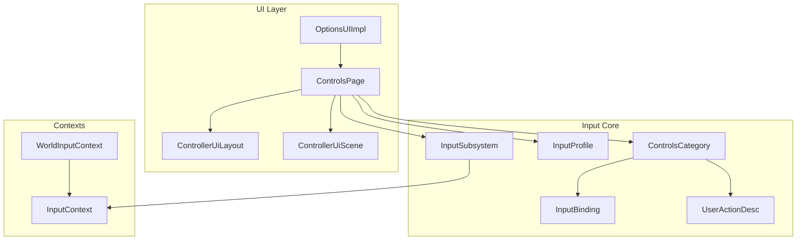
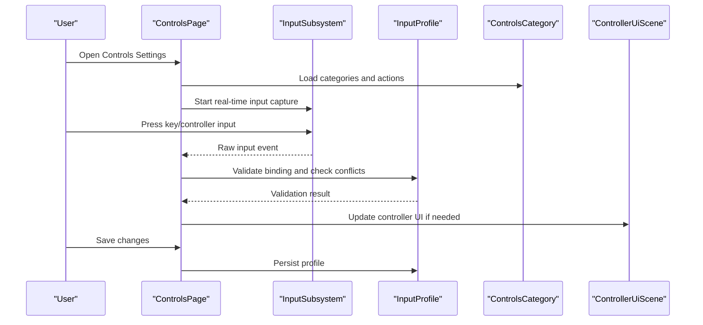
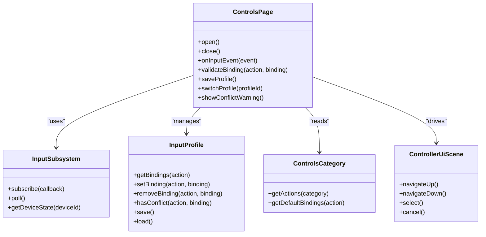
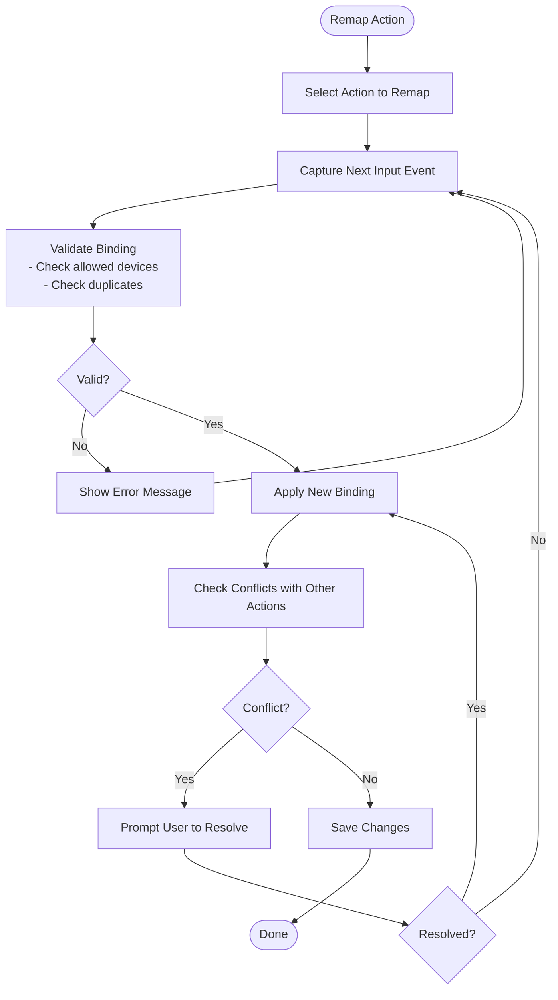
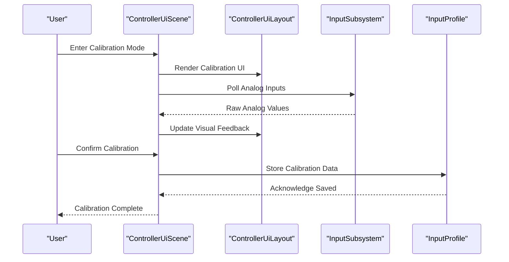
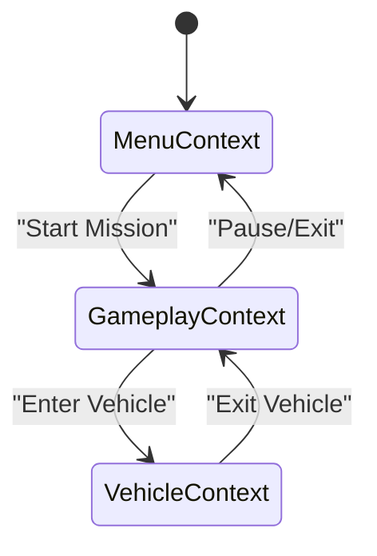
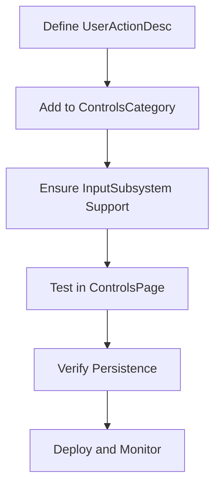
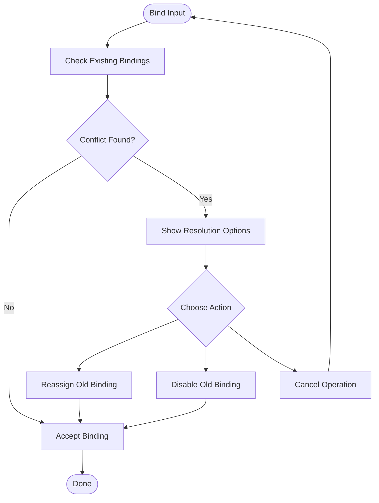
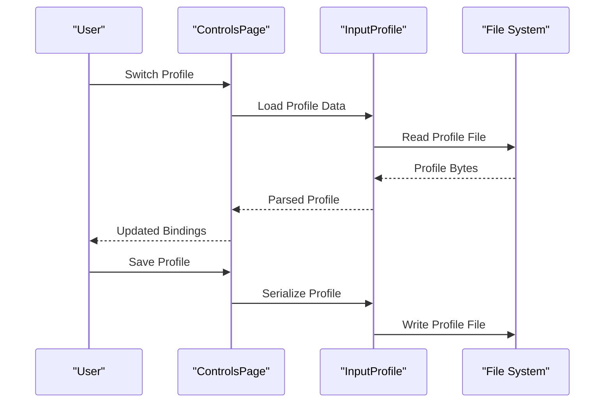
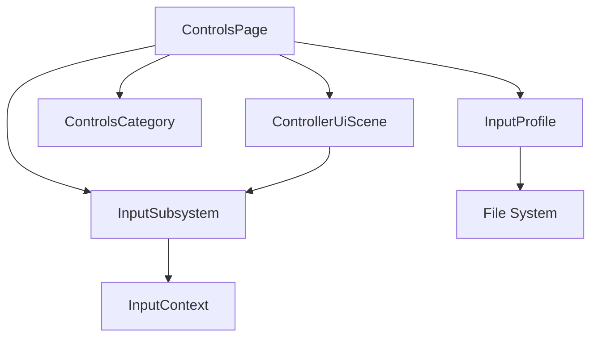

# Controls Settings

<cite>
**Referenced Files in This Document**
- [InputSubsystem.hpp](file://engine/Poseidon/Input/InputSubsystem.hpp)
- [InputSubsystem.cpp](file://engine/Poseidon/Input/InputSubsystem.cpp)
- [InputProfile.hpp](file://engine/Poseidon/Input/InputProfile.hpp)
- [InputProfile.cpp](file://engine/Poseidon/Input/InputProfile.cpp)
- [InputBinding.hpp](file://engine/Poseidon/Input/InputBinding.hpp)
- [UserActionDesc.hpp](file://engine/Poseidon/Input/UserActionDesc.hpp)
- [UserActionDesc.cpp](file://engine/Poseidon/Input/UserActionDesc.cpp)
- [ControlsCategory.hpp](file://engine/Poseidon/Input/ControlsCategory.hpp)
- [ControlsCategory.cpp](file://engine/Poseidon/Input/ControlsCategory.cpp)
- [ControllerUiLayout.hpp](file://engine/Poseidon/Input/ControllerUiLayout.hpp)
- [ControllerUiLayout.cpp](file://engine/Poseidon/Input/ControllerUiLayout.cpp)
- [ControllerUiScene.hpp](file://engine/Poseidon/Input/ControllerUiScene.hpp)
- [ControllerUiScene.cpp](file://engine/Poseidon/Input/ControllerUiScene.cpp)
- [InputContext.hpp](file://engine/Poseidon/Input/InputContext.hpp)
- [WorldInputContext.hpp](file://engine/Poseidon/World/WorldInputContext.hpp)
- [WorldInputContext.cpp](file://engine/Poseidon/World/WorldInputContext.cpp)
- [OptionsUIImpl.cpp](file://engine/Poseidon/UI/OptionsUIImpl.cpp)
- [Settings/ControlsPage.hpp](file://engine/Poseidon/UI/Settings/ControlsPage.hpp)
- [Settings/ControlsPage.cpp](file://engine/Poseidon/UI/Settings/ControlsPage.cpp)
</cite>

## Table of Contents
1. [Introduction](#introduction)
2. [Project Structure](#project-structure)
3. [Core Components](#core-components)
4. [Architecture Overview](#architecture-overview)
5. [Detailed Component Analysis](#detailed-component-analysis)
6. [Dependency Analysis](#dependency-analysis)
7. [Performance Considerations](#performance-considerations)
8. [Troubleshooting Guide](#troubleshooting-guide)
9. [Conclusion](#conclusion)
10. [Appendices](#appendices)

## Introduction
This document explains the Controls Settings subsystem, focusing on input binding management, key remapping, controller configuration, and context-sensitive controls. It details how the ControlsPage implements real-time input detection, binding validation, and profile management. It also provides guidance for adding new control bindings, implementing controller calibration, handling input conflicts, persisting configurations, switching profiles, and troubleshooting input recognition issues.

## Project Structure
The Controls Settings subsystem spans several engine modules:
- Input core: InputSubsystem, InputProfile, InputBinding, UserActionDesc, ControlsCategory
- UI layer: OptionsUI integration and ControlsPage
- Contexts: InputContext and WorldInputContext for context-sensitive behavior
- Controller UI: ControllerUiLayout and ControllerUiScene for gamepad-driven flows

**Diagram sources**
- [InputSubsystem.hpp](file://engine/Poseidon/Input/InputSubsystem.hpp)
- [InputProfile.hpp](file://engine/Poseidon/Input/InputProfile.hpp)
- [InputBinding.hpp](file://engine/Poseidon/Input/InputBinding.hpp)
- [UserActionDesc.hpp](file://engine/Poseidon/Input/UserActionDesc.hpp)
- [ControlsCategory.hpp](file://engine/Poseidon/Input/ControlsCategory.hpp)
- [OptionsUIImpl.cpp](file://engine/Poseidon/UI/OptionsUIImpl.cpp)
- [Settings/ControlsPage.hpp](file://engine/Poseidon/UI/Settings/ControlsPage.hpp)
- [ControllerUiLayout.hpp](file://engine/Poseidon/Input/ControllerUiLayout.hpp)
- [ControllerUiScene.hpp](file://engine/Poseidon/Input/ControllerUiScene.hpp)
- [InputContext.hpp](file://engine/Poseidon/Input/InputContext.hpp)
- [WorldInputContext.hpp](file://engine/Poseidon/World/WorldInputContext.hpp)

**Section sources**
- [InputSubsystem.hpp](file://engine/Poseidon/Input/InputSubsystem.hpp)
- [InputProfile.hpp](file://engine/Poseidon/Input/InputProfile.hpp)
- [InputBinding.hpp](file://engine/Poseidon/Input/InputBinding.hpp)
- [UserActionDesc.hpp](file://engine/Poseidon/Input/UserActionDesc.hpp)
- [ControlsCategory.hpp](file://engine/Poseidon/Input/ControlsCategory.hpp)
- [OptionsUIImpl.cpp](file://engine/Poseidon/UI/OptionsUIImpl.cpp)
- [Settings/ControlsPage.hpp](file://engine/Poseidon/UI/Settings/ControlsPage.hpp)
- [ControllerUiLayout.hpp](file://engine/Poseidon/Input/ControllerUiLayout.hpp)
- [ControllerUiScene.hpp](file://engine/Poseidon/Input/ControllerUiScene.hpp)
- [InputContext.hpp](file://engine/Poseidon/Input/InputContext.hpp)
- [WorldInputContext.hpp](file://engine/Poseidon/World/WorldInputContext.hpp)

## Core Components
- InputSubsystem: Central hub for device polling, event dispatch, and runtime state. It exposes APIs to query devices, read raw inputs, and apply bindings.
- InputProfile: Holds per-profile mappings from actions to bindings, including device-specific overrides and persistence hooks.
- InputBinding: Represents a single binding (key, mouse button, or controller input) with metadata such as modifiers and thresholds.
- UserActionDesc: Defines action identifiers, descriptions, categories, and default bindings.
- ControlsCategory: Groups related actions into logical sections (e.g., Movement, Camera, Vehicle).
- ControllerUiLayout and ControllerUiScene: Provide a gamepad-friendly interface for browsing and editing bindings.
- InputContext and WorldInputContext: Define active contexts that filter which actions are valid at any time (menu vs. gameplay).

Key responsibilities:
- Real-time input detection via InputSubsystem
- Binding validation and conflict resolution
- Profile creation, switching, and persistence
- Context-aware activation of actions

**Section sources**
- [InputSubsystem.hpp](file://engine/Poseidon/Input/InputSubsystem.hpp)
- [InputProfile.hpp](file://engine/Poseidon/Input/InputProfile.hpp)
- [InputBinding.hpp](file://engine/Poseidon/Input/InputBinding.hpp)
- [UserActionDesc.hpp](file://engine/Poseidon/Input/UserActionDesc.hpp)
- [ControlsCategory.hpp](file://engine/Poseidon/Input/ControlsCategory.hpp)
- [ControllerUiLayout.hpp](file://engine/Poseidon/Input/ControllerUiLayout.hpp)
- [ControllerUiScene.hpp](file://engine/Poseidon/Input/ControllerUiScene.hpp)
- [InputContext.hpp](file://engine/Poseidon/Input/InputContext.hpp)
- [WorldInputContext.hpp](file://engine/Poseidon/World/WorldInputContext.hpp)

## Architecture Overview
The Controls Settings flow integrates UI, input subsystem, and profiles:
- ControlsPage listens to user interactions and delegates to InputSubsystem for live input capture.
- InputProfile manages the mapping between actions and bindings, validating constraints and resolving conflicts.
- ControllerUiLayout/ControllerUiScene provide an alternative navigation path for controller users.
- InputContext/WorldInputContext determine which actions are active based on current game state.

**Diagram sources**
- [Settings/ControlsPage.hpp](file://engine/Poseidon/UI/Settings/ControlsPage.hpp)
- [InputSubsystem.hpp](file://engine/Poseidon/Input/InputSubsystem.hpp)
- [InputProfile.hpp](file://engine/Poseidon/Input/InputProfile.hpp)
- [ControlsCategory.hpp](file://engine/Poseidon/Input/ControlsCategory.hpp)
- [ControllerUiScene.hpp](file://engine/Poseidon/Input/ControllerUiScene.hpp)

## Detailed Component Analysis

### ControlsPage Implementation
ControlsPage is the primary UI for managing controls. It supports:
- Real-time input detection by subscribing to InputSubsystem events
- Binding validation against allowed keys/devices and existing conflicts
- Profile management: create, switch, and save profiles
- Integration with ControllerUiScene for gamepad navigation

**Diagram sources**
- [Settings/ControlsPage.hpp](file://engine/Poseidon/UI/Settings/ControlsPage.hpp)
- [InputSubsystem.hpp](file://engine/Poseidon/Input/InputSubsystem.hpp)
- [InputProfile.hpp](file://engine/Poseidon/Input/InputProfile.hpp)
- [ControlsCategory.hpp](file://engine/Poseidon/Input/ControlsCategory.hpp)
- [ControllerUiScene.hpp](file://engine/Poseidon/Input/ControllerUiScene.hpp)

**Section sources**
- [Settings/ControlsPage.hpp](file://engine/Poseidon/UI/Settings/ControlsPage.hpp)
- [Settings/ControlsPage.cpp](file://engine/Poseidon/UI/Settings/ControlsPage.cpp)
- [OptionsUIImpl.cpp](file://engine/Poseidon/UI/OptionsUIImpl.cpp)

### Input Binding Management and Key Remapping
- InputBinding represents a single binding entry with type (keyboard/mouse/controller), code, and optional modifiers.
- InputProfile stores multiple bindings per action and enforces uniqueness and validity.
- Key remapping involves removing old bindings and assigning new ones after validation.

**Diagram sources**
- [InputBinding.hpp](file://engine/Poseidon/Input/InputBinding.hpp)
- [InputProfile.hpp](file://engine/Poseidon/Input/InputProfile.hpp)
- [Settings/ControlsPage.hpp](file://engine/Poseidon/UI/Settings/ControlsPage.hpp)

**Section sources**
- [InputBinding.hpp](file://engine/Poseidon/Input/InputBinding.hpp)
- [InputProfile.hpp](file://engine/Poseidon/Input/InputProfile.hpp)
- [Settings/ControlsPage.cpp](file://engine/Poseidon/UI/Settings/ControlsPage.cpp)

### Controller Configuration and Calibration
- ControllerUiLayout and ControllerUiScene provide a structured UI for navigating controller bindings.
- Calibration typically involves reading analog ranges, dead zones, and response curves.
- The system should allow saving calibration values per device within the profile.

**Diagram sources**
- [ControllerUiScene.hpp](file://engine/Poseidon/Input/ControllerUiScene.hpp)
- [ControllerUiLayout.hpp](file://engine/Poseidon/Input/ControllerUiLayout.hpp)
- [InputSubsystem.hpp](file://engine/Poseidon/Input/InputSubsystem.hpp)
- [InputProfile.hpp](file://engine/Poseidon/Input/InputProfile.hpp)

**Section sources**
- [ControllerUiScene.hpp](file://engine/Poseidon/Input/ControllerUiScene.hpp)
- [ControllerUiLayout.hpp](file://engine/Poseidon/Input/ControllerUiLayout.hpp)
- [InputSubsystem.cpp](file://engine/Poseidon/Input/InputSubsystem.cpp)
- [InputProfile.cpp](file://engine/Poseidon/Input/InputProfile.cpp)

### Context-Sensitive Controls
- InputContext defines the current context (e.g., menu, gameplay).
- WorldInputContext extends this with world-specific filters (e.g., vehicle vs. infantry).
- ControlsPage should only present actionable bindings relevant to the active context.

**Diagram sources**
- [InputContext.hpp](file://engine/Poseidon/Input/InputContext.hpp)
- [WorldInputContext.hpp](file://engine/Poseidon/World/WorldInputContext.hpp)
- [WorldInputContext.cpp](file://engine/Poseidon/World/WorldInputContext.cpp)

**Section sources**
- [InputContext.hpp](file://engine/Poseidon/Input/InputContext.hpp)
- [WorldInputContext.hpp](file://engine/Poseidon/World/WorldInputContext.hpp)
- [WorldInputContext.cpp](file://engine/Poseidon/World/WorldInputContext.cpp)

### Adding New Control Bindings
To add a new control binding:
1. Define a new UserActionDesc entry with a unique ID and description.
2. Add it to the appropriate ControlsCategory.
3. Ensure InputSubsystem recognizes the input source (keyboard/mouse/controller).
4. Test binding validation and conflict checks in ControlsPage.
5. Verify persistence through InputProfile save/load.

**Diagram sources**
- [UserActionDesc.hpp](file://engine/Poseidon/Input/UserActionDesc.hpp)
- [UserActionDesc.cpp](file://engine/Poseidon/Input/UserActionDesc.cpp)
- [ControlsCategory.hpp](file://engine/Poseidon/Input/ControlsCategory.hpp)
- [InputSubsystem.hpp](file://engine/Poseidon/Input/InputSubsystem.hpp)
- [Settings/ControlsPage.hpp](file://engine/Poseidon/UI/Settings/ControlsPage.hpp)

**Section sources**
- [UserActionDesc.hpp](file://engine/Poseidon/Input/UserActionDesc.hpp)
- [UserActionDesc.cpp](file://engine/Poseidon/Input/UserActionDesc.cpp)
- [ControlsCategory.hpp](file://engine/Poseidon/Input/ControlsCategory.hpp)
- [InputSubsystem.hpp](file://engine/Poseidon/Input/InputSubsystem.hpp)
- [Settings/ControlsPage.hpp](file://engine/Poseidon/UI/Settings/ControlsPage.hpp)

### Handling Input Conflicts
- When two actions share the same binding, the system should detect and prompt resolution.
- Resolution options include reassigning one binding, disabling one, or using modifier combinations.
- ControlsPage should display clear warnings and guide users to resolve conflicts.

**Diagram sources**
- [InputProfile.hpp](file://engine/Poseidon/Input/InputProfile.hpp)
- [Settings/ControlsPage.hpp](file://engine/Poseidon/UI/Settings/ControlsPage.hpp)

**Section sources**
- [InputProfile.hpp](file://engine/Poseidon/Input/InputProfile.hpp)
- [Settings/ControlsPage.cpp](file://engine/Poseidon/UI/Settings/ControlsPage.cpp)

### Control Configuration Persistence and Profile Switching
- InputProfile handles serialization and deserialization of bindings and calibration data.
- Profiles can be switched at runtime, affecting active bindings immediately.
- Persistence should support multiple profiles and default fallbacks.

**Diagram sources**
- [InputProfile.hpp](file://engine/Poseidon/Input/InputProfile.hpp)
- [InputProfile.cpp](file://engine/Poseidon/Input/InputProfile.cpp)
- [Settings/ControlsPage.hpp](file://engine/Poseidon/UI/Settings/ControlsPage.hpp)

**Section sources**
- [InputProfile.hpp](file://engine/Poseidon/Input/InputProfile.hpp)
- [InputProfile.cpp](file://engine/Poseidon/Input/InputProfile.cpp)
- [Settings/ControlsPage.cpp](file://engine/Poseidon/UI/Settings/ControlsPage.cpp)

## Dependency Analysis
The Controls Settings subsystem has clear dependencies:
- ControlsPage depends on InputSubsystem, InputProfile, ControlsCategory, and ControllerUiScene.
- InputSubsystem depends on platform input drivers and InputContext.
- InputProfile depends on serialization utilities and file I/O.
- ControllerUiLayout and ControllerUiScene depend on InputSubsystem for real-time polling.

**Diagram sources**
- [Settings/ControlsPage.hpp](file://engine/Poseidon/UI/Settings/ControlsPage.hpp)
- [InputSubsystem.hpp](file://engine/Poseidon/Input/InputSubsystem.hpp)
- [InputProfile.hpp](file://engine/Poseidon/Input/InputProfile.hpp)
- [ControlsCategory.hpp](file://engine/Poseidon/Input/ControlsCategory.hpp)
- [ControllerUiScene.hpp](file://engine/Poseidon/Input/ControllerUiScene.hpp)
- [InputContext.hpp](file://engine/Poseidon/Input/InputContext.hpp)

**Section sources**
- [Settings/ControlsPage.hpp](file://engine/Poseidon/UI/Settings/ControlsPage.hpp)
- [InputSubsystem.hpp](file://engine/Poseidon/Input/InputSubsystem.hpp)
- [InputProfile.hpp](file://engine/Poseidon/Input/InputProfile.hpp)
- [ControlsCategory.hpp](file://engine/Poseidon/Input/ControlsCategory.hpp)
- [ControllerUiScene.hpp](file://engine/Poseidon/Input/ControllerUiScene.hpp)
- [InputContext.hpp](file://engine/Poseidon/Input/InputContext.hpp)

## Performance Considerations
- Minimize input polling overhead by batching events where possible.
- Avoid frequent profile reloads; cache profiles in memory during sessions.
- Use efficient data structures for binding lookups (e.g., hash maps by action ID).
- Debounce UI updates to prevent excessive redraws during rapid input.

[No sources needed since this section provides general guidance]

## Troubleshooting Guide
Common issues and resolutions:
- Input not recognized: Verify InputSubsystem device detection and ensure the input code is supported.
- Binding conflicts: Use the conflict resolution UI to reassign or disable conflicting bindings.
- Profile not loading: Check file permissions and serialization format compatibility.
- Controller calibration drift: Recalibrate analog sticks and verify dead zone settings.

**Section sources**
- [InputSubsystem.cpp](file://engine/Poseidon/Input/InputSubsystem.cpp)
- [InputProfile.cpp](file://engine/Poseidon/Input/InputProfile.cpp)
- [Settings/ControlsPage.cpp](file://engine/Poseidon/UI/Settings/ControlsPage.cpp)

## Conclusion
The Controls Settings subsystem provides a robust framework for managing input bindings, supporting real-time detection, validation, and profile management. By leveraging InputSubsystem, InputProfile, and context-aware controls, developers can create flexible and user-friendly control schemes. Proper implementation of conflict resolution, persistence, and calibration ensures a smooth user experience across different devices and contexts.

[No sources needed since this section summarizes without analyzing specific files]

## Appendices
- Best practices for defining new actions and categories
- Guidelines for controller calibration workflows
- Examples of profile serialization formats
- Debugging tips for input recognition issues

[No sources needed since this section provides general guidance]