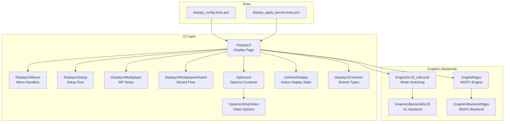
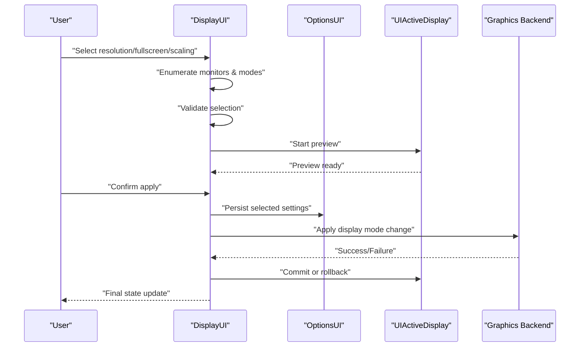
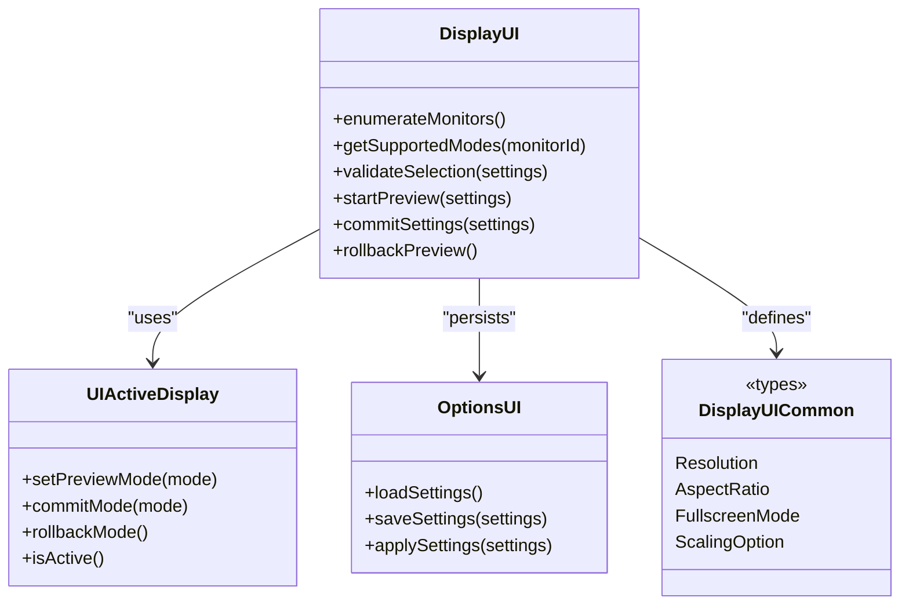
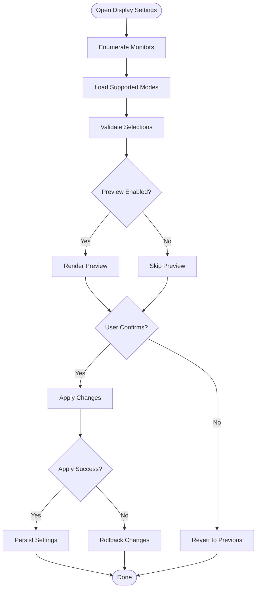
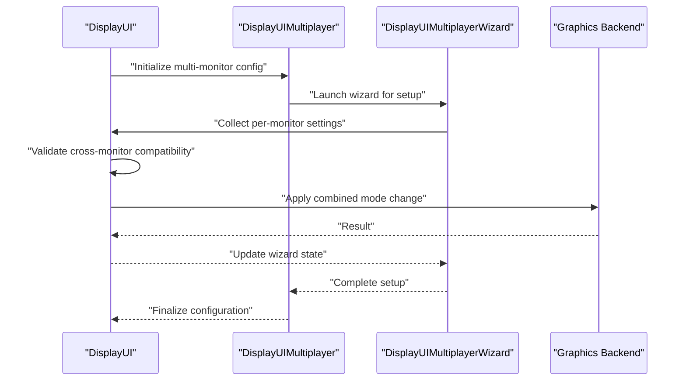
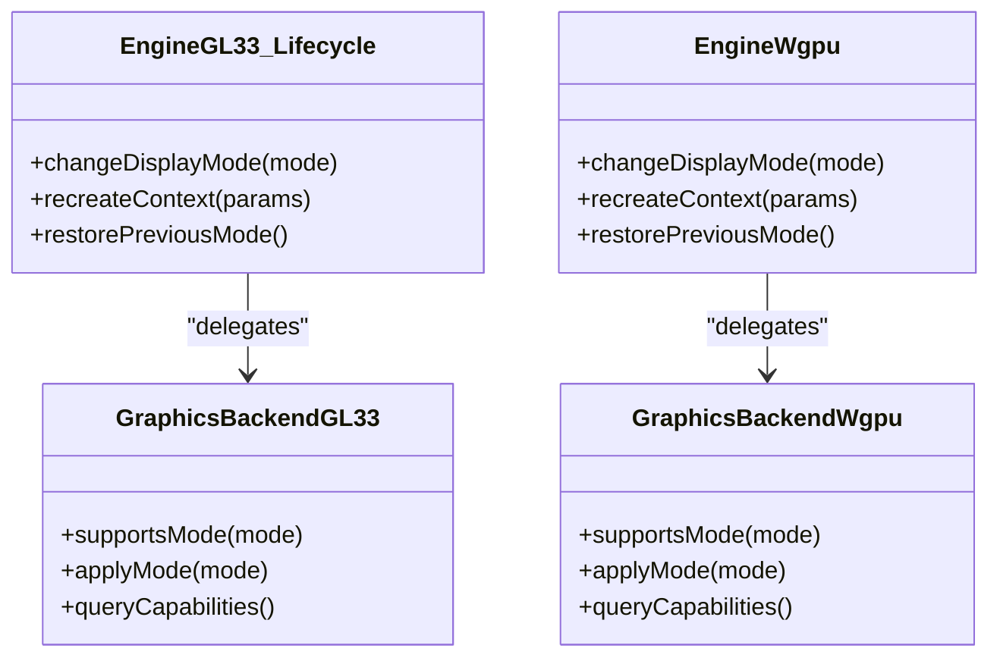
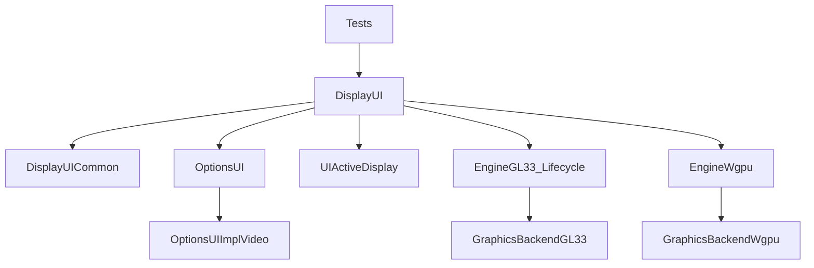

# Display Settings

<cite>
**Referenced Files in This Document**
- [DisplayUI.hpp](file://engine/Poseidon/UI/DisplayUI.hpp)
- [DisplayUI.cpp](file://engine/Poseidon/UI/DisplayUI.cpp)
- [DisplayUIMenus.cpp](file://engine/Poseidon/UI/DisplayUIMenus.cpp)
- [DisplayUISetup.cpp](file://engine/Poseidon/UI/DisplayUISetup.cpp)
- [DisplayUIMultiplayer.cpp](file://engine/Poseidon/UI/DisplayUIMultiplayer.cpp)
- [DisplayUIMultiplayerWizard.cpp](file://engine/Poseidon/UI/DisplayUIMultiplayerWizard.cpp)
- [OptionsUI.hpp](file://engine/Poseidon/UI/OptionsUI.hpp)
- [OptionsUI.cpp](file://engine/Poseidon/UI/OptionsUI.cpp)
- [OptionsUIImplVideo.cpp](file://engine/Poseidon/UI/OptionsUIImplVideo.cpp)
- [UIActiveDisplay.hpp](file://engine/Poseidon/UI/UIActiveDisplay.hpp)
- [DisplayUICommon.hpp](file://engine/Poseidon/UI/DisplayUICommon.hpp)
- [EngineGL33_Lifecycle.cpp](file://engine/PoseidonGL33/EngineGL33_Lifecycle.cpp)
- [GraphicsBackendGL33.cpp](file://engine/PoseidonGL33/GraphicsBackendGL33.cpp)
- [EngineWgpu.cpp](file://engine/WgpuRenderer/EngineWgpu.cpp)
- [GraphicsBackendWgpu.cpp](file://engine/WgpuRenderer/GraphicsBackendWgpu.cpp)
- [display_config.tests.ps1](file://tests/smoke/display_config.tests.ps1)
- [display_apply_persist.tests.ps1](file://tests/smoke/display_apply_persist.tests.ps1)
</cite>

## Table of Contents
1. Introduction
2. Project Structure
3. Core Components
4. Architecture Overview
5. Detailed Component Analysis
6. Dependency Analysis
7. Performance Considerations
8. Troubleshooting Guide
9. Conclusion
10. Appendices

## Introduction
This document explains the Display Settings system used by the application to manage screen resolution, aspect ratio, fullscreen modes, multi-monitor support, and display scaling. It focuses on the DisplayPage implementation for monitor enumeration, mode validation, real-time preview, and safe application of changes. It also provides practical guidance for adding new display options, implementing multi-monitor configurations, handling display mode changes, validating configurations, ensuring hardware compatibility, and troubleshooting common display issues.

## Project Structure
The Display Settings functionality spans UI components, configuration persistence, and graphics backend integration:
- UI layer: Displays and manages display settings via menus and setup screens.
- Options subsystem: Persists and applies display-related options.
- Graphics backends: Apply display mode changes through platform-specific implementations.
- Tests: Validate behavior across different configurations and persistence scenarios.

**Diagram sources**
- [DisplayUI.hpp](file://engine/Poseidon/UI/DisplayUI.hpp)
- [DisplayUIMenus.cpp](file://engine/Poseidon/UI/DisplayUIMenus.cpp)
- [DisplayUISetup.cpp](file://engine/Poseidon/UI/DisplayUISetup.cpp)
- [DisplayUIMultiplayer.cpp](file://engine/Poseidon/UI/DisplayUIMultiplayer.cpp)
- [DisplayUIMultiplayerWizard.cpp](file://engine/Poseidon/UI/DisplayUIMultiplayerWizard.cpp)
- [OptionsUI.hpp](file://engine/Poseidon/UI/OptionsUI.hpp)
- [OptionsUI.cpp](file://engine/Poseidon/UI/OptionsUI.cpp)
- [OptionsUIImplVideo.cpp](file://engine/Poseidon/UI/OptionsUIImplVideo.cpp)
- [UIActiveDisplay.hpp](file://engine/Poseidon/UI/UIActiveDisplay.hpp)
- [DisplayUICommon.hpp](file://engine/Poseidon/UI/DisplayUICommon.hpp)
- [EngineGL33_Lifecycle.cpp](file://engine/PoseidonGL33/EngineGL33_Lifecycle.cpp)
- [GraphicsBackendGL33.cpp](file://engine/PoseidonGL33/GraphicsBackendGL33.cpp)
- [EngineWgpu.cpp](file://engine/WgpuRenderer/EngineWgpu.cpp)
- [GraphicsBackendWgpu.cpp](file://engine/WgpuRenderer/GraphicsBackendWgpu.cpp)
- [display_config.tests.ps1](file://tests/smoke/display_config.tests.ps1)
- [display_apply_persist.tests.ps1](file://tests/smoke/display_apply_persist.tests.ps1)

**Section sources**
- [DisplayUI.hpp](file://engine/Poseidon/UI/DisplayUI.hpp)
- [DisplayUI.cpp](file://engine/Poseidon/UI/DisplayUI.cpp)
- [DisplayUIMenus.cpp](file://engine/Poseidon/UI/DisplayUIMenus.cpp)
- [DisplayUISetup.cpp](file://engine/Poseidon/UI/DisplayUISetup.cpp)
- [DisplayUIMultiplayer.cpp](file://engine/Poseidon/UI/DisplayUIMultiplayer.cpp)
- [DisplayUIMultiplayerWizard.cpp](file://engine/Poseidon/UI/DisplayUIMultiplayerWizard.cpp)
- [OptionsUI.hpp](file://engine/Poseidon/UI/OptionsUI.hpp)
- [OptionsUI.cpp](file://engine/Poseidon/UI/OptionsUI.cpp)
- [OptionsUIImplVideo.cpp](file://engine/Poseidon/UI/OptionsUIImplVideo.cpp)
- [UIActiveDisplay.hpp](file://engine/Poseidon/UI/UIActiveDisplay.hpp)
- [DisplayUICommon.hpp](file://engine/Poseidon/UI/DisplayUICommon.hpp)
- [EngineGL33_Lifecycle.cpp](file://engine/PoseidonGL33/EngineGL33_Lifecycle.cpp)
- [GraphicsBackendGL33.cpp](file://engine/PoseidonGL33/GraphicsBackendGL33.cpp)
- [EngineWgpu.cpp](file://engine/WgpuRenderer/EngineWgpu.cpp)
- [GraphicsBackendWgpu.cpp](file://engine/WgpuRenderer/GraphicsBackendWgpu.cpp)
- [display_config.tests.ps1](file://tests/smoke/display_config.tests.ps1)
- [display_apply_persist.tests.ps1](file://tests/smoke/display_apply_persist.tests.ps1)

## Core Components
- DisplayUI: Central UI component that enumerates monitors, lists available display modes, validates selections, and previews changes before applying them.
- DisplayUIMenus: Menu handlers for navigating display settings and triggering apply/preview actions.
- DisplayUISetup: Setup flow orchestrating initial display configuration and user confirmation.
- DisplayUIMultiplayer / DisplayUIMultiplayerWizard: Multiplayer-specific display configuration flows.
- OptionsUI / OptionsUIImplVideo: Persistence and application of video/display options.
- UIActiveDisplay: Tracks active display state during transitions and previews.
- DisplayUICommon: Shared types and utilities for display settings (resolution, aspect ratio, fullscreen modes, scaling).
- Graphics Backends (GL33/WGPU): Implement actual display mode switching and rendering context updates.

Key responsibilities:
- Monitor enumeration and identification.
- Mode listing with resolution, refresh rate, and format details.
- Validation against hardware capabilities and driver constraints.
- Real-time preview without committing changes until confirmed.
- Safe rollback on failure or invalid configuration.
- Multi-monitor awareness and per-monitor settings where applicable.

**Section sources**
- [DisplayUI.hpp](file://engine/Poseidon/UI/DisplayUI.hpp)
- [DisplayUI.cpp](file://engine/Poseidon/UI/DisplayUI.cpp)
- [DisplayUIMenus.cpp](file://engine/Poseidon/UI/DisplayUIMenus.cpp)
- [DisplayUISetup.cpp](file://engine/Poseidon/UI/DisplayUISetup.cpp)
- [DisplayUIMultiplayer.cpp](file://engine/Poseidon/UI/DisplayUIMultiplayer.cpp)
- [DisplayUIMultiplayerWizard.cpp](file://engine/Poseidon/UI/DisplayUIMultiplayerWizard.cpp)
- [OptionsUI.hpp](file://engine/Poseidon/UI/OptionsUI.hpp)
- [OptionsUI.cpp](file://engine/Poseidon/UI/OptionsUI.cpp)
- [OptionsUIImplVideo.cpp](file://engine/Poseidon/UI/OptionsUIImplVideo.cpp)
- [UIActiveDisplay.hpp](file://engine/Poseidon/UI/UIActiveDisplay.hpp)
- [DisplayUICommon.hpp](file://engine/Poseidon/UI/DisplayUICommon.hpp)

## Architecture Overview
The Display Settings architecture separates UI orchestration from backend operations:
- UI layer handles user interactions, validation feedback, and preview rendering.
- Options subsystem persists settings and coordinates application.
- Graphics backends perform low-level display mode changes and context recreation.

**Diagram sources**
- [DisplayUI.hpp](file://engine/Poseidon/UI/DisplayUI.hpp)
- [DisplayUI.cpp](file://engine/Poseidon/UI/DisplayUI.cpp)
- [OptionsUI.hpp](file://engine/Poseidon/UI/OptionsUI.hpp)
- [OptionsUI.cpp](file://engine/Poseidon/UI/OptionsUI.cpp)
- [UIActiveDisplay.hpp](file://engine/Poseidon/UI/UIActiveDisplay.hpp)
- [EngineGL33_Lifecycle.cpp](file://engine/PoseidonGL33/EngineGL33_Lifecycle.cpp)
- [GraphicsBackendGL33.cpp](file://engine/PoseidonGL33/GraphicsBackendGL33.cpp)
- [EngineWgpu.cpp](file://engine/WgpuRenderer/EngineWgpu.cpp)
- [GraphicsBackendWgpu.cpp](file://engine/WgpuRenderer/GraphicsBackendWgpu.cpp)

## Detailed Component Analysis

### DisplayUI Implementation
DisplayUI is responsible for:
- Enumerating monitors and their supported modes.
- Filtering modes based on current hardware/driver capabilities.
- Providing a preview mechanism to show the selected mode without committing.
- Validating combinations of resolution, aspect ratio, fullscreen mode, and scaling.
- Coordinating with OptionsUI to persist changes and with backends to apply them.

**Diagram sources**
- [DisplayUI.hpp](file://engine/Poseidon/UI/DisplayUI.hpp)
- [DisplayUI.cpp](file://engine/Poseidon/UI/DisplayUI.cpp)
- [UIActiveDisplay.hpp](file://engine/Poseidon/UI/UIActiveDisplay.hpp)
- [OptionsUI.hpp](file://engine/Poseidon/UI/OptionsUI.hpp)
- [OptionsUI.cpp](file://engine/Poseidon/UI/OptionsUI.cpp)
- [DisplayUICommon.hpp](file://engine/Poseidon/UI/DisplayUICommon.hpp)

**Section sources**
- [DisplayUI.hpp](file://engine/Poseidon/UI/DisplayUI.hpp)
- [DisplayUI.cpp](file://engine/Poseidon/UI/DisplayUI.cpp)
- [UIActiveDisplay.hpp](file://engine/Poseidon/UI/UIActiveDisplay.hpp)
- [OptionsUI.hpp](file://engine/Poseidon/UI/OptionsUI.hpp)
- [OptionsUI.cpp](file://engine/Poseidon/UI/OptionsUI.cpp)
- [DisplayUICommon.hpp](file://engine/Poseidon/UI/DisplayUICommon.hpp)

### DisplayUIMenus and DisplayUISetup
- DisplayUIMenus: Provides menu-driven navigation for display settings, triggers validation and preview workflows, and handles user confirmations.
- DisplayUISetup: Orchestrates initial display configuration, including detecting primary monitor, suggesting compatible modes, and guiding users through multi-monitor setups.

**Diagram sources**
- [DisplayUIMenus.cpp](file://engine/Poseidon/UI/DisplayUIMenus.cpp)
- [DisplayUISetup.cpp](file://engine/Poseidon/UI/DisplayUISetup.cpp)

**Section sources**
- [DisplayUIMenus.cpp](file://engine/Poseidon/UI/DisplayUIMenus.cpp)
- [DisplayUISetup.cpp](file://engine/Poseidon/UI/DisplayUISetup.cpp)

### Multi-Monitor Support
Multi-monitor support involves:
- Detecting multiple displays and identifying primary vs. secondary monitors.
- Allowing per-monitor resolution and scaling settings where applicable.
- Handling mode changes across all monitors atomically when required.
- Ensuring consistent fullscreen behavior across monitors.

**Diagram sources**
- [DisplayUIMultiplayer.cpp](file://engine/Poseidon/UI/DisplayUIMultiplayer.cpp)
- [DisplayUIMultiplayerWizard.cpp](file://engine/Poseidon/UI/DisplayUIMultiplayerWizard.cpp)
- [DisplayUI.hpp](file://engine/Poseidon/UI/DisplayUI.hpp)
- [EngineGL33_Lifecycle.cpp](file://engine/PoseidonGL33/EngineGL33_Lifecycle.cpp)
- [EngineWgpu.cpp](file://engine/WgpuRenderer/EngineWgpu.cpp)

**Section sources**
- [DisplayUIMultiplayer.cpp](file://engine/Poseidon/UI/DisplayUIMultiplayer.cpp)
- [DisplayUIMultiplayerWizard.cpp](file://engine/Poseidon/UI/DisplayUIMultiplayerWizard.cpp)
- [DisplayUI.hpp](file://engine/Poseidon/UI/DisplayUI.hpp)

### Graphics Backend Integration
Display mode changes are applied through graphics backends:
- GL33 backend uses lifecycle methods to recreate rendering contexts with new display parameters.
- WGPU backend follows similar patterns with its engine and backend abstractions.
- Both backends must handle failures gracefully and support rollback mechanisms.

**Diagram sources**
- [EngineGL33_Lifecycle.cpp](file://engine/PoseidonGL33/EngineGL33_Lifecycle.cpp)
- [GraphicsBackendGL33.cpp](file://engine/PoseidonGL33/GraphicsBackendGL33.cpp)
- [EngineWgpu.cpp](file://engine/WgpuRenderer/EngineWgpu.cpp)
- [GraphicsBackendWgpu.cpp](file://engine/WgpuRenderer/GraphicsBackendWgpu.cpp)

**Section sources**
- [EngineGL33_Lifecycle.cpp](file://engine/PoseidonGL33/EngineGL33_Lifecycle.cpp)
- [GraphicsBackendGL33.cpp](file://engine/PoseidonGL33/GraphicsBackendGL33.cpp)
- [EngineWgpu.cpp](file://engine/WgpuRenderer/EngineWgpu.cpp)
- [GraphicsBackendWgpu.cpp](file://engine/WgpuRenderer/GraphicsBackendWgpu.cpp)

## Dependency Analysis
The Display Settings system has clear dependency boundaries:
- UI components depend on shared types and options persistence.
- Options subsystem depends on configuration storage and validation logic.
- Graphics backends are abstracted behind engine interfaces.
- Tests validate end-to-end behavior of configuration and persistence.

**Diagram sources**
- [DisplayUI.hpp](file://engine/Poseidon/UI/DisplayUI.hpp)
- [DisplayUICommon.hpp](file://engine/Poseidon/UI/DisplayUICommon.hpp)
- [OptionsUI.hpp](file://engine/Poseidon/UI/OptionsUI.hpp)
- [OptionsUIImplVideo.cpp](file://engine/Poseidon/UI/OptionsUIImplVideo.cpp)
- [UIActiveDisplay.hpp](file://engine/Poseidon/UI/UIActiveDisplay.hpp)
- [EngineGL33_Lifecycle.cpp](file://engine/PoseidonGL33/EngineGL33_Lifecycle.cpp)
- [GraphicsBackendGL33.cpp](file://engine/PoseidonGL33/GraphicsBackendGL33.cpp)
- [EngineWgpu.cpp](file://engine/WgpuRenderer/EngineWgpu.cpp)
- [GraphicsBackendWgpu.cpp](file://engine/WgpuRenderer/GraphicsBackendWgpu.cpp)
- [display_config.tests.ps1](file://tests/smoke/display_config.tests.ps1)
- [display_apply_persist.tests.ps1](file://tests/smoke/display_apply_persist.tests.ps1)

**Section sources**
- [DisplayUI.hpp](file://engine/Poseidon/UI/DisplayUI.hpp)
- [DisplayUICommon.hpp](file://engine/Poseidon/UI/DisplayUICommon.hpp)
- [OptionsUI.hpp](file://engine/Poseidon/UI/OptionsUI.hpp)
- [OptionsUIImplVideo.cpp](file://engine/Poseidon/UI/OptionsUIImplVideo.cpp)
- [UIActiveDisplay.hpp](file://engine/Poseidon/UI/UIActiveDisplay.hpp)
- [EngineGL33_Lifecycle.cpp](file://engine/PoseidonGL33/EngineGL33_Lifecycle.cpp)
- [GraphicsBackendGL33.cpp](file://engine/PoseidonGL33/GraphicsBackendGL33.cpp)
- [EngineWgpu.cpp](file://engine/WgpuRenderer/EngineWgpu.cpp)
- [GraphicsBackendWgpu.cpp](file://engine/WgpuRenderer/GraphicsBackendWgpu.cpp)
- [display_config.tests.ps1](file://tests/smoke/display_config.tests.ps1)
- [display_apply_persist.tests.ps1](file://tests/smoke/display_apply_persist.tests.ps1)

## Performance Considerations
- Avoid frequent mode enumeration during runtime; cache results when possible.
- Use asynchronous operations for heavy validation tasks to keep UI responsive.
- Minimize context recreation overhead by batching display changes.
- Implement efficient preview rendering that doesn't block main thread.
- Handle high-DPI scaling carefully to avoid unnecessary reflows.

[No sources needed since this section provides general guidance]

## Troubleshooting Guide
Common display-related issues and resolutions:
- Invalid resolution or refresh rate: Verify hardware capabilities and driver support.
- Fullscreen mode failures: Check exclusive fullscreen requirements and windowed alternatives.
- Multi-monitor inconsistencies: Ensure atomic mode changes and verify per-monitor settings.
- Scaling artifacts: Adjust scaling options and test with different DPI settings.
- Persistent configuration errors: Review saved settings and reset to defaults if corrupted.

Validation strategies:
- Pre-validate all user selections against known good sets.
- Provide clear error messages indicating unsupported combinations.
- Log detailed information about failed mode changes for debugging.
- Implement automatic fallback to last known good configuration.

**Section sources**
- [display_config.tests.ps1](file://tests/smoke/display_config.tests.ps1)
- [display_apply_persist.tests.ps1](file://tests/smoke/display_apply_persist.tests.ps1)

## Conclusion
The Display Settings system provides a robust framework for managing display configurations across single and multi-monitor setups. Through careful separation of concerns between UI, options persistence, and graphics backends, it ensures reliable mode changes with preview capabilities and safe rollback mechanisms. The modular design facilitates extension for new display options and supports various graphics backends while maintaining consistent user experience.

[No sources needed since this section summarizes without analyzing specific files]

## Appendices

### Practical Examples

#### Adding New Display Options
To add new display options:
1. Extend DisplayUICommon types to include the new option.
2. Update DisplayUI validation logic to handle the new option.
3. Modify OptionsUI persistence to save/load the new setting.
4. Update graphics backends to support the new option in mode changes.
5. Add tests to validate the new functionality.

#### Implementing Multi-Monitor Configurations
For multi-monitor support:
1. Enhance monitor enumeration to detect additional displays.
2. Implement per-monitor setting storage and retrieval.
3. Coordinate atomic mode changes across all monitors.
4. Handle edge cases like disconnected monitors during runtime.
5. Provide user interface for per-monitor configuration.

#### Handling Display Mode Changes
Best practices for mode changes:
1. Always validate before applying changes.
2. Use preview mode to allow user confirmation.
3. Implement rollback mechanisms for failed changes.
4. Handle platform-specific limitations gracefully.
5. Provide clear feedback to users about change status.

[No sources needed since this section provides general guidance]