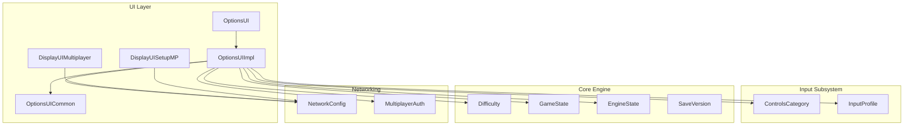
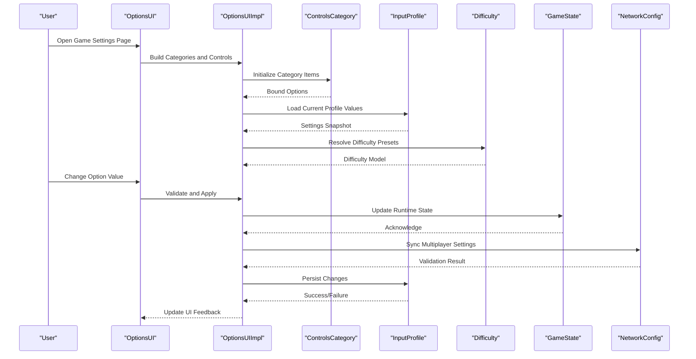
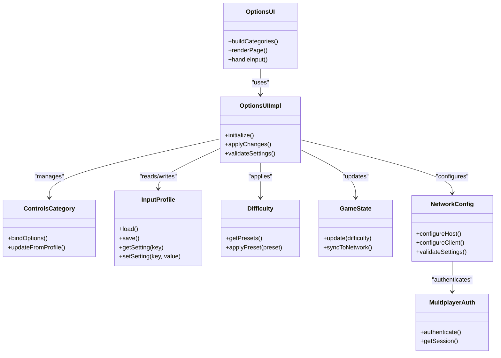

# Game Settings

<cite>
**Referenced Files in This Document**
- [OptionsUI.hpp](file://engine/Poseidon/UI/OptionsUI.hpp)
- [OptionsUI.cpp](file://engine/Poseidon/UI/OptionsUI.cpp)
- [OptionsUIImpl.cpp](file://engine/Poseidon/UI/OptionsUIImpl.cpp)
- [OptionsUICommon.hpp](file://engine/Poseidon/UI/OptionsUICommon.hpp)
- [ControlsCategory.hpp](file://engine/Poseidon/Input/ControlsCategory.hpp)
- [ControlsCategory.cpp](file://engine/Poseidon/Input/ControlsCategory.cpp)
- [InputProfile.hpp](file://engine/Poseidon/Input/InputProfile.hpp)
- [InputProfile.cpp](file://engine/Poseidon/Input/InputProfile.cpp)
- [Difficulty.hpp](file://engine/Poseidon/Core/Difficulty.hpp)
- [GameState.cpp](file://engine/Poseidon/Core/GameState.cpp)
- [EngineState.hpp](file://engine/Poseidon/Core/EngineState.hpp)
- [NetworkConfig.hpp](file://engine/Poseidon/Network/NetworkConfig.hpp)
- [NetworkConfig.cpp](file://engine/Poseidon/Network/NetworkConfig.cpp)
- [MultiplayerAuth.hpp](file://engine/Poseidon/Network/MultiplayerAuth.hpp)
- [DisplayUIMultiplayer.cpp](file://engine/Poseidon/UI/DisplayUIMultiplayer.cpp)
- [DisplayUISetupMP.cpp](file://engine/Poseidon/UI/DisplayUISetupMP.cpp)
- [SaveVersion.hpp](file://engine/Poseidon/Core/SaveVersion.hpp)
</cite>

## Table of Contents
1. [Introduction](#introduction)
2. [Project Structure](#project-structure)
3. [Core Components](#core-components)
4. [Architecture Overview](#architecture-overview)
5. [Detailed Component Analysis](#detailed-component-analysis)
6. [Dependency Analysis](#dependency-analysis)
7. [Performance Considerations](#performance-considerations)
8. [Troubleshooting Guide](#troubleshooting-guide)
9. [Conclusion](#conclusion)
10. [Appendices](#appendices)

## Introduction
This document explains the Game Settings subsystem, focusing on gameplay-related configuration options such as difficulty settings, game mechanics toggles, save game preferences, and multiplayer settings. It details how the GamePage organizes options into categories, enforces conditional visibility, and validates user input. It also provides guidance for adding new gameplay options, implementing difficulty systems, and synchronizing game state across clients and servers.

## Project Structure
The Game Settings subsystem spans UI, input profiles, core engine state, and networking layers:
- UI layer: Options UI framework and category implementations
- Input subsystem: Controls categories and profile persistence
- Core engine: Difficulty definitions and global engine/game state
- Networking: Multiplayer configuration and authentication
- Save system: Versioning and compatibility for persisted settings

**Diagram sources**
- [OptionsUI.hpp](file://engine/Poseidon/UI/OptionsUI.hpp)
- [OptionsUIImpl.cpp](file://engine/Poseidon/UI/OptionsUIImpl.cpp)
- [OptionsUICommon.hpp](file://engine/Poseidon/UI/OptionsUICommon.hpp)
- [ControlsCategory.hpp](file://engine/Poseidon/Input/ControlsCategory.hpp)
- [InputProfile.hpp](file://engine/Poseidon/Input/InputProfile.hpp)
- [Difficulty.hpp](file://engine/Poseidon/Core/Difficulty.hpp)
- [GameState.cpp](file://engine/Poseidon/Core/GameState.cpp)
- [EngineState.hpp](file://engine/Poseidon/Core/EngineState.hpp)
- [NetworkConfig.hpp](file://engine/Poseidon/Network/NetworkConfig.hpp)
- [MultiplayerAuth.hpp](file://engine/Poseidon/Network/MultiplayerAuth.hpp)
- [DisplayUIMultiplayer.cpp](file://engine/Poseidon/UI/DisplayUIMultiplayer.cpp)
- [DisplayUISetupMP.cpp](file://engine/Poseidon/UI/DisplayUISetupMP.cpp)
- [SaveVersion.hpp](file://engine/Poseidon/Core/SaveVersion.hpp)

**Section sources**
- [OptionsUI.hpp](file://engine/Poseidon/UI/OptionsUI.hpp)
- [OptionsUIImpl.cpp](file://engine/Poseidon/UI/OptionsUIImpl.cpp)
- [OptionsUICommon.hpp](file://engine/Poseidon/UI/OptionsUICommon.hpp)
- [ControlsCategory.hpp](file://engine/Poseidon/Input/ControlsCategory.hpp)
- [InputProfile.hpp](file://engine/Poseidon/Input/InputProfile.hpp)
- [Difficulty.hpp](file://engine/Poseidon/Core/Difficulty.hpp)
- [GameState.cpp](file://engine/Poseidon/Core/GameState.cpp)
- [EngineState.hpp](file://engine/Poseidon/Core/EngineState.hpp)
- [NetworkConfig.hpp](file://engine/Poseidon/Network/NetworkConfig.hpp)
- [MultiplayerAuth.hpp](file://engine/Poseidon/Network/MultiplayerAuth.hpp)
- [DisplayUIMultiplayer.cpp](file://engine/Poseidon/UI/DisplayUIMultiplayer.cpp)
- [DisplayUISetupMP.cpp](file://engine/Poseidon/UI/DisplayUISetupMP.cpp)
- [SaveVersion.hpp](file://engine/Poseidon/Core/SaveVersion.hpp)

## Core Components
- Options UI Framework: Provides the base infrastructure for rendering option pages, categories, and controls.
- Controls Category: Groups related input options and binds them to an input profile.
- Input Profile: Persists and applies user-defined control mappings and related gameplay toggles.
- Difficulty System: Centralized definition and application of difficulty presets affecting gameplay mechanics.
- Game State: Global runtime state that reflects current gameplay configuration and is synchronized where applicable.
- Network Configuration: Manages multiplayer settings, including host/client roles, matchmaking, and authentication.
- Save Versioning: Ensures compatibility when persisting settings across versions.

Key responsibilities:
- Rendering and organizing options into logical categories
- Validating inputs and enforcing constraints
- Persisting changes to profiles or configuration files
- Synchronizing multiplayer-relevant settings with network components

**Section sources**
- [OptionsUI.hpp](file://engine/Poseidon/UI/OptionsUI.hpp)
- [OptionsUIImpl.cpp](file://engine/Poseidon/UI/OptionsUIImpl.cpp)
- [OptionsUICommon.hpp](file://engine/Poseidon/UI/OptionsUICommon.hpp)
- [ControlsCategory.hpp](file://engine/Poseidon/Input/ControlsCategory.hpp)
- [InputProfile.hpp](file://engine/Poseidon/Input/InputProfile.hpp)
- [Difficulty.hpp](file://engine/Poseidon/Core/Difficulty.hpp)
- [GameState.cpp](file://engine/Poseidon/Core/GameState.cpp)
- [EngineState.hpp](file://engine/Poseidon/Core/EngineState.hpp)
- [NetworkConfig.hpp](file://engine/Poseidon/Network/NetworkConfig.hpp)
- [MultiplayerAuth.hpp](file://engine/Poseidon/Network/MultiplayerAuth.hpp)
- [SaveVersion.hpp](file://engine/Poseidon/Core/SaveVersion.hpp)

## Architecture Overview
The Game Settings architecture separates concerns between UI presentation, data persistence, and runtime state synchronization:
- UI layer composes categories and controls, handles user interactions, and triggers validation and persistence.
- Data layer (profiles/configs) stores settings and exposes getters/setters for consistent access.
- Runtime state reflects applied settings and is updated by the UI or other subsystems.
- Networking layer ensures multiplayer settings are validated and synchronized with peers.

**Diagram sources**
- [OptionsUI.hpp](file://engine/Poseidon/UI/OptionsUI.hpp)
- [OptionsUIImpl.cpp](file://engine/Poseidon/UI/OptionsUIImpl.cpp)
- [ControlsCategory.hpp](file://engine/Poseidon/Input/ControlsCategory.hpp)
- [InputProfile.hpp](file://engine/Poseidon/Input/InputProfile.hpp)
- [Difficulty.hpp](file://engine/Poseidon/Core/Difficulty.hpp)
- [GameState.cpp](file://engine/Poseidon/Core/GameState.cpp)
- [NetworkConfig.hpp](file://engine/Poseidon/Network/NetworkConfig.hpp)

**Section sources**
- [OptionsUI.hpp](file://engine/Poseidon/UI/OptionsUI.hpp)
- [OptionsUIImpl.cpp](file://engine/Poseidon/UI/OptionsUIImpl.cpp)
- [ControlsCategory.hpp](file://engine/Poseidon/Input/ControlsCategory.hpp)
- [InputProfile.hpp](file://engine/Poseidon/Input/InputProfile.hpp)
- [Difficulty.hpp](file://engine/Poseidon/Core/Difficulty.hpp)
- [GameState.cpp](file://engine/Poseidon/Core/GameState.cpp)
- [NetworkConfig.hpp](file://engine/Poseidon/Network/NetworkConfig.hpp)

## Detailed Component Analysis

### Options UI Framework and GamePage Organization
- The Options UI framework defines the structure for option pages and categories.
- GamePage organizes gameplay options into logical sections (e.g., Gameplay, Graphics, Audio, Controls).
- Conditional visibility allows hiding or showing options based on context (e.g., single-player vs multiplayer).
- Validation rules ensure values are within acceptable ranges and compatible with each other.

Implementation highlights:
- Category registration and lifecycle management
- Control binding to underlying data sources
- Event-driven updates for UI consistency

**Section sources**
- [OptionsUI.hpp](file://engine/Poseidon/UI/OptionsUI.hpp)
- [OptionsUIImpl.cpp](file://engine/Poseidon/UI/OptionsUIImpl.cpp)
- [OptionsUICommon.hpp](file://engine/Poseidon/UI/OptionsUICommon.hpp)

### Controls Category and Input Profiles
- ControlsCategory groups related input bindings and gameplay toggles.
- InputProfile persists user configurations and applies them at runtime.
- Binding resolution maps UI controls to engine actions.

Data flow:
- UI reads from InputProfile
- User changes trigger validation and apply to runtime state
- Changes are saved back to profile storage

**Section sources**
- [ControlsCategory.hpp](file://engine/Poseidon/Input/ControlsCategory.hpp)
- [ControlsCategory.cpp](file://engine/Poseidon/Input/ControlsCategory.cpp)
- [InputProfile.hpp](file://engine/Poseidon/Input/InputProfile.hpp)
- [InputProfile.cpp](file://engine/Poseidon/Input/InputProfile.cpp)

### Difficulty System
- Difficulty defines presets that affect AI behavior, resource availability, and mission parameters.
- The system centralizes difficulty logic to ensure consistency across gameplay features.
- UI presents difficulty options with clear descriptions and previews.

Application:
- Difficulty selection updates GameState and relevant subsystems
- Persistence ensures difficulty preference survives sessions

**Section sources**
- [Difficulty.hpp](file://engine/Poseidon/Core/Difficulty.hpp)
- [GameState.cpp](file://engine/Poseidon/Core/GameState.cpp)

### Game State Synchronization
- GameState holds current runtime configuration and is updated by UI or other subsystems.
- For multiplayer, critical settings must be synchronized to maintain consistency across clients.
- EngineState provides global flags and modes that influence settings behavior.

Synchronization strategy:
- Validate settings before applying
- Broadcast changes to network peers when required
- Handle conflicts and rollback invalid states

**Section sources**
- [GameState.cpp](file://engine/Poseidon/Core/GameState.cpp)
- [EngineState.hpp](file://engine/Poseidon/Core/EngineState.hpp)

### Multiplayer Settings and Authentication
- NetworkConfig manages host/client roles, matchmaking, and connection parameters.
- MultiplayerAuth handles authentication flows and session management.
- UI components provide dedicated screens for multiplayer setup and configuration.

Validation and sync:
- Enforce server policies and client capabilities
- Ensure consistent settings across connected players
- Provide feedback on connection and authentication status

**Section sources**
- [NetworkConfig.hpp](file://engine/Poseidon/Network/NetworkConfig.hpp)
- [NetworkConfig.cpp](file://engine/Poseidon/Network/NetworkConfig.cpp)
- [MultiplayerAuth.hpp](file://engine/Poseidon/Network/MultiplayerAuth.hpp)
- [DisplayUIMultiplayer.cpp](file://engine/Poseidon/UI/DisplayUIMultiplayer.cpp)
- [DisplayUISetupMP.cpp](file://engine/Poseidon/UI/DisplayUISetupMP.cpp)

### Save Game Preferences and Versioning
- SaveVersion ensures settings compatibility across game versions.
- Migration logic handles schema changes and default value assignments.
- Persistence layer writes and loads settings reliably.

Best practices:
- Increment version on schema changes
- Provide migration paths for old configurations
- Validate loaded settings against current schema

**Section sources**
- [SaveVersion.hpp](file://engine/Poseidon/Core/SaveVersion.hpp)

## Dependency Analysis
The following diagram illustrates key dependencies between components involved in Game Settings:

**Diagram sources**
- [OptionsUI.hpp](file://engine/Poseidon/UI/OptionsUI.hpp)
- [OptionsUIImpl.cpp](file://engine/Poseidon/UI/OptionsUIImpl.cpp)
- [ControlsCategory.hpp](file://engine/Poseidon/Input/ControlsCategory.hpp)
- [InputProfile.hpp](file://engine/Poseidon/Input/InputProfile.hpp)
- [Difficulty.hpp](file://engine/Poseidon/Core/Difficulty.hpp)
- [GameState.cpp](file://engine/Poseidon/Core/GameState.cpp)
- [NetworkConfig.hpp](file://engine/Poseidon/Network/NetworkConfig.hpp)
- [MultiplayerAuth.hpp](file://engine/Poseidon/Network/MultiplayerAuth.hpp)

**Section sources**
- [OptionsUI.hpp](file://engine/Poseidon/UI/OptionsUI.hpp)
- [OptionsUIImpl.cpp](file://engine/Poseidon/UI/OptionsUIImpl.cpp)
- [ControlsCategory.hpp](file://engine/Poseidon/Input/ControlsCategory.hpp)
- [InputProfile.hpp](file://engine/Poseidon/Input/InputProfile.hpp)
- [Difficulty.hpp](file://engine/Poseidon/Core/Difficulty.hpp)
- [GameState.cpp](file://engine/Poseidon/Core/GameState.cpp)
- [NetworkConfig.hpp](file://engine/Poseidon/Network/NetworkConfig.hpp)
- [MultiplayerAuth.hpp](file://engine/Poseidon/Network/MultiplayerAuth.hpp)

## Performance Considerations
- Minimize UI rebuilds by caching category layouts and control states
- Defer expensive validations until necessary (e.g., on apply rather than every change)
- Batch persistence operations to reduce disk I/O
- Avoid frequent network broadcasts; coalesce multiplayer setting updates
- Use efficient data structures for profile lookups and updates

[No sources needed since this section provides general guidance]

## Troubleshooting Guide
Common issues and resolutions:
- Invalid settings rejected: Check validation rules and range constraints
- Settings not persisting: Verify file permissions and save path accessibility
- Multiplayer desync: Ensure all clients have identical settings; check server policy enforcement
- Difficulty not applied: Confirm GameState update and dependent subsystem notifications
- Profile corruption: Use versioning and migration tools to recover defaults

Debugging steps:
- Enable detailed logging for OptionsUI and InputProfile
- Inspect NetworkConfig validation logs for multiplayer issues
- Compare saved profiles against expected schemas using SaveVersion

**Section sources**
- [OptionsUIImpl.cpp](file://engine/Poseidon/UI/OptionsUIImpl.cpp)
- [InputProfile.cpp](file://engine/Poseidon/Input/InputProfile.cpp)
- [NetworkConfig.cpp](file://engine/Poseidon/Network/NetworkConfig.cpp)
- [SaveVersion.hpp](file://engine/Poseidon/Core/SaveVersion.hpp)

## Conclusion
The Game Settings subsystem provides a robust framework for managing gameplay configurations through a well-structured UI, persistent profiles, centralized difficulty management, and synchronized multiplayer settings. By following the patterns outlined here, developers can extend the system with new options, implement complex difficulty models, and ensure reliable state synchronization across platforms and networks.

[No sources needed since this section summarizes without analyzing specific files]

## Appendices

### Adding New Gameplay Options
Steps to add a new option:
1. Define the option in the appropriate category (e.g., ControlsCategory)
2. Bind the UI control to the underlying data source (InputProfile or GameState)
3. Implement validation rules to enforce constraints
4. Add persistence support if the option should survive sessions
5. For multiplayer-relevant options, integrate with NetworkConfig for synchronization

Example references:
- Category implementation pattern: [ControlsCategory.hpp](file://engine/Poseidon/Input/ControlsCategory.hpp)
- Profile binding pattern: [InputProfile.hpp](file://engine/Poseidon/Input/InputProfile.hpp)
- Validation and apply logic: [OptionsUIImpl.cpp](file://engine/Poseidon/UI/OptionsUIImpl.cpp)

**Section sources**
- [ControlsCategory.hpp](file://engine/Poseidon/Input/ControlsCategory.hpp)
- [InputProfile.hpp](file://engine/Poseidon/Input/InputProfile.hpp)
- [OptionsUIImpl.cpp](file://engine/Poseidon/UI/OptionsUIImpl.cpp)

### Implementing Difficulty Systems
Approach:
- Define difficulty presets with clear semantics
- Centralize difficulty effects in a dedicated module
- Update GameState and notify dependent subsystems
- Provide UI feedback for difficulty changes

References:
- Difficulty model: [Difficulty.hpp](file://engine/Poseidon/Core/Difficulty.hpp)
- State updates: [GameState.cpp](file://engine/Poseidon/Core/GameState.cpp)

**Section sources**
- [Difficulty.hpp](file://engine/Poseidon/Core/Difficulty.hpp)
- [GameState.cpp](file://engine/Poseidon/Core/GameState.cpp)

### Handling Game State Synchronization
Guidelines:
- Validate settings before broadcasting
- Use event-driven updates to minimize redundant messages
- Handle conflicts gracefully with rollback mechanisms
- Log synchronization failures for debugging

References:
- State synchronization: [GameState.cpp](file://engine/Poseidon/Core/GameState.cpp)
- Network configuration: [NetworkConfig.hpp](file://engine/Poseidon/Network/NetworkConfig.hpp)

**Section sources**
- [GameState.cpp](file://engine/Poseidon/Core/GameState.cpp)
- [NetworkConfig.hpp](file://engine/Poseidon/Network/NetworkConfig.hpp)