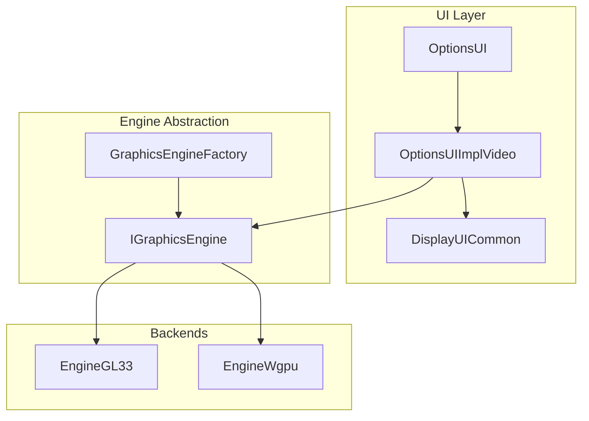
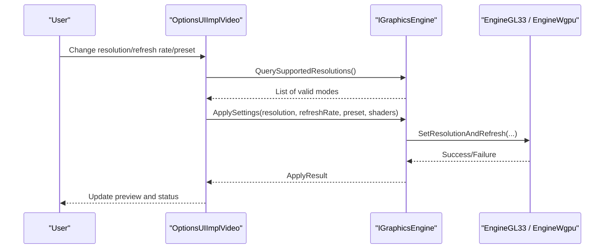
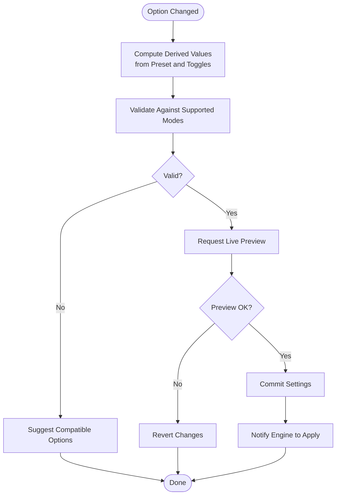
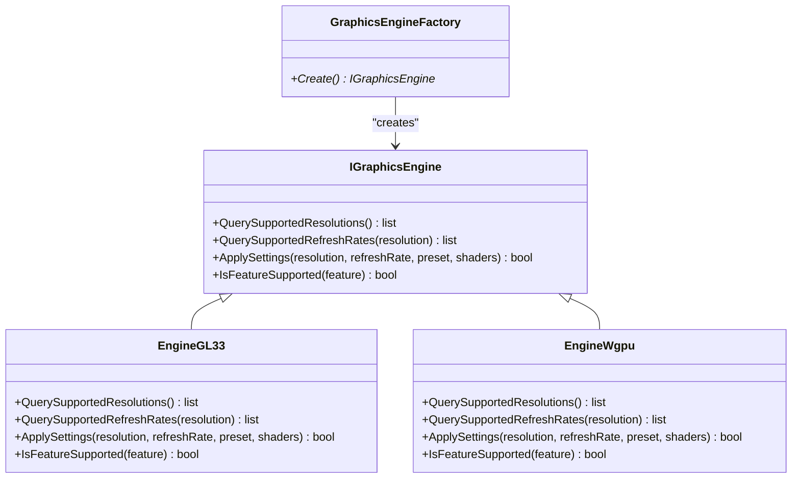
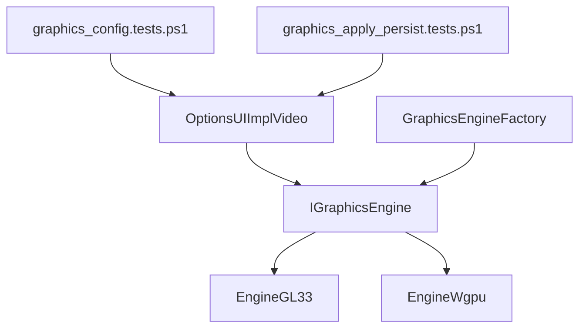

# Graphics Settings

<cite>
**Referenced Files in This Document**
- [OptionsUIImplVideo.cpp](file://engine/Poseidon/UI/OptionsUIImplVideo.cpp)
- [OptionsUI.hpp](file://engine/Poseidon/UI/OptionsUI.hpp)
- [DisplayUICommon.hpp](file://engine/Poseidon/UI/DisplayUICommon.hpp)
- [GraphicsEngineFactory.cpp](file://engine/Poseidon/Graphics/GraphicsEngineFactory.cpp)
- [IGraphicsEngine.hpp](file://engine/Poseidon/Graphics/IGraphicsEngine.hpp)
- [EngineGL33.cpp](file://engine/Poseidon/PoseidonGL33/EngineGL33.cpp)
- [EngineWgpu.cpp](file://engine/Poseidon/WgpuRenderer/EngineWgpu.cpp)
- [HighPerformanceGpuHint.cpp](file://apps/cwr/Game/HighPerformanceGpuHint.cpp)
- [graphics_config.tests.ps1](file://tests/smoke/graphics_config.tests.ps1)
- [graphics_apply_persist.tests.ps1](file://tests/smoke/graphics_apply_persist.tests.ps1)
</cite>

## Table of Contents
1. Introduction
2. Project Structure
3. Core Components
4. Architecture Overview
5. Detailed Component Analysis
6. Dependency Analysis
7. Performance Considerations
8. Troubleshooting Guide
9. Conclusion

## Introduction
This document explains the Graphics Settings system, focusing on visual configuration options such as resolution, refresh rate, graphics quality presets, shader settings, and performance optimizations. It also documents the GraphicsPage implementation with live preview capabilities, hardware detection, and compatibility checks. Practical guidance is provided for adding new graphics options, implementing quality presets, handling driver compatibility, validating configurations, applying automatic optimization suggestions, and troubleshooting rendering issues.

## Project Structure
The graphics settings are implemented across UI, engine abstraction, and backend-specific implementations:
- UI layer exposes the settings page and handles user interactions and live previews.
- Engine abstraction provides a unified interface to query and apply graphics settings.
- Backend implementations (OpenGL 3.3 and WGPU) provide concrete behavior for different drivers and platforms.
- Tests validate configuration persistence and application behavior.

**Diagram sources**
- [OptionsUI.hpp](file://engine/Poseidon/UI/OptionsUI.hpp)
- [OptionsUIImplVideo.cpp](file://engine/Poseidon/UI/OptionsUIImplVideo.cpp)
- [DisplayUICommon.hpp](file://engine/Poseidon/UI/DisplayUICommon.hpp)
- [IGraphicsEngine.hpp](file://engine/Poseidon/Graphics/IGraphicsEngine.hpp)
- [GraphicsEngineFactory.cpp](file://engine/Poseidon/Graphics/GraphicsEngineFactory.cpp)
- [EngineGL33.cpp](file://engine/Poseidon/PoseidonGL33/EngineGL33.cpp)
- [EngineWgpu.cpp](file://engine/Poseidon/WgpuRenderer/EngineWgpu.cpp)

**Section sources**
- [OptionsUI.hpp](file://engine/Poseidon/UI/OptionsUI.hpp)
- [OptionsUIImplVideo.cpp](file://engine/Poseidon/UI/OptionsUIImplVideo.cpp)
- [DisplayUICommon.hpp](file://engine/Poseidon/UI/DisplayUICommon.hpp)
- [IGraphicsEngine.hpp](file://engine/Poseidon/Graphics/IGraphicsEngine.hpp)
- [GraphicsEngineFactory.cpp](file://engine/Poseidon/Graphics/GraphicsEngineFactory.cpp)
- [EngineGL33.cpp](file://engine/Poseidon/PoseidonGL33/EngineGL33.cpp)
- [EngineWgpu.cpp](file://engine/Poseidon/WgpuRenderer/EngineWgpu.cpp)

## Core Components
- GraphicsPage (via OptionsUIImplVideo): Presents graphics options, validates inputs, applies changes, and supports live preview where applicable.
- IGraphicsEngine: Abstracts graphics backend operations like querying supported resolutions, refresh rates, and applying settings.
- GraphicsEngineFactory: Selects the appropriate backend (GL33 or WGPU) based on platform and availability.
- Backend Engines (EngineGL33, EngineWgpu): Implement backend-specific logic for resolution, refresh rate, quality presets, shaders, and performance features.
- HighPerformanceGpuHint: Provides hints or recommendations for high-performance GPUs to optimize settings automatically.

Key responsibilities:
- Resolution and refresh rate enumeration and validation.
- Quality presets mapping to concrete feature toggles and scaling factors.
- Shader feature detection and fallback strategies.
- Live preview updates without full restart when possible.
- Compatibility checks against driver and hardware capabilities.

**Section sources**
- [OptionsUIImplVideo.cpp](file://engine/Poseidon/UI/OptionsUIImplVideo.cpp)
- [IGraphicsEngine.hpp](file://engine/Poseidon/Graphics/IGraphicsEngine.hpp)
- [GraphicsEngineFactory.cpp](file://engine/Poseidon/Graphics/GraphicsEngineFactory.cpp)
- [EngineGL33.cpp](file://engine/Poseidon/PoseidonGL33/EngineGL33.cpp)
- [EngineWgpu.cpp](file://engine/Poseidon/WgpuRenderer/EngineWgpu.cpp)
- [HighPerformanceGpuHint.cpp](file://apps/cwr/Game/HighPerformanceGpuHint.cpp)

## Architecture Overview
The architecture separates UI concerns from engine specifics through an abstraction layer. The UI composes options and triggers apply actions; the engine abstraction ensures consistent behavior across backends. Factory selection enables runtime switching between OpenGL 3.3 and WGPU implementations.

**Diagram sources**
- [OptionsUIImplVideo.cpp](file://engine/Poseidon/UI/OptionsUIImplVideo.cpp)
- [IGraphicsEngine.hpp](file://engine/Poseidon/Graphics/IGraphicsEngine.hpp)
- [EngineGL33.cpp](file://engine/Poseidon/PoseidonGL33/EngineGL33.cpp)
- [EngineWgpu.cpp](file://engine/Poseidon/WgpuRenderer/EngineWgpu.cpp)

## Detailed Component Analysis

### GraphicsPage Implementation (OptionsUIImplVideo)
Responsibilities:
- Present graphics options (resolution, refresh rate, quality presets, shader toggles).
- Validate user input against backend-supported values.
- Trigger live preview updates when safe.
- Persist changes and notify engine to apply.

Live preview workflow:
- On option change, compute derived values (e.g., texture quality from preset).
- Request backend to test mode switch without committing if supported.
- Revert on failure; commit on success.

Hardware detection and compatibility:
- Use engine queries to enumerate supported modes and features.
- Disable unsupported options or suggest alternatives.
- Integrate GPU capability hints to auto-suggest optimal presets.

**Diagram sources**
- [OptionsUIImplVideo.cpp](file://engine/Poseidon/UI/OptionsUIImplVideo.cpp)
- [IGraphicsEngine.hpp](file://engine/Poseidon/Graphics/IGraphicsEngine.hpp)

**Section sources**
- [OptionsUIImplVideo.cpp](file://engine/Poseidon/UI/OptionsUIImplVideo.cpp)
- [DisplayUICommon.hpp](file://engine/Poseidon/UI/DisplayUICommon.hpp)

### Engine Abstraction and Factory
- IGraphicsEngine defines methods for querying supported resolutions, refresh rates, and applying settings consistently across backends.
- GraphicsEngineFactory selects the best available backend at runtime.

**Diagram sources**
- [IGraphicsEngine.hpp](file://engine/Poseidon/Graphics/IGraphicsEngine.hpp)
- [GraphicsEngineFactory.cpp](file://engine/Poseidon/Graphics/GraphicsEngineFactory.cpp)
- [EngineGL33.cpp](file://engine/Poseidon/PoseidonGL33/EngineGL33.cpp)
- [EngineWgpu.cpp](file://engine/Poseidon/WgpuRenderer/EngineWgpu.cpp)

**Section sources**
- [IGraphicsEngine.hpp](file://engine/Poseidon/Graphics/IGraphicsEngine.hpp)
- [GraphicsEngineFactory.cpp](file://engine/Poseidon/Graphics/GraphicsEngineFactory.cpp)
- [EngineGL33.cpp](file://engine/Poseidon/PoseidonGL33/EngineGL33.cpp)
- [EngineWgpu.cpp](file://engine/Poseidon/WgpuRenderer/EngineWgpu.cpp)

### Backend-Specific Behavior
- EngineGL33 implements OpenGL 3.3 specific resolution and refresh rate handling, shader support checks, and feature flags.
- EngineWgpu implements WGPU-specific paths, including modern rendering features and compatibility layers.

Practical implications:
- Some features may be unavailable on older drivers; fallbacks should be implemented.
- WGPU may expose newer features but requires compatible runtime/driver.

**Section sources**
- [EngineGL33.cpp](file://engine/Poseidon/PoseidonGL33/EngineGL33.cpp)
- [EngineWgpu.cpp](file://engine/Poseidon/WgpuRenderer/EngineWgpu.cpp)

### Hardware Detection and Optimization Suggestions
- HighPerformanceGpuHint provides heuristics to detect capable GPUs and recommend optimal presets.
- Integration point: UI can query hints to pre-fill settings or suggest adjustments.

**Section sources**
- [HighPerformanceGpuHint.cpp](file://apps/cwr/Game/HighPerformanceGpuHint.cpp)

## Dependency Analysis
The UI depends on the engine abstraction; the factory decouples backend selection. Backends implement concrete behaviors. Tests ensure configuration persistence and correct application.

**Diagram sources**
- [OptionsUIImplVideo.cpp](file://engine/Poseidon/UI/OptionsUIImplVideo.cpp)
- [IGraphicsEngine.hpp](file://engine/Poseidon/Graphics/IGraphicsEngine.hpp)
- [GraphicsEngineFactory.cpp](file://engine/Poseidon/Graphics/GraphicsEngineFactory.cpp)
- [EngineGL33.cpp](file://engine/Poseidon/PoseidonGL33/EngineGL33.cpp)
- [EngineWgpu.cpp](file://engine/Poseidon/WgpuRenderer/EngineWgpu.cpp)
- [graphics_config.tests.ps1](file://tests/smoke/graphics_config.tests.ps1)
- [graphics_apply_persist.tests.ps1](file://tests/smoke/graphics_apply_persist.tests.ps1)

**Section sources**
- [OptionsUIImplVideo.cpp](file://engine/Poseidon/UI/OptionsUIImplVideo.cpp)
- [IGraphicsEngine.hpp](file://engine/Poseidon/Graphics/IGraphicsEngine.hpp)
- [GraphicsEngineFactory.cpp](file://engine/Poseidon/Graphics/GraphicsEngineFactory.cpp)
- [EngineGL33.cpp](file://engine/Poseidon/PoseidonGL33/EngineGL33.cpp)
- [EngineWgpu.cpp](file://engine/Poseidon/WgpuRenderer/EngineWgpu.cpp)
- [graphics_config.tests.ps1](file://tests/smoke/graphics_config.tests.ps1)
- [graphics_apply_persist.tests.ps1](file://tests/smoke/graphics_apply_persist.tests.ps1)

## Performance Considerations
- Prefer live preview for non-disruptive changes to avoid full restarts.
- Cache supported modes and feature queries to reduce overhead.
- Use preset mappings that scale multiple features coherently.
- Detect and disable expensive features on lower-end hardware automatically.
- Ensure backend-specific optimizations (e.g., WGPU pipeline tuning, GL33 state minimization).

[No sources needed since this section provides general guidance]

## Troubleshooting Guide
Common issues and remedies:
- Unsupported resolution or refresh rate:
  - Verify backend-reported supported modes; fall back to closest valid mode.
- Shader errors or missing features:
  - Check feature flags; enable fallback shaders or reduce quality.
- Driver incompatibility:
  - Switch to alternative backend if available; update drivers.
- Persistence failures:
  - Inspect config save path and permissions; verify tests pass.

Validation and diagnostics:
- Use smoke tests to confirm configuration loading and persistence.
- Log apply results and revert reasons for failed changes.

**Section sources**
- [graphics_config.tests.ps1](file://tests/smoke/graphics_config.tests.ps1)
- [graphics_apply_persist.tests.ps1](file://tests/smoke/graphics_apply_persist.tests.ps1)

## Conclusion
The Graphics Settings system combines a robust UI layer with a flexible engine abstraction to deliver consistent, cross-backend graphics configuration. By leveraging hardware detection, live previews, and structured presets, it provides users with intuitive control over visual fidelity and performance. Extending the system involves adding new options to the UI, ensuring backend support via IGraphicsEngine, and validating behavior through tests.

[No sources needed since this section summarizes without analyzing specific files]