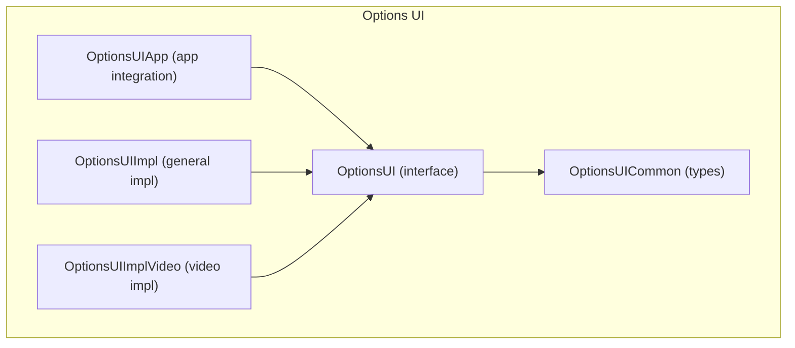
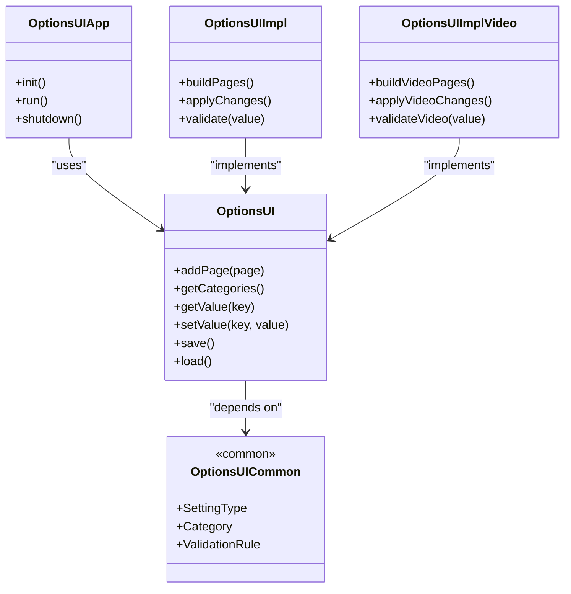
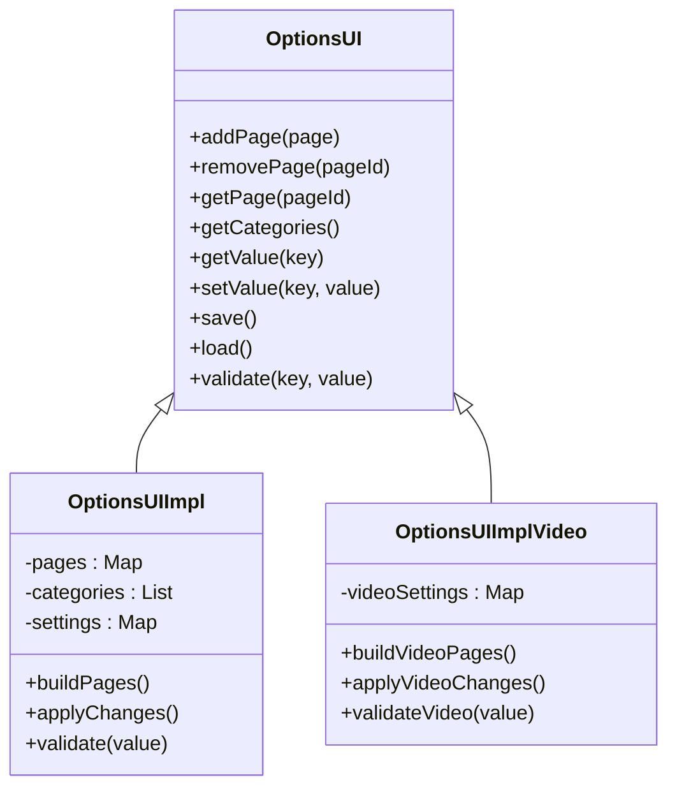
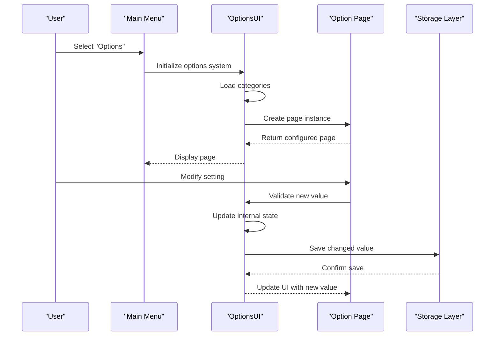
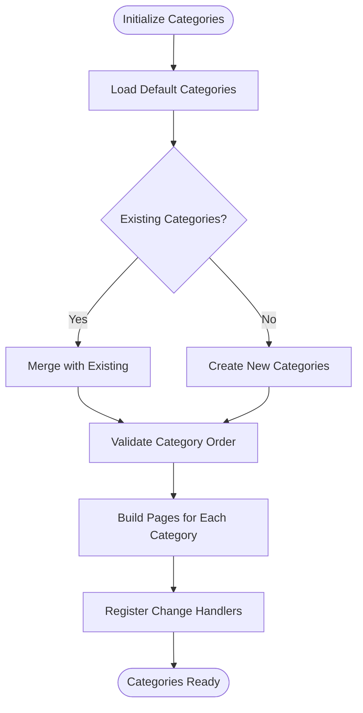
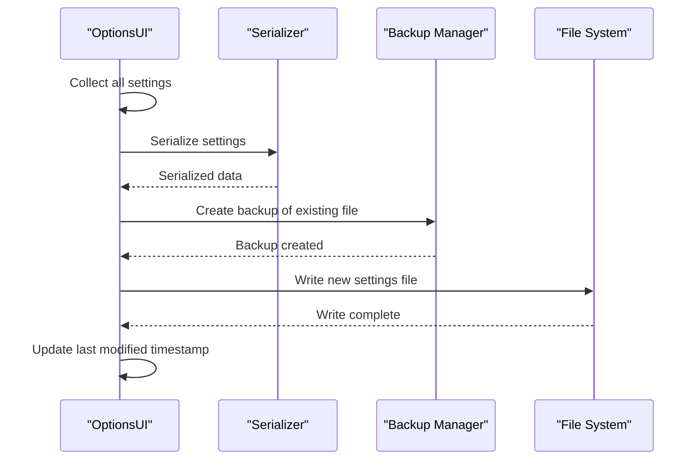
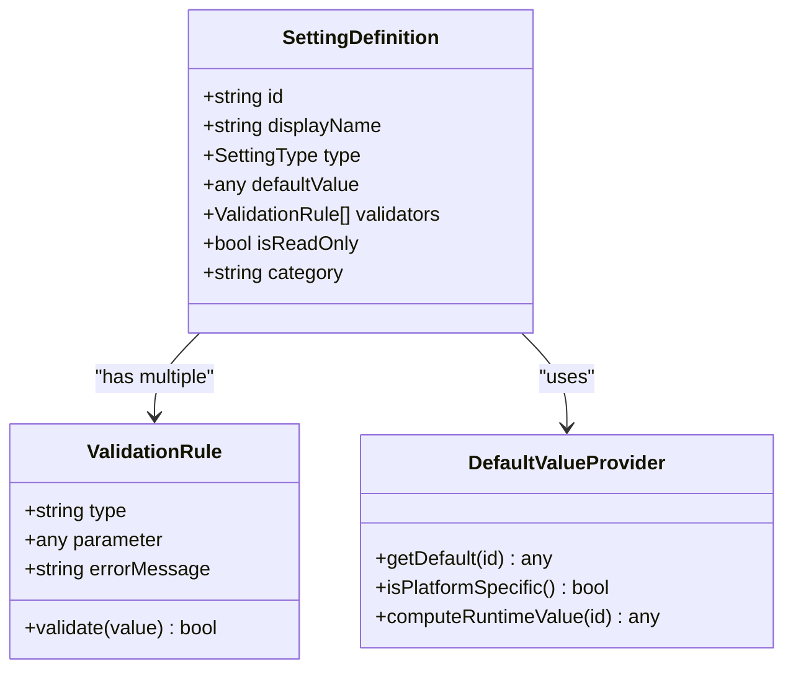
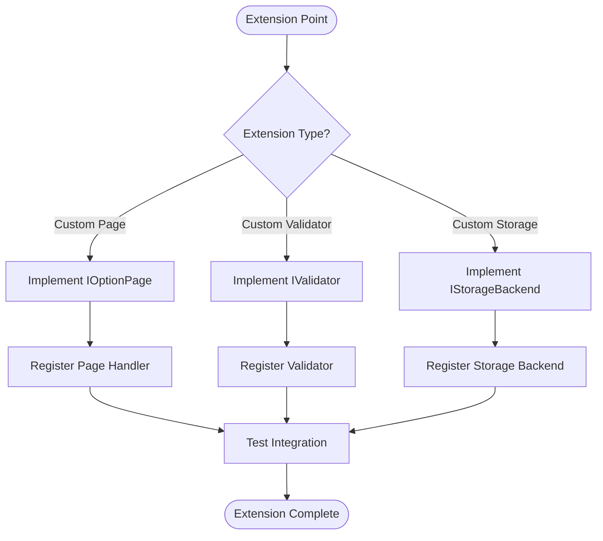
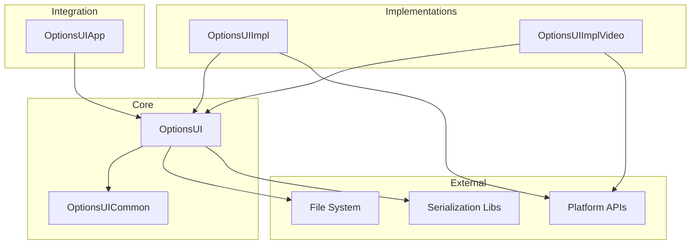

# Options Architecture

<cite>
**Referenced Files in This Document**
- [OptionsUI.hpp](file://engine/Poseidon/UI/OptionsUI.hpp)
- [OptionsUI.cpp](file://engine/Poseidon/UI/OptionsUI.cpp)
- [OptionsUIImpl.cpp](file://engine/Poseidon/UI/OptionsUIImpl.cpp)
- [OptionsUIImplVideo.cpp](file://engine/Poseidon/UI/OptionsUIImplVideo.cpp)
- [OptionsUIApp.cpp](file://engine/Poseidon/UI/OptionsUIApp.cpp)
- [OptionsUICommon.hpp](file://engine/Poseidon/UI/OptionsUICommon.hpp)
</cite>

## Table of Contents
1. [Introduction](#introduction)
2. [Project Structure](#project-structure)
3. [Core Components](#core-components)
4. [Architecture Overview](#architecture-overview)
5. [Detailed Component Analysis](#detailed-component-analysis)
6. [Dependency Analysis](#dependency-analysis)
7. [Performance Considerations](#performance-considerations)
8. [Troubleshooting Guide](#troubleshooting-guide)
9. [Conclusion](#conclusion)
10. [Appendices](#appendices)

## Introduction
This document provides comprehensive architectural documentation for the Options System core framework. It explains the page-based navigation system, how settings are organized into categories, and how values are persisted across sessions. It also details the OptionsUI class hierarchy, base classes, implementation patterns, and extension points. The document covers the settings configuration framework including data types, validation rules, and default value handling. Practical guidance is provided for creating custom option pages, implementing setting change handlers, and integrating with platform-specific storage. Finally, it addresses settings migration strategies, backup and restore functionality, and error handling patterns.

## Project Structure
The Options System resides under the UI subsystem and is implemented as a cohesive set of components:
- Core interface and common definitions
- Application-level orchestration
- Concrete implementations for general and video options
- Shared utilities and type definitions

**Diagram sources**
- [OptionsUI.hpp](file://engine/Poseidon/UI/OptionsUI.hpp)
- [OptionsUICommon.hpp](file://engine/Poseidon/UI/OptionsUICommon.hpp)
- [OptionsUIApp.cpp](file://engine/Poseidon/UI/OptionsUIApp.cpp)
- [OptionsUIImpl.cpp](file://engine/Poseidon/UI/OptionsUIImpl.cpp)
- [OptionsUIImplVideo.cpp](file://engine/Poseidon/UI/OptionsUIImplVideo.cpp)

**Section sources**
- [OptionsUI.hpp](file://engine/Poseidon/UI/OptionsUI.hpp)
- [OptionsUICommon.hpp](file://engine/Poseidon/UI/OptionsUICommon.hpp)
- [OptionsUIApp.cpp](file://engine/Poseidon/UI/OptionsUIApp.cpp)
- [OptionsUIImpl.cpp](file://engine/Poseidon/UI/OptionsUIImpl.cpp)
- [OptionsUIImplVideo.cpp](file://engine/Poseidon/UI/OptionsUIImplVideo.cpp)

## Core Components
- OptionsUI: Defines the primary interface for the options system, including page management, category organization, and persistence operations.
- OptionsUICommon: Provides shared types, enums, and structures used across the options framework.
- OptionsUIApp: Integrates the options system with the application lifecycle and entry points.
- OptionsUIImpl: Implements generic option pages and behaviors.
- OptionsUIImplVideo: Implements video-specific option pages and behaviors.

Key responsibilities:
- Page-based navigation: Each option page represents a logical grouping of related settings.
- Category organization: Settings are grouped by categories to simplify navigation and rendering.
- Value persistence: Values are saved and restored consistently across sessions.
- Validation and defaults: Each setting defines its type, constraints, and default values.

**Section sources**
- [OptionsUI.hpp](file://engine/Poseidon/UI/OptionsUI.hpp)
- [OptionsUICommon.hpp](file://engine/Poseidon/UI/OptionsUICommon.hpp)
- [OptionsUIApp.cpp](file://engine/Poseidon/UI/OptionsUIApp.cpp)
- [OptionsUIImpl.cpp](file://engine/Poseidon/UI/OptionsUIImpl.cpp)
- [OptionsUIImplVideo.cpp](file://engine/Poseidon/UI/OptionsUIImplVideo.cpp)

## Architecture Overview
The Options System follows a layered architecture:
- Interface layer: OptionsUI exposes methods for adding pages, retrieving categories, and persisting values.
- Implementation layer: OptionsUIImpl and OptionsUIImplVideo provide concrete behaviors for different domains.
- Common layer: OptionsUICommon centralizes shared types and constants.
- App integration: OptionsUIApp wires the options system into the application lifecycle.

**Diagram sources**
- [OptionsUI.hpp](file://engine/Poseidon/UI/OptionsUI.hpp)
- [OptionsUICommon.hpp](file://engine/Poseidon/UI/OptionsUICommon.hpp)
- [OptionsUIApp.cpp](file://engine/Poseidon/UI/OptionsUIApp.cpp)
- [OptionsUIImpl.cpp](file://engine/Poseidon/UI/OptionsUIImpl.cpp)
- [OptionsUIImplVideo.cpp](file://engine/Poseidon/UI/OptionsUIImplVideo.cpp)

## Detailed Component Analysis

### OptionsUI Class Hierarchy
The OptionsUI class serves as the central interface for managing option pages and settings. It defines methods for:
- Adding and retrieving option pages
- Accessing and modifying settings by key
- Persisting and loading settings
- Validating values against defined rules

**Diagram sources**
- [OptionsUI.hpp](file://engine/Poseidon/UI/OptionsUI.hpp)
- [OptionsUIImpl.cpp](file://engine/Poseidon/UI/OptionsUIImpl.cpp)
- [OptionsUIImplVideo.cpp](file://engine/Poseidon/UI/OptionsUIImplVideo.cpp)

**Section sources**
- [OptionsUI.hpp](file://engine/Poseidon/UI/OptionsUI.hpp)
- [OptionsUIImpl.cpp](file://engine/Poseidon/UI/OptionsUIImpl.cpp)
- [OptionsUIImplVideo.cpp](file://engine/Poseidon/UI/OptionsUIImplVideo.cpp)

### Page-Based Navigation System
The page-based navigation system organizes settings into logical groups called pages. Each page contains:
- A unique identifier
- A display name
- A list of settings
- Validation rules
- Default values

Navigation flow:
1. User selects a category from the main menu
2. System loads the corresponding page
3. Settings are displayed with their current values
4. Changes are validated before applying
5. Modified values are persisted to storage

**Diagram sources**
- [OptionsUI.hpp](file://engine/Poseidon/UI/OptionsUI.hpp)
- [OptionsUICommon.hpp](file://engine/Poseidon/UI/OptionsUICommon.hpp)

**Section sources**
- [OptionsUI.hpp](file://engine/Poseidon/UI/OptionsUI.hpp)
- [OptionsUICommon.hpp](file://engine/Poseidon/UI/OptionsUICommon.hpp)

### Setting Categories Organization
Settings are organized into hierarchical categories to improve usability:
- Top-level categories (e.g., Graphics, Audio, Controls)
- Sub-categories for complex settings
- Individual settings within each category

Each category defines:
- Category ID and display name
- Ordering priority
- Associated page instances
- Permission levels (read-only, user-modifiable)

**Diagram sources**
- [OptionsUICommon.hpp](file://engine/Poseidon/UI/OptionsUICommon.hpp)
- [OptionsUIImpl.cpp](file://engine/Poseidon/UI/OptionsUIImpl.cpp)

**Section sources**
- [OptionsUICommon.hpp](file://engine/Poseidon/UI/OptionsUICommon.hpp)
- [OptionsUIImpl.cpp](file://engine/Poseidon/UI/OptionsUIImpl.cpp)

### Value Persistence Mechanisms
The persistence layer handles saving and loading settings values:
- Serialization format (JSON, XML, or binary)
- Version compatibility handling
- Backup and restore capabilities
- Error recovery mechanisms

Persistence workflow:
1. Settings are collected from all active pages
2. Values are validated and normalized
3. Data is serialized to the appropriate format
4. File is written atomically with backup creation
5. On load, data is deserialized and validated

**Diagram sources**
- [OptionsUI.hpp](file://engine/Poseidon/UI/OptionsUI.hpp)
- [OptionsUIImpl.cpp](file://engine/Poseidon/UI/OptionsUIImpl.cpp)

**Section sources**
- [OptionsUI.hpp](file://engine/Poseidon/UI/OptionsUI.hpp)
- [OptionsUIImpl.cpp](file://engine/Poseidon/UI/OptionsUIImpl.cpp)

### Settings Configuration Framework
The settings configuration framework defines how individual settings are structured:

Data Types:
- Primitive types (boolean, integer, float, string)
- Complex types (enums, arrays, nested objects)
- Platform-specific types (file paths, registry keys)

Validation Rules:
- Range validation (min/max values)
- Format validation (regex patterns)
- Dependency validation (conditional requirements)
- Cross-setting validation (interdependent values)

Default Value Handling:
- Hierarchical defaults (global -> category -> setting)
- Migration-aware defaults
- Platform-specific defaults
- Runtime-computed defaults

**Diagram sources**
- [OptionsUICommon.hpp](file://engine/Poseidon/UI/OptionsUICommon.hpp)

**Section sources**
- [OptionsUICommon.hpp](file://engine/Poseidon/UI/OptionsUICommon.hpp)

### Extension Points and Customization
The framework provides several extension points for customization:

Custom Option Pages:
- Implement the IOptionPage interface
- Define custom validation logic
- Handle platform-specific behavior
- Integrate with external systems

Custom Validators:
- Implement validation interfaces
- Provide descriptive error messages
- Support async validation
- Chain multiple validators

Custom Storage Backends:
- Implement storage interfaces
- Handle encryption/decryption
- Support cloud synchronization
- Manage version migrations

**Diagram sources**
- [OptionsUI.hpp](file://engine/Poseidon/UI/OptionsUI.hpp)
- [OptionsUICommon.hpp](file://engine/Poseidon/UI/OptionsUICommon.hpp)

**Section sources**
- [OptionsUI.hpp](file://engine/Poseidon/UI/OptionsUI.hpp)
- [OptionsUICommon.hpp](file://engine/Poseidon/UI/OptionsUICommon.hpp)

## Dependency Analysis
The Options System has clear dependency relationships:

Internal Dependencies:
- OptionsUI depends on OptionsUICommon for shared types
- Implementations depend on the core OptionsUI interface
- App integration depends on all components

External Dependencies:
- File system for persistence
- Platform-specific APIs for certain settings
- Serialization libraries for data formats

**Diagram sources**
- [OptionsUI.hpp](file://engine/Poseidon/UI/OptionsUI.hpp)
- [OptionsUICommon.hpp](file://engine/Poseidon/UI/OptionsUICommon.hpp)
- [OptionsUIApp.cpp](file://engine/Poseidon/UI/OptionsUIApp.cpp)
- [OptionsUIImpl.cpp](file://engine/Poseidon/UI/OptionsUIImpl.cpp)
- [OptionsUIImplVideo.cpp](file://engine/Poseidon/UI/OptionsUIImplVideo.cpp)

**Section sources**
- [OptionsUI.hpp](file://engine/Poseidon/UI/OptionsUI.hpp)
- [OptionsUICommon.hpp](file://engine/Poseidon/UI/OptionsUICommon.hpp)
- [OptionsUIApp.cpp](file://engine/Poseidon/UI/OptionsUIApp.cpp)
- [OptionsUIImpl.cpp](file://engine/Poseidon/UI/OptionsUIImpl.cpp)
- [OptionsUIImplVideo.cpp](file://engine/Poseidon/UI/OptionsUIImplVideo.cpp)

## Performance Considerations
- Lazy loading of option pages to reduce startup time
- Batched updates for multiple setting changes
- Asynchronous validation for long-running checks
- Efficient serialization with minimal memory allocation
- Caching of frequently accessed settings
- Background saving to avoid UI blocking

## Troubleshooting Guide
Common issues and solutions:

Settings Not Persisting:
- Verify file permissions and disk space
- Check serialization format compatibility
- Validate setting IDs and types
- Review error logs for specific failures

Invalid Settings Values:
- Check validation rule configurations
- Verify default value types match setting types
- Ensure range constraints are properly defined
- Test edge cases and boundary values

Performance Issues:
- Profile validation logic for bottlenecks
- Optimize large setting collections
- Use lazy loading for heavy computations
- Monitor memory usage during save/load operations

Migration Problems:
- Verify version numbers in migration scripts
- Test backward compatibility thoroughly
- Implement rollback mechanisms
- Log detailed migration progress

**Section sources**
- [OptionsUI.hpp](file://engine/Poseidon/UI/OptionsUI.hpp)
- [OptionsUICommon.hpp](file://engine/Poseidon/UI/OptionsUICommon.hpp)

## Conclusion
The Options System provides a robust, extensible framework for managing application settings. Its page-based architecture, comprehensive validation system, and flexible persistence mechanisms make it suitable for complex applications requiring sophisticated configuration management. The modular design allows for easy extension and customization while maintaining consistency across different platforms and use cases.

## Appendices

### Creating Custom Option Pages
To create a custom option page:
1. Implement the IOptionPage interface
2. Define your settings with proper types and validation
3. Register the page with the OptionsUI system
4. Handle user interactions and apply changes
5. Test thoroughly with various input scenarios

### Implementing Setting Change Handlers
Change handlers should:
- Validate incoming values before applying
- Update both UI and underlying state
- Trigger appropriate side effects
- Handle errors gracefully
- Notify dependent components of changes

### Platform-Specific Storage Integration
For platform-specific storage:
1. Implement the IStorageBackend interface
2. Handle platform-specific file paths and permissions
3. Manage encryption and security requirements
4. Test across different platform versions
5. Provide fallback mechanisms for unsupported features