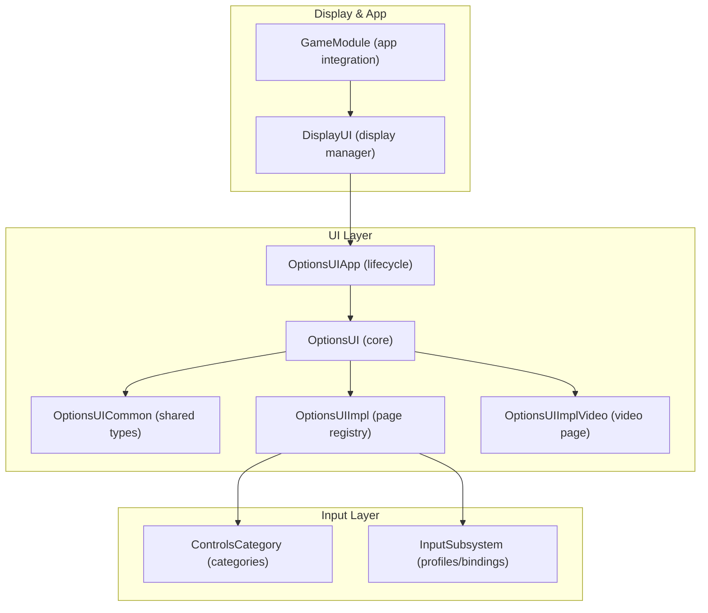
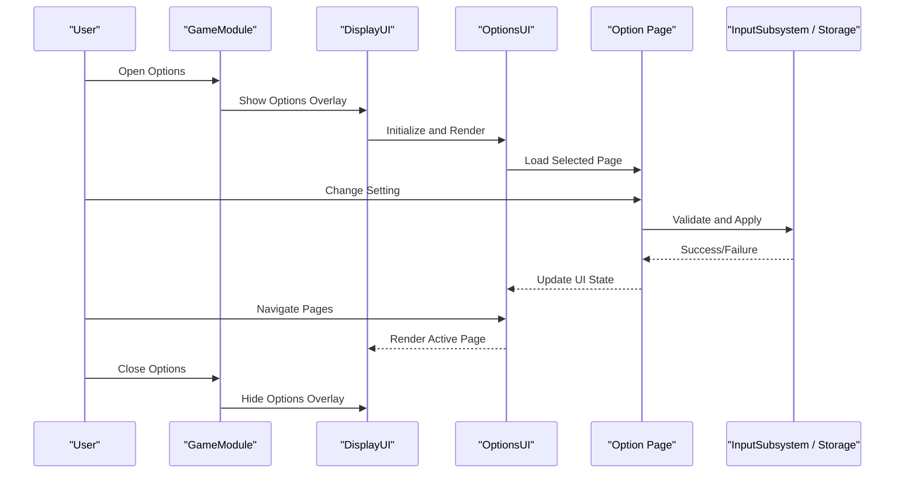
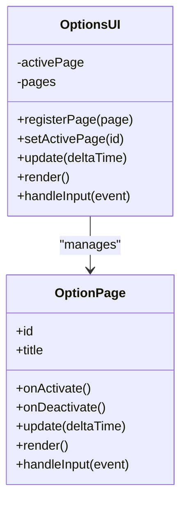
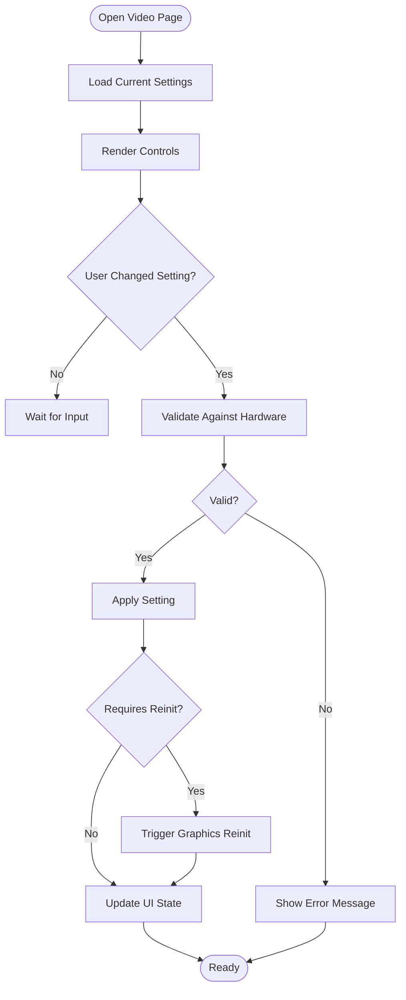
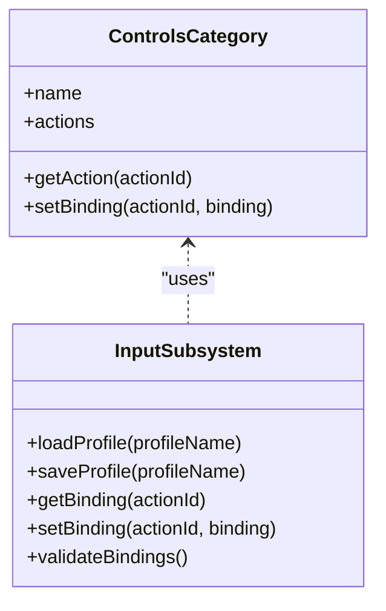
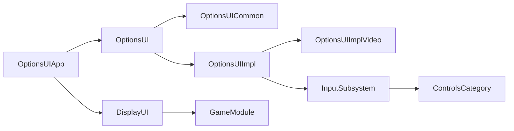

# Options System

<cite>
**Referenced Files in This Document**
- [OptionsUI.hpp](file://engine/Poseidon/UI/OptionsUI.hpp)
- [OptionsUI.cpp](file://engine/Poseidon/UI/OptionsUI.cpp)
- [OptionsUIImpl.cpp](file://engine/Poseidon/UI/OptionsUIImpl.cpp)
- [OptionsUIImplVideo.cpp](file://engine/Poseidon/UI/OptionsUIImplVideo.cpp)
- [OptionsUIApp.cpp](file://engine/Poseidon/UI/OptionsUIApp.cpp)
- [OptionsUICommon.hpp](file://engine/Poseidon/UI/OptionsUICommon.hpp)
- [ControlsCategory.hpp](file://engine/Poseidon/Input/ControlsCategory.hpp)
- [ControlsCategory.cpp](file://engine/Poseidon/Input/ControlsCategory.cpp)
- [InputSubsystem.hpp](file://engine/Poseidon/Input/InputSubsystem.hpp)
- [InputSubsystem.cpp](file://engine/Poseidon/Input/InputSubsystem.cpp)
- [DisplayUI.hpp](file://engine/Poseidon/UI/DisplayUI.hpp)
- [DisplayUI.cpp](file://engine/Poseidon/UI/DisplayUI.cpp)
- [GameModule.hpp](file://engine/Poseidon/UI/GameModule.hpp)
- [GameModule.cpp](file://engine/Poseidon/UI/GameModule.cpp)
</cite>

## Table of Contents
1. [Introduction](#introduction)
2. [Project Structure](#project-structure)
3. [Core Components](#core-components)
4. [Architecture Overview](#architecture-overview)
5. [Detailed Component Analysis](#detailed-component-analysis)
6. [Dependency Analysis](#dependency-analysis)
7. [Performance Considerations](#performance-considerations)
8. [Troubleshooting Guide](#troubleshooting-guide)
9. [Conclusion](#conclusion)
10. [Appendices](#appendices)

## Introduction
This document explains the Options System that manages user preferences and configuration across the application. It covers the OptionsUI architecture, page-based navigation, setting categories, value persistence, data types, validation rules, default values, and how to create option pages and handle changes. It also provides guidance for platform-specific storage integration, settings migration, backup/restore workflows, and troubleshooting common issues.

## Project Structure
The Options System is implemented primarily under the UI subsystem with supporting input and display modules:
- OptionsUI core and implementation files define the options framework, page management, and rendering.
- Input subsystem provides binding categories and control profiles used by the Controls option page.
- Display and Game modules integrate options into the main UI lifecycle and apply runtime updates.

**Diagram sources**
- [OptionsUI.hpp](file://engine/Poseidon/UI/OptionsUI.hpp)
- [OptionsUI.cpp](file://engine/Poseidon/UI/OptionsUI.cpp)
- [OptionsUIImpl.cpp](file://engine/Poseidon/UI/OptionsUIImpl.cpp)
- [OptionsUIImplVideo.cpp](file://engine/Poseidon/UI/OptionsUIImplVideo.cpp)
- [OptionsUIApp.cpp](file://engine/Poseidon/UI/OptionsUIApp.cpp)
- [OptionsUICommon.hpp](file://engine/Poseidon/UI/OptionsUICommon.hpp)
- [ControlsCategory.hpp](file://engine/Poseidon/Input/ControlsCategory.hpp)
- [ControlsCategory.cpp](file://engine/Poseidon/Input/ControlsCategory.cpp)
- [InputSubsystem.hpp](file://engine/Poseidon/Input/InputSubsystem.hpp)
- [InputSubsystem.cpp](file://engine/Poseidon/Input/InputSubsystem.cpp)
- [DisplayUI.hpp](file://engine/Poseidon/UI/DisplayUI.hpp)
- [DisplayUI.cpp](file://engine/Poseidon/UI/DisplayUI.cpp)
- [GameModule.hpp](file://engine/Poseidon/UI/GameModule.hpp)
- [GameModule.cpp](file://engine/Poseidon/UI/GameModule.cpp)

**Section sources**
- [OptionsUI.hpp](file://engine/Poseidon/UI/OptionsUI.hpp)
- [OptionsUI.cpp](file://engine/Poseidon/UI/OptionsUI.cpp)
- [OptionsUIImpl.cpp](file://engine/Poseidon/UI/OptionsUIImpl.cpp)
- [OptionsUIImplVideo.cpp](file://engine/Poseidon/UI/OptionsUIImplVideo.cpp)
- [OptionsUIApp.cpp](file://engine/Poseidon/UI/OptionsUIApp.cpp)
- [OptionsUICommon.hpp](file://engine/Poseidon/UI/OptionsUICommon.hpp)
- [ControlsCategory.hpp](file://engine/Poseidon/Input/ControlsCategory.hpp)
- [ControlsCategory.cpp](file://engine/Poseidon/Input/ControlsCategory.cpp)
- [InputSubsystem.hpp](file://engine/Poseidon/Input/InputSubsystem.hpp)
- [InputSubsystem.cpp](file://engine/Poseidon/Input/InputSubsystem.cpp)
- [DisplayUI.hpp](file://engine/Poseidon/UI/DisplayUI.hpp)
- [DisplayUI.cpp](file://engine/Poseidon/UI/DisplayUI.cpp)
- [GameModule.hpp](file://engine/Poseidon/UI/GameModule.hpp)
- [GameModule.cpp](file://engine/Poseidon/UI/GameModule.cpp)

## Core Components
- OptionsUI: Central entry point for the options system; manages page lifecycle, navigation, and rendering.
- OptionsUIImpl: Concrete implementations for specific option pages (e.g., video).
- OptionsUIApp: Application-level integration for opening/closing the options UI and coordinating with the display manager.
- OptionsUICommon: Shared types and utilities used across options components.
- ControlsCategory and InputSubsystem: Provide category definitions and profile management for input bindings.
- DisplayUI and GameModule: Integrate the options UI into the overall application flow and ensure proper state transitions.

Key responsibilities:
- Page registration and selection
- Rendering and input handling for each page
- Persisting and applying settings changes
- Coordinating with platform-specific storage via higher-level services

**Section sources**
- [OptionsUI.hpp](file://engine/Poseidon/UI/OptionsUI.hpp)
- [OptionsUI.cpp](file://engine/Poseidon/UI/OptionsUI.cpp)
- [OptionsUIImpl.cpp](file://engine/Poseidon/UI/OptionsUIImpl.cpp)
- [OptionsUIImplVideo.cpp](file://engine/Poseidon/UI/OptionsUIImplVideo.cpp)
- [OptionsUIApp.cpp](file://engine/Poseidon/UI/OptionsUIApp.cpp)
- [OptionsUICommon.hpp](file://engine/Poseidon/UI/OptionsUICommon.hpp)
- [ControlsCategory.hpp](file://engine/Poseidon/Input/ControlsCategory.hpp)
- [ControlsCategory.cpp](file://engine/Poseidon/Input/ControlsCategory.cpp)
- [InputSubsystem.hpp](file://engine/Poseidon/Input/InputSubsystem.hpp)
- [InputSubsystem.cpp](file://engine/Poseidon/Input/InputSubsystem.cpp)
- [DisplayUI.hpp](file://engine/Poseidon/UI/DisplayUI.hpp)
- [DisplayUI.cpp](file://engine/Poseidon/UI/DisplayUI.cpp)
- [GameModule.hpp](file://engine/Poseidon/UI/GameModule.hpp)
- [GameModule.cpp](file://engine/Poseidon/UI/GameModule.cpp)

## Architecture Overview
The Options System follows a page-based architecture where each option category is represented as a page. Pages are registered with the OptionsUI framework, which handles navigation, focus, and rendering. Changes made on a page are validated and persisted through the input subsystem or other backend services. The DisplayUI coordinates showing/hiding the options overlay within the application lifecycle.

**Diagram sources**
- [OptionsUI.hpp](file://engine/Poseidon/UI/OptionsUI.hpp)
- [OptionsUI.cpp](file://engine/Poseidon/UI/OptionsUI.cpp)
- [OptionsUIImpl.cpp](file://engine/Poseidon/UI/OptionsUIImpl.cpp)
- [OptionsUIImplVideo.cpp](file://engine/Poseidon/UI/OptionsUIImplVideo.cpp)
- [OptionsUIApp.cpp](file://engine/Poseidon/UI/OptionsUIApp.cpp)
- [InputSubsystem.hpp](file://engine/Poseidon/Input/InputSubsystem.hpp)
- [DisplayUI.hpp](file://engine/Poseidon/UI/DisplayUI.hpp)
- [GameModule.hpp](file://engine/Poseidon/UI/GameModule.hpp)

## Detailed Component Analysis

### OptionsUI Framework
Responsibilities:
- Manage page lifecycle (creation, activation, deactivation)
- Handle keyboard/mouse navigation between pages and controls
- Coordinate rendering pipeline for option pages
- Expose APIs for registering new pages and querying current state

Implementation highlights:
- Page registry maintains active and available pages
- Focus management ensures consistent user experience
- Event dispatch routes input events to the active page

**Diagram sources**
- [OptionsUI.hpp](file://engine/Poseidon/UI/OptionsUI.hpp)
- [OptionsUI.cpp](file://engine/Poseidon/UI/OptionsUI.cpp)

**Section sources**
- [OptionsUI.hpp](file://engine/Poseidon/UI/OptionsUI.hpp)
- [OptionsUI.cpp](file://engine/Poseidon/UI/OptionsUI.cpp)

### Video Options Page
Responsibilities:
- Display and edit graphics-related settings (resolution, quality, fullscreen mode)
- Validate settings against hardware capabilities
- Apply changes immediately or on confirmation

Implementation highlights:
- Uses platform-specific queries to enumerate supported modes
- Validates ranges and compatibility before applying
- Triggers reinitialization when critical settings change

**Diagram sources**
- [OptionsUIImplVideo.cpp](file://engine/Poseidon/UI/OptionsUIImplVideo.cpp)

**Section sources**
- [OptionsUIImplVideo.cpp](file://engine/Poseidon/UI/OptionsUIImplVideo.cpp)

### Controls Category and Input Subsystem
Responsibilities:
- Define categories for input bindings (movement, combat, camera, etc.)
- Manage input profiles and binding assignments
- Provide APIs for querying and modifying bindings

Implementation highlights:
- Categories group related actions for organized UI presentation
- Profiles allow per-user customization with save/load support
- Validation ensures no conflicting bindings exist

**Diagram sources**
- [ControlsCategory.hpp](file://engine/Poseidon/Input/ControlsCategory.hpp)
- [ControlsCategory.cpp](file://engine/Poseidon/Input/ControlsCategory.cpp)
- [InputSubsystem.hpp](file://engine/Poseidon/Input/InputSubsystem.hpp)
- [InputSubsystem.cpp](file://engine/Poseidon/Input/InputSubsystem.cpp)

**Section sources**
- [ControlsCategory.hpp](file://engine/Poseidon/Input/ControlsCategory.hpp)
- [ControlsCategory.cpp](file://engine/Poseidon/Input/ControlsCategory.cpp)
- [InputSubsystem.hpp](file://engine/Poseidon/Input/InputSubsystem.hpp)
- [InputSubsystem.cpp](file://engine/Poseidon/Input/InputSubsystem.cpp)

### OptionsUIApp Integration
Responsibilities:
- Coordinate opening and closing the options UI from the application
- Manage display state transitions
- Handle application lifecycle events affecting options

Implementation highlights:
- Integrates with DisplayUI to show/hide options overlay
- Manages focus and input routing during options session
- Ensures proper cleanup when exiting options

**Section sources**
- [OptionsUIApp.cpp](file://engine/Poseidon/UI/OptionsUIApp.cpp)
- [DisplayUI.hpp](file://engine/Poseidon/UI/DisplayUI.hpp)
- [DisplayUI.cpp](file://engine/Poseidon/UI/DisplayUI.cpp)
- [GameModule.hpp](file://engine/Poseidon/UI/GameModule.hpp)
- [GameModule.cpp](file://engine/Poseidon/UI/GameModule.cpp)

## Dependency Analysis
The Options System has clear dependency boundaries:
- OptionsUI depends on OptionsUICommon for shared types
- Implementation pages depend on platform-specific services through well-defined interfaces
- Input subsystem provides binding management without tight coupling to UI
- Display and Game modules coordinate lifecycle without direct knowledge of option internals

**Diagram sources**
- [OptionsUI.hpp](file://engine/Poseidon/UI/OptionsUI.hpp)
- [OptionsUICommon.hpp](file://engine/Poseidon/UI/OptionsUICommon.hpp)
- [OptionsUIImpl.cpp](file://engine/Poseidon/UI/OptionsUIImpl.cpp)
- [OptionsUIImplVideo.cpp](file://engine/Poseidon/UI/OptionsUIImplVideo.cpp)
- [InputSubsystem.hpp](file://engine/Poseidon/Input/InputSubsystem.hpp)
- [ControlsCategory.hpp](file://engine/Poseidon/Input/ControlsCategory.hpp)
- [OptionsUIApp.cpp](file://engine/Poseidon/UI/OptionsUIApp.cpp)
- [DisplayUI.hpp](file://engine/Poseidon/UI/DisplayUI.hpp)
- [GameModule.hpp](file://engine/Poseidon/UI/GameModule.hpp)

**Section sources**
- [OptionsUI.hpp](file://engine/Poseidon/UI/OptionsUI.hpp)
- [OptionsUICommon.hpp](file://engine/Poseidon/UI/OptionsUICommon.hpp)
- [OptionsUIImpl.cpp](file://engine/Poseidon/UI/OptionsUIImpl.cpp)
- [OptionsUIImplVideo.cpp](file://engine/Poseidon/UI/OptionsUIImplVideo.cpp)
- [InputSubsystem.hpp](file://engine/Poseidon/Input/InputSubsystem.hpp)
- [ControlsCategory.hpp](file://engine/Poseidon/Input/ControlsCategory.hpp)
- [OptionsUIApp.cpp](file://engine/Poseidon/UI/OptionsUIApp.cpp)
- [DisplayUI.hpp](file://engine/Poseidon/UI/DisplayUI.hpp)
- [GameModule.hpp](file://engine/Poseidon/UI/GameModule.hpp)

## Performance Considerations
- Lazy loading of option pages to minimize startup time
- Efficient rendering by only updating changed elements
- Batched validation to reduce overhead during bulk changes
- Asynchronous operations for long-running tasks like graphics reinitialization
- Memory management through RAII patterns and smart pointers

[No sources needed since this section provides general guidance]

## Troubleshooting Guide
Common issues and solutions:
- Settings not persisting: Verify storage backend initialization and file permissions
- Invalid settings applied: Check validation logic and range constraints
- Input conflicts: Use binding validation to detect and resolve conflicts
- Graphics crashes after changes: Ensure proper reinitialization sequence and fallback handling
- UI freezes during validation: Implement asynchronous validation for complex checks

Debugging tips:
- Enable detailed logging for option changes and validation failures
- Use unit tests for custom option pages and validators
- Test with minimal configurations to isolate issues
- Monitor memory usage during extended options sessions

**Section sources**
- [OptionsUI.cpp](file://engine/Poseidon/UI/OptionsUI.cpp)
- [OptionsUIImpl.cpp](file://engine/Poseidon/UI/OptionsUIImpl.cpp)
- [InputSubsystem.cpp](file://engine/Poseidon/Input/InputSubsystem.cpp)

## Conclusion
The Options System provides a robust, extensible framework for managing user preferences through a page-based architecture. Its modular design allows easy addition of new option categories while maintaining consistency in user experience and data persistence. The separation of concerns between UI, validation, and storage enables independent development and testing of each component.

[No sources needed since this section summarizes without analyzing specific files]

## Appendices

### Adding a New Option Page
Steps to implement a new option page:
1. Create a new class inheriting from the base option page interface
2. Implement required methods: update, render, handleInput
3. Register the page with the OptionsUI framework
4. Add appropriate validation logic for your settings
5. Test with various input scenarios and edge cases

### Implementing Complex Option Dialogs
For complex dialogs requiring multiple steps:
- Use modal dialog patterns with clear state management
- Implement undo/redo functionality for destructive operations
- Provide preview capabilities before applying changes
- Handle cancellation gracefully without losing progress

### Platform-Specific Configuration Storage
Integration approaches:
- Abstract storage interface for cross-platform compatibility
- Platform-specific implementations for Windows Registry, Linux config files, macOS preferences
- Fallback mechanisms for failed storage operations
- Migration support for format changes

### Settings Migration Strategy
Migration best practices:
- Version tracking for configuration schemas
- Backward compatibility layers for older formats
- Automated migration scripts for major version upgrades
- Rollback capability for failed migrations

### Backup and Restore Functionality
Implementation guidelines:
- Automatic backup creation before major changes
- User-initiated backup/restore through options menu
- Compression and encryption for sensitive data
- Validation of backup integrity before restoration

[No sources needed since this section provides general guidance]