# UI Framework

<cite>
**Referenced Files in This Document**
- [DisplayUI.hpp](file://engine/Poseidon/UI/DisplayUI.hpp)
- [DisplayUI.cpp](file://engine/Poseidon/UI/DisplayUI.cpp)
- [DisplayUIMenus.cpp](file://engine/Poseidon/UI/DisplayUIMenus.cpp)
- [DisplayUIMultiplayer.cpp](file://engine/Poseidon/UI/DisplayUIMultiplayer.cpp)
- [DisplayUIMultiplayerWizard.cpp](file://engine/Poseidon/UI/DisplayUIMultiplayerWizard.cpp)
- [DisplayUISetup.cpp](file://engine/Poseidon/UI/DisplayUISetup.cpp)
- [DisplayUISetupMP.cpp](file://engine/Poseidon/UI/DisplayUISetupMP.cpp)
- [DisplayUICommon.hpp](file://engine/Poseidon/UI/DisplayUICommon.hpp)
- [UIActiveDisplay.hpp](file://engine/Poseidon/UI/UIActiveDisplay.hpp)
- [MainMenuLayout.cpp](file://engine/Poseidon/UI/MainMenuLayout.cpp)
- [MainMenuLayout.hpp](file://engine/Poseidon/UI/MainMenuLayout.hpp)
- [OptionsUI.cpp](file://engine/Poseidon/UI/OptionsUI.cpp)
- [OptionsUI.hpp](file://engine/Poseidon/UI/OptionsUI.hpp)
- [OptionsUIApp.cpp](file://engine/Poseidon/UI/OptionsUIApp.cpp)
- [OptionsUICommon.hpp](file://engine/Poseidon/UI/OptionsUICommon.hpp)
- [OptionsUIImpl.cpp](file://engine/Poseidon/UI/OptionsUIImpl.cpp)
- [OptionsUIImplVideo.cpp](file://engine/Poseidon/UI/OptionsUIImplVideo.cpp)
- [GameModule.cpp](file://engine/Poseidon/UI/GameModule.cpp)
- [GameModule.hpp](file://engine/Poseidon/UI/GameModule.hpp)
- [ControllerUiLayout.cpp](file://engine/Poseidon/Input/ControllerUiLayout.cpp)
- [ControllerUiLayout.hpp](file://engine/Poseidon/Input/ControllerUiLayout.hpp)
- [ControllerUiScene.cpp](file://engine/Poseidon/Input/ControllerUiScene.cpp)
- [ControllerUiScene.hpp](file://engine/Poseidon/Input/ControllerUiScene.hpp)
- [InputSubsystem.cpp](file://engine/Poseidon/Input/InputSubsystem.cpp)
- [InputSubsystem.hpp](file://engine/Poseidon/Input/InputSubsystem.hpp)
- [UserActionDesc.cpp](file://engine/Poseidon/Input/UserActionDesc.cpp)
- [UserActionDesc.hpp](file://engine/Poseidon/Input/UserActionDesc.hpp)
- [LocaleManager.cpp](file://engine/Poseidon/UI/Locale/LocaleManager.cpp)
- [LocaleManager.hpp](file://engine/Poseidon/UI/Locale/LocaleManager.hpp)
- [StringTable.cpp](file://engine/Poseidon/UI/Locale/StringTable.cpp)
- [StringTable.hpp](file://engine/Poseidon/UI/Locale/StringTable.hpp)
- [UITestEngine.cpp](file://engine/Poseidon/UI/UITestEngine.cpp)
- [UITestEngine.hpp](file://engine/Poseidon/UI/UITestEngine.hpp)
</cite>

## Table of Contents
1. [Introduction](#introduction)
2. [Project Structure](#project-structure)
3. [Core Components](#core-components)
4. [Architecture Overview](#architecture-overview)
5. [Detailed Component Analysis](#detailed-component-analysis)
6. [Dependency Analysis](#dependency-analysis)
7. [Performance Considerations](#performance-considerations)
8. [Troubleshooting Guide](#troubleshooting-guide)
9. [Conclusion](#conclusion)
10. [Appendices](#appendices)

## Introduction
This document provides comprehensive documentation for the game’s user interface framework, focusing on the DisplayUI architecture and its control system. It explains how screen states, menus, and interactive elements are managed; how layout management, event handling, and localization support work; and how UI components integrate with game state and input processing. Practical guidance is included for creating custom controls, implementing responsive layouts, integrating with systems, theming, accessibility, cross-platform considerations, performance optimization, and debugging techniques.

## Project Structure
The UI framework resides primarily under engine/Poseidon/UI and integrates with input subsystems under engine/Poseidon/Input. Key areas include:
- Display orchestration and screen state management
- Menu and setup screens (single-player and multiplayer)
- Options UI implementation and application scaffolding
- Localization and string table management
- Controller UI layout and scene integration
- Test harness for UI validation

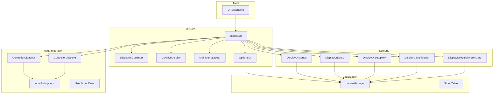

**Diagram sources**
- [DisplayUI.hpp](file://engine/Poseidon/UI/DisplayUI.hpp)
- [DisplayUI.cpp](file://engine/Poseidon/UI/DisplayUI.cpp)
- [DisplayUIMenus.cpp](file://engine/Poseidon/UI/DisplayUIMenus.cpp)
- [DisplayUISetup.cpp](file://engine/Poseidon/UI/DisplayUISetup.cpp)
- [DisplayUISetupMP.cpp](file://engine/Poseidon/UI/DisplayUISetupMP.cpp)
- [DisplayUIMultiplayer.cpp](file://engine/Poseidon/UI/DisplayUIMultiplayer.cpp)
- [DisplayUIMultiplayerWizard.cpp](file://engine/Poseidon/UI/DisplayUIMultiplayerWizard.cpp)
- [MainMenuLayout.cpp](file://engine/Poseidon/UI/MainMenuLayout.cpp)
- [OptionsUI.cpp](file://engine/Poseidon/UI/OptionsUI.cpp)
- [ControllerUiLayout.cpp](file://engine/Poseidon/Input/ControllerUiLayout.cpp)
- [ControllerUiScene.cpp](file://engine/Poseidon/Input/ControllerUiScene.cpp)
- [InputSubsystem.cpp](file://engine/Poseidon/Input/InputSubsystem.cpp)
- [LocaleManager.cpp](file://engine/Poseidon/UI/Locale/LocaleManager.cpp)
- [StringTable.cpp](file://engine/Poseidon/UI/Locale/StringTable.cpp)
- [UITestEngine.cpp](file://engine/Poseidon/UI/UITestEngine.cpp)

**Section sources**
- [DisplayUI.hpp](file://engine/Poseidon/UI/DisplayUI.hpp)
- [DisplayUI.cpp](file://engine/Poseidon/UI/DisplayUI.cpp)
- [DisplayUIMenus.cpp](file://engine/Poseidon/UI/DisplayUIMenus.cpp)
- [DisplayUISetup.cpp](file://engine/Poseidon/UI/DisplayUISetup.cpp)
- [DisplayUISetupMP.cpp](file://engine/Poseidon/UI/DisplayUISetupMP.cpp)
- [DisplayUIMultiplayer.cpp](file://engine/Poseidon/UI/DisplayUIMultiplayer.cpp)
- [DisplayUIMultiplayerWizard.cpp](file://engine/Poseidon/UI/DisplayUIMultiplayerWizard.cpp)
- [MainMenuLayout.cpp](file://engine/Poseidon/UI/MainMenuLayout.cpp)
- [OptionsUI.cpp](file://engine/Poseidon/UI/OptionsUI.cpp)
- [ControllerUiLayout.cpp](file://engine/Poseidon/Input/ControllerUiLayout.cpp)
- [ControllerUiScene.cpp](file://engine/Poseidon/Input/ControllerUiScene.cpp)
- [InputSubsystem.cpp](file://engine/Poseidon/Input/InputSubsystem.cpp)
- [LocaleManager.cpp](file://engine/Poseidon/UI/Llocale/LocaleManager.cpp)
- [StringTable.cpp](file://engine/Poseidon/UI/Locale/StringTable.cpp)
- [UITestEngine.cpp](file://engine/Poseidon/UI/UITestEngine.cpp)

## Core Components
- DisplayUI: Central orchestrator for active displays, screen transitions, and menu lifecycle.
- UIActiveDisplay: Abstraction for a single display/screen instance with focus and update semantics.
- DisplayUIMenus: High-level menu navigation and selection logic.
- DisplayUISetup and DisplayUISetupMP: Single-player and multiplayer setup flows.
- DisplayUIMultiplayer and DisplayUIMultiplayerWizard: Multiplayer session creation and wizard-driven configuration.
- MainMenuLayout: Layout definition and rendering for the main menu.
- OptionsUI and implementations: Settings panels and per-category implementations (e.g., video).
- ControllerUiLayout and ControllerUiScene: Controller-centric UI layout and scene integration.
- InputSubsystem and UserActionDesc: Unified input abstraction and action descriptions used by UI.
- LocaleManager and StringTable: Localization services and string resource management.
- UITestEngine: Automated UI testing utilities.

**Section sources**
- [DisplayUI.hpp](file://engine/Poseidon/UI/DisplayUI.hpp)
- [UIActiveDisplay.hpp](file://engine/Poseidon/UI/UIActiveDisplay.hpp)
- [DisplayUIMenus.cpp](file://engine/Poseidon/UI/DisplayUIMenus.cpp)
- [DisplayUISetup.cpp](file://engine/Poseidon/UI/DisplayUISetup.cpp)
- [DisplayUISetupMP.cpp](file://engine/Poseidon/UI/DisplayUISetupMP.cpp)
- [DisplayUIMultiplayer.cpp](file://engine/Poseidon/UI/DisplayUIMultiplayer.cpp)
- [DisplayUIMultiplayerWizard.cpp](file://engine/Poseidon/UI/DisplayUIMultiplayerWizard.cpp)
- [MainMenuLayout.cpp](file://engine/Poseidon/UI/MainMenuLayout.cpp)
- [OptionsUI.cpp](file://engine/Poseidon/UI/OptionsUI.cpp)
- [OptionsUIImplVideo.cpp](file://engine/Poseidon/UI/OptionsUIImplVideo.cpp)
- [ControllerUiLayout.cpp](file://engine/Poseidon/Input/ControllerUiLayout.cpp)
- [ControllerUiScene.cpp](file://engine/Poseidon/Input/ControllerUiScene.cpp)
- [InputSubsystem.cpp](file://engine/Poseidon/Input/InputSubsystem.cpp)
- [UserActionDesc.cpp](file://engine/Poseidon/Input/UserActionDesc.cpp)
- [LocaleManager.cpp](file://engine/Poseidon/UI/Locale/LocaleManager.cpp)
- [StringTable.cpp](file://engine/Poseidon/UI/Locale/StringTable.cpp)
- [UITestEngine.cpp](file://engine/Poseidon/UI/UITestEngine.cpp)

## Architecture Overview
The UI framework follows a layered architecture:
- Presentation layer: Screens and widgets rendered via graphics backend.
- Control layer: Buttons, sliders, text inputs, and custom widgets handle interaction.
- Orchestration layer: DisplayUI manages active displays, transitions, and focus.
- Input layer: InputSubsystem normalizes keyboard/mouse/controller events into actions.
- Data layer: Game state and settings are read/written through service interfaces.
- Localization layer: LocaleManager and StringTable provide localized strings.

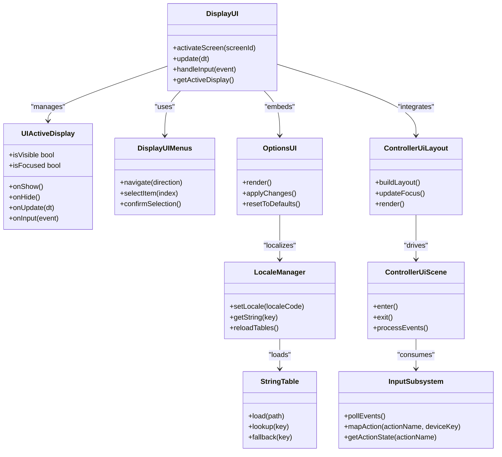

**Diagram sources**
- [DisplayUI.hpp](file://engine/Poseidon/UI/DisplayUI.hpp)
- [UIActiveDisplay.hpp](file://engine/Poseidon/UI/UIActiveDisplay.hpp)
- [DisplayUIMenus.cpp](file://engine/Poseidon/UI/DisplayUIMenus.cpp)
- [OptionsUI.cpp](file://engine/Poseidon/UI/OptionsUI.cpp)
- [ControllerUiLayout.cpp](file://engine/Poseidon/Input/ControllerUiLayout.cpp)
- [ControllerUiScene.cpp](file://engine/Poseidon/Input/ControllerUiScene.cpp)
- [InputSubsystem.cpp](file://engine/Poseidon/Input/InputSubsystem.cpp)
- [LocaleManager.cpp](file://engine/Poseidon/UI/Locale/LocaleManager.cpp)
- [StringTable.cpp](file://engine/Poseidon/UI/Locale/StringTable.cpp)

## Detailed Component Analysis

### DisplayUI Orchestration
DisplayUI coordinates screen lifecycle, focus management, and input routing. It activates specific screens based on game state and ensures only one active display updates at a time. Transitions between screens are handled through explicit activation calls and internal state checks.

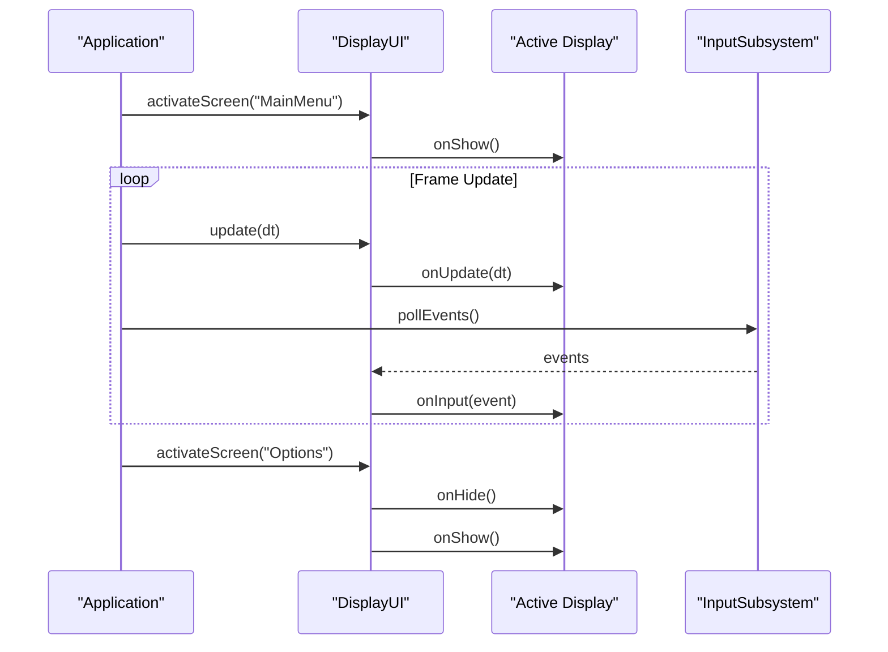

**Diagram sources**
- [DisplayUI.cpp](file://engine/Poseidon/UI/DisplayUI.cpp)
- [UIActiveDisplay.hpp](file://engine/Poseidon/UI/UIActiveDisplay.hpp)
- [InputSubsystem.cpp](file://engine/Poseidon/Input/InputSubsystem.cpp)

**Section sources**
- [DisplayUI.cpp](file://engine/Poseidon/UI/DisplayUI.cpp)
- [UIActiveDisplay.hpp](file://engine/Poseidon/UI/UIActiveDisplay.hpp)

### Menu Navigation and Selection
DisplayUIMenus implements navigation patterns such as directional movement, item selection, and confirmation. It maintains a list of selectable items and handles focus changes based on input direction.

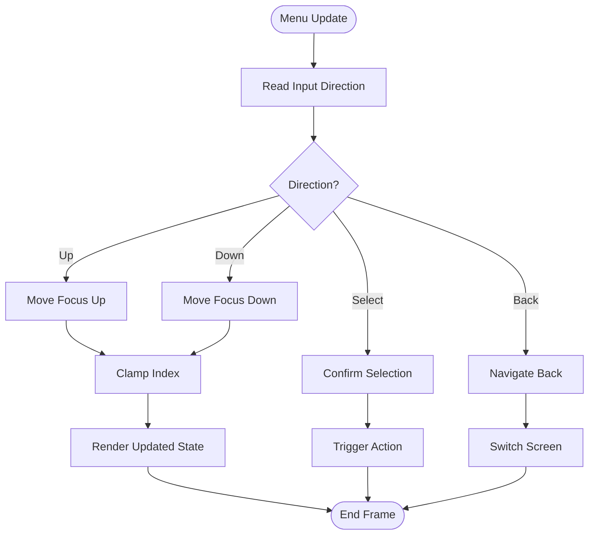

**Diagram sources**
- [DisplayUIMenus.cpp](file://engine/Poseidon/UI/DisplayUIMenus.cpp)

**Section sources**
- [DisplayUIMenus.cpp](file://engine/Poseidon/UI/DisplayUIMenus.cpp)

### Setup Flows (Single-Player and Multiplayer)
DisplayUISetup and DisplayUISetupMP manage initialization steps, validation, and progression to gameplay or lobby states. They coordinate with network modules for multiplayer readiness and persistence for settings.

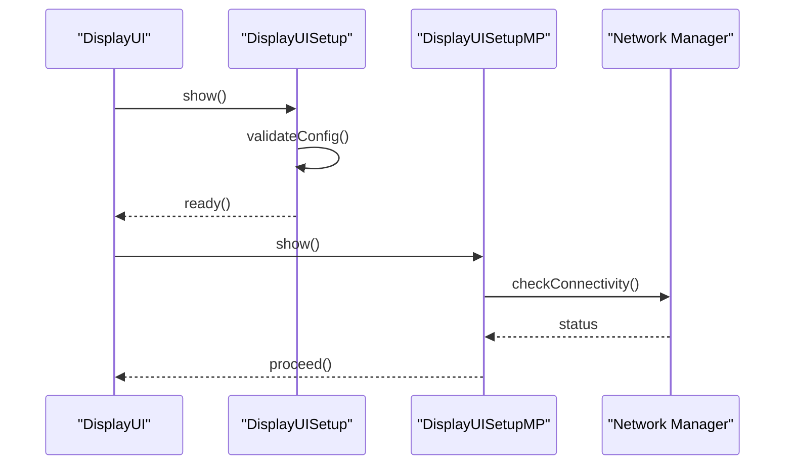

**Diagram sources**
- [DisplayUISetup.cpp](file://engine/Poseidon/UI/DisplayUISetup.cpp)
- [DisplayUISetupMP.cpp](file://engine/Poseidon/UI/DisplayUISetupMP.cpp)

**Section sources**
- [DisplayUISetup.cpp](file://engine/Poseidon/UI/DisplayUISetup.cpp)
- [DisplayUISetupMP.cpp](file://engine/Poseidon/UI/DisplayUISetupMP.cpp)

### Multiplayer Wizard
DisplayUIMultiplayerWizard guides users through session parameters, server selection, and matchmaking options. It aggregates inputs and delegates to network services for session creation.

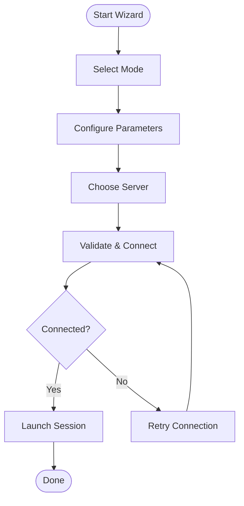

**Diagram sources**
- [DisplayUIMultiplayerWizard.cpp](file://engine/Poseidon/UI/DisplayUIMultiplayerWizard.cpp)

**Section sources**
- [DisplayUIMultiplayerWizard.cpp](file://engine/Poseidon/UI/DisplayUIMultiplayerWizard.cpp)

### Main Menu Layout
MainMenuLayout defines the structure and visual arrangement of menu items, including alignment, spacing, and responsive behavior across resolutions.

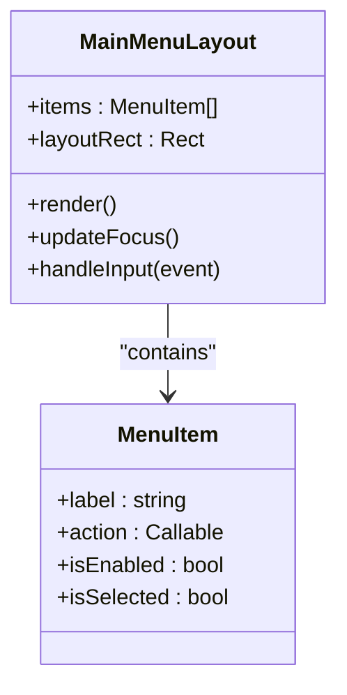

**Diagram sources**
- [MainMenuLayout.cpp](file://engine/Poseidon/UI/MainMenuLayout.cpp)
- [MainMenuLayout.hpp](file://engine/Poseidon/UI/MainMenuLayout.hpp)

**Section sources**
- [MainMenuLayout.cpp](file://engine/Poseidon/UI/MainMenuLayout.cpp)
- [MainMenuLayout.hpp](file://engine/Poseidon/UI/MainMenuLayout.hpp)

### Options UI Implementation
OptionsUI provides a modular settings panel with category-based organization. Implementations like OptionsUIImplVideo expose per-category controls and apply changes to engine settings.

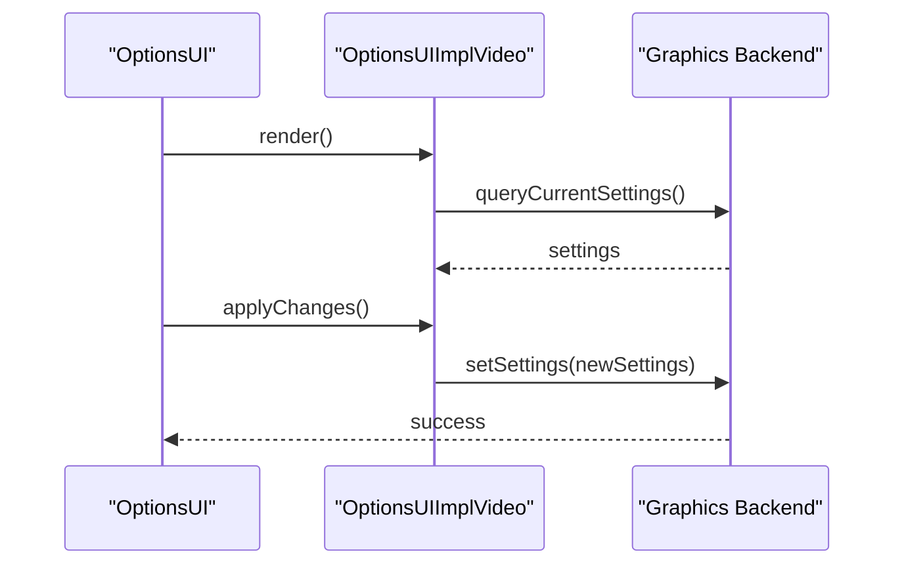

**Diagram sources**
- [OptionsUI.cpp](file://engine/Poseidon/UI/OptionsUI.cpp)
- [OptionsUIImplVideo.cpp](file://engine/Poseidon/UI/OptionsUIImplVideo.cpp)

**Section sources**
- [OptionsUI.cpp](file://engine/Poseidon/UI/OptionsUI.cpp)
- [OptionsUIImplVideo.cpp](file://engine/Poseidon/UI/OptionsUIImplVideo.cpp)

### Controller UI Layout and Scene
ControllerUiLayout builds controller-friendly layouts optimized for gamepad navigation. ControllerUiScene integrates these layouts into the broader scene graph and processes controller-specific events.

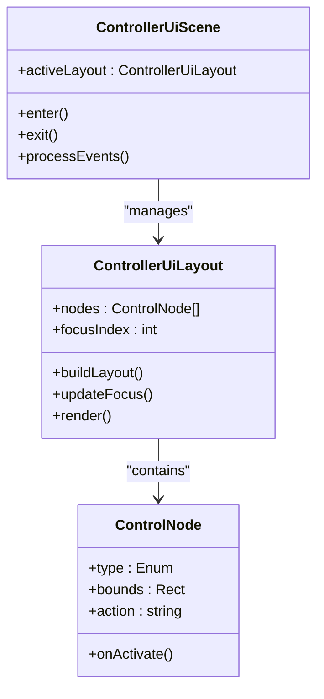

**Diagram sources**
- [ControllerUiLayout.cpp](file://engine/Poseidon/Input/ControllerUiLayout.cpp)
- [ControllerUiLayout.hpp](file://engine/Poseidon/Input/ControllerUiLayout.hpp)
- [ControllerUiScene.cpp](file://engine/Poseidon/Input/ControllerUiScene.cpp)
- [ControllerUiScene.hpp](file://engine/Poseidon/Input/ControllerUiScene.hpp)

**Section sources**
- [ControllerUiLayout.cpp](file://engine/Poseidon/Input/ControllerUiLayout.cpp)
- [ControllerUiLayout.hpp](file://engine/Poseidon/Input/ControllerUiLayout.hpp)
- [ControllerUiScene.cpp](file://engine/Poseidon/Input/ControllerUiScene.cpp)
- [ControllerUiScene.hpp](file://engine/Poseidon/Input/ControllerUiScene.hpp)

### Input Subsystem and Actions
InputSubsystem abstracts input devices and maps raw events to named actions. UserActionDesc defines action metadata and bindings used by UI controls.

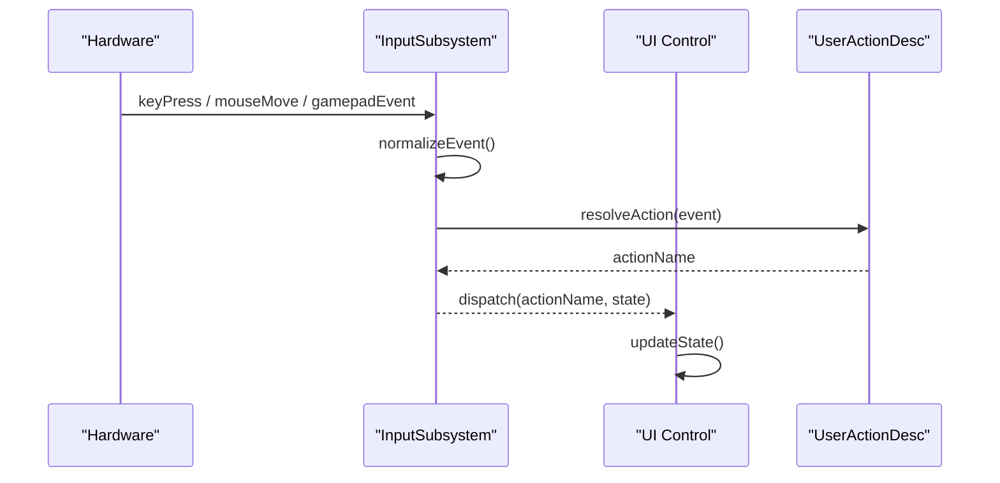

**Diagram sources**
- [InputSubsystem.cpp](file://engine/Poseidon/Input/InputSubsystem.cpp)
- [UserActionDesc.cpp](file://engine/Poseidon/Input/UserActionDesc.cpp)

**Section sources**
- [InputSubsystem.cpp](file://engine/Poseidon/Input/InputSubsystem.cpp)
- [UserActionDesc.cpp](file://engine/Poseidon/Input/UserActionDesc.cpp)

### Localization Support
LocaleManager loads and switches locales, while StringTable provides lookup and fallback mechanisms for localized strings. UI components request strings via keys, ensuring consistent language support.

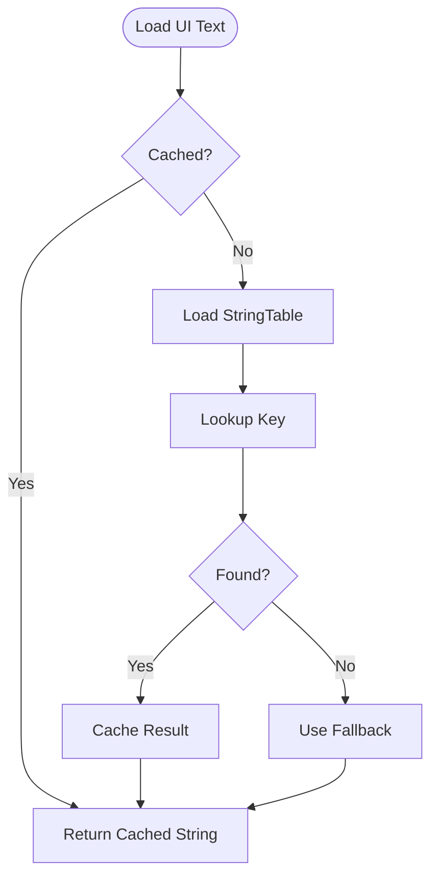

**Diagram sources**
- [LocaleManager.cpp](file://engine/Poseidon/UI/Locale/LocaleManager.cpp)
- [StringTable.cpp](file://engine/Poseidon/UI/Locale/StringTable.cpp)

**Section sources**
- [LocaleManager.cpp](file://engine/Poseidon/UI/Locale/LocaleManager.cpp)
- [StringTable.cpp](file://engine/Poseidon/UI/Locale/StringTable.cpp)

### Testing and Validation
UITestEngine provides utilities for automated UI testing, including screen simulation, input replay, and assertion helpers.

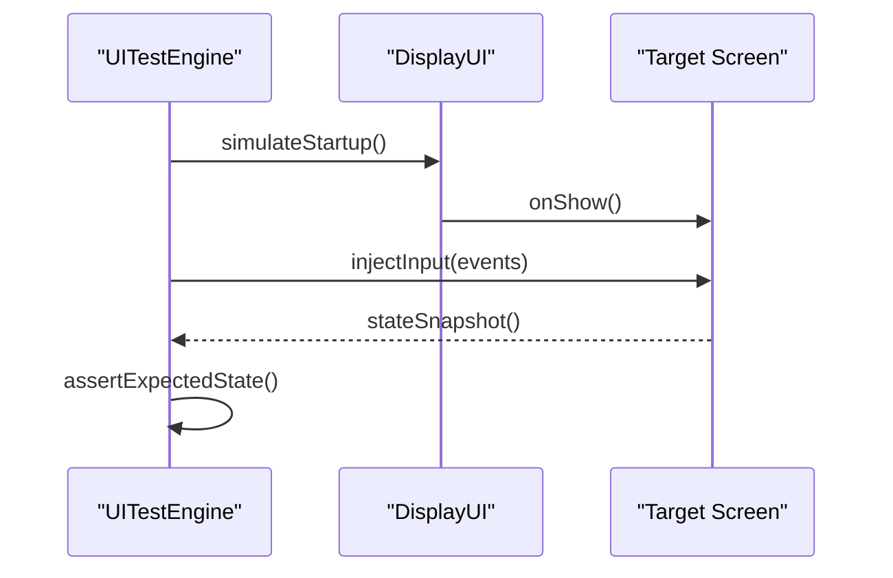

**Diagram sources**
- [UITestEngine.cpp](file://engine/Poseidon/UI/UITestEngine.cpp)

**Section sources**
- [UITestEngine.cpp](file://engine/Poseidon/UI/UITestEngine.cpp)

## Dependency Analysis
The UI framework exhibits clear separation of concerns:
- DisplayUI depends on UIActiveDisplay and concrete screen implementations.
- Menus and setup screens depend on InputSubsystem and LocaleManager.
- OptionsUI depends on engine backends for settings persistence.
- Controller UI components depend on InputSubsystem for event mapping.
- Localization depends on StringTable for resource loading.

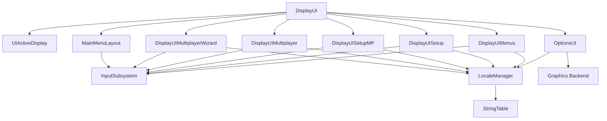

**Diagram sources**
- [DisplayUI.cpp](file://engine/Poseidon/UI/DisplayUI.cpp)
- [DisplayUIMenus.cpp](file://engine/Poseidon/UI/DisplayUIMenus.cpp)
- [DisplayUISetup.cpp](file://engine/Poseidon/UI/DisplayUISetup.cpp)
- [DisplayUISetupMP.cpp](file://engine/Poseidon/UI/DisplayUISetupMP.cpp)
- [DisplayUIMultiplayer.cpp](file://engine/Poseidon/UI/DisplayUIMultiplayer.cpp)
- [DisplayUIMultiplayerWizard.cpp](file://engine/Poseidon/UI/DisplayUIMultiplayerWizard.cpp)
- [MainMenuLayout.cpp](file://engine/Poseidon/UI/MainMenuLayout.cpp)
- [OptionsUI.cpp](file://engine/Poseidon/UI/OptionsUI.cpp)
- [InputSubsystem.cpp](file://engine/Poseidon/Input/InputSubsystem.cpp)
- [LocaleManager.cpp](file://engine/Poseidon/UI/Locale/LocaleManager.cpp)
- [StringTable.cpp](file://engine/Poseidon/UI/Locale/StringTable.cpp)

**Section sources**
- [DisplayUI.cpp](file://engine/Poseidon/UI/DisplayUI.cpp)
- [DisplayUIMenus.cpp](file://engine/Poseidon/UI/DisplayUIMenus.cpp)
- [DisplayUISetup.cpp](file://engine/Poseidon/UI/DisplayUISetup.cpp)
- [DisplayUISetupMP.cpp](file://engine/Poseidon/UI/DisplayUISetupMP.cpp)
- [DisplayUIMultiplayer.cpp](file://engine/Poseidon/UI/DisplayUIMultiplayer.cpp)
- [DisplayUIMultiplayerWizard.cpp](file://engine/Poseidon/UI/DisplayUIMultiplayerWizard.cpp)
- [MainMenuLayout.cpp](file://engine/Poseidon/UI/MainMenuLayout.cpp)
- [OptionsUI.cpp](file://engine/Poseidon/UI/OptionsUI.cpp)
- [InputSubsystem.cpp](file://engine/Poseidon/Input/InputSubsystem.cpp)
- [LocaleManager.cpp](file://engine/Poseidon/UI/Locale/LocaleManager.cpp)
- [StringTable.cpp](file://engine/Poseidon/UI/Locale/StringTable.cpp)

## Performance Considerations
- Minimize per-frame allocations in UI update loops; reuse buffers and objects where possible.
- Batch rendering operations to reduce draw calls; group similar widgets.
- Avoid heavy computations during input handling; defer to background tasks if necessary.
- Use lazy loading for localized strings and textures to reduce memory footprint.
- Profile UI rendering with frame analyzers to identify bottlenecks.
- Optimize layout calculations by caching results when content is static.

[No sources needed since this section provides general guidance]

## Troubleshooting Guide
- Input not registering: Verify InputSubsystem mappings and ensure events are polled each frame.
- Localization missing: Check StringTable paths and locale codes; confirm fallback behavior.
- Screen transition issues: Validate DisplayUI activation sequence and ensure proper onShow/onHide calls.
- Controller navigation stuck: Inspect ControllerUiLayout focus logic and bounds calculation.
- Options not persisting: Confirm OptionsUIImpl applies changes to backend settings correctly.

**Section sources**
- [InputSubsystem.cpp](file://engine/Poseidon/Input/InputSubsystem.cpp)
- [StringTable.cpp](file://engine/Poseidon/UI/Locale/StringTable.cpp)
- [DisplayUI.cpp](file://engine/Poseidon/UI/DisplayUI.cpp)
- [ControllerUiLayout.cpp](file://engine/Poseidon/Input/ControllerUiLayout.cpp)
- [OptionsUIImplVideo.cpp](file://engine/Poseidon/UI/OptionsUIImplVideo.cpp)

## Conclusion
The UI framework provides a robust, modular architecture for managing screens, menus, and interactive elements. DisplayUI orchestrates lifecycle and focus, while specialized components handle menus, setup flows, options, and controller interactions. Localization and input subsystems ensure accessibility and responsiveness. By following the patterns outlined here, developers can create custom controls, implement responsive layouts, and integrate seamlessly with game systems while maintaining performance and usability.

[No sources needed since this section summarizes without analyzing specific files]

## Appendices

### Creating Custom UI Controls
- Define a control class inheriting from a base widget type.
- Implement update, render, and input handling methods.
- Register the control with the layout manager for inclusion in screens.
- Bind actions using UserActionDesc for consistent input mapping.

**Section sources**
- [UserActionDesc.cpp](file://engine/Poseidon/Input/UserActionDesc.cpp)
- [MainMenuLayout.cpp](file://engine/Poseidon/UI/MainMenuLayout.cpp)

### Implementing Responsive Layouts
- Use relative positioning and scaling factors for different resolutions.
- Recalculate layout bounds on resize events.
- Test across target platforms to ensure consistency.

**Section sources**
- [MainMenuLayout.cpp](file://engine/Poseidon/UI/MainMenuLayout.cpp)

### Integrating with Game Systems
- Expose setters/getters for game state variables accessible from UI controls.
- Use callbacks or observers to react to state changes in UI.
- Ensure thread safety when updating shared state from UI threads.

**Section sources**
- [DisplayUI.cpp](file://engine/Poseidon/UI/DisplayUI.cpp)
- [OptionsUI.cpp](file://engine/Poseidon/UI/OptionsUI.cpp)

### Theming Support
- Centralize theme resources (colors, fonts, textures) in a theme manager.
- Allow dynamic theme switching by reloading resources.
- Provide fallback themes for compatibility.

**Section sources**
- [LocaleManager.cpp](file://engine/Poseidon/UI/Locale/LocaleManager.cpp)

### Accessibility Features
- Ensure keyboard and controller navigation parity.
- Provide text-to-speech hooks for screen readers.
- Offer high contrast and scalable text options.

**Section sources**
- [ControllerUiLayout.cpp](file://engine/Poseidon/Input/ControllerUiLayout.cpp)
- [InputSubsystem.cpp](file://engine/Poseidon/Input/InputSubsystem.cpp)

### Cross-Platform UI Considerations
- Abstract platform-specific input and rendering behind interfaces.
- Normalize touch and mouse events for consistent behavior.
- Validate font rendering and text metrics across platforms.

**Section sources**
- [InputSubsystem.cpp](file://engine/Poseidon/Input/InputSubsystem.cpp)
- [StringTable.cpp](file://engine/Poseidon/UI/Locale/StringTable.cpp)