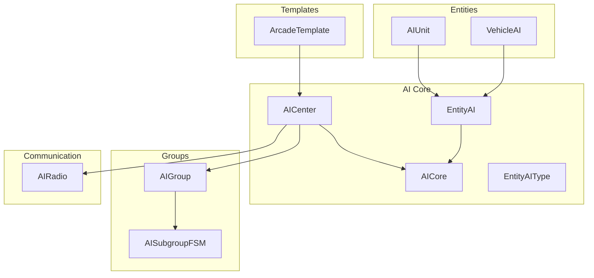
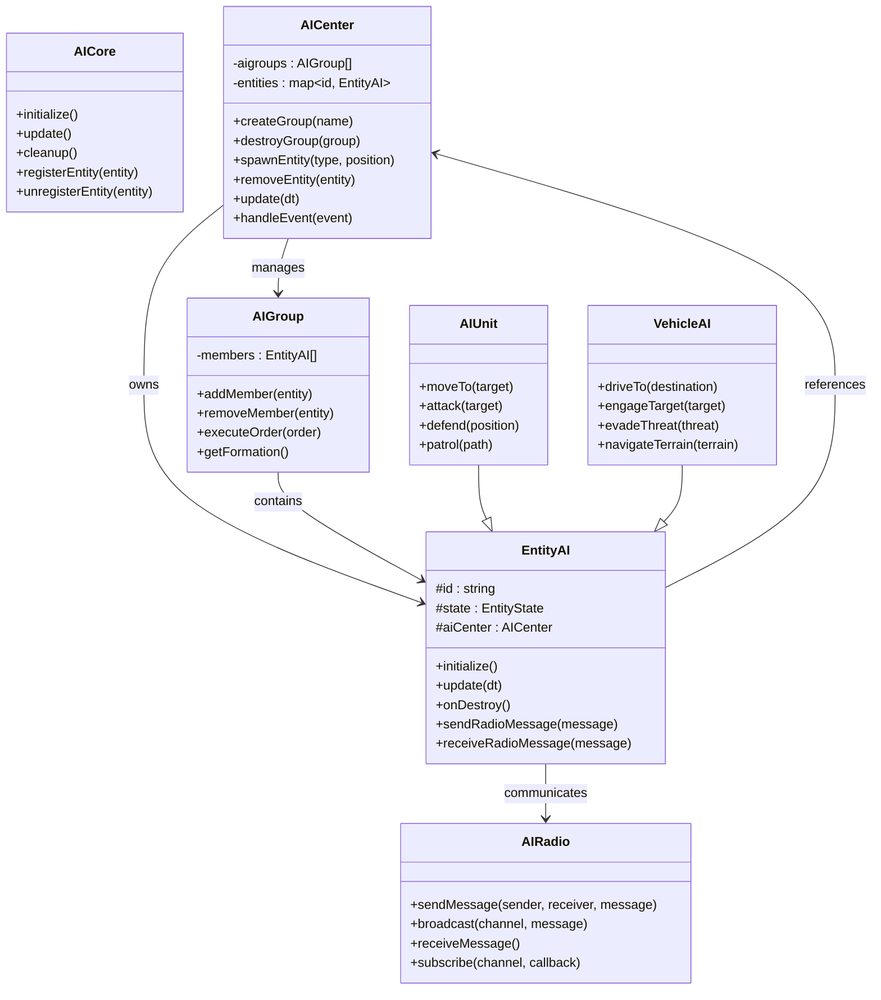
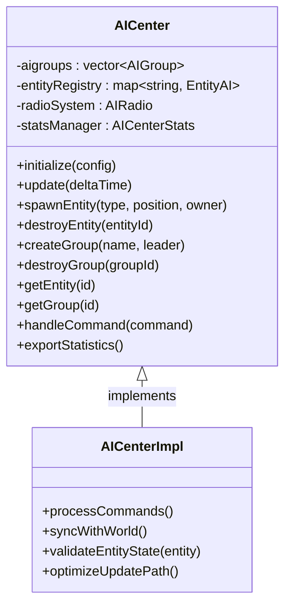
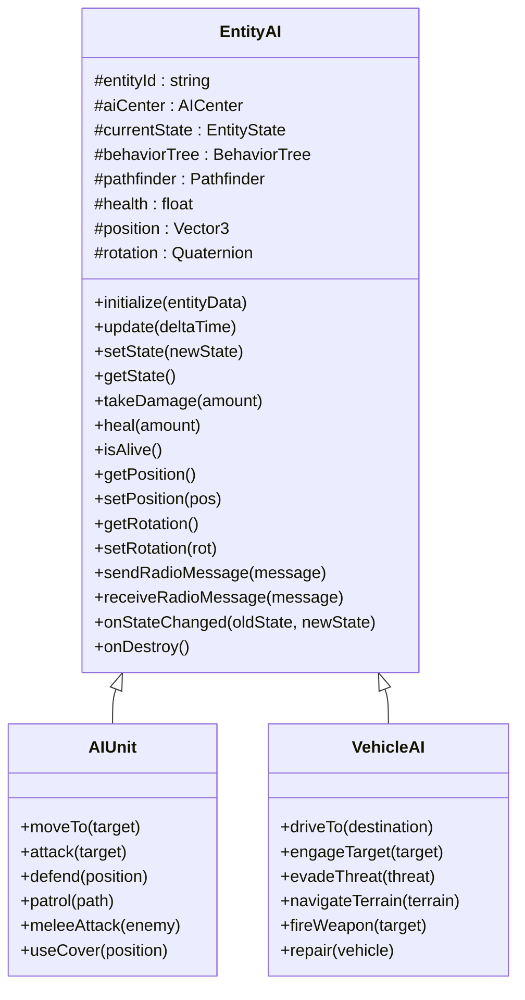
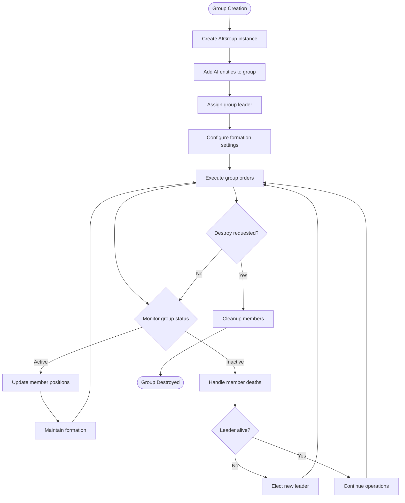
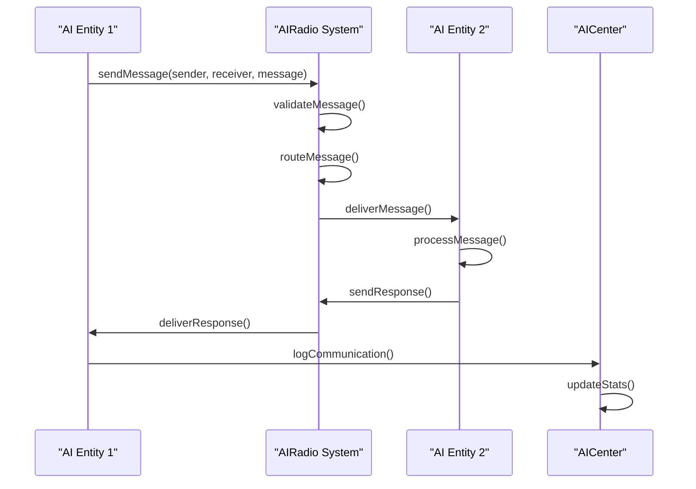
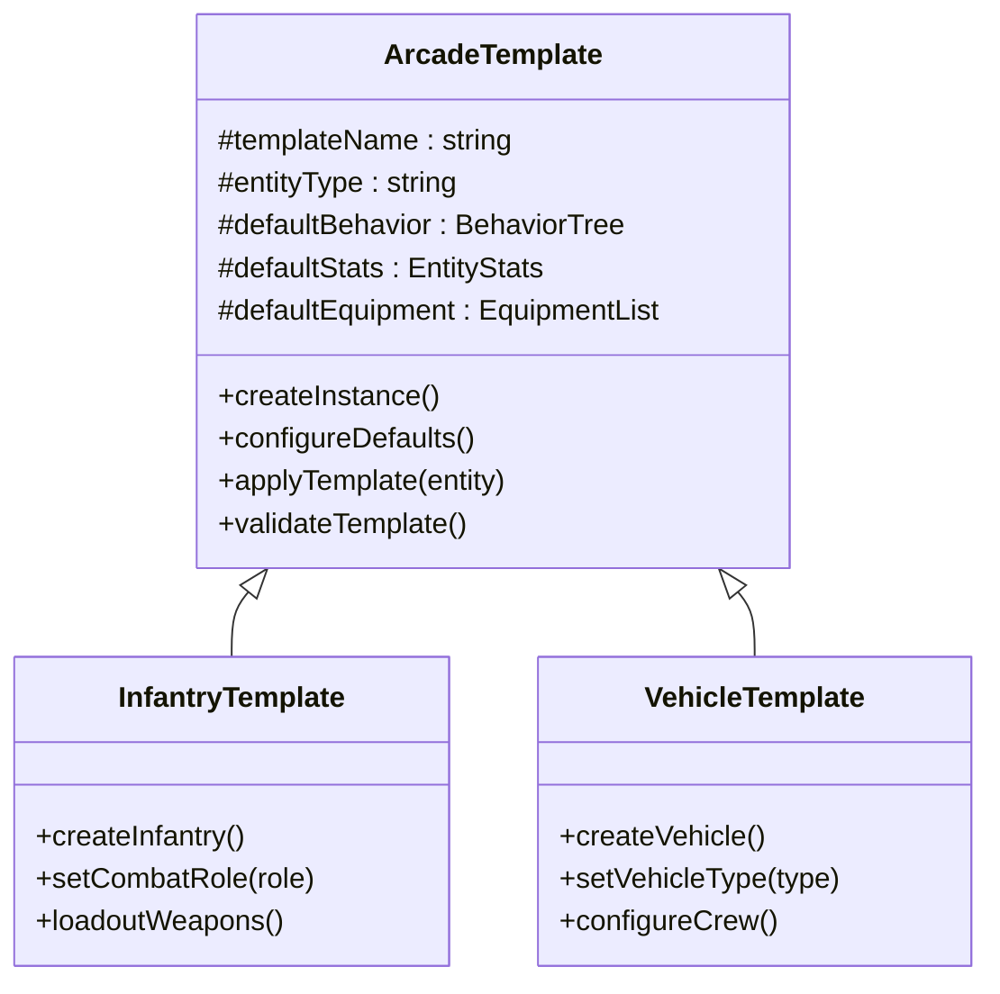
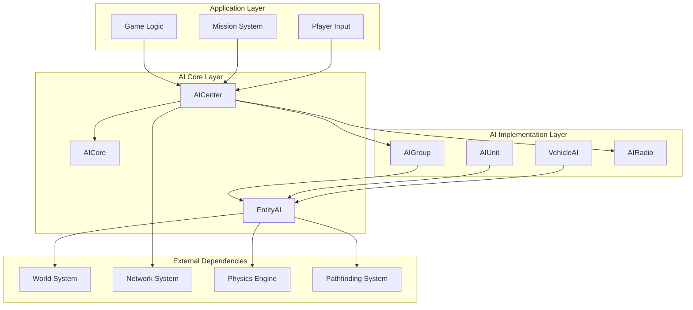

# AI Architecture and Centers

<cite>
**Referenced Files in This Document**
- [AI.hpp](file://engine/Poseidon/AI/AI.hpp)
- [AICenter.hpp](file://engine/Poseidon/AI/AICenter.hpp)
- [AICenter.cpp](file://engine/Poseidon/AI/AICenter.cpp)
- [AICenterImpl.cpp](file://engine/Poseidon/AI/AICenterImpl.cpp)
- [AICenterStats.cpp](file://engine/Poseidon/AI/AICenterStats.cpp)
- [AICore.hpp](file://engine/Poseidon/AI/AICore.hpp)
- [EntityAI.hpp](file://engine/Poseidon/AI/EntityAI.hpp)
- [EntityAI.cpp](file://engine/Poseidon/AI/EntityAI.cpp)
- [EntityAIType.hpp](file://engine/Poseidon/AI/EntityAIType.hpp)
- [AIUnit.hpp](file://engine/Poseidon/AI/AIUnit.hpp)
- [AIUnit.cpp](file://engine/Poseidon/AI/AIUnit.cpp)
- [VehicleAI.hpp](file://engine/Poseidon/AI/VehicleAI.hpp)
- [VehicleAI.cpp](file://engine/Poseidon/AI/VehicleAI.cpp)
- [AIGroup.hpp](file://engine/Poseidon/AI/AIGroup.hpp)
- [AIGroup.cpp](file://engine/Poseidon/AI/AIGroup.cpp)
- [AISubgroupFSM.cpp](file://engine/Poseidon/AI/AISubgroupFSM.cpp)
- [AIRadio.hpp](file://engine/Poseidon/AI/AIRadio.hpp)
- [AIRadioImpl.cpp](file://engine/Poseidon/AI/AIRadioImpl.cpp)
- [ArcadeTemplate.hpp](file://engine/Poseidon/AI/ArcadeTemplate.hpp)
- [ArcadeTemplate.cpp](file://engine/Poseidon/AI/ArcadeTemplate.cpp)
</cite>

## Table of Contents
1. [Introduction](#introduction)
2. [Project Structure](#project-structure)
3. [Core Components](#core-components)
4. [Architecture Overview](#architecture-overview)
5. [Detailed Component Analysis](#detailed-component-analysis)
6. [Dependency Analysis](#dependency-analysis)
7. [Performance Considerations](#performance-considerations)
8. [Troubleshooting Guide](#troubleshooting-guide)
9. [Conclusion](#conclusion)
10. [Appendices](#appendices)

## Introduction
This document explains the AI architecture and center systems used by the engine’s Poseidon subsystem. It focuses on how AI centers coordinate multiple entities, manage resources, and handle lifecycle events. The EntityAI base class provides common functionality to all AI units, while specialized classes like AIUnit and VehicleAI extend behavior for specific entity types. AICenter serves as the central coordinator for AI groups, subgroups, radio communication, and statistics. The documentation covers initialization, registration, cleanup, ownership models, and performance strategies for large-scale AI scenarios.

## Project Structure
The AI subsystem is organized under engine/Poseidon/AI with clear separation between core interfaces, implementations, and specialized behaviors:
- Core interfaces and types define the public API for AI centers, entities, and groups.
- Implementations encapsulate lifecycle management, group coordination, and radio messaging.
- Specialized AI classes provide unit and vehicle-specific logic.
- Arcade templates offer reusable behavioral patterns for quick setup.

**Diagram sources**
- [AICore.hpp](file://engine/Poseidon/AI/AICore.hpp)
- [AICenter.hpp](file://engine/Poseidon/AI/AICenter.hpp)
- [EntityAI.hpp](file://engine/Poseidon/AI/EntityAI.hpp)
- [AIUnit.hpp](file://engine/Poseidon/AI/AIUnit.hpp)
- [VehicleAI.hpp](file://engine/Poseidon/AI/VehicleAI.hpp)
- [AIGroup.hpp](file://engine/Poseidon/AI/AIGroup.hpp)
- [AIRadio.hpp](file://engine/Poseidon/AI/AIRadio.hpp)
- [ArcadeTemplate.hpp](file://engine/Poseidon/AI/ArcadeTemplate.hpp)

**Section sources**
- [AI.hpp](file://engine/Poseidon/AI/AI.hpp)
- [AICenter.hpp](file://engine/Poseidon/AI/AICenter.hpp)
- [EntityAI.hpp](file://engine/Poseidon/AI/EntityAI.hpp)

## Core Components
The AI system is built around several key components:
- **AICore**: Provides foundational services and global state for AI operations.
- **AICenter**: Central coordinator that manages AI groups, entities, and lifecycle events.
- **EntityAI**: Base class for all AI entities, offering common functionality like state management and event handling.
- **AIUnit**: Specialized AI for infantry or ground units.
- **VehicleAI**: Specialized AI for vehicles with driving and combat logic.
- **AIGroup**: Manages collections of AI entities and coordinates their actions.
- **AIRadio**: Handles communication between AI entities and groups.
- **ArcadeTemplate**: Reusable templates for common AI behaviors.

These components work together to create a scalable and flexible AI system that can handle complex scenarios with many entities.

**Section sources**
- [AICore.hpp](file://engine/Poseidon/AI/AICore.hpp)
- [AICenter.hpp](file://engine/Poseidon/AI/AICenter.hpp)
- [EntityAI.hpp](file://engine/Poseidon/AI/EntityAI.hpp)
- [AIUnit.hpp](file://engine/Poseidon/AI/AIUnit.hpp)
- [VehicleAI.hpp](file://engine/Poseidon/AI/VehicleAI.hpp)
- [AIGroup.hpp](file://engine/Poseidon/AI/AIGroup.hpp)
- [AIRadio.hpp](file://engine/Poseidon/AI/AIRadio.hpp)
- [ArcadeTemplate.hpp](file://engine/Poseidon/AI/ArcadeTemplate.hpp)

## Architecture Overview
The AI architecture follows a hierarchical pattern where AICenter acts as the root coordinator, managing multiple AIGroup instances. Each group contains various AI entities (AIUnit, VehicleAI) that inherit from EntityAI. Communication flows through AIRadio, allowing entities to send and receive messages. The system uses a component-based design where each AI entity has its own state machine and behavior tree.

**Diagram sources**
- [AICore.hpp](file://engine/Poseidon/AI/AICore.hpp)
- [AICenter.hpp](file://engine/Poseidon/AI/AICenter.hpp)
- [EntityAI.hpp](file://engine/Poseidon/AI/EntityAI.hpp)
- [AIUnit.hpp](file://engine/Poseidon/AI/AIUnit.hpp)
- [VehicleAI.hpp](file://engine/Poseidon/AI/VehicleAI.hpp)
- [AIGroup.hpp](file://engine/Poseidon/AI/AIGroup.hpp)
- [AIRadio.hpp](file://engine/Poseidon/AI/AIRadio.hpp)

## Detailed Component Analysis

### AICenter Class Hierarchy
The AICenter class serves as the primary coordinator for all AI operations. It maintains collections of AI groups and individual entities, providing methods for spawning, managing, and destroying AI objects. The center handles lifecycle events and coordinates updates across all managed entities.

**Diagram sources**
- [AICenter.hpp](file://engine/Poseidon/AI/AICenter.hpp)
- [AICenterImpl.cpp](file://engine/Poseidon/AI/AICenterImpl.cpp)

**Section sources**
- [AICenter.hpp](file://engine/Poseidon/AI/AICenter.hpp)
- [AICenter.cpp](file://engine/Poseidon/AI/AICenter.cpp)
- [AICenterImpl.cpp](file://engine/Poseidon/AI/AICenterImpl.cpp)

### EntityAI Base Class
EntityAI provides the foundation for all AI entities in the system. It includes common functionality such as state management, event handling, and communication capabilities. All specialized AI classes inherit from this base class to ensure consistent behavior across different entity types.

**Diagram sources**
- [EntityAI.hpp](file://engine/Poseidon/AI/EntityAI.hpp)
- [AIUnit.hpp](file://engine/Poseidon/AI/AIUnit.hpp)
- [VehicleAI.hpp](file://engine/Poseidon/AI/VehicleAI.hpp)

**Section sources**
- [EntityAI.hpp](file://engine/Poseidon/AI/EntityAI.hpp)
- [EntityAI.cpp](file://engine/Poseidon/AI/EntityAI.cpp)
- [AIUnit.hpp](file://engine/Poseidon/AI/AIUnit.hpp)
- [AIUnit.cpp](file://engine/Poseidon/AI/AIUnit.cpp)
- [VehicleAI.hpp](file://engine/Poseidon/AI/VehicleAI.hpp)
- [VehicleAI.cpp](file://engine/Poseidon/AI/VehicleAI.cpp)

### Group Management System
The group management system allows organizing AI entities into tactical units. Groups can execute coordinated commands, maintain formations, and share information about threats and objectives.

**Diagram sources**
- [AIGroup.hpp](file://engine/Poseidon/AI/AIGroup.hpp)
- [AIGroup.cpp](file://engine/Poseidon/AI/AIGroup.cpp)
- [AISubgroupFSM.cpp](file://engine/Poseidon/AI/AISubgroupFSM.cpp)

**Section sources**
- [AIGroup.hpp](file://engine/Poseidon/AI/AIGroup.hpp)
- [AIGroup.cpp](file://engine/Poseidon/AI/AIGroup.cpp)
- [AISubgroupFSM.cpp](file://engine/Poseidon/AI/AISubgroupFSM.cpp)

### Radio Communication System
The radio system enables communication between AI entities and groups. It supports point-to-point messaging, broadcasting, and channel-based communication for different types of information.

**Diagram sources**
- [AIRadio.hpp](file://engine/Poseidon/AI/AIRadio.hpp)
- [AIRadioImpl.cpp](file://engine/Poseidon/AI/AIRadioImpl.cpp)

**Section sources**
- [AIRadio.hpp](file://engine/Poseidon/AI/AIRadio.hpp)
- [AIRadioImpl.cpp](file://engine/Poseidon/AI/AIRadioImpl.cpp)

### Arcade Template System
Arcade templates provide pre-configured AI behaviors for common scenarios. These templates simplify the creation of AI units with predefined characteristics and behaviors.

**Diagram sources**
- [ArcadeTemplate.hpp](file://engine/Poseidon/AI/ArcadeTemplate.hpp)
- [ArcadeTemplate.cpp](file://engine/Poseidon/AI/ArcadeTemplate.cpp)

**Section sources**
- [ArcadeTemplate.hpp](file://engine/Poseidon/AI/ArcadeTemplate.hpp)
- [ArcadeTemplate.cpp](file://engine/Poseidon/AI/ArcadeTemplate.cpp)

## Dependency Analysis
The AI system exhibits clear dependency patterns with well-defined interfaces between components. AICenter depends on lower-level systems like AICore and AIRadio, while EntityAI provides a stable interface for specialized AI classes.

**Diagram sources**
- [AICore.hpp](file://engine/Poseidon/AI/AICore.hpp)
- [AICenter.hpp](file://engine/Poseidon/AI/AICenter.hpp)
- [EntityAI.hpp](file://engine/Poseidon/AI/EntityAI.hpp)

**Section sources**
- [AICore.hpp](file://engine/Poseidon/AI/AICore.hpp)
- [AICenter.hpp](file://engine/Poseidon/AI/AICenter.hpp)
- [EntityAI.hpp](file://engine/Poseidon/AI/EntityAI.hpp)

## Performance Considerations
Managing large numbers of AI entities requires careful attention to performance optimization. Key strategies include:

### Memory Management
- Use object pooling for frequently created/destroyed AI entities
- Implement efficient data structures for entity lookups and grouping
- Minimize memory allocations during update loops
- Use shared resources for common AI behaviors and data

### Update Optimization
- Implement spatial partitioning for collision detection and pathfinding
- Use level-of-detail (LOD) systems for distant entities
- Batch similar operations together for better cache locality
- Implement asynchronous processing for expensive calculations

### Communication Efficiency
- Use message queuing for radio communications
- Implement event-driven architecture to avoid polling
- Compress network messages for multiplayer scenarios
- Use interest management to limit updates to relevant entities

### Resource Sharing
- Share pathfinding results between nearby entities
- Cache commonly used calculations and data
- Implement lazy loading for expensive AI behaviors
- Use reference counting for shared resources

## Troubleshooting Guide

### Common Issues and Solutions

#### AI Entities Not Updating
- Verify AICenter update loop is running
- Check entity registration with AICenter
- Ensure entity state is not stuck in invalid state
- Validate update interval settings

#### Memory Leaks
- Monitor entity creation/destruction balance
- Check for circular references in entity relationships
- Verify proper cleanup in onDestroy methods
- Use memory profiling tools to identify leaks

#### Performance Problems
- Profile update times for individual entities
- Check for excessive pathfinding calculations
- Monitor memory usage patterns
- Analyze CPU utilization during AI updates

#### Communication Issues
- Verify radio system initialization
- Check message routing configuration
- Monitor message queue sizes
- Validate network connectivity in multiplayer

**Section sources**
- [AICenterStats.cpp](file://engine/Poseidon/AI/AICenterStats.cpp)

## Conclusion
The AI architecture provides a robust and scalable foundation for managing complex AI behaviors in the game world. The hierarchical structure with AICenter at the top ensures efficient coordination of multiple AI entities and groups. The EntityAI base class provides consistent functionality across different entity types, while specialized classes like AIUnit and VehicleAI offer domain-specific behaviors. The system's modular design allows for easy extension and customization, making it suitable for various game scenarios and requirements.

## Appendices

### Creating Custom AI Centers
To create a custom AI center, extend the AICenter class and implement specialized coordination logic:

1. Inherit from AICenter and override necessary methods
2. Implement custom entity spawning and management
3. Add specialized group coordination features
4. Integrate with existing AICore infrastructure
5. Test thoroughly with various entity combinations

### Extending Entity Behavior
To extend entity behavior beyond the base EntityAI functionality:

1. Create a new class inheriting from EntityAI or specialized classes
2. Override update methods for custom behavior
3. Implement state machines for complex decision-making
4. Add custom radio message handlers
5. Integrate with existing group and communication systems

### Best Practices
- Always call parent class methods when overriding
- Implement proper cleanup in destructor/onDestroy
- Use appropriate logging for debugging
- Follow naming conventions for consistency
- Test edge cases and error conditions
- Document custom behavior clearly