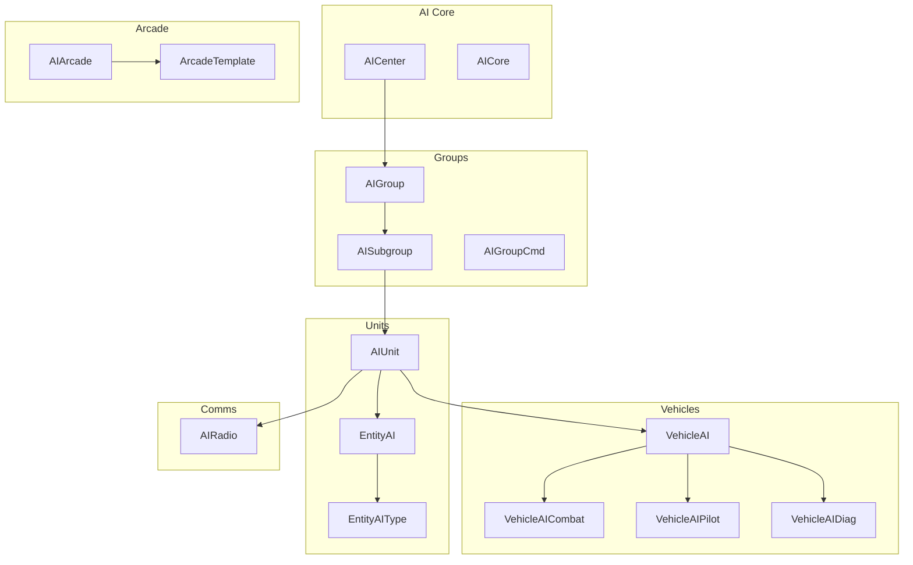
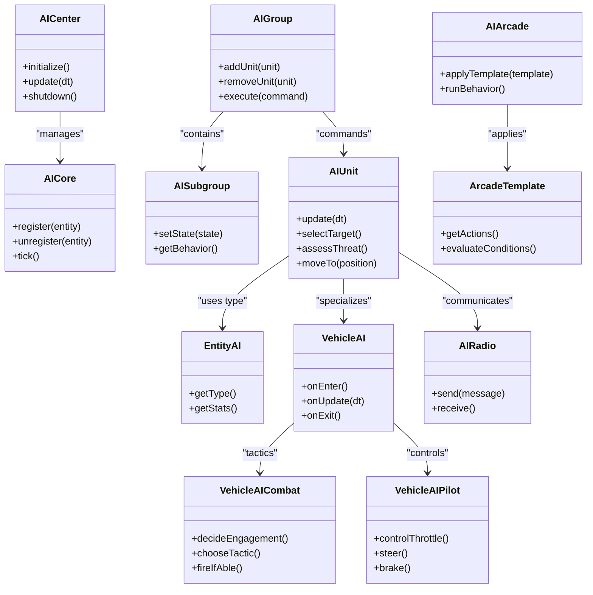
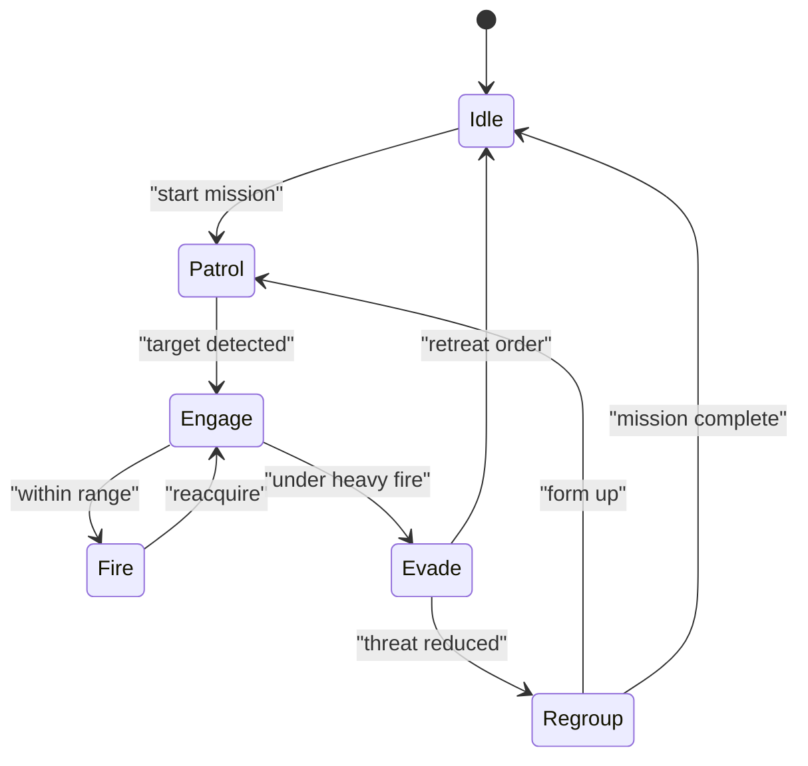
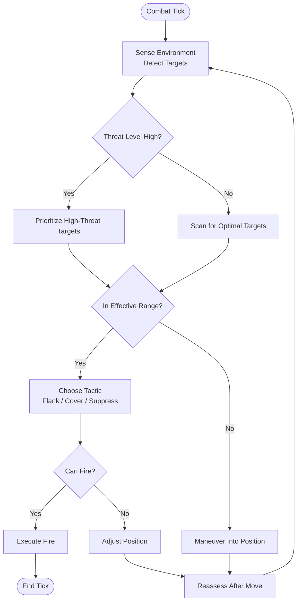
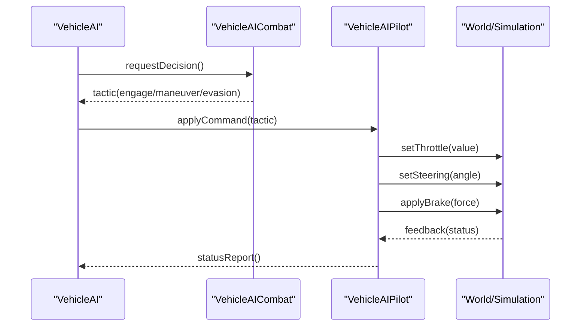
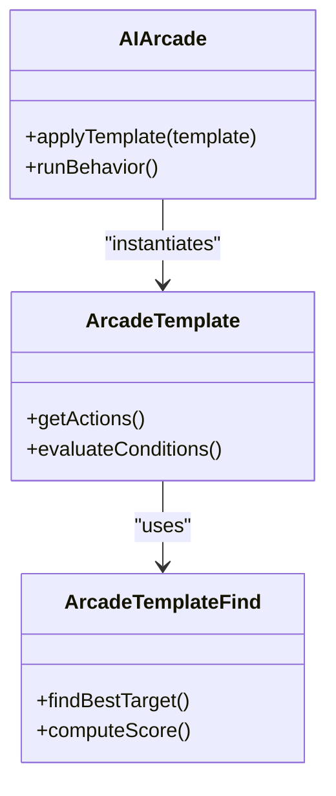
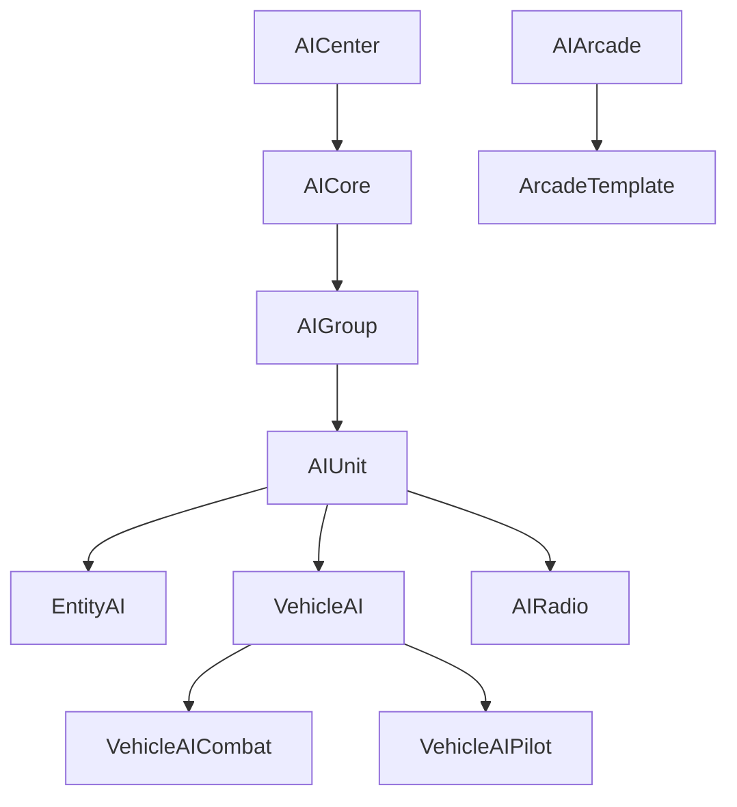

# AI Behavior Systems and Combat

<cite>
**Referenced Files in This Document**
- [AI.hpp](file://engine/Poseidon/AI/AI.hpp)
- [AICenter.cpp](file://engine/Poseidon/AI/AICenter.cpp)
- [AICenter.hpp](file://engine/Poseidon/AI/AICenter.hpp)
- [AICenterImpl.cpp](file://engine/Poseidon/AI/AICenterImpl.cpp)
- [AICore.hpp](file://engine/Poseidon/AI/AICore.hpp)
- [AIGroup.cpp](file://engine/Poseidon/AI/AIGroup.cpp)
- [AIGroup.hpp](file://engine/Poseidon/AI/AIGroup.hpp)
- [AIGroupCmd.cpp](file://engine/Poseidon/AI/AIGroupCmd.cpp)
- [AIGroupImpl.cpp](file://engine/Poseidon/AI/AIGroupImpl.cpp)
- [AIGroupImplHealth.cpp](file://engine/Poseidon/AI/AIGroupImplHealth.cpp)
- [AIRadio.cpp](file://engine/Poseidon/AI/AIRadio.cpp)
- [AIRadio.hpp](file://engine/Poseidon/AI/AIRadio.hpp)
- [AIRadioImpl.cpp](file://engine/Poseidon/AI/AIRadioImpl.cpp)
- [AISubgroup.cpp](file://engine/Poseidon/AI/AISubgroup.cpp)
- [AISubgroupFSM.cpp](file://engine/Poseidon/AI/AISubgroupFSM.cpp)
- [AISubgroupFSMSupply.inc](file://engine/Poseidon/AI/AISubgroupFSMSupply.inc)
- [AIUnit.cpp](file://engine/Poseidon/AI/AIUnit.cpp)
- [AIUnit.hpp](file://engine/Poseidon/AI/AIUnit.hpp)
- [AIUnitImpl.cpp](file://engine/Poseidon/AI/AIUnitImpl.cpp)
- [AIArcade.cpp](file://engine/Poseidon/AI/AIArcade.cpp)
- [AIArcadeActions.inc](file://engine/Poseidon/AI/AIArcadeActions.inc)
- [ArcadeTemplate.cpp](file://engine/Poseidon/AI/ArcadeTemplate.cpp)
- [ArcadeTemplate.hpp](file://engine/Poseidon/AI/ArcadeTemplate.hpp)
- [ArcadeTemplateFind.cpp](file://engine/Poseidon/AI/ArcadeTemplateFind.cpp)
- [EntityAI.cpp](file://engine/Poseidon/AI/EntityAI.cpp)
- [EntityAI.hpp](file://engine/Poseidon/AI/EntityAI.hpp)
- [EntityAIType.hpp](file://engine/Poseidon/AI/EntityAIType.hpp)
- [LicensePlateTextTuning.hpp](file://engine/Poseidon/AI/LicensePlateTextTuning.hpp)
- [TargetId.hpp](file://engine/Poseidon/AI/TargetId.hpp)
- [UnitNumberList.hpp](file://engine/Poseidon/AI/UnitNumberList.hpp)
- [VehicleAI.cpp](file://engine/Poseidon/AI/VehicleAI.cpp)
- [VehicleAI.hpp](file://engine/Poseidon/AI/VehicleAI.hpp)
- [VehicleAICombat.cpp](file://engine/Poseidon/AI/VehicleAICombat.cpp)
- [VehicleAIDiag.cpp](file://engine/Poseidon/AI/VehicleAIDiag.cpp)
- [VehicleAIPilot.cpp](file://engine/Poseidon/AI/VehicleAIPilot.cpp)
</cite>

## Table of Contents
1. [Introduction](#introduction)
2. [Project Structure](#project-structure)
3. [Core Components](#core-components)
4. [Architecture Overview](#architecture-overview)
5. [Detailed Component Analysis](#detailed-component-analysis)
6. [Dependency Analysis](#dependency-analysis)
7. [Performance Considerations](#performance-considerations)
8. [Troubleshooting Guide](#troubleshooting-guide)
9. [Conclusion](#conclusion)
10. [Appendices](#appendices)

## Introduction
This document explains the AI behavior systems and combat logic for vehicles and units, focusing on the VehicleAI hierarchy, combat decision-making, pilot behavior, and the AIArcade system for simplified behaviors. It covers state machines, target selection algorithms, threat assessment, and tactical engagement patterns such as flanking, cover usage, and coordinated attacks. Implementation details for ground vehicles, aircraft, and naval units are included, along with guidance for creating custom AI behaviors, implementing new combat doctrines, tuning difficulty, debugging, profiling, and performance considerations.

## Project Structure
The AI subsystem resides under engine/Poseidon/AI and is organized by responsibility:
- Core orchestration and lifecycle: AICenter, AICore
- Grouping and command processing: AIGroup, AISubgroup, AIGroupCmd
- Unit-level AI: AIUnit, EntityAI, EntityAIType
- Vehicle-specific AI: VehicleAI, VehicleAICombat, VehicleAIPilot, VehicleAIDiag
- Arcade-style simplified AI: AIArcade, ArcadeTemplate
- Utilities and data structures: TargetId, UnitNumberList, LicensePlateTextTuning
- Radio and communication: AIRadio

**Diagram sources**
- [AICenter.hpp](file://engine/Poseidon/AI/AICenter.hpp)
- [AICore.hpp](file://engine/Poseidon/AI/AICore.hpp)
- [AIGroup.hpp](file://engine/Poseidon/AI/AIGroup.hpp)
- [AISubgroupFSM.cpp](file://engine/Poseidon/AI/AISubgroupFSM.cpp)
- [AIUnit.hpp](file://engine/Poseidon/AI/AIUnit.hpp)
- [EntityAI.hpp](file://engine/Poseidon/AI/EntityAI.hpp)
- [EntityAIType.hpp](file://engine/Poseidon/AI/EntityAIType.hpp)
- [VehicleAI.hpp](file://engine/Poseidon/AI/VehicleAI.hpp)
- [VehicleAICombat.cpp](file://engine/Poseidon/AI/VehicleAICombat.cpp)
- [VehicleAIPilot.cpp](file://engine/Poseidon/AI/VehicleAIPilot.cpp)
- [VehicleAIDiag.cpp](file://engine/Poseidon/AI/VehicleAIDiag.cpp)
- [AIArcade.cpp](file://engine/Poseidon/AI/AIArcade.cpp)
- [ArcadeTemplate.hpp](file://engine/Poseidon/AI/ArcadeTemplate.hpp)
- [AIRadio.hpp](file://engine/Poseidon/AI/AIRadio.hpp)

**Section sources**
- [AICenter.hpp](file://engine/Poseidon/AI/AICenter.hpp)
- [AICore.hpp](file://engine/Poseidon/AI/AICore.hpp)
- [AIGroup.hpp](file://engine/Poseidon/AI/AIGroup.hpp)
- [AISubgroupFSM.cpp](file://engine/Poseidon/AI/AISubgroupFSM.cpp)
- [AIUnit.hpp](file://engine/Poseidon/AI/AIUnit.hpp)
- [EntityAI.hpp](file://engine/Poseidon/AI/EntityAI.hpp)
- [EntityAIType.hpp](file://engine/Poseidon/AI/EntityAIType.hpp)
- [VehicleAI.hpp](file://engine/Poseidon/AI/VehicleAI.hpp)
- [VehicleAICombat.cpp](file://engine/Poseidon/AI/VehicleAICombat.cpp)
- [VehicleAIPilot.cpp](file://engine/Poseidon/AI/VehicleAIPilot.cpp)
- [VehicleAIDiag.cpp](file://engine/Poseidon/AI/VehicleAIDiag.cpp)
- [AIArcade.cpp](file://engine/Poseidon/AI/AIArcade.cpp)
- [ArcadeTemplate.hpp](file://engine/Poseidon/AI/ArcadeTemplate.hpp)
- [AIRadio.hpp](file://engine/Poseidon/AI/AIRadio.hpp)

## Core Components
- AICenter and AICore manage global AI lifecycle, scheduling, and shared resources.
- AIGroup and AISubgroup organize units into hierarchical formations and execute commands via AIGroupCmd.
- AIUnit and EntityAI provide per-entity behavior, state, and interaction with the world.
- VehicleAI specializes behavior for vehicles; VehicleAICombat handles tactical decisions; VehicleAIPilot controls vehicle dynamics; VehicleAIDiag provides diagnostics.
- AIArcade offers simplified, template-driven behaviors for quick setup and predictable outcomes.
- AIRadio enables inter-unit communication and coordination signals.

Key responsibilities:
- Decision loops and state transitions (FSM)
- Target acquisition and prioritization
- Threat evaluation and evasion
- Movement and positioning (cover, flanking, formation)
- Coordination across groups/subgroups

**Section sources**
- [AICenter.cpp](file://engine/Poseidon/AI/AICenter.cpp)
- [AICenter.hpp](file://engine/Poseidon/AI/AICenter.hpp)
- [AICore.hpp](file://engine/Poseidon/AI/AICore.hpp)
- [AIGroup.cpp](file://engine/Poseidon/AI/AIGroup.cpp)
- [AIGroup.hpp](file://engine/Poseidon/AI/AIGroup.hpp)
- [AIGroupCmd.cpp](file://engine/Poseidon/AI/AIGroupCmd.cpp)
- [AIGroupImpl.cpp](file://engine/Poseidon/AI/AIGroupImpl.cpp)
- [AIGroupImplHealth.cpp](file://engine/Poseidon/AI/AIGroupImplHealth.cpp)
- [AISubgroupFSM.cpp](file://engine/Poseidon/AI/AISubgroupFSM.cpp)
- [AIUnit.cpp](file://engine/Poseidon/AI/AIUnit.cpp)
- [AIUnit.hpp](file://engine/Poseidon/AI/AIUnit.hpp)
- [AIUnitImpl.cpp](file://engine/Poseidon/AI/AIUnitImpl.cpp)
- [EntityAI.cpp](file://engine/Poseidon/AI/EntityAI.cpp)
- [EntityAI.hpp](file://engine/Poseidon/AI/EntityAI.hpp)
- [EntityAIType.hpp](file://engine/Poseidon/AI/EntityAIType.hpp)
- [VehicleAI.cpp](file://engine/Poseidon/AI/VehicleAI.cpp)
- [VehicleAI.hpp](file://engine/Poseidon/AI/VehicleAI.hpp)
- [VehicleAICombat.cpp](file://engine/Poseidon/AI/VehicleAICombat.cpp)
- [VehicleAIPilot.cpp](file://engine/Poseidon/AI/VehicleAIPilot.cpp)
- [VehicleAIDiag.cpp](file://engine/Poseidon/AI/VehicleAIDiag.cpp)
- [AIArcade.cpp](file://engine/Poseidon/AI/AIArcade.cpp)
- [AIArcadeActions.inc](file://engine/Poseidon/AI/AIArcadeActions.inc)
- [ArcadeTemplate.cpp](file://engine/Poseidon/AI/ArcadeTemplate.cpp)
- [ArcadeTemplate.hpp](file://engine/Poseidon/AI/ArcadeTemplate.hpp)
- [ArcadeTemplateFind.cpp](file://engine/Poseidon/AI/ArcadeTemplateFind.cpp)
- [AIRadio.cpp](file://engine/Poseidon/AI/AIRadio.cpp)
- [AIRadio.hpp](file://engine/Poseidon/AI/AIRadio.hpp)
- [AIRadioImpl.cpp](file://engine/Poseidon/AI/AIRadioImpl.cpp)

## Architecture Overview
The AI architecture separates concerns between orchestration, grouping, unit behavior, and vehicle specialization. FSMs drive state transitions for both groups and individual units. VehicleAI extends base unit behavior with domain-specific tactics and pilot control. AIArcade provides a high-level abstraction for common behaviors without deep customization.

**Diagram sources**
- [AICenter.hpp](file://engine/Poseidon/AI/AICenter.hpp)
- [AICore.hpp](file://engine/Poseidon/AI/AICore.hpp)
- [AIGroup.hpp](file://engine/Poseidon/AI/AIGroup.hpp)
- [AISubgroupFSM.cpp](file://engine/Poseidon/AI/AISubgroupFSM.cpp)
- [AIUnit.hpp](file://engine/Poseidon/AI/AIUnit.hpp)
- [EntityAI.hpp](file://engine/Poseidon/AI/EntityAI.hpp)
- [VehicleAI.hpp](file://engine/Poseidon/AI/VehicleAI.hpp)
- [VehicleAICombat.cpp](file://engine/Poseidon/AI/VehicleAICombat.cpp)
- [VehicleAIPilot.cpp](file://engine/Poseidon/AI/VehicleAIPilot.cpp)
- [AIArcade.cpp](file://engine/Poseidon/AI/AIArcade.cpp)
- [ArcadeTemplate.hpp](file://engine/Poseidon/AI/ArcadeTemplate.hpp)
- [AIRadio.hpp](file://engine/Poseidon/AI/AIRadio.hpp)

## Detailed Component Analysis

### VehicleAI Hierarchy and State Machines
VehicleAI encapsulates per-vehicle behavior, delegating tactical decisions to VehicleAICombat and low-level control to VehicleAIPilot. The FSM governs states such as patrol, engage, evade, and regroup. Transitions are driven by sensor inputs, threat levels, and group commands.

**Diagram sources**
- [AISubgroupFSM.cpp](file://engine/Poseidon/AI/AISubgroupFSM.cpp)
- [VehicleAI.hpp](file://engine/Poseidon/AI/VehicleAI.hpp)
- [VehicleAICombat.cpp](file://engine/Poseidon/AI/VehicleAICombat.cpp)
- [VehicleAIPilot.cpp](file://engine/Poseidon/AI/VehicleAIPilot.cpp)

**Section sources**
- [VehicleAI.cpp](file://engine/Poseidon/AI/VehicleAI.cpp)
- [VehicleAI.hpp](file://engine/Poseidon/AI/VehicleAI.hpp)
- [AISubgroupFSM.cpp](file://engine/Poseidon/AI/AISubgroupFSM.cpp)

### Combat Decision-Making and Target Selection
VehicleAICombat evaluates threats, selects targets, and chooses tactics based on distance, line-of-sight, terrain, and unit capabilities. Target selection considers proximity, vulnerability, and strategic value. Threat assessment incorporates incoming fire, weapon ranges, and environmental hazards.

**Diagram sources**
- [VehicleAICombat.cpp](file://engine/Poseidon/AI/VehicleAICombat.cpp)
- [AIUnit.hpp](file://engine/Poseidon/AI/AIUnit.hpp)
- [TargetId.hpp](file://engine/Poseidon/AI/TargetId.hpp)

**Section sources**
- [VehicleAICombat.cpp](file://engine/Poseidon/AI/VehicleAICombat.cpp)
- [AIUnit.cpp](file://engine/Poseidon/AI/AIUnit.cpp)
- [AIUnit.hpp](file://engine/Poseidon/AI/AIUnit.hpp)
- [TargetId.hpp](file://engine/Poseidon/AI/TargetId.hpp)

### Pilot Behavior Systems
VehicleAIPilot translates high-level commands into vehicle dynamics: throttle, steering, braking, and mode switching. It accounts for vehicle type constraints (ground, air, naval), terrain interaction, and stability.

**Diagram sources**
- [VehicleAI.hpp](file://engine/Poseidon/AI/VehicleAI.hpp)
- [VehicleAICombat.cpp](file://engine/Poseidon/AI/VehicleAICombat.cpp)
- [VehicleAIPilot.cpp](file://engine/Poseidon/AI/VehicleAIPilot.cpp)

**Section sources**
- [VehicleAIPilot.cpp](file://engine/Poseidon/AI/VehicleAIPilot.cpp)
- [VehicleAI.hpp](file://engine/Poseidon/AI/VehicleAI.hpp)

### AIArcade System for Simplified Behaviors
AIArcade applies predefined templates to quickly configure AI behavior. ArcadeTemplate defines actions and conditions, enabling rapid iteration and consistent outcomes.

**Diagram sources**
- [AIArcade.cpp](file://engine/Poseidon/AI/AIArcade.cpp)
- [AIArcadeActions.inc](file://engine/Poseidon/AI/AIArcadeActions.inc)
- [ArcadeTemplate.hpp](file://engine/Poseidon/AI/ArcadeTemplate.hpp)
- [ArcadeTemplateFind.cpp](file://engine/Poseidon/AI/ArcadeTemplateFind.cpp)

**Section sources**
- [AIArcade.cpp](file://engine/Poseidon/AI/AIArcade.cpp)
- [AIArcadeActions.inc](file://engine/Poseidon/AI/AIArcadeActions.inc)
- [ArcadeTemplate.cpp](file://engine/Poseidon/AI/ArcadeTemplate.cpp)
- [ArcadeTemplate.hpp](file://engine/Poseidon/AI/ArcadeTemplate.hpp)
- [ArcadeTemplateFind.cpp](file://engine/Poseidon/AI/ArcadeTemplateFind.cpp)

### Ground Vehicles, Aircraft, and Naval Units
VehicleAI differentiates behavior by vehicle type:
- Ground vehicles: focus on cover usage, hull-down positions, and flanking through terrain features.
- Aircraft: emphasize altitude management, energy retention, and vertical maneuvering.
- Naval units: consider water currents, visibility, and long-range engagements.

Implementation specifics are handled within VehicleAI and VehicleAICombat, leveraging entity types and simulation feedback.

**Section sources**
- [VehicleAI.cpp](file://engine/Poseidon/AI/VehicleAI.cpp)
- [VehicleAI.hpp](file://engine/Poseidon/AI/VehicleAI.hpp)
- [VehicleAICombat.cpp](file://engine/Poseidon/AI/VehicleAICombat.cpp)
- [EntityAIType.hpp](file://engine/Poseidon/AI/EntityAIType.hpp)

### Tactical Engagement Patterns
Common tactics include:
- Flanking maneuvers: reposition to exploit enemy blind spots.
- Cover usage: utilize terrain and obstacles to reduce exposure.
- Coordinated attacks: synchronize fire and movement across groups/subgroups using radio signals.

These patterns are orchestrated by VehicleAICombat and guided by group commands and FSM states.

**Section sources**
- [VehicleAICombat.cpp](file://engine/Poseidon/AI/VehicleAICombat.cpp)
- [AIGroupCmd.cpp](file://engine/Poseidon/AI/AIGroupCmd.cpp)
- [AIRadio.cpp](file://engine/Poseidon/AI/AIRadio.cpp)

### Creating Custom AI Behaviors
To implement custom behaviors:
- Extend AIUnit or VehicleAI to add specialized logic.
- Define new FSM states and transitions in AISubgroupFSM.
- Create ArcadeTemplate entries for simplified configurations.
- Use AIRadio to coordinate multi-unit actions.

Guidance:
- Keep decision loops efficient and deterministic where possible.
- Leverage existing utilities for target selection and threat assessment.
- Test behaviors in isolation before integrating into groups.

**Section sources**
- [AIUnit.hpp](file://engine/Poseidon/AI/AIUnit.hpp)
- [VehicleAI.hpp](file://engine/Poseidon/AI/VehicleAI.hpp)
- [AISubgroupFSM.cpp](file://engine/Poseidon/AI/AISubgroupFSM.cpp)
- [ArcadeTemplate.hpp](file://engine/Poseidon/AI/ArcadeTemplate.hpp)
- [AIRadio.hpp](file://engine/Poseidon/AI/AIRadio.hpp)

### Implementing New Combat Doctrines
Combat doctrines define preferred tactics and priorities:
- Aggressive: prioritize close-range engagements and suppression.
- Defensive: emphasize cover and counterattacks.
- Maneuver-focused: prioritize flanking and positional advantage.

Implement by adjusting VehicleAICombat parameters and group command weights.

**Section sources**
- [VehicleAICombat.cpp](file://engine/Poseidon/AI/VehicleAICombat.cpp)
- [AIGroupImpl.cpp](file://engine/Poseidon/AI/AIGroupImpl.cpp)

### Tuning AI Difficulty Settings
Difficulty affects:
- Reaction times and accuracy
- Aggressiveness and risk tolerance
- Coordination quality and communication frequency

Adjust via configuration in AICenter or group settings.

**Section sources**
- [AICenter.cpp](file://engine/Poseidon/AI/AICenter.cpp)
- [AIGroupImpl.cpp](file://engine/Poseidon/AI/AIGroupImpl.cpp)

## Dependency Analysis
The AI subsystem exhibits clear layering:
- AICenter/AICore depend on core engine services.
- Groups depend on units and commands.
- Units depend on entity types and world simulation.
- VehicleAI depends on VehicleAICombat and VehicleAIPilot.
- AIArcade depends on ArcadeTemplate definitions.

Potential circular dependencies are minimized by separating FSM logic from execution and using interfaces for communication.

**Diagram sources**
- [AICenter.hpp](file://engine/Poseidon/AI/AICenter.hpp)
- [AICore.hpp](file://engine/Poseidon/AI/AICore.hpp)
- [AIGroup.hpp](file://engine/Poseidon/AI/AIGroup.hpp)
- [AIUnit.hpp](file://engine/Poseidon/AI/AIUnit.hpp)
- [EntityAI.hpp](file://engine/Poseidon/AI/EntityAI.hpp)
- [VehicleAI.hpp](file://engine/Poseidon/AI/VehicleAI.hpp)
- [VehicleAICombat.cpp](file://engine/Poseidon/AI/VehicleAICombat.cpp)
- [VehicleAIPilot.cpp](file://engine/Poseidon/AI/VehicleAIPilot.cpp)
- [AIArcade.cpp](file://engine/Poseidon/AI/AIArcade.cpp)
- [ArcadeTemplate.hpp](file://engine/Poseidon/AI/ArcadeTemplate.hpp)
- [AIRadio.hpp](file://engine/Poseidon/AI/AIRadio.hpp)

**Section sources**
- [AICenter.cpp](file://engine/Poseidon/AI/AICenter.cpp)
- [AICore.hpp](file://engine/Poseidon/AI/AICore.hpp)
- [AIGroup.cpp](file://engine/Poseidon/AI/AIGroup.cpp)
- [AIUnit.cpp](file://engine/Poseidon/AI/AIUnit.cpp)
- [VehicleAI.cpp](file://engine/Poseidon/AI/VehicleAI.cpp)
- [AIArcade.cpp](file://engine/Poseidon/AI/AIArcade.cpp)

## Performance Considerations
- Batch updates: group multiple AI ticks to reduce overhead.
- Caching: reuse computed paths and target scores where safe.
- LOD: simplify decision trees for distant or non-critical units.
- Profiling: use built-in profiling hooks to identify hotspots.
- Threading: offload heavy computations to task pools if available.

[No sources needed since this section provides general guidance]

## Troubleshooting Guide
Use VehicleAIDiag to inspect AI states, decisions, and performance metrics. Common issues:
- Stuck units: verify pathfinding and obstacle detection.
- Inconsistent targeting: check line-of-sight and sensor ranges.
- Poor coordination: review radio messages and group commands.

Debugging steps:
- Enable diagnostic logs for AIUnit and VehicleAI.
- Visualize FSM states and transitions.
- Isolate problematic units in single-player scenarios.

**Section sources**
- [VehicleAIDiag.cpp](file://engine/Poseidon/AI/VehicleAIDiag.cpp)
- [AIUnit.cpp](file://engine/Poseidon/AI/AIUnit.cpp)
- [VehicleAI.cpp](file://engine/Poseidon/AI/VehicleAI.cpp)

## Conclusion
The AI subsystem provides a robust framework for vehicle and unit behavior, combining structured state machines, tactical decision-making, and flexible customization. By leveraging VehicleAI, VehicleAICombat, and AIArcade, developers can create realistic and responsive AI for diverse vehicle types and combat scenarios. Proper tuning, debugging, and performance optimization ensure scalable and engaging gameplay.

[No sources needed since this section summarizes without analyzing specific files]

## Appendices

### Example: Creating a Custom Arcade Template
Steps:
- Define an ArcadeTemplate with desired actions and conditions.
- Register the template with AIArcade.
- Apply the template to units during initialization.

**Section sources**
- [ArcadeTemplate.hpp](file://engine/Poseidon/AI/ArcadeTemplate.hpp)
- [AIArcade.cpp](file://engine/Poseidon/AI/AIArcade.cpp)

### Example: Implementing a New Tactic
Steps:
- Extend VehicleAICombat to add tactic logic.
- Integrate with FSM transitions in AISubgroupFSM.
- Test with group commands and radio coordination.

**Section sources**
- [VehicleAICombat.cpp](file://engine/Poseidon/AI/VehicleAICombat.cpp)
- [AISubgroupFSM.cpp](file://engine/Poseidon/AI/AISubgroupFSM.cpp)