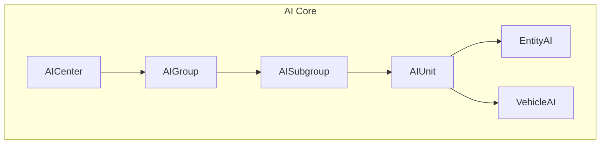
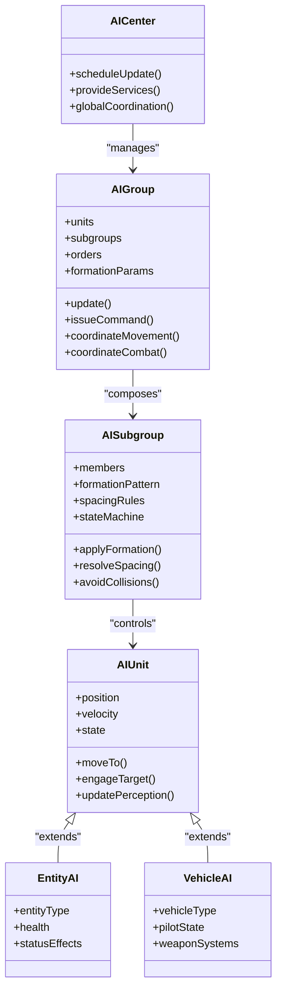
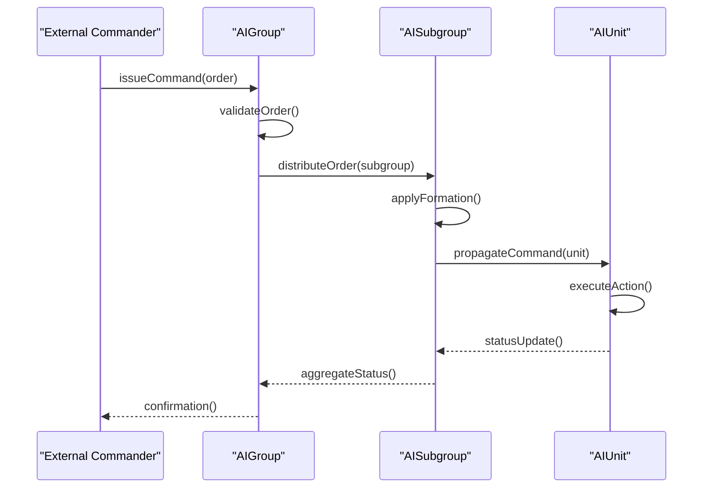
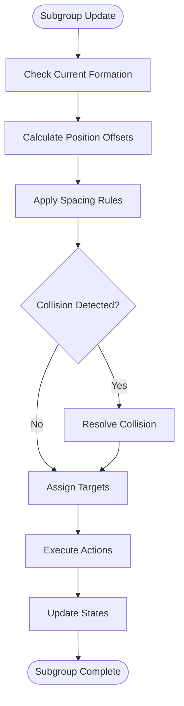
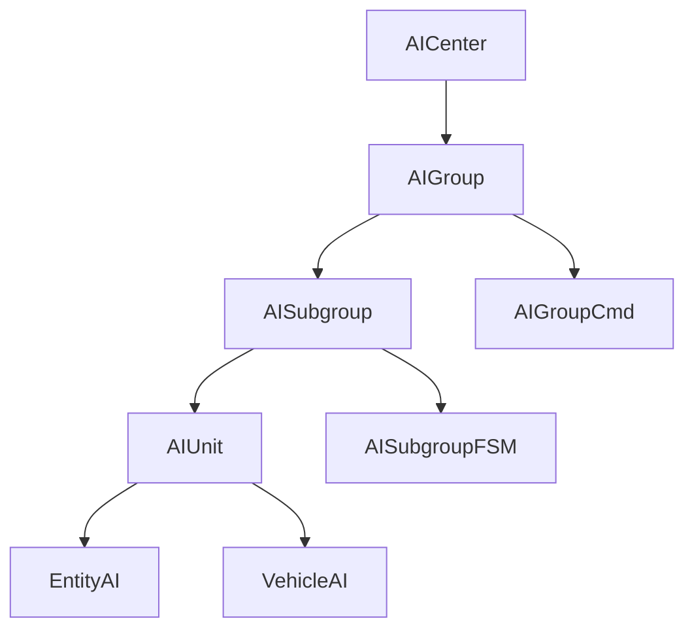

# AI Groups and Unit Management

<cite>
**Referenced Files in This Document**
- [AIGroup.hpp](file://engine/Poseidon/AI/AIGroup.hpp)
- [AIGroup.cpp](file://engine/Poseidon/AI/AIGroup.cpp)
- [AIGroupImpl.cpp](file://engine/Poseidon/AI/AIGroupImpl.cpp)
- [AIGroupCmd.cpp](file://engine/Poseidon/AI/AIGroupCmd.cpp)
- [AISubgroup.cpp](file://engine/Poseidon/AI/AISubgroup.cpp)
- [AISubgroupFSM.cpp](file://engine/Poseidon/AI/AISubgroupFSM.cpp)
- [AIUnit.hpp](file://engine/Poseidon/AI/AIUnit.hpp)
- [AIUnitImpl.cpp](file://engine/Poseidon/AI/AIUnitImpl.cpp)
- [AICenter.hpp](file://engine/Poseidon/AI/AICenter.hpp)
- [AICenter.cpp](file://engine/Poseidon/AI/AICenter.cpp)
- [EntityAI.hpp](file://engine/Poseidon/AI/EntityAI.hpp)
- [VehicleAI.hpp](file://engine/Poseidon/AI/VehicleAI.hpp)
</cite>

## Table of Contents
1. [Introduction](#introduction)
2. [Project Structure](#project-structure)
3. [Core Components](#core-components)
4. [Architecture Overview](#architecture-overview)
5. [Detailed Component Analysis](#detailed-component-analysis)
6. [Dependency Analysis](#dependency-analysis)
7. [Performance Considerations](#performance-considerations)
8. [Troubleshooting Guide](#troubleshooting-guide)
9. [Conclusion](#conclusion)
10. [Appendices](#appendices)

## Introduction
This document explains the AI group management and unit control systems implemented in the Poseidon AI subsystem. It focuses on how groups are structured, how subgroups organize units into formations, and how commands propagate from group leaders to individual units. It also covers movement coordination, combat actions, tactical decision-making, formation maintenance, spacing algorithms, collision avoidance, and performance strategies for large-scale AI operations.

## Project Structure
The AI subsystem is organized under engine/Poseidon/AI with clear separation between high-level group logic, subgroup behavior, and per-unit implementation:
- Group orchestration and command handling live in AIGroup* files
- Subgroup organization and state machines are implemented in AISubgroup* files
- Per-unit behavior and vehicle-specific logic are in AIUnit*, VehicleAI*, and EntityAI*
- Central AI coordination and global services are provided by AICenter*

**Diagram sources**
- [AICenter.hpp](file://engine/Poseidon/AI/AICenter.hpp)
- [AIGroup.hpp](file://engine/Poseidon/AI/AIGroup.hpp)
- [AISubgroup.cpp](file://engine/Poseidon/AI/AISubgroup.cpp)
- [AIUnit.hpp](file://engine/Poseidon/AI/AIUnit.hpp)
- [EntityAI.hpp](file://engine/Poseidon/AI/EntityAI.hpp)
- [VehicleAI.hpp](file://engine/Poseidon/AI/VehicleAI.hpp)

**Section sources**
- [AIGroup.hpp](file://engine/Poseidon/AI/AIGroup.hpp)
- [AIGroup.cpp](file://engine/Poseidon/AI/AIGroup.cpp)
- [AISubgroup.cpp](file://engine/Poseidon/AI/AISubgroup.cpp)
- [AIUnit.hpp](file://engine/Poseidon/AI/AIUnit.hpp)
- [AICenter.hpp](file://engine/Poseidon/AI/AICenter.hpp)

## Core Components
- AIGroup: Manages a collection of AI units or vehicles, coordinates movement and combat, and delegates tasks to subgroups. It holds group state, orders, and formation parameters.
- AISubgroup: Represents a logical subdivision within a group (e.g., fire team, squad). It encapsulates formation patterns, spacing rules, and local coordination.
- AIUnit: The base class for individual AI entities, exposing movement, perception, and action interfaces.
- EntityAI and VehicleAI: Specialized implementations providing entity-level and vehicle-specific behaviors (navigation, piloting, weapon systems).
- AICenter: Global AI coordinator that schedules updates, manages resources, and provides cross-group services.

Key responsibilities:
- Command propagation from AIGroup to AISubgroup to AIUnit
- Formation maintenance and spacing calculations
- Collision avoidance among friendly units
- Combat targeting and engagement decisions
- State synchronization across group members

**Section sources**
- [AIGroup.hpp](file://engine/Poseidon/AI/AIGroup.hpp)
- [AIGroupImpl.cpp](file://engine/Poseidon/AI/AIGroupImpl.cpp)
- [AISubgroup.cpp](file://engine/Poseidon/AI/AISubgroup.cpp)
- [AISubgroupFSM.cpp](file://engine/Poseidon/AI/AISubgroupFSM.cpp)
- [AIUnit.hpp](file://engine/Poseidon/AI/AIUnit.hpp)
- [AIUnitImpl.cpp](file://engine/Poseidon/AI/AIUnitImpl.cpp)
- [EntityAI.hpp](file://engine/Poseidon/AI/EntityAI.hpp)
- [VehicleAI.hpp](file://engine/Poseidon/AI/VehicleAI.hpp)
- [AICenter.hpp](file://engine/Poseidon/AI/AICenter.hpp)

## Architecture Overview
The AI system follows a hierarchical architecture where AIGroup acts as the top-level commander, delegating to AISubgroup instances which manage localized formation and spacing. AIUnit instances execute concrete actions based on received commands.

**Diagram sources**
- [AICenter.hpp](file://engine/Poseidon/AI/AICenter.hpp)
- [AIGroup.hpp](file://engine/Poseidon/AI/AIGroup.hpp)
- [AISubgroup.cpp](file://engine/Poseidon/AI/AISubgroup.cpp)
- [AIUnit.hpp](file://engine/Poseidon/AI/AIUnit.hpp)
- [EntityAI.hpp](file://engine/Poseidon/AI/EntityAI.hpp)
- [VehicleAI.hpp](file://engine/Poseidon/AI/VehicleAI.hpp)

## Detailed Component Analysis

### AIGroup: Group Orchestration and Command Propagation
AIGroup serves as the central coordinator for AI units and subgroups. It processes incoming commands, maintains formation parameters, and delegates execution to subgroups. Movement coordination involves calculating target positions, applying formation offsets, and ensuring smooth transitions between states. Combat coordination includes target selection, engagement rules, and firing discipline.

Key operations:
- Command parsing and validation
- Subgroup assignment and reassignment
- Formation parameter updates
- Movement path planning coordination
- Combat order distribution

**Diagram sources**
- [AIGroup.cpp](file://engine/Poseidon/AI/AIGroup.cpp)
- [AIGroupCmd.cpp](file://engine/Poseidon/AI/AIGroupCmd.cpp)
- [AISubgroup.cpp](file://engine/Poseidon/AI/AISubgroup.cpp)
- [AIUnitImpl.cpp](file://engine/Poseidon/AI/AIUnitImpl.cpp)

**Section sources**
- [AIGroup.hpp](file://engine/Poseidon/AI/AIGroup.hpp)
- [AIGroup.cpp](file://engine/Poseidon/AI/AIGroup.cpp)
- [AIGroupCmd.cpp](file://engine/Poseidon/AI/AIGroupCmd.cpp)
- [AIGroupImpl.cpp](file://engine/Poseidon/AI/AIGroupImpl.cpp)

### AISubgroup: Subgroup Organization and Formation Management
AISubgroup manages a subset of units within an AIGroup, implementing formation patterns and spacing algorithms. It handles local coordination, collision avoidance, and dynamic reassignment of units within the subgroup. The FSM (Finite State Machine) governs behavioral states such as moving, engaging, suppressing, and regrouping.

Formation maintenance involves:
- Calculating relative positions based on formation pattern
- Applying spacing constraints to prevent overcrowding
- Implementing collision avoidance between friendly units
- Handling unit loss and dynamic reorganization

**Diagram sources**
- [AISubgroup.cpp](file://engine/Poseidon/AI/AISubgroup.cpp)
- [AISubgroupFSM.cpp](file://engine/Poseidon/AI/AISubgroupFSM.cpp)

**Section sources**
- [AISubgroup.cpp](file://engine/Poseidon/AI/AISubgroup.cpp)
- [AISubgroupFSM.cpp](file://engine/Poseidon/AI/AISubgroupFSM.cpp)

### AIUnit: Individual Unit Behavior and State Management
AIUnit represents individual AI entities with movement, perception, and action capabilities. It implements the core interface for movement commands, target engagement, and state synchronization. VehicleAI extends this functionality for vehicular units with specialized piloting and weapon systems.

Unit lifecycle includes:
- Initialization and configuration
- Movement execution and path following
- Perception updates and threat assessment
- Action execution and feedback reporting
- Health and status management

**Section sources**
- [AIUnit.hpp](file://engine/Poseidon/AI/AIUnit.hpp)
- [AIUnitImpl.cpp](file://engine/Poseidon/AI/AIUnitImpl.cpp)
- [EntityAI.hpp](file://engine/Poseidon/AI/EntityAI.hpp)
- [VehicleAI.hpp](file://engine/Poseidon/AI/VehicleAI.hpp)

### AICenter: Central AI Coordination
AICenter provides global AI services including update scheduling, resource management, and cross-group coordination. It ensures efficient processing of AI logic across all active groups and subgroups.

**Section sources**
- [AICenter.hpp](file://engine/Poseidon/AI/AICenter.hpp)
- [AICenter.cpp](file://engine/Poseidon/AI/AICenter.cpp)

## Dependency Analysis
The AI system exhibits clear hierarchical dependencies with well-defined interfaces between components:

**Diagram sources**
- [AICenter.hpp](file://engine/Poseidon/AI/AICenter.hpp)
- [AIGroup.hpp](file://engine/Poseidon/AI/AIGroup.hpp)
- [AISubgroup.cpp](file://engine/Poseidon/AI/AISubgroup.cpp)
- [AIUnit.hpp](file://engine/Poseidon/AI/AIUnit.hpp)
- [AIGroupCmd.cpp](file://engine/Poseidon/AI/AIGroupCmd.cpp)
- [AISubgroupFSM.cpp](file://engine/Poseidon/AI/AISubgroupFSM.cpp)

**Section sources**
- [AIGroup.hpp](file://engine/Poseidon/AI/AIGroup.hpp)
- [AISubgroup.cpp](file://engine/Poseidon/AI/AISubgroup.cpp)
- [AIUnit.hpp](file://engine/Poseidon/AI/AIUnit.hpp)

## Performance Considerations
For large-scale AI operations, several optimization strategies are employed:

- **Command Batching**: Commands are batched and processed in groups to reduce overhead
- **Efficient State Updates**: State changes are minimized and synchronized efficiently
- **Spatial Partitioning**: Units are organized spatially for faster collision detection and neighbor queries
- **Lazy Evaluation**: Expensive calculations are deferred until needed
- **Resource Pooling**: Common resources are pooled to reduce allocation overhead

Key performance areas:
- Movement calculation optimization
- Formation update efficiency
- Collision detection algorithms
- Memory usage patterns
- Update frequency management

[No sources needed since this section provides general guidance]

## Troubleshooting Guide
Common issues and their solutions:

- **Formation Breakdown**: Check spacing algorithms and collision avoidance settings
- **Command Lag**: Verify command batching and propagation delays
- **Unit Stacking**: Review collision resolution and spacing constraints
- **Performance Issues**: Monitor update frequencies and optimize expensive operations
- **State Desynchronization**: Ensure proper state synchronization mechanisms

Debugging approaches:
- Enable detailed logging for AI operations
- Use visualization tools to inspect formations
- Profile AI update cycles for bottlenecks
- Test with reduced unit counts for isolation

**Section sources**
- [AIGroupImpl.cpp](file://engine/Poseidon/AI/AIGroupImpl.cpp)
- [AISubgroupFSM.cpp](file://engine/Poseidon/AI/AISubgroupFSM.cpp)
- [AIUnitImpl.cpp](file://engine/Poseidon/AI/AIUnitImpl.cpp)

## Conclusion
The AI group management system provides a robust framework for coordinating large numbers of AI units through hierarchical organization and efficient command propagation. The separation between group-level coordination and unit-level execution enables scalable and maintainable AI behavior. Proper implementation of formation algorithms, collision avoidance, and performance optimizations ensures smooth operation even with large unit counts.

[No sources needed since this section summarizes without analyzing specific files]

## Appendices

### Practical Examples

#### Creating Custom Group Behaviors
To implement custom group behaviors:
1. Extend AIGroup with custom command handlers
2. Override movement coordination methods
3. Implement custom formation patterns
4. Add specialized combat logic

#### Implementing Formation Patterns
Formation patterns can be customized by:
1. Defining new spacing algorithms
2. Implementing custom offset calculations
3. Adding formation transition logic
4. Testing with various unit configurations

#### Handling Dynamic Unit Reassignment
Dynamic reassignment involves:
1. Monitoring unit availability
2. Calculating optimal assignments
3. Executing reassignment with minimal disruption
4. Updating formation parameters

[No sources needed since this section provides general guidance]