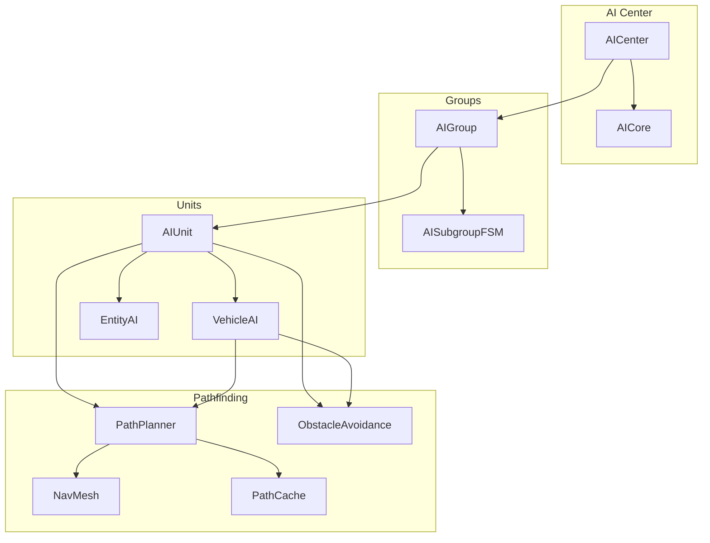
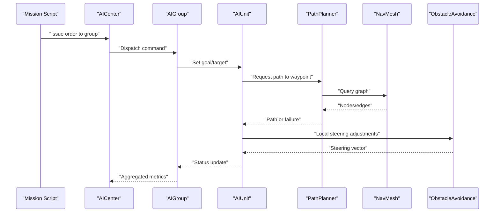
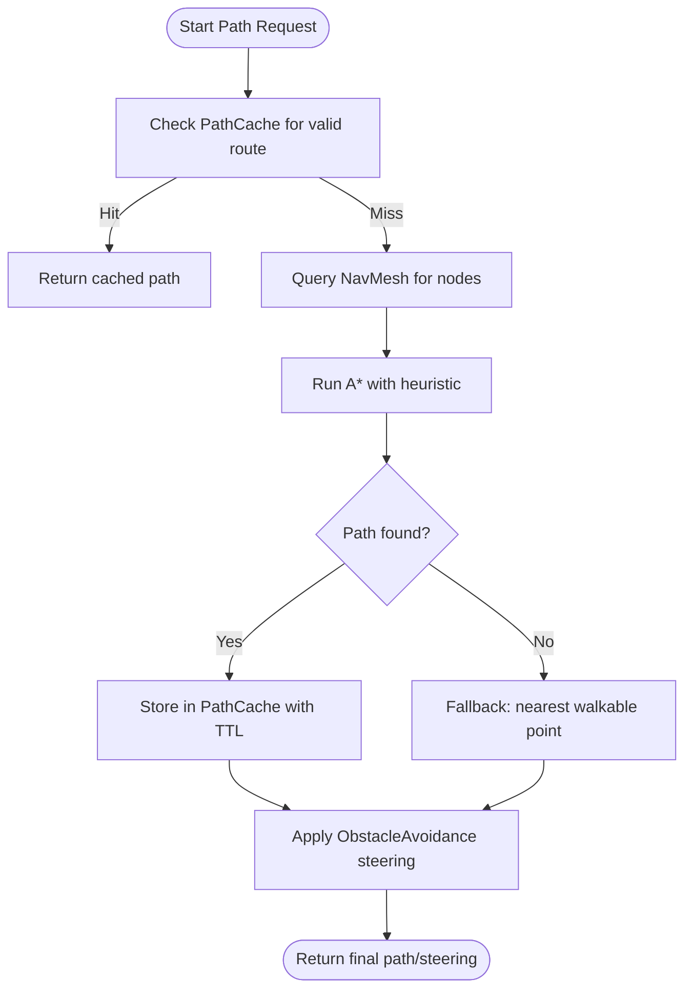
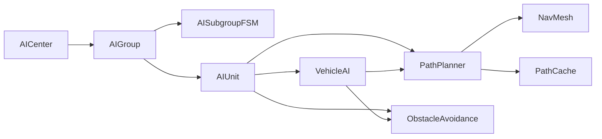

# AI and Pathfinding

<cite>
**Referenced Files in This Document**
- [AICenter.hpp](file://engine/Poseidon/AI/AICenter.hpp)
- [AICenter.cpp](file://engine/Poseidon/AI/AICenter.cpp)
- [AICenterImpl.cpp](file://engine/Poseidon/AI/AICenterImpl.cpp)
- [AICore.hpp](file://engine/Poseidon/AI/AICore.hpp)
- [AIGroup.hpp](file://engine/Poseidon/AI/AIGroup.hpp)
- [AIGroup.cpp](file://engine/Poseidon/AI/AIGroup.cpp)
- [AIGroupCmd.cpp](file://engine/Poseidon/AI/AIGroupCmd.cpp)
- [AISubgroupFSM.cpp](file://engine/Poseidon/AI/AISubgroupFSM.cpp)
- [AIUnit.hpp](file://engine/Poseidon/AI/AIUnit.hpp)
- [AIUnitImpl.cpp](file://engine/Poseidon/AI/AIUnitImpl.cpp)
- [VehicleAI.hpp](file://engine/Poseidon/AI/VehicleAI.hpp)
- [VehicleAICombat.cpp](file://engine/Poseidon/AI/VehicleAICombat.cpp)
- [EntityAI.hpp](file://engine/Poseidon/AI/EntityAI.hpp)
- [Path/PathPlanner.hpp](file://engine/Poseidon/AI/Path/PathPlanner.hpp)
- [Path/PathPlanner.cpp](file://engine/Poseidon/AI/Path/PathPlanner.cpp)
- [Path/NavMesh.hpp](file://engine/Poseidon/AI/Path/NavMesh.hpp)
- [Path/NavMesh.cpp](file://engine/Poseidon/AI/Path/NavMesh.cpp)
- [Path/PathCache.hpp](file://engine/Poseidon/AI/Path/PathCache.hpp)
- [Path/PathCache.cpp](file://engine/Poseidon/AI/Path/PathCache.cpp)
- [Path/ObstacleAvoidance.hpp](file://engine/Poseidon/AI/Path/ObstacleAvoidance.hpp)
- [Path/ObstacleAvoidance.cpp](file://engine/Poseidon/AI/Path/ObstacleAvoidance.cpp)
</cite>

## Table of Contents
1. Introduction
2. Project Structure
3. Core Components
4. Architecture Overview
5. Detailed Component Analysis
6. Dependency Analysis
7. Performance Considerations
8. Troubleshooting Guide
9. Conclusion

## Introduction
This document explains the AI and pathfinding systems that govern autonomous behavior for units and vehicles. It covers the AI center architecture, group management, unit control, pathfinding algorithms (including A*, waypoint navigation, and dynamic obstacle avoidance), decision-making via state machines and behavior trees, integration with combat and formation systems, and practical guidance for custom behaviors, configuration, debugging, and performance tuning at scale.

## Project Structure
The AI subsystem resides under engine/Poseidon/AI and is organized by responsibility:
- AI Center and Core: global coordination, scheduling, and shared services
- Groups and Subgroups: command hierarchy and tactical grouping
- Units and Vehicles: per-entity AI logic and execution
- Pathfinding: navigation mesh, planners, caching, and avoidance

**Diagram sources**
- [AICenter.hpp](file://engine/Poseidon/AI/AICenter.hpp)
- [AICore.hpp](file://engine/Poseidon/AI/AICore.hpp)
- [AIGroup.hpp](file://engine/Poseidon/AI/AIGroup.hpp)
- [AISubgroupFSM.cpp](file://engine/Poseidon/AI/AISubgroupFSM.cpp)
- [AIUnit.hpp](file://engine/Poseidon/AI/AIUnit.hpp)
- [VehicleAI.hpp](file://engine/Poseidon/AI/VehicleAI.hpp)
- [EntityAI.hpp](file://engine/Poseidon/AI/EntityAI.hpp)
- [Path/NavMesh.hpp](file://engine/Poseidon/AI/Path/NavMesh.hpp)
- [Path/PathPlanner.hpp](file://engine/Poseidon/AI/Path/PathPlanner.hpp)
- [Path/PathCache.hpp](file://engine/Poseidon/AI/Path/PathCache.hpp)
- [Path/ObstacleAvoidance.hpp](file://engine/Poseidon/AI/Path/ObstacleAvoidance.hpp)

**Section sources**
- [AICenter.hpp](file://engine/Poseidon/AI/AICenter.hpp)
- [AICore.hpp](file://engine/Poseidon/AI/AICore.hpp)
- [AIGroup.hpp](file://engine/Poseidon/AI/AIGroup.hpp)
- [AISubgroupFSM.cpp](file://engine/Poseidon/AI/AISubgroupFSM.cpp)
- [AIUnit.hpp](file://engine/Poseidon/AI/AIUnit.hpp)
- [VehicleAI.hpp](file://engine/Poseidon/AI/VehicleAI.hpp)
- [EntityAI.hpp](file://engine/Poseidon/AI/EntityAI.hpp)
- [Path/NavMesh.hpp](file://engine/Poseidon/AI/Path/NavMesh.hpp)
- [Path/PathPlanner.hpp](file://engine/Poseidon/AI/Path/PathPlanner.hpp)
- [Path/PathCache.hpp](file://engine/Poseidon/AI/Path/PathCache.hpp)
- [Path/ObstacleAvoidance.hpp](file://engine/Poseidon/AI/Path/ObstacleAvoidance.hpp)

## Core Components
- AI Center: orchestrates simulation ticks, dispatches commands to groups, manages resources, and exposes high-level APIs for mission scripts and gameplay systems.
- Group Management: hierarchical organization of units into squads and sub-squads; handles orders, cohesion, and tactical roles.
- Unit Control: per-unit decision loops, movement execution, perception inputs, and interaction with pathfinding and combat modules.
- Pathfinding: navigation mesh representation, A* planner, waypoint navigation, dynamic obstacle avoidance, and caching strategies.

Key responsibilities and interactions are detailed in the following sections.

**Section sources**
- [AICenter.cpp](file://engine/Poseidon/AI/AICenter.cpp)
- [AICenterImpl.cpp](file://engine/Poseidon/AI/AICenterImpl.cpp)
- [AIGroup.cpp](file://engine/Poseidon/AI/AIGroup.cpp)
- [AIGroupCmd.cpp](file://engine/Poseidon/AI/AIGroupCmd.cpp)
- [AIUnitImpl.cpp](file://engine/Poseidon/AI/AIUnitImpl.cpp)
- [Path/PathPlanner.cpp](file://engine/Poseidon/AI/Path/PathPlanner.cpp)
- [Path/NavMesh.cpp](file://engine/Poseidon/AI/Path/NavMesh.cpp)
- [Path/PathCache.cpp](file://engine/Poseidon/AI/Path/PathCache.cpp)
- [Path/ObstacleAvoidance.cpp](file://engine/Poseidon/AI/Path/ObstacleAvoidance.cpp)

## Architecture Overview
The AI system follows a layered architecture:
- Center layer schedules updates and coordinates groups
- Group layer translates high-level orders into tactical goals
- Unit layer executes decisions, queries pathfinding, and performs actions
- Pathfinding layer provides efficient routes and local avoidance

**Diagram sources**
- [AICenter.hpp](file://engine/Poseidon/AI/AICenter.hpp)
- [AIGroup.hpp](file://engine/Poseidon/AI/AIGroup.hpp)
- [AIUnit.hpp](file://engine/Poseidon/AI/AIUnit.hpp)
- [Path/PathPlanner.hpp](file://engine/Poseidon/AI/Path/PathPlanner.hpp)
- [Path/NavMesh.hpp](file://engine/Poseidon/AI/Path/NavMesh.hpp)
- [Path/ObstacleAvoidance.hpp](file://engine/Poseidon/AI/Path/ObstacleAvoidance.hpp)

## Detailed Component Analysis

### AI Center and Core
Responsibilities:
- Simulation tick orchestration and priority scheduling
- Command distribution to groups and lifecycle management
- Shared services such as profiling, logging, and resource access

Design highlights:
- Centralized API surface for mission scripts and gameplay systems
- Decoupled from unit-specific logic to maintain scalability

Implementation references:
- Public interface and core utilities
- Implementation details for scheduling and dispatch

**Section sources**
- [AICenter.hpp](file://engine/Poseidon/AI/AICenter.hpp)
- [AICore.hpp](file://engine/Poseidon/AI/AICore.hpp)
- [AICenter.cpp](file://engine/Poseidon/AI/AICenter.cpp)
- [AICenterImpl.cpp](file://engine/Poseidon/AI/AICenterImpl.cpp)

### Group Management and Commands
Responsibilities:
- Maintain squad structure and membership
- Translate high-level orders into tactical goals
- Coordinate subgroups and enforce formation rules

Behavioral aspects:
- FSM-driven subgroup behaviors for specialized roles
- Command queueing and validation

Implementation references:
- Group data model and operations
- Command processing pipeline
- Subgroup FSM states and transitions

**Section sources**
- [AIGroup.hpp](file://engine/Poseidon/AI/AIGroup.hpp)
- [AIGroup.cpp](file://engine/Poseidon/AI/AIGroup.cpp)
- [AIGroupCmd.cpp](file://engine/Poseidon/AI/AIGroupCmd.cpp)
- [AISubgroupFSM.cpp](file://engine/Poseidon/AI/AISubgroupFSM.cpp)

### Unit Control and Vehicle AI
Responsibilities:
- Per-unit decision loop, perception, and action execution
- Movement execution using path results and local steering
- Combat integration: target selection, engagement, suppression

Vehicle specifics:
- Specialized pilot and combat behaviors
- Integration with vehicle physics and constraints

Implementation references:
- Unit state machine and behavior tree hooks
- Vehicle AI modes and combat routines

**Section sources**
- [AIUnit.hpp](file://engine/Poseidon/AI/AIUnit.hpp)
- [AIUnitImpl.cpp](file://engine/Poseidon/AI/AIUnitImpl.cpp)
- [VehicleAI.hpp](file://engine/Poseidon/AI/VehicleAI.hpp)
- [VehicleAICombat.cpp](file://engine/Poseidon/AI/VehicleAICombat.cpp)
- [EntityAI.hpp](file://engine/Poseidon/AI/EntityAI.hpp)

### Pathfinding System
Responsibilities:
- Navigation mesh construction and queries
- A* path planning with heuristics and cost functions
- Waypoint navigation and dynamic obstacle avoidance
- Caching and incremental recalculation

Algorithmic overview:
- A* uses open/closed sets with heuristic evaluation
- NavMesh represents walkable areas and connectivity
- Obstacle avoidance applies steering forces based on nearby entities and terrain features

Implementation references:
- Planner implementation and parameters
- NavMesh data structures and queries
- Cache policies and invalidation
- Local avoidance algorithms

**Diagram sources**
- [Path/PathPlanner.cpp](file://engine/Poseidon/AI/Path/PathPlanner.cpp)
- [Path/NavMesh.cpp](file://engine/Poseidon/AI/Path/NavMesh.cpp)
- [Path/PathCache.cpp](file://engine/Poseidon/AI/Path/PathCache.cpp)
- [Path/ObstacleAvoidance.cpp](file://engine/Poseidon/AI/Path/ObstacleAvoidance.cpp)

**Section sources**
- [Path/PathPlanner.hpp](file://engine/Poseidon/AI/Path/PathPlanner.hpp)
- [Path/PathPlanner.cpp](file://engine/Poseidon/AI/Path/PathPlanner.cpp)
- [Path/NavMesh.hpp](file://engine/Poseidon/AI/Path/NavMesh.hpp)
- [Path/NavMesh.cpp](file://engine/Poseidon/AI/Path/NavMesh.cpp)
- [Path/PathCache.hpp](file://engine/Poseidon/AI/Path/PathCache.hpp)
- [Path/PathCache.cpp](file://engine/Poseidon/AI/Path/PathCache.cpp)
- [Path/ObstacleAvoidance.hpp](file://engine/Poseidon/AI/Path/ObstacleAvoidance.hpp)
- [Path/ObstacleAvoidance.cpp](file://engine/Poseidon/AI/Path/ObstacleAvoidance.cpp)

### Decision-Making: State Machines and Behavior Trees
- State machines drive high-level unit roles (patrol, engage, retreat) and subgroup tactics.
- Behavior trees provide modular composition of actions and conditions for fine-grained control.
- Integration points allow mission scripts to inject custom behaviors and override defaults.

Practical usage:
- Define states and transitions for common scenarios
- Compose behavior nodes for perception, decision, and action
- Use group-level FSMs to coordinate multi-unit tactics

**Section sources**
- [AISubgroupFSM.cpp](file://engine/Poseidon/AI/AISubgroupFSM.cpp)
- [AIUnitImpl.cpp](file://engine/Poseidon/AI/AIUnitImpl.cpp)

### Combat Integration and Tactical Positioning
- Unit AI selects targets based on threat assessment and line-of-sight.
- Engagement includes suppression, cover seeking, and flanking maneuvers.
- Formation maintenance ensures spacing and coverage while moving along paths.

Integration points:
- Perception feeds into decision logic
- Path planner respects tactical constraints (e.g., avoid exposed positions)
- Group commands influence positioning and firing lines

**Section sources**
- [VehicleAICombat.cpp](file://engine/Poseidon/AI/VehicleAICombat.cpp)
- [AIUnitImpl.cpp](file://engine/Poseidon/AI/AIUnitImpl.cpp)

## Dependency Analysis
The AI system exhibits clear separation between orchestration, group logic, unit execution, and pathfinding. Dependencies flow downward from Center to Groups to Units, with pathfinding used by both units and vehicles.

**Diagram sources**
- [AICenter.hpp](file://engine/Poseidon/AI/AICenter.hpp)
- [AIGroup.hpp](file://engine/Poseidon/AI/AIGroup.hpp)
- [AISubgroupFSM.cpp](file://engine/Poseidon/AI/AISubgroupFSM.cpp)
- [AIUnit.hpp](file://engine/Poseidon/AI/AIUnit.hpp)
- [VehicleAI.hpp](file://engine/Poseidon/AI/VehicleAI.hpp)
- [Path/PathPlanner.hpp](file://engine/Poseidon/AI/Path/PathPlanner.hpp)
- [Path/NavMesh.hpp](file://engine/Poseidon/AI/Path/NavMesh.hpp)
- [Path/PathCache.hpp](file://engine/Poseidon/AI/Path/PathCache.hpp)
- [Path/ObstacleAvoidance.hpp](file://engine/Poseidon/AI/Path/ObstacleAvoidance.hpp)

**Section sources**
- [AICenter.hpp](file://engine/Poseidon/AI/AICenter.hpp)
- [AIGroup.hpp](file://engine/Poseidon/AI/AIGroup.hpp)
- [AISubgroupFSM.cpp](file://engine/Poseidon/AI/AISubgroupFSM.cpp)
- [AIUnit.hpp](file://engine/Poseidon/AI/AIUnit.hpp)
- [VehicleAI.hpp](file://engine/Poseidon/AI/VehicleAI.hpp)
- [Path/PathPlanner.hpp](file://engine/Poseidon/AI/Path/PathPlanner.hpp)
- [Path/NavMesh.hpp](file://engine/Poseidon/AI/Path/NavMesh.hpp)
- [Path/PathCache.hpp](file://engine/Poseidon/AI/Path/PathCache.hpp)
- [Path/ObstacleAvoidance.hpp](file://engine/Poseidon/AI/Path/ObstacleAvoidance.hpp)

## Performance Considerations
- Batched updates: schedule unit updates in batches to reduce overhead and improve cache locality.
- Path caching: reuse computed paths when possible; implement TTL-based invalidation and region-based caches.
- Incremental recalculation: recompute only affected segments when obstacles change dynamically.
- Heuristic tuning: adjust A* heuristics and costs to balance accuracy and speed.
- Spatial partitioning: use grid or BVH structures for neighbor queries in obstacle avoidance.
- Level-of-detail: simplify decision logic for distant or low-priority units.
- Memory management: pool frequently allocated objects (paths, steering vectors).

[No sources needed since this section provides general guidance]

## Troubleshooting Guide
Common issues and diagnostics:
- Path failures: verify NavMesh validity and query bounds; check fallback logic to nearest walkable point.
- Stuttering: profile A* calls and consider reducing frequency or increasing cache hit rate.
- Jittery movement: tune obstacle avoidance parameters and smoothing filters.
- Formation drift: inspect group command resolution and spacing constraints.
- Combat misbehavior: validate perception ranges, target selection criteria, and suppression effects.

Debugging steps:
- Enable AI logs and telemetry for path requests, planner stats, and avoidance forces.
- Visualize NavMesh and active paths during development.
- Isolate problematic units/groups and replay their decision history.

**Section sources**
- [Path/PathPlanner.cpp](file://engine/Poseidon/AI/Path/PathPlanner.cpp)
- [Path/NavMesh.cpp](file://engine/Poseidon/AI/Path/NavMesh.cpp)
- [Path/ObstacleAvoidance.cpp](file://engine/Poseidon/AI/Path/ObstacleAvoidance.cpp)
- [AIGroupCmd.cpp](file://engine/Poseidon/AI/AIGroupCmd.cpp)
- [AIUnitImpl.cpp](file://engine/Poseidon/AI/AIUnitImpl.cpp)

## Conclusion
The AI and pathfinding systems provide a scalable, modular framework for autonomous behavior. The AI Center coordinates groups and units, which leverage robust pathfinding and local avoidance to execute tactical objectives. By tuning heuristics, caching strategies, and decision logic, developers can achieve responsive and performant AI suitable for large-scale simulations. Practical customization through FSMs and behavior trees enables rich, mission-specific behaviors while maintaining stability and efficiency.