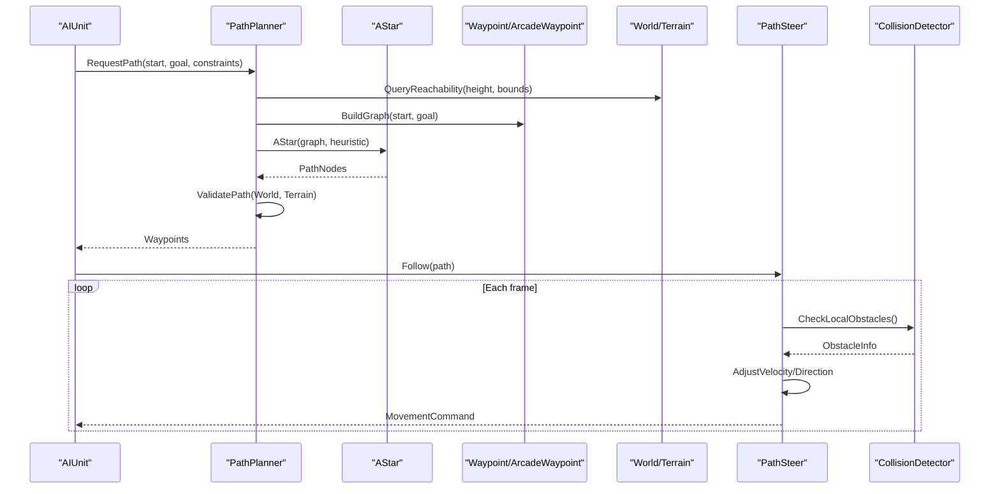
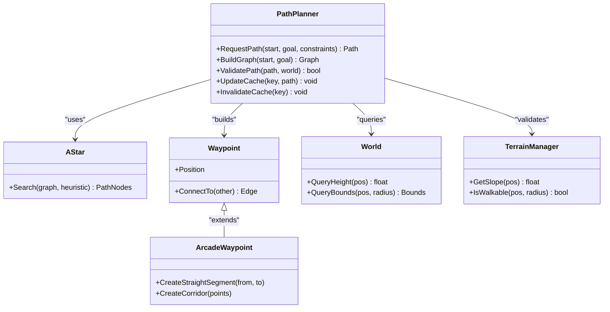
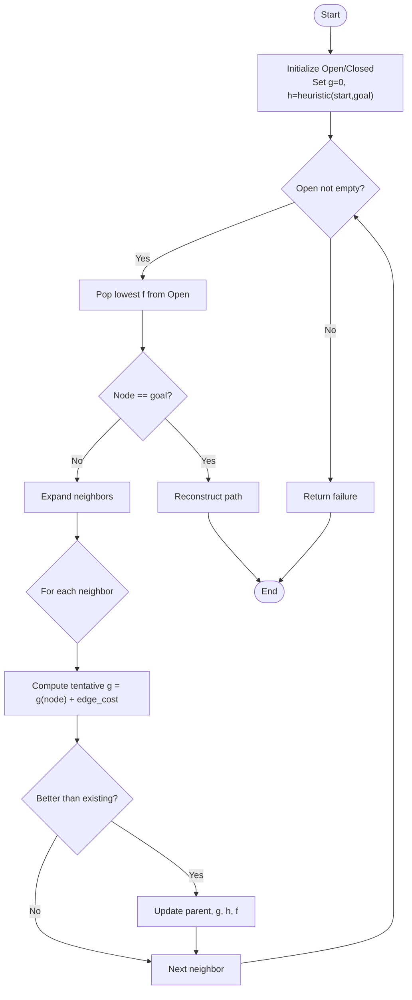
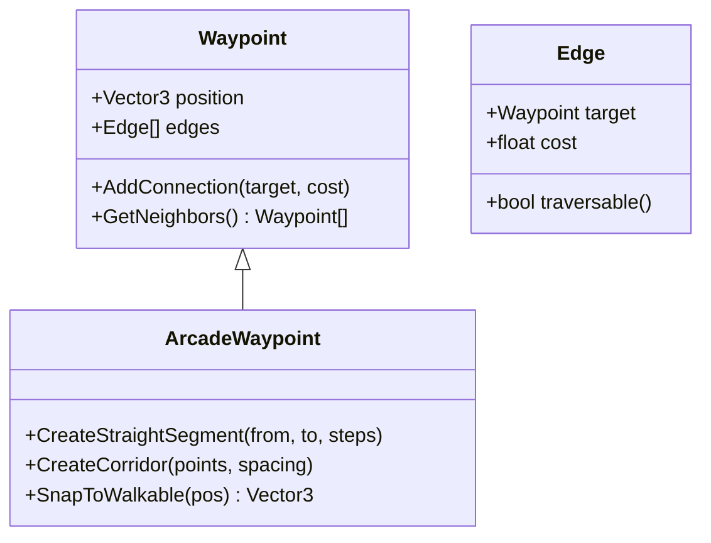
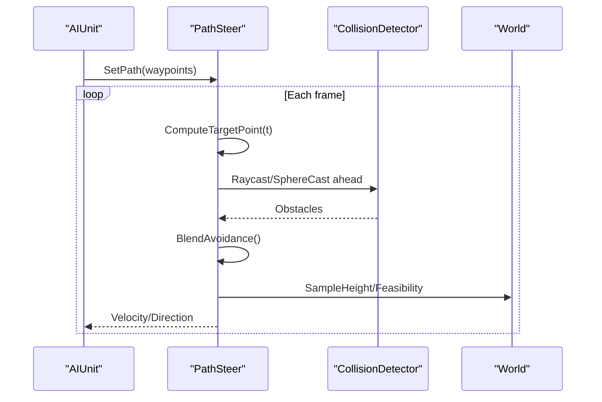
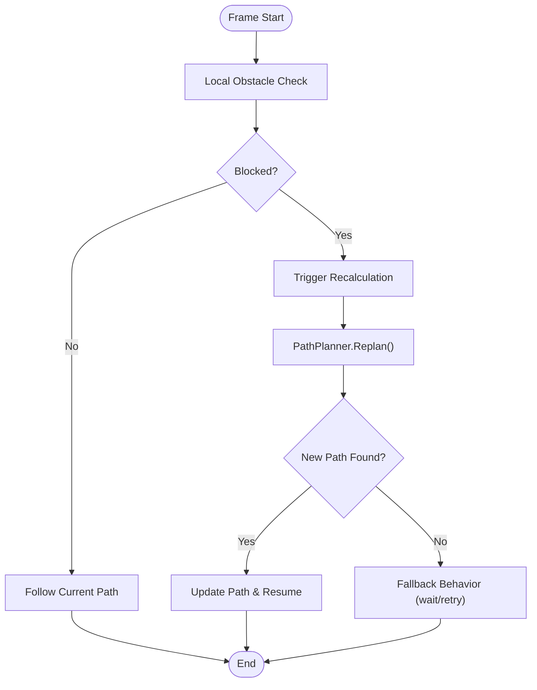
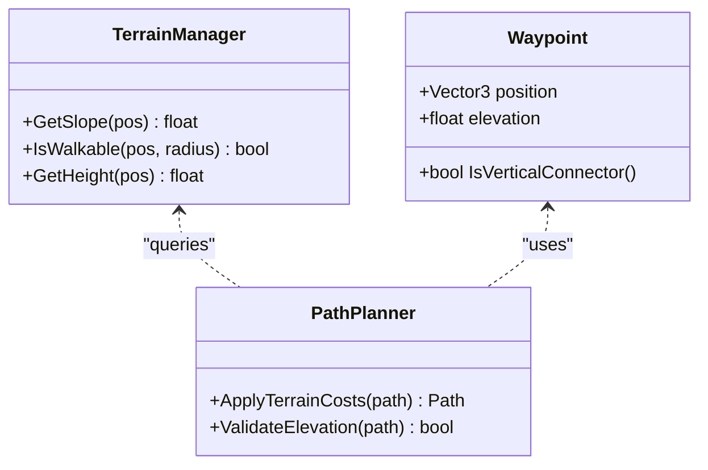
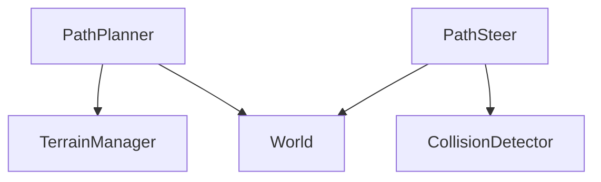
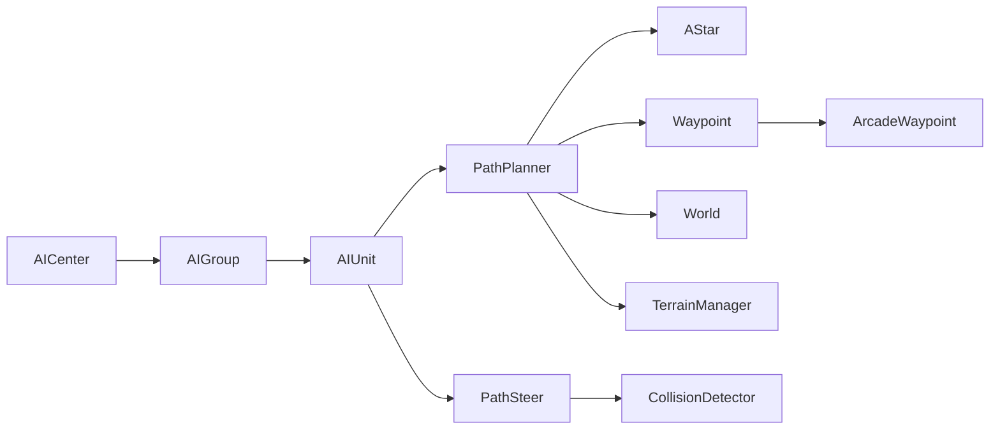

# Pathfinding Algorithms and Navigation

<cite>
**Referenced Files in This Document**
- [AIArcade.cpp](file://engine/Poseidon/AI/AIArcade.cpp)
- [AICenter.hpp](file://engine/Poseidon/AI/AICenter.hpp)
- [AIGroupImpl.cpp](file://engine/Poseidon/AI/AIGroupImpl.cpp)
- [AIUnitImpl.cpp](file://engine/Poseidon/AI/AIUnitImpl.cpp)
- [Path/PathPlanner.hpp](file://engine/Poseidon/AI/Path/PathPlanner.hpp)
- [Path/PathPlanner.cpp](file://engine/Poseidon/AI/Path/PathPlanner.cpp)
- [Path/PathSteer.hpp](file://engine/Poseidon/AI/Path/PathSteer.hpp)
- [Path/PathSteer.cpp](file://engine/Poseidon/AI/Path/PathSteer.cpp)
- [Path/AStar.hpp](file://engine/Poseidon/AI/Path/AStar.hpp)
- [Path/AStar.cpp](file://engine/Poseidon/AI/Path/AStar.cpp)
- [Path/Waypoint.hpp](file://engine/Poseidon/AI/Path/Waypoint.hpp)
- [Path/Waypoint.cpp](file://engine/Poseidon/AI/Path/Waypoint.cpp)
- [ArcadeWaypoint.hpp](file://engine/Poseidon/AI/ArcadeWaypoint.hpp)
- [ArcadeWaypoint.cpp](file://engine/Poseidon/AI/ArcadeWaypoint.cpp)
- [World.hpp](file://engine/Poseidon/World/World.hpp)
- [WorldImpl.cpp](file://engine/Poseidon/World/WorldImpl.cpp)
- [Terrain/TerrainManager.hpp](file://engine/Poseidon/World/Terrain/TerrainManager.hpp)
- [Detection/CollisionDetector.hpp](file://engine/Poseidon/World/Detection/CollisionDetector.hpp)
</cite>

## Table of Contents
1. [Introduction](#introduction)
2. [Project Structure](#project-structure)
3. [Core Components](#core-components)
4. [Architecture Overview](#architecture-overview)
5. [Detailed Component Analysis](#detailed-component-analysis)
6. [Dependency Analysis](#dependency-analysis)
7. [Performance Considerations](#performance-considerations)
8. [Troubleshooting Guide](#troubleshooting-guide)
9. [Conclusion](#conclusion)
10. [Appendices](#appendices)

## Introduction
This document explains the pathfinding and navigation systems implemented in the engine’s AI layer. It focuses on the PathPlanner architecture, A* algorithm implementation, waypoint-based navigation with ArcadeWaypoint, and smooth movement via PathSteer. It also covers obstacle detection, dynamic path recalculation, terrain adaptation, and integration with world geometry and collision detection. Practical guidance is provided for configuring parameters, creating custom waypoints, debugging path generation, and optimizing performance through caching, hierarchical pathfinding, and distributed computation strategies.

## Project Structure
The pathfinding system resides under the Poseidon AI module, with dedicated components for planning, steering, and waypoints. World integration is handled by the World subsystem, which exposes geometry and collision queries used by the planner and steersman.

```mermaid
graph TB
subgraph "AI"
AICenter["AICenter"]
AIGroup["AIGroup"]
AIUnit["AIUnit"]
PathPlanner["PathPlanner"]
AStar["AStar"]
Waypoint["Waypoint"]
ArcadeWaypoint["ArcadeWaypoint"]
PathSteer["PathSteer"]
end
subgraph "World"
World["World"]
Terrain["TerrainManager"]
Collision["CollisionDetector"]
end
AICenter --> AIGroup
AIGroup --> AIUnit
AIUnit --> PathPlanner
PathPlanner --> AStar
PathPlanner --> Waypoint
Waypoint --> ArcadeWaypoint
AIUnit --> PathSteer
PathPlanner --> World
PathPlanner --> Terrain
PathSteer --> Collision
PathSteer --> World
```

**Diagram sources**
- [AICenter.hpp](file://engine/Poseidon/AI/AICenter.hpp)
- [AIGroupImpl.cpp](file://engine/Poseidon/AI/AIGroupImpl.cpp)
- [AIUnitImpl.cpp](file://engine/Poseidon/AI/AIUnitImpl.cpp)
- [PathPlanner.hpp](file://engine/Poseidon/AI/Path/PathPlanner.hpp)
- [AStar.hpp](file://engine/Poseidon/AI/Path/AStar.hpp)
- [Waypoint.hpp](file://engine/Poseidon/AI/Path/Waypoint.hpp)
- [ArcadeWaypoint.hpp](file://engine/Poseidon/AI/ArcadeWaypoint.hpp)
- [PathSteer.hpp](file://engine/Poseidon/AI/Path/PathSteer.hpp)
- [World.hpp](file://engine/Poseidon/World/World.hpp)
- [Terrain/TerrainManager.hpp](file://engine/Poseidon/World/Terrain/TerrainManager.hpp)
- [Detection/CollisionDetector.hpp](file://engine/Poseidon/World/Detection/CollisionDetector.hpp)

**Section sources**
- [AICenter.hpp](file://engine/Poseidon/AI/AICenter.hpp)
- [AIGroupImpl.cpp](file://engine/Poseidon/AI/AIGroupImpl.cpp)
- [AIUnitImpl.cpp](file://engine/Poseidon/AI/AIUnitImpl.cpp)
- [PathPlanner.hpp](file://engine/Poseidon/AI/Path/PathPlanner.hpp)
- [AStar.hpp](file://engine/Poseidon/AI/Path/AStar.hpp)
- [Waypoint.hpp](file://engine/Poseidon/AI/Path/Waypoint.hpp)
- [ArcadeWaypoint.hpp](file://engine/Poseidon/AI/ArcadeWaypoint.hpp)
- [PathSteer.hpp](file://engine/Poseidon/AI/Path/PathSteer.hpp)
- [World.hpp](file://engine/Poseidon/World/World.hpp)
- [Terrain/TerrainManager.hpp](file://engine/Poseidon/World/Terrain/TerrainManager.hpp)
- [Detection/CollisionDetector.hpp](file://engine/Poseidon/World/Detection/CollisionDetector.hpp)

## Core Components
- PathPlanner: Orchestrates path search and validation against world geometry and terrain. It composes A* with waypoint graphs and supports dynamic updates when obstacles change.
- AStar: Implements the classic heuristic-driven graph search to compute optimal or near-optimal paths across a discretized or graph-based representation.
- Waypoint and ArcadeWaypoint: Define nodes and simplified navigation constructs for common scenarios (e.g., straight-line segments, corridors).
- PathSteer: Interpolates along computed paths to produce smooth movement, handling local avoidance and speed control.
- World Integration: Uses World and TerrainManager for height sampling and reachability; uses CollisionDetector for real-time obstacle checks.

Key responsibilities:
- Graph construction and caching
- Heuristic design and cost modeling
- Dynamic recalculation triggers
- Smooth interpolation and steering behaviors
- Terrain adaptation and multi-level support

**Section sources**
- [PathPlanner.hpp](file://engine/Poseidon/AI/Path/PathPlanner.hpp)
- [PathPlanner.cpp](file://engine/Poseidon/AI/Path/PathPlanner.cpp)
- [AStar.hpp](file://engine/Poseidon/AI/Path/AStar.hpp)
- [AStar.cpp](file://engine/Poseidon/AI/Path/AStar.cpp)
- [Waypoint.hpp](file://engine/Poseidon/AI/Path/Waypoint.hpp)
- [Waypoint.cpp](file://engine/Poseidon/AI/Path/Waypoint.cpp)
- [ArcadeWaypoint.hpp](file://engine/Poseidon/AI/ArcadeWaypoint.hpp)
- [ArcadeWaypoint.cpp](file://engine/Poseidon/AI/ArcadeWaypoint.cpp)
- [PathSteer.hpp](file://engine/Poseidon/AI/Path/PathSteer.hpp)
- [PathSteer.cpp](file://engine/Poseidon/AI/Path/PathSteer.cpp)
- [World.hpp](file://engine/Poseidon/World/World.hpp)
- [WorldImpl.cpp](file://engine/Poseidon/World/WorldImpl.cpp)
- [Terrain/TerrainManager.hpp](file://engine/Poseidon/World/Terrain/TerrainManager.hpp)
- [Detection/CollisionDetector.hpp](file://engine/Poseidon/World/Detection/CollisionDetector.hpp)

## Architecture Overview
The AI units request paths from PathPlanner, which builds or retrieves a graph, runs A*, and returns a sequence of waypoints. PathSteer consumes this sequence to drive smooth motion while continuously checking collisions and adapting to dynamic changes.



**Diagram sources**
- [AIUnitImpl.cpp](file://engine/Poseidon/AI/AIUnitImpl.cpp)
- [PathPlanner.cpp](file://engine/Poseidon/AI/Path/PathPlanner.cpp)
- [AStar.cpp](file://engine/Poseidon/AI/Path/AStar.cpp)
- [Waypoint.cpp](file://engine/Poseidon/AI/Path/Waypoint.cpp)
- [ArcadeWaypoint.cpp](file://engine/Poseidon/AI/ArcadeWaypoint.cpp)
- [WorldImpl.cpp](file://engine/Poseidon/World/WorldImpl.cpp)
- [PathSteer.cpp](file://engine/Poseidon/AI/Path/PathSteer.cpp)
- [Detection/CollisionDetector.hpp](file://engine/Poseidon/World/Detection/CollisionDetector.hpp)

## Detailed Component Analysis

### PathPlanner Architecture
PathPlanner coordinates graph creation, search execution, and post-processing validation. It integrates with World and Terrain to ensure paths are feasible given heights and obstacles. It supports caching and incremental updates when the environment changes.

Key aspects:
- Graph abstraction over waypoints and edges
- Heuristic selection based on scenario type
- Validation passes for terrain feasibility and collision clearance
- Cache management keyed by start/goal and constraints



**Diagram sources**
- [PathPlanner.hpp](file://engine/Poseidon/AI/Path/PathPlanner.hpp)
- [PathPlanner.cpp](file://engine/Poseidon/AI/Path/PathPlanner.cpp)
- [AStar.hpp](file://engine/Poseidon/AI/Path/AStar.hpp)
- [Waypoint.hpp](file://engine/Poseidon/AI/Path/Waypoint.hpp)
- [ArcadeWaypoint.hpp](file://engine/Poseidon/AI/ArcadeWaypoint.hpp)
- [World.hpp](file://engine/Poseidon/World/World.hpp)
- [Terrain/TerrainManager.hpp](file://engine/Poseidon/World/Terrain/TerrainManager.hpp)

**Section sources**
- [PathPlanner.hpp](file://engine/Poseidon/AI/Path/PathPlanner.hpp)
- [PathPlanner.cpp](file://engine/Poseidon/AI/Path/PathPlanner.cpp)
- [World.hpp](file://engine/Poseidon/World/World.hpp)
- [Terrain/TerrainManager.hpp](file://engine/Poseidon/World/Terrain/TerrainManager.hpp)

### A* Algorithm Implementation
AStar implements the standard open/closed set approach with a priority queue. The heuristic can be tuned per scenario (Manhattan, Euclidean, or terrain-aware). Cost functions incorporate edge weights and penalties for difficult terrain.



**Diagram sources**
- [AStar.hpp](file://engine/Poseidon/AI/Path/AStar.hpp)
- [AStar.cpp](file://engine/Poseidon/AI/Path/AStar.cpp)

**Section sources**
- [AStar.hpp](file://engine/Poseidon/AI/Path/AStar.hpp)
- [AStar.cpp](file://engine/Poseidon/AI/Path/AStar.cpp)

### Waypoint-Based Navigation and ArcadeWaypoint
Waypoints represent navigable positions and connections. ArcadeWaypoint provides convenience constructors for common patterns like straight segments and corridors, simplifying path definition for typical environments.



**Diagram sources**
- [Waypoint.hpp](file://engine/Poseidon/AI/Path/Waypoint.hpp)
- [Waypoint.cpp](file://engine/Poseidon/AI/Path/Waypoint.cpp)
- [ArcadeWaypoint.hpp](file://engine/Poseidon/AI/ArcadeWaypoint.hpp)
- [ArcadeWaypoint.cpp](file://engine/Poseidon/AI/ArcadeWaypoint.cpp)

**Section sources**
- [Waypoint.hpp](file://engine/Poseidon/AI/Path/Waypoint.hpp)
- [Waypoint.cpp](file://engine/Poseidon/AI/Path/Waypoint.cpp)
- [ArcadeWaypoint.hpp](file://engine/Poseidon/AI/ArcadeWaypoint.hpp)
- [ArcadeWaypoint.cpp](file://engine/Poseidon/AI/ArcadeWaypoint.cpp)

### PathSteer for Smooth Movement Interpolation
PathSteer consumes a waypoint path and produces continuous movement commands. It interpolates between points, adjusts velocity based on curvature, and applies local avoidance using collision data.



**Diagram sources**
- [PathSteer.hpp](file://engine/Poseidon/AI/Path/PathSteer.hpp)
- [PathSteer.cpp](file://engine/Poseidon/AI/Path/PathSteer.cpp)
- [Detection/CollisionDetector.hpp](file://engine/Poseidon/World/Detection/CollisionDetector.hpp)
- [World.hpp](file://engine/Poseidon/World/World.hpp)

**Section sources**
- [PathSteer.hpp](file://engine/Poseidon/AI/Path/PathSteer.hpp)
- [PathSteer.cpp](file://engine/Poseidon/AI/Path/PathSteer.cpp)
- [Detection/CollisionDetector.hpp](file://engine/Poseidon/World/Detection/CollisionDetector.hpp)
- [World.hpp](file://engine/Poseidon/World/World.hpp)

### Obstacle Detection and Dynamic Recalculation
Dynamic recalculation is triggered when local obstacles block the planned path or when global changes invalidate cached paths. PathSteer performs frequent local checks, while PathPlanner may re-run A* if necessary.



**Diagram sources**
- [PathSteer.cpp](file://engine/Poseidon/AI/Path/PathSteer.cpp)
- [PathPlanner.cpp](file://engine/Poseidon/AI/Path/PathPlanner.cpp)
- [Detection/CollisionDetector.hpp](file://engine/Poseidon/World/Detection/CollisionDetector.hpp)

**Section sources**
- [PathSteer.cpp](file://engine/Poseidon/AI/Path/PathSteer.cpp)
- [PathPlanner.cpp](file://engine/Poseidon/AI/Path/PathPlanner.cpp)
- [Detection/CollisionDetector.hpp](file://engine/Poseidon/World/Detection/CollisionDetector.hpp)

### Terrain Adaptation and Multi-Level Structures
TerrainManager provides slope and walkability queries. PathPlanner incorporates these into edge costs and validates path feasibility. For multi-level structures, waypoints can include elevation metadata and vertical connectors.



**Diagram sources**
- [Terrain/TerrainManager.hpp](file://engine/Poseidon/World/Terrain/TerrainManager.hpp)
- [Waypoint.hpp](file://engine/Poseidon/AI/Path/Waypoint.hpp)
- [PathPlanner.hpp](file://engine/Poseidon/AI/Path/PathPlanner.hpp)

**Section sources**
- [Terrain/TerrainManager.hpp](file://engine/Poseidon/World/Terrain/TerrainManager.hpp)
- [Waypoint.hpp](file://engine/Poseidon/AI/Path/Waypoint.hpp)
- [PathPlanner.hpp](file://engine/Poseidon/AI/Path/PathPlanner.hpp)

### Integration with World Geometry and Collision Detection
World and CollisionDetector expose geometry queries and collision primitives. PathPlanner uses them during graph building and validation; PathSteer uses them for local avoidance.



**Diagram sources**
- [World.hpp](file://engine/Poseidon/World/World.hpp)
- [WorldImpl.cpp](file://engine/Poseidon/World/WorldImpl.cpp)
- [Terrain/TerrainManager.hpp](file://engine/Poseidon/World/Terrain/TerrainManager.hpp)
- [Detection/CollisionDetector.hpp](file://engine/Poseidon/World/Detection/CollisionDetector.hpp)
- [PathPlanner.hpp](file://engine/Poseidon/AI/Path/PathPlanner.hpp)
- [PathSteer.hpp](file://engine/Poseidon/AI/Path/PathSteer.hpp)

**Section sources**
- [World.hpp](file://engine/Poseidon/World/World.hpp)
- [WorldImpl.cpp](file://engine/Poseidon/World/WorldImpl.cpp)
- [Terrain/TerrainManager.hpp](file://engine/Poseidon/World/Terrain/TerrainManager.hpp)
- [Detection/CollisionDetector.hpp](file://engine/Poseidon/World/Detection/CollisionDetector.hpp)
- [PathPlanner.hpp](file://engine/Poseidon/AI/Path/PathPlanner.hpp)
- [PathSteer.hpp](file://engine/Poseidon/AI/Path/PathSteer.hpp)

## Dependency Analysis
The AI layer depends on World and its subsystems for geometry and collision. PathPlanner depends on AStar and Waypoint abstractions. PathSteer depends on CollisionDetector and World for real-time adjustments.



**Diagram sources**
- [AICenter.hpp](file://engine/Poseidon/AI/AICenter.hpp)
- [AIGroupImpl.cpp](file://engine/Poseidon/AI/AIGroupImpl.cpp)
- [AIUnitImpl.cpp](file://engine/Poseidon/AI/AIUnitImpl.cpp)
- [PathPlanner.hpp](file://engine/Poseidon/AI/Path/PathPlanner.hpp)
- [AStar.hpp](file://engine/Poseidon/AI/Path/AStar.hpp)
- [Waypoint.hpp](file://engine/Poseidon/AI/Path/Waypoint.hpp)
- [ArcadeWaypoint.hpp](file://engine/Poseidon/AI/ArcadeWaypoint.hpp)
- [PathSteer.hpp](file://engine/Poseidon/AI/Path/PathSteer.hpp)
- [World.hpp](file://engine/Poseidon/World/World.hpp)
- [Terrain/TerrainManager.hpp](file://engine/Poseidon/World/Terrain/TerrainManager.hpp)
- [Detection/CollisionDetector.hpp](file://engine/Poseidon/World/Detection/CollisionDetector.hpp)

**Section sources**
- [AICenter.hpp](file://engine/Poseidon/AI/AICenter.hpp)
- [AIGroupImpl.cpp](file://engine/Poseidon/AI/AIGroupImpl.cpp)
- [AIUnitImpl.cpp](file://engine/Poseidon/AI/AIUnitImpl.cpp)
- [PathPlanner.hpp](file://engine/Poseidon/AI/Path/PathPlanner.hpp)
- [AStar.hpp](file://engine/Poseidon/AI/Path/AStar.hpp)
- [Waypoint.hpp](file://engine/Poseidon/AI/Path/Waypoint.hpp)
- [ArcadeWaypoint.hpp](file://engine/Poseidon/AI/ArcadeWaypoint.hpp)
- [PathSteer.hpp](file://engine/Poseidon/AI/Path/PathSteer.hpp)
- [World.hpp](file://engine/Poseidon/World/World.hpp)
- [Terrain/TerrainManager.hpp](file://engine/Poseidon/World/Terrain/TerrainManager.hpp)
- [Detection/CollisionDetector.hpp](file://engine/Poseidon/World/Detection/CollisionDetector.hpp)

## Performance Considerations
- Path Caching: Key cache entries by start/goal and constraint sets; invalidate on world changes.
- Hierarchical Pathfinding: Use coarse graphs for long-range planning and fine graphs locally to reduce search space.
- Distributed Computation: Offload heavy searches to background threads; merge results safely.
- Heuristic Tuning: Select heuristics that match map topology; consider admissibility vs. consistency trade-offs.
- Batched Queries: Group World/Terrain/Collision queries to minimize overhead.
- Incremental Updates: Recompute only affected portions of the graph when obstacles change.

[No sources needed since this section provides general guidance]

## Troubleshooting Guide
Common issues and resolutions:
- No Path Found: Verify connectivity of waypoints; check terrain walkability and elevation constraints; adjust heuristic and cost weights.
- Jagged Paths: Increase waypoint density or smoothing; tune PathSteer interpolation parameters.
- Frequent Recalculation: Reduce sensitivity thresholds; implement better caching keys; use hierarchical planning.
- Stuttering Movement: Lower collision query frequency; increase lookahead distance; balance avoidance strength.
- Multi-Level Errors: Ensure vertical connectors exist; validate elevation metadata; confirm World height queries return correct values.

Debugging tips:
- Log graph nodes and edges during build
- Visualize planned paths and steer targets
- Record collision raycasts and avoidance decisions
- Profile AStar open/closed set sizes and expansion counts

**Section sources**
- [PathPlanner.cpp](file://engine/Poseidon/AI/Path/PathPlanner.cpp)
- [AStar.cpp](file://engine/Poseidon/AI/Path/AStar.cpp)
- [PathSteer.cpp](file://engine/Poseidon/AI/Path/PathSteer.cpp)
- [Detection/CollisionDetector.hpp](file://engine/Poseidon/World/Detection/CollisionDetector.hpp)
- [WorldImpl.cpp](file://engine/Poseidon/World/WorldImpl.cpp)

## Conclusion
The pathfinding and navigation system combines robust planning (PathPlanner and A*) with flexible waypoint definitions (Waypoint and ArcadeWaypoint) and smooth movement (PathSteer). Tight integration with World, Terrain, and Collision enables realistic behavior across diverse environments. With careful parameter tuning, caching, and hierarchical strategies, the system scales to large maps and complex scenarios while maintaining responsiveness.

[No sources needed since this section summarizes without analyzing specific files]

## Appendices

### Configuration Examples
- Urban Environments: Use dense waypoint grids, higher collision clearance, and conservative speeds.
- Open Terrain: Sparse waypoints, longer lookahead, lower avoidance intensity.
- Multi-Level Structures: Include vertical connectors, elevation-aware costs, and level-specific caches.

### Creating Custom Waypoints
- Extend Waypoint to add specialized properties (e.g., cover, chokepoints).
- Implement connection rules and cost modifiers for domain-specific constraints.
- Integrate with PathPlanner graph builder to include custom edges.

### Debugging Path Generation
- Enable verbose logging for AStar expansions and PathPlanner validations.
- Render waypoint graphs and planned paths for visual inspection.
- Capture snapshots of World state at failure points for replay analysis.

[No sources needed since this section provides general guidance]